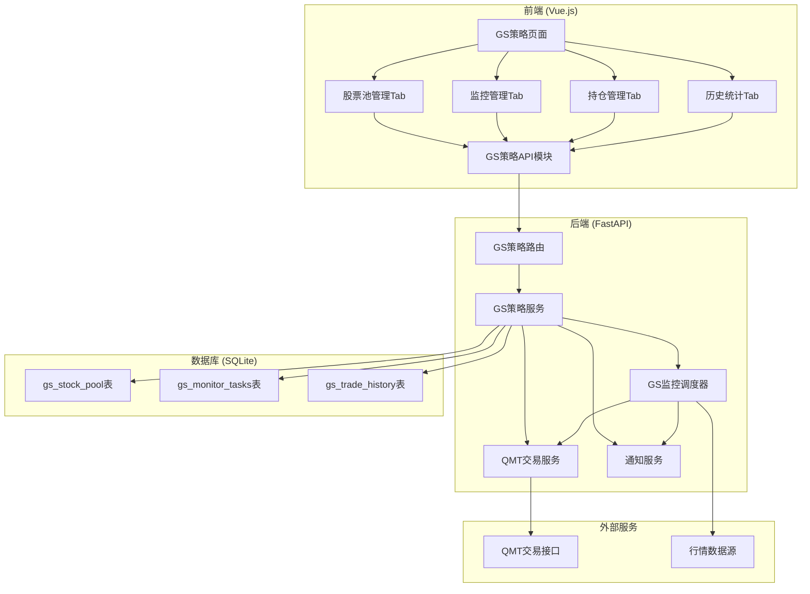

# Design Document: GS Strategy Module

## Overview

GS策略模块是一个独立的量化交易管理系统，集成在现有的投资管理菜单下。该模块提供股票池管理、监控队列管理、QMT持仓查看和历史交易统计四大功能，通过Tab页面进行组织。系统基于现有的GS策略算法（`backend/app/policy/gs.py`）执行买卖信号计算，并通过QMT服务（`backend/app/services/qmt_service.py`）执行实际交易。

## Architecture



## Components and Interfaces

### Frontend Components

#### 1. GS策略主页面 (`frontend/src/views/gs-strategy/index.vue`)
- 四个Tab页的容器组件
- 管理Tab切换状态

#### 2. 股票池管理组件 (`StockPoolTab.vue`)
- 股票列表表格（代码、名称、添加时间、操作）
- 添加股票对话框
- 搜索过滤功能
- 加入监控按钮（弹出监测间隔配置）

#### 3. 监控管理组件 (`MonitorTab.vue`)
- 监控任务列表（代码、名称、启动时间、运行时长、执行次数、状态）
- 暂停/恢复/移除操作按钮
- 运行时长实时更新

#### 4. 持仓管理组件 (`PositionTab.vue`)
- QMT持仓列表
- 账户概览信息
- 刷新按钮

#### 5. 历史统计组件 (`HistoryTab.vue`)
- 完整交易记录表格
- 统计汇总卡片（总交易数、胜率、总盈亏）
- 日期范围筛选

### Backend Components

#### 1. GS策略路由 (`backend/app/api/v1/gs_strategy.py`)

```python
# API端点设计
GET    /api/v1/gs-strategy/stock-pool          # 获取股票池列表
POST   /api/v1/gs-strategy/stock-pool          # 添加股票到池
DELETE /api/v1/gs-strategy/stock-pool/{id}     # 从池中删除股票

GET    /api/v1/gs-strategy/monitors            # 获取监控任务列表
POST   /api/v1/gs-strategy/monitors            # 创建监控任务
PUT    /api/v1/gs-strategy/monitors/{id}       # 更新监控任务
DELETE /api/v1/gs-strategy/monitors/{id}       # 删除监控任务
POST   /api/v1/gs-strategy/monitors/{id}/start # 启动监控
POST   /api/v1/gs-strategy/monitors/{id}/stop  # 停止监控

GET    /api/v1/gs-strategy/positions           # 获取QMT持仓
GET    /api/v1/gs-strategy/history             # 获取交易历史
GET    /api/v1/gs-strategy/statistics          # 获取统计数据
```

#### 2. GS策略服务 (`backend/app/services/gs_strategy_service.py`)

```python
class GSStrategyService:
    """GS策略服务类"""
    
    # 股票池管理
    async def get_stock_pool() -> List[Dict]
    async def add_to_stock_pool(stock_code: str, stock_name: str) -> Dict
    async def remove_from_stock_pool(stock_id: int) -> bool
    
    # 监控管理
    async def get_monitors() -> List[Dict]
    async def create_monitor(stock_id: int, interval: int) -> Dict
    async def update_monitor(monitor_id: int, data: Dict) -> Dict
    async def delete_monitor(monitor_id: int) -> bool
    async def start_monitor(monitor_id: int) -> Dict
    async def stop_monitor(monitor_id: int) -> Dict
    
    # 持仓和历史
    async def get_positions() -> Dict
    async def get_trade_history(start_date: str, end_date: str) -> List[Dict]
    async def get_statistics() -> Dict
```

#### 3. GS监控调度器 (`backend/app/services/gs_scheduler.py`)

```python
class GSScheduler:
    """GS策略监控调度器"""
    
    _monitoring_threads: Dict[int, threading.Thread]
    _stop_flags: Dict[int, threading.Event]
    
    def start_monitor(monitor_id: int, interval: int)
    def stop_monitor(monitor_id: int)
    def _monitor_loop(monitor_id: int, interval: int, stop_flag: Event)
    def _execute_strategy(stock_code: str) -> Dict
    def _handle_buy_signal(stock_code: str, signal_data: Dict)
    def _handle_sell_signal(stock_code: str, signal_data: Dict)
```

### API Interfaces

#### 前端API模块 (`frontend/src/api/gs-strategy.js`)

```javascript
// 股票池API
export function getStockPool(params)
export function addToStockPool(data)
export function removeFromStockPool(id)

// 监控API
export function getMonitors(params)
export function createMonitor(data)
export function updateMonitor(id, data)
export function deleteMonitor(id)
export function startMonitor(id)
export function stopMonitor(id)

// 持仓和历史API
export function getPositions()
export function getTradeHistory(params)
export function getStatistics()
```

## Data Models

### 1. 股票池表 (`gs_stock_pool`)

```python
class GSStockPool(Base):
    __tablename__ = "gs_stock_pool"
    
    id = Column(Integer, primary_key=True)
    stock_code = Column(String(20), nullable=False, unique=True, index=True)
    stock_name = Column(String(100))
    created_at = Column(DateTime, server_default=func.now())
    updated_at = Column(DateTime, onupdate=func.now())
```

### 2. 监控任务表 (`gs_monitor_tasks`)

```python
class GSMonitorTask(Base):
    __tablename__ = "gs_monitor_tasks"
    
    id = Column(Integer, primary_key=True)
    stock_pool_id = Column(Integer, ForeignKey('gs_stock_pool.id'))
    stock_code = Column(String(20), nullable=False, index=True)
    stock_name = Column(String(100))
    interval = Column(Integer, default=300)  # 监测间隔（秒）
    status = Column(String(20), default='stopped')  # running/stopped
    started_at = Column(DateTime)  # 监控启动时间
    execution_count = Column(Integer, default=0)  # 策略执行次数
    last_signal = Column(String(20))  # 最后信号: buy/sell/hold
    last_signal_time = Column(DateTime)
    created_at = Column(DateTime, server_default=func.now())
    updated_at = Column(DateTime, onupdate=func.now())
```

### 3. 交易历史表 (`gs_trade_history`)

```python
class GSTradeHistory(Base):
    __tablename__ = "gs_trade_history"
    
    id = Column(Integer, primary_key=True)
    monitor_id = Column(Integer, ForeignKey('gs_monitor_tasks.id'))
    stock_code = Column(String(20), nullable=False, index=True)
    stock_name = Column(String(100))
    
    # 买入信息
    buy_price = Column(Float)
    buy_quantity = Column(Integer)
    buy_time = Column(DateTime)
    buy_order_id = Column(String(50))
    
    # 卖出信息
    sell_price = Column(Float)
    sell_quantity = Column(Integer)
    sell_time = Column(DateTime)
    sell_order_id = Column(String(50))
    
    # 盈亏信息
    profit_loss = Column(Float)  # 盈亏金额
    profit_loss_pct = Column(Float)  # 盈亏百分比
    
    # 状态
    status = Column(String(20))  # open(持仓中)/closed(已平仓)
    trade_details = Column(Text)  # JSON格式的详细信息
    
    created_at = Column(DateTime, server_default=func.now())
    updated_at = Column(DateTime, onupdate=func.now())
```


## Correctness Properties

*A property is a characteristic or behavior that should hold true across all valid executions of a system-essentially, a formal statement about what the system should do. Properties serve as the bridge between human-readable specifications and machine-verifiable correctness guarantees.*

Based on the prework analysis, the following correctness properties have been identified:

### Property 1: Stock Pool Data Integrity
*For any* stock added to the stock pool, the stored record SHALL contain the exact stock code and name provided, and a valid creation timestamp that is not in the future.
**Validates: Requirements 1.1, 8.1**

### Property 2: Stock Pool Uniqueness
*For any* stock code, attempting to add it to the stock pool when it already exists SHALL result in rejection, and the pool size SHALL remain unchanged.
**Validates: Requirements 1.5**

### Property 3: Stock Pool Search Consistency
*For any* search query on the stock pool, all returned results SHALL contain the query string in either the stock code or stock name field.
**Validates: Requirements 1.4**

### Property 4: Stock Removal Cascades to Monitoring
*For any* stock removed from the stock pool, if it had an active monitoring task, that task SHALL also be removed and no longer appear in the monitoring list.
**Validates: Requirements 1.3**

### Property 5: Monitor Task Initialization
*For any* newly created monitoring task, the execution_count SHALL be zero and started_at SHALL be set to a valid timestamp.
**Validates: Requirements 2.2, 2.3**

### Property 6: Monitor Uniqueness Per Stock
*For any* stock code, attempting to create a second monitoring task while one already exists SHALL result in rejection.
**Validates: Requirements 2.5**

### Property 7: Monitor Pause Preserves Configuration
*For any* monitoring task that is paused, the interval and other configuration fields SHALL remain unchanged, only the status SHALL change to 'stopped'.
**Validates: Requirements 4.2**

### Property 8: Monitor Resume Restores Running State
*For any* paused monitoring task that is resumed, the status SHALL change to 'running' and the configuration SHALL match the original values.
**Validates: Requirements 4.3**

### Property 9: Trade Record Completeness
*For any* executed trade, the trade history record SHALL contain all required fields: stock_code, action (buy/sell), price, quantity, and timestamp.
**Validates: Requirements 3.5, 8.3**

### Property 10: Profit/Loss Calculation Accuracy
*For any* completed trade cycle (buy followed by sell), the profit_loss SHALL equal (sell_price - buy_price) * quantity, and profit_loss_pct SHALL equal ((sell_price - buy_price) / buy_price) * 100.
**Validates: Requirements 6.3**

### Property 11: Statistics Consistency
*For any* set of trade history records, the statistics SHALL satisfy: total_trades = winning_trades + losing_trades, and win_rate = winning_trades / total_trades * 100.
**Validates: Requirements 6.4**

### Property 12: Date Range Filter Accuracy
*For any* date range filter applied to trade history, all returned records SHALL have timestamps within the specified start and end dates (inclusive).
**Validates: Requirements 6.5**

### Property 13: Position Data Completeness
*For any* position returned by the system, it SHALL contain all required fields: stock_code, stock_name, quantity, cost_price, current_price, profit_loss, and profit_loss_pct.
**Validates: Requirements 5.2**

### Property 14: JSON Serialization Round Trip
*For any* trade record with complex fields (trade_details), serializing to JSON and then deserializing SHALL produce an equivalent object.
**Validates: Requirements 8.5, 8.6**

### Property 15: Running Duration Calculation
*For any* monitoring task with a started_at timestamp, the running duration SHALL equal the difference between current time and started_at when status is 'running'.
**Validates: Requirements 4.5**

## Error Handling

### API Error Responses

| Error Code | Scenario | Response |
|------------|----------|----------|
| 400 | Invalid stock code format | `{"code": 400, "msg": "股票代码格式无效"}` |
| 400 | Missing required fields | `{"code": 400, "msg": "缺少必填字段: {field}"}` |
| 404 | Stock not found in pool | `{"code": 404, "msg": "股票池中未找到该股票"}` |
| 404 | Monitor task not found | `{"code": 404, "msg": "监控任务不存在"}` |
| 409 | Duplicate stock in pool | `{"code": 409, "msg": "股票已存在于股票池中"}` |
| 409 | Duplicate monitor task | `{"code": 409, "msg": "该股票已在监控队列中"}` |
| 500 | QMT connection failed | `{"code": 500, "msg": "QMT连接失败"}` |
| 500 | Trade execution failed | `{"code": 500, "msg": "交易执行失败: {reason}"}` |

### Service Layer Error Handling

```python
class GSStrategyError(Exception):
    """GS策略基础异常"""
    pass

class StockPoolError(GSStrategyError):
    """股票池相关异常"""
    pass

class MonitorError(GSStrategyError):
    """监控相关异常"""
    pass

class TradeExecutionError(GSStrategyError):
    """交易执行异常"""
    pass
```

### QMT Integration Error Handling

1. **连接失败**: 记录日志，返回连接状态为False，前端显示未连接提示
2. **下单失败**: 记录错误日志，发送失败通知，不更新交易历史
3. **行情获取失败**: 使用缓存数据或跳过本次策略执行

## Testing Strategy

### Dual Testing Approach

本模块采用单元测试和属性测试相结合的方式确保代码正确性。

### Unit Tests

单元测试覆盖以下场景：
- API端点的请求/响应格式验证
- 服务层方法的基本功能验证
- 数据模型的CRUD操作
- 错误处理和边界条件

### Property-Based Tests

使用 **Hypothesis** 库进行属性测试。

测试文件位置: `backend/tests/test_gs_strategy_properties.py`

每个属性测试配置运行最少100次迭代。

```python
from hypothesis import given, strategies as st, settings

# Property 1: Stock Pool Data Integrity
# **Feature: gs-strategy, Property 1: Stock Pool Data Integrity**
@settings(max_examples=100)
@given(
    stock_code=st.from_regex(r'[036]\d{5}', fullmatch=True),
    stock_name=st.text(min_size=1, max_size=50)
)
def test_stock_pool_data_integrity(stock_code, stock_name):
    """验证股票池数据完整性"""
    pass

# Property 2: Stock Pool Uniqueness
# **Feature: gs-strategy, Property 2: Stock Pool Uniqueness**
@settings(max_examples=100)
@given(stock_code=st.from_regex(r'[036]\d{5}', fullmatch=True))
def test_stock_pool_uniqueness(stock_code):
    """验证股票池唯一性约束"""
    pass

# Property 10: Profit/Loss Calculation Accuracy
# **Feature: gs-strategy, Property 10: Profit/Loss Calculation Accuracy**
@settings(max_examples=100)
@given(
    buy_price=st.floats(min_value=1.0, max_value=1000.0),
    sell_price=st.floats(min_value=1.0, max_value=1000.0),
    quantity=st.integers(min_value=100, max_value=10000)
)
def test_profit_loss_calculation(buy_price, sell_price, quantity):
    """验证盈亏计算准确性"""
    pass

# Property 14: JSON Serialization Round Trip
# **Feature: gs-strategy, Property 14: JSON Serialization Round Trip**
@settings(max_examples=100)
@given(trade_details=st.dictionaries(
    keys=st.text(min_size=1, max_size=20),
    values=st.one_of(st.integers(), st.floats(allow_nan=False), st.text())
))
def test_json_round_trip(trade_details):
    """验证JSON序列化往返一致性"""
    pass
```

### Test Coverage Requirements

- 单元测试覆盖率目标: 80%
- 属性测试覆盖所有14个正确性属性
- 集成测试覆盖QMT交易流程（使用Mock）
