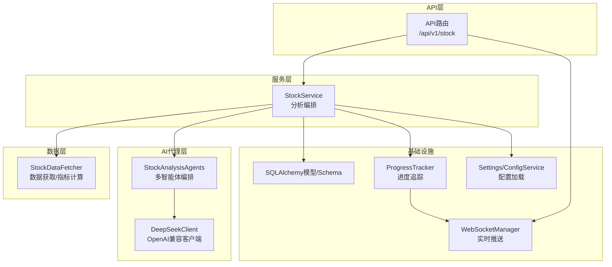
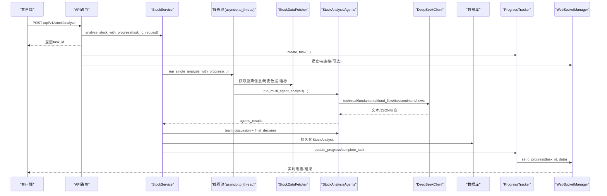
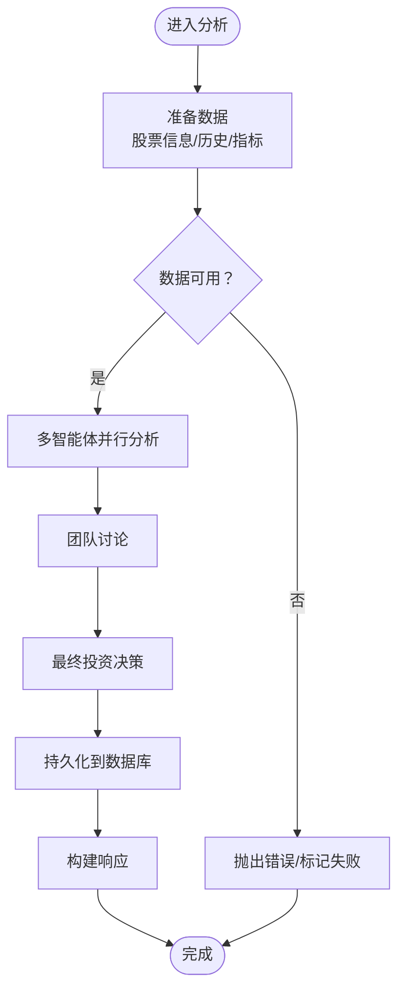
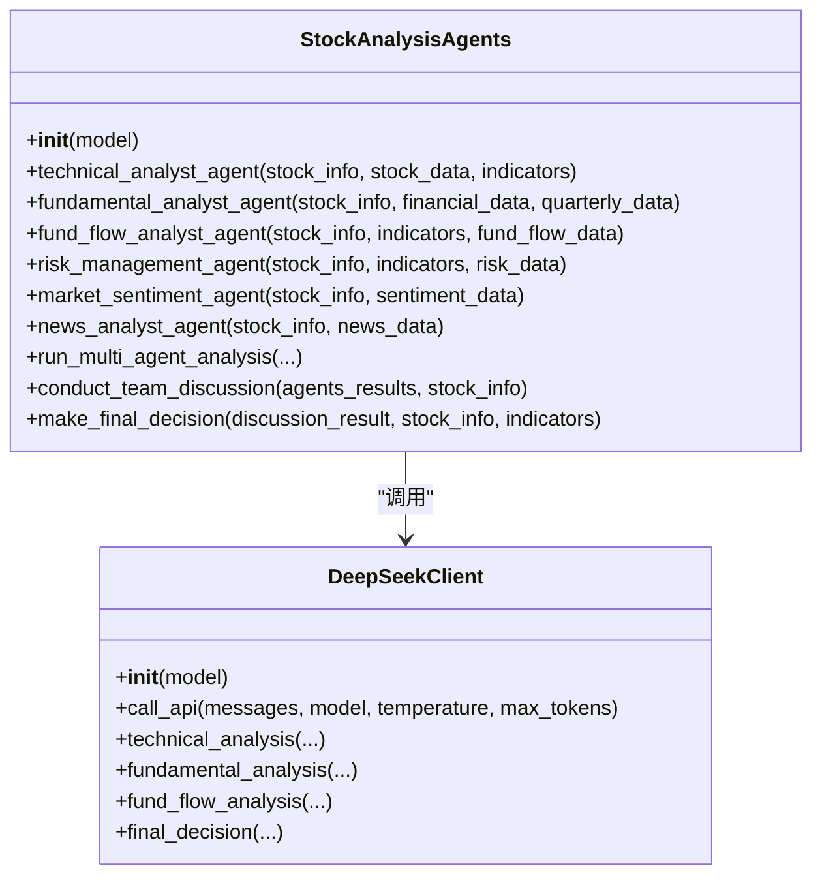
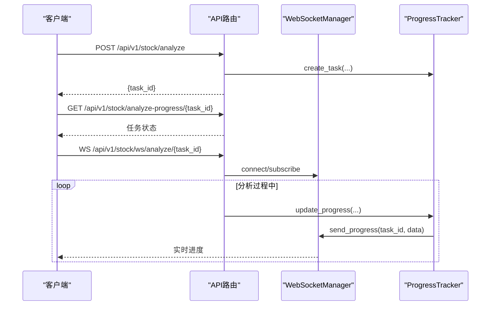
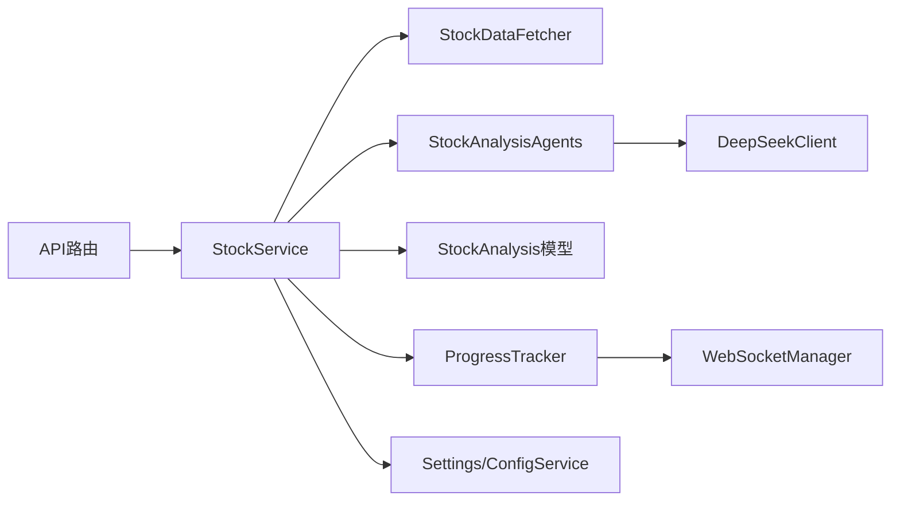

# AI代理服务集成

<cite>
**本文引用的文件**
- [backend/app/services/stock_service.py](file://backend/app/services/stock_service.py)
- [backend/app/agents/ai_agents.py](file://backend/app/agents/ai_agents.py)
- [backend/app/agents/deepseek_client.py](file://backend/app/agents/deepseek_client.py)
- [backend/app/api/v1/stock.py](file://backend/app/api/v1/stock.py)
- [backend/app/schemas/stock.py](file://backend/app/schemas/stock.py)
- [backend/app/models/stock.py](file://backend/app/models/stock.py)
- [backend/app/data/stock_data.py](file://backend/app/data/stock_data.py)
- [backend/app/core/progress_tracker.py](file://backend/app/core/progress_tracker.py)
- [backend/app/core/websocket_manager.py](file://backend/app/core/websocket_manager.py)
- [backend/app/config.py](file://backend/app/config.py)
- [backend/app/services/config_service.py](file://backend/app/services/config_service.py)
</cite>

## 目录
1. [简介](#简介)
2. [项目结构](#项目结构)
3. [核心组件](#核心组件)
4. [架构总览](#架构总览)
5. [详细组件分析](#详细组件分析)
6. [依赖关系分析](#依赖关系分析)
7. [性能与并发特性](#性能与并发特性)
8. [故障排查与最佳实践](#故障排查与最佳实践)
9. [结论](#结论)

## 简介
本文件面向“如何在各业务服务中集成AI代理以增强分析能力”的主题，以stock_service为例，系统阐述从接收分析请求、到调用AI代理、再到处理结果与持久化的完整流程。文档还总结了不同服务中AI调用的共性与差异，覆盖参数传递机制、异步调用模式、进度追踪与WebSocket推送、结果持久化与PDF导出、以及错误传播、超时与资源隔离等最佳实践，并提供常见问题与解决方案。

## 项目结构
- 后端采用FastAPI + SQLAlchemy架构，服务层负责业务编排，agents层封装AI代理与DeepSeek客户端，API层提供REST接口与WebSocket进度推送，core层提供进度追踪与WebSocket管理，data层负责数据获取与技术指标计算，models/schemas定义数据模型与请求/响应结构，config与config_service负责配置加载与校验。

**图示来源**
- [backend/app/api/v1/stock.py](file://backend/app/api/v1/stock.py#L1-L190)
- [backend/app/services/stock_service.py](file://backend/app/services/stock_service.py#L1-L573)
- [backend/app/agents/ai_agents.py](file://backend/app/agents/ai_agents.py#L1-L546)
- [backend/app/agents/deepseek_client.py](file://backend/app/agents/deepseek_client.py#L1-L458)
- [backend/app/data/stock_data.py](file://backend/app/data/stock_data.py#L1-L318)
- [backend/app/core/progress_tracker.py](file://backend/app/core/progress_tracker.py#L1-L171)
- [backend/app/core/websocket_manager.py](file://backend/app/core/websocket_manager.py#L1-L119)
- [backend/app/config.py](file://backend/app/config.py#L1-L92)
- [backend/app/services/config_service.py](file://backend/app/services/config_service.py#L1-L182)

**章节来源**
- [backend/app/api/v1/stock.py](file://backend/app/api/v1/stock.py#L1-L190)
- [backend/app/services/stock_service.py](file://backend/app/services/stock_service.py#L1-L120)

## 核心组件
- 请求/响应模型：定义了单股分析、批量分析、历史查询等请求与响应结构，便于前后端契约一致。
- 数据获取器：统一A股/美股数据获取、实时行情、财务数据、技术指标计算与最新指标抽取。
- AI代理编排：多智能体并行分析（技术面、基本面、资金面、风险管理、市场情绪、新闻），随后团队讨论与最终决策。
- DeepSeek客户端：封装OpenAI兼容接口，自动处理reasoner模型tokens扩展、错误回退与JSON解析。
- 进度追踪与WebSocket：异步任务进度写入内存，WebSocket实时推送，支持客户端轮询与ws订阅。
- 配置管理：从数据库加载配置，支持DeepSeek API Key、MySQL行情库、邮件/Webhook等配置项。

**章节来源**
- [backend/app/schemas/stock.py](file://backend/app/schemas/stock.py#L1-L100)
- [backend/app/models/stock.py](file://backend/app/models/stock.py#L1-L26)
- [backend/app/data/stock_data.py](file://backend/app/data/stock_data.py#L1-L318)
- [backend/app/agents/ai_agents.py](file://backend/app/agents/ai_agents.py#L1-L546)
- [backend/app/agents/deepseek_client.py](file://backend/app/agents/deepseek_client.py#L1-L458)
- [backend/app/core/progress_tracker.py](file://backend/app/core/progress_tracker.py#L1-L171)
- [backend/app/core/websocket_manager.py](file://backend/app/core/websocket_manager.py#L1-L119)
- [backend/app/config.py](file://backend/app/config.py#L1-L92)
- [backend/app/services/config_service.py](file://backend/app/services/config_service.py#L1-L182)

## 架构总览
以stock_service为核心，API层接收请求后创建异步任务，服务层在后台线程池中执行分析，AI代理层并行调用DeepSeek API，完成后持久化结果并通过进度追踪器与WebSocket推送到前端。

**图示来源**
- [backend/app/api/v1/stock.py](file://backend/app/api/v1/stock.py#L21-L110)
- [backend/app/services/stock_service.py](file://backend/app/services/stock_service.py#L63-L139)
- [backend/app/data/stock_data.py](file://backend/app/data/stock_data.py#L16-L177)
- [backend/app/agents/ai_agents.py](file://backend/app/agents/ai_agents.py#L407-L546)
- [backend/app/agents/deepseek_client.py](file://backend/app/agents/deepseek_client.py#L16-L118)
- [backend/app/core/progress_tracker.py](file://backend/app/core/progress_tracker.py#L27-L109)
- [backend/app/core/websocket_manager.py](file://backend/app/core/websocket_manager.py#L84-L102)

## 详细组件分析

### 股票分析服务（StockService）
- 异步入口：analyze_stock_with_progress创建任务ID并后台执行；analyze_stock提供同步入口；batch_analyze支持批量。
- 参数传递：支持analysts字典与agents列表两种配置，内部归一化为enabled_analysts映射；period、model等透传给数据层与AI层。
- 数据准备：_prepare_stock_data统一获取股票信息、历史数据、技术指标，失败时抛错。
- AI调用：_run_single_analysis/_run_single_analysis_with_progress内按enabled_analysts并行调用各智能体，再进行团队讨论与最终决策。
- 结果持久化：_persist_analysis将最终决策字段写入StockAnalysis表；_build_response构造对外响应。
- PDF导出：generate_pdf根据历史记录生成PDF并返回Base64内容。
- 错误处理：_safe_call/_safe_import_and_call对可选数据源进行容错；异常向上抛出或标记任务失败。

**图示来源**
- [backend/app/services/stock_service.py](file://backend/app/services/stock_service.py#L265-L440)
- [backend/app/services/stock_service.py](file://backend/app/services/stock_service.py#L461-L511)

**章节来源**
- [backend/app/services/stock_service.py](file://backend/app/services/stock_service.py#L63-L139)
- [backend/app/services/stock_service.py](file://backend/app/services/stock_service.py#L265-L440)
- [backend/app/services/stock_service.py](file://backend/app/services/stock_service.py#L461-L511)

### AI代理编排（StockAnalysisAgents）
- 多智能体职责：
  - 技术分析师：基于技术指标与K线形态进行趋势、动量、支撑阻力分析。
  - 基本面分析师：财务比率、季报趋势、成长性与估值分析。
  - 资金面分析师：主力资金流向、大单/中单/小单博弈、量价配合。
  - 风险管理师：限售解禁、大股东减持、重要事件等风险量化评估。
  - 市场情绪分析师：ARBR、换手率、融资融券、恐慌贪婪指数等。
  - 新闻分析师：新闻事件、舆情、重大事件影响与市场反应预判。
- 并行执行：run_multi_agent_analysis按enabled_analysts开关并行调用各智能体。
- 团队讨论：collect各分析师报告，生成综合讨论文本。
- 最终决策：基于讨论与技术指标输出JSON格式的最终决策（含评级、目标价、止盈止损、入场区间、置信度等）。

**图示来源**
- [backend/app/agents/ai_agents.py](file://backend/app/agents/ai_agents.py#L1-L546)
- [backend/app/agents/deepseek_client.py](file://backend/app/agents/deepseek_client.py#L1-L458)

**章节来源**
- [backend/app/agents/ai_agents.py](file://backend/app/agents/ai_agents.py#L1-L546)

### DeepSeek客户端（DeepSeekClient）
- OpenAI兼容接口封装：统一chat.completions.create调用，自动处理reasoner模型tokens扩展与推理过程拼接。
- JSON解析：final_decision尝试从LLM响应中抽取JSON，失败时回退为文本。
- 错误回退：捕获异常并返回“API调用失败: ...”文本，避免中断主流程。

**章节来源**
- [backend/app/agents/deepseek_client.py](file://backend/app/agents/deepseek_client.py#L16-L118)
- [backend/app/agents/deepseek_client.py](file://backend/app/agents/deepseek_client.py#L393-L458)

### API与异步进度（/api/v1/stock）
- 异步分析：POST /analyze创建任务并立即返回task_id；后台通过BackgroundTasks执行。
- 进度查询：GET /analyze-progress/{task_id}轮询进度；GET /active-tasks查看进行中任务。
- WebSocket：/ws/analyze/{task_id}实时推送进度，支持ping/状态查询。
- 批量分析：POST /batch-analyze支持顺序/并行模式与工作线程数控制。
- 历史查询：GET /history分页查询历史记录。
- 股票信息：GET /{stock_code}获取基本信息。
- PDF导出：POST /generate-pdf生成并返回PDF二进制的Base64编码。

**图示来源**
- [backend/app/api/v1/stock.py](file://backend/app/api/v1/stock.py#L21-L110)
- [backend/app/core/progress_tracker.py](file://backend/app/core/progress_tracker.py#L27-L109)
- [backend/app/core/websocket_manager.py](file://backend/app/core/websocket_manager.py#L23-L102)

**章节来源**
- [backend/app/api/v1/stock.py](file://backend/app/api/v1/stock.py#L1-L190)

### 数据获取与技术指标（StockDataFetcher）
- 跨市场适配：A股通过DataSourceManager获取，美股通过yfinance；统一返回DataFrame列名。
- 财务数据：A股取收入表，美股取yf.financials。
- 技术指标：计算MA5/20/60、MACD、RSI、布林带上下轨等；提供最新指标抽取。
- 容错：异常返回None或错误字典，由上层统一处理。

**章节来源**
- [backend/app/data/stock_data.py](file://backend/app/data/stock_data.py#L16-L177)
- [backend/app/data/stock_data.py](file://backend/app/data/stock_data.py#L200-L277)

### 配置与持久化
- 配置来源：Settings从.env加载，ConfigService从数据库读取并合并默认值，支持DeepSeek、MySQL、邮件/Webhook等配置项测试。
- 持久化：StockAnalysis模型保存分析结果JSON、评级、止盈止损、目标价、置信度等字段；服务层在分析完成后写入数据库。

**章节来源**
- [backend/app/config.py](file://backend/app/config.py#L1-L92)
- [backend/app/services/config_service.py](file://backend/app/services/config_service.py#L1-L182)
- [backend/app/models/stock.py](file://backend/app/models/stock.py#L1-L26)

## 依赖关系分析
- 耦合与内聚：
  - StockService高度内聚于分析流程编排，依赖数据获取器、AI代理、持久化与进度追踪。
  - AI代理层与DeepSeek客户端解耦，便于替换或扩展其他LLM。
  - API层仅负责路由与异步调度，职责清晰。
- 外部依赖：
  - DeepSeek API（OpenAI兼容）。
  - 数据源（Tushare/通达信/MySQL行情库）。
  - WebSocket与数据库。
- 潜在环路：
  - 进度追踪器通过WebSocket管理器推送，但WebSocket管理器不反向依赖进度追踪器，避免环路。

**图示来源**
- [backend/app/api/v1/stock.py](file://backend/app/api/v1/stock.py#L1-L190)
- [backend/app/services/stock_service.py](file://backend/app/services/stock_service.py#L1-L120)
- [backend/app/agents/ai_agents.py](file://backend/app/agents/ai_agents.py#L1-L546)
- [backend/app/agents/deepseek_client.py](file://backend/app/agents/deepseek_client.py#L1-L458)
- [backend/app/data/stock_data.py](file://backend/app/data/stock_data.py#L1-L318)
- [backend/app/core/progress_tracker.py](file://backend/app/core/progress_tracker.py#L1-L171)
- [backend/app/core/websocket_manager.py](file://backend/app/core/websocket_manager.py#L1-L119)
- [backend/app/config.py](file://backend/app/config.py#L1-L92)
- [backend/app/services/config_service.py](file://backend/app/services/config_service.py#L1-L182)

## 性能与并发特性
- 异步与线程池：
  - API层使用BackgroundTasks与asyncio.to_thread将CPU密集的分析放入线程池，避免阻塞事件循环。
  - 进度追踪器与WebSocket推送为异步通知，降低轮询成本。
- 并行智能体：
  - run_multi_agent_analysis按enabled_analysts开关并行执行，缩短总耗时。
- 资源隔离：
  - 数据获取器与AI代理分别封装，便于独立扩展与替换。
- 缓存策略：
  - 代码中未发现显式缓存实现；可通过Redis或本地缓存优化重复请求与中间结果（建议在上层引入）。
- 超时与重试：
  - DeepSeekClient未设置HTTP超时；可在OpenAI客户端层增加timeout与retry策略（建议）。

[本节为通用性能讨论，无需特定文件来源]

## 故障排查与最佳实践

### 参数传递机制
- 请求体字段：
  - stock_code/period/model/analysts/agents，其中analysts为布尔开关，agents为字符串别名列表，内部归一化为enabled_analysts。
- 字段校验：
  - 股票代码支持symbol兼容转换；批分析要求stock_codes非空。
- 建议：
  - 前端统一传agents或analysts之一，避免歧义；后端保留兼容逻辑。

**章节来源**
- [backend/app/schemas/stock.py](file://backend/app/schemas/stock.py#L12-L59)
- [backend/app/services/stock_service.py](file://backend/app/services/stock_service.py#L110-L139)

### 异步调用模式与进度追踪
- 异步启动：POST /analyze创建任务并立即返回task_id。
- 进度查询：轮询GET /analyze-progress/{task_id}或WebSocket /ws/analyze/{task_id}。
- 任务生命周期：创建/运行/完成/失败，失败时携带错误信息。
- 建议：
  - 客户端应实现重连与心跳（ping/pong）；服务端对异常连接静默清理。

**章节来源**
- [backend/app/api/v1/stock.py](file://backend/app/api/v1/stock.py#L21-L110)
- [backend/app/core/progress_tracker.py](file://backend/app/core/progress_tracker.py#L27-L109)
- [backend/app/core/websocket_manager.py](file://backend/app/core/websocket_manager.py#L23-L102)

### 结果持久化与PDF导出
- 持久化：StockAnalysis保存analysis_result JSON、评级、止盈止损、目标价、置信度等。
- PDF导出：根据历史记录生成PDF并返回Base64编码，便于前端直接展示。
- 建议：
  - analysis_result建议限制大小或分片存储；PDF生成可异步化。

**章节来源**
- [backend/app/models/stock.py](file://backend/app/models/stock.py#L1-L26)
- [backend/app/services/stock_service.py](file://backend/app/services/stock_service.py#L461-L511)
- [backend/app/api/v1/stock.py](file://backend/app/api/v1/stock.py#L177-L190)

### 不同服务中AI调用的共性与差异
- 共性：
  - 都通过StockDataFetcher获取基础数据与技术指标。
  - 都使用StockAnalysisAgents进行多智能体并行分析。
  - 都通过DeepSeekClient调用LLM，最终生成JSON决策。
- 差异：
  - 输入数据预处理：stock_service主要依赖技术指标与财务/资金/情绪/新闻等辅助数据；其他服务（如主力选股、板块策略）可能引入不同的数据源与指标体系。
  - 上下文构建：不同智能体的prompt模板针对各自领域定制（技术面、基本面、资金面、风险、情绪、新闻）。
  - 响应后处理：stock_service将最终决策字段映射到响应对象；其他服务可能输出推荐列表或评分。

**章节来源**
- [backend/app/agents/ai_agents.py](file://backend/app/agents/ai_agents.py#L1-L546)
- [backend/app/data/stock_data.py](file://backend/app/data/stock_data.py#L16-L177)

### 错误传播、超时设置与资源隔离
- 错误传播：
  - 数据获取失败通过_safe_call/_safe_import_and_call返回None或错误字典，避免中断；AI调用失败返回“API调用失败: ...”文本。
  - 任务失败通过ProgressTracker.fail_task上报并通知WebSocket。
- 超时设置：
  - 建议在DeepSeekClient中为OpenAI客户端设置timeout与retry；对reasoner模型适当提高max_tokens。
- 资源隔离：
  - 将数据获取、AI调用、持久化拆分为独立模块，便于替换与扩展；配置通过ConfigService集中管理。

**章节来源**
- [backend/app/services/stock_service.py](file://backend/app/services/stock_service.py#L548-L573)
- [backend/app/agents/deepseek_client.py](file://backend/app/agents/deepseek_client.py#L16-L118)
- [backend/app/core/progress_tracker.py](file://backend/app/core/progress_tracker.py#L98-L109)

### 常见问题与解决方案
- 响应延迟：
  - 优化：并行智能体、线程池、WebSocket推送；减少不必要的数据拉取。
  - 建议：对高频请求引入Redis缓存；对历史分析结果进行归档与索引。
- 格式不匹配：
  - AI输出JSON解析失败：DeepSeekClient已回退为文本；建议在上层对关键字段做健壮性校验与默认值填充。
- API Key无效：
  - 通过ConfigService.test_config进行前置校验；Settings提供默认值以便开发调试。
- 数据源不可用：
  - 使用_safe_call/_safe_import_and_call进行降级；在UI层提示用户切换数据源或稍后重试。

**章节来源**
- [backend/app/agents/deepseek_client.py](file://backend/app/agents/deepseek_client.py#L393-L458)
- [backend/app/services/config_service.py](file://backend/app/services/config_service.py#L52-L76)
- [backend/app/config.py](file://backend/app/config.py#L36-L40)

## 结论
本项目以stock_service为典型范例，展示了如何在业务服务中集成AI代理：通过API层异步调度、服务层编排数据与AI代理、AI代理层并行调用DeepSeek、并在完成后持久化与实时推送进度。该模式具备良好的可扩展性与可维护性，适用于其他分析服务（如主力选股、板块策略等）。建议在生产环境中进一步完善缓存、超时与重试、资源隔离与可观测性，以提升稳定性与用户体验。