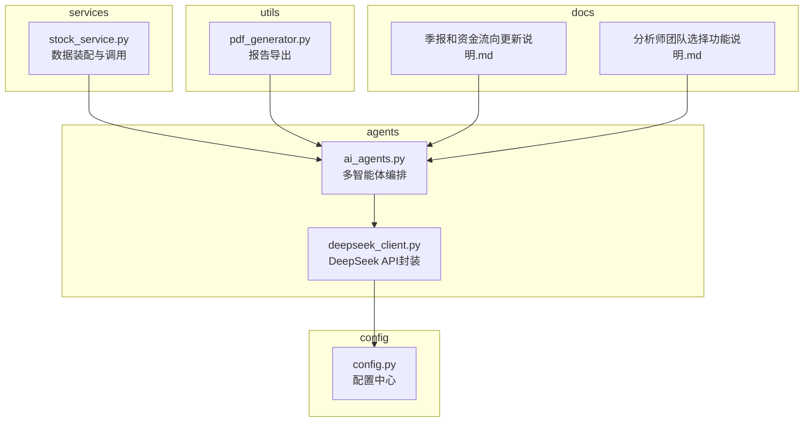
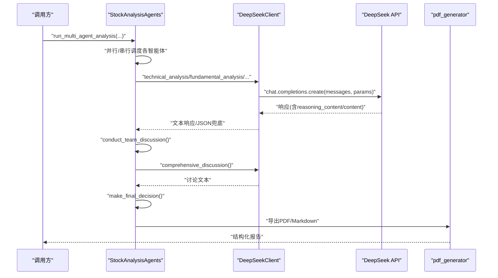
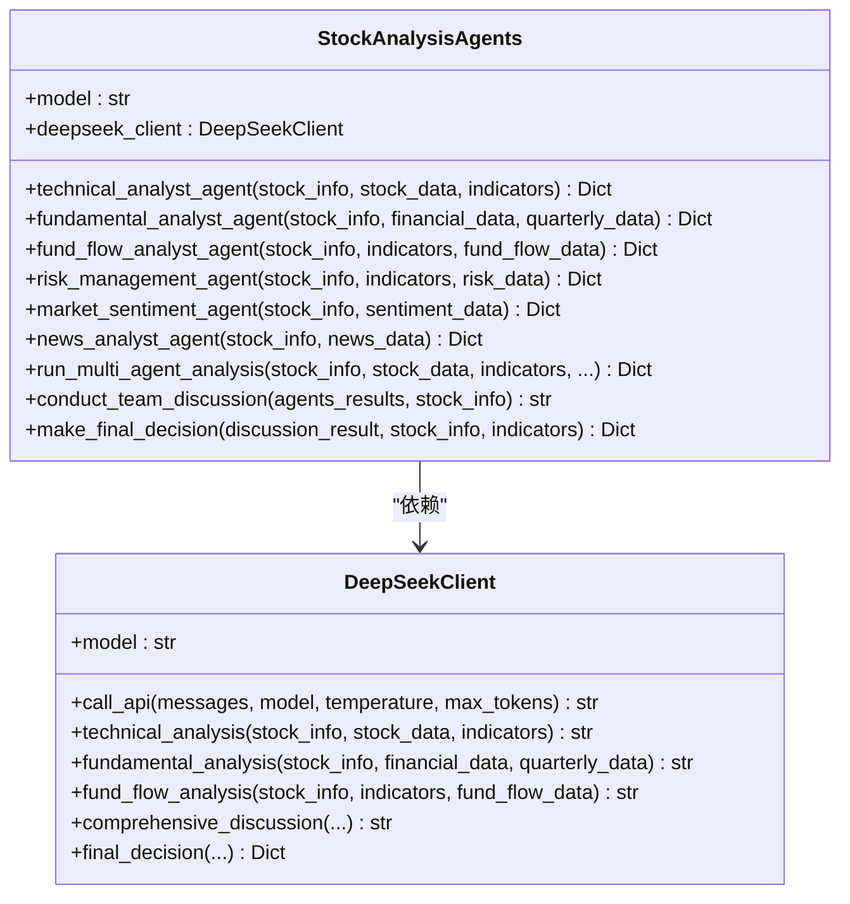
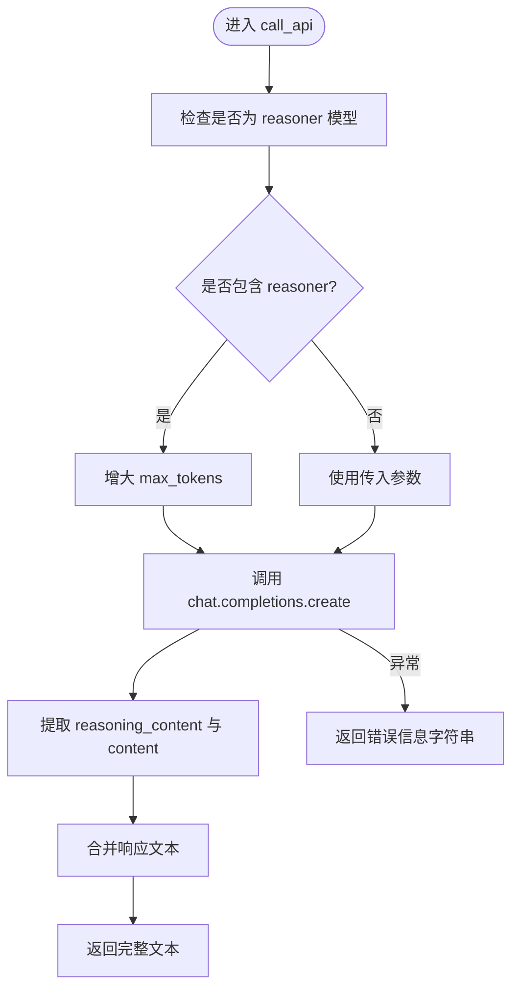
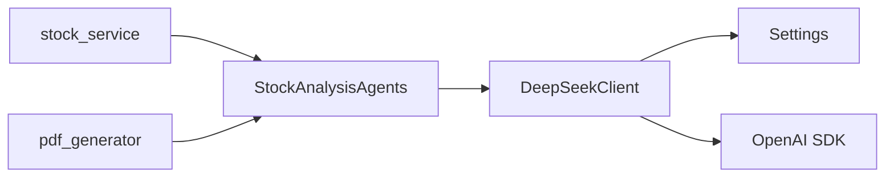
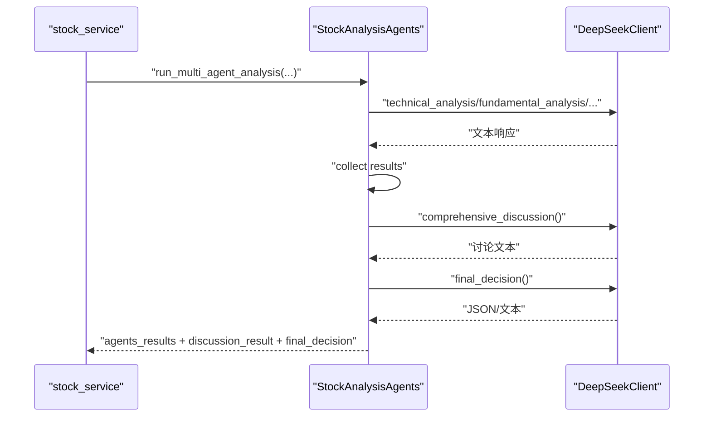

# AI代理核心引擎

<cite>
**本文引用的文件列表**
- [ai_agents.py](file://backend/app/agents/ai_agents.py)
- [deepseek_client.py](file://backend/app/agents/deepseek_client.py)
- [config.py](file://backend/app/config.py)
- [stock_service.py](file://backend/app/services/stock_service.py)
- [pdf_generator.py](file://backend/app/utils/pdf_generator.py)
- [季报和资金流向更新说明.md](file://docs/季报和资金流向更新说明.md)
- [分析师团队选择功能说明.md](file://docs/分析师团队选择功能说明.md)
</cite>

## 目录
1. [简介](#简介)
2. [项目结构](#项目结构)
3. [核心组件](#核心组件)
4. [架构总览](#架构总览)
5. [详细组件分析](#详细组件分析)
6. [依赖关系分析](#依赖关系分析)
7. [性能与稳定性设计](#性能与稳定性设计)
8. [故障排查指南](#故障排查指南)
9. [结论](#结论)
10. [附录](#附录)

## 简介
本文件面向“AI代理核心引擎”的实现，聚焦于 backend/app/agents/ai_agents.py 的设计与实现，系统化阐述其作为AI代理中枢的架构思想与工程实践。文档覆盖以下关键主题：
- 统一接口封装 DeepSeek API 的调用流程，包括请求构造、上下文管理与会话状态维护机制
- 提示词模板的组织结构、动态填充逻辑与版本控制策略
- 响应解析流程，包括JSON格式校验、字段映射与异常处理
- 实际代码示例展示不同分析场景下的调用模式，如股票分析、板块评估等
- 错误重试、超时控制与降级策略，确保系统稳定性

## 项目结构
AI代理核心引擎位于后端 agents 子模块，围绕“多智能体协同分析”展开，核心文件如下：
- ai_agents.py：多智能体分析编排与团队讨论、最终决策生成
- deepseek_client.py：DeepSeek API 客户端封装，统一请求构建与响应解析
- config.py：应用配置，包含 DeepSeek API 密钥与基础地址
- stock_service.py：服务层数据拉取与智能体参数装配
- pdf_generator.py：报告导出工具，展示最终决策的结构化呈现
- 文档资料：季报和资金流向更新说明、分析师团队选择功能说明

**图示来源**
- [ai_agents.py](file://backend/app/agents/ai_agents.py#L1-L546)
- [deepseek_client.py](file://backend/app/agents/deepseek_client.py#L1-L458)
- [config.py](file://backend/app/config.py#L1-L92)
- [stock_service.py](file://backend/app/services/stock_service.py#L294-L412)
- [pdf_generator.py](file://backend/app/utils/pdf_generator.py#L177-L348)
- [季报和资金流向更新说明.md](file://docs/季报和资金流向更新说明.md#L1-L230)
- [分析师团队选择功能说明.md](file://docs/分析师团队选择功能说明.md#L299-L344)

**章节来源**
- [ai_agents.py](file://backend/app/agents/ai_agents.py#L1-L546)
- [deepseek_client.py](file://backend/app/agents/deepseek_client.py#L1-L458)
- [config.py](file://backend/app/config.py#L1-L92)

## 核心组件
- StockAnalysisAgents：多智能体分析中枢，负责组织技术面、基本面、资金面、风险管理、市场情绪、新闻分析等子智能体，并协调团队讨论与最终决策。
- DeepSeekClient：统一的 DeepSeek API 客户端，封装 chat.completions 调用、reasoner 模型特殊处理、响应内容拼接与异常兜底。
- 配置中心 Settings：提供 DEEPSEEK_API_KEY 与 DEEPSEEK_BASE_URL，确保客户端初始化与调用一致性。
- 数据服务 stock_service：按智能体需求拉取资金流向、市场情绪、新闻、风险等外部数据，组装为统一输入。
- 报告导出 pdf_generator：将多智能体分析结果、团队讨论与最终决策结构化输出为 PDF/Markdown。

**章节来源**
- [ai_agents.py](file://backend/app/agents/ai_agents.py#L1-L546)
- [deepseek_client.py](file://backend/app/agents/deepseek_client.py#L1-L458)
- [config.py](file://backend/app/config.py#L1-L92)
- [stock_service.py](file://backend/app/services/stock_service.py#L294-L412)
- [pdf_generator.py](file://backend/app/utils/pdf_generator.py#L177-L348)

## 架构总览
AI代理核心引擎采用“编排-调用-解析-导出”的流水线式架构：
- 编排层：StockAnalysisAgents 负责多智能体并行/串行调度、上下文聚合与最终决策生成
- 调用层：DeepSeekClient 统一构建 messages、调用 OpenAI 兼容接口、处理 reasoner 特殊响应
- 数据层：stock_service 与外部数据源对接，按需拉取资金流向、市场情绪、新闻、风险等数据
- 输出层：pdf_generator 将分析结果结构化输出，便于前端展示与归档

**图示来源**
- [ai_agents.py](file://backend/app/agents/ai_agents.py#L407-L546)
- [deepseek_client.py](file://backend/app/agents/deepseek_client.py#L16-L118)
- [pdf_generator.py](file://backend/app/utils/pdf_generator.py#L177-L348)

## 详细组件分析

### StockAnalysisAgents 设计与实现
- 统一入口：构造 DeepSeekClient，持有 model 名称，贯穿各智能体调用
- 多智能体编排：
  - 技术面分析、基本面分析、资金面分析、风险管理、市场情绪、新闻分析
  - 支持 enabled_analysts 参数按需启用，避免不必要的数据拉取与API调用
- 团队讨论：收集各智能体报告，生成综合讨论提示词，驱动多角色观点碰撞
- 最终决策：将团队讨论结果与技术指标结合，生成结构化 JSON 决策

**图示来源**
- [ai_agents.py](file://backend/app/agents/ai_agents.py#L1-L546)
- [deepseek_client.py](file://backend/app/agents/deepseek_client.py#L1-L458)

**章节来源**
- [ai_agents.py](file://backend/app/agents/ai_agents.py#L1-L546)

### DeepSeekClient 设计与实现
- 初始化：从配置中心读取 DEEPSEEK_API_KEY 与 DEEPSEEK_BASE_URL，创建 OpenAI 兼容客户端
- 请求构造：
  - call_api 接受 messages 列表，支持 model、temperature、max_tokens 参数
  - 对 reasoner 模型自动提升 max_tokens，保证推理过程完整输出
- 响应解析：
  - 合并 reasoning_content 与 content，形成完整文本
  - 异常兜底：捕获异常并返回错误信息字符串
- 专用分析方法：
  - technical_analysis、fundamental_analysis、fund_flow_analysis 构建结构化提示词
  - comprehensive_discussion、final_decision 生成团队讨论与最终决策文本
  - final_decision 中尝试解析 JSON，若失败返回包含决策文本的字典

**图示来源**
- [deepseek_client.py](file://backend/app/agents/deepseek_client.py#L16-L53)

**章节来源**
- [deepseek_client.py](file://backend/app/agents/deepseek_client.py#L1-L458)
- [config.py](file://backend/app/config.py#L36-L40)

### 提示词模板与动态填充
- 模板组织：
  - 每个分析智能体对应独立提示词模板，包含“股票信息”“技术指标/财务指标/资金流向/情绪数据/风险数据”等结构化段落
  - 模板采用占位符动态填充，如股票代码、名称、当前价格、各项指标值等
- 动态填充逻辑：
  - 通过字符串格式化将 stock_info、indicators、financial_data、quarterly_data、fund_flow_data、sentiment_data、news_data、risk_data 等参数注入模板
  - 对 akshare 等外部数据源，使用对应格式化器将原始数据转为 AI 友好的文本
- 版本控制策略：
  - 通过文档记录模板更新与字段扩展，如季报数据、资金流向数据的引入与分析维度增强
  - 保持模板命名与字段映射稳定，避免破坏既有解析逻辑

**章节来源**
- [季报和资金流向更新说明.md](file://docs/季报和资金流向更新说明.md#L1-L230)
- [ai_agents.py](file://backend/app/agents/ai_agents.py#L1-L546)
- [deepseek_client.py](file://backend/app/agents/deepseek_client.py#L54-L458)

### 响应解析与异常处理
- JSON 校验与字段映射：
  - final_decision 中尝试从响应文本中抽取 JSON 片段并解析为字典
  - 若解析失败，返回包含决策文本的字典，避免中断流程
- 异常兜底：
  - call_api 捕获异常并返回错误信息字符串
  - 多智能体方法在调用 DeepSeekClient 后统一封装为结构化字典，包含 agent_name、agent_role、analysis、focus_areas、timestamp 等字段
- 上下文与会话状态：
  - 多智能体结果以字典形式聚合，便于后续团队讨论与最终决策
  - 团队讨论与最终决策通过额外 messages 调用，形成新的上下文链路

**章节来源**
- [deepseek_client.py](file://backend/app/agents/deepseek_client.py#L393-L458)
- [ai_agents.py](file://backend/app/agents/ai_agents.py#L407-L546)

### 实际调用模式示例
- 股票分析场景（多智能体并行）：
  - 输入：stock_info、stock_data、indicators、financial_data、quarterly_data、fund_flow_data、sentiment_data、news_data、risk_data、enabled_analysts
  - 流程：run_multi_agent_analysis -> 各智能体分析 -> conduct_team_discussion -> make_final_decision
  - 输出：agents_results、discussion_result、final_decision
- 板块评估场景（概念扩展）：
  - 可复用相同编排思路，将板块维度数据注入提示词模板，调用相应分析方法
  - 通过 enabled_analysts 控制参与分析的智能体组合，平衡成本与效果

**章节来源**
- [ai_agents.py](file://backend/app/agents/ai_agents.py#L407-L546)
- [stock_service.py](file://backend/app/services/stock_service.py#L294-L412)

## 依赖关系分析
- 组件耦合：
  - StockAnalysisAgents 依赖 DeepSeekClient；DeepSeekClient 依赖配置中心 Settings
  - 数据服务 stock_service 负责拉取外部数据，为多智能体提供输入
  - pdf_generator 依赖多智能体结果进行结构化输出
- 外部依赖：
  - OpenAI 兼容客户端（DeepSeek API）
  - akshare 等第三方数据源（资金流向、市场情绪、新闻、季报）
- 潜在循环依赖：
  - 当前文件间无直接循环导入；通过模块化组织避免循环

**图示来源**
- [ai_agents.py](file://backend/app/agents/ai_agents.py#L1-L546)
- [deepseek_client.py](file://backend/app/agents/deepseek_client.py#L1-L458)
- [config.py](file://backend/app/config.py#L1-L92)
- [stock_service.py](file://backend/app/services/stock_service.py#L294-L412)
- [pdf_generator.py](file://backend/app/utils/pdf_generator.py#L177-L348)

**章节来源**
- [ai_agents.py](file://backend/app/agents/ai_agents.py#L1-L546)
- [deepseek_client.py](file://backend/app/agents/deepseek_client.py#L1-L458)
- [config.py](file://backend/app/config.py#L1-L92)
- [stock_service.py](file://backend/app/services/stock_service.py#L294-L412)
- [pdf_generator.py](file://backend/app/utils/pdf_generator.py#L177-L348)

## 性能与稳定性设计
- 并行与串行策略：
  - run_multi_agent_analysis 支持 enabled_analysts 控制，避免不必要的 API 调用
  - 智能体内部使用 sleep 模拟耗时，实际生产中可替换为异步任务或并发执行
- 超时与重试：
  - DeepSeekClient 的调用未内置显式超时与重试逻辑；建议在上层服务层或网关层增加超时与指数退避重试
- 降级策略：
  - 当外部数据源不可用时，智能体通过条件分支降级为“基于基本信息分析”，保证流程可用
  - API 调用异常返回错误字符串，避免中断整体流程
- 资源控制：
  - 对 reasoner 模型自动提高 max_tokens，确保推理过程完整输出
  - final_decision 中对 JSON 解析失败进行兜底，保障输出结构化

**章节来源**
- [ai_agents.py](file://backend/app/agents/ai_agents.py#L407-L546)
- [deepseek_client.py](file://backend/app/agents/deepseek_client.py#L16-L53)
- [季报和资金流向更新说明.md](file://docs/季报和资金流向更新说明.md#L1-L230)

## 故障排查指南
- API 调用失败：
  - 现象：返回错误信息字符串
  - 排查：确认 DEEPSEEK_API_KEY 与 DEEPSEEK_BASE_URL 配置正确；检查网络连通性
- JSON 解析失败：
  - 现象：final_decision 返回包含决策文本的字典
  - 排查：检查模型输出格式是否符合 JSON 规范；必要时调整提示词或温度参数
- 数据源不可用：
  - 现象：智能体提示“未获取到数据，将基于基本信息分析”
  - 排查：确认 akshare 等数据源可用性；检查代理与防火墙设置
- 模型响应不完整：
  - 现象：reasoner 模型推理过程被截断
  - 排查：确认已自动提高 max_tokens；必要时手动增大 max_tokens

**章节来源**
- [deepseek_client.py](file://backend/app/agents/deepseek_client.py#L16-L53)
- [config.py](file://backend/app/config.py#L36-L40)
- [ai_agents.py](file://backend/app/agents/ai_agents.py#L1-L546)

## 结论
AI代理核心引擎通过“多智能体编排 + 统一API封装 + 结构化输出”的设计，实现了从数据拉取到分析决策的闭环。其关键优势在于：
- 统一接口屏蔽底层差异，简化调用复杂度
- 模板化提示词与动态填充，便于扩展与维护
- 结构化输出与异常兜底，提升系统稳定性
建议在生产环境中补充超时与重试、熔断与限流等机制，进一步增强鲁棒性。

## 附录
- 多智能体调用序列（股票分析）

**图示来源**
- [stock_service.py](file://backend/app/services/stock_service.py#L294-L412)
- [ai_agents.py](file://backend/app/agents/ai_agents.py#L407-L546)
- [deepseek_client.py](file://backend/app/agents/deepseek_client.py#L354-L458)