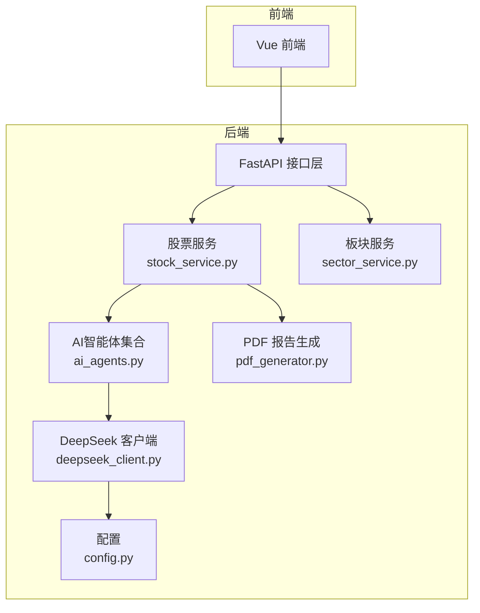
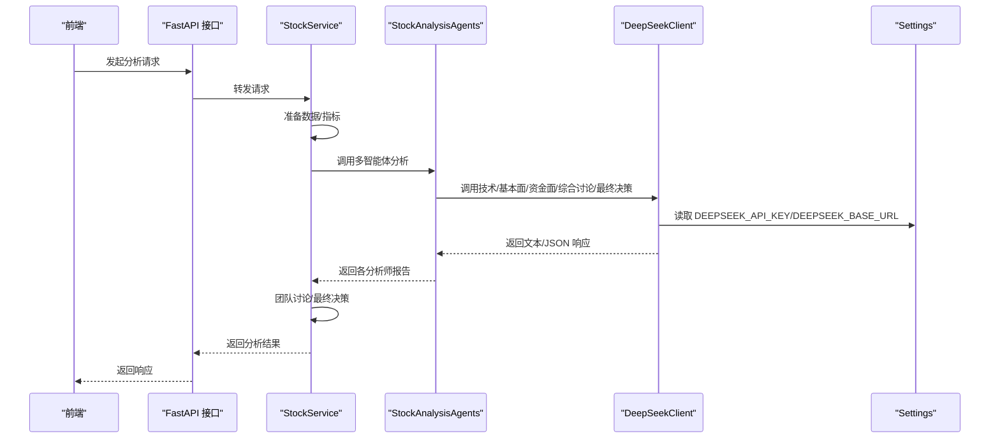
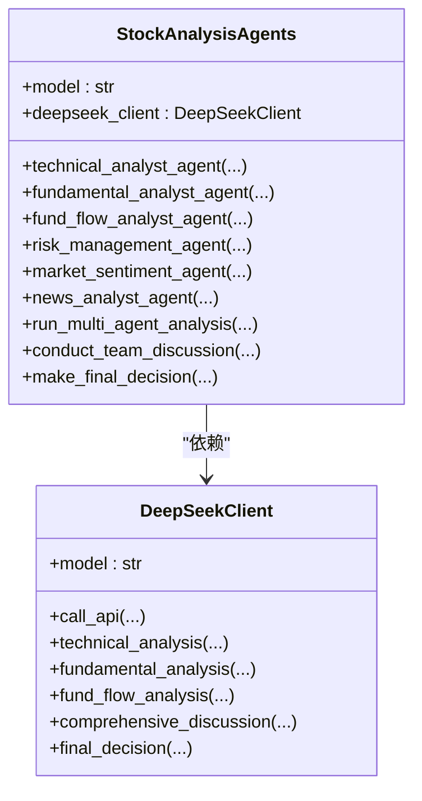
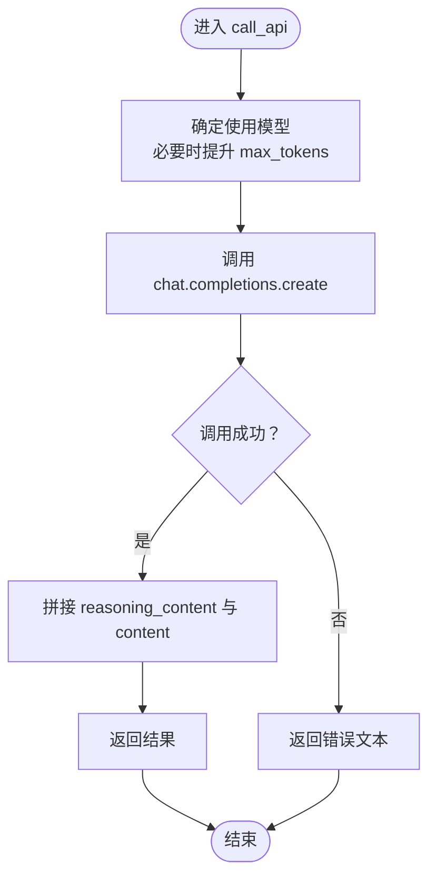
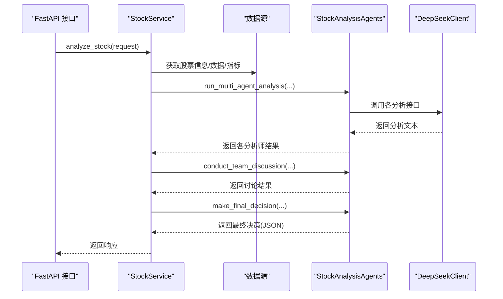
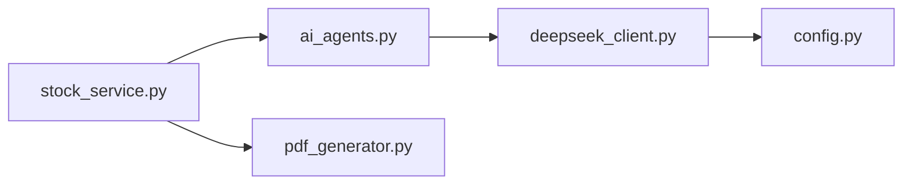

# AI代理系统

<cite>
**本文引用的文件**
- [ai_agents.py](file://backend/app/agents/ai_agents.py)
- [deepseek_client.py](file://backend/app/agents/deepseek_client.py)
- [stock_service.py](file://backend/app/services/stock_service.py)
- [sector_service.py](file://backend/app/services/sector_service.py)
- [config.py](file://backend/app/config.py)
- [pdf_generator.py](file://backend/app/utils/pdf_generator.py)
- [stock_agents.py](file://backend/app/agents/stock_agents.py)
- [sector_agents.py](file://backend/app/agents/sector_agents.py)
- [longhubang_agents.py](file://backend/app/agents/longhubang_agents.py)
- [mainforce_agents.py](file://backend/app/agents/mainforce_agents.py)
- [AI盯盘和实时监测交易时段优化总结.md](file://docs/AI盯盘和实时监测交易时段优化总结.md)
</cite>

## 目录
1. [简介](#简介)
2. [项目结构](#项目结构)
3. [核心组件](#核心组件)
4. [架构总览](#架构总览)
5. [详细组件分析](#详细组件分析)
6. [依赖关系分析](#依赖关系分析)
7. [性能与成本控制](#性能与成本控制)
8. [故障排查指南](#故障排查指南)
9. [结论](#结论)
10. [附录](#附录)

## 简介
本文件面向“AI代理系统”的架构与运行机制，重点围绕以下目标展开：
- 深入解析 ai_agents.py 如何封装对 DeepSeek API 的调用，覆盖提示词工程设计、上下文管理、响应解析等环节；
- 描述 deepseek_client.py 中的重试机制、速率限制处理与错误恢复策略；
- 说明各业务服务（如 stock_service、sector_service）如何集成 AI 代理以增强分析能力；
- 提供代理调用的性能指标与成本控制建议；
- 涵盖多模型切换、提示词版本管理等高级配置选项。

## 项目结构
后端采用分层架构，AI 代理位于 agents 层，业务服务位于 services 层，配置位于 config 层，工具与报告生成位于 utils 层。前端通过 API 调用后端服务，后端再调用 AI 代理与数据源。

图示来源
- [stock_service.py](file://backend/app/services/stock_service.py#L1-L120)
- [sector_service.py](file://backend/app/services/sector_service.py#L1-L48)
- [ai_agents.py](file://backend/app/agents/ai_agents.py#L1-L120)
- [deepseek_client.py](file://backend/app/agents/deepseek_client.py#L1-L60)
- [config.py](file://backend/app/config.py#L36-L40)
- [pdf_generator.py](file://backend/app/utils/pdf_generator.py#L300-L376)

章节来源
- [stock_service.py](file://backend/app/services/stock_service.py#L1-L120)
- [sector_service.py](file://backend/app/services/sector_service.py#L1-L48)
- [ai_agents.py](file://backend/app/agents/ai_agents.py#L1-L120)
- [deepseek_client.py](file://backend/app/agents/deepseek_client.py#L1-L60)
- [config.py](file://backend/app/config.py#L36-L40)
- [pdf_generator.py](file://backend/app/utils/pdf_generator.py#L300-L376)

## 核心组件
- AI 智能体集合：封装多维分析师（技术面、基本面、资金面、风险管理、市场情绪、新闻），统一调度与汇总。
- DeepSeek 客户端：OpenAI SDK 客户端封装，负责模型调用、参数适配、响应解析与错误兜底。
- 股票服务：协调数据采集、AI 分析、报告生成与持久化。
- 配置中心：集中管理 DeepSeek API Key、Base URL 等关键参数。
- PDF 报告生成器：将 AI 输出整合为结构化报告。

章节来源
- [ai_agents.py](file://backend/app/agents/ai_agents.py#L1-L120)
- [deepseek_client.py](file://backend/app/agents/deepseek_client.py#L1-L60)
- [stock_service.py](file://backend/app/services/stock_service.py#L1-L120)
- [config.py](file://backend/app/config.py#L36-L40)
- [pdf_generator.py](file://backend/app/utils/pdf_generator.py#L300-L376)

## 架构总览
AI 代理系统通过“服务层 -> 智能体层 -> LLM 客户端 -> 配置中心”的链路完成分析闭环。服务层负责数据准备与流程编排，智能体层负责提示词工程与上下文拼装，LLM 客户端负责模型调用与响应解析，配置中心提供统一的密钥与基础地址。

图示来源
- [stock_service.py](file://backend/app/services/stock_service.py#L265-L360)
- [ai_agents.py](file://backend/app/agents/ai_agents.py#L407-L546)
- [deepseek_client.py](file://backend/app/agents/deepseek_client.py#L16-L53)
- [config.py](file://backend/app/config.py#L36-L40)

## 详细组件分析

### 智能体集合：StockAnalysisAgents
- 角色分工：技术面、基本面、资金面、风险管理、市场情绪、新闻分析六个智能体，分别负责不同维度的分析。
- 上下文管理：每个智能体接收统一的 stock_info、stock_data、indicators 等上下文，并可选择性注入财务、季报、资金流、情绪、新闻、风险等数据。
- 提示词工程：每个智能体构建独立的 prompt，结合系统角色与用户提示，强调数据来源与分析维度，确保输出结构化与可执行。
- 响应解析：返回包含分析文本、聚焦领域、时间戳等元信息的结果字典；风险管理与市场情绪等智能体还保留原始数据以便后续使用。
- 团队讨论与最终决策：提供团队讨论与最终决策两个阶段，前者汇总各分析师观点，后者基于综合讨论与技术位给出 JSON 决策。

图示来源
- [ai_agents.py](file://backend/app/agents/ai_agents.py#L1-L120)
- [deepseek_client.py](file://backend/app/agents/deepseek_client.py#L1-L60)

章节来源
- [ai_agents.py](file://backend/app/agents/ai_agents.py#L1-L120)
- [ai_agents.py](file://backend/app/agents/ai_agents.py#L407-L546)

### DeepSeek 客户端：DeepSeekClient
- 模型初始化：从配置中心读取 DEEPSEEK_API_KEY 与 DEEPSEEK_BASE_URL，构造 OpenAI SDK 客户端。
- 调用封装：call_api 统一入口，支持模型选择、温度与最大 token 控制；针对 reasoner 模型自动提升 max_tokens。
- 响应解析：优先拼接 reasoning_content 与 content，保证推理过程可见；异常时返回错误文本。
- 专用分析接口：technical_analysis、fundamental_analysis、fund_flow_analysis、comprehensive_discussion、final_decision 等，分别对应不同阶段的提示词与输出格式。

图示来源
- [deepseek_client.py](file://backend/app/agents/deepseek_client.py#L16-L53)
- [deepseek_client.py](file://backend/app/agents/deepseek_client.py#L54-L120)
- [deepseek_client.py](file://backend/app/agents/deepseek_client.py#L240-L353)
- [deepseek_client.py](file://backend/app/agents/deepseek_client.py#L354-L458)

章节来源
- [deepseek_client.py](file://backend/app/agents/deepseek_client.py#L1-L60)
- [deepseek_client.py](file://backend/app/agents/deepseek_client.py#L16-L53)
- [deepseek_client.py](file://backend/app/agents/deepseek_client.py#L54-L120)
- [deepseek_client.py](file://backend/app/agents/deepseek_client.py#L240-L353)
- [deepseek_client.py](file://backend/app/agents/deepseek_client.py#L354-L458)

### 股票服务：StockService
- 数据准备：获取股票信息、历史数据与技术指标，按需拉取财务、季报、资金流、情绪、新闻、风险等辅助数据。
- 智能体编排：根据请求配置启用/禁用不同智能体，支持默认配置与别名映射。
- 进度追踪：异步执行分析，使用进度追踪器更新任务状态。
- 结果持久化：将分析结果序列化存储至数据库，抽取最终决策的关键字段便于查询。
- 报告导出：提供 PDF 与 Markdown 报告生成接口，整合各智能体报告与最终决策。

图示来源
- [stock_service.py](file://backend/app/services/stock_service.py#L108-L139)
- [stock_service.py](file://backend/app/services/stock_service.py#L265-L360)
- [stock_service.py](file://backend/app/services/stock_service.py#L361-L440)
- [stock_service.py](file://backend/app/services/stock_service.py#L442-L573)

章节来源
- [stock_service.py](file://backend/app/services/stock_service.py#L1-L120)
- [stock_service.py](file://backend/app/services/stock_service.py#L108-L139)
- [stock_service.py](file://backend/app/services/stock_service.py#L265-L360)
- [stock_service.py](file://backend/app/services/stock_service.py#L361-L440)
- [stock_service.py](file://backend/app/services/stock_service.py#L442-L573)

### 板块服务：SectorService
- 当前实现：板块分析、定时任务、手动触发、历史查询与 PDF 生成等功能预留，尚未实现具体逻辑。
- 建议：可复用 StockService 的数据准备与 AI 编排模式，扩展为板块级多智能体分析。

章节来源
- [sector_service.py](file://backend/app/services/sector_service.py#L1-L48)

### 配置中心：Settings
- 关键配置项：DEEPSEEK_API_KEY、DEEPSEEK_BASE_URL 等，用于 DeepSeek 客户端初始化。
- 环境变量：通过 .env 文件加载，支持多环境配置。

章节来源
- [config.py](file://backend/app/config.py#L36-L40)

### 报告生成：PDF 与 Markdown
- 结构化输出：将各智能体分析、团队讨论与最终决策整合为 Markdown/HTML 内容，支持下载。
- 决策展示：若最终决策为 JSON，展示评级、目标价、止盈止损、持有周期、仓位与风险提示等字段。

章节来源
- [pdf_generator.py](file://backend/app/utils/pdf_generator.py#L300-L376)
- [pdf_generator.py](file://backend/app/utils/pdf_generator.py#L378-L461)

## 依赖关系分析
- 耦合关系：StockService 依赖 StockAnalysisAgents 与数据源；StockAnalysisAgents 依赖 DeepSeekClient；DeepSeekClient 依赖配置中心。
- 外部依赖：OpenAI SDK、数据库 ORM、PDF 渲染工具。
- 潜在循环依赖：当前文件组织避免了循环导入；如需扩展，建议通过抽象接口或延迟导入降低耦合。

图示来源
- [stock_service.py](file://backend/app/services/stock_service.py#L1-L120)
- [ai_agents.py](file://backend/app/agents/ai_agents.py#L1-L120)
- [deepseek_client.py](file://backend/app/agents/deepseek_client.py#L1-L60)
- [config.py](file://backend/app/config.py#L36-L40)
- [pdf_generator.py](file://backend/app/utils/pdf_generator.py#L300-L376)

## 性能与成本控制
- 交易时段优化：通过仅在交易时段运行 AI 分析与监测，显著降低 API 调用次数与系统负载，从而节省成本。
- 指标与收益：文档显示 AI 分析与 DeepSeek API 调用下降约 75%，通知发送下降约 95%，系统负载下降约 70%；每月节省约 150-200 元（DeepSeek API 计费）。
- 建议：
  - 仅在交易时段触发分析任务；
  - 合理设置轮询间隔（如 30 分钟至 60 分钟）；
  - 对高频调用场景引入缓存与去重；
  - 使用更低成本模型进行预处理或过滤，减少高成本模型调用频次。

章节来源
- [AI盯盘和实时监测交易时段优化总结.md](file://docs/AI盯盘和实时监测交易时段优化总结.md#L214-L266)

## 故障排查指南
- API 调用失败：DeepSeekClient 在异常时返回错误文本，便于定位问题；检查 DEEPSEEK_API_KEY 与 DEEPSEEK_BASE_URL 是否正确。
- 响应解析失败：final_decision 中若 JSON 解析失败，会回退为文本响应；可通过日志与前端提示确认。
- 数据源异常：StockService 对辅助数据获取做了安全包装，失败时记录调试日志并返回 None，不影响主流程。
- 进度追踪：分析过程中通过进度追踪器更新状态，便于前端反馈与问题定位。

章节来源
- [deepseek_client.py](file://backend/app/agents/deepseek_client.py#L16-L53)
- [deepseek_client.py](file://backend/app/agents/deepseek_client.py#L393-L458)
- [stock_service.py](file://backend/app/services/stock_service.py#L548-L573)

## 结论
本系统通过“服务编排 + 多智能体 + LLM 客户端 + 配置中心”的架构，实现了从数据准备到分析输出再到报告导出的完整闭环。AI 代理在提示词工程、上下文管理与响应解析方面具备清晰的层次与可扩展性；通过交易时段优化与合理的任务调度，可在保证质量的同时有效控制成本。

## 附录

### 多模型切换与提示词版本管理
- 多模型切换：DeepSeekClient 支持在调用时传入 model 参数，或在实例化时指定默认模型；reasoner 模型会自动提升 max_tokens。
- 提示词版本管理：当前提示词为硬编码字符串，建议将提示词抽取为模板文件或配置项，支持版本号与灰度发布，便于迭代与回滚。

章节来源
- [deepseek_client.py](file://backend/app/agents/deepseek_client.py#L16-L53)
- [deepseek_client.py](file://backend/app/agents/deepseek_client.py#L54-L120)
- [deepseek_client.py](file://backend/app/agents/deepseek_client.py#L240-L353)
- [deepseek_client.py](file://backend/app/agents/deepseek_client.py#L354-L458)

### 板块与主力分析智能体（待实现）
- 板块分析：SectorService 当前为占位实现，建议复用股票分析模式，扩展为板块维度的多智能体分析。
- 主力分析：mainforce_agents 与 longhubang_agents 为占位实现，可借鉴现有智能体模式，接入主力资金与龙虎榜数据。

章节来源
- [sector_service.py](file://backend/app/services/sector_service.py#L1-L48)
- [stock_agents.py](file://backend/app/agents/stock_agents.py#L1-L6)
- [sector_agents.py](file://backend/app/agents/sector_agents.py#L1-L6)
- [longhubang_agents.py](file://backend/app/agents/longhubang_agents.py#L1-L6)
- [mainforce_agents.py](file://backend/app/agents/mainforce_agents.py#L1-L6)