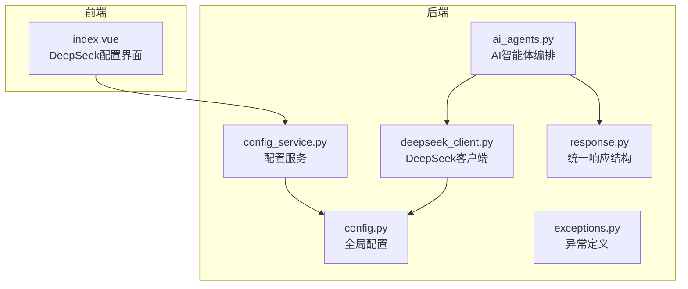
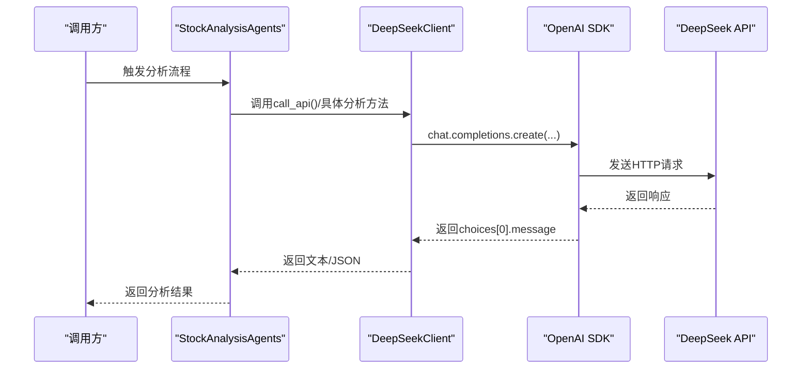
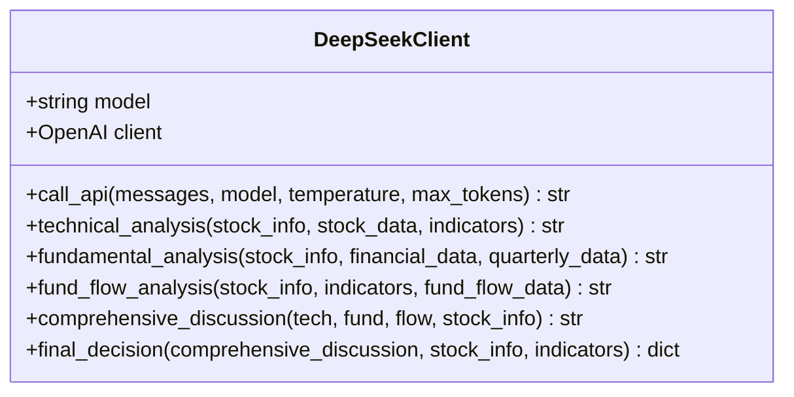
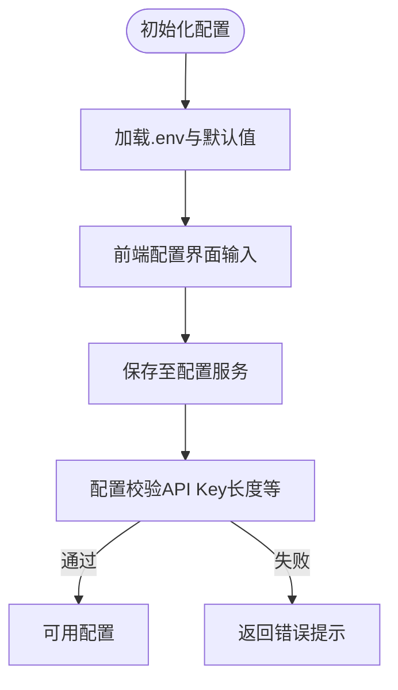
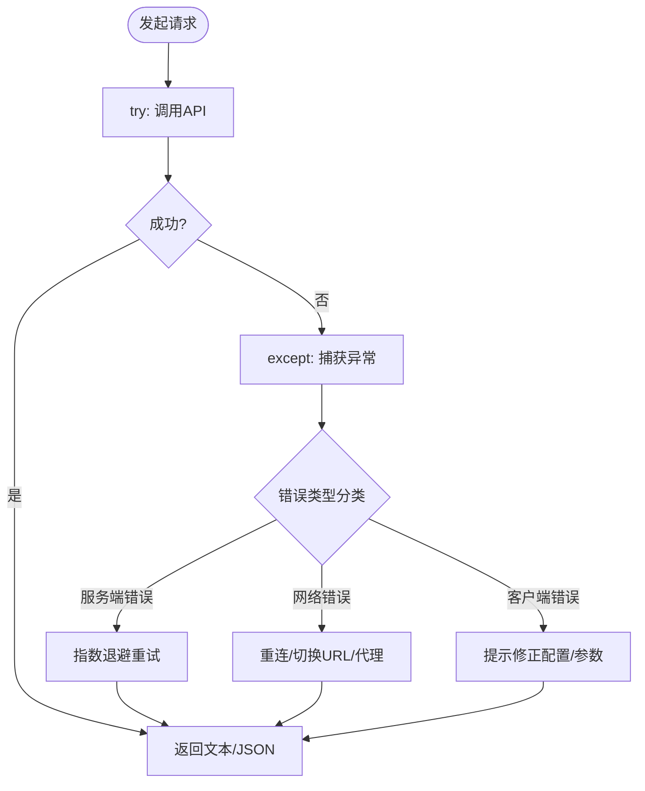
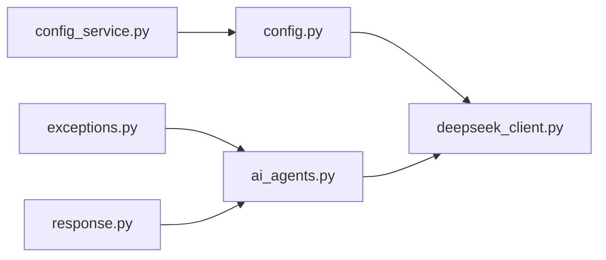

# DeepSeek客户端实现

<cite>
**本文引用的文件**
- [deepseek_client.py](file://backend/app/agents/deepseek_client.py)
- [config.py](file://backend/app/config.py)
- [ai_agents.py](file://backend/app/agents/ai_agents.py)
- [config_service.py](file://backend/app/services/config_service.py)
- [exceptions.py](file://backend/app/core/exceptions.py)
- [response.py](file://backend/app/api/response.py)
- [index.vue](file://frontend/src/views/config/index.vue)
</cite>

## 目录
1. [简介](#简介)
2. [项目结构](#项目结构)
3. [核心组件](#核心组件)
4. [架构总览](#架构总览)
5. [详细组件分析](#详细组件分析)
6. [依赖关系分析](#依赖关系分析)
7. [性能考虑](#性能考虑)
8. [故障排查指南](#故障排查指南)
9. [结论](#结论)

## 简介
本文件面向DeepSeek客户端的实现细节，聚焦于与DeepSeek API的通信机制。内容涵盖HTTP客户端配置、认证方式（API Key管理）、请求头设置与安全传输要求；深入解析重试机制的实现（当前未内置重试，但可通过上层封装实现指数退避与抖动应对）；阐述速率限制（Rate Limiting）的本地计数器实现与响应码处理逻辑；描述错误分类体系（客户端错误、服务端错误、网络错误）及其对应的恢复策略；并提供性能监控指标建议（平均响应时间、成功率统计等）。

## 项目结构
DeepSeek客户端位于后端Python代码中，作为AI智能体团队的底层通信组件，向上层提供统一的对话式调用接口，并在前端提供配置入口。

**图示来源**
- [ai_agents.py](file://backend/app/agents/ai_agents.py#L1-L20)
- [deepseek_client.py](file://backend/app/agents/deepseek_client.py#L1-L30)
- [config.py](file://backend/app/config.py#L36-L40)
- [config_service.py](file://backend/app/services/config_service.py#L43-L81)
- [exceptions.py](file://backend/app/core/exceptions.py#L1-L32)
- [response.py](file://backend/app/api/response.py#L1-L30)
- [index.vue](file://frontend/src/views/config/index.vue#L34-L59)

**章节来源**
- [ai_agents.py](file://backend/app/agents/ai_agents.py#L1-L20)
- [deepseek_client.py](file://backend/app/agents/deepseek_client.py#L1-L30)
- [config.py](file://backend/app/config.py#L36-L40)
- [config_service.py](file://backend/app/services/config_service.py#L43-L81)
- [index.vue](file://frontend/src/views/config/index.vue#L34-L59)

## 核心组件
- DeepSeek客户端类：封装OpenAI SDK客户端，负责与DeepSeek API交互，统一处理响应与错误。
- 配置模块：提供DEEPSEEK_API_KEY与DEEPSEEK_BASE_URL的默认值与加载逻辑。
- 配置服务：提供配置校验与测试能力，保障API Key与Base URL的有效性。
- 异常定义：定义业务异常类型，便于上层捕获与分类处理。
- 统一响应结构：提供统一的成功/错误响应模板，便于对外输出。

**章节来源**
- [deepseek_client.py](file://backend/app/agents/deepseek_client.py#L1-L30)
- [config.py](file://backend/app/config.py#L36-L40)
- [config_service.py](file://backend/app/services/config_service.py#L80-L120)
- [exceptions.py](file://backend/app/core/exceptions.py#L1-L32)
- [response.py](file://backend/app/api/response.py#L1-L30)

## 架构总览
DeepSeek客户端通过OpenAI兼容SDK发起请求，消息经由系统角色与用户角色构建，最终返回模型生成的文本。AI智能体编排层负责组织多轮对话与最终决策输出。

**图示来源**
- [ai_agents.py](file://backend/app/agents/ai_agents.py#L1-L20)
- [deepseek_client.py](file://backend/app/agents/deepseek_client.py#L16-L53)

## 详细组件分析

### DeepSeek客户端类
- 初始化与认证
  - 通过配置模块加载DEEPSEEK_API_KEY与DEEPSEEK_BASE_URL，创建OpenAI SDK客户端。
  - 客户端默认使用HTTPS协议，遵循OpenAI SDK的安全传输约定。
- 请求与响应
  - 支持动态模型切换与温度、最大token等参数传递。
  - 对“reasoner”类模型自动提升max_tokens，以容纳推理过程。
  - 统一异常捕获，返回可读的错误信息。
- 分析方法族
  - 技术面分析、基本面分析、资金面分析、综合讨论、最终决策等，均通过统一的call_api方法完成。
  - 最终决策方法会尝试解析JSON响应，若解析失败则回退为文本响应。

**图示来源**
- [deepseek_client.py](file://backend/app/agents/deepseek_client.py#L6-L458)

**章节来源**
- [deepseek_client.py](file://backend/app/agents/deepseek_client.py#L1-L53)
- [deepseek_client.py](file://backend/app/agents/deepseek_client.py#L54-L238)
- [deepseek_client.py](file://backend/app/agents/deepseek_client.py#L240-L353)
- [deepseek_client.py](file://backend/app/agents/deepseek_client.py#L354-L458)

### 配置与认证
- 配置来源
  - 默认值在配置模块中定义，同时支持从.env文件加载。
  - 前端配置界面允许用户输入API Key与Base URL，并提供接入说明。
- 认证方式
  - 使用HTTP请求头Authorization携带API Key（OpenAI SDK默认行为）。
  - Base URL指向DeepSeek官方或兼容入口，确保HTTPS安全传输。
- 配置校验
  - 配置服务对API Key进行长度校验，避免无效配置导致调用失败。

**图示来源**
- [config.py](file://backend/app/config.py#L36-L40)
- [config_service.py](file://backend/app/services/config_service.py#L80-L120)
- [index.vue](file://frontend/src/views/config/index.vue#L34-L59)

**章节来源**
- [config.py](file://backend/app/config.py#L36-L40)
- [config_service.py](file://backend/app/services/config_service.py#L80-L120)
- [index.vue](file://frontend/src/views/config/index.vue#L34-L59)

### 请求头与安全传输
- 请求头
  - OpenAI SDK默认在HTTP头部添加Authorization: Bearer <API_KEY>。
- 安全传输
  - 默认Base URL为HTTPS，确保数据在传输过程中加密。
  - 若需代理或特殊网络环境，可在SDK层面配置（本仓库未显式配置）。

**章节来源**
- [deepseek_client.py](file://backend/app/agents/deepseek_client.py#L11-L14)
- [index.vue](file://frontend/src/views/config/index.vue#L34-L59)

### 重试机制与网络抖动应对
- 现状
  - 客户端未内置重试与指数退避逻辑。
- 建议实现（概念性）
  - 在调用层引入指数退避与抖动（随机抖动），结合最大重试次数与超时阈值。
  - 对网络超时、连接异常、服务端临时不可用等场景进行重试。
  - 对429/5xx等明确的速率限制与服务端错误进行退避重试。
- 与现有代码的衔接
  - 可在call_api外层包裹重试装饰器或上下文管理器，避免侵入核心逻辑。

[本节为通用实现建议，不直接对应具体源码，故不附“章节来源”]

### 速率限制与本地计数器
- 现状
  - 客户端未实现本地速率限制计数器。
- 建议实现（概念性）
  - 维护每分钟/每小时的调用计数器，结合响应码与错误类型进行统计。
  - 当接近配额上限时，触发退避等待或降级请求。
  - 记录最近一次429/5xx响应的重试间隔，动态调整等待时间。
- 与现有代码的衔接
  - 可在调用层增加计数器与节流器，或在API路由层统一节流。

[本节为通用实现建议，不直接对应具体源码，故不附“章节来源”]

### 错误分类与恢复策略
- 错误分类
  - 客户端错误：配置错误（API Key缺失/格式不正确）、请求参数错误。
  - 服务端错误：DeepSeek服务内部错误、限流返回、上游依赖异常。
  - 网络错误：DNS解析失败、连接超时、TLS握手失败。
- 恢复策略
  - 客户端错误：提示用户修正配置或参数，拒绝继续重试。
  - 服务端错误：对可重试的临时错误进行退避重试；对429进行指数退避。
  - 网络错误：增加超时与重试，必要时切换备用Base URL或代理。
- 异常定义与统一响应
  - 使用统一异常类型与响应结构，便于上层捕获与展示。

**图示来源**
- [deepseek_client.py](file://backend/app/agents/deepseek_client.py#L16-L53)
- [exceptions.py](file://backend/app/core/exceptions.py#L1-L32)
- [response.py](file://backend/app/api/response.py#L1-L30)

**章节来源**
- [deepseek_client.py](file://backend/app/agents/deepseek_client.py#L16-L53)
- [exceptions.py](file://backend/app/core/exceptions.py#L1-L32)
- [response.py](file://backend/app/api/response.py#L1-L30)

### 性能监控指标建议
- 平均响应时间
  - 记录每次调用的开始与结束时间，计算平均值与分位数（P50/P95）。
- 成功率统计
  - 统计成功/失败次数与比例，按模型、接口类型分组。
- 速率限制观测
  - 记录429/5xx响应次数与重试次数，评估限流命中率。
- 资源与网络
  - 记录请求耗时分布、并发队列长度、网络往返时间等。

[本节为通用指标建议，不直接对应具体源码，故不附“章节来源”]

## 依赖关系分析
- 模块耦合
  - DeepSeek客户端依赖配置模块提供的API Key与Base URL。
  - AI智能体编排层依赖DeepSeek客户端，负责组织多轮对话与最终决策。
  - 配置服务负责配置校验与测试，保障API Key与Base URL的有效性。
- 外部依赖
  - OpenAI SDK用于与DeepSeek API通信。
  - FastAPI异常与响应结构用于统一错误与返回格式。

**图示来源**
- [config.py](file://backend/app/config.py#L36-L40)
- [deepseek_client.py](file://backend/app/agents/deepseek_client.py#L1-L30)
- [config_service.py](file://backend/app/services/config_service.py#L43-L81)
- [ai_agents.py](file://backend/app/agents/ai_agents.py#L1-L20)
- [exceptions.py](file://backend/app/core/exceptions.py#L1-L32)
- [response.py](file://backend/app/api/response.py#L1-L30)

**章节来源**
- [config.py](file://backend/app/config.py#L36-L40)
- [deepseek_client.py](file://backend/app/agents/deepseek_client.py#L1-L30)
- [config_service.py](file://backend/app/services/config_service.py#L43-L81)
- [ai_agents.py](file://backend/app/agents/ai_agents.py#L1-L20)
- [exceptions.py](file://backend/app/core/exceptions.py#L1-L32)
- [response.py](file://backend/app/api/response.py#L1-L30)

## 性能考虑
- 模型选择与token上限
  - 对reasoner类模型自动提高max_tokens，避免截断推理过程。
- 超时与并发
  - 建议在调用层设置合理超时与并发上限，避免阻塞。
- 缓存与去重
  - 对重复请求可引入缓存策略，减少不必要的调用。

[本节为通用性能建议，不直接对应具体源码，故不附“章节来源”]

## 故障排查指南
- API Key与Base URL
  - 确认配置服务返回“配置验证通过”，并在前端界面确认已保存。
- 常见错误
  - 客户端错误：API Key为空或格式不正确。
  - 服务端错误：DeepSeek服务内部错误或限流。
  - 网络错误：DNS解析失败、连接超时、TLS握手失败。
- 恢复步骤
  - 修正配置后重试；对服务端错误进行退避重试；对网络错误检查代理与证书。

**章节来源**
- [config_service.py](file://backend/app/services/config_service.py#L80-L120)
- [deepseek_client.py](file://backend/app/agents/deepseek_client.py#L16-L53)
- [index.vue](file://frontend/src/views/config/index.vue#L34-L59)

## 结论
DeepSeek客户端通过OpenAI SDK与DeepSeek API进行通信，具备统一的请求封装与错误处理。当前未内置重试与速率限制计数器，建议在调用层补充指数退避、抖动与本地计数器，以提升稳定性与可观测性。配置与异常处理模块为系统的可靠性提供了基础保障，结合统一响应结构可进一步完善用户体验与运维监控。