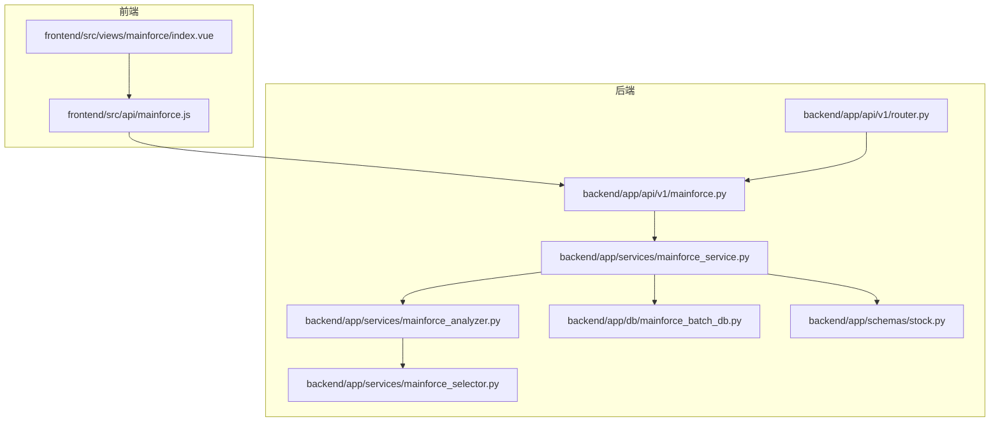
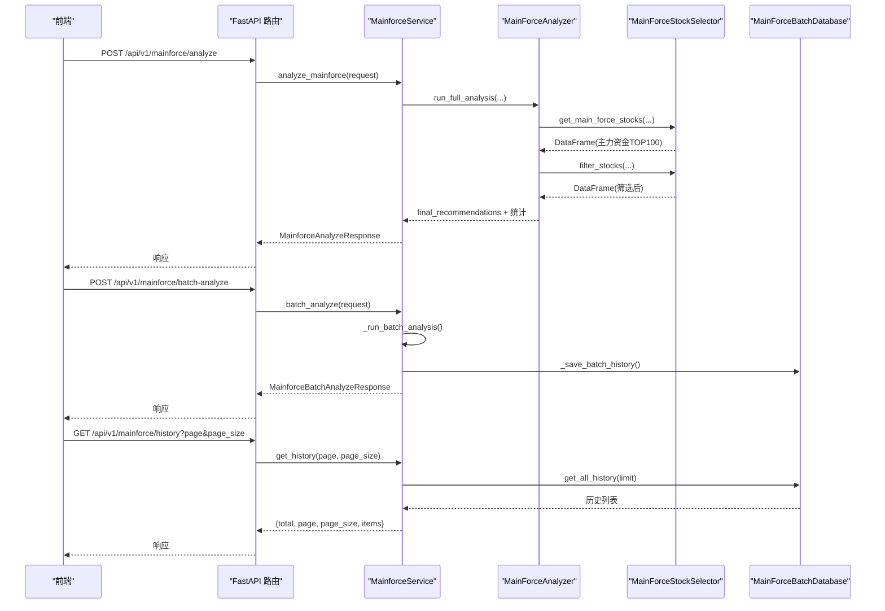
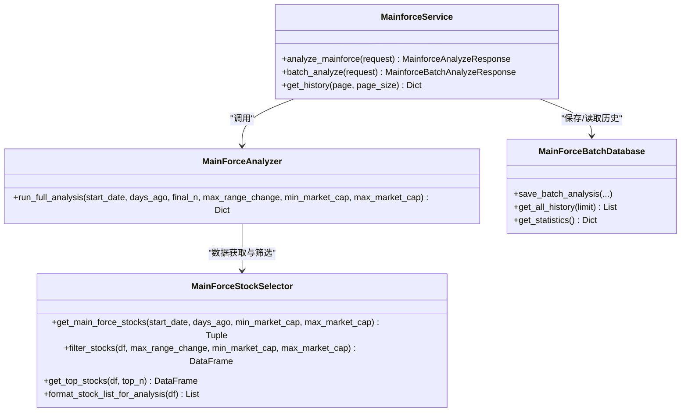

# 主力资金选股API

<cite>
**本文引用的文件**
- [backend/app/api/v1/mainforce.py](file://backend/app/api/v1/mainforce.py)
- [backend/app/api/v1/router.py](file://backend/app/api/v1/router.py)
- [backend/app/services/mainforce_service.py](file://backend/app/services/mainforce_service.py)
- [backend/app/services/mainforce_analyzer.py](file://backend/app/services/mainforce_analyzer.py)
- [backend/app/services/mainforce_selector.py](file://backend/app/services/mainforce_selector.py)
- [backend/app/db/mainforce_batch_db.py](file://backend/app/db/mainforce_batch_db.py)
- [backend/app/schemas/stock.py](file://backend/app/schemas/stock.py)
- [frontend/src/api/mainforce.js](file://frontend/src/api/mainforce.js)
- [frontend/src/views/mainforce/index.vue](file://frontend/src/views/mainforce/index.vue)
- [docs/主力选股功能说明.md](file://docs/主力选股功能说明.md)
- [docs/主力选股使用指南.md](file://docs/主力选股使用指南.md)
</cite>

## 目录
1. [简介](#简介)
2. [项目结构](#项目结构)
3. [核心组件](#核心组件)
4. [架构总览](#架构总览)
5. [详细组件分析](#详细组件分析)
6. [依赖关系分析](#依赖关系分析)
7. [性能与并发特性](#性能与并发特性)
8. [故障排查与错误处理](#故障排查与错误处理)
9. [结论](#结论)
10. [附录](#附录)

## 简介
本文件面向开发者，系统化梳理“主力资金选股”功能的后端API与前端集成方式，覆盖以下要点：
- 接口定义与使用方法：/api/v1/mainforce/analyze、/api/v1/mainforce/batch-analyze、/api/v1/mainforce/history
- 请求参数与响应字段：如选股周期、资金阈值、候选股票列表、资金流向评分等
- 与算法模块的调用关系：mainforce_analyzer.py 与 mainforce_selector.py 的协作
- 历史记录与批量分析：SQLite 历史表结构与统计接口
- 前端集成示例：mainforce.js 与前端页面 index.vue 的调用流程
- 错误处理策略与常见问题定位

## 项目结构
主力资金选股API位于后端 FastAPI 路由模块中，服务层负责协调数据获取、AI分析与历史持久化，前端通过统一的 API 模块发起请求。

图表来源
- [backend/app/api/v1/router.py](file://backend/app/api/v1/router.py#L1-L36)
- [backend/app/api/v1/mainforce.py](file://backend/app/api/v1/mainforce.py#L1-L62)
- [backend/app/services/mainforce_service.py](file://backend/app/services/mainforce_service.py#L1-L235)
- [backend/app/services/mainforce_analyzer.py](file://backend/app/services/mainforce_analyzer.py#L1-L564)
- [backend/app/services/mainforce_selector.py](file://backend/app/services/mainforce_selector.py#L1-L391)
- [backend/app/db/mainforce_batch_db.py](file://backend/app/db/mainforce_batch_db.py#L1-L302)
- [backend/app/schemas/stock.py](file://backend/app/schemas/stock.py#L1-L100)
- [frontend/src/api/mainforce.js](file://frontend/src/api/mainforce.js#L1-L30)
- [frontend/src/views/mainforce/index.vue](file://frontend/src/views/mainforce/index.vue#L1-L655)

章节来源
- [backend/app/api/v1/router.py](file://backend/app/api/v1/router.py#L1-L36)
- [backend/app/api/v1/mainforce.py](file://backend/app/api/v1/mainforce.py#L1-L62)

## 核心组件
- 路由与控制器
  - /api/v1/mainforce/analyze：主力选股分析
  - /api/v1/mainforce/batch-analyze：批量分析（支持顺序/并行）
  - /api/v1/mainforce/history：历史记录分页查询
- 服务层 MainforceService
  - analyze_mainforce：调用主分析器执行整体分析
  - batch_analyze：执行批量分析并将结果写入历史
  - get_history：读取历史记录并分页
- 分析器 MainForceAnalyzer
  - run_full_analysis：串联数据获取、筛选、整体AI分析与综合决策
- 选择器 MainForceStockSelector
  - get_main_force_stocks：基于问财pywencai获取主力资金净流入TOP100
  - filter_stocks：按涨跌幅与市值过滤
  - get_top_stocks：按主力资金排序取前N
  - format_stock_list_for_analysis：格式化为AI分析输入
- 历史数据库 MainForceBatchDatabase
  - save_batch_analysis：保存批量分析结果
  - get_all_history：查询历史记录
  - get_statistics：统计信息（总记录数、总分析股票数、成功率等）

章节来源
- [backend/app/api/v1/mainforce.py](file://backend/app/api/v1/mainforce.py#L1-L62)
- [backend/app/services/mainforce_service.py](file://backend/app/services/mainforce_service.py#L1-L235)
- [backend/app/services/mainforce_analyzer.py](file://backend/app/services/mainforce_analyzer.py#L1-L564)
- [backend/app/services/mainforce_selector.py](file://backend/app/services/mainforce_selector.py#L1-L391)
- [backend/app/db/mainforce_batch_db.py](file://backend/app/db/mainforce_batch_db.py#L1-L302)

## 架构总览
后端采用“路由-服务-分析器-选择器-数据库”的分层设计，前端通过统一API模块调用。

图表来源
- [backend/app/api/v1/mainforce.py](file://backend/app/api/v1/mainforce.py#L1-L62)
- [backend/app/services/mainforce_service.py](file://backend/app/services/mainforce_service.py#L1-L235)
- [backend/app/services/mainforce_analyzer.py](file://backend/app/services/mainforce_analyzer.py#L1-L564)
- [backend/app/services/mainforce_selector.py](file://backend/app/services/mainforce_selector.py#L1-L391)
- [backend/app/db/mainforce_batch_db.py](file://backend/app/db/mainforce_batch_db.py#L1-L302)

## 详细组件分析

### 接口定义与使用方法

- 端点：/api/v1/mainforce/analyze
  - 方法：POST
  - 请求体：MainforceAnalyzeRequest
  - 响应体：MainforceAnalyzeResponse
  - 用途：执行主力资金选股分析，返回候选与精选标的、统计信息及错误信息
  - 关键参数
    - start_date：起始日期（如"2025年10月1日"）
    - days_ago：距今天数（默认90）
    - final_n：最终精选数量（默认5）
    - max_range_change：最大涨跌幅阈值（默认30）
    - min_market_cap / max_market_cap：市值上下限（默认50亿~5000亿）
    - model：AI模型标识（默认"deepseek-chat"）
  - 响应字段
    - success：是否成功
    - total_stocks：原始获取数量
    - filtered_stocks：筛选后数量
    - final_recommendations：精选标的列表（包含rank、symbol、name、reasons、highlights、risks、position、investment_period、stock_data等）
    - params：请求参数快照
    - error：错误信息（可空）

- 端点：/api/v1/mainforce/batch-analyze
  - 方法：POST
  - 请求体：MainforceBatchAnalyzeRequest
  - 响应体：MainforceBatchAnalyzeResponse
  - 用途：对指定股票代码列表执行批量分析，并保存历史
  - 关键参数
    - stock_codes：股票代码数组（必填）
    - analysis_mode：sequential 或 parallel（默认sequential）
    - max_workers：并行工作线程数（默认3）
    - model：AI模型标识（默认"deepseek-chat"）
  - 响应字段
    - total：分析股票总数
    - success：成功数量
    - failed：失败数量
    - elapsed_time：总耗时（秒）
    - analysis_mode：分析模式
    - results：每只股票的分析结果（包含symbol、success、error等）

- 端点：/api/v1/mainforce/history
  - 方法：GET
  - 查询参数：page（默认1）、page_size（默认20）
  - 响应体：分页结构 {total, page, page_size, items}
  - 用途：获取批量分析历史记录（按创建时间倒序）

章节来源
- [backend/app/api/v1/mainforce.py](file://backend/app/api/v1/mainforce.py#L1-L62)
- [backend/app/schemas/stock.py](file://backend/app/schemas/stock.py#L62-L100)

### 与算法模块的调用关系

- 主力资金数据获取与筛选
  - MainForceAnalyzer.run_full_analysis 调用 MainForceStockSelector.get_main_force_stocks 获取主力资金净流入TOP100
  - 使用 filter_stocks 按涨跌幅与市值阈值进行过滤
  - 使用 get_top_stocks 按主力资金排序取前N（用于后续整体分析）
  - 使用 format_stock_list_for_analysis 将数据格式化为AI分析输入

- 整体AI分析与综合决策
  - run_full_analysis 内部调用三大分析师整体分析：资金流向、行业板块、财务基本面
  - 综合三位分析师观点，输出精选标的（包含rank、reasons、position、investment_period等）

- 批量分析与历史保存
  - MainforceService.batch_analyze 在线程池中执行 _run_batch_analysis
  - _run_batch_analysis 支持顺序/并行两种模式，聚合统计结果
  - _save_batch_history 将批量分析结果写入 SQLite 历史表

章节来源
- [backend/app/services/mainforce_analyzer.py](file://backend/app/services/mainforce_analyzer.py#L1-L564)
- [backend/app/services/mainforce_selector.py](file://backend/app/services/mainforce_selector.py#L1-L391)
- [backend/app/services/mainforce_service.py](file://backend/app/services/mainforce_service.py#L1-L235)
- [backend/app/db/mainforce_batch_db.py](file://backend/app/db/mainforce_batch_db.py#L1-L302)

### 历史记录与统计

- 表结构（SQLite）
  - 表名：batch_analysis_history
  - 字段：id、analysis_date、batch_count、analysis_mode、success_count、failed_count、total_time、results_json、created_at
  - 索引：idx_analysis_date
- 常用操作
  - 保存：save_batch_analysis
  - 查询：get_all_history（LIMIT）
  - 统计：get_statistics（总记录数、总分析股票数、总成功/失败数、平均耗时、成功率）

章节来源
- [backend/app/db/mainforce_batch_db.py](file://backend/app/db/mainforce_batch_db.py#L1-L302)

### 前端集成示例

- API封装（frontend/src/api/mainforce.js）
  - analyzeMainforce(data)：POST /api/v1/mainforce/analyze
  - batchAnalyzeMainforce(data)：POST /api/v1/mainforce/batch-analyze
  - getMainforceHistory(params)：GET /api/v1/mainforce/history
- 页面调用（frontend/src/views/mainforce/index.vue）
  - 参数组装：composePayload（model、final_n、max_range_change、min_market_cap、max_market_cap、start_date/days_ago）
  - 触发分析：handleAnalyze 调用 analyzeMainforce
  - 展示结果：analysisResult 中包含 final_recommendations、candidates、analyst_reports 等
  - 历史加载：loadHistory 调用 getMainforceHistory

章节来源
- [frontend/src/api/mainforce.js](file://frontend/src/api/mainforce.js#L1-L30)
- [frontend/src/views/mainforce/index.vue](file://frontend/src/views/mainforce/index.vue#L1-L655)

### 业务规则与数据字段说明

- 选股周期与资金阈值
  - start_date 或 days_ago 决定问财查询区间
  - max_range_change 控制区间涨跌幅上限，避免追高
  - min_market_cap / max_market_cap 控制市值区间，聚焦优质中盘
- 候选与精选
  - 候选列表：筛选后所有股票，包含股票代码、名称、行业、主力净流入、涨跌幅、市值、PE/PB等
  - 精选标的：包含rank、reasons（资金面、行业面、基本面理由）、investment_period、position、stock_data等
- 资金流向评分
  - 通过主力资金净流入列进行排序与筛选，作为“资金流向评分”的基础

章节来源
- [docs/主力选股功能说明.md](file://docs/主力选股功能说明.md#L1-L436)
- [docs/主力选股使用指南.md](file://docs/主力选股使用指南.md#L1-L314)
- [backend/app/services/mainforce_selector.py](file://backend/app/services/mainforce_selector.py#L1-L391)
- [backend/app/services/mainforce_analyzer.py](file://backend/app/services/mainforce_analyzer.py#L1-L564)

## 依赖关系分析

图表来源
- [backend/app/services/mainforce_service.py](file://backend/app/services/mainforce_service.py#L1-L235)
- [backend/app/services/mainforce_analyzer.py](file://backend/app/services/mainforce_analyzer.py#L1-L564)
- [backend/app/services/mainforce_selector.py](file://backend/app/services/mainforce_selector.py#L1-L391)
- [backend/app/db/mainforce_batch_db.py](file://backend/app/db/mainforce_batch_db.py#L1-L302)

## 性能与并发特性
- 异步与线程池
  - analyze_mainforce 与 batch_analyze 使用 asyncio.to_thread 在线程池中执行阻塞逻辑，避免阻塞事件循环
  - batch_analyze 支持 sequential 与 parallel 两种模式，parallel 使用 ThreadPoolExecutor 控制 max_workers
- I/O 与外部依赖
  - 问财pywencai数据获取可能受网络与服务可用性影响，建议设置合理的超时与重试策略
- 历史数据规模
  - SQLite 存储 results_json，对大数据量建议限制显示行数或分页查询

章节来源
- [backend/app/services/mainforce_service.py](file://backend/app/services/mainforce_service.py#L1-L235)
- [backend/app/db/mainforce_batch_db.py](file://backend/app/db/mainforce_batch_db.py#L1-L302)

## 故障排查与错误处理
- 常见错误
  - 问财数据获取失败：检查网络、pywencai服务状态、查询语句是否触发限制
  - 筛选后无数据：适当放宽 max_range_change 或扩大市值范围
  - 批量分析异常：检查 stock_codes 是否为空、max_workers 是否合理
- 后端错误处理
  - 路由层捕获异常并返回HTTP 500
  - 服务层捕获异常并返回标准化响应（success=false、error字段）
- 前端容错
  - 前端提供 fallback 示例数据，保证界面可用性
  - 历史接口未就绪时回退到示例数据

章节来源
- [backend/app/api/v1/mainforce.py](file://backend/app/api/v1/mainforce.py#L1-L62)
- [backend/app/services/mainforce_service.py](file://backend/app/services/mainforce_service.py#L1-L235)
- [frontend/src/views/mainforce/index.vue](file://frontend/src/views/mainforce/index.vue#L1-L655)

## 结论
主力资金选股API通过“路由-服务-分析器-选择器-数据库”的清晰分层，实现了从问财数据获取、智能筛选、整体AI分析到历史记录的完整闭环。前端通过统一API模块与页面逻辑，提供了直观的参数配置与结果展示。开发者可据此快速集成与扩展，同时遵循错误处理与性能优化的最佳实践。

## 附录

### API定义一览

- POST /api/v1/mainforce/analyze
  - 请求体：MainforceAnalyzeRequest
  - 响应体：MainforceAnalyzeResponse
- POST /api/v1/mainforce/batch-analyze
  - 请求体：MainforceBatchAnalyzeRequest
  - 响应体：MainforceBatchAnalyzeResponse
- GET /api/v1/mainforce/history
  - 查询参数：page、page_size
  - 响应体：分页结构

章节来源
- [backend/app/api/v1/mainforce.py](file://backend/app/api/v1/mainforce.py#L1-L62)
- [backend/app/schemas/stock.py](file://backend/app/schemas/stock.py#L62-L100)