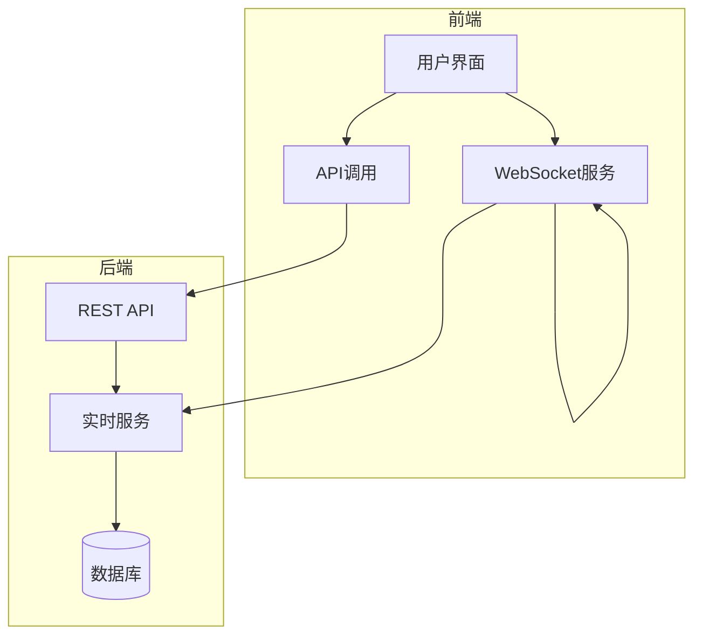
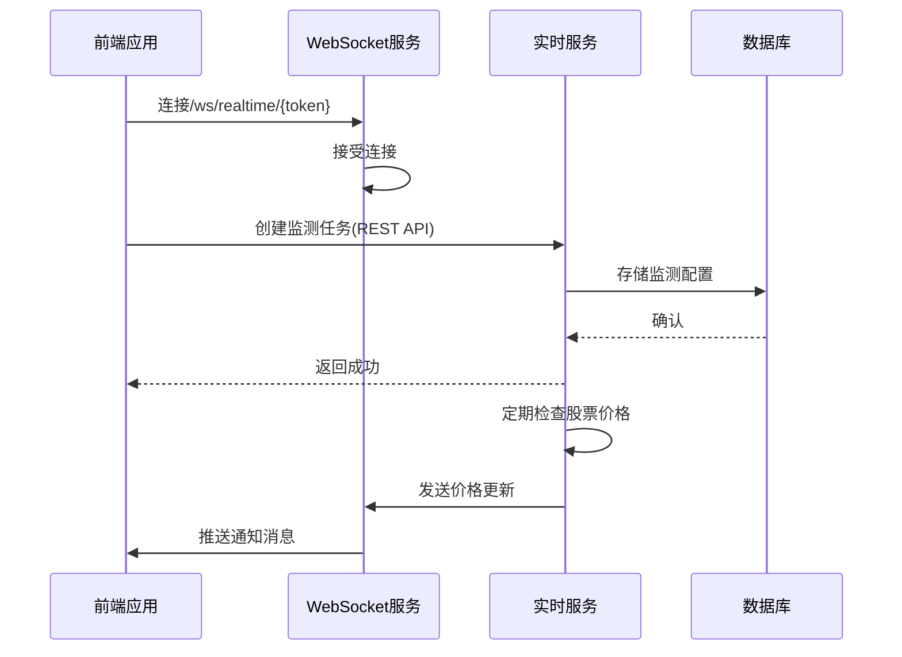
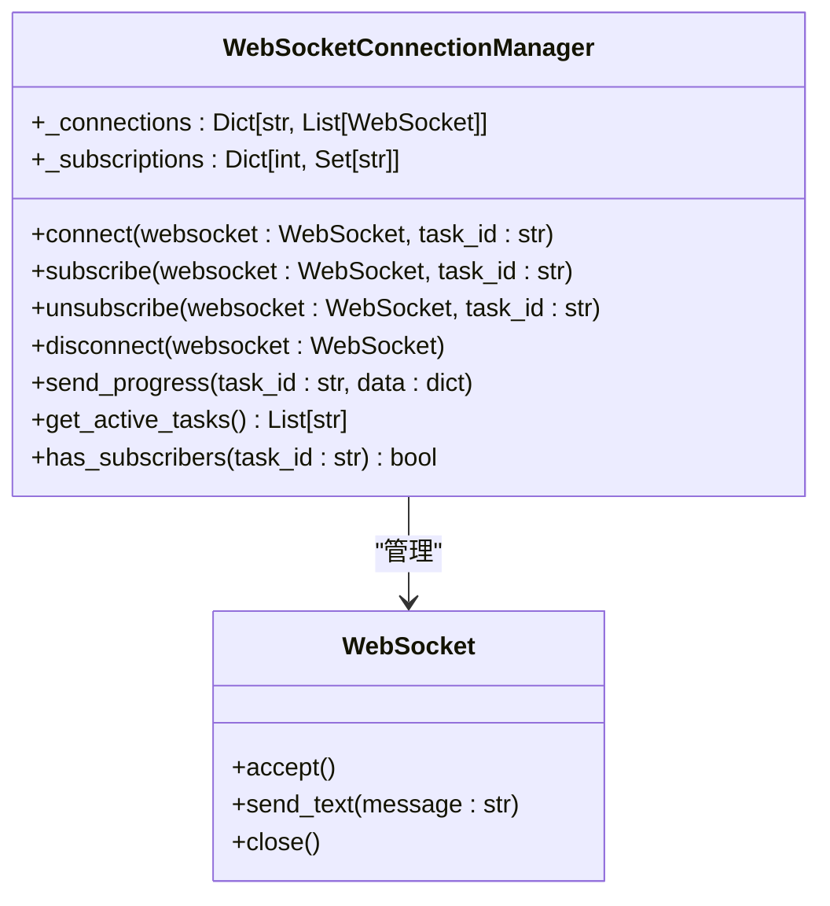
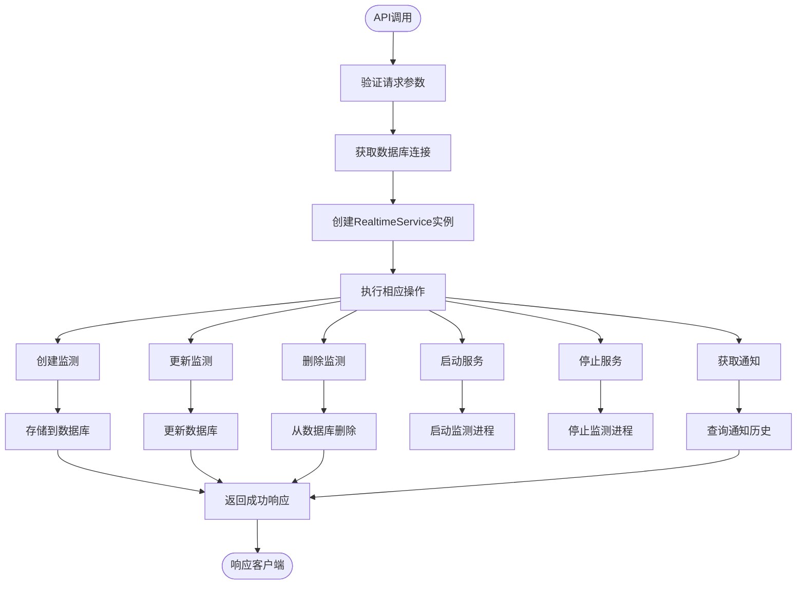
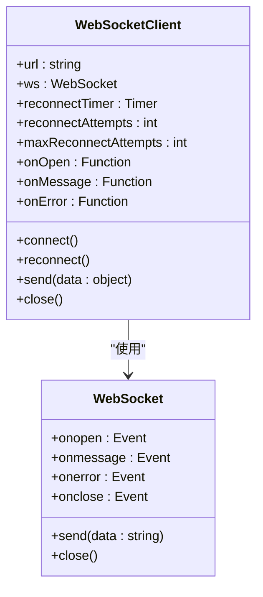
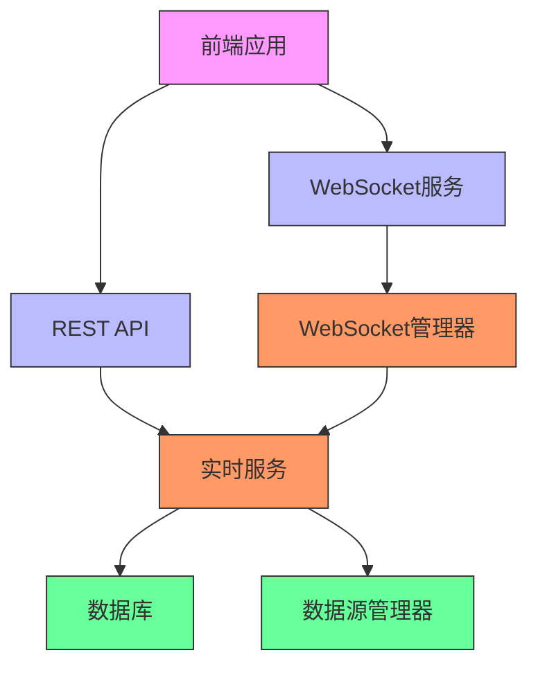

# 实时监测与通知API

<cite>
**本文档引用的文件**
- [realtime.py](file://backend/app/api/v1/realtime.py)
- [websocket_manager.py](file://backend/app/core/websocket_manager.py)
- [realtime_service.py](file://backend/app/services/realtime_service.py)
- [websocket.py](file://backend/app/api/websocket.py)
- [main.py](file://backend/app/main.py)
- [router.py](file://backend/app/api/v1/router.py)
- [realtime.js](file://frontend/src/api/realtime.js)
- [前后端拆分规划文档.md](file://docs/前后端拆分规划文档.md)
</cite>

## 目录
1. [简介](#简介)
2. [项目结构](#项目结构)
3. [核心组件](#核心组件)
4. [架构概述](#架构概述)
5. [详细组件分析](#详细组件分析)
6. [依赖分析](#依赖分析)
7. [性能考虑](#性能考虑)
8. [故障排除指南](#故障排除指南)
9. [结论](#结论)

## 简介
本文档详细描述了实时监测与通知系统的API，重点介绍WebSocket连接建立、实时数据订阅、消息推送等机制。系统提供实时股票价格监测、价格区间提醒、止盈止损通知等功能，支持通过WebSocket进行实时数据推送和REST API进行状态管理。

## 项目结构
系统采用前后端分离架构，后端基于FastAPI框架，前端使用Vue.js。实时监测功能主要由后端的WebSocket服务和实时数据服务组成，前端通过WebSocket连接接收实时数据更新。

**图示来源**
- [main.py](file://backend/app/main.py#L1-L92)
- [router.py](file://backend/app/api/v1/router.py#L1-L36)

**本节来源**
- [main.py](file://backend/app/main.py#L1-L92)
- [router.py](file://backend/app/api/v1/router.py#L1-L36)

## 核心组件
系统的核心组件包括WebSocket连接管理器、实时服务、REST API端点和前端WebSocket客户端。WebSocket连接管理器负责管理所有活跃的WebSocket连接和订阅关系，实时服务处理监测任务的创建、更新和删除，REST API提供服务状态管理接口，前端客户端实现断线重连机制。

**本节来源**
- [websocket_manager.py](file://backend/app/core/websocket_manager.py#L1-L119)
- [realtime_service.py](file://backend/app/services/realtime_service.py#L1-L49)

## 架构概述
系统采用事件驱动架构，通过WebSocket实现服务器到客户端的实时数据推送。当股票价格达到预设的监测条件时，系统会通过WebSocket向所有订阅该股票的客户端推送通知消息。REST API用于管理监测任务和查询通知历史。

**图示来源**
- [websocket_manager.py](file://backend/app/core/websocket_manager.py#L1-L119)
- [realtime.py](file://backend/app/api/v1/realtime.py#L1-L104)

## 详细组件分析

### WebSocket连接管理分析
WebSocket连接管理器负责管理所有活跃的连接和订阅关系。每个连接可以订阅多个监测任务，系统会为每个任务维护一个订阅者列表。

#### 连接管理类图

**图示来源**
- [websocket_manager.py](file://backend/app/core/websocket_manager.py#L12-L119)

**本节来源**
- [websocket_manager.py](file://backend/app/core/websocket_manager.py#L1-L119)

### 实时服务分析
实时服务负责处理所有与监测相关的业务逻辑，包括监测任务的CRUD操作、服务启停控制和通知历史查询。

#### 服务方法调用流程

**图示来源**
- [realtime.py](file://backend/app/api/v1/realtime.py#L14-L104)
- [realtime_service.py](file://backend/app/services/realtime_service.py#L8-L49)

**本节来源**
- [realtime.py](file://backend/app/api/v1/realtime.py#L1-L104)
- [realtime_service.py](file://backend/app/services/realtime_service.py#L1-L49)

### 前端连接示例分析
前端通过封装的WebSocket客户端实现与后端的实时连接，包含断线重连机制和错误处理。

#### 前端WebSocket客户端实现

**图示来源**
- [前后端拆分规划文档.md](file://docs/前后端拆分规划文档.md#L1078-L1142)
- [realtime.js](file://frontend/src/api/realtime.js#L1-L62)

**本节来源**
- [前后端拆分规划文档.md](file://docs/前后端拆分规划文档.md#L1078-L1142)
- [realtime.js](file://frontend/src/api/realtime.js#L1-L62)

## 依赖分析
系统各组件之间存在明确的依赖关系，后端服务依赖数据库和WebSocket管理器，前端依赖后端API和WebSocket服务。

**图示来源**
- [main.py](file://backend/app/main.py#L1-L92)
- [router.py](file://backend/app/api/v1/router.py#L1-L36)
- [websocket_manager.py](file://backend/app/core/websocket_manager.py#L1-L119)

**本节来源**
- [main.py](file://backend/app/main.py#L1-L92)
- [router.py](file://backend/app/api/v1/router.py#L1-L36)
- [websocket_manager.py](file://backend/app/core/websocket_manager.py#L1-L119)

## 性能考虑
系统在设计时考虑了多项性能优化措施，包括连接池管理、批量数据处理和缓存机制。WebSocket连接管理器使用字典结构存储连接和订阅关系，确保O(1)时间复杂度的查找和更新操作。实时服务采用异步处理模式，避免阻塞主线程。

## 故障排除指南
常见问题包括WebSocket连接失败、消息推送延迟和数据不一致等。建议检查网络连接、验证token有效性、确认服务运行状态，并查看系统日志获取详细错误信息。

**本节来源**
- [websocket_manager.py](file://backend/app/core/websocket_manager.py#L85-L102)
- [realtime.py](file://backend/app/api/v1/realtime.py#L19-L22)

## 结论
实时监测与通知系统通过WebSocket实现了高效的数据推送机制，结合REST API提供了完整的任务管理功能。系统架构清晰，组件职责明确，具备良好的可扩展性和稳定性，能够满足实时股票监测和通知的需求。