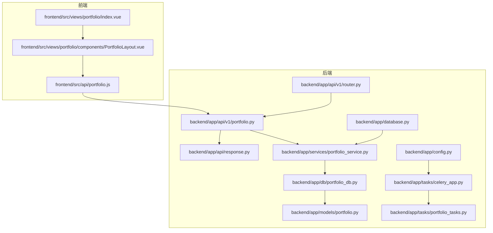
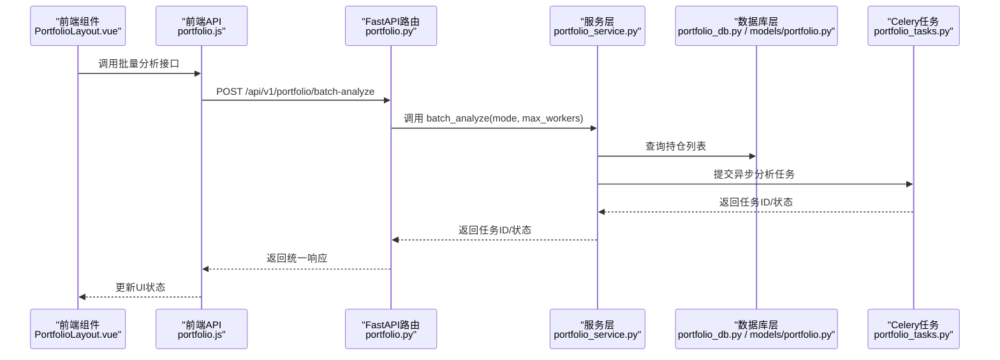
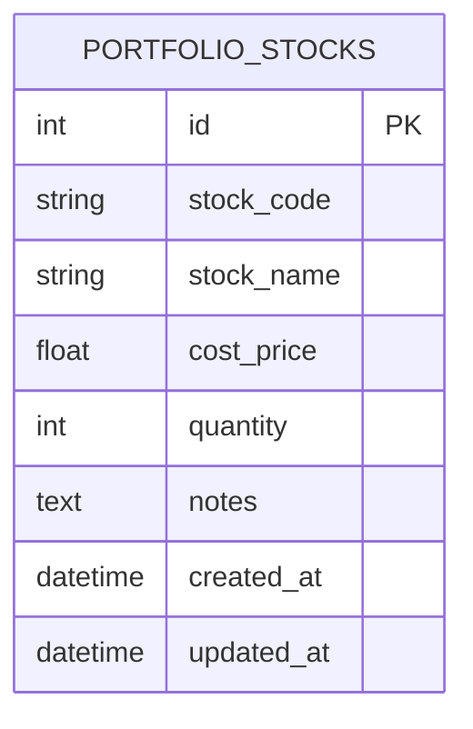
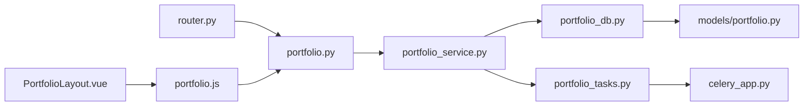

# 投资组合分析API

<cite>
**本文引用的文件**
- [backend/app/api/v1/router.py](file://backend/app/api/v1/router.py)
- [backend/app/api/v1/portfolio.py](file://backend/app/api/v1/portfolio.py)
- [backend/app/api/response.py](file://backend/app/api/response.py)
- [backend/app/services/portfolio_service.py](file://backend/app/services/portfolio_service.py)
- [backend/app/db/portfolio_db.py](file://backend/app/db/portfolio_db.py)
- [backend/app/models/portfolio.py](file://backend/app/models/portfolio.py)
- [backend/app/tasks/celery_app.py](file://backend/app/tasks/celery_app.py)
- [backend/app/tasks/portfolio_tasks.py](file://backend/app/tasks/portfolio_tasks.py)
- [backend/app/database.py](file://backend/app/database.py)
- [backend/app/config.py](file://backend/app/config.py)
- [frontend/src/api/portfolio.js](file://frontend/src/api/portfolio.js)
- [frontend/src/views/portfolio/index.vue](file://frontend/src/views/portfolio/index.vue)
- [frontend/src/views/portfolio/components/PortfolioLayout.vue](file://frontend/src/views/portfolio/components/PortfolioLayout.vue)
- [docs/PORTFOLIO_USAGE.md](file://docs/PORTFOLIO_USAGE.md)
</cite>

## 目录
1. [简介](#简介)
2. [项目结构](#项目结构)
3. [核心组件](#核心组件)
4. [架构总览](#架构总览)
5. [详细组件分析](#详细组件分析)
6. [依赖关系分析](#依赖关系分析)
7. [性能考虑](#性能考虑)
8. [故障排除指南](#故障排除指南)
9. [结论](#结论)
10. [附录](#附录)

## 简介
本文件面向“投资组合分析API”的使用者与维护者，系统性梳理后端FastAPI路由、服务层、数据库模型、异步任务（Celery）以及前端Vue组件之间的协作关系。重点覆盖以下接口与功能：
- 组合创建与管理：/portfolio/stocks 的增删改查
- 持仓分析：/portfolio/batch-analyze 的批量分析
- 定时任务配置：/portfolio/schedule 的读取与设置
- 分析历史查询：/portfolio/history 的分页查询
- 异步任务集成：portfolio_tasks.py 与 Celery 的对接
- 前端交互：portfolio.vue 与 PortfolioLayout.vue 的数据流
- 错误处理与性能优化建议（如分页）

## 项目结构
后端采用 FastAPI + SQLAlchemy + Celery 架构，前端使用 Vue + Element Plus。路由通过 v1/router.py 汇总注册，portfolio.py 定义投资组合相关接口；服务层 portfolio_service.py 提供业务逻辑；portfolio_db.py 和 models/portfolio.py 负责数据访问与模型定义；tasks/portfolio_tasks.py 用于异步分析任务；前端通过 api/portfolio.js 调用后端接口。

图表来源
- [backend/app/api/v1/router.py](file://backend/app/api/v1/router.py#L1-L36)
- [backend/app/api/v1/portfolio.py](file://backend/app/api/v1/portfolio.py#L1-L123)
- [backend/app/api/response.py](file://backend/app/api/response.py#L1-L31)
- [backend/app/services/portfolio_service.py](file://backend/app/services/portfolio_service.py#L1-L54)
- [backend/app/db/portfolio_db.py](file://backend/app/db/portfolio_db.py#L1-L6)
- [backend/app/models/portfolio.py](file://backend/app/models/portfolio.py#L1-L22)
- [backend/app/database.py](file://backend/app/database.py#L1-L45)
- [backend/app/config.py](file://backend/app/config.py#L1-L92)
- [backend/app/tasks/celery_app.py](file://backend/app/tasks/celery_app.py#L1-L21)
- [backend/app/tasks/portfolio_tasks.py](file://backend/app/tasks/portfolio_tasks.py#L1-L13)
- [frontend/src/api/portfolio.js](file://frontend/src/api/portfolio.js#L1-L73)
- [frontend/src/views/portfolio/index.vue](file://frontend/src/views/portfolio/index.vue#L1-L14)
- [frontend/src/views/portfolio/components/PortfolioLayout.vue](file://frontend/src/views/portfolio/components/PortfolioLayout.vue#L1-L1236)

章节来源
- [backend/app/api/v1/router.py](file://backend/app/api/v1/router.py#L1-L36)
- [backend/app/api/v1/portfolio.py](file://backend/app/api/v1/portfolio.py#L1-L123)
- [backend/app/api/response.py](file://backend/app/api/response.py#L1-L31)
- [backend/app/services/portfolio_service.py](file://backend/app/services/portfolio_service.py#L1-L54)
- [backend/app/db/portfolio_db.py](file://backend/app/db/portfolio_db.py#L1-L6)
- [backend/app/models/portfolio.py](file://backend/app/models/portfolio.py#L1-L22)
- [backend/app/database.py](file://backend/app/database.py#L1-L45)
- [backend/app/config.py](file://backend/app/config.py#L1-L92)
- [backend/app/tasks/celery_app.py](file://backend/app/tasks/celery_app.py#L1-L21)
- [backend/app/tasks/portfolio_tasks.py](file://backend/app/tasks/portfolio_tasks.py#L1-L13)
- [frontend/src/api/portfolio.js](file://frontend/src/api/portfolio.js#L1-L73)
- [frontend/src/views/portfolio/index.vue](file://frontend/src/views/portfolio/index.vue#L1-L14)
- [frontend/src/views/portfolio/components/PortfolioLayout.vue](file://frontend/src/views/portfolio/components/PortfolioLayout.vue#L1-L1236)

## 核心组件
- 路由注册：v1/router.py 将 portfolio 路由挂载到 /portfolio 前缀下，统一管理各模块。
- 接口定义：portfolio.py 提供 /stocks、/batch-analyze、/schedule、/history 等端点。
- 响应封装：response.py 提供统一的成功/错误响应结构。
- 服务层：portfolio_service.py 定义 get_stocks、create_stock、update_stock、delete_stock、batch_analyze、get_schedule、set_schedule、get_history 等方法（当前为占位实现，后续补充）。
- 数据模型：models/portfolio.py 定义 PortfolioStock 表结构（股票代码、名称、成本价、数量、备注、时间戳等）。
- 数据访问：db/portfolio_db.py 作为数据库操作入口（当前为占位，后续迁移逻辑）。
- 异步任务：tasks/celery_app.py 初始化 Celery，tasks/portfolio_tasks.py 定义 portfolio_analysis_task（占位，后续实现）。
- 前端交互：frontend/src/api/portfolio.js 定义与后端交互的函数；index.vue 与 PortfolioLayout.vue 负责页面布局与数据展示。

章节来源
- [backend/app/api/v1/router.py](file://backend/app/api/v1/router.py#L1-L36)
- [backend/app/api/v1/portfolio.py](file://backend/app/api/v1/portfolio.py#L1-L123)
- [backend/app/api/response.py](file://backend/app/api/response.py#L1-L31)
- [backend/app/services/portfolio_service.py](file://backend/app/services/portfolio_service.py#L1-L54)
- [backend/app/models/portfolio.py](file://backend/app/models/portfolio.py#L1-L22)
- [backend/app/db/portfolio_db.py](file://backend/app/db/portfolio_db.py#L1-L6)
- [backend/app/tasks/celery_app.py](file://backend/app/tasks/celery_app.py#L1-L21)
- [backend/app/tasks/portfolio_tasks.py](file://backend/app/tasks/portfolio_tasks.py#L1-L13)
- [frontend/src/api/portfolio.js](file://frontend/src/api/portfolio.js#L1-L73)
- [frontend/src/views/portfolio/index.vue](file://frontend/src/views/portfolio/index.vue#L1-L14)
- [frontend/src/views/portfolio/components/PortfolioLayout.vue](file://frontend/src/views/portfolio/components/PortfolioLayout.vue#L1-L1236)

## 架构总览
后端采用“路由-服务-数据层-异步任务”的分层设计。前端通过 axios 封装的 API 函数调用后端接口，后端在服务层组织业务逻辑，使用 SQLAlchemy 模型与数据库交互，异步分析通过 Celery 任务队列执行，最终将结果持久化到历史记录中。

图表来源
- [frontend/src/views/portfolio/components/PortfolioLayout.vue](file://frontend/src/views/portfolio/components/PortfolioLayout.vue#L1-L1236)
- [frontend/src/api/portfolio.js](file://frontend/src/api/portfolio.js#L1-L73)
- [backend/app/api/v1/portfolio.py](file://backend/app/api/v1/portfolio.py#L1-L123)
- [backend/app/services/portfolio_service.py](file://backend/app/services/portfolio_service.py#L1-L54)
- [backend/app/db/portfolio_db.py](file://backend/app/db/portfolio_db.py#L1-L6)
- [backend/app/models/portfolio.py](file://backend/app/models/portfolio.py#L1-L22)
- [backend/app/tasks/portfolio_tasks.py](file://backend/app/tasks/portfolio_tasks.py#L1-L13)

## 详细组件分析

### 接口定义与参数说明
- GET /api/v1/portfolio/stocks
  - 功能：获取持仓列表
  - 参数：无
  - 响应：统一成功结构，data 为股票列表
  - 错误：HTTP 500，message 为异常字符串
- POST /api/v1/portfolio/stocks
  - 功能：添加持仓
  - 请求体：stock_data（字典），建议包含 stock_code、stock_name、cost_price、quantity、notes、auto_monitor 等
  - 响应：统一成功结构，message 为“持仓创建成功”
  - 错误：HTTP 500
- PUT /api/v1/portfolio/stocks/{stock_id}
  - 功能：更新持仓
  - 路径参数：stock_id（整数）
  - 请求体：stock_data（字典）
  - 响应：统一成功结构，message 为“持仓更新成功”
  - 错误：HTTP 500
- DELETE /api/v1/portfolio/stocks/{stock_id}
  - 功能：删除持仓
  - 路径参数：stock_id（整数）
  - 响应：统一成功结构，message 为“持仓删除成功”
  - 错误：HTTP 500
- POST /api/v1/portfolio/batch-analyze
  - 功能：批量分析
  - 查询参数：mode（字符串，sequential/parallel，默认 sequential）、max_workers（整数，默认 3）
  - 响应：统一成功结构，data 为分析概要（total、succeeded、failed、elapsed_time 等）
  - 错误：HTTP 500
- GET /api/v1/portfolio/schedule
  - 功能：获取定时配置
  - 响应：统一成功结构，data 为定时时间数组与分析参数
  - 错误：HTTP 500
- POST /api/v1/portfolio/schedule
  - 功能：设置定时配置
  - 请求体：schedule_times（列表，如 ["09:35","13:05","15:05"]）
  - 响应：统一成功结构，message 为“定时配置已更新”
  - 错误：HTTP 500
- GET /api/v1/portfolio/history
  - 功能：分析历史
  - 查询参数：stock_code（可选）、page（整数，默认 1）、page_size（整数，默认 20）
  - 响应：统一成功结构，data 包含历史记录列表与分页信息
  - 错误：HTTP 500

章节来源
- [backend/app/api/v1/portfolio.py](file://backend/app/api/v1/portfolio.py#L1-L123)
- [backend/app/api/response.py](file://backend/app/api/response.py#L1-L31)

### 前端交互流程
- portfolio.js 封装了与后端的交互函数，包括获取/创建/更新/删除持仓、批量分析、定时配置读取与设置、历史查询。
- index.vue 作为入口，渲染 PortfolioLayout.vue。
- PortfolioLayout.vue：
  - 持仓管理：加载股票列表、添加/编辑/删除、统计信息（总股票数、自动监测数、有持仓数、估算成本）。
  - 批量分析：选择分析模式（顺序/并行）、设置并行线程数、自动同步与通知开关，发起分析请求，展示结果概要与明细。
  - 定时任务：配置多个分析时间点，设置分析模式、并行线程、自动同步与通知，保存配置。
  - 历史记录：支持按股票代码筛选、分页浏览，展示评级、置信度、进场区间、目标价、止盈止损、摘要等。
- 页面初始化时会拉取持仓、定时配置与历史记录（按需）。

章节来源
- [frontend/src/api/portfolio.js](file://frontend/src/api/portfolio.js#L1-L73)
- [frontend/src/views/portfolio/index.vue](file://frontend/src/views/portfolio/index.vue#L1-L14)
- [frontend/src/views/portfolio/components/PortfolioLayout.vue](file://frontend/src/views/portfolio/components/PortfolioLayout.vue#L1-L1236)

### 服务层与数据库模型
- PortfolioService（占位实现）：定义 get_stocks、create_stock、update_stock、delete_stock、batch_analyze、get_schedule、set_schedule、get_history 等方法，后续将实现核心计算逻辑与数据访问。
- PortfolioStock 模型：定义持仓表字段（stock_code、stock_name、cost_price、quantity、notes、created_at、updated_at），用于持久化持仓信息。
- portfolio_db.py：作为数据库操作入口（当前占位，后续迁移现有项目逻辑）。

章节来源
- [backend/app/services/portfolio_service.py](file://backend/app/services/portfolio_service.py#L1-L54)
- [backend/app/models/portfolio.py](file://backend/app/models/portfolio.py#L1-L22)
- [backend/app/db/portfolio_db.py](file://backend/app/db/portfolio_db.py#L1-L6)

### 异步任务与Celery集成
- celery_app.py：初始化 Celery 应用，配置 broker/backend（优先使用 Redis，否则本地 redis），序列化方式与时区。
- portfolio_tasks.py：定义 portfolio_analysis_task（占位），后续将实现批量分析的具体任务逻辑。
- 与接口的关系：/portfolio/batch-analyze 可直接返回任务ID或状态，前端轮询或通过 WebSocket 获取进度；也可在服务层提交 Celery 任务并在任务完成后写入历史记录。

章节来源
- [backend/app/tasks/celery_app.py](file://backend/app/tasks/celery_app.py#L1-L21)
- [backend/app/tasks/portfolio_tasks.py](file://backend/app/tasks/portfolio_tasks.py#L1-L13)

### 数据模型与关系

图表来源
- [backend/app/models/portfolio.py](file://backend/app/models/portfolio.py#L1-L22)

## 依赖关系分析
- 路由依赖：v1/router.py 将 portfolio 路由注册到 /portfolio 前缀，portfolio.py 中的接口均通过该前缀暴露。
- 服务依赖：portfolio.py 中的每个接口都依赖 PortfolioService，后者依赖数据库层（portfolio_db.py 与 models/portfolio.py）。
- 异步依赖：portfolio_tasks.py 依赖 celery_app.py；portfolio.py 的批量分析接口可调用服务层，服务层可提交 Celery 任务。
- 前端依赖：PortfolioLayout.vue 通过 portfolio.js 调用后端接口；index.vue 仅负责加载布局组件。

图表来源
- [backend/app/api/v1/router.py](file://backend/app/api/v1/router.py#L1-L36)
- [backend/app/api/v1/portfolio.py](file://backend/app/api/v1/portfolio.py#L1-L123)
- [backend/app/services/portfolio_service.py](file://backend/app/services/portfolio_service.py#L1-L54)
- [backend/app/db/portfolio_db.py](file://backend/app/db/portfolio_db.py#L1-L6)
- [backend/app/models/portfolio.py](file://backend/app/models/portfolio.py#L1-L22)
- [backend/app/tasks/portfolio_tasks.py](file://backend/app/tasks/portfolio_tasks.py#L1-L13)
- [backend/app/tasks/celery_app.py](file://backend/app/tasks/celery_app.py#L1-L21)
- [frontend/src/views/portfolio/components/PortfolioLayout.vue](file://frontend/src/views/portfolio/components/PortfolioLayout.vue#L1-L1236)
- [frontend/src/api/portfolio.js](file://frontend/src/api/portfolio.js#L1-L73)

## 性能考虑
- 分页查询：/portfolio/history 支持 page 与 page_size，建议前端在历史记录较多时使用分页，避免一次性加载过多数据。
- 并行分析：/portfolio/batch-analyze 支持 sequential 与 parallel 模式，合理设置 max_workers，避免触发外部API限速或网络拥塞。
- 数据库访问：PortfolioStock 表包含 stock_code 索引，查询时注意索引命中；批量分析时尽量减少重复查询。
- 异步任务：将耗时分析放入 Celery 任务，避免阻塞主请求线程；任务完成后写入历史记录，前端轮询或订阅通知获取结果。
- 资源消耗：根据 PORTFOLIO_USAGE.md 的性能参数，顺序分析与并行分析的速度与资源消耗不同，建议结合持仓数量选择合适模式。

章节来源
- [backend/app/api/v1/portfolio.py](file://backend/app/api/v1/portfolio.py#L1-L123)
- [docs/PORTFOLIO_USAGE.md](file://docs/PORTFOLIO_USAGE.md#L293-L332)

## 故障排除指南
- HTTP 500 错误：后端接口捕获异常并返回统一错误结构，message 为异常字符串。前端应提示用户重试或查看后端日志。
- 批量分析失败率高：切换为顺序分析模式、降低并行线程数、检查网络与外部API额度。
- 定时任务未执行：确认调度器运行状态、应用持续运行、系统时间与设定时间一致。
- 监测同步不生效：检查“自动监测”开关、分析是否成功、结果是否包含进场区间与止盈止损。
- 历史记录为空：确认是否已执行分析、是否正确传入 stock_code、是否使用分页参数。

章节来源
- [backend/app/api/v1/portfolio.py](file://backend/app/api/v1/portfolio.py#L1-L123)
- [docs/PORTFOLIO_USAGE.md](file://docs/PORTFOLIO_USAGE.md#L242-L332)

## 结论
本API围绕“投资组合分析”构建，提供完整的持仓管理、批量分析、定时任务与历史查询能力。当前服务层与数据库层仍为占位实现，后续需补充核心计算逻辑与数据访问细节。前端通过 PortfolioLayout.vue 与 portfolio.js 实现直观的交互体验。建议尽快完善 portfolio_service.py、portfolio_db.py 与 portfolio_tasks.py 的实现，以支撑完整的异步分析与历史归档流程。

## 附录

### 接口一览与响应结构
- 统一响应结构
  - 成功：{"code": 200, "message": "success", "data": any}
  - 错误：{"code": 500, "message": "error", "data": any}

章节来源
- [backend/app/api/response.py](file://backend/app/api/response.py#L1-L31)

### 前端API函数映射
- getPortfolioStocks(params) -> GET /api/v1/portfolio/stocks
- createPortfolioStock(data) -> POST /api/v1/portfolio/stocks
- updatePortfolioStock(id, data) -> PUT /api/v1/portfolio/stocks/{id}
- deletePortfolioStock(id) -> DELETE /api/v1/portfolio/stocks/{id}
- batchAnalyzePortfolio(data) -> POST /api/v1/portfolio/batch-analyze
- getPortfolioSchedule() -> GET /api/v1/portfolio/schedule
- setPortfolioSchedule(data) -> POST /api/v1/portfolio/schedule
- getPortfolioHistory(params) -> GET /api/v1/portfolio/history

章节来源
- [frontend/src/api/portfolio.js](file://frontend/src/api/portfolio.js#L1-L73)

### 与旧版文档的关联
- PORTFOLIO_USAGE.md 提供了分析速度、资源消耗与最佳实践，可用于指导接口调用与任务配置。

章节来源
- [docs/PORTFOLIO_USAGE.md](file://docs/PORTFOLIO_USAGE.md#L293-L332)