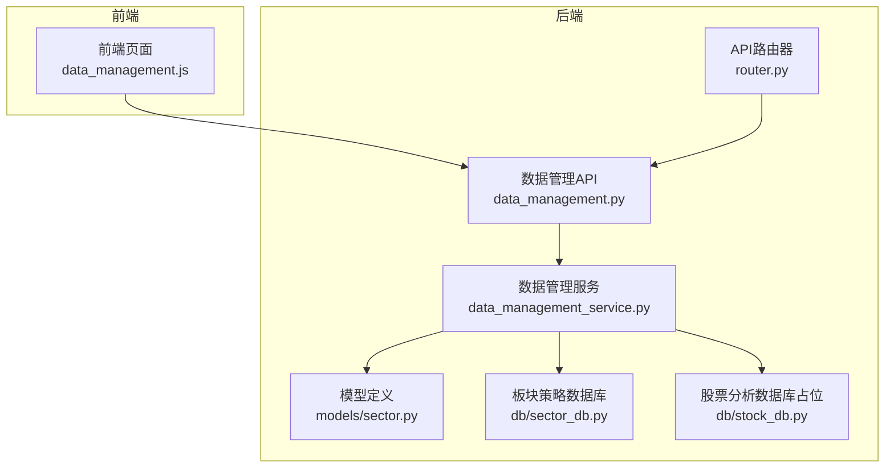
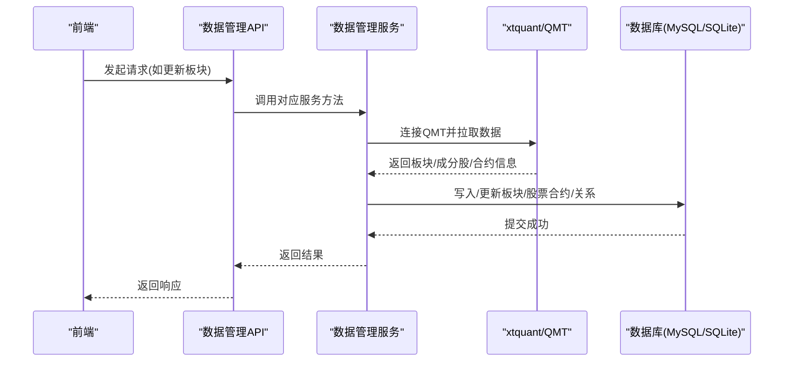
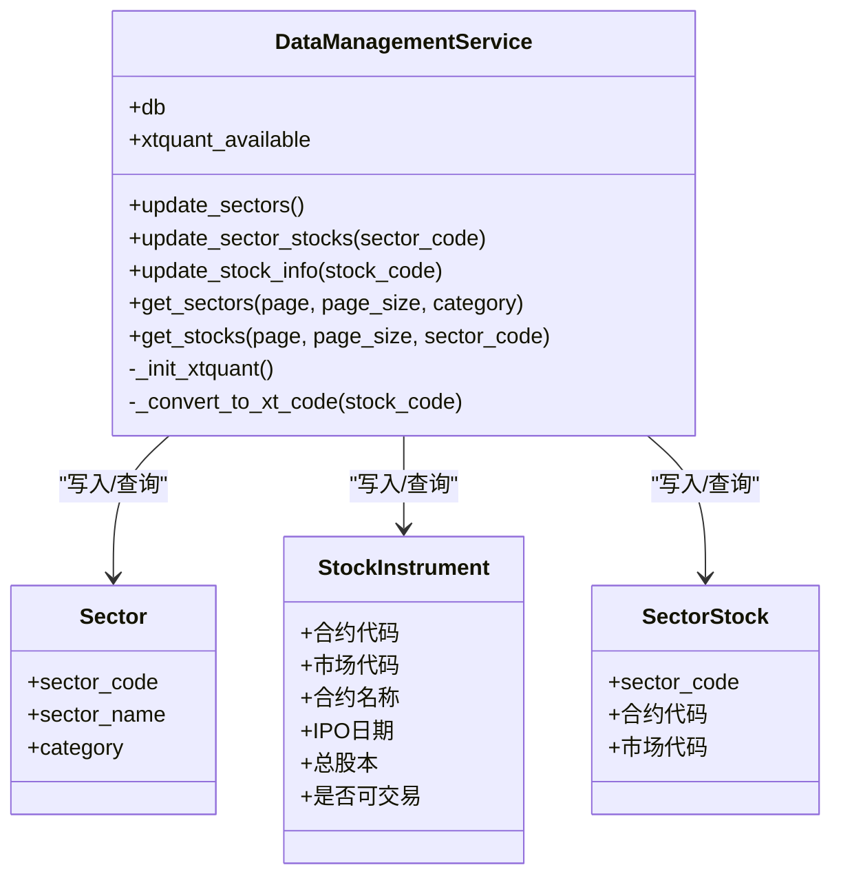
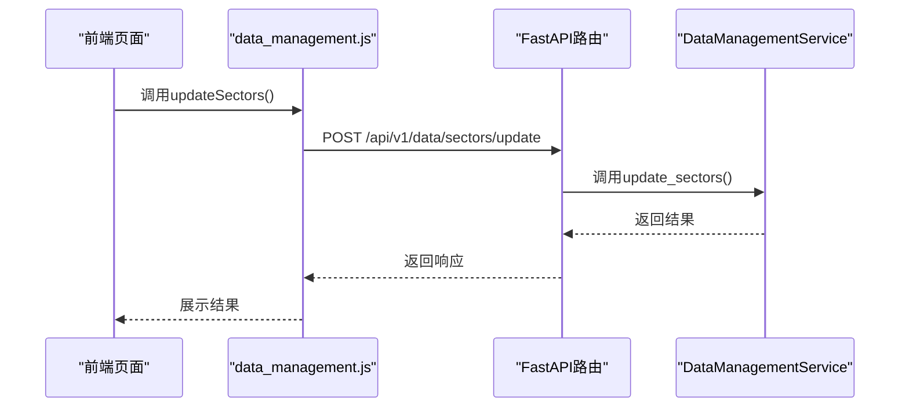
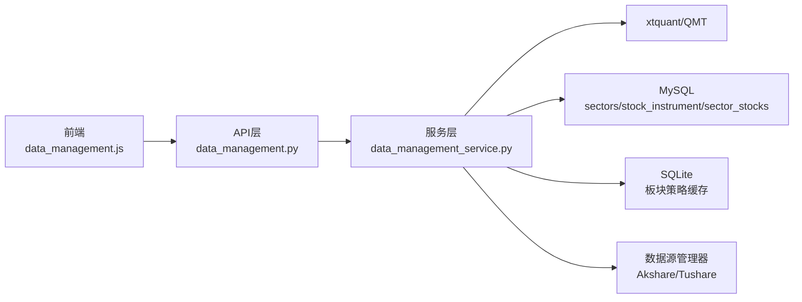

# 数据管理API

<cite>
**本文引用的文件**
- [backend/app/api/v1/data_management.py](file://backend/app/api/v1/data_management.py)
- [backend/app/api/v1/router.py](file://backend/app/api/v1/router.py)
- [backend/app/services/data_management_service.py](file://backend/app/services/data_management_service.py)
- [backend/app/models/sector.py](file://backend/app/models/sector.py)
- [frontend/src/api/data_management.js](file://frontend/src/api/data_management.js)
- [backend/app/db/sector_db.py](file://backend/app/db/sector_db.py)
- [backend/app/db/stock_db.py](file://backend/app/db/stock_db.py)
- [backend/app/api/v1/stock.py](file://backend/app/api/v1/stock.py)
- [docs/数据源冗余机制使用指南.md](file://docs/数据源冗余机制使用指南.md)
- [old/data_source_manager.py](file://old/data_source_manager.py)
- [backend/app/data/data_source_manager.py](file://backend/app/data/data_source_manager.py)
</cite>

## 目录
1. [简介](#简介)
2. [项目结构](#项目结构)
3. [核心组件](#核心组件)
4. [架构总览](#架构总览)
5. [详细组件分析](#详细组件分析)
6. [依赖分析](#依赖分析)
7. [性能考虑](#性能考虑)
8. [故障排查指南](#故障排查指南)
9. [结论](#结论)
10. [附录](#附录)

## 简介
本文件面向“数据管理”功能的API文档，覆盖以下主题：
- 数据源配置与接入：如何通过xtquant连接QMT获取板块、股票成分股及合约信息；以及历史行情数据的多数据源（Akshare/Tushare）冗余机制。
- 数据导入与同步：板块、板块成分股、股票合约信息的导入与同步逻辑。
- 缓存与清理：基于SQLite的板块策略数据库的缓存与清理策略。
- 前端调用流程：前端如何通过data_management.js发起数据管理请求。
- 批量操作与异步处理：如何在后端以异步方式执行耗时任务并返回任务ID供前端轮询或WebSocket订阅。
- 数据一致性保障与故障恢复：事务、版本控制、回退策略与重试机制。

## 项目结构
数据管理API位于后端FastAPI应用中，路由注册在统一的API路由器下，服务层负责与数据库交互与外部数据源对接，前端通过独立的API封装文件发起请求。

图表来源
- [backend/app/api/v1/router.py](file://backend/app/api/v1/router.py#L1-L36)
- [backend/app/api/v1/data_management.py](file://backend/app/api/v1/data_management.py#L1-L85)
- [backend/app/services/data_management_service.py](file://backend/app/services/data_management_service.py#L1-L120)
- [backend/app/models/sector.py](file://backend/app/models/sector.py#L1-L98)
- [backend/app/db/sector_db.py](file://backend/app/db/sector_db.py#L1-L120)
- [backend/app/db/stock_db.py](file://backend/app/db/stock_db.py#L1-L6)

章节来源
- [backend/app/api/v1/router.py](file://backend/app/api/v1/router.py#L1-L36)
- [backend/app/api/v1/data_management.py](file://backend/app/api/v1/data_management.py#L1-L85)

## 核心组件
- API层：提供板块、股票相关信息的增删改查与批量更新接口。
- 服务层：封装与xtquant/QMT的连接、数据拉取、入库与更新逻辑。
- 模型层：定义板块、股票合约、板块-股票关系的数据库模型。
- 数据库层：MySQL用于股票合约与关系数据；SQLite用于板块策略的缓存与版本控制。
- 前端API封装：提供统一的HTTP请求方法，便于页面调用。

章节来源
- [backend/app/api/v1/data_management.py](file://backend/app/api/v1/data_management.py#L1-L85)
- [backend/app/services/data_management_service.py](file://backend/app/services/data_management_service.py#L1-L120)
- [backend/app/models/sector.py](file://backend/app/models/sector.py#L1-L98)
- [backend/app/db/sector_db.py](file://backend/app/db/sector_db.py#L1-L120)
- [frontend/src/api/data_management.js](file://frontend/src/api/data_management.js#L1-L50)

## 架构总览
数据管理API的调用链路如下：
- 前端通过data_management.js发起请求。
- FastAPI路由接收请求，调用DataManagementService服务方法。
- 服务方法根据xtquant可用性决定是否连接QMT，拉取板块、成分股、合约信息并写入数据库。
- SQLite数据库用于板块策略数据的缓存与版本控制，支持清理旧数据。
- 历史行情数据多数据源冗余由独立的数据源管理器负责，保证高可用。

图表来源
- [frontend/src/api/data_management.js](file://frontend/src/api/data_management.js#L1-L50)
- [backend/app/api/v1/data_management.py](file://backend/app/api/v1/data_management.py#L1-L85)
- [backend/app/services/data_management_service.py](file://backend/app/services/data_management_service.py#L1-L120)
- [backend/app/db/sector_db.py](file://backend/app/db/sector_db.py#L1-L120)

## 详细组件分析

### 数据管理API端点
- 路由前缀：/api/v1/data
- 路由注册：在统一的API路由器中注册，便于集中管理与鉴权。

端点一览
- POST /sectors/update
  - 功能：从xtquant下载并同步板块数据。
  - 参数：无。
  - 返回：新增/更新数量与总数统计。
- POST /sectors/stocks/update
  - 功能：更新板块成分股，支持按板块或全量更新。
  - 参数：sector_code（可选）。
  - 返回：新增/移除数量与涉及板块数。
- POST /stocks/update
  - 功能：更新股票合约基本信息，支持按股票或全量更新。
  - 参数：stock_code（可选）。
  - 返回：新增/更新/失败数量与总数。
- GET /sectors
  - 功能：分页获取板块列表，支持按类别筛选。
  - 参数：page/page_size/category。
  - 返回：分页数据与总数。
- GET /stocks
  - 功能：分页获取股票合约列表，支持按板块筛选。
  - 参数：page/page_size/sector_code。
  - 返回：分页数据与总数。

章节来源
- [backend/app/api/v1/data_management.py](file://backend/app/api/v1/data_management.py#L1-L85)
- [backend/app/api/v1/router.py](file://backend/app/api/v1/router.py#L1-L36)

### 数据管理服务（DataManagementService）
职责与要点
- 初始化xtquant连接：动态添加xtquant路径并尝试连接QMT，若不可用则记录警告。
- 板块数据更新：下载板块数据、获取板块信息，逐条写入MySQL的sectors表。
- 板块成分股更新：按板块拉取成分股，计算新增/移除集合，更新sector_stocks表。
- 股票合约信息更新：按股票代码拉取合约详情，写入stock_instrument表。
- 查询接口：分页查询板块与股票列表，支持过滤条件。
- 错误处理：异常捕获、回滚事务、返回错误信息。

图表来源
- [backend/app/services/data_management_service.py](file://backend/app/services/data_management_service.py#L1-L120)
- [backend/app/models/sector.py](file://backend/app/models/sector.py#L1-L98)

章节来源
- [backend/app/services/data_management_service.py](file://backend/app/services/data_management_service.py#L1-L120)
- [backend/app/models/sector.py](file://backend/app/models/sector.py#L1-L98)

### 数据库模型
- 板块表（sectors）：唯一索引sector_code，包含板块代码、名称、类别等。
- 股票合约表（stock_instrument）：复合主键（合约代码+市场代码），包含合约名称、IPO日期、总股本、是否可交易等字段。
- 板块-股票关系表（sector_stocks）：唯一索引（sector_code, 合约代码, 市场代码），用于维护板块与股票的多对多关系。

章节来源
- [backend/app/models/sector.py](file://backend/app/models/sector.py#L1-L98)

### 前端调用流程（data_management.js）
- 提供方法：updateSectors、updateSectorStocks、updateStockInfo、getSectors、getStocks。
- 请求方式：POST/GET，参数通过params传递。
- 路由前缀：/api/v1/data。

图表来源
- [frontend/src/api/data_management.js](file://frontend/src/api/data_management.js#L1-L50)
- [backend/app/api/v1/data_management.py](file://backend/app/api/v1/data_management.py#L1-L85)

章节来源
- [frontend/src/api/data_management.js](file://frontend/src/api/data_management.js#L1-L50)

### 批量操作与异步处理
- 当前数据管理API采用同步处理，直接返回结果。
- 若需异步处理，可参考股票分析模块的模式：
  - 使用BackgroundTasks或WebSocket推送进度。
  - 提供任务ID查询接口，前端轮询或WebSocket订阅。
- 建议：对耗时的批量导入/更新操作，采用任务队列或后台任务机制，避免阻塞请求线程。

章节来源
- [backend/app/api/v1/stock.py](file://backend/app/api/v1/stock.py#L1-L190)

### 历史数据导入与多数据源冗余
- 历史行情数据多数据源冗余策略：
  - 优先从本地MySQL缓存读取；失败时使用Akshare；再次失败时使用Tushare。
  - 支持配置Tushare Token，启用双数据源冗余。
- 数据源管理器位置：
  - 旧版本：old/data_source_manager.py
  - 新版本：backend/app/data/data_source_manager.py

章节来源
- [docs/数据源冗余机制使用指南.md](file://docs/数据源冗余机制使用指南.md#L118-L159)
- [old/data_source_manager.py](file://old/data_source_manager.py#L41-L74)
- [backend/app/data/data_source_manager.py](file://backend/app/data/data_source_manager.py#L41-L74)

### 缓存与清理策略
- 板块策略数据库（SQLite）：
  - 保存原始数据与版本信息，支持按日期与版本检索。
  - 提供清理旧数据接口，按数据类型与保留天数删除历史记录。
  - 提供最近数据缓存接口，支持在有效期内返回最新版本数据。
- 股票分析数据库（MySQL）：当前文件为占位，后续迁移后将承担股票分析数据的持久化。

章节来源
- [backend/app/db/sector_db.py](file://backend/app/db/sector_db.py#L1-L120)
- [backend/app/db/stock_db.py](file://backend/app/db/stock_db.py#L1-L6)

## 依赖分析
- 组件耦合
  - API层仅负责参数校验与响应包装，业务逻辑集中在服务层。
  - 服务层依赖模型层与数据库层，同时依赖xtquant/QMT。
  - 前端仅依赖API封装文件，解耦性强。
- 外部依赖
  - xtquant/QMT：用于获取板块、成分股、合约信息。
  - Akshare/Tushare：用于历史行情数据的冗余获取。
- 潜在风险
  - QMT未启动或未允许第三方连接会导致xtquant不可用。
  - 数据源切换失败时需具备回退策略与错误提示。

图表来源
- [frontend/src/api/data_management.js](file://frontend/src/api/data_management.js#L1-L50)
- [backend/app/api/v1/data_management.py](file://backend/app/api/v1/data_management.py#L1-L85)
- [backend/app/services/data_management_service.py](file://backend/app/services/data_management_service.py#L1-L120)
- [backend/app/db/sector_db.py](file://backend/app/db/sector_db.py#L1-L120)
- [docs/数据源冗余机制使用指南.md](file://docs/数据源冗余机制使用指南.md#L118-L159)

## 性能考虑
- 批量更新时建议分批处理，避免一次性写入过多记录导致锁竞争。
- 对高频查询的字段建立索引（如板块代码、股票代码、市场代码）。
- 使用事务包裹批量写入，失败回滚，保证一致性。
- 对xtquant/QMT的调用应设置合理的超时与重试策略，避免阻塞请求线程。
- SQLite缓存建议定期清理旧数据，避免磁盘占用过大。

## 故障排查指南
- xtquant/QMT不可用
  - 现象：返回错误提示，指引检查QMT安装、启动与第三方连接权限。
  - 处理：确认QMT已启动并允许第三方连接，重新初始化xtquant。
- 数据为空
  - 现象：未获取到板块/成分股/合约信息。
  - 处理：检查xtquant连接状态与网络；必要时手动触发数据下载。
- 数据库异常
  - 现象：写入失败或事务回滚。
  - 处理：查看日志定位具体错误；检查数据库连接与权限。
- 历史数据获取失败
  - 现象：Akshare/Tushare均不可用。
  - 处理：启用Tushare Token；检查网络与接口配额；回退到缓存数据。

章节来源
- [backend/app/services/data_management_service.py](file://backend/app/services/data_management_service.py#L1-L120)
- [backend/app/db/sector_db.py](file://backend/app/db/sector_db.py#L1-L120)
- [docs/数据源冗余机制使用指南.md](file://docs/数据源冗余机制使用指南.md#L118-L159)

## 结论
- 数据管理API提供了完整的板块、成分股与股票合约信息的同步能力，依赖xtquant/QMT实现高效数据拉取。
- 通过模型与数据库层的设计，实现了清晰的一致性约束与查询能力。
- 历史数据多数据源冗余与SQLite缓存机制提升了系统的可用性与稳定性。
- 建议在批量导入/更新场景引入异步任务机制，提升用户体验与系统吞吐量。

## 附录

### API定义与参数说明
- POST /api/v1/data/sectors/update
  - 用途：更新板块数据
  - 参数：无
  - 返回：新增/更新数量与总数
- POST /api/v1/data/sectors/stocks/update
  - 用途：更新板块成分股
  - 参数：sector_code（可选）
  - 返回：新增/移除数量与涉及板块数
- POST /api/v1/data/stocks/update
  - 用途：更新股票合约信息
  - 参数：stock_code（可选）
  - 返回：新增/更新/失败数量与总数
- GET /api/v1/data/sectors
  - 用途：分页获取板块列表
  - 参数：page、page_size、category（可选）
  - 返回：分页数据与总数
- GET /api/v1/data/stocks
  - 用途：分页获取股票合约列表
  - 参数：page、page_size、sector_code（可选）
  - 返回：分页数据与总数

章节来源
- [backend/app/api/v1/data_management.py](file://backend/app/api/v1/data_management.py#L1-L85)

### 前端调用示例（路径）
- 更新板块：/api/v1/data/sectors/update
- 更新板块成分股：/api/v1/data/sectors/stocks/update?sector_code=...
- 更新股票信息：/api/v1/data/stocks/update?stock_code=...
- 获取板块列表：/api/v1/data/sectors?page=&page_size=&category=
- 获取股票列表：/api/v1/data/stocks?page=&page_size=&sector_code=

章节来源
- [frontend/src/api/data_management.js](file://frontend/src/api/data_management.js#L1-L50)