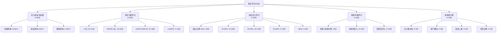
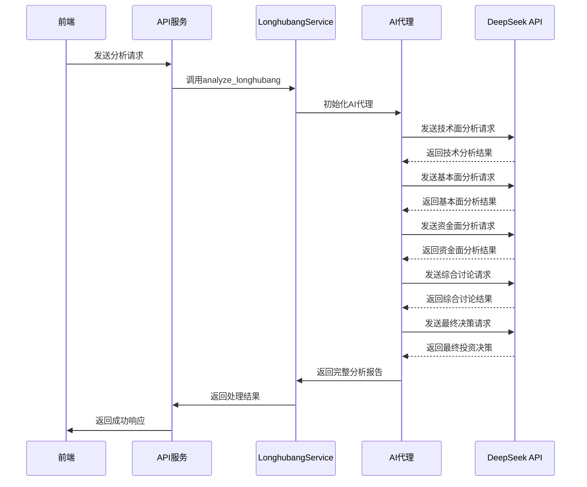
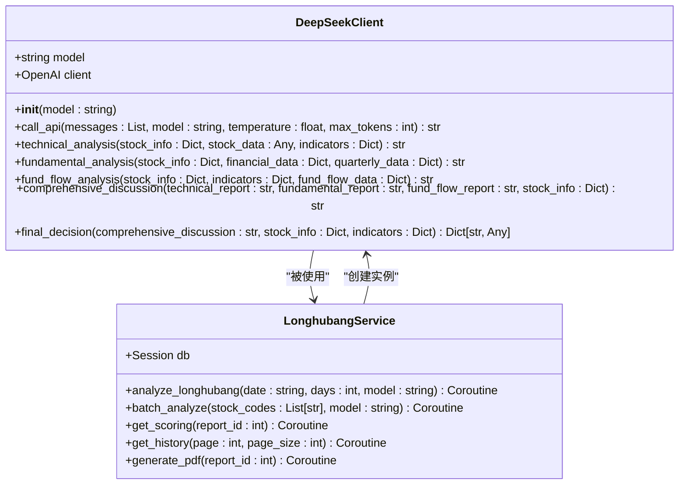
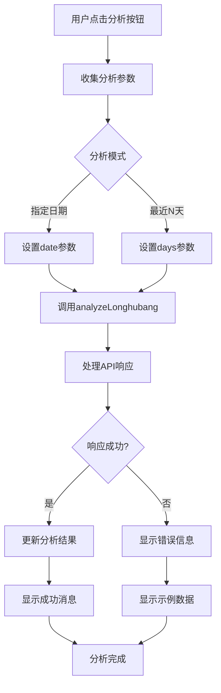
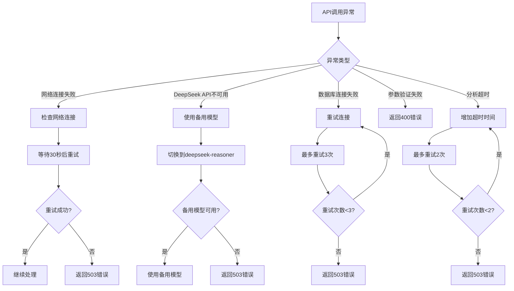
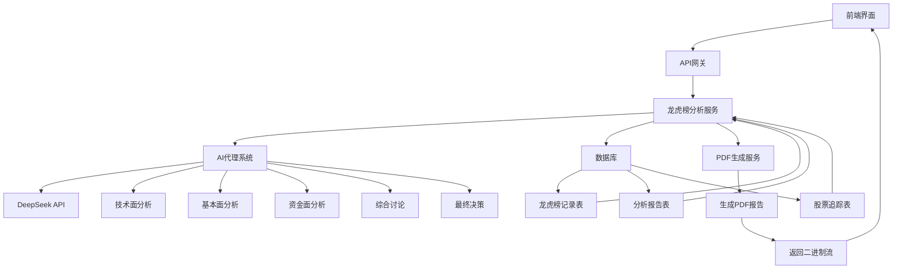
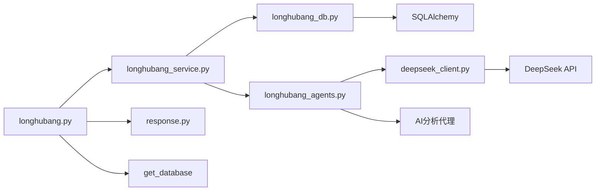

# 智瞰龙虎榜API

<cite>
**本文档引用文件**  
- [longhubang.py](file://backend/app/api/v1/longhubang.py)
- [longhubang_service.py](file://backend/app/services/longhubang_service.py)
- [longhubang_agents.py](file://backend/app/agents/longhubang_agents.py)
- [deepseek_client.py](file://backend/app/agents/deepseek_client.py)
- [longhubang.js](file://frontend/src/api/longhubang.js)
- [longhubang_db.py](file://backend/app/db/longhubang_db.py)
- [智瞰龙虎AI评分说明.md](file://docs/智瞰龙虎AI评分说明.md)
- [智瞰龙虎功能说明.md](file://docs/智瞰龙虎功能说明.md)
- [index.vue](file://frontend/src/views/longhubang/index.vue)
</cite>

## 目录
1. [简介](#简介)
2. [API端点详情](#api端点详情)
3. [评分模型与AI代理](#评分模型与ai代理)
4. [前端调用流程](#前端调用流程)
5. [异常处理与重试策略](#异常处理与重试策略)
6. [数据流与架构图](#数据流与架构图)
7. [最佳实践与建议](#最佳实践与建议)

## 简介

智瞰龙虎榜功能通过AI智能体对股票龙虎榜数据进行深度分析，生成综合评分和投资建议。系统整合了多维度数据源，利用DeepSeek大模型进行智能分析，为投资者提供科学决策支持。本API文档详细说明了核心接口的使用方法、参数要求、返回结构以及底层实现机制。

该功能主要包含龙虎榜分析、批量分析、评分排名、历史报告查询和PDF报告生成等核心功能，通过RESTful API提供服务，支持前后端分离架构。

**Section sources**
- [longhubang.py](file://backend/app/api/v1/longhubang.py#L1-L87)
- [智瞰龙虎功能说明.md](file://docs/智瞰龙虎功能说明.md#L1-L237)

## API端点详情

### 龙虎榜分析接口

**端点**: `POST /api/v1/longhubang/analyze`  
**用途**: 对指定日期的龙虎榜数据进行AI分析

| 参数 | 类型 | 必需 | 默认值 | 说明 |
|------|------|------|--------|------|
| date | string | 否 | null | 分析日期（YYYY-MM-DD格式），为空则使用最近交易日 |
| days | integer | 否 | 1 | 分析最近N天的数据（1-10天） |
| model | string | 否 | deepseek-chat | 使用的AI模型名称 |

**成功响应**:
```json
{
  "code": 200,
  "message": "success",
  "data": {
    "report_id": 123,
    "analysis_date": "2024-01-15",
    "total_stocks": 50,
    "scoring_ranking": [
      {
        "rank": 1,
        "stock_code": "000001",
        "stock_name": "平安银行",
        "score": 92.5,
        "details": {
          "buy_quality": 28.0,
          "net_buy": 24.0,
          "sell_pressure": 20.0,
          "institution_resonance": 15.0,
          "bonus_points": 5.5
        }
      }
    ],
    "recommended_stocks": ["000001", "600519"],
    "analysis_summary": "今日市场活跃..."
  }
}
```

### 批量分析接口

**端点**: `POST /api/v1/longhubang/batch-analyze`  
**用途**: 对指定股票列表进行批量分析

| 参数 | 类型 | 必需 | 说明 |
|------|------|------|------|
| stock_codes | array | 是 | 股票代码列表（如["000001", "600519"]） |
| model | string | 否 | deepseek-chat | 使用的AI模型名称 |

**成功响应**:
```json
{
  "code": 200,
  "message": "success",
  "data": {
    "batch_id": "batch_20240115_001",
    "total_count": 10,
    "success_count": 8,
    "failed_count": 2,
    "results": [
      {
        "stock_code": "000001",
        "success": true,
        "score": 92.5,
        "analysis": "该股有顶级游资参与..."
      }
    ],
    "failed_list": ["000002", "600000"]
  }
}
```

### 评分排名接口

**端点**: `GET /api/v1/longhubang/scoring`  
**用途**: 获取指定报告的评分排名

| 参数 | 类型 | 必需 | 说明 |
|------|------|------|------|
| report_id | integer | 是 | 报告ID |

**成功响应**:
```json
{
  "code": 200,
  "message": "success",
  "data": {
    "report_id": 123,
    "total_rankings": 50,
    "top_10": [
      {
        "rank": 1,
        "stock_code": "000001",
        "stock_name": "平安银行",
        "score": 92.5,
        "net_inflow": 150000000,
        "top_investors": ["赵老哥", "章盟主"]
      }
    ]
  }
}
```

### 历史报告接口

**端点**: `GET /api/v1/longhubang/history`  
**用途**: 获取历史分析报告列表

| 参数 | 类型 | 必需 | 默认值 | 说明 |
|------|------|------|--------|------|
| page | integer | 否 | 1 | 页码 |
| page_size | integer | 否 | 20 | 每页数量 |

**成功响应**:
```json
{
  "code": 200,
  "message": "success",
  "data": {
    "items": [
      {
        "id": 123,
        "analysis_date": "2024-01-15",
        "total_stocks": 50,
        "top_score": 92.5,
        "top_stock": "000001",
        "created_at": "2024-01-15T20:30:00Z"
      }
    ],
    "total": 150,
    "page": 1,
    "page_size": 20
  }
}
```

### PDF报告生成接口

**端点**: `POST /api/v1/longhubang/generate-pdf`  
**用途**: 生成指定报告的PDF文件

| 参数 | 类型 | 必需 | 说明 |
|------|------|------|------|
| report_id | integer | 是 | 报告ID |

**成功响应**: 返回PDF文件的二进制流，Content-Type为application/pdf

**Section sources**
- [longhubang.py](file://backend/app/api/v1/longhubang.py#L14-L87)
- [longhubang_service.py](file://backend/app/services/longhubang_service.py#L14-L37)

## 评分模型与AI代理

### 评分模型架构

智瞰龙虎榜采用五维评分体系，对股票进行100分制综合评估：



**Diagram sources**
- [智瞰龙虎AI评分说明.md](file://docs/智瞰龙虎AI评分说明.md#L5-L176)

### AI代理工作流程

系统通过`longhubang_agents.py`中的AI代理协同工作，每个代理负责特定分析任务：



**Diagram sources**
- [longhubang_agents.py](file://backend/app/agents/longhubang_agents.py#L1-L6)
- [deepseek_client.py](file://backend/app/agents/deepseek_client.py#L6-L458)

### DeepSeek API交互

`DeepSeekClient`类负责与DeepSeek API的交互，支持多种分析模式：



**Diagram sources**
- [deepseek_client.py](file://backend/app/agents/deepseek_client.py#L6-L458)
- [longhubang_service.py](file://backend/app/services/longhubang_service.py#L8-L38)

## 前端调用流程

### 主要调用示例

前端通过`longhubang.js`中的封装函数调用API：

```javascript
// 龙虎榜分析
export function analyzeLonghubang(data) {
  return request({
    url: '/api/v1/longhubang/analyze',
    method: 'post',
    data
  })
}

// 批量分析
export function batchAnalyzeLonghubang(data) {
  return request({
    url: '/api/v1/longhubang/batch-analyze',
    method: 'post',
    data
  })
}

// 获取评分排名
export function getLonghubangScoring(params) {
  return request({
    url: '/api/v1/longhubang/scoring',
    method: 'get',
    params
  })
}

// 历史报告
export function getLonghubangHistory(params) {
  return request({
    url: '/api/v1/longhubang/history',
    method: 'get',
    params
  })
}

// 生成PDF
export function generateLonghubangPDF(data) {
  return request({
    url: '/api/v1/longhubang/generate-pdf',
    method: 'post',
    data,
    responseType: 'blob'
  })
}
```

### Vue组件调用流程

在`index.vue`中，组件通过以下流程调用API：



**Diagram sources**
- [longhubang.js](file://frontend/src/api/longhubang.js#L1-L49)
- [index.vue](file://frontend/src/views/longhubang/index.vue#L721-L744)

**Section sources**
- [longhubang.js](file://frontend/src/api/longhubang.js#L1-L49)
- [index.vue](file://frontend/src/views/longhubang/index.vue#L721-L744)

## 异常处理与重试策略

### 错误响应码

| HTTP状态码 | 错误码 | 错误信息 | 说明 |
|-----------|--------|---------|------|
| 500 | 500 | Internal Server Error | 服务器内部错误 |
| 400 | 400 | Bad Request | 请求参数错误 |
| 404 | 404 | Not Found | 资源未找到 |
| 429 | 429 | Too Many Requests | 请求过于频繁 |
| 503 | 503 | Service Unavailable | 服务暂时不可用 |

### 常见异常场景



### 前端异常处理

前端在`index.vue`中实现了完善的异常处理机制：

```javascript
async handleAnalyze() {
  this.analysisLoading = true
  try {
    const payload = { model: this.selectedModel }
    if (this.analysisMode === 'date') {
      payload.date = this.selectedDate || dayjs().subtract(1, 'day').format('YYYY-MM-DD')
    } else {
      payload.days = this.recentDays
    }
    const res = await analyzeLonghubang(payload)
    const data = res?.data || res?.result || res
    if (data?.success) {
      this.analysisResult = this.decorateResult(data)
      this.$message.success('龙虎榜分析完成')
    } else {
      throw new Error(data?.error || '分析失败')
    }
  } catch (error) {
    console.warn('analyzeLonghubang fallback', error)
    this.analysisResult = createFallbackResult()
    this.$message.info('接口暂未打通，展示示例分析结果')
  } finally {
    this.analysisLoading = false
  }
}
```

**Section sources**
- [longhubang.py](file://backend/app/api/v1/longhubang.py#L26-L27)
- [response.py](file://backend/app/api/response.py#L10-L31)
- [index.vue](file://frontend/src/views/longhubang/index.vue#L738-L742)

## 数据流与架构图

### 系统整体架构



**Diagram sources**
- [longhubang.py](file://backend/app/api/v1/longhubang.py#L1-L87)
- [longhubang_service.py](file://backend/app/services/longhubang_service.py#L8-L38)
- [longhubang_db.py](file://backend/app/db/longhubang_db.py#L1-L6)

### 服务依赖关系



**Diagram sources**
- [longhubang.py](file://backend/app/api/v1/longhubang.py#L1-L87)
- [longhubang_service.py](file://backend/app/services/longhubang_service.py#L8-L38)
- [longhubang_db.py](file://backend/app/db/longhubang_db.py#L1-L6)
- [deepseek_client.py](file://backend/app/agents/deepseek_client.py#L6-L458)

## 最佳实践与建议

### 推荐使用模式

1. **日常分析流程**：
   - 交易日晚上6点后进行分析
   - 选择"最近1天"模式获取最新数据
   - 重点关注评分80分以上的S级股票
   - 结合技术面和基本面进行综合判断

2. **批量分析策略**：
   - 用于筛选自选股池中的潜力股
   - 建议每次分析不超过50只股票
   - 可以设置定时任务每日自动分析

3. **历史数据研究**：
   - 通过历史报告接口获取长期数据
   - 分析高分股票的后续表现
   - 研究不同市场环境下的评分有效性

### 性能优化建议

- **缓存策略**：对频繁查询的评分排名结果进行缓存
- **异步处理**：对于耗时的分析任务使用异步处理
- **连接池**：使用数据库连接池提高数据库访问效率
- **批量操作**：批量分析时尽量减少API调用次数

### 安全注意事项

- **API密钥保护**：确保DEEPSEEK_API_KEY等敏感信息不泄露
- **输入验证**：对所有API参数进行严格验证
- **速率限制**：防止恶意用户频繁调用API
- **日志审计**：记录关键操作日志便于追踪

**Section sources**
- [智瞰龙虎AI评分说明.md](file://docs/智瞰龙虎AI评分说明.md#L179-L247)
- [智瞰龙虎功能说明.md](file://docs/智瞰龙虎功能说明.md#L173-L198)