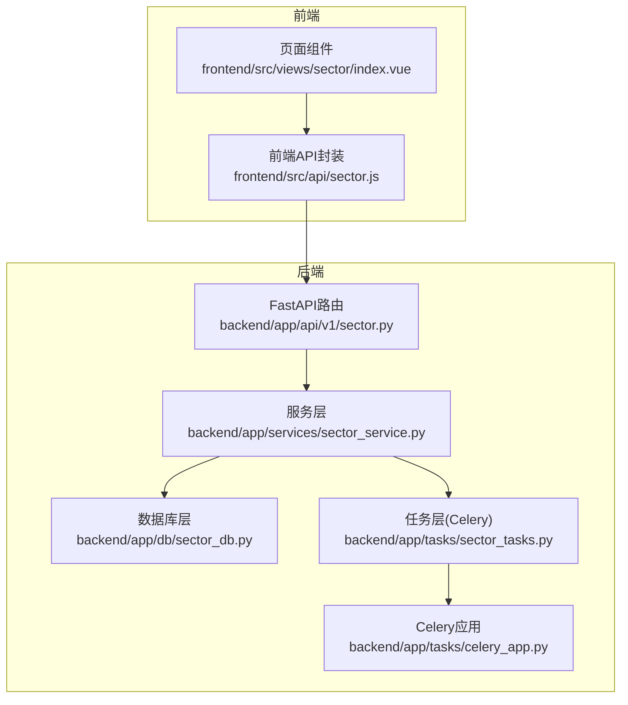
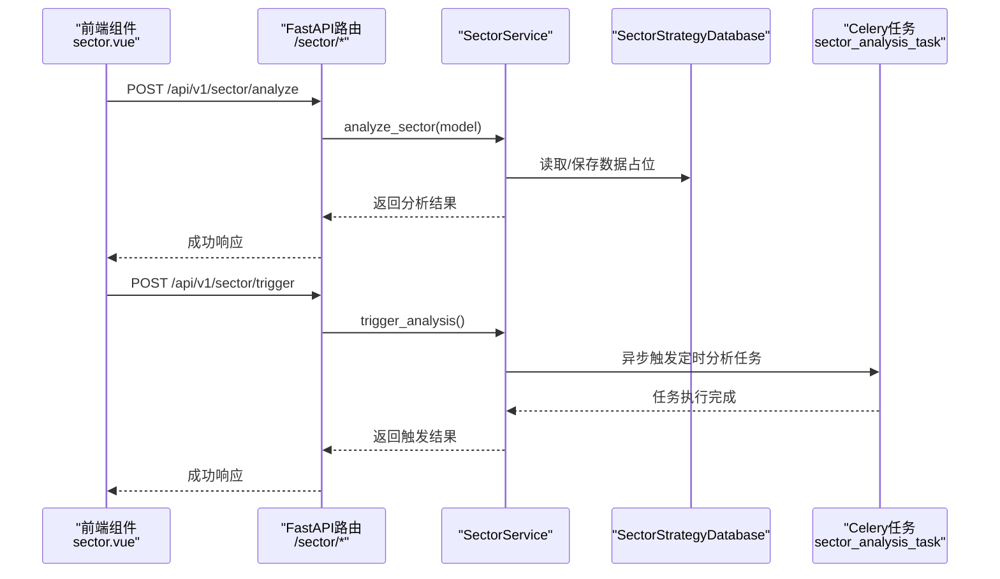
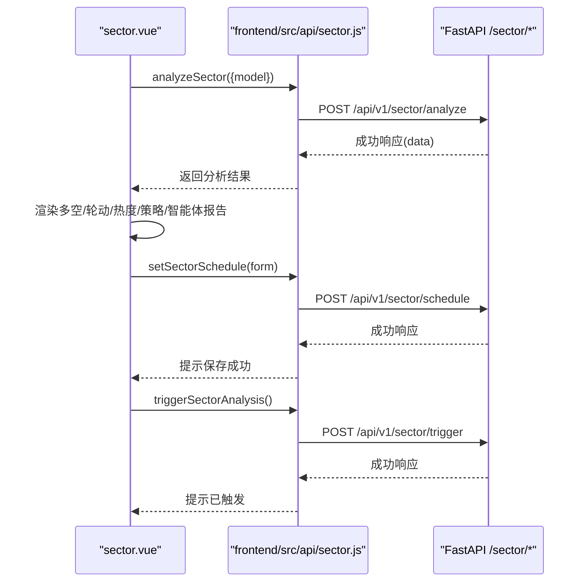
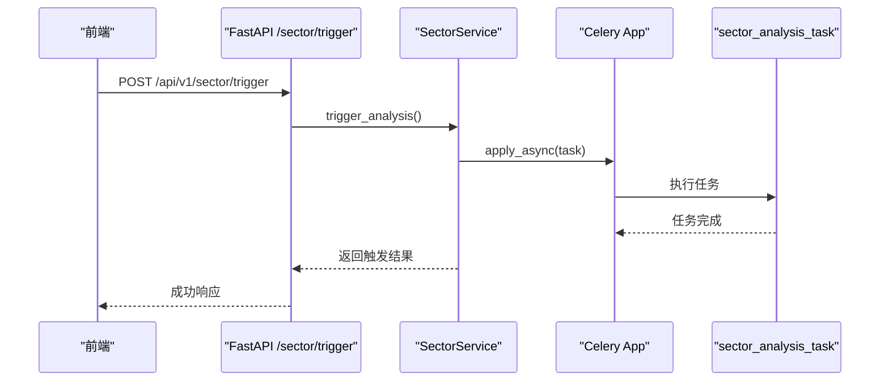
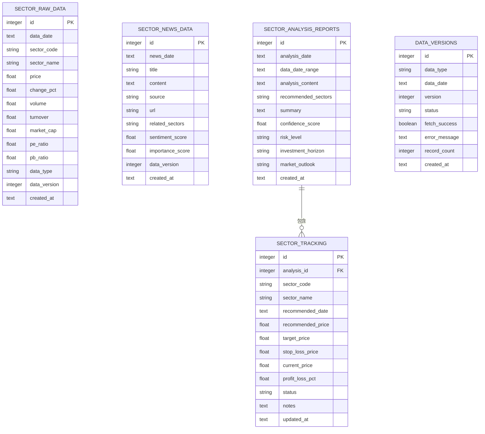
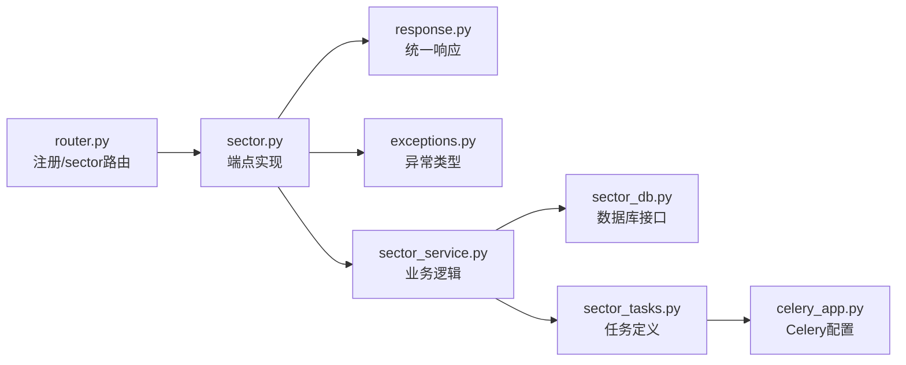

# 智策板块API

<cite>
**本文引用的文件**
- [backend/app/api/v1/sector.py](file://backend/app/api/v1/sector.py)
- [backend/app/api/v1/router.py](file://backend/app/api/v1/router.py)
- [backend/app/api/response.py](file://backend/app/api/response.py)
- [backend/app/api/core/exceptions.py](file://backend/app/core/exceptions.py)
- [backend/app/services/sector_service.py](file://backend/app/services/sector_service.py)
- [backend/app/db/sector_db.py](file://backend/app/db/sector_db.py)
- [backend/app/tasks/sector_tasks.py](file://backend/app/tasks/sector_tasks.py)
- [backend/app/tasks/celery_app.py](file://backend/app/tasks/celery_app.py)
- [frontend/src/api/sector.js](file://frontend/src/api/sector.js)
- [frontend/src/views/sector/index.vue](file://frontend/src/views/sector/index.vue)
- [docs/智策板块使用指南.md](file://docs/智策板块使用指南.md)
- [docs/智策定时分析使用指南.md](file://docs/智策定时分析使用指南.md)
</cite>

## 目录
1. [简介](#简介)
2. [项目结构](#项目结构)
3. [核心组件](#核心组件)
4. [架构总览](#架构总览)
5. [详细组件分析](#详细组件分析)
6. [依赖关系分析](#依赖关系分析)
7. [性能考虑](#性能考虑)
8. [故障排查指南](#故障排查指南)
9. [结论](#结论)
10. [附录](#附录)

## 简介
本文件面向后端与前端开发者，系统化梳理“智策板块”功能的API设计与实现，覆盖板块分析、策略生成、历史报告、PDF导出以及定时任务配置与触发。文档明确各端点用途、请求参数与响应结构，并说明与Celery任务调度系统的集成方式，提供JavaScript调用示例与错误处理模式，强调与前端sector.vue组件的数据交互流程。

## 项目结构
- 后端采用FastAPI + SQLAlchemy + Celery架构：
  - API层：/api/v1/sector.py 提供REST接口
  - 服务层：sector_service.py封装业务逻辑
  - 数据层：sector_db.py负责SQLite持久化
  - 任务层：sector_tasks.py定义定时任务，celery_app.py配置Celery
- 前端采用Vue + Element Plus，API通过frontend/src/api/sector.js封装，页面逻辑在frontend/src/views/sector/index.vue中实现

**图表来源**
- [backend/app/api/v1/sector.py](file://backend/app/api/v1/sector.py#L1-L107)
- [backend/app/services/sector_service.py](file://backend/app/services/sector_service.py#L1-L48)
- [backend/app/db/sector_db.py](file://backend/app/db/sector_db.py#L1-L120)
- [backend/app/tasks/sector_tasks.py](file://backend/app/tasks/sector_tasks.py#L1-L13)
- [backend/app/tasks/celery_app.py](file://backend/app/tasks/celery_app.py#L1-L21)
- [frontend/src/api/sector.js](file://frontend/src/api/sector.js#L1-L64)
- [frontend/src/views/sector/index.vue](file://frontend/src/views/sector/index.vue#L416-L460)

**章节来源**
- [backend/app/api/v1/router.py](file://backend/app/api/v1/router.py#L1-L36)
- [backend/app/api/v1/sector.py](file://backend/app/api/v1/sector.py#L1-L107)
- [frontend/src/api/sector.js](file://frontend/src/api/sector.js#L1-L64)
- [frontend/src/views/sector/index.vue](file://frontend/src/views/sector/index.vue#L416-L460)

## 核心组件
- API路由与端点
  - POST /api/v1/sector/analyze：触发板块分析
  - GET /api/v1/sector/schedule：获取定时任务配置
  - POST /api/v1/sector/schedule：设置定时任务配置
  - DELETE /api/v1/sector/schedule/{id}：删除定时任务
  - POST /api/v1/sector/trigger：手动触发一次定时任务运行
  - GET /api/v1/sector/history：查询历史报告
  - POST /api/v1/sector/generate-pdf：生成PDF报告
- 服务层
  - SectorService：封装分析、定时任务、历史、PDF等业务方法（当前为占位实现）
- 数据层
  - SectorStrategyDatabase：SQLite建表、数据保存与查询、报告存取、版本管理
- 任务层
  - sector_tasks.py：定义sector_analysis_task任务（占位）
  - celery_app.py：Celery应用配置（Redis或本地）

**章节来源**
- [backend/app/api/v1/sector.py](file://backend/app/api/v1/sector.py#L14-L107)
- [backend/app/services/sector_service.py](file://backend/app/services/sector_service.py#L1-L48)
- [backend/app/db/sector_db.py](file://backend/app/db/sector_db.py#L1-L120)
- [backend/app/tasks/sector_tasks.py](file://backend/app/tasks/sector_tasks.py#L1-L13)
- [backend/app/tasks/celery_app.py](file://backend/app/tasks/celery_app.py#L1-L21)

## 架构总览
后端采用分层架构：API层负责HTTP协议与响应封装，服务层承载业务逻辑，数据层负责持久化，任务层通过Celery异步执行定时分析。前端通过统一API封装进行调用，页面组件负责渲染与交互。

**图表来源**
- [frontend/src/views/sector/index.vue](file://frontend/src/views/sector/index.vue#L718-L740)
- [frontend/src/api/sector.js](file://frontend/src/api/sector.js#L1-L64)
- [backend/app/api/v1/sector.py](file://backend/app/api/v1/sector.py#L14-L107)
- [backend/app/services/sector_service.py](file://backend/app/services/sector_service.py#L1-L48)
- [backend/app/tasks/sector_tasks.py](file://backend/app/tasks/sector_tasks.py#L1-L13)

## 详细组件分析

### API端点定义与用途
- POST /api/v1/sector/analyze
  - 用途：触发板块分析，返回综合研判结果（多空、轮动、热度、策略总结、智能体报告等）
  - 请求参数：model（字符串，AI模型标识）
  - 响应结构：统一成功响应，data包含分析结果对象
- GET /api/v1/sector/schedule
  - 用途：获取定时任务配置（启用状态、运行时间、通知开关、下次运行时间等）
  - 响应结构：统一成功响应，data为配置对象
- POST /api/v1/sector/schedule
  - 用途：设置定时任务配置（时间、启用状态、邮件通知等）
  - 请求参数：schedule_time（字符串，HH:mm）、enabled（布尔）
  - 响应结构：统一成功响应，带消息提示
- DELETE /api/v1/sector/schedule/{id}
  - 用途：删除定时任务（占位，当前未实现）
- POST /api/v1/sector/trigger
  - 用途：手动触发一次定时任务运行（异步）
  - 响应结构：统一成功响应，带消息提示
- GET /api/v1/sector/history
  - 用途：查询历史报告列表（分页）
  - 请求参数：page、page_size
  - 响应结构：统一成功响应，data包含列表与分页信息
- POST /api/v1/sector/generate-pdf
  - 用途：生成PDF报告（二进制Blob）
  - 请求参数：report_id（整数）
  - 响应结构：二进制响应（Blob）

**章节来源**
- [backend/app/api/v1/sector.py](file://backend/app/api/v1/sector.py#L14-L107)
- [backend/app/api/response.py](file://backend/app/api/response.py#L10-L31)
- [frontend/src/api/sector.js](file://frontend/src/api/sector.js#L1-L64)

### 请求体与响应数据结构说明
- 请求体参数
  - analyze：model（字符串）
  - schedule：schedule_time（字符串，HH:mm）、enabled（布尔）
  - trigger：无
  - history：page（整数，默认1）、page_size（整数，默认20）
  - generate-pdf：report_id（整数）
- 响应结构
  - 统一成功响应：code（整数）、message（字符串）、data（任意）
  - 统一错误响应：code（整数）、message（字符串）、data（可选）

**章节来源**
- [backend/app/api/v1/sector.py](file://backend/app/api/v1/sector.py#L14-L107)
- [backend/app/api/response.py](file://backend/app/api/response.py#L10-L31)

### 与前端sector.vue的数据交互流程
- 页面初始化：加载定时任务配置与历史报告
- 触发分析：选择模型后调用分析接口，渲染多空、轮动、热度、策略总结与智能体报告
- 定时任务：设置运行时间与启用状态，支持“立即运行”手动触发
- 历史报告：支持搜索与加载到分析视图
- PDF导出：调用生成PDF接口，下载二进制文件

**图表来源**
- [frontend/src/views/sector/index.vue](file://frontend/src/views/sector/index.vue#L718-L740)
- [frontend/src/api/sector.js](file://frontend/src/api/sector.js#L1-L64)
- [backend/app/api/v1/sector.py](file://backend/app/api/v1/sector.py#L14-L107)

**章节来源**
- [frontend/src/views/sector/index.vue](file://frontend/src/views/sector/index.vue#L416-L460)
- [frontend/src/views/sector/index.vue](file://frontend/src/views/sector/index.vue#L718-L740)
- [frontend/src/api/sector.js](file://frontend/src/api/sector.js#L1-L64)

### 与Celery任务调度系统的集成
- Celery应用配置：broker与backend使用Redis或本地URL
- 任务定义：sector_analysis_task（占位，待实现）
- 触发方式：前端调用POST /api/v1/sector/trigger，后端服务层触发任务（当前占位）
- 建议实现：在sector_tasks.py中完善任务逻辑，服务层调用任务并返回任务ID或状态

**图表来源**
- [backend/app/tasks/celery_app.py](file://backend/app/tasks/celery_app.py#L1-L21)
- [backend/app/tasks/sector_tasks.py](file://backend/app/tasks/sector_tasks.py#L1-L13)
- [backend/app/api/v1/sector.py](file://backend/app/api/v1/sector.py#L68-L77)
- [frontend/src/api/sector.js](file://frontend/src/api/sector.js#L37-L43)

**章节来源**
- [backend/app/tasks/celery_app.py](file://backend/app/tasks/celery_app.py#L1-L21)
- [backend/app/tasks/sector_tasks.py](file://backend/app/tasks/sector_tasks.py#L1-L13)
- [backend/app/api/v1/sector.py](file://backend/app/api/v1/sector.py#L68-L77)

### 数据模型与持久化
- 数据库初始化：创建板块原始数据、新闻数据、分析报告、追踪表、版本管理表
- 数据保存：支持行业/概念/资金流/市场概览/北向资金/新闻等多类型数据保存
- 报告存取：保存分析报告、查询历史报告、删除报告、解析JSON字段
- 版本管理：按日期与类型维护版本号，支持清理旧数据

**图表来源**
- [backend/app/db/sector_db.py](file://backend/app/db/sector_db.py#L1-L120)
- [backend/app/db/sector_db.py](file://backend/app/db/sector_db.py#L314-L424)

**章节来源**
- [backend/app/db/sector_db.py](file://backend/app/db/sector_db.py#L1-L120)
- [backend/app/db/sector_db.py](file://backend/app/db/sector_db.py#L314-L424)

### JavaScript调用示例与错误处理模式
- 调用示例（基于前端封装）
  - 分析：analyzeSector({ model })
  - 获取定时任务：getSectorSchedule()
  - 设置定时任务：setSectorSchedule({ time, enabled, notifyEmail })
  - 删除定时任务：deleteSectorSchedule(id)
  - 手动触发：triggerSectorAnalysis()
  - 历史报告：getSectorHistory({ page, page_size })
  - 生成PDF：generateSectorPDF({ report_id })，设置responseType: 'blob'
- 错误处理模式
  - 统一响应结构：code、message、data
  - 异常捕获：前端在调用失败时降级为示例数据或提示
  - 后端异常：HTTP 500错误，message包含错误详情

**章节来源**
- [frontend/src/api/sector.js](file://frontend/src/api/sector.js#L1-L64)
- [frontend/src/views/sector/index.vue](file://frontend/src/views/sector/index.vue#L718-L740)
- [backend/app/api/response.py](file://backend/app/api/response.py#L10-L31)
- [backend/app/core/exceptions.py](file://backend/app/core/exceptions.py#L1-L33)

## 依赖关系分析
- 路由注册：/api/v1/router.py将/sector前缀路由注册到sector.py
- 统一响应：/api/response.py提供success_response/error_response
- 异常处理：/core/exceptions.py提供业务异常类型
- 服务与数据库：sector_service.py依赖db层接口（当前占位）
- 任务调度：sector_tasks.py依赖celery_app.py

**图表来源**
- [backend/app/api/v1/router.py](file://backend/app/api/v1/router.py#L1-L36)
- [backend/app/api/v1/sector.py](file://backend/app/api/v1/sector.py#L1-L107)
- [backend/app/api/response.py](file://backend/app/api/response.py#L10-L31)
- [backend/app/core/exceptions.py](file://backend/app/core/exceptions.py#L1-L33)
- [backend/app/services/sector_service.py](file://backend/app/services/sector_service.py#L1-L48)
- [backend/app/db/sector_db.py](file://backend/app/db/sector_db.py#L1-L120)
- [backend/app/tasks/sector_tasks.py](file://backend/app/tasks/sector_tasks.py#L1-L13)
- [backend/app/tasks/celery_app.py](file://backend/app/tasks/celery_app.py#L1-L21)

**章节来源**
- [backend/app/api/v1/router.py](file://backend/app/api/v1/router.py#L1-L36)
- [backend/app/api/v1/sector.py](file://backend/app/api/v1/sector.py#L1-L107)

## 性能考虑
- 数据获取：建议在盘前/盘后时段运行定时任务，避免交易高峰时段数据源拥堵
- 响应封装：统一响应结构便于前端处理，减少重复逻辑
- 异步任务：分析过程较长，建议通过Celery异步执行，避免阻塞请求线程
- 数据库：合理使用索引与版本管理，定期清理旧数据，降低查询成本

[本节为通用指导，无需特定文件来源]

## 故障排查指南
- 前端接口未连通
  - 现象：页面提示“接口暂未打通/调度接口未就绪”
  - 处理：确认后端路由已注册、服务层实现已完善、Celery运行正常
- 定时任务未运行
  - 现象：到达设定时间未触发
  - 处理：检查Celery配置、Broker可用性、任务函数实现
- 数据源异常
  - 现象：分析失败或数据获取失败
  - 处理：检查网络、数据源可用性、重试策略
- 响应异常
  - 现象：HTTP 500错误
  - 处理：查看后端日志，定位异常类型与堆栈

**章节来源**
- [frontend/src/views/sector/index.vue](file://frontend/src/views/sector/index.vue#L718-L740)
- [backend/app/core/exceptions.py](file://backend/app/core/exceptions.py#L1-L33)
- [docs/智策定时分析使用指南.md](file://docs/智策定时分析使用指南.md#L263-L306)

## 结论
智策板块API提供了完整的板块分析、定时任务与历史报告能力，前后端通过统一响应与封装接口协同工作。当前服务层与任务层仍处于占位实现阶段，建议尽快完善分析逻辑、任务执行与数据库持久化，以满足生产环境需求。前端sector.vue组件已具备良好的交互与降级提示，可作为后续联调的重要参考。

[本节为总结性内容，无需特定文件来源]

## 附录

### 端点一览与参数说明
- POST /api/v1/sector/analyze
  - 参数：model（字符串）
  - 响应：统一成功响应，data为分析结果对象
- GET /api/v1/sector/schedule
  - 响应：统一成功响应，data为定时任务配置对象
- POST /api/v1/sector/schedule
  - 参数：schedule_time（字符串，HH:mm）、enabled（布尔）
  - 响应：统一成功响应，带消息提示
- DELETE /api/v1/sector/schedule/{id}
  - 响应：统一成功响应，带消息提示
- POST /api/v1/sector/trigger
  - 响应：统一成功响应，带消息提示
- GET /api/v1/sector/history
  - 参数：page（整数，默认1）、page_size（整数，默认20）
  - 响应：统一成功响应，data包含列表与分页信息
- POST /api/v1/sector/generate-pdf
  - 参数：report_id（整数）
  - 响应：二进制Blob

**章节来源**
- [backend/app/api/v1/sector.py](file://backend/app/api/v1/sector.py#L14-L107)
- [frontend/src/api/sector.js](file://frontend/src/api/sector.js#L1-L64)

### 前端调用示例（基于封装）
- 分析：analyzeSector({ model })
- 获取定时任务：getSectorSchedule()
- 设置定时任务：setSectorSchedule({ time, enabled, notifyEmail })
- 删除定时任务：deleteSectorSchedule(id)
- 手动触发：triggerSectorAnalysis()
- 历史报告：getSectorHistory({ page, page_size })
- 生成PDF：generateSectorPDF({ report_id })，设置responseType: 'blob'

**章节来源**
- [frontend/src/api/sector.js](file://frontend/src/api/sector.js#L1-L64)
- [frontend/src/views/sector/index.vue](file://frontend/src/views/sector/index.vue#L718-L740)

### 与文档的对应关系
- 智策板块使用指南：明确了分析流程、数据来源、导出与定时分析等使用场景
- 智策定时分析使用指南：详细说明邮件配置、定时任务设置、手动触发与故障排除

**章节来源**
- [docs/智策板块使用指南.md](file://docs/智策板块使用指南.md#L1-L306)
- [docs/智策定时分析使用指南.md](file://docs/智策定时分析使用指南.md#L1-L380)