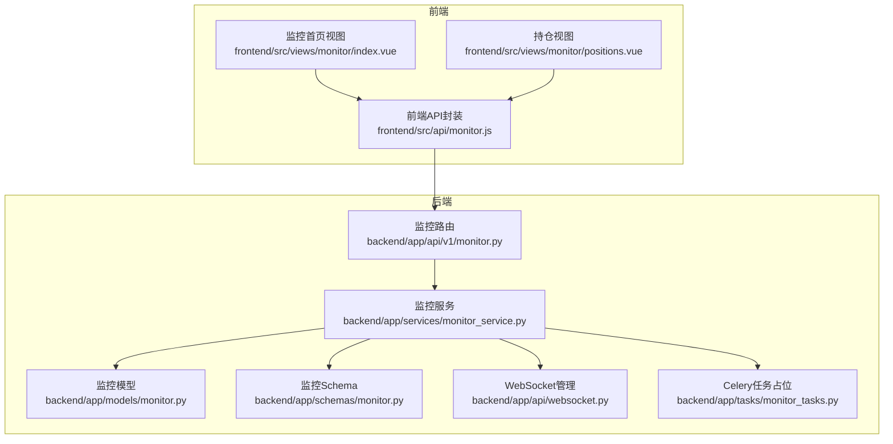
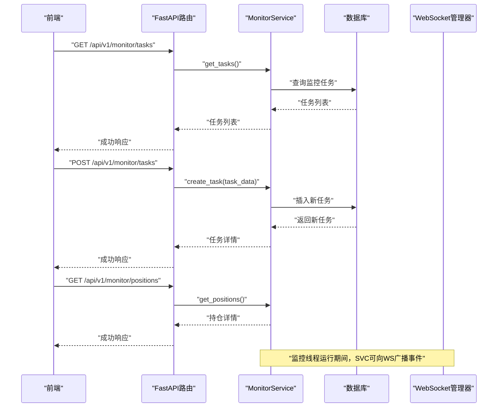
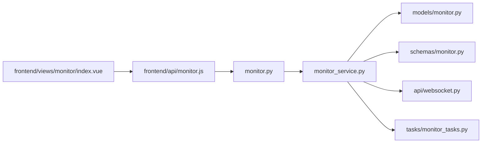

# 智能盯盘API

<cite>
**本文引用的文件**
- [backend/app/api/v1/monitor.py](file://backend/app/api/v1/monitor.py)
- [backend/app/services/monitor_service.py](file://backend/app/services/monitor_service.py)
- [backend/app/models/monitor.py](file://backend/app/models/monitor.py)
- [backend/app/schemas/monitor.py](file://backend/app/schemas/monitor.py)
- [backend/app/api/websocket.py](file://backend/app/api/websocket.py)
- [backend/app/tasks/monitor_tasks.py](file://backend/app/tasks/monitor_tasks.py)
- [frontend/src/api/monitor.js](file://frontend/src/api/monitor.js)
- [frontend/src/views/monitor/index.vue](file://frontend/src/views/monitor/index.vue)
- [frontend/src/views/monitor/positions.vue](file://frontend/src/views/monitor/positions.vue)
- [docs/智能盯盘使用指南.md](file://docs/智能盯盘使用指南.md)
- [docs/智能盯盘配置说明.md](file://docs/智能盯盘配置说明.md)
</cite>

## 目录
1. [简介](#简介)
2. [项目结构](#项目结构)
3. [核心组件](#核心组件)
4. [架构总览](#架构总览)
5. [详细组件分析](#详细组件分析)
6. [依赖关系分析](#依赖关系分析)
7. [性能考虑](#性能考虑)
8. [故障排查指南](#故障排查指南)
9. [结论](#结论)
10. [附录](#附录)

## 简介
本文件面向后端与前端开发者，系统性梳理“智能盯盘”功能的API设计与实现，覆盖任务创建、修改、删除、启动/停止、状态查询、持仓查询与历史查询等接口；说明条件表达式（如价格突破、成交量异动）的JSON结构与持久化机制；解释与数据库的交互方式；并补充WebSocket实时推送事件说明与前端monitor.vue组件的数据流对应关系。同时提供典型使用场景与常见配置错误排查方法，帮助快速落地与稳定运行。

## 项目结构
- 后端采用FastAPI路由层、服务层、模型层与Schema层分层设计，数据库模型定义于models，业务逻辑集中在services，API路由集中于api/v1。
- 前端通过统一的API封装文件发起HTTP请求，视图组件负责展示与交互。
- WebSocket用于实时推送，连接管理器集中处理连接生命周期与广播。

图表来源
- [backend/app/api/v1/monitor.py](file://backend/app/api/v1/monitor.py#L1-L135)
- [backend/app/services/monitor_service.py](file://backend/app/services/monitor_service.py#L1-L733)
- [backend/app/models/monitor.py](file://backend/app/models/monitor.py#L1-L39)
- [backend/app/schemas/monitor.py](file://backend/app/schemas/monitor.py#L1-L32)
- [backend/app/api/websocket.py](file://backend/app/api/websocket.py#L1-L41)
- [backend/app/tasks/monitor_tasks.py](file://backend/app/tasks/monitor_tasks.py#L1-L13)
- [frontend/src/api/monitor.js](file://frontend/src/api/monitor.js#L1-L79)
- [frontend/src/views/monitor/index.vue](file://frontend/src/views/monitor/index.vue#L1-L14)
- [frontend/src/views/monitor/positions.vue](file://frontend/src/views/monitor/positions.vue#L1-L14)

章节来源
- [backend/app/api/v1/monitor.py](file://backend/app/api/v1/monitor.py#L1-L135)
- [backend/app/services/monitor_service.py](file://backend/app/services/monitor_service.py#L1-L733)
- [backend/app/models/monitor.py](file://backend/app/models/monitor.py#L1-L39)
- [backend/app/schemas/monitor.py](file://backend/app/schemas/monitor.py#L1-L32)
- [backend/app/api/websocket.py](file://backend/app/api/websocket.py#L1-L41)
- [backend/app/tasks/monitor_tasks.py](file://backend/app/tasks/monitor_tasks.py#L1-L13)
- [frontend/src/api/monitor.js](file://frontend/src/api/monitor.js#L1-L79)
- [frontend/src/views/monitor/index.vue](file://frontend/src/views/monitor/index.vue#L1-L14)
- [frontend/src/views/monitor/positions.vue](file://frontend/src/views/monitor/positions.vue#L1-L14)

## 核心组件
- 路由层：提供/monitor/tasks与/monitor/positions等端点，负责请求解析与响应包装。
- 服务层：封装任务生命周期、状态查询、持仓查询、历史查询与监控线程管理。
- 模型层：定义监控任务表结构，包含基础字段与量化配置字段。
- Schema层：定义创建与响应的Pydantic模型，约束请求/响应格式。
- WebSocket：提供连接管理与广播能力，用于实时推送。
- Celery任务：预留监控任务调度入口（当前占位）。

章节来源
- [backend/app/api/v1/monitor.py](file://backend/app/api/v1/monitor.py#L1-L135)
- [backend/app/services/monitor_service.py](file://backend/app/services/monitor_service.py#L1-L733)
- [backend/app/models/monitor.py](file://backend/app/models/monitor.py#L1-L39)
- [backend/app/schemas/monitor.py](file://backend/app/schemas/monitor.py#L1-L32)
- [backend/app/api/websocket.py](file://backend/app/api/websocket.py#L1-L41)
- [backend/app/tasks/monitor_tasks.py](file://backend/app/tasks/monitor_tasks.py#L1-L13)

## 架构总览
后端通过FastAPI路由接收请求，调用MonitorService执行业务逻辑；MonitorService与数据库交互持久化任务状态，并通过线程池管理监控任务的周期性分析；WebSocket用于向客户端推送实时事件；前端通过API封装统一调用后端接口。

图表来源
- [backend/app/api/v1/monitor.py](file://backend/app/api/v1/monitor.py#L1-L135)
- [backend/app/services/monitor_service.py](file://backend/app/services/monitor_service.py#L1-L733)
- [backend/app/api/websocket.py](file://backend/app/api/websocket.py#L1-L41)

## 详细组件分析

### 监控任务API
- GET /api/v1/monitor/tasks
  - 功能：获取监控任务列表，支持过滤“仅启用的任务”。
  - 请求参数：enabled_only（布尔，可选）。
  - 响应：任务数组，包含基础字段与解析后的量化配置。
  - 错误：服务异常时返回HTTP 500。
  
- POST /api/v1/monitor/tasks
  - 功能：创建监控任务。
  - 请求体：支持task_name、stock_code（或symbol）、stock_name、check_interval、auto_trade、trading_hours_only、entry_min、entry_max、take_profit、stop_loss、notification_enabled、quant_config等。
  - 响应：创建成功的任务详情（含解析后的quant_config）。
  - 错误：数据库回滚并抛出异常，返回HTTP 500。
  
- PUT /api/v1/monitor/tasks/{task_id}
  - 功能：更新任务配置。
  - 路径参数：task_id（整数）。
  - 请求体：可更新上述字段。
  - 响应：更新后的任务详情。
  - 错误：数据库回滚并抛出异常，返回HTTP 500。
  
- DELETE /api/v1/monitor/tasks/{task_id}
  - 功能：删除任务；若任务正在运行，先停止再删除。
  - 响应：布尔成功标记。
  - 错误：数据库回滚并抛出异常，返回HTTP 500。
  
- POST /api/v1/monitor/tasks/{task_id}/start
  - 功能：启动监控任务，内部创建守护线程并更新状态。
  - 响应：启动结果（包含状态、消息、task_id、stock_code）。
  - 错误：数据库回滚并抛出异常，返回HTTP 500。
  
- POST /api/v1/monitor/tasks/{task_id}/stop
  - 功能：停止监控任务，内部设置停止标志并等待线程退出。
  - 响应：停止结果（包含状态、消息、task_id、stock_code）。
  - 错误：数据库回滚并抛出异常，返回HTTP 500。
  
- GET /api/v1/monitor/tasks/{task_id}/status
  - 功能：获取任务状态详情，包含是否在线程池中运行。
  - 响应：任务详情（含解析后的quant_config）。
  - 错误：返回HTTP 500。

- GET /api/v1/monitor/positions
  - 功能：获取账户与持仓信息，来自QMT服务。
  - 响应：账户信息与持仓列表，以及连接状态与消息。
  - 错误：捕获异常并返回空数据结构，避免中断前端展示。

- GET /api/v1/monitor/history
  - 功能：获取AI决策历史（当前占位，返回空列表与提示）。
  - 响应：decisions、total、page、page_size与message。
  - 错误：返回空列表与错误信息。

章节来源
- [backend/app/api/v1/monitor.py](file://backend/app/api/v1/monitor.py#L1-L135)
- [backend/app/services/monitor_service.py](file://backend/app/services/monitor_service.py#L1-L733)

### 数据模型与Schema
- 数据模型（SQLAlchemy）
  - 表名：monitor_tasks
  - 关键字段：id、task_name、stock_code、stock_name、status、check_interval、auto_trade、trading_hours_only、entry_min、entry_max、take_profit、stop_loss、notification_enabled、quant_config、created_at、updated_at。
  - 状态枚举：running、stopped（服务层将status映射为running/stopped）。
  - 量化配置字段：以Text存储JSON字符串，服务层负责序列化/反序列化。

- Schema（Pydantic）
  - MonitorTaskCreate：创建任务时的请求模型，包含必要字段与默认值。
  - MonitorTaskResponse：响应模型，包含任务ID、名称、代码、状态、检查间隔、自动交易开关、交易时段开关、入场区间、止盈止损、通知开关、量化配置、创建/更新时间等。

章节来源
- [backend/app/models/monitor.py](file://backend/app/models/monitor.py#L1-L39)
- [backend/app/schemas/monitor.py](file://backend/app/schemas/monitor.py#L1-L32)

### 条件表达式与JSON结构
- 入场区间
  - 字段：entry_min、entry_max（数值，单位元）。
  - 语义：当最新价格落入该区间时触发“接近进场区间”通知。
- 止盈止损
  - 字段：take_profit、stop_loss（数值，单位元）。
  - 语义：达到止盈或止损阈值时触发相应通知。
- 量化配置（quant_config）
  - 字段：quant_config（JSON字符串，存储在数据库中）。
  - 语义：用于存放策略参数、技术指标阈值、AI模型参数等，服务层将其解析为字典返回。
- 交易时段
  - 字段：trading_hours_only（布尔）。
  - 语义：仅在交易时段执行分析（服务层当前注释掉时段判断逻辑，保留扩展空间）。
- 自动交易
  - 字段：auto_trade（布尔）。
  - 语义：启用后可在满足条件时自动执行交易（服务层当前占位，AI决策逻辑为简化实现）。

注意：当前服务层对“价格突破、成交量异动”等复杂条件表达式的完整实现尚在占位阶段，简化决策逻辑仅为演示用途。正式版本应将AI决策与量化配置结合，形成可配置的条件表达式引擎。

章节来源
- [backend/app/models/monitor.py](file://backend/app/models/monitor.py#L1-L39)
- [backend/app/schemas/monitor.py](file://backend/app/schemas/monitor.py#L1-L32)
- [backend/app/services/monitor_service.py](file://backend/app/services/monitor_service.py#L1-L733)

### 数据库交互与持久化
- 任务创建/更新/删除
  - 通过SQLAlchemy ORM操作MonitorTask表，支持字段映射与JSON序列化。
- 任务状态
  - status字段映射为running/stopped；is_running字段由服务层维护在内存字典中，表示线程是否在运行。
- 历史记录
  - 当前占位，返回空列表与提示信息。

章节来源
- [backend/app/services/monitor_service.py](file://backend/app/services/monitor_service.py#L1-L733)
- [backend/app/models/monitor.py](file://backend/app/models/monitor.py#L1-L39)

### WebSocket实时推送
- 连接管理
  - ConnectionManager负责接受连接、维护活动连接列表、向指定连接发送消息、向所有连接广播消息。
- 端点与流程
  - 文档中规划的WebSocket端点为/api/v1/monitor/ws/{task_id}，服务端持续拉取实时价格并推送至客户端。
  - 当前路由层未暴露该端点，建议在路由层新增WebSocket端点并接入ConnectionManager。
- 事件类型
  - 价格触发通知：当价格进入入场区间、达到止盈/止损位时，服务层可向WS广播事件。
  - 其他事件：AI决策结果、交易执行状态等（按需扩展）。

章节来源
- [backend/app/api/websocket.py](file://backend/app/api/websocket.py#L1-L41)
- [docs/智能盯盘使用指南.md](file://docs/智能盯盘使用指南.md#L1-L220)

### 前端数据流与monitor.vue组件
- 前端API封装
  - 前端通过frontend/src/api/monitor.js封装所有监控相关HTTP请求，包括任务列表、创建、更新、删除、启动/停止、状态查询、持仓查询、历史查询。
- 视图组件
  - index.vue作为监控首页容器，positions.vue为持仓管理占位页。
  - 前端组件通过API封装调用后端接口，渲染任务列表、状态、通知与历史。
- 数据流
  - 用户操作触发API调用，后端返回数据，前端更新本地状态并渲染UI。
  - WebSocket事件到达后，前端订阅并更新实时数据（如当前价格、触发通知）。

章节来源
- [frontend/src/api/monitor.js](file://frontend/src/api/monitor.js#L1-L79)
- [frontend/src/views/monitor/index.vue](file://frontend/src/views/monitor/index.vue#L1-L14)
- [frontend/src/views/monitor/positions.vue](file://frontend/src/views/monitor/positions.vue#L1-L14)

### 任务状态与线程管理
- 线程池
  - 服务层使用类级字典维护监控线程与停止标志，支持启动/停止任务。
- 状态同步
  - 启动/停止任务会更新数据库中的status字段，并通过is_running字段反映线程运行状态。
- 监控循环
  - 线程按check_interval轮询执行分析，当前简化为打印与返回固定结构，正式版本应接入AI决策与量化配置。

章节来源
- [backend/app/services/monitor_service.py](file://backend/app/services/monitor_service.py#L1-L733)

## 依赖关系分析
- 路由依赖服务层，服务层依赖模型层与数据库；服务层还依赖WebSocket管理器与QMT服务。
- 前端依赖API封装文件，API封装文件依赖后端路由。
- Celery任务文件当前为空实现，未来可用于调度监控任务。

图表来源
- [backend/app/api/v1/monitor.py](file://backend/app/api/v1/monitor.py#L1-L135)
- [backend/app/services/monitor_service.py](file://backend/app/services/monitor_service.py#L1-L733)
- [backend/app/models/monitor.py](file://backend/app/models/monitor.py#L1-L39)
- [backend/app/schemas/monitor.py](file://backend/app/schemas/monitor.py#L1-L32)
- [backend/app/api/websocket.py](file://backend/app/api/websocket.py#L1-L41)
- [backend/app/tasks/monitor_tasks.py](file://backend/app/tasks/monitor_tasks.py#L1-L13)
- [frontend/src/api/monitor.js](file://frontend/src/api/monitor.js#L1-L79)
- [frontend/src/views/monitor/index.vue](file://frontend/src/views/monitor/index.vue#L1-L14)

## 性能考虑
- 线程并发
  - 每个监控任务一个守护线程，建议限制任务数量或引入线程池/协程池以降低上下文切换开销。
- 数据库压力
  - 高频查询可增加索引（如stock_code、status），并考虑分页与缓存策略。
- WebSocket广播
  - 广播消息应避免阻塞主线程，建议异步发送并处理异常连接清理。
- AI决策与数据获取
  - 当前简化实现，正式版本应异步拉取数据与调用AI，避免阻塞监控循环。

[本节为通用建议，不直接分析具体文件]

## 故障排查指南
- 任务创建失败
  - 检查股票代码是否重复；确认必填字段是否齐全；查看服务层异常日志。
- 启动/停止任务异常
  - 确认任务是否存在；检查线程是否已存在或已退出；查看服务层日志。
- 持仓查询异常
  - 若QMT未连接或不可用，返回空数据结构；检查miniQMT配置与连接状态。
- WebSocket无法连接
  - 确认WebSocket端点已实现并暴露；检查连接管理器是否正确维护活动连接。
- 历史查询为空
  - 当前占位实现，提示“AI决策历史表尚未迁移”，等待后续版本。

章节来源
- [backend/app/services/monitor_service.py](file://backend/app/services/monitor_service.py#L1-L733)
- [docs/智能盯盘配置说明.md](file://docs/智能盯盘配置说明.md#L1-L264)

## 结论
智能盯盘API围绕任务生命周期与实时监控展开，具备清晰的路由、服务与模型分层。当前服务层对复杂条件表达式与AI决策仍处于占位阶段，建议尽快完善量化配置解析与AI决策引擎，并补齐WebSocket端点与事件推送。前端通过统一API封装与视图组件实现良好数据流，建议在路由层补充WebSocket端点以实现价格触发通知等实时事件。

[本节为总结性内容，不直接分析具体文件]

## 附录

### API定义与请求/响应格式

- GET /api/v1/monitor/tasks
  - 查询参数：enabled_only（布尔，可选）
  - 响应：任务数组，元素包含基础字段与解析后的quant_config
  
- POST /api/v1/monitor/tasks
  - 请求体字段：task_name、stock_code（或symbol）、stock_name、check_interval、auto_trade、trading_hours_only、entry_min、entry_max、take_profit、stop_loss、notification_enabled、quant_config（JSON对象）
  - 响应：创建成功的任务详情
  
- PUT /api/v1/monitor/tasks/{task_id}
  - 路径参数：task_id
  - 请求体字段：同上（可选字段）
  - 响应：更新后的任务详情
  
- DELETE /api/v1/monitor/tasks/{task_id}
  - 路径参数：task_id
  - 响应：布尔成功标记
  
- POST /api/v1/monitor/tasks/{task_id}/start
  - 响应：启动结果（status、message、task_id、stock_code）
  
- POST /api/v1/monitor/tasks/{task_id}/stop
  - 响应：停止结果（status、message、task_id、stock_code）
  
- GET /api/v1/monitor/tasks/{task_id}/status
  - 响应：任务详情（含解析后的quant_config）
  
- GET /api/v1/monitor/positions
  - 响应：账户信息与持仓列表，以及连接状态与消息
  
- GET /api/v1/monitor/history
  - 查询参数：page、page_size
  - 响应：decisions、total、page、page_size、message

章节来源
- [backend/app/api/v1/monitor.py](file://backend/app/api/v1/monitor.py#L1-L135)
- [backend/app/services/monitor_service.py](file://backend/app/services/monitor_service.py#L1-L733)

### 条件表达式JSON结构示例
- 入场区间
  - { "entry_min": 10.5, "entry_max": 11.2 }
- 止盈止损
  - { "take_profit": 12.0, "stop_loss": 9.8 }
- 量化配置（示例）
  - { "strategy": "ma_crossover", "params": { "ma_short": 5, "ma_long": 20 }, "risk_control": { "max_position_pct": 0.3 } }

说明：以上为示意结构，实际字段以服务层解析为准。

章节来源
- [backend/app/models/monitor.py](file://backend/app/models/monitor.py#L1-L39)
- [backend/app/schemas/monitor.py](file://backend/app/schemas/monitor.py#L1-L32)
- [backend/app/services/monitor_service.py](file://backend/app/services/monitor_service.py#L1-L733)

### 实际使用场景示例
- 场景1：日内交易团队协作
  - 配置Webhook推送，创建多个监控任务，实时推送触发通知，团队快速决策。
- 场景2：个人投资提醒
  - 仅开启通知，设置入场区间与止盈止损，手机及时收到提醒。
- 场景3：策略回测与验证
  - 使用量化配置字段保存策略参数，定期导出历史记录进行复盘。

章节来源
- [docs/智能盯盘使用指南.md](file://docs/智能盯盘使用指南.md#L1-L220)
- [docs/智能盯盘配置说明.md](file://docs/智能盯盘配置说明.md#L1-L264)