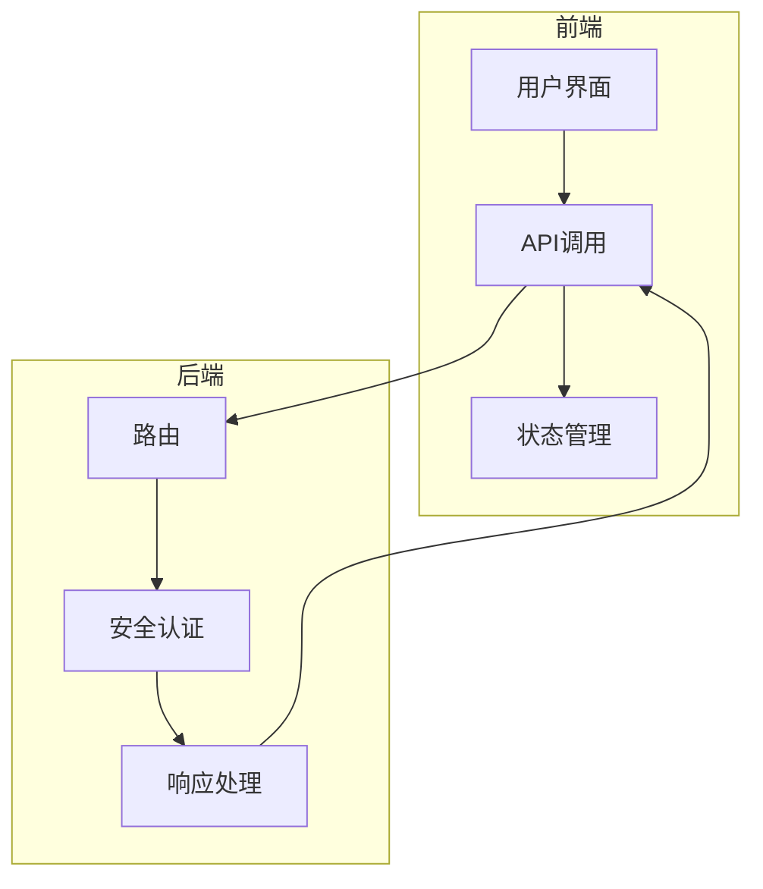
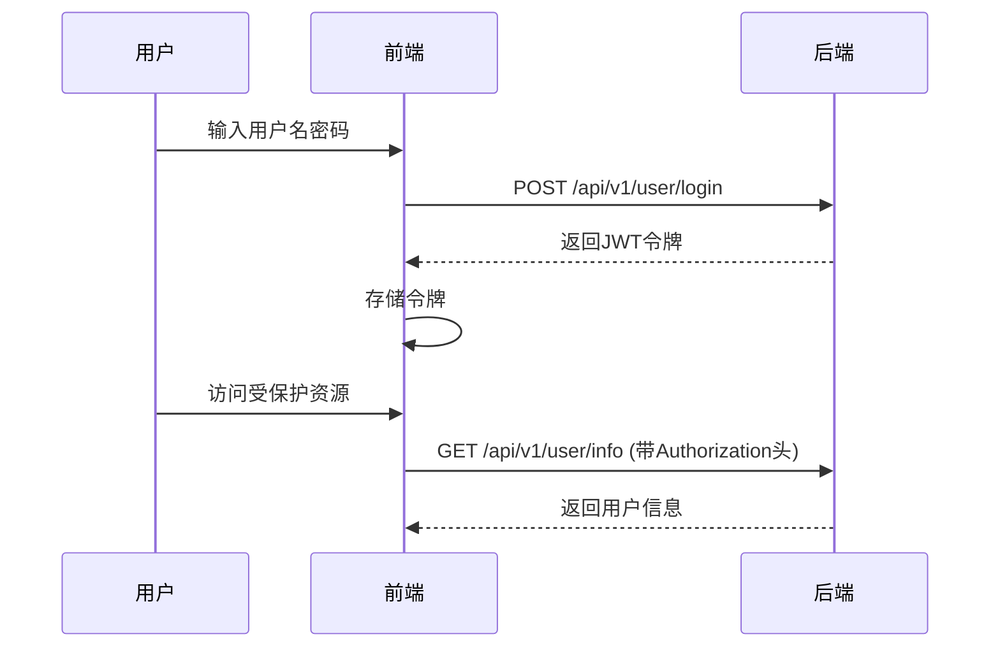
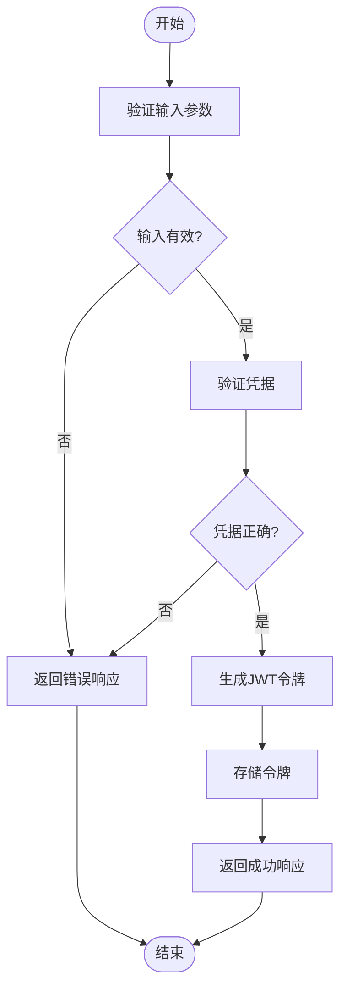
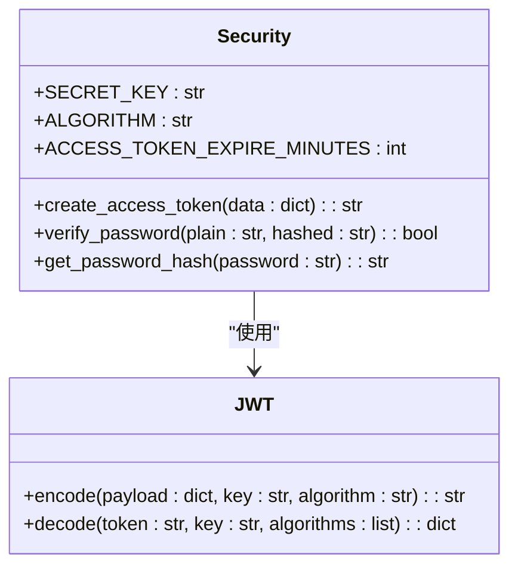
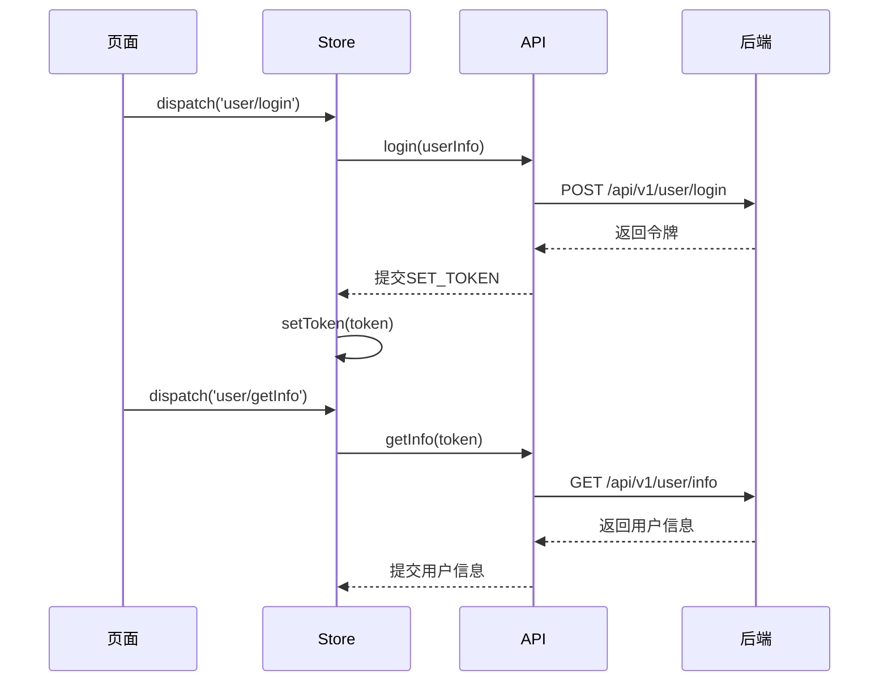
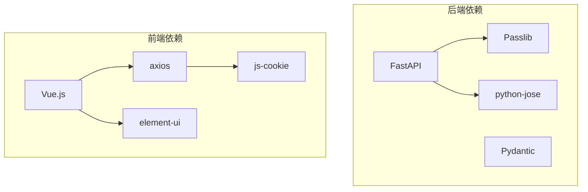

# 用户认证与管理API

<cite>
**本文档引用的文件**   
- [user.py](file://backend/app/api/v1/user.py)
- [security.py](file://backend/app/core/security.py)
- [user.js](file://frontend/src/api/user.js)
- [request.js](file://frontend/src/utils/request.js)
- [auth.js](file://frontend/src/utils/auth.js)
- [user.js](file://frontend/src/store/modules/user.js)
- [config.py](file://backend/app/config.py)
- [index.vue](file://frontend/src/views/login/index.vue)
</cite>

## 目录
1. [简介](#简介)
2. [项目结构](#项目结构)
3. [核心组件](#核心组件)
4. [架构概述](#架构概述)
5. [详细组件分析](#详细组件分析)
6. [依赖分析](#依赖分析)
7. [性能考虑](#性能考虑)
8. [故障排除指南](#故障排除指南)
9. [结论](#结论)

## 简介
本系统为AI股票分析系统，提供用户认证与管理API，支持用户登录、获取用户信息和登出功能。系统采用JWT（JSON Web Token）进行身份验证，前端使用Vue.js框架，后端使用FastAPI框架。认证流程包括密码验证、JWT令牌生成与验证、权限校验等环节，确保系统安全可靠。

## 项目结构
系统分为前端和后端两大部分。后端位于`backend`目录，使用Python的FastAPI框架实现API接口；前端位于`frontend`目录，使用Vue.js框架实现用户界面。用户认证相关代码分布在后端的`app/api/v1/user.py`和`app/core/security.py`，以及前端的`src/api/user.js`和`src/utils/request.js`等文件中。

**图示来源**
- [user.py](file://backend/app/api/v1/user.py#L1-L39)
- [request.js](file://frontend/src/utils/request.js#L1-L95)

**章节来源**
- [user.py](file://backend/app/api/v1/user.py#L1-L39)
- [request.js](file://frontend/src/utils/request.js#L1-L95)

## 核心组件
系统的核心认证组件包括用户登录接口、JWT令牌生成与验证、前端请求拦截器等。登录接口验证用户名和密码后生成JWT令牌，前端通过axios拦截器自动在请求头中添加Authorization字段，实现无状态认证。

**章节来源**
- [user.py](file://backend/app/api/v1/user.py#L14-L39)
- [security.py](file://backend/app/core/security.py#L17-L37)
- [request.js](file://frontend/src/utils/request.js#L14-L30)

## 架构概述
系统采用前后端分离架构，前端通过HTTP请求与后端API交互。认证流程中，用户登录后获得JWT令牌，后续请求通过Authorization头携带令牌进行身份验证。系统使用bcrypt算法对密码进行哈希处理，确保密码安全。

**图示来源**
- [user.py](file://backend/app/api/v1/user.py#L14-L39)
- [security.py](file://backend/app/core/security.py#L17-L37)

## 详细组件分析

### 用户登录分析
用户登录功能通过`/api/v1/user/login`端点实现，接收用户名和密码，验证后返回JWT令牌。系统目前使用固定用户名"admin"和密码"123456"进行验证，实际生产环境应连接数据库验证用户信息。

**图示来源**
- [user.py](file://backend/app/api/v1/user.py#L14-L24)
- [security.py](file://backend/app/core/security.py#L17-L26)

**章节来源**
- [user.py](file://backend/app/api/v1/user.py#L14-L24)
- [security.py](file://backend/app/core/security.py#L17-L26)

### JWT令牌生成与验证
JWT令牌生成与验证由`security.py`文件中的`create_access_token`函数实现。系统使用HS256算法，密钥存储在配置文件中，令牌默认30分钟过期。验证时解析令牌并检查有效期。

**图示来源**
- [security.py](file://backend/app/core/security.py#L17-L37)
- [config.py](file://backend/app/config.py#L31-L33)

**章节来源**
- [security.py](file://backend/app/core/security.py#L17-L37)

### 前端集成分析
前端通过`user.js`文件封装API调用，使用axios拦截器自动在请求中添加Authorization头。用户信息存储在Vuex状态管理中，页面访问时自动验证用户身份。

**图示来源**
- [user.js](file://frontend/src/api/user.js#L3-L24)
- [request.js](file://frontend/src/utils/request.js#L14-L30)
- [user.js](file://frontend/src/store/modules/user.js#L31-L51)

**章节来源**
- [user.js](file://frontend/src/api/user.js#L3-L24)
- [request.js](file://frontend/src/utils/request.js#L14-L30)

## 依赖分析
系统依赖主要分为后端依赖和前端依赖。后端使用FastAPI、Pydantic、passlib等库实现API和安全认证，前端使用Vue.js、axios、element-ui等库实现用户界面和HTTP请求。

**图示来源**
- [user.py](file://backend/app/api/v1/user.py#L4-L9)
- [security.py](file://backend/app/core/security.py#L7-L9)
- [user.js](file://frontend/src/api/user.js#L1)
- [request.js](file://frontend/src/utils/request.js#L1)

**章节来源**
- [user.py](file://backend/app/api/v1/user.py#L4-L9)
- [security.py](file://backend/app/core/security.py#L7-L9)

## 性能考虑
系统在认证方面的性能考虑主要包括JWT令牌的生成与验证效率、密码哈希计算开销等。bcrypt算法虽然安全但计算开销较大，建议在高并发场景下使用缓存机制减少重复计算。JWT令牌验证使用对称加密算法HS256，性能较好。

## 故障排除指南
常见认证问题包括登录失败、令牌过期、跨域请求被拒等。登录失败时检查用户名密码是否正确；令牌过期时需要重新登录获取新令牌；跨域问题检查CORS配置是否包含前端域名。

**章节来源**
- [user.py](file://backend/app/api/v1/user.py#L23-L24)
- [request.js](file://frontend/src/utils/request.js#L58-L68)
- [config.py](file://backend/app/config.py#L19-L25)

## 结论
本系统实现了完整的用户认证与管理功能，采用JWT进行无状态认证，前后端分离架构清晰。系统安全性较高，使用bcrypt哈希密码，JWT令牌有过期机制。前端集成方便，通过拦截器自动处理认证头。建议在生产环境中连接数据库验证用户，增强安全性。