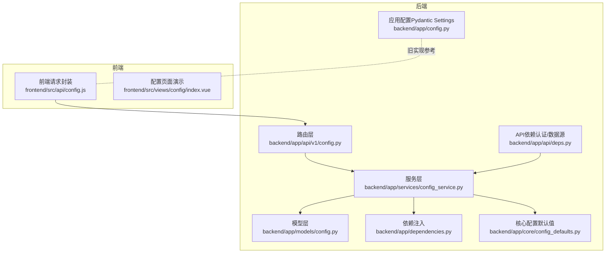
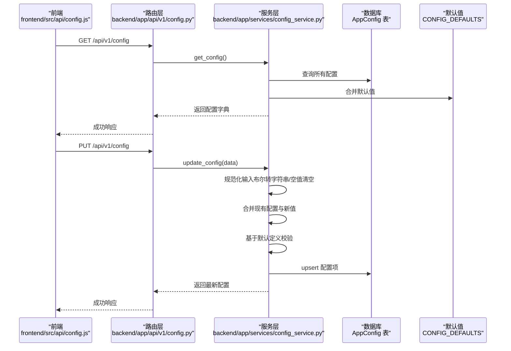
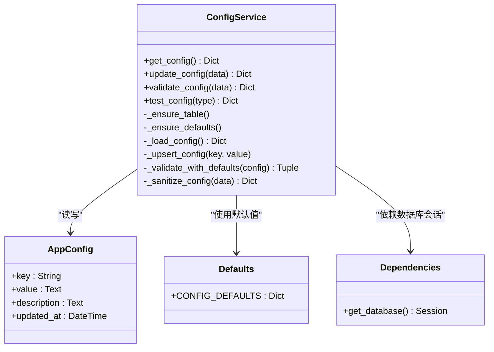

# 系统配置API

<cite>
**本文引用的文件列表**
- [backend/app/api/v1/config.py](file://backend/app/api/v1/config.py)
- [backend/app/api/v1/router.py](file://backend/app/api/v1/router.py)
- [backend/app/services/config_service.py](file://backend/app/services/config_service.py)
- [backend/app/core/config_defaults.py](file://backend/app/core/config_defaults.py)
- [backend/app/models/config.py](file://backend/app/models/config.py)
- [backend/app/dependencies.py](file://backend/app/dependencies.py)
- [backend/app/api/deps.py](file://backend/app/api/deps.py)
- [backend/app/config.py](file://backend/app/config.py)
- [frontend/src/api/config.js](file://frontend/src/api/config.js)
- [frontend/src/views/config/index.vue](file://frontend/src/views/config/index.vue)
- [docs/环境配置功能说明.md](file://docs/环境配置功能说明.md)
- [docs/环境配置快速指南.md](file://docs/环境配置快速指南.md)
</cite>

## 目录
1. [简介](#简介)
2. [项目结构](#项目结构)
3. [核心组件](#核心组件)
4. [架构总览](#架构总览)
5. [详细组件分析](#详细组件分析)
6. [依赖关系分析](#依赖关系分析)
7. [性能考量](#性能考量)
8. [故障排查指南](#故障排查指南)
9. [结论](#结论)
10. [附录](#附录)

## 简介
本文件面向后端与前端开发者，系统化梳理“系统配置管理API”的设计与实现，覆盖以下要点：
- 配置项分类与数据验证规则
- /config/get 与 /config/update 等端点的使用方法
- config_service.py 与核心配置模块（core/config.py）及数据库交互
- 前端调用示例（frontend/src/api/config.js）
- 安全考虑（敏感配置的权限控制与保护）
- 配置热更新机制说明与常见问题解决方案

## 项目结构
配置管理API位于后端 FastAPI 应用中，采用“路由层 → 服务层 → 模型层 → 数据库”的分层架构；前端通过统一的请求封装模块调用后端接口。

图表来源
- [backend/app/api/v1/config.py](file://backend/app/api/v1/config.py#L1-L91)
- [backend/app/services/config_service.py](file://backend/app/services/config_service.py#L1-L182)
- [backend/app/models/config.py](file://backend/app/models/config.py#L1-L21)
- [backend/app/core/config_defaults.py](file://backend/app/core/config_defaults.py#L1-L154)
- [backend/app/dependencies.py](file://backend/app/dependencies.py#L1-L15)
- [backend/app/api/deps.py](file://backend/app/api/deps.py#L1-L59)
- [backend/app/config.py](file://backend/app/config.py#L1-L92)
- [frontend/src/api/config.js](file://frontend/src/api/config.js#L1-L38)
- [frontend/src/views/config/index.vue](file://frontend/src/views/config/index.vue#L466-L532)

章节来源
- [backend/app/api/v1/config.py](file://backend/app/api/v1/config.py#L1-L91)
- [backend/app/api/v1/router.py](file://backend/app/api/v1/router.py#L1-L36)

## 核心组件
- 路由层（FastAPI）：提供 /api/v1/config 的 GET/PUT/POST 接口，负责参数解析与异常处理。
- 服务层（ConfigService）：负责配置的读取、合并、校验、持久化与测试。
- 模型层（AppConfig）：数据库表结构，键值型配置存储。
- 核心默认值（CONFIG_DEFAULTS）：定义配置项的默认值、必填性、类型与描述。
- 依赖注入：数据库会话注入；API依赖中包含从数据库加载配置以初始化数据源管理器。
- 应用配置（Settings）：旧实现中使用 Pydantic Settings 读取 .env，当前配置API主要通过数据库持久化。

章节来源
- [backend/app/services/config_service.py](file://backend/app/services/config_service.py#L1-L182)
- [backend/app/models/config.py](file://backend/app/models/config.py#L1-L21)
- [backend/app/core/config_defaults.py](file://backend/app/core/config_defaults.py#L1-L154)
- [backend/app/dependencies.py](file://backend/app/dependencies.py#L1-L15)
- [backend/app/api/deps.py](file://backend/app/api/deps.py#L1-L59)
- [backend/app/config.py](file://backend/app/config.py#L1-L92)

## 架构总览
后端通过 FastAPI 路由将请求转发至 ConfigService，服务层从数据库读取配置并与默认值合并，执行校验与更新，最终返回标准化响应。前端通过统一的 request 封装调用后端接口。

图表来源
- [backend/app/api/v1/config.py](file://backend/app/api/v1/config.py#L1-L91)
- [backend/app/services/config_service.py](file://backend/app/services/config_service.py#L1-L182)
- [backend/app/models/config.py](file://backend/app/models/config.py#L1-L21)
- [backend/app/core/config_defaults.py](file://backend/app/core/config_defaults.py#L1-L154)
- [frontend/src/api/config.js](file://frontend/src/api/config.js#L1-L38)

## 详细组件分析

### 路由与端点
- GET /api/v1/config：获取当前配置（含默认值回退）。
- PUT /api/v1/config：更新配置（支持增量更新），返回最新配置。
- POST /api/v1/config/validate：验证配置有效性（不持久化）。
- GET /api/v1/config/test：按配置类型测试（兼容 GET）。
- POST /api/v1/config/test：按配置类型测试（推荐 POST）。

章节来源
- [backend/app/api/v1/config.py](file://backend/app/api/v1/config.py#L1-L91)
- [backend/app/api/v1/router.py](file://backend/app/api/v1/router.py#L1-L36)

### 服务层（ConfigService）
- 初始化时确保配置表存在并写入默认值。
- get_config：从数据库读取配置，缺失项使用默认值回填。
- update_config：规范化输入、合并现有配置、基于默认定义校验、upsert 到数据库并提交事务，最后返回最新配置。
- validate_config：仅校验，不持久化。
- test_config：按类型（deepseek/email/webhook/mysql）进行连通性/完整性测试，返回成功/失败与消息。
- 默认值来源：CONFIG_DEFAULTS，包含必填性、类型（text/boolean/password/select）、选项等元信息。

章节来源
- [backend/app/services/config_service.py](file://backend/app/services/config_service.py#L1-L182)
- [backend/app/core/config_defaults.py](file://backend/app/core/config_defaults.py#L1-L154)

### 模型层（AppConfig）
- 表结构：key（主键）、value（文本）、description（说明）、updated_at（时间戳）。
- 服务层通过 SQLAlchemy ORM 对该表进行查询、upsert 和创建。

章节来源
- [backend/app/models/config.py](file://backend/app/models/config.py#L1-L21)

### 依赖注入与数据源初始化
- get_database：提供数据库会话依赖。
- get_data_source：从数据库加载配置并初始化数据源管理器，若失败则回退到默认数据源。

章节来源
- [backend/app/dependencies.py](file://backend/app/dependencies.py#L1-L15)
- [backend/app/api/deps.py](file://backend/app/api/deps.py#L1-L59)

### 前端调用示例
- getConfig：GET /api/v1/config
- updateConfig：PUT /api/v1/config
- validateConfig：POST /api/v1/config/validate
- testConfig：POST /api/v1/config/test

章节来源
- [frontend/src/api/config.js](file://frontend/src/api/config.js#L1-L38)
- [frontend/src/views/config/index.vue](file://frontend/src/views/config/index.vue#L466-L532)

### 配置项分类与验证规则
- 分类概览（来源于默认定义）：
  - AI模型（data_source/ai_model）：DeepSeek API 密钥与基础地址
  - 通知（notification）：邮件与 Webhook 开关、类型、地址、关键词等
  - 数据源（data_source）：Tushare Token（可选）
  - 量化交易（trading）：MiniQMT 开关与账户信息（可选）
  - MySQL 行情库（data_source）：主机、端口、用户、密码、库名、表名（可选）

- 验证规则（来自默认定义与服务层校验）：
  - 必填性：某些键标记为 required，若缺失则拒绝更新
  - 类型约束：布尔值转换为 "true"/"false" 字符串；密码类型字段建议隐藏
  - 内容校验：例如 DeepSeek API Key 长度校验
  - 组合校验：当某开关启用时，要求一组关联字段完整（如邮件/钉钉 Webhook/MySQL）

章节来源
- [backend/app/core/config_defaults.py](file://backend/app/core/config_defaults.py#L1-L154)
- [backend/app/services/config_service.py](file://backend/app/services/config_service.py#L1-L182)

### 安全考虑
- 敏感配置保护：
  - 前端对密码类字段进行隐藏展示
  - 服务层将布尔值规范化为字符串，避免类型混淆
  - 建议在生产环境中对配置接口增加鉴权与权限控制（当前依赖中存在 JWT scheme，但具体鉴权中间件未在配置路由中直接使用）
- 权限控制建议：
  - 对 /config/* 接口增加管理员角色校验
  - 对敏感键（如 API 密钥）单独鉴权或二次确认
- 配置文件安全（旧实现参考）：
  - .env 文件不应纳入版本控制，应使用 .gitignore 保护
  - 建议对 .env 文件设置最小权限访问

章节来源
- [frontend/src/views/config/index.vue](file://frontend/src/views/config/index.vue#L466-L532)
- [backend/app/api/deps.py](file://backend/app/api/deps.py#L1-L59)
- [docs/环境配置功能说明.md](file://docs/环境配置功能说明.md#L1-L243)
- [docs/环境配置快速指南.md](file://docs/环境配置快速指南.md#L1-L237)

### 配置热更新机制说明
- 当前实现（数据库持久化）：
  - 更新配置后，服务层提交事务并返回最新配置
  - 数据源初始化依赖从数据库加载配置，若加载失败则回退默认数据源
- 前端热更新（旧实现参考）：
  - 文档中曾描述通过 UI 保存配置后尝试重新加载并建议重启应用
- 建议的热更新策略：
  - 对于运行中的进程，可在更新后触发一次“配置重载”事件，使各子系统（如通知、数据源）感知新配置
  - 对于敏感配置变更，建议增加二次确认与灰度发布

章节来源
- [backend/app/services/config_service.py](file://backend/app/services/config_service.py#L1-L182)
- [backend/app/api/deps.py](file://backend/app/api/deps.py#L1-L59)
- [docs/环境配置功能说明.md](file://docs/环境配置功能说明.md#L1-L243)

## 依赖关系分析

图表来源
- [backend/app/services/config_service.py](file://backend/app/services/config_service.py#L1-L182)
- [backend/app/models/config.py](file://backend/app/models/config.py#L1-L21)
- [backend/app/core/config_defaults.py](file://backend/app/core/config_defaults.py#L1-L154)
- [backend/app/dependencies.py](file://backend/app/dependencies.py#L1-L15)

章节来源
- [backend/app/services/config_service.py](file://backend/app/services/config_service.py#L1-L182)
- [backend/app/models/config.py](file://backend/app/models/config.py#L1-L21)
- [backend/app/core/config_defaults.py](file://backend/app/core/config_defaults.py#L1-L154)
- [backend/app/dependencies.py](file://backend/app/dependencies.py#L1-L15)

## 性能考量
- 数据库访问：每次读取都会全表扫描并合并默认值，建议在高频场景下引入缓存层（如内存缓存或进程内缓存）以减少数据库压力。
- 校验开销：校验逻辑简单，通常可忽略；若配置项数量增长，可考虑分组校验或延迟校验。
- 并发更新：服务层在更新时逐项 upsert 并一次性 commit，建议在高并发场景下引入锁或幂等更新策略。

## 故障排查指南
- 保存配置失败
  - 检查数据库连接与权限
  - 确认配置键值类型与默认定义一致
- 配置不生效
  - 确认服务层已提交事务并返回最新配置
  - 若依赖外部系统（如数据源），确认初始化流程是否成功
- API 密钥验证失败
  - 确认密钥长度与格式符合要求
  - 检查网络连通性与代理设置
- 通知配置测试失败
  - 邮件：确认授权码、SMTP 端口与服务器地址
  - Webhook：确认类型、URL 与关键词设置

章节来源
- [backend/app/services/config_service.py](file://backend/app/services/config_service.py#L1-L182)
- [docs/环境配置功能说明.md](file://docs/环境配置功能说明.md#L1-L243)
- [docs/环境配置快速指南.md](file://docs/环境配置快速指南.md#L1-L237)

## 结论
本配置管理API以数据库为中心，结合默认值与严格校验，提供了稳定可靠的配置读取、更新与验证能力。配合前端可视化界面，用户可便捷地维护系统参数。建议后续增强：
- 对配置接口增加鉴权与权限控制
- 引入配置缓存与热更新事件机制
- 完善敏感配置的二次确认与审计日志

## 附录

### API 定义与使用示例
- GET /api/v1/config
  - 功能：获取当前配置（含默认值）
  - 响应：标准成功响应，包含配置字典
- PUT /api/v1/config
  - 请求体：配置键值对（布尔值将被规范化为字符串）
  - 功能：更新配置并返回最新配置
  - 响应：标准成功响应，包含最新配置
- POST /api/v1/config/validate
  - 请求体：待验证的配置键值对
  - 功能：验证配置有效性（不持久化）
  - 响应：标准成功响应，包含验证结果
- POST /api/v1/config/test
  - 请求体：{ "config_type": "deepseek|email|webhook|mysql" }
  - 功能：按类型测试配置可用性
  - 响应：标准成功响应，包含测试结果

章节来源
- [backend/app/api/v1/config.py](file://backend/app/api/v1/config.py#L1-L91)
- [frontend/src/api/config.js](file://frontend/src/api/config.js#L1-L38)

### 配置项分类与默认值参考
- AI模型（data_source/ai_model）
  - DeepSeek API 密钥（必填）
  - DeepSeek API 地址（可选）
- 通知（notification）
  - 邮件开关、SMTP 服务器、端口、发件人、授权码、收件人
  - Webhook 开关、类型（钉钉/飞书）、URL、关键词
- 数据源（data_source）
  - Tushare Token（可选）
- 量化交易（trading）
  - MiniQMT 开关、账户ID、账户类型、用户数据路径（可选）
- MySQL 行情库（data_source）
  - 主机、端口、用户、密码、库名、表名（可选）

章节来源
- [backend/app/core/config_defaults.py](file://backend/app/core/config_defaults.py#L1-L154)