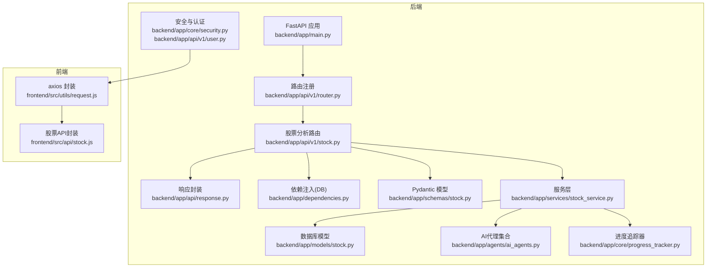
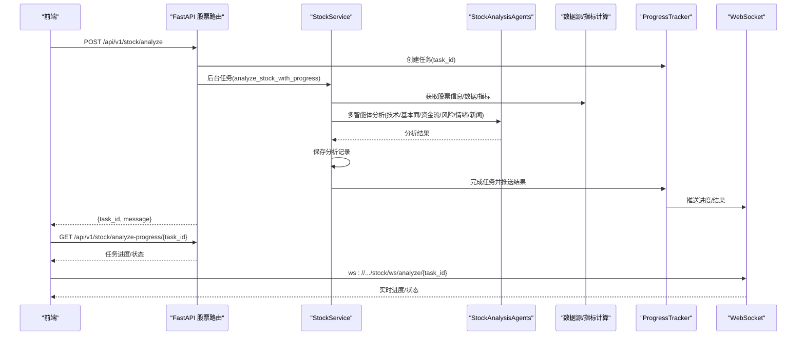
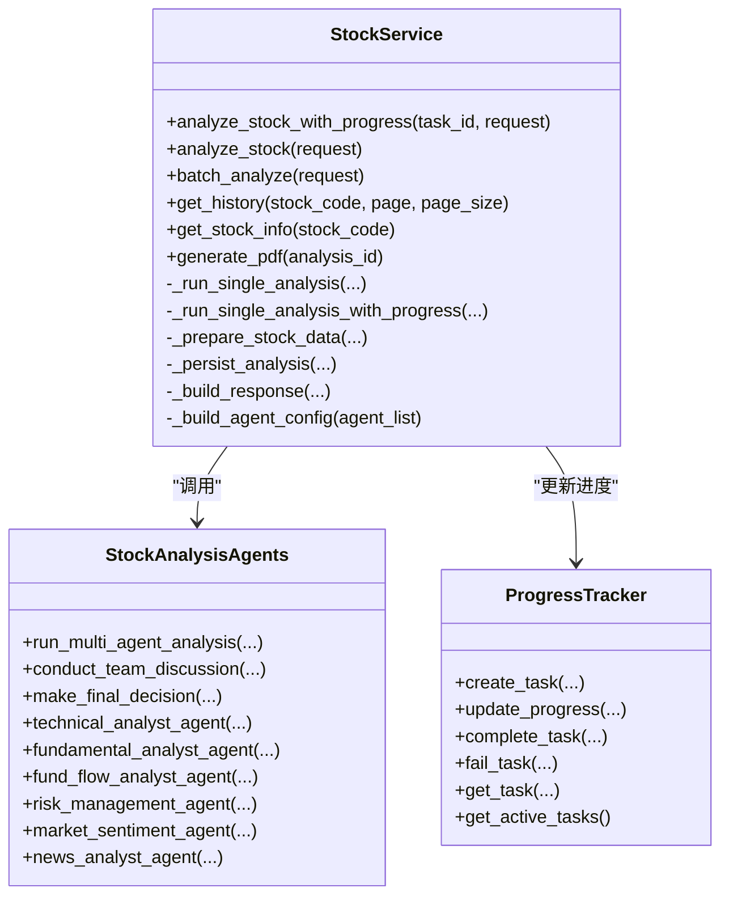
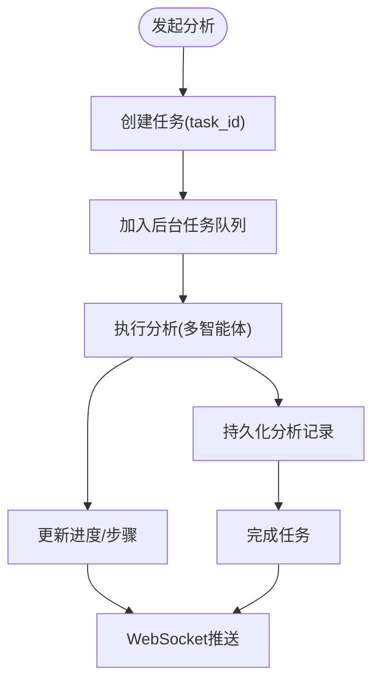
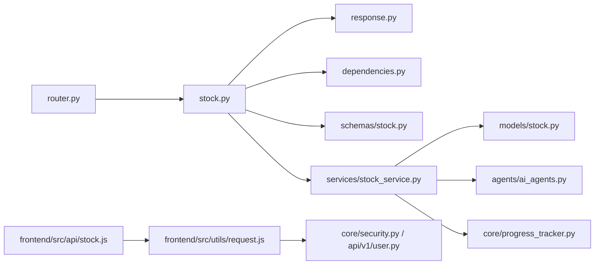

# 股票分析API

<cite>
**本文引用的文件**
- [backend/app/main.py](file://backend/app/main.py)
- [backend/app/api/v1/router.py](file://backend/app/api/v1/router.py)
- [backend/app/api/v1/stock.py](file://backend/app/api/v1/stock.py)
- [backend/app/api/response.py](file://backend/app/api/response.py)
- [backend/app/dependencies.py](file://backend/app/dependencies.py)
- [backend/app/schemas/stock.py](file://backend/app/schemas/stock.py)
- [backend/app/models/stock.py](file://backend/app/models/stock.py)
- [backend/app/services/stock_service.py](file://backend/app/services/stock_service.py)
- [backend/app/agents/ai_agents.py](file://backend/app/agents/ai_agents.py)
- [backend/app/core/progress_tracker.py](file://backend/app/core/progress_tracker.py)
- [backend/app/core/security.py](file://backend/app/core/security.py)
- [backend/app/api/v1/user.py](file://backend/app/api/v1/user.py)
- [frontend/src/api/stock.js](file://frontend/src/api/stock.js)
- [frontend/src/utils/request.js](file://frontend/src/utils/request.js)
- [backend/test_apis.py](file://backend/test_apis.py)
</cite>

## 目录
1. [简介](#简介)
2. [项目结构](#项目结构)
3. [核心组件](#核心组件)
4. [架构总览](#架构总览)
5. [详细组件分析](#详细组件分析)
6. [依赖关系分析](#依赖关系分析)
7. [性能考虑](#性能考虑)
8. [故障排查指南](#故障排查指南)
9. [结论](#结论)
10. [附录](#附录)

## 简介
本文件面向使用者与开发者，系统化梳理“股票分析API”的端点设计、请求/响应结构、认证方式、与AI代理系统的集成逻辑、异步任务触发机制，以及错误码与处理建议。文档严格依据仓库中的实际代码实现，确保与后端业务逻辑一致。

## 项目结构
后端采用FastAPI框架，API按模块划分在v1版本下，股票分析相关端点位于stock模块；前端通过axios封装统一请求拦截与认证头注入。

**图示来源**
- [backend/app/main.py](file://backend/app/main.py#L1-L91)
- [backend/app/api/v1/router.py](file://backend/app/api/v1/router.py#L1-L36)
- [backend/app/api/v1/stock.py](file://backend/app/api/v1/stock.py#L1-L190)
- [backend/app/api/response.py](file://backend/app/api/response.py#L1-L31)
- [backend/app/dependencies.py](file://backend/app/dependencies.py#L1-L15)
- [backend/app/schemas/stock.py](file://backend/app/schemas/stock.py#L1-L100)
- [backend/app/models/stock.py](file://backend/app/models/stock.py#L1-L26)
- [backend/app/services/stock_service.py](file://backend/app/services/stock_service.py#L1-L573)
- [backend/app/agents/ai_agents.py](file://backend/app/agents/ai_agents.py#L1-L546)
- [backend/app/core/progress_tracker.py](file://backend/app/core/progress_tracker.py#L1-L171)
- [backend/app/core/security.py](file://backend/app/core/security.py#L1-L37)
- [backend/app/api/v1/user.py](file://backend/app/api/v1/user.py#L1-L39)
- [frontend/src/utils/request.js](file://frontend/src/utils/request.js#L1-L95)
- [frontend/src/api/stock.js](file://frontend/src/api/stock.js#L1-L123)

**章节来源**
- [backend/app/main.py](file://backend/app/main.py#L1-L91)
- [backend/app/api/v1/router.py](file://backend/app/api/v1/router.py#L1-L36)

## 核心组件
- FastAPI应用与中间件：CORS、统一异常处理、健康检查
- 路由注册：将stock模块路由挂载至/api/v1/stock前缀
- 股票分析服务：封装单股分析、批量分析、历史查询、PDF生成、数据源与AI代理调用
- Pydantic模型：定义请求/响应结构
- 进度追踪器：异步任务进度与WebSocket推送
- 前端axios封装：统一拦截器、认证头注入、错误处理

**章节来源**
- [backend/app/api/v1/stock.py](file://backend/app/api/v1/stock.py#L1-L190)
- [backend/app/services/stock_service.py](file://backend/app/services/stock_service.py#L1-L573)
- [backend/app/schemas/stock.py](file://backend/app/schemas/stock.py#L1-L100)
- [backend/app/core/progress_tracker.py](file://backend/app/core/progress_tracker.py#L1-L171)
- [frontend/src/utils/request.js](file://frontend/src/utils/request.js#L1-L95)

## 架构总览
股票分析API采用“路由—服务—代理—数据源”的分层架构。单股分析通过BackgroundTasks触发异步任务，服务层协调AI代理集合与数据源，进度追踪器负责任务状态与WebSocket推送；批量分析直接在服务层顺序/并发执行；历史查询与PDF生成分别读取数据库与生成二进制报告。

**图示来源**
- [backend/app/api/v1/stock.py](file://backend/app/api/v1/stock.py#L21-L131)
- [backend/app/services/stock_service.py](file://backend/app/services/stock_service.py#L63-L107)
- [backend/app/agents/ai_agents.py](file://backend/app/agents/ai_agents.py#L407-L546)
- [backend/app/core/progress_tracker.py](file://backend/app/core/progress_tracker.py#L19-L120)

## 详细组件分析

### 股票分析端点一览
- 单股分析（异步）
  - 方法与路径：POST /api/v1/stock/analyze
  - 请求体：StockAnalyzeRequest
  - 响应：success_response，包含task_id与提示信息
  - 异步机制：BackgroundTasks + ProgressTracker + WebSocket
- 查询分析进度
  - 方法与路径：GET /api/v1/stock/analyze-progress/{task_id}
  - 响应：success_response，返回任务详情
  - 错误：404 任务不存在
- 获取进行中的任务
  - 方法与路径：GET /api/v1/stock/active-tasks
  - 响应：success_response，包含tasks与count
- WebSocket 实时进度
  - 路径：/api/v1/stock/ws/analyze/{task_id}
  - 功能：连接后推送当前任务状态，支持ping/get_status
- 批量分析
  - 方法与路径：POST /api/v1/stock/batch-analyze
  - 请求体：BatchAnalyzeRequest
  - 响应：BatchAnalyzeResponse
  - 错误：500 服务器内部错误
- 历史记录查询
  - 方法与路径：GET /api/v1/stock/history
  - 查询参数：stock_code（可选）、page、page_size
  - 响应：success_response，包含total/page/page_size/items
  - 错误：500 服务器内部错误
- 股票信息查询
  - 方法与路径：GET /api/v1/stock/{stock_code}
  - 响应：success_response，返回股票信息
  - 错误：500 服务器内部错误
- PDF报告生成
  - 方法与路径：POST /api/v1/stock/generate-pdf
  - 请求体：analysis_id
  - 响应：success_response，包含filename/content/size
  - 错误：500 服务器内部错误

**章节来源**
- [backend/app/api/v1/stock.py](file://backend/app/api/v1/stock.py#L21-L190)
- [backend/app/api/response.py](file://backend/app/api/response.py#L1-L31)

### 请求/响应模型与参数
- 单股分析请求（StockAnalyzeRequest）
  - 字段：stock_code、period、model、analysts、agents
  - 说明：analysts为字典配置；agents为字符串数组别名映射；period默认1y；model默认deepseek-chat
- 单股分析响应（StockAnalyzeResponse）
  - 字段：stock_code、stock_name、rating、confidence_level、entry_range、take_profit、stop_loss、target_price、analysis_result、created_at
- 批量分析请求（BatchAnalyzeRequest）
  - 字段：stock_codes、period、mode、max_workers、agents
  - 说明：mode支持sequential/parallel；agents用于构建分析师配置
- 批量分析响应（BatchAnalyzeResponse）
  - 字段：total、success、failed、results、failed_stocks
- 历史记录项
  - 字段：id、stock_code、stock_name、rating、confidence_level、entry_range、take_profit、stop_loss、target_price、analysis_type、created_at、analysis_result

**章节来源**
- [backend/app/schemas/stock.py](file://backend/app/schemas/stock.py#L12-L60)
- [backend/app/models/stock.py](file://backend/app/models/stock.py#L9-L26)
- [backend/app/services/stock_service.py](file://backend/app/services/stock_service.py#L170-L221)

### 认证与安全
- JWT认证
  - 登录：POST /api/v1/user/login，返回token
  - 获取用户信息：GET /api/v1/user/info，携带Authorization: Bearer token
  - 前端axios拦截器自动注入Authorization头
- 密钥与算法：settings.SECRET_KEY、ALGORITHM
- 令牌过期：ACCESS_TOKEN_EXPIRE_MINUTES

**章节来源**
- [backend/app/api/v1/user.py](file://backend/app/api/v1/user.py#L1-L39)
- [backend/app/core/security.py](file://backend/app/core/security.py#L1-L37)
- [frontend/src/utils/request.js](file://frontend/src/utils/request.js#L1-L95)

### 与AI代理系统集成
- StockAnalysisAgents负责多智能体分析：
  - 技术面、基本面、资金面、风险管理、市场情绪、新闻
- 服务层调用：_run_single_analysis/_run_single_analysis_with_progress
- 数据源与指标：StockDataFetcher获取股票信息、数据、技术指标
- 季报/资金流/情绪/新闻/风险等数据按需加载

**图示来源**
- [backend/app/services/stock_service.py](file://backend/app/services/stock_service.py#L63-L107)
- [backend/app/agents/ai_agents.py](file://backend/app/agents/ai_agents.py#L407-L546)
- [backend/app/core/progress_tracker.py](file://backend/app/core/progress_tracker.py#L19-L120)

**章节来源**
- [backend/app/services/stock_service.py](file://backend/app/services/stock_service.py#L265-L440)
- [backend/app/agents/ai_agents.py](file://backend/app/agents/ai_agents.py#L1-L546)

### 异步任务触发机制
- 单股分析：POST /api/v1/stock/analyze创建任务，返回task_id；后台任务通过BackgroundTasks执行，服务层在独立线程池中运行分析
- 进度追踪：ProgressTracker维护任务状态、步骤与结果，并通过WebSocket推送
- WebSocket：/api/v1/stock/ws/analyze/{task_id}，支持ping/get_status查询

**图示来源**
- [backend/app/api/v1/stock.py](file://backend/app/api/v1/stock.py#L21-L131)
- [backend/app/services/stock_service.py](file://backend/app/services/stock_service.py#L63-L107)
- [backend/app/core/progress_tracker.py](file://backend/app/core/progress_tracker.py#L45-L120)

**章节来源**
- [backend/app/api/v1/stock.py](file://backend/app/api/v1/stock.py#L21-L131)
- [backend/app/core/progress_tracker.py](file://backend/app/core/progress_tracker.py#L19-L120)

### 错误码与处理建议
- 400 参数错误：业务参数非法（如批量分析缺少stock_codes）
- 422 请求参数校验失败：Pydantic校验失败
- 500 服务器内部错误：未捕获异常、AI服务异常、数据源异常
- 404 任务不存在：查询分析进度时task_id无效
- 处理建议：
  - 前端统一拦截器根据code判断并提示
  - 对于401/403场景，引导重新登录
  - 对于500，记录日志并提示稍后重试

**章节来源**
- [backend/app/api/v1/stock.py](file://backend/app/api/v1/stock.py#L54-L64)
- [backend/app/main.py](file://backend/app/main.py#L34-L72)
- [frontend/src/utils/request.js](file://frontend/src/utils/request.js#L44-L92)

### curl 示例
- 登录获取token
  - curl -X POST http://localhost:9529/api/v1/user/login -H "Content-Type: application/json" -d '{"username":"admin","password":"123456"}'
- 单股分析（异步）
  - curl -X POST http://localhost:9529/api/v1/stock/analyze -H "Authorization: Bearer YOUR_TOKEN" -H "Content-Type: application/json" -d '{"stock_code":"000001.SZ","period":"1y","model":"deepseek-chat","analysts":{"technical":true,"fundamental":true,"fund_flow":true,"risk":true}}'
- 查询分析进度
  - curl -X GET "http://localhost:9529/api/v1/stock/analyze-progress/YOUR_TASK_ID" -H "Authorization: Bearer YOUR_TOKEN"
- 获取进行中的任务
  - curl -X GET http://localhost:9529/api/v1/stock/active-tasks -H "Authorization: Bearer YOUR_TOKEN"
- WebSocket（浏览器或ws客户端）
  - ws://localhost:9529/dev-api/api/v1/stock/ws/analyze/YOUR_TASK_ID
- 批量分析
  - curl -X POST http://localhost:9529/api/v1/stock/batch-analyze -H "Authorization: Bearer YOUR_TOKEN" -H "Content-Type: application/json" -d '{"stock_codes":["000001.SZ","000002.SZ"],"period":"1y","mode":"sequential","max_workers":3}'
- 历史记录查询
  - curl -X GET "http://localhost:9529/api/v1/stock/history?page=1&page_size=20&stock_code=000001.SZ" -H "Authorization: Bearer YOUR_TOKEN"
- 股票信息查询
  - curl -X GET http://localhost:9529/api/v1/stock/000001.SZ -H "Authorization: Bearer YOUR_TOKEN"
- PDF报告生成
  - curl -X POST http://localhost:9529/api/v1/stock/generate-pdf -H "Authorization: Bearer YOUR_TOKEN" -H "Content-Type: application/json" -d '{"analysis_id":1}' -o report.pdf

**章节来源**
- [backend/test_apis.py](file://backend/test_apis.py#L1-L197)
- [backend/app/api/v1/user.py](file://backend/app/api/v1/user.py#L1-L39)

### 前端调用示例（axios）
- 单股分析
  - analyzeStock({stock_code, period, model, analysts})
- 查询进度
  - getAnalyzeProgress(taskId)
- 获取进行中的任务
  - getActiveTasks()
- WebSocket监听
  - connectTaskWebSocket(taskId, onMessage, onError)
- 批量分析
  - batchAnalyzeStock({stock_codes, period, mode, max_workers, agents})
- 历史记录
  - getStockHistory({stock_code, page, page_size})
- 股票信息
  - getStockInfo(stockCode)
- PDF生成
  - generateStockPDF({analysis_id})，responseType: 'blob'

**章节来源**
- [frontend/src/api/stock.js](file://frontend/src/api/stock.js#L1-L123)
- [frontend/src/utils/request.js](file://frontend/src/utils/request.js#L1-L95)

## 依赖关系分析
- 路由依赖：router.include_router将stock路由挂载到/api/v1/stock
- 服务依赖：StockService依赖数据源管理器、AI代理、进度追踪器、数据库模型
- Pydantic依赖：请求/响应模型用于参数校验与序列化
- 前端依赖：axios拦截器统一注入Authorization头

**图示来源**
- [backend/app/api/v1/router.py](file://backend/app/api/v1/router.py#L1-L36)
- [backend/app/api/v1/stock.py](file://backend/app/api/v1/stock.py#L1-L190)
- [backend/app/api/response.py](file://backend/app/api/response.py#L1-L31)
- [backend/app/dependencies.py](file://backend/app/dependencies.py#L1-L15)
- [backend/app/schemas/stock.py](file://backend/app/schemas/stock.py#L1-L100)
- [backend/app/services/stock_service.py](file://backend/app/services/stock_service.py#L1-L573)
- [backend/app/models/stock.py](file://backend/app/models/stock.py#L1-L26)
- [backend/app/agents/ai_agents.py](file://backend/app/agents/ai_agents.py#L1-L546)
- [backend/app/core/progress_tracker.py](file://backend/app/core/progress_tracker.py#L1-L171)
- [frontend/src/api/stock.js](file://frontend/src/api/stock.js#L1-L123)
- [frontend/src/utils/request.js](file://frontend/src/utils/request.js#L1-L95)
- [backend/app/core/security.py](file://backend/app/core/security.py#L1-L37)
- [backend/app/api/v1/user.py](file://backend/app/api/v1/user.py#L1-L39)

**章节来源**
- [backend/app/api/v1/router.py](file://backend/app/api/v1/router.py#L1-L36)
- [backend/app/services/stock_service.py](file://backend/app/services/stock_service.py#L1-L120)

## 性能考虑
- 异步与线程池：分析流程在独立线程池执行，避免阻塞主事件循环
- 进度追踪：分阶段更新进度，便于前端及时反馈
- WebSocket：仅在连接期间推送，减少无谓通信
- 批量分析：支持sequential/parallel两种模式，max_workers可调
- 数据源：按需加载季报/资金流/情绪/新闻/风险数据，失败时降级

[本节为通用指导，无需特定文件来源]

## 故障排查指南
- 422 校验失败：检查请求体是否符合Pydantic模型要求（如必填字段、类型）
- 500 内部错误：查看后端日志，确认AI服务可用性、数据源连通性、数据库写入权限
- 404 任务不存在：确认task_id正确，或先发起分析再查询进度
- WebSocket断开：检查代理与CORS配置，确认ws/wss协议与host一致
- 前端错误提示：axios拦截器会根据code弹窗提示，必要时重新登录

**章节来源**
- [backend/app/main.py](file://backend/app/main.py#L34-L72)
- [frontend/src/utils/request.js](file://frontend/src/utils/request.js#L44-L92)

## 结论
该股票分析API以FastAPI为核心，结合Pydantic模型、服务层与AI代理系统，实现了从单股到批量、从进度追踪到PDF导出的完整分析链路。通过JWT认证与统一响应结构，前端可稳定对接。建议在生产环境中完善限流、缓存与可观测性，并持续优化AI代理的响应速度与准确性。

[本节为总结性内容，无需特定文件来源]

## 附录

### 统一响应结构
- 成功：{"code": 200, "message": "...", "data": {...}}
- 错误：{"code": 4xx/5xx, "msg": "...", "data": null}

**章节来源**
- [backend/app/api/response.py](file://backend/app/api/response.py#L1-L31)

### 健康检查与根路径
- GET /：返回系统信息与文档地址
- GET /health：返回健康状态

**章节来源**
- [backend/app/main.py](file://backend/app/main.py#L75-L91)