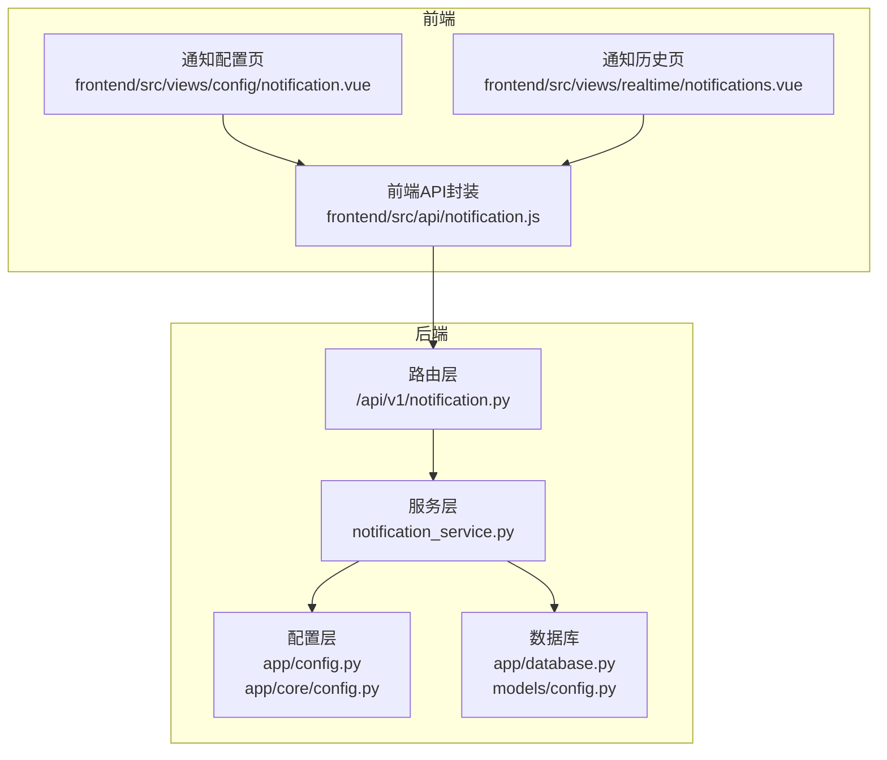
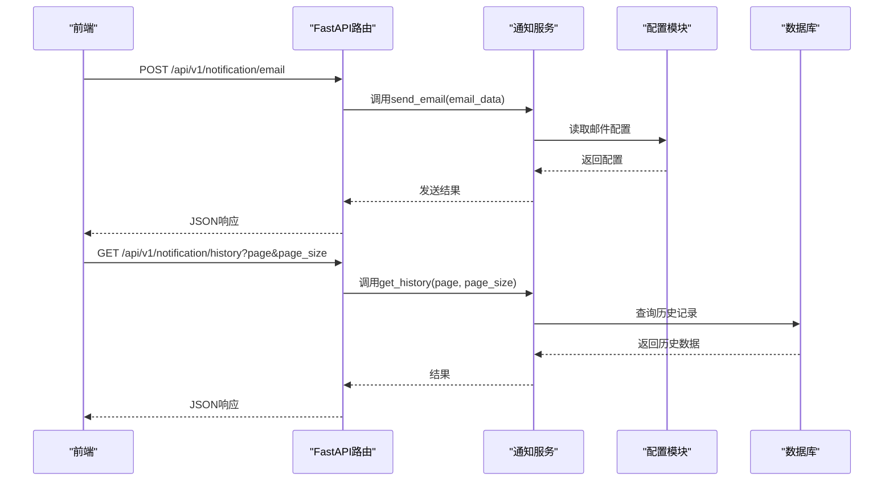
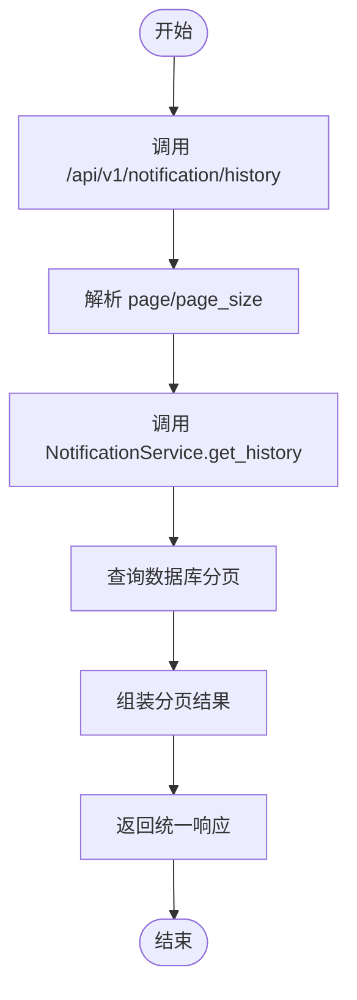
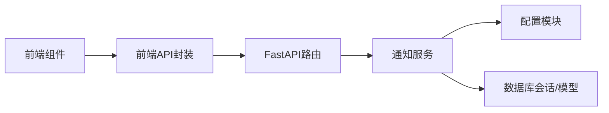

# 通知服务API

<cite>
**本文引用的文件**
- [backend/app/api/v1/notification.py](file://backend/app/api/v1/notification.py)
- [backend/app/api/v1/router.py](file://backend/app/api/v1/router.py)
- [backend/app/services/notification_service.py](file://backend/app/services/notification_service.py)
- [backend/app/config.py](file://backend/app/config.py)
- [backend/app/core/config.py](file://backend/app/core/config.py)
- [backend/app/database.py](file://backend/app/database.py)
- [backend/app/models/config.py](file://backend/app/models/config.py)
- [frontend/src/api/notification.js](file://frontend/src/api/notification.js)
- [frontend/src/views/config/notification.vue](file://frontend/src/views/config/notification.vue)
- [frontend/src/views/realtime/notifications.vue](file://frontend/src/views/realtime/notifications.vue)
- [docs/邮件配置指南.md](file://docs/邮件配置指南.md)
- [docs/Webhook通知配置指南.md](file://docs/Webhook通知配置指南.md)
- [docs/环境配置功能说明.md](file://docs/环境配置功能说明.md)
- [old/notification_service.py](file://old/notification_service.py)
</cite>

## 目录
1. [简介](#简介)
2. [项目结构](#项目结构)
3. [核心组件](#核心组件)
4. [架构总览](#架构总览)
5. [详细组件分析](#详细组件分析)
6. [依赖关系分析](#依赖关系分析)
7. [性能与可靠性](#性能与可靠性)
8. [故障排查指南](#故障排查指南)
9. [结论](#结论)
10. [附录](#附录)

## 简介
本文件面向后端与前端开发者，系统性梳理通知服务API的设计与实现，覆盖通知渠道配置（邮件、Webhook）、消息发送、历史记录查询等接口；说明/notification/config、/notification/send等端点的请求体结构与响应规范；解释notification_service.py中多渠道通知的实现逻辑及如何加载config.py中的系统配置；提供不同通知类型的调用示例（如盯盘触发、系统告警）；并说明错误重试机制与日志记录方式，最后给出与前端notification.vue组件的集成指南。

## 项目结构
通知服务位于后端FastAPI应用中，采用“路由层-服务层-配置层”的分层设计：
- 路由层：定义REST接口，负责参数解析与异常处理
- 服务层：封装通知发送、历史查询、测试等业务逻辑
- 配置层：集中管理邮件与Webhook等系统配置
- 前端：提供通知配置与历史查看的UI组件

图表来源
- [backend/app/api/v1/notification.py](file://backend/app/api/v1/notification.py#L1-L70)
- [backend/app/services/notification_service.py](file://backend/app/services/notification_service.py#L1-L34)
- [backend/app/config.py](file://backend/app/config.py#L1-L92)
- [backend/app/core/config.py](file://backend/app/core/config.py#L1-L8)
- [backend/app/database.py](file://backend/app/database.py#L1-L45)
- [backend/app/models/config.py](file://backend/app/models/config.py#L1-L21)
- [frontend/src/api/notification.js](file://frontend/src/api/notification.js#L1-L39)
- [frontend/src/views/config/notification.vue](file://frontend/src/views/config/notification.vue#L1-L14)
- [frontend/src/views/realtime/notifications.vue](file://frontend/src/views/realtime/notifications.vue#L1-L14)

章节来源
- [backend/app/api/v1/router.py](file://backend/app/api/v1/router.py#L1-L36)
- [backend/app/api/v1/notification.py](file://backend/app/api/v1/notification.py#L1-L70)

## 核心组件
- FastAPI路由与接口
  - /api/v1/notification/email：发送邮件
  - /api/v1/notification/webhook：发送Webhook
  - /api/v1/notification/history：查询通知历史
  - /api/v1/notification/test：测试通知
- 通知服务类
  - NotificationService：封装发送、历史、测试等方法（当前为占位实现）
- 配置系统
  - app/config.py：定义邮件与Webhook配置项
  - app/core/config.py：导出settings与get_settings
- 前端集成
  - frontend/src/api/notification.js：封装HTTP请求
  - frontend/src/views/config/notification.vue：通知配置页面
  - frontend/src/views/realtime/notifications.vue：通知历史页面

章节来源
- [backend/app/api/v1/notification.py](file://backend/app/api/v1/notification.py#L1-L70)
- [backend/app/services/notification_service.py](file://backend/app/services/notification_service.py#L1-L34)
- [backend/app/config.py](file://backend/app/config.py#L1-L92)
- [backend/app/core/config.py](file://backend/app/core/config.py#L1-L8)
- [frontend/src/api/notification.js](file://frontend/src/api/notification.js#L1-L39)
- [frontend/src/views/config/notification.vue](file://frontend/src/views/config/notification.vue#L1-L14)
- [frontend/src/views/realtime/notifications.vue](file://frontend/src/views/realtime/notifications.vue#L1-L14)

## 架构总览
通知服务的整体流程如下：
- 前端通过API封装发起请求
- 路由层解析参数并调用服务层
- 服务层读取配置，执行发送或查询
- 配置来源于应用配置模块
- 历史查询依赖数据库模型与会话

图表来源
- [backend/app/api/v1/notification.py](file://backend/app/api/v1/notification.py#L1-L70)
- [backend/app/services/notification_service.py](file://backend/app/services/notification_service.py#L1-L34)
- [backend/app/config.py](file://backend/app/config.py#L1-L92)
- [backend/app/database.py](file://backend/app/database.py#L1-L45)

## 详细组件分析

### 路由与接口定义
- /api/v1/notification/email
  - 方法：POST
  - 请求体：任意字典对象，用于邮件发送（具体字段由服务层定义）
  - 响应：成功时返回统一成功响应结构
- /api/v1/notification/webhook
  - 方法：POST
  - 请求体：任意字典对象，用于Webhook发送（具体字段由服务层定义）
  - 响应：成功时返回统一成功响应结构
- /api/v1/notification/history
  - 方法：GET
  - 参数：page（默认1）、page_size（默认20）
  - 响应：历史记录分页结果
- /api/v1/notification/test
  - 方法：POST
  - 参数：notification_type（字符串）
  - 响应：测试结果

章节来源
- [backend/app/api/v1/notification.py](file://backend/app/api/v1/notification.py#L1-L70)

### 服务层实现要点
- NotificationService当前为占位实现，预留了send_email、send_webhook、get_history、test_notification四个方法
- 服务层构造函数接收SQLAlchemy会话，用于后续数据库操作
- 建议在服务层中：
  - 读取配置（app/config.py或app/core/config.py导出的settings）
  - 组织邮件与Webhook消息体
  - 执行发送与回写状态
  - 分页查询历史记录

章节来源
- [backend/app/services/notification_service.py](file://backend/app/services/notification_service.py#L1-L34)
- [backend/app/core/config.py](file://backend/app/core/config.py#L1-L8)

### 配置系统与加载
- app/config.py定义了通知相关的配置项：
  - 邮件：EMAIL_ENABLED、SMTP_SERVER、SMTP_PORT、EMAIL_FROM、EMAIL_PASSWORD、EMAIL_TO
  - Webhook：WEBHOOK_ENABLED、WEBHOOK_TYPE、WEBHOOK_URL、WEBHOOK_KEYWORD
- app/core/config.py导出settings与get_settings，供服务层读取
- 前端配置页支持开关与输入控件，对应上述配置项

章节来源
- [backend/app/config.py](file://backend/app/config.py#L1-L92)
- [backend/app/core/config.py](file://backend/app/core/config.py#L1-L8)
- [frontend/src/views/config/index.vue](file://frontend/src/views/config/index.vue#L183-L238)

### 前端集成指南
- API封装
  - sendEmail(data)：POST /api/v1/notification/email
  - sendWebhook(data)：POST /api/v1/notification/webhook
  - getNotificationHistory(params)：GET /api/v1/notification/history
  - testNotification(data)：POST /api/v1/notification/test
- 通知配置页
  - 支持邮件与Webhook配置开关与输入
  - 配置项与后端一致
- 通知历史页
  - 当前为占位页面，后续可接入历史查询

章节来源
- [frontend/src/api/notification.js](file://frontend/src/api/notification.js#L1-L39)
- [frontend/src/views/config/notification.vue](file://frontend/src/views/config/notification.vue#L1-L14)
- [frontend/src/views/realtime/notifications.vue](file://frontend/src/views/realtime/notifications.vue#L1-L14)

### 历史记录查询流程
- 前端调用GET /api/v1/notification/history?page&page_size
- 路由层解析参数并调用服务层get_history
- 服务层基于数据库模型与会话进行分页查询
- 返回统一响应结构

图表来源
- [backend/app/api/v1/notification.py](file://backend/app/api/v1/notification.py#L42-L55)
- [backend/app/services/notification_service.py](file://backend/app/services/notification_service.py#L24-L27)
- [backend/app/database.py](file://backend/app/database.py#L1-L45)

## 依赖关系分析
- 路由依赖服务层
- 服务层依赖配置模块与数据库会话
- 前端依赖API封装与视图组件

图表来源
- [backend/app/api/v1/notification.py](file://backend/app/api/v1/notification.py#L1-L70)
- [backend/app/services/notification_service.py](file://backend/app/services/notification_service.py#L1-L34)
- [backend/app/config.py](file://backend/app/config.py#L1-L92)
- [backend/app/database.py](file://backend/app/database.py#L1-L45)

章节来源
- [backend/app/api/v1/router.py](file://backend/app/api/v1/router.py#L1-L36)
- [backend/app/api/v1/notification.py](file://backend/app/api/v1/notification.py#L1-L70)

## 性能与可靠性
- 配置加载
  - 使用单例缓存加载配置，减少重复I/O
- 发送可靠性
  - 建议在服务层对邮件与Webhook发送增加超时与重试策略
  - 对外发送失败不应阻塞主流程，可异步或队列化处理
- 日志记录
  - 建议在服务层捕获异常并记录详细日志，便于排查
- 并发与限流
  - Webhook平台存在消息频率限制，应在服务层做节流控制

[本节为通用建议，不直接分析具体文件]

## 故障排查指南
- 邮件配置
  - 确认SMTP服务器、端口、发件人、授权码、收件人完整
  - 参考邮件配置指南，获取各邮箱服务商的授权码设置方法
- Webhook配置
  - 确认Webhook类型（钉钉/飞书）、URL有效
  - 钉钉关键词安全设置需与消息内容匹配
- 历史查询
  - 确认分页参数合法
  - 检查数据库连接与权限
- 前端集成
  - 确认API网关与CORS配置允许前端访问
  - 检查路由前缀与路径是否一致

章节来源
- [docs/邮件配置指南.md](file://docs/邮件配置指南.md#L1-L73)
- [docs/Webhook通知配置指南.md](file://docs/Webhook通知配置指南.md#L1-L445)
- [docs/环境配置功能说明.md](file://docs/环境配置功能说明.md#L56-L98)

## 结论
通知服务API已完成路由与前端封装，服务层与数据库层仍在完善中。建议尽快补齐服务层的具体实现，包括：
- 邮件发送：读取配置、构造邮件、发送与回写状态
- Webhook发送：读取配置、构造消息体、发送与回写状态
- 历史查询：基于分页模型查询并返回统一结构
- 配置加载：通过settings与get_settings统一读取
- 错误处理与日志：捕获异常并记录，保证系统稳定性

[本节为总结性内容，不直接分析具体文件]

## 附录

### 接口定义与请求体说明
- POST /api/v1/notification/email
  - 请求体：任意字典对象，建议包含收件人列表、主题、正文等字段
  - 响应：统一成功响应
- POST /api/v1/notification/webhook
  - 请求体：任意字典对象，建议包含目标URL、消息类型、消息内容等字段
  - 响应：统一成功响应
- GET /api/v1/notification/history
  - 查询参数：page（默认1）、page_size（默认20）
  - 响应：分页历史记录
- POST /api/v1/notification/test
  - 请求体：notification_type（字符串）
  - 响应：测试结果

章节来源
- [backend/app/api/v1/notification.py](file://backend/app/api/v1/notification.py#L1-L70)
- [frontend/src/api/notification.js](file://frontend/src/api/notification.js#L1-L39)

### 通知类型与调用示例
- 通知类型
  - 盯盘触发：当股票价格达到阈值时触发
  - 系统告警：系统状态异常或任务失败
  - 定时分析：智策定时分析完成后推送
- 调用示例（路径参考）
  - 邮件发送：调用 sendEmail({收件人列表, 主题, 正文})
  - Webhook发送：调用 sendWebhook({URL, 类型, 内容})
  - 历史查询：调用 getNotificationHistory({page, page_size})
  - 测试通知：调用 testNotification({type})

章节来源
- [frontend/src/api/notification.js](file://frontend/src/api/notification.js#L1-L39)
- [docs/Webhook通知配置指南.md](file://docs/Webhook通知配置指南.md#L1-L445)

### 配置项说明
- 邮件配置
  - EMAIL_ENABLED：是否启用邮件通知
  - SMTP_SERVER：SMTP服务器地址
  - SMTP_PORT：SMTP端口
  - EMAIL_FROM：发件人邮箱
  - EMAIL_PASSWORD：邮箱授权码
  - EMAIL_TO：收件人邮箱
- Webhook配置
  - WEBHOOK_ENABLED：是否启用Webhook通知
  - WEBHOOK_TYPE：Webhook类型（dingtalk或feishu）
  - WEBHOOK_URL：Webhook地址
  - WEBHOOK_KEYWORD：钉钉关键词（可选）

章节来源
- [backend/app/config.py](file://backend/app/config.py#L1-L92)
- [docs/邮件配置指南.md](file://docs/邮件配置指南.md#L1-L73)
- [docs/Webhook通知配置指南.md](file://docs/Webhook通知配置指南.md#L1-L445)

### 与旧实现的对比与迁移建议
- 旧实现（old/notification_service.py）提供了完整的邮件与Webhook发送逻辑、测试方法、历史记录与日志记录
- 新实现（backend/app/services/notification_service.py）仍为占位，建议参考旧实现的发送流程与错误处理策略进行迁移

章节来源
- [old/notification_service.py](file://old/notification_service.py#L1-L759)