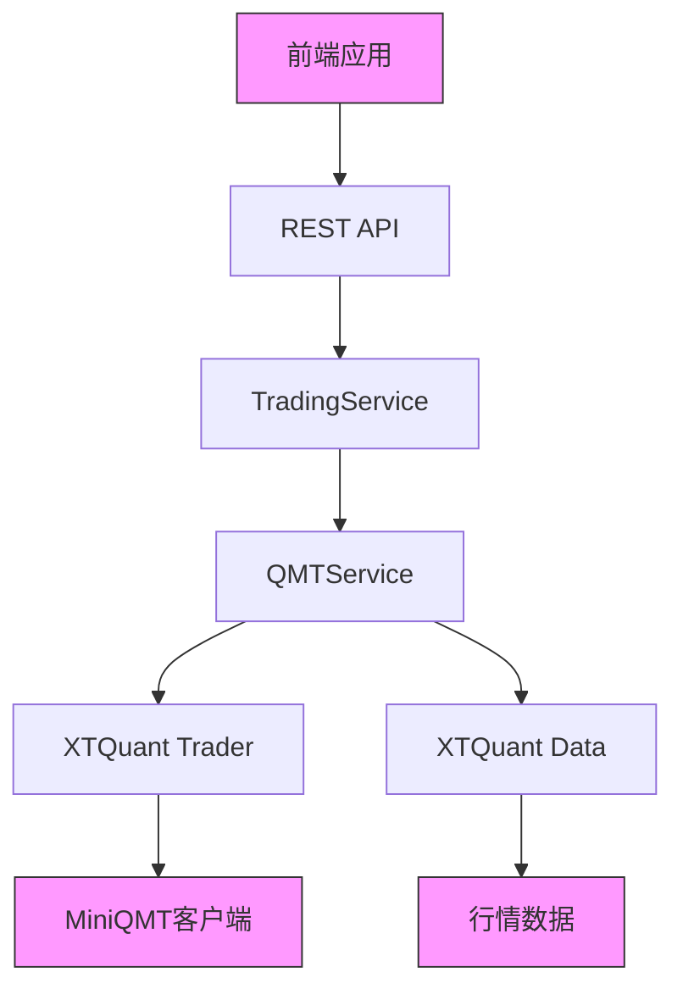
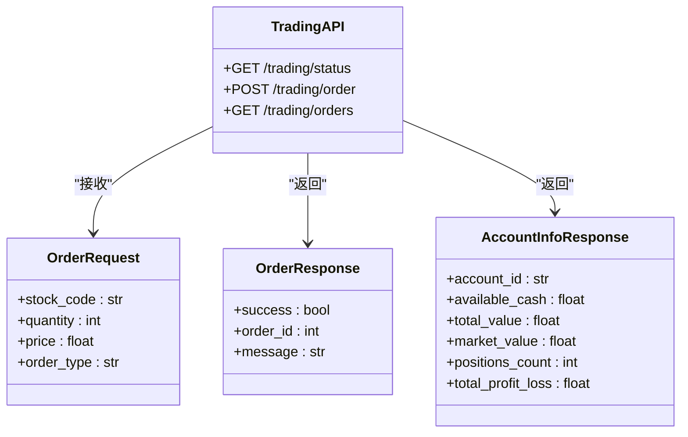
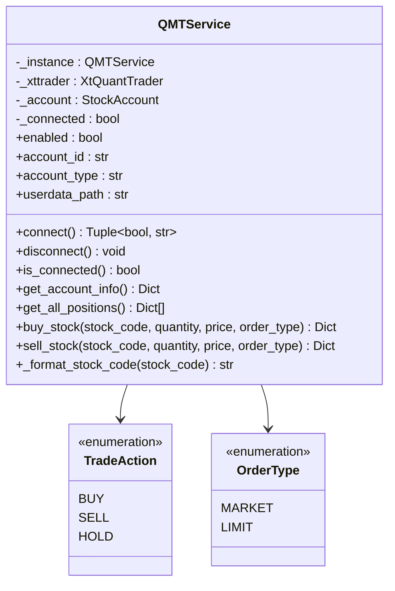
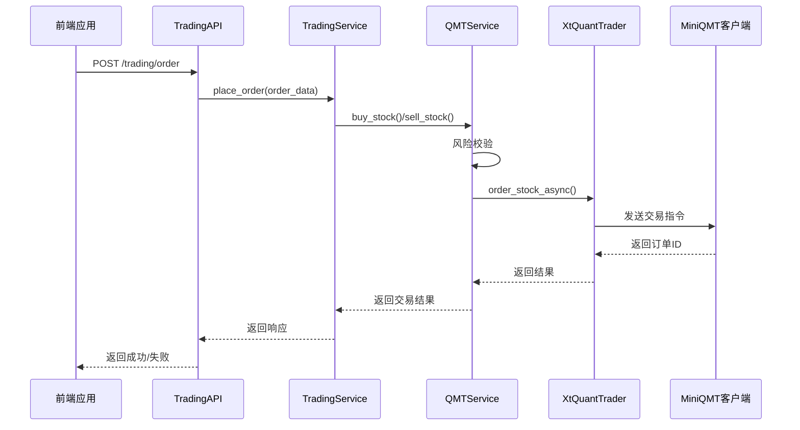
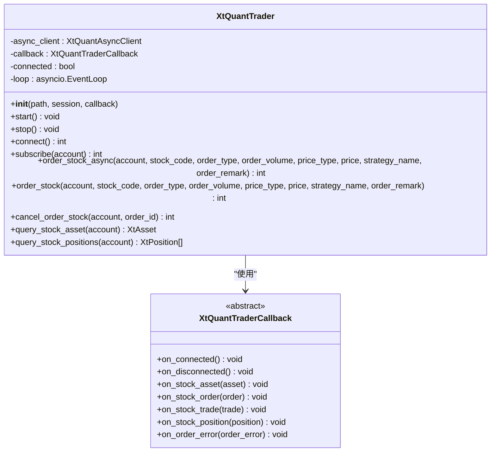
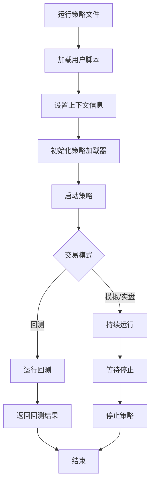
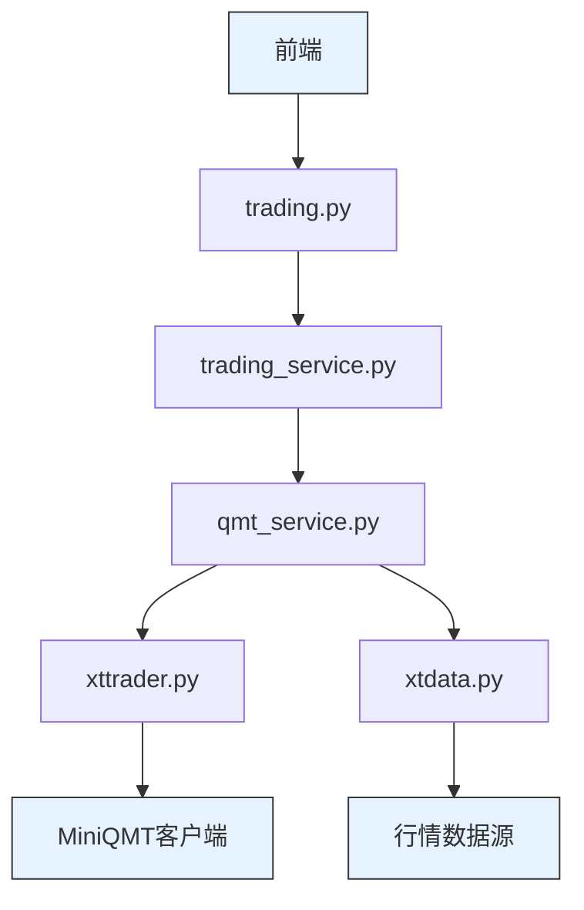

# 量化交易API

<cite>
**本文档引用的文件**  
- [trading.py](file://backend/app/api/v1/trading.py)
- [qmt_service.py](file://backend/app/services/qmt_service.py)
- [xttrader.py](file://xtquant/xttrader.py)
- [stgentry.py](file://xtquant/qmttools/stgentry.py)
- [trading_service.py](file://backend/app/services/trading_service.py)
- [router.py](file://backend/app/api/v1/router.py)
- [config.py](file://backend/app/models/config.py)
- [MINIQMT_INTEGRATION_GUIDE.md](file://docs/MINIQMT_INTEGRATION_GUIDE.md)
- [test_qmt_service.py](file://backend/test_qmt_service.py)
</cite>

## 目录
1. [简介](#简介)
2. [项目结构](#项目结构)
3. [核心组件](#核心组件)
4. [架构概述](#架构概述)
5. [详细组件分析](#详细组件分析)
6. [依赖分析](#依赖分析)
7. [性能考虑](#性能考虑)
8. [故障排除指南](#故障排除指南)
9. [结论](#结论)

## 简介
本API文档详细描述了与MiniQMT平台集成的量化交易功能，重点介绍交易指令接口的使用方法。文档涵盖`/trading/place-order`、`/trading/account-info`等端点的使用方法，包括订单参数（股票代码、价格、数量）、认证机制和响应状态。同时解释了`qmt_service.py`如何通过`xttrader.py`与QMT客户端通信，以及`stgentry.py`在策略执行中的角色。文档还包含交易安全控制、错误码说明和实际调用示例，并强调生产环境下的使用注意事项和风控措施。

## 项目结构
该量化交易系统采用分层架构设计，主要分为前端、后端和XTQuant交易引擎三大部分。后端采用FastAPI框架构建RESTful API，通过`qmt_service.py`与XTQuant的`xttrader.py`进行交互，实现与MiniQMT客户端的连接和交易指令的发送。

```mermaid
graph TB
subgraph "前端"
UI[用户界面]
TradingUI[交易界面]
end
subgraph "后端"
API[API服务]
TradingAPI[/trading/* API]
QMTService[qmt_service.py]
TradingService[trading_service.py]
end
subgraph "XTQuant引擎"
XTTrader[xttrader.py]
XTData[xtdata.py]
QMTClient[MiniQMT客户端]
end
UI --> TradingUI
TradingUI --> API
API --> TradingAPI
TradingAPI --> TradingService
TradingService --> QMTService
QMTService --> XTTrader
XTTrader --> QMTClient
QMTService --> XTData
```

**图示来源**  
- [trading.py](file://backend/app/api/v1/trading.py#L1-L53)
- [qmt_service.py](file://backend/app/services/qmt_service.py#L1-L591)
- [xttrader.py](file://xtquant/xttrader.py#L1-L1773)

**本节来源**  
- [trading.py](file://backend/app/api/v1/trading.py#L1-L53)
- [router.py](file://backend/app/api/v1/router.py#L1-L36)

## 核心组件
系统的核心组件包括交易API接口、QMT服务层、XTQuant交易引擎和策略执行框架。交易API提供RESTful接口供前端调用，QMT服务层作为中间件处理交易逻辑并与XTQuant引擎通信，XTQuant引擎负责与MiniQMT客户端的底层通信，策略执行框架则负责量化策略的加载和执行。

**本节来源**  
- [trading.py](file://backend/app/api/v1/trading.py#L1-L53)
- [qmt_service.py](file://backend/app/services/qmt_service.py#L1-L591)
- [stgentry.py](file://xtquant/qmttools/stgentry.py#L1-L79)

## 架构概述
系统采用分层架构，从上到下分为API层、服务层、交易引擎层和客户端层。API层提供RESTful接口，服务层处理业务逻辑，交易引擎层负责与MiniQMT客户端通信，客户端层执行实际的交易操作。



**图示来源**  
- [trading.py](file://backend/app/api/v1/trading.py#L1-L53)
- [qmt_service.py](file://backend/app/services/qmt_service.py#L1-L591)
- [xttrader.py](file://xtquant/xttrader.py#L1-L1773)

## 详细组件分析

### 交易API分析
交易API提供了一系列端点用于执行量化交易操作，包括下单、查询账户信息和获取订单列表等功能。

#### API端点分析


**图示来源**  
- [trading.py](file://backend/app/api/v1/trading.py#L1-L53)
- [trading_service.py](file://backend/app/services/trading_service.py#L1-L29)

### QMT服务层分析
QMT服务层是连接API层和XTQuant引擎的关键组件，负责处理交易逻辑、风险校验和状态管理。

#### QMT服务类分析


**图示来源**  
- [qmt_service.py](file://backend/app/services/qmt_service.py#L1-L591)

#### 交易流程序列图


**图示来源**  
- [qmt_service.py](file://backend/app/services/qmt_service.py#L403-L563)
- [xttrader.py](file://xtquant/xttrader.py#L450-L482)

### XTQuant交易引擎分析
XTQuant交易引擎是与MiniQMT客户端通信的底层库，提供了连接管理、交易指令发送和数据查询等功能。

#### XTQuant交易器分析


**图示来源**  
- [xttrader.py](file://xtquant/xttrader.py#L120-L800)

### 策略执行框架分析
策略执行框架负责量化策略的加载、初始化和执行，是自动化交易的核心组件。

#### 策略执行流程


**图示来源**  
- [stgentry.py](file://xtquant/qmttools/stgentry.py#L6-L78)

## 依赖分析
系统各组件之间的依赖关系清晰，形成了一个从上到下的调用链。前端依赖API服务，API服务依赖交易服务，交易服务依赖QMT服务，QMT服务最终依赖XTQuant引擎与MiniQMT客户端通信。



**图示来源**  
- [trading.py](file://backend/app/api/v1/trading.py#L1-L53)
- [qmt_service.py](file://backend/app/services/qmt_service.py#L1-L591)
- [xttrader.py](file://xtquant/xttrader.py#L1-L1773)

**本节来源**  
- [trading.py](file://backend/app/api/v1/trading.py#L1-L53)
- [qmt_service.py](file://backend/app/services/qmt_service.py#L1-L591)
- [xttrader.py](file://xtquant/xttrader.py#L1-L1773)

## 性能考虑
在生产环境中使用量化交易API时，需要考虑以下性能和稳定性因素：

1. **连接管理**：QMTService采用单例模式，确保整个应用中只有一个与MiniQMT客户端的连接，避免资源浪费。
2. **异步处理**：交易操作采用异步方式执行，避免阻塞主线程，提高系统响应速度。
3. **错误重试**：在网络不稳定的情况下，应实现适当的错误重试机制，确保交易指令的可靠送达。
4. **资源监控**：定期监控系统资源使用情况，确保交易服务的稳定运行。
5. **日志记录**：详细的日志记录有助于故障排查和交易审计。

## 故障排除指南
当遇到交易相关问题时，可以按照以下步骤进行排查：

**本节来源**  
- [test_qmt_service.py](file://backend/test_qmt_service.py#L1-L89)
- [MINIQMT_INTEGRATION_GUIDE.md](file://docs/MINIQMT_INTEGRATION_GUIDE.md#L1-L258)

### 常见问题及解决方案
| 问题现象 | 可能原因 | 解决方案 |
|---------|--------|--------|
| 连接失败 | MiniQMT客户端未启动 | 确保MiniQMT客户端已启动并登录 |
| | 账户ID配置错误 | 检查MINIQMT_ACCOUNT_ID配置是否正确 |
| | 网络连接问题 | 检查网络连接是否正常 |
| 下单失败 | 资金不足 | 检查账户可用资金是否充足 |
| | 持仓不足 | 检查卖出数量是否超过可用数量 |
| | 交易时间 | 确认当前时间在交易时段内（9:30-15:00） |
| | 股票代码格式 | 确保股票代码格式正确（如600519.SH） |
| 交易未执行 | 量化功能未启用 | 检查是否已启用MiniQMT量化交易功能 |
| | 监测服务未运行 | 确认监测服务正在运行 |

### 错误码说明
| 错误码 | 含义 | 处理建议 |
|-------|-----|--------|
| 500 | 服务器内部错误 | 检查服务日志，联系技术支持 |
| 400 | 请求参数错误 | 检查请求参数是否符合要求 |
| 401 | 认证失败 | 检查认证令牌是否有效 |
| 403 | 权限不足 | 确认用户是否有执行交易的权限 |
| 429 | 请求过于频繁 | 降低请求频率，避免触发限流 |

## 结论
本量化交易API文档详细介绍了与MiniQMT平台集成的交易功能，涵盖了API端点、服务架构、交易流程和故障排除等方面。系统通过分层架构设计，实现了从前端到MiniQMT客户端的完整交易链路。在生产环境中使用时，应特别注意风险控制和稳定性保障，确保交易的安全性和可靠性。