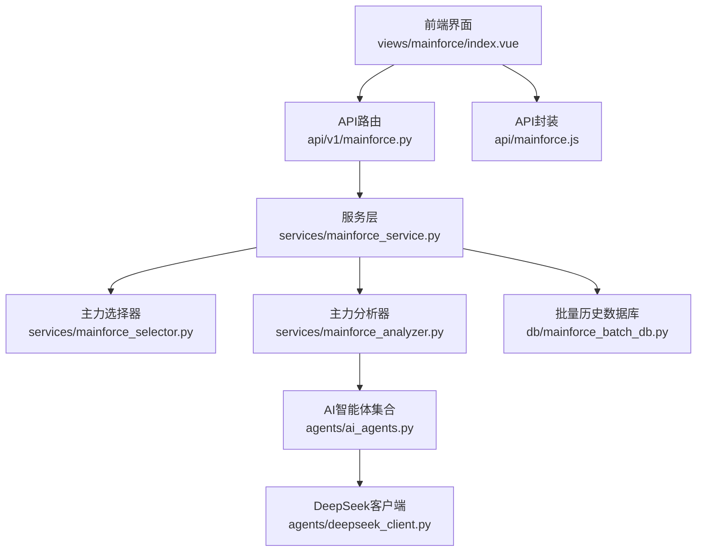
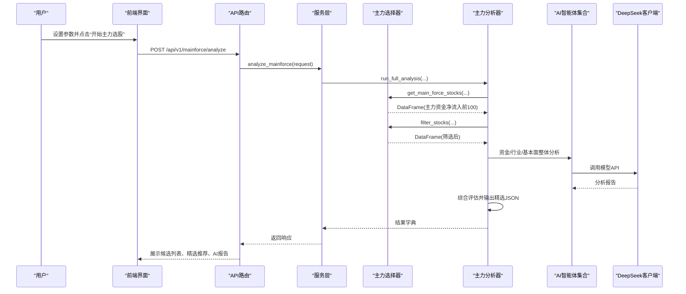
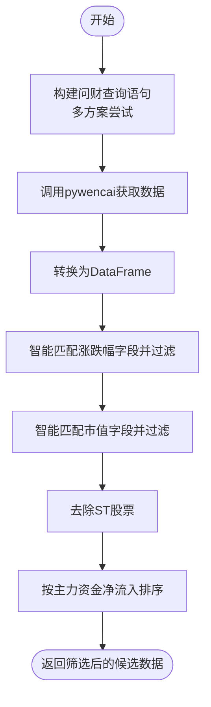
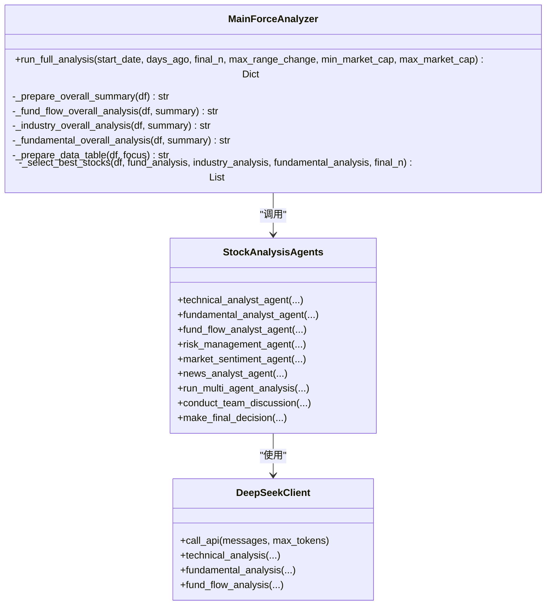
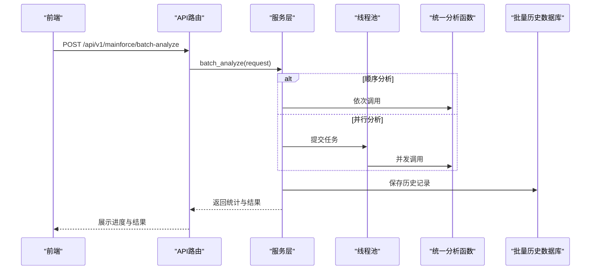
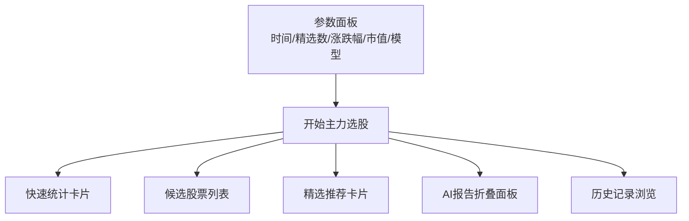
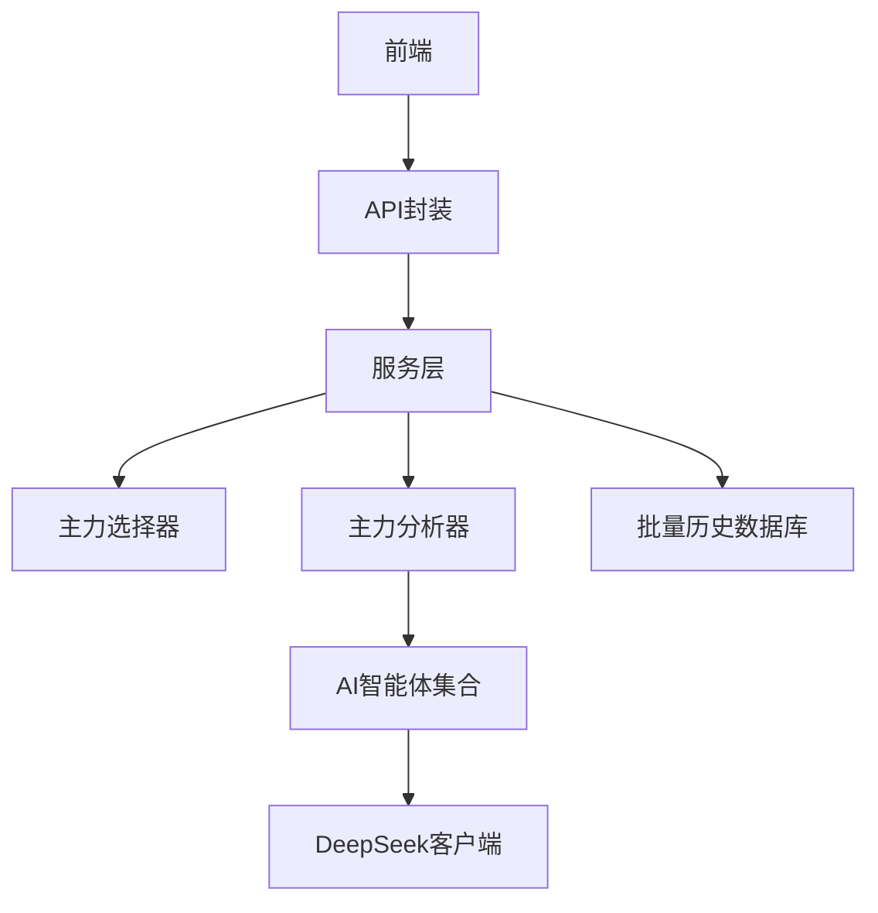

# 主力资金选股

<cite>
**本文引用的文件**
- [mainforce_analyzer.py](file://backend/app/services/mainforce_analyzer.py)
- [mainforce_selector.py](file://backend/app/services/mainforce_selector.py)
- [mainforce_service.py](file://backend/app/services/mainforce_service.py)
- [mainforce.py](file://backend/app/api/v1/mainforce.py)
- [mainforce_batch_db.py](file://backend/app/db/mainforce_batch_db.py)
- [ai_agents.py](file://backend/app/agents/ai_agents.py)
- [deepseek_client.py](file://backend/app/agents/deepseek_client.py)
- [stock.py](file://backend/app/schemas/stock.py)
- [index.vue](file://frontend/src/views/mainforce/index.vue)
- [mainforce.js](file://frontend/src/api/mainforce.js)
- [主力选股功能说明.md](file://docs/主力选股功能说明.md)
- [主力选股使用指南.md](file://docs/主力选股使用指南.md)
- [主力选股批量分析功能说明.md](file://docs/主力选股批量分析功能说明.md)
</cite>

## 目录
1. [简介](#简介)
2. [项目结构](#项目结构)
3. [核心组件](#核心组件)
4. [架构总览](#架构总览)
5. [详细组件分析](#详细组件分析)
6. [依赖关系分析](#依赖关系分析)
7. [性能与优化](#性能与优化)
8. [故障排查指南](#故障排查指南)
9. [结论](#结论)
10. [附录](#附录)

## 简介
本文件围绕“主力资金选股”功能，系统阐述系统如何识别主力资金动向并筛选潜力股，涵盖数据采集（问财主力资金净流入）、筛选条件配置（涨跌幅、市值）、AI增强分析逻辑（资金、行业、基本面三维分析）、批量分析任务执行流程与性能优化、以及前端界面展示与交互。同时结合后端AI决策逻辑，解释模型如何辅助判断主力意图，并提供实际调用示例与参数说明，帮助用户高效使用该功能。

## 项目结构
主力资金选股功能由后端服务层、API路由层、数据库层与前端界面层协同组成，核心流程如下：
- 前端发起分析请求，经API路由进入服务层；
- 服务层调用主力选股选择器与分析器，完成数据采集、筛选与AI整体分析；
- 分析结果通过API返回前端展示；
- 批量分析支持顺序/并行模式，结果持久化到SQLite历史库；
- 前端提供候选列表、精选推荐、AI报告折叠展示与历史记录浏览。

**图表来源**
- [index.vue](file://frontend/src/views/mainforce/index.vue#L1-L120)
- [mainforce.py](file://backend/app/api/v1/mainforce.py#L1-L62)
- [mainforce_service.py](file://backend/app/services/mainforce_service.py#L1-L120)
- [mainforce_selector.py](file://backend/app/services/mainforce_selector.py#L1-L120)
- [mainforce_analyzer.py](file://backend/app/services/mainforce_analyzer.py#L1-L120)
- [ai_agents.py](file://backend/app/agents/ai_agents.py#L1-L120)
- [deepseek_client.py](file://backend/app/agents/deepseek_client.py#L300-L360)
- [mainforce_batch_db.py](file://backend/app/db/mainforce_batch_db.py#L1-L120)
- [mainforce.js](file://frontend/src/api/mainforce.js#L1-L30)

**章节来源**
- [index.vue](file://frontend/src/views/mainforce/index.vue#L1-L120)
- [mainforce.py](file://backend/app/api/v1/mainforce.py#L1-L62)
- [mainforce_service.py](file://backend/app/services/mainforce_service.py#L1-L120)
- [mainforce_selector.py](file://backend/app/services/mainforce_selector.py#L1-L120)
- [mainforce_analyzer.py](file://backend/app/services/mainforce_analyzer.py#L1-L120)
- [ai_agents.py](file://backend/app/agents/ai_agents.py#L1-L120)
- [deepseek_client.py](file://backend/app/agents/deepseek_client.py#L300-L360)
- [mainforce_batch_db.py](file://backend/app/db/mainforce_batch_db.py#L1-L120)
- [mainforce.js](file://frontend/src/api/mainforce.js#L1-L30)

## 核心组件
- 主力选择器（数据采集与筛选）
  - 通过问财pywencai获取主力资金净流入前100名股票，支持多方案查询回退；
  - 智能匹配涨跌幅、市值字段，按阈值过滤并去除ST股票；
  - 支持按主力资金净流入排序取TopN。
- 主力分析器（AI整体分析）
  - 对筛选后的候选股票进行整体数据摘要与三大分析师报告（资金、行业、基本面）；
  - 综合三位分析师意见，输出精选标的JSON并补充原始数据。
- 服务层（调度与批量）
  - 异步执行分析，支持顺序/并行批量分析；
  - 保存批量历史到SQLite，提供历史查询与统计。
- API路由（对外接口）
  - 提供“分析”“批量分析”“历史记录”接口，响应统一模型。
- 前端界面（展示与交互）
  - 参数配置（时间窗口、最终精选数、涨跌幅/市值阈值、AI模型）；
  - 展示快速统计卡片、候选列表、精选推荐、AI报告折叠面板；
  - 历史记录浏览与刷新。

**章节来源**
- [mainforce_selector.py](file://backend/app/services/mainforce_selector.py#L1-L200)
- [mainforce_analyzer.py](file://backend/app/services/mainforce_analyzer.py#L1-L200)
- [mainforce_service.py](file://backend/app/services/mainforce_service.py#L1-L120)
- [mainforce.py](file://backend/app/api/v1/mainforce.py#L1-L62)
- [index.vue](file://frontend/src/views/mainforce/index.vue#L1-L200)

## 架构总览
系统采用前后端分离架构，后端以FastAPI提供REST接口，核心逻辑集中在服务层与分析器。AI分析通过多智能体集合与DeepSeek客户端协作完成，最终输出结构化推荐结果。

**图表来源**
- [mainforce.py](file://backend/app/api/v1/mainforce.py#L1-L62)
- [mainforce_service.py](file://backend/app/services/mainforce_service.py#L1-L120)
- [mainforce_analyzer.py](file://backend/app/services/mainforce_analyzer.py#L1-L200)
- [mainforce_selector.py](file://backend/app/services/mainforce_selector.py#L1-L200)
- [ai_agents.py](file://backend/app/agents/ai_agents.py#L1-L120)
- [deepseek_client.py](file://backend/app/agents/deepseek_client.py#L300-L360)
- [index.vue](file://frontend/src/views/mainforce/index.vue#L1-L200)

## 详细组件分析

### 主力资金数据采集与筛选
- 数据采集
  - 使用pywencai按“开始日期/距今天数”查询主力资金净流入前100名股票；
  - 支持多方案查询（完整/简化/基础/最简），自动回退；
  - 将返回结果转换为DataFrame，记录字段名以便后续智能匹配。
- 智能筛选
  - 区间涨跌幅过滤（智能匹配字段名，如“区间涨跌幅:前复权”等）；
  - 市值过滤（自动识别单位为元或亿并转换）；
  - 去除ST股票；
  - 可按主力资金净流入排序取TopN。
- 输出
  - 原始数据与筛选后数据，供后续AI整体分析与最终决策使用。

**图表来源**
- [mainforce_selector.py](file://backend/app/services/mainforce_selector.py#L1-L200)

**章节来源**
- [mainforce_selector.py](file://backend/app/services/mainforce_selector.py#L1-L200)

### AI增强分析逻辑（资金/行业/基本面）
- 整体数据摘要
  - 统计主力资金总净流入、平均净流入、涨跌幅均值与范围、行业分布等。
- 资金流向整体分析
  - 识别资金集中板块、主力行为特征、资金与涨跌幅配合度、潜在机会与轮动迹象。
- 行业板块整体分析
  - 热点板块识别、板块特征分析、行业前景评估、优质标的推荐。
- 财务基本面整体分析
  - 财务质量评估、估值水平分析、成长性评估、优质标的筛选。
- 综合决策
  - 以三位分析师报告为基础，输出精选标的JSON，包含排名、代码、名称、推荐理由、投资亮点、风险提示、建议仓位、投资周期等，并补充原始数据。

**图表来源**
- [mainforce_analyzer.py](file://backend/app/services/mainforce_analyzer.py#L1-L200)
- [ai_agents.py](file://backend/app/agents/ai_agents.py#L1-L200)
- [deepseek_client.py](file://backend/app/agents/deepseek_client.py#L300-L360)

**章节来源**
- [mainforce_analyzer.py](file://backend/app/services/mainforce_analyzer.py#L1-L200)
- [ai_agents.py](file://backend/app/agents/ai_agents.py#L1-L200)
- [deepseek_client.py](file://backend/app/agents/deepseek_client.py#L300-L360)

### 批量分析任务执行流程与性能优化
- 执行流程
  - 顺序分析：逐个调用统一分析函数，稳定可靠；
  - 并行分析：使用线程池并发执行，提高吞吐；
  - 统一结果字段：使用统一函数与字段名，便于前端展示与后续处理；
  - 历史记录：保存总数量、成功/失败数、耗时、模式等信息。
- 性能优化
  - 线程池并发控制（默认3线程，可配置）；
  - 问财查询多方案回退，提升成功率；
  - 数据表格截断与字段精简，避免Token溢出；
  - SQLite序列化清理，确保结果可持久化。

**图表来源**
- [mainforce_service.py](file://backend/app/services/mainforce_service.py#L120-L219)
- [mainforce_batch_db.py](file://backend/app/db/mainforce_batch_db.py#L120-L219)
- [mainforce.js](file://frontend/src/api/mainforce.js#L1-L30)

**章节来源**
- [mainforce_service.py](file://backend/app/services/mainforce_service.py#L120-L219)
- [mainforce_batch_db.py](file://backend/app/db/mainforce_batch_db.py#L120-L219)

### 前端界面展示与交互
- 参数配置
  - 时间区间（最近3个月/6个月/1年/自定义）、最终精选数量、最大涨跌幅、最小/最大市值、AI模型选择。
- 展示内容
  - 快速统计卡片（获取股票数、筛选后、最终推荐、主力净流入阈值）；
  - 候选股票列表（代码、简称、行业、主力净流入、涨跌幅、市值、PE/PB）；
  - 精选推荐卡片（排名、代码、名称、推荐理由、配置建议、风险提示）；
  - AI分析师报告折叠面板（资金流向、行业板块、财务基本面）；
  - 历史记录浏览与刷新。
- 操作按钮
  - 开始主力选股、清除结果、导出CSV、查看历史、刷新历史等。

**图表来源**
- [index.vue](file://frontend/src/views/mainforce/index.vue#L1-L200)
- [mainforce.js](file://frontend/src/api/mainforce.js#L1-L30)

**章节来源**
- [index.vue](file://frontend/src/views/mainforce/index.vue#L1-L200)
- [mainforce.js](file://frontend/src/api/mainforce.js#L1-L30)

## 依赖关系分析
- 后端依赖
  - 问财pywencai：主力资金数据采集；
  - pandas：数据清洗、筛选、统计；
  - SQLAlchemy：数据库访问（历史记录）；
  - FastAPI：API路由与响应模型；
  - DeepSeekClient：AI模型调用。
- 前端依赖
  - Element Plus：UI组件；
  - Axios：HTTP请求封装；
  - dayjs：日期格式化。

**图表来源**
- [mainforce_service.py](file://backend/app/services/mainforce_service.py#L1-L120)
- [mainforce_analyzer.py](file://backend/app/services/mainforce_analyzer.py#L1-L120)
- [ai_agents.py](file://backend/app/agents/ai_agents.py#L1-L120)
- [deepseek_client.py](file://backend/app/agents/deepseek_client.py#L300-L360)
- [mainforce_batch_db.py](file://backend/app/db/mainforce_batch_db.py#L1-L120)
- [index.vue](file://frontend/src/views/mainforce/index.vue#L1-L120)
- [mainforce.js](file://frontend/src/api/mainforce.js#L1-L30)

**章节来源**
- [mainforce_service.py](file://backend/app/services/mainforce_service.py#L1-L120)
- [mainforce_analyzer.py](file://backend/app/services/mainforce_analyzer.py#L1-L120)
- [ai_agents.py](file://backend/app/agents/ai_agents.py#L1-L120)
- [deepseek_client.py](file://backend/app/agents/deepseek_client.py#L300-L360)
- [mainforce_batch_db.py](file://backend/app/db/mainforce_batch_db.py#L1-L120)
- [index.vue](file://frontend/src/views/mainforce/index.vue#L1-L120)
- [mainforce.js](file://frontend/src/api/mainforce.js#L1-L30)

## 性能与优化
- 并发策略
  - 顺序分析适合少量股票，稳定性高；
  - 并行分析适合批量股票，线程数默认3，可配置2-5；
  - 使用线程池异步执行，避免阻塞。
- 数据处理优化
  - 问财查询多方案回退，提升成功率；
  - 智能匹配字段名，避免硬编码；
  - 数据表格截断与字段精简，防止Token溢出；
  - SQLite序列化清理，确保结果可持久化。
- 响应与展示
  - 前端异步加载，实时进度与结果展示；
  - 统一字段与统一展示格式，便于扩展。

[本节为通用性能指导，不直接分析具体文件，故无“章节来源”标注]

## 故障排查指南
- 问财数据获取失败
  - 多方案查询回退，检查网络与问财可用性；
  - 若返回None或空DataFrame，系统自动尝试下一方案。
- 筛选后无数据
  - 调整涨跌幅/市值阈值，或放宽时间窗口；
  - 检查字段名匹配是否正确（如“区间涨跌幅:前复权”）。
- AI分析异常
  - 检查模型调用参数与Token限制；
  - 若JSON解析失败，系统降级为按主力资金排序返回TopN。
- 批量分析失败
  - 顺序模式更稳定，失败股票会单独列出；
  - 并行模式建议降低线程数或重试；
  - 检查历史记录保存是否成功。

**章节来源**
- [mainforce_selector.py](file://backend/app/services/mainforce_selector.py#L1-L120)
- [mainforce_analyzer.py](file://backend/app/services/mainforce_analyzer.py#L300-L564)
- [mainforce_service.py](file://backend/app/services/mainforce_service.py#L120-L219)

## 结论
主力资金选股功能通过问财主力资金净流入数据采集、智能筛选与AI三维整体分析，形成从“识别主力意图—发现热点—精选标的”的闭环。服务层提供顺序/并行批量分析与历史记录持久化，前端提供直观的参数配置与结果展示。结合统一的分析规范与性能优化策略，系统能够在较短时间内输出高质量的选股建议，辅助用户高效决策。

[本节为总结性内容，不直接分析具体文件，故无“章节来源”标注]

## 附录

### 实际调用示例与参数说明
- 后端接口
  - 分析接口：POST /api/v1/mainforce/analyze
    - 请求体字段：model、final_n、max_range_change、min_market_cap、max_market_cap、start_date/days_ago（二选一）
    - 响应体字段：success、total_stocks、filtered_stocks、final_recommendations、params、error
  - 批量分析接口：POST /api/v1/mainforce/batch-analyze
    - 请求体字段：stock_codes、analysis_mode（sequential/parallel）、max_workers、model
    - 响应体字段：total、success、failed、elapsed_time、analysis_mode、results
  - 历史记录接口：GET /api/v1/mainforce/history?page&page_size
- 前端调用
  - analyzeMainforce(data)：调用分析接口
  - batchAnalyzeMainforce(data)：调用批量分析接口
  - getMainforceHistory(params)：获取历史记录
- 参数说明
  - model：AI模型名称（如deepseek-chat、deepseek-reasoner、openai-gpt4o）
  - final_n：最终精选数量（3-10）
  - max_range_change：最大涨跌幅阈值（%）
  - min_market_cap/max_market_cap：市值区间（亿）
  - start_date/days_ago：时间窗口（二选一）
  - analysis_mode：批量分析模式（sequential/parallel）
  - max_workers：并行线程数（2-5）

**章节来源**
- [mainforce.py](file://backend/app/api/v1/mainforce.py#L1-L62)
- [stock.py](file://backend/app/schemas/stock.py#L62-L100)
- [mainforce.js](file://frontend/src/api/mainforce.js#L1-L30)
- [主力选股使用指南.md](file://docs/主力选股使用指南.md#L1-L120)
- [主力选股批量分析功能说明.md](file://docs/主力选股批量分析功能说明.md#L1-L120)