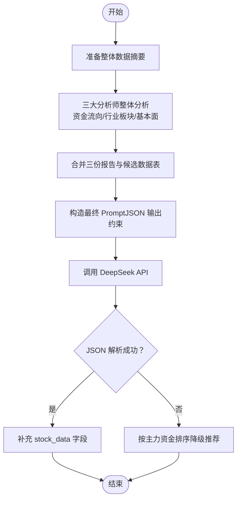

# AI增强决策分析

<cite>
**本文引用的文件**
- [mainforce_analyzer.py](file://backend/app/services/mainforce_analyzer.py)
- [ai_agents.py](file://backend/app/agents/ai_agents.py)
- [deepseek_client.py](file://backend/app/agents/deepseek_client.py)
- [mainforce_selector.py](file://backend/app/services/mainforce_selector.py)
- [stock_data.py](file://backend/app/data/stock_data.py)
- [mainforce_service.py](file://backend/app/services/mainforce_service.py)
- [mainforce.py](file://backend/app/api/v1/mainforce.py)
- [config.py](file://backend/app/config.py)
</cite>

## 目录
1. [简介](#简介)
2. [项目结构](#项目结构)
3. [核心组件](#核心组件)
4. [架构总览](#架构总览)
5. [详细组件分析](#详细组件分析)
6. [依赖关系分析](#依赖关系分析)
7. [性能考虑](#性能考虑)
8. [故障排查指南](#故障排查指南)
9. [结论](#结论)

## 简介
本文件面向“AI增强决策分析”场景，聚焦于主力资金视角的AI协同分析体系，围绕 MainForceAnalyzer 的三大AI分析师（资金流向、行业板块、基本面）如何协同工作，以及如何通过结构化 Prompt 注入上下文、调用 DeepSeek API 完成整体分析与最终推荐。文档还解释了 JSON 结果解析、数据补充与错误降级策略，并结合_select_best_stocks 方法，说明融合 AI 观点生成最终推荐列表的流程。

## 项目结构
- 后端采用 FastAPI + SQLAlchemy 架构，主力选股分析通过服务层 MainforceService 调用分析器 MainForceAnalyzer。
- 分析器内部依赖 StockAnalysisAgents 和 DeepSeekClient，分别负责多智能体协同与调用 DeepSeek API。
- 数据获取由 StockDataFetcher 提供，筛选由 MainForceStockSelector 负责。
- 配置通过 settings 控制 DeepSeek API Key 与 Base URL。

图示来源
- [mainforce.py](file://backend/app/api/v1/mainforce.py#L1-L62)
- [mainforce_service.py](file://backend/app/services/mainforce_service.py#L1-L120)
- [mainforce_analyzer.py](file://backend/app/services/mainforce_analyzer.py#L1-L140)
- [mainforce_selector.py](file://backend/app/services/mainforce_selector.py#L1-L120)
- [stock_data.py](file://backend/app/data/stock_data.py#L1-L120)
- [ai_agents.py](file://backend/app/agents/ai_agents.py#L1-L60)
- [deepseek_client.py](file://backend/app/agents/deepseek_client.py#L1-L60)

章节来源
- [mainforce.py](file://backend/app/api/v1/mainforce.py#L1-L62)
- [mainforce_service.py](file://backend/app/services/mainforce_service.py#L1-L120)
- [mainforce_analyzer.py](file://backend/app/services/mainforce_analyzer.py#L1-L140)

## 核心组件
- MainForceAnalyzer：负责整体流程编排，包括数据摘要、三大分析师整体分析、最终推荐生成与错误降级。
- StockAnalysisAgents：封装多智能体（技术、资金、基本面、风险、情绪、新闻）协同与讨论。
- DeepSeekClient：OpenAI 兼容客户端，封装调用、reasoner 模型处理与错误返回。
- MainForceStockSelector：主力资金数据获取与智能筛选。
- StockDataFetcher：跨数据源的历史数据、实时行情与技术指标计算。
- MainforceService：API 层调度，异步执行分析并返回结构化结果。
- 配置中心 Settings：提供 DeepSeek API Key 与 Base URL。

章节来源
- [mainforce_analyzer.py](file://backend/app/services/mainforce_analyzer.py#L1-L140)
- [ai_agents.py](file://backend/app/agents/ai_agents.py#L1-L120)
- [deepseek_client.py](file://backend/app/agents/deepseek_client.py#L1-L60)
- [mainforce_selector.py](file://backend/app/services/mainforce_selector.py#L1-L120)
- [stock_data.py](file://backend/app/data/stock_data.py#L1-L120)
- [mainforce_service.py](file://backend/app/services/mainforce_service.py#L1-L120)
- [config.py](file://backend/app/config.py#L36-L40)

## 架构总览
三大AI分析师协同工作流程：
- 数据准备：由 Selector 获取主力资金前N名股票，再经智能筛选得到候选集；Analyzer 生成整体数据摘要。
- 上下文注入：将摘要与关键列数据拼装为 Prompt，注入系统提示与用户提示。
- 整体分析：分别调用 DeepSeek API，生成资金流向、行业板块、基本面三份整体报告。
- 决策融合：将三份报告与候选数据表合并为最终 Prompt，要求输出结构化 JSON 推荐列表。
- 结果处理：解析 JSON，补充原始数据字段，若失败则按主力资金排序进行降级推荐。

图示来源
- [mainforce.py](file://backend/app/api/v1/mainforce.py#L1-L62)
- [mainforce_service.py](file://backend/app/services/mainforce_service.py#L1-L120)
- [mainforce_analyzer.py](file://backend/app/services/mainforce_analyzer.py#L120-L220)
- [ai_agents.py](file://backend/app/agents/ai_agents.py#L1-L60)
- [deepseek_client.py](file://backend/app/agents/deepseek_client.py#L1-L60)

## 详细组件分析

### MainForceAnalyzer：三大分析师协同与最终推荐
- 数据摘要生成：统计候选总数、主力资金总净流入/均值、涨跌幅均值与范围、行业分布Top N，形成整体摘要。
- 资金流向整体分析：构建资金面 Prompt，注入摘要与候选数据表，调用 DeepSeek API，返回资金面整体报告。
- 行业板块整体分析：构建行业热点 Prompt，注入摘要与候选数据表，调用 DeepSeek API，返回行业板块整体报告。
- 财务基本面整体分析：构建基本面 Prompt，注入摘要与候选数据表，调用 DeepSeek API，返回基本面整体报告。
- 最终推荐生成：将三份报告与候选数据表合并为 Prompt，要求输出结构化 JSON，包含 rank、symbol、name、reasons、highlights、risks、position、investment_period 等字段；解析 JSON 并补充 stock_data；若解析失败，按主力资金净流入排序进行降级推荐。

图示来源
- [mainforce_analyzer.py](file://backend/app/services/mainforce_analyzer.py#L143-L233)
- [mainforce_analyzer.py](file://backend/app/services/mainforce_analyzer.py#L235-L341)
- [mainforce_analyzer.py](file://backend/app/services/mainforce_analyzer.py#L289-L341)
- [mainforce_analyzer.py](file://backend/app/services/mainforce_analyzer.py#L399-L536)

章节来源
- [mainforce_analyzer.py](file://backend/app/services/mainforce_analyzer.py#L143-L233)
- [mainforce_analyzer.py](file://backend/app/services/mainforce_analyzer.py#L235-L341)
- [mainforce_analyzer.py](file://backend/app/services/mainforce_analyzer.py#L399-L536)

### 数据摘要与上下文注入
- 数据摘要：统计主力资金总量/均值、涨跌幅均值与范围、行业分布 Top N，形成简洁明了的全局视图。
- 上下文注入：_prepare_data_table 智能选择关键列（资金、行业、区间涨跌幅、财务指标等），限制显示前50只股票，避免 token 超限；将摘要与表格拼装为 Prompt，分别注入到资金流向、行业板块、基本面三份分析中。

图示来源
- [mainforce_analyzer.py](file://backend/app/services/mainforce_analyzer.py#L343-L397)
- [mainforce_analyzer.py](file://backend/app/services/mainforce_analyzer.py#L143-L179)

章节来源
- [mainforce_analyzer.py](file://backend/app/services/mainforce_analyzer.py#L343-L397)
- [mainforce_analyzer.py](file://backend/app/services/mainforce_analyzer.py#L143-L179)

### 消息模板设计与 Prompt 构造
- 资金流向分析师 Prompt：强调资金流向特征、优质标的识别、板块热点判断与投资建议，要求系统提示体现“资金面专家”角色。
- 行业板块分析师 Prompt：强调热点板块识别、板块特征分析、行业前景评估与优质标的推荐，要求系统提示体现“行业板块专家”角色。
- 财务基本面分析师 Prompt：强调财务质量评估、估值水平分析、成长性评估与优质标的筛选，要求系统提示体现“基本面专家”角色。
- 最终推荐 Prompt：汇总三份报告与候选数据表，明确筛选标准与 JSON 输出格式，要求理由具体、排序合理。

章节来源
- [mainforce_analyzer.py](file://backend/app/services/mainforce_analyzer.py#L181-L233)
- [mainforce_analyzer.py](file://backend/app/services/mainforce_analyzer.py#L235-L287)
- [mainforce_analyzer.py](file://backend/app/services/mainforce_analyzer.py#L289-L341)
- [mainforce_analyzer.py](file://backend/app/services/mainforce_analyzer.py#L399-L470)

### DeepSeek API 调用与错误处理
- DeepSeekClient.call_api：封装 OpenAI 兼容接口，自动处理 reasoner 模型的推理过程与最终内容拼接；对异常进行捕获并返回错误信息。
- 模型选择与参数：默认模型 deepseek-chat；当模型名包含 reasoner 时自动增大 max_tokens；temperature 默认 0.7，最终决策时降低至 0.3。
- 多智能体协同：StockAnalysisAgents 将各分析师报告汇总为讨论 Prompt，调用 DeepSeek API 生成团队讨论文本。

章节来源
- [deepseek_client.py](file://backend/app/agents/deepseek_client.py#L1-L60)
- [deepseek_client.py](file://backend/app/agents/deepseek_client.py#L1-L458)
- [ai_agents.py](file://backend/app/agents/ai_agents.py#L470-L536)

### 数据获取与筛选
- 数据获取：StockDataFetcher 支持 A 股与美股数据源，提供历史数据、实时行情与技术指标计算。
- 主力筛选：MainForceStockSelector 通过问财接口获取主力资金净流入前N名股票，再按区间涨跌幅与市值进行智能筛选，去除 ST 股票，保留行业、市值、财务评分等关键字段。

章节来源
- [stock_data.py](file://backend/app/data/stock_data.py#L1-L120)
- [mainforce_selector.py](file://backend/app/services/mainforce_selector.py#L1-L120)
- [mainforce_selector.py](file://backend/app/services/mainforce_selector.py#L138-L238)

### API 路由与服务层
- 路由：/api/v1/mainforce 提供分析、批量分析与历史记录接口。
- 服务层：MainforceService 异步调度分析器，捕获异常并返回结构化响应；批量分析支持顺序与并行两种模式，内置线程池执行与历史记录持久化。

章节来源
- [mainforce.py](file://backend/app/api/v1/mainforce.py#L1-L62)
- [mainforce_service.py](file://backend/app/services/mainforce_service.py#L1-L120)
- [mainforce_service.py](file://backend/app/services/mainforce_service.py#L120-L235)

## 依赖关系分析
- MainforceService 依赖 MainForceAnalyzer 执行分析。
- MainForceAnalyzer 依赖 MainForceStockSelector（数据筛选）、StockDataFetcher（数据获取）、StockAnalysisAgents（多智能体）、DeepSeekClient（LLM 调用）。
- DeepSeekClient 依赖配置中心 settings 中的 DEEPSEEK_API_KEY 与 DEEPSEEK_BASE_URL。
- 路由层依赖服务层，服务层依赖分析器与数据库模块（历史记录）。

图示来源
- [mainforce.py](file://backend/app/api/v1/mainforce.py#L1-L62)
- [mainforce_service.py](file://backend/app/services/mainforce_service.py#L1-L120)
- [mainforce_analyzer.py](file://backend/app/services/mainforce_analyzer.py#L1-L140)
- [config.py](file://backend/app/config.py#L36-L40)

章节来源
- [mainforce_service.py](file://backend/app/services/mainforce_service.py#L1-L120)
- [mainforce_analyzer.py](file://backend/app/services/mainforce_analyzer.py#L1-L140)
- [config.py](file://backend/app/config.py#L36-L40)

## 性能考虑
- Token 控制：_prepare_data_table 限制显示前50只股票与关键列，避免超限；reasoner 模型自动扩大 max_tokens。
- 异步执行：MainforceService 使用 asyncio.to_thread 在线程池中执行阻塞分析，避免阻塞 API 请求。
- 并行批量：批量分析支持 ThreadPoolExecutor 并行执行，提高吞吐量。
- 降级策略：JSON 解析失败时按主力资金净流入排序返回前 N 名，保证可用性。

章节来源
- [mainforce_analyzer.py](file://backend/app/services/mainforce_analyzer.py#L343-L397)
- [mainforce_analyzer.py](file://backend/app/services/mainforce_analyzer.py#L480-L536)
- [mainforce_service.py](file://backend/app/services/mainforce_service.py#L120-L235)

## 故障排查指南
- API Key 与 Base URL：确认配置中心 settings 中 DEEPSEEK_API_KEY 与 DEEPSEEK_BASE_URL 设置正确。
- 网络与限流：DeepSeekClient 对异常进行捕获并返回错误信息，检查网络连通性与配额。
- JSON 解析失败：_select_best_stocks 中使用正则提取 JSON 区块，若失败则触发降级推荐；检查模型输出格式与 max_tokens 设置。
- 数据为空：MainForceStockSelector 多方案查询，若均失败，检查问财接口可用性与筛选条件。
- 日志定位：服务层与分析器均记录异常堆栈，便于定位问题。

章节来源
- [config.py](file://backend/app/config.py#L36-L40)
- [deepseek_client.py](file://backend/app/agents/deepseek_client.py#L1-L60)
- [mainforce_analyzer.py](file://backend/app/services/mainforce_analyzer.py#L480-L536)
- [mainforce_selector.py](file://backend/app/services/mainforce_selector.py#L68-L108)
- [mainforce_service.py](file://backend/app/services/mainforce_service.py#L1-L120)

## 结论
本系统通过 MainForceAnalyzer 将三大分析师（资金流向、行业板块、基本面）的全局视角与最终决策相结合，借助结构化 Prompt 注入上下文、DeepSeek API 的多轮对话能力与 JSON 输出约束，实现了从数据摘要到最终推荐的闭环。系统在解析失败时具备稳健的降级策略，在异步与并行执行上兼顾性能与稳定性，适合在主力资金视角下进行高效、可解释的智能决策辅助。