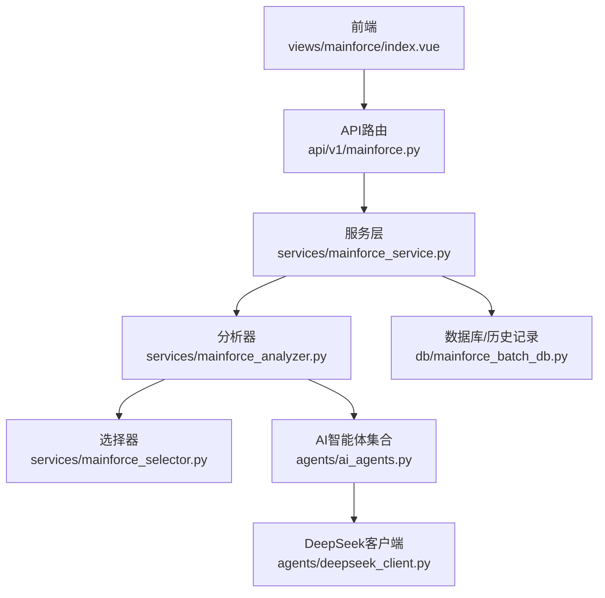
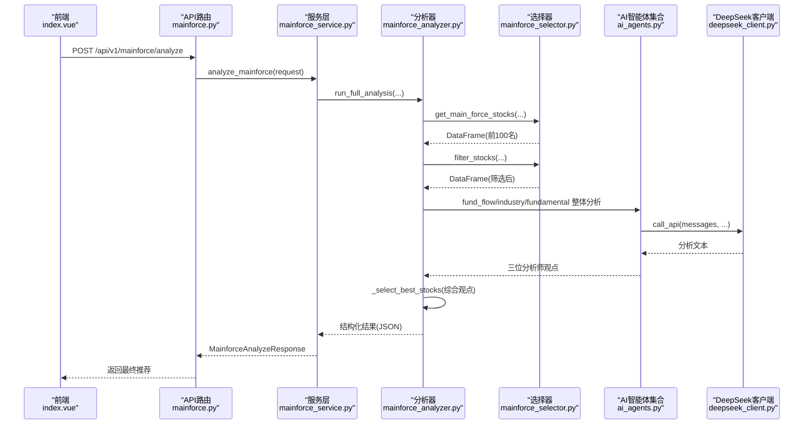
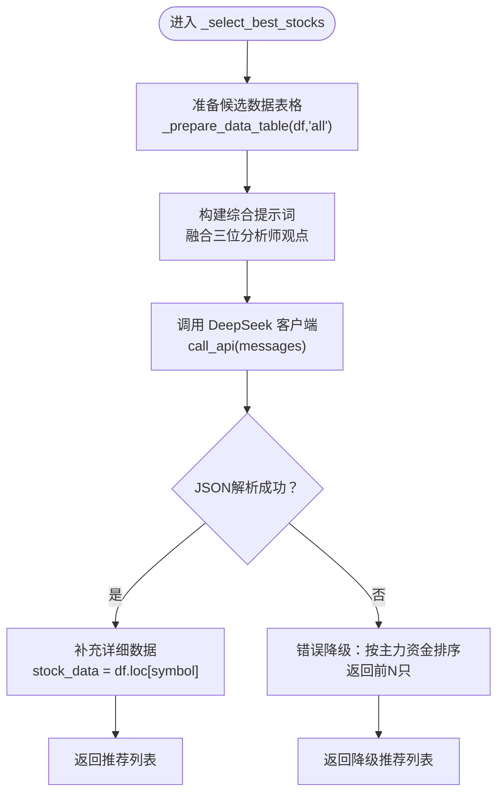
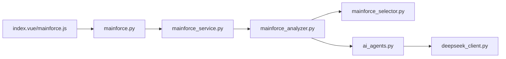

# 综合决策机制

<cite>
**本文引用的文件**
- [mainforce_analyzer.py](file://backend/app/services/mainforce_analyzer.py)
- [mainforce_selector.py](file://backend/app/services/mainforce_selector.py)
- [mainforce_service.py](file://backend/app/services/mainforce_service.py)
- [mainforce.py](file://backend/app/api/v1/mainforce.py)
- [stock.py](file://backend/app/schemas/stock.py)
- [ai_agents.py](file://backend/app/agents/ai_agents.py)
- [deepseek_client.py](file://backend/app/agents/deepseek_client.py)
- [index.vue](file://frontend/src/views/mainforce/index.vue)
- [mainforce.js](file://frontend/src/api/mainforce.js)
- [README.md](file://docs/主力选股使用指南.md)
</cite>

## 目录
1. [引言](#引言)
2. [项目结构](#项目结构)
3. [核心组件](#核心组件)
4. [架构总览](#架构总览)
5. [详细组件分析](#详细组件分析)
6. [依赖关系分析](#依赖关系分析)
7. [性能与可扩展性](#性能与可扩展性)
8. [故障排查与错误降级](#故障排查与错误降级)
9. [结论](#结论)
10. [附录](#附录)

## 引言
本文件围绕“综合决策机制”展开，重点解析后端服务中 MainForceAnalyzer 的 _select_best_stocks 方法如何融合三位分析师（资金面、行业板块、财务基本面）的观点，生成最终推荐列表。文档同时覆盖：
- JSON 格式化输出与结构化处理
- 数据补充与备选排序方案
- 综合筛选标准（主力资金、涨幅适中、行业热点、基本面良好、综合平衡）
- AI 分析结果的结构化处理与错误降级策略
- 结合实际代码路径，展示综合决策在主力选股中的关键作用

## 项目结构
后端采用 FastAPI + SQLAlchemy 架构，主力选股分析通过服务层调用分析器，再由分析器调用 AI 客户端与数据选择器，最终返回结构化结果。

图表来源
- [mainforce.py](file://backend/app/api/v1/mainforce.py#L1-L62)
- [mainforce_service.py](file://backend/app/services/mainforce_service.py#L1-L235)
- [mainforce_analyzer.py](file://backend/app/services/mainforce_analyzer.py#L1-L564)
- [mainforce_selector.py](file://backend/app/services/mainforce_selector.py#L1-L391)
- [ai_agents.py](file://backend/app/agents/ai_agents.py#L1-L546)
- [deepseek_client.py](file://backend/app/agents/deepseek_client.py#L1-L458)

章节来源
- [mainforce.py](file://backend/app/api/v1/mainforce.py#L1-L62)
- [mainforce_service.py](file://backend/app/services/mainforce_service.py#L1-L235)
- [mainforce_analyzer.py](file://backend/app/services/mainforce_analyzer.py#L1-L564)
- [mainforce_selector.py](file://backend/app/services/mainforce_selector.py#L1-L391)
- [ai_agents.py](file://backend/app/agents/ai_agents.py#L1-L546)
- [deepseek_client.py](file://backend/app/agents/deepseek_client.py#L1-L458)

## 核心组件
- 主力选股分析器：负责数据获取、筛选、整体分析与综合决策
- 选择器：从数据源获取主力资金净流入前100名股票，并按涨幅与市值进行智能筛选
- 服务层：对外提供 API，封装异步执行与历史记录
- AI 客户端：封装 DeepSeek API 调用，支持多模型与推理增强
- 前端：提供参数配置与结果展示

章节来源
- [mainforce_analyzer.py](file://backend/app/services/mainforce_analyzer.py#L1-L564)
- [mainforce_selector.py](file://backend/app/services/mainforce_selector.py#L1-L391)
- [mainforce_service.py](file://backend/app/services/mainforce_service.py#L1-L235)
- [mainforce.py](file://backend/app/api/v1/mainforce.py#L1-L62)
- [stock.py](file://backend/app/schemas/stock.py#L62-L100)

## 架构总览
综合决策的关键流程：
1. 前端发起分析请求，API 路由接收并调用服务层
2. 服务层在独立线程池中执行分析器的 run_full_analysis
3. 分析器先通过选择器获取主力资金净流入前100名股票，再进行智能筛选
4. 分析器调用三位分析师的整体分析（资金面、行业板块、财务基本面）
5. 分析器综合三位分析师观点，生成最终推荐列表（JSON 格式）
6. 服务层返回结构化响应，前端渲染展示

图表来源
- [mainforce.py](file://backend/app/api/v1/mainforce.py#L1-L62)
- [mainforce_service.py](file://backend/app/services/mainforce_service.py#L1-L235)
- [mainforce_analyzer.py](file://backend/app/services/mainforce_analyzer.py#L1-L564)
- [mainforce_selector.py](file://backend/app/services/mainforce_selector.py#L1-L391)
- [ai_agents.py](file://backend/app/agents/ai_agents.py#L1-L546)
- [deepseek_client.py](file://backend/app/agents/deepseek_client.py#L1-L458)

## 详细组件分析

### 组件A：MainForceAnalyzer._select_best_stocks 综合决策
该方法是综合决策的核心，其职责是：
- 将候选股票数据与三位分析师的整体分析结果拼接为统一提示词
- 要求AI输出严格 JSON 格式的推荐列表，包含排名、代码、名称、理由、亮点、风险、建议仓位、投资周期等字段
- 若 AI 输出解析失败，执行错误降级：按主力资金净流入排序返回前 N 只，并填充基础理由与建议

图表来源
- [mainforce_analyzer.py](file://backend/app/services/mainforce_analyzer.py#L399-L536)
- [deepseek_client.py](file://backend/app/agents/deepseek_client.py#L1-L458)

章节来源
- [mainforce_analyzer.py](file://backend/app/services/mainforce_analyzer.py#L399-L536)

### 组件B：数据准备与表格构造
- _prepare_data_table：按 focus 参数选择关键列（资金、行业、涨跌幅、基本面），限制显示前50只，避免超出 token 上限
- _prepare_overall_summary：汇总主力资金总净流入、平均净流入、涨跌幅均值与范围、行业分布等

章节来源
- [mainforce_analyzer.py](file://backend/app/services/mainforce_analyzer.py#L143-L179)
- [mainforce_analyzer.py](file://backend/app/services/mainforce_analyzer.py#L343-L397)

### 组件C：AI分析器与错误降级策略
- 三位分析师整体分析：资金面、行业板块、财务基本面，分别调用 DeepSeek 客户端生成报告
- 综合决策：将三位分析师报告与候选数据合并，要求 AI 输出结构化 JSON
- 错误降级：当 JSON 解析失败时，按主力资金净流入排序返回前 N 只，填充基础理由与建议

章节来源
- [mainforce_analyzer.py](file://backend/app/services/mainforce_analyzer.py#L181-L233)
- [mainforce_analyzer.py](file://backend/app/services/mainforce_analyzer.py#L235-L287)
- [mainforce_analyzer.py](file://backend/app/services/mainforce_analyzer.py#L289-L341)
- [mainforce_analyzer.py](file://backend/app/services/mainforce_analyzer.py#L399-L536)
- [deepseek_client.py](file://backend/app/agents/deepseek_client.py#L1-L458)

### 组件D：数据筛选与备选排序
- get_main_force_stocks：通过 pywencai 获取主力资金净流入前100名股票，支持多方案回退
- filter_stocks：按最大涨跌幅与市值范围筛选，自动识别涨跌幅与市值字段，去除 ST 股
- get_top_stocks：按主力资金净流入排序取前 N 名

章节来源
- [mainforce_selector.py](file://backend/app/services/mainforce_selector.py#L22-L114)
- [mainforce_selector.py](file://backend/app/services/mainforce_selector.py#L138-L239)
- [mainforce_selector.py](file://backend/app/services/mainforce_selector.py#L240-L282)

### 组件E：API 与服务层
- API 路由：提供 /analyze、/batch-analyze、/history 接口
- 服务层：在独立线程池中执行分析，捕获异常并返回结构化响应；批量分析支持顺序/并行模式
- 响应模型：MainforceAnalyzeResponse、MainforceBatchAnalyzeResponse

章节来源
- [mainforce.py](file://backend/app/api/v1/mainforce.py#L1-L62)
- [mainforce_service.py](file://backend/app/services/mainforce_service.py#L1-L235)
- [stock.py](file://backend/app/schemas/stock.py#L62-L100)

### 组件F：前端交互
- 前端页面：composePayload 组装参数（模型、精选数量、涨跌幅上限、市值范围、起始日期或天数）
- API 调用：analyzeMainforce 发送请求，接收并展示结果

章节来源
- [index.vue](file://frontend/src/views/mainforce/index.vue#L562-L585)
- [mainforce.js](file://frontend/src/api/mainforce.js#L1-L29)

## 依赖关系分析
- 分析器依赖选择器与 AI 客户端，AI 客户端依赖配置 settings
- 服务层依赖分析器与数据库模块（历史记录）
- API 路由依赖服务层与响应模型
- 前端依赖 API 层

图表来源
- [mainforce_service.py](file://backend/app/services/mainforce_service.py#L1-L235)
- [mainforce_analyzer.py](file://backend/app/services/mainforce_analyzer.py#L1-L564)
- [mainforce_selector.py](file://backend/app/services/mainforce_selector.py#L1-L391)
- [ai_agents.py](file://backend/app/agents/ai_agents.py#L1-L546)
- [deepseek_client.py](file://backend/app/agents/deepseek_client.py#L1-L458)
- [mainforce.py](file://backend/app/api/v1/mainforce.py#L1-L62)
- [index.vue](file://frontend/src/views/mainforce/index.vue#L562-L585)
- [mainforce.js](file://frontend/src/api/mainforce.js#L1-L29)

## 性能与可扩展性
- 异步执行：服务层使用线程池执行分析，避免阻塞 API 路由
- Token 控制：数据表格限制前50条，避免超限
- 多方案回退：数据获取与筛选具备多方案与容错
- 可扩展点：新增分析师类型可在 AI 智能体集合中扩展；模型切换通过 DeepSeek 客户端配置

章节来源
- [mainforce_service.py](file://backend/app/services/mainforce_service.py#L1-L235)
- [mainforce_analyzer.py](file://backend/app/services/mainforce_analyzer.py#L343-L397)
- [mainforce_selector.py](file://backend/app/services/mainforce_selector.py#L48-L114)
- [deepseek_client.py](file://backend/app/agents/deepseek_client.py#L1-L458)

## 故障排查与错误降级

### JSON 解析失败的错误降级
- 现象：AI 返回文本但不符合 JSON 格式
- 处理：正则提取 JSON 片段，若仍失败则按主力资金净流入排序返回前 N 只，填充基础理由与建议

章节来源
- [mainforce_analyzer.py](file://backend/app/services/mainforce_analyzer.py#L472-L536)

### 数据获取失败的多方案回退
- 现象：pywencai 查询失败
- 处理：依次尝试多个查询方案，失败后等待再试，直至成功或穷尽方案

章节来源
- [mainforce_selector.py](file://backend/app/services/mainforce_selector.py#L48-L114)

### API 调用异常
- 现象：DeepSeek API 调用失败或响应为空
- 处理：返回错误信息字符串，服务层捕获异常并返回结构化错误响应

章节来源
- [deepseek_client.py](file://backend/app/agents/deepseek_client.py#L1-L458)
- [mainforce_service.py](file://backend/app/services/mainforce_service.py#L32-L74)

## 结论
综合决策机制通过“整体分析 + 结构化输出 + 错误降级”的设计，在保证输出质量的同时提升了鲁棒性。_select_best_stocks 方法将三位分析师的宏观视角与候选数据融合，形成可执行的推荐列表；当 AI 输出不稳定时，系统自动回退到基于主力资金的稳健排序，确保用户体验与实用性。该机制在主力选股场景中起到关键作用，既满足快速筛选的需求，又兼顾了多维度综合判断。

## 附录

### 综合筛选标准（来自提示词与前端参数）
- 主力资金：主力资金净流入较多，显示机构看好
- 涨幅适中：区间涨跌幅不是很高（避免追高），还有上涨空间
- 行业热点：所属行业有发展前景，是市场热点
- 基本面良好：财务指标健康，盈利能力强
- 综合平衡：资金、行业、基本面三方面都不错

章节来源
- [mainforce_analyzer.py](file://backend/app/services/mainforce_analyzer.py#L409-L470)
- [index.vue](file://frontend/src/views/mainforce/index.vue#L562-L585)

### JSON 输出字段说明
- recommendations：推荐列表
  - rank：排名
  - symbol：股票代码
  - name：股票名称
  - reasons：核心推荐理由（资金面、行业面、基本面）
  - highlights：投资亮点
  - risks：风险提示
  - position：建议仓位
  - investment_period：投资周期
  - stock_data：补充的详细数据（来自原始 DataFrame）

章节来源
- [mainforce_analyzer.py](file://backend/app/services/mainforce_analyzer.py#L409-L470)
- [mainforce_analyzer.py](file://backend/app/services/mainforce_analyzer.py#L496-L504)

### 实战参考
- 使用指南与参数建议：参见文档“主力选股使用指南”
- 前端参数组装与调用：index.vue 与 mainforce.js

章节来源
- [README.md](file://docs/主力选股使用指南.md#L1-L283)
- [index.vue](file://frontend/src/views/mainforce/index.vue#L562-L585)
- [mainforce.js](file://frontend/src/api/mainforce.js#L1-L29)