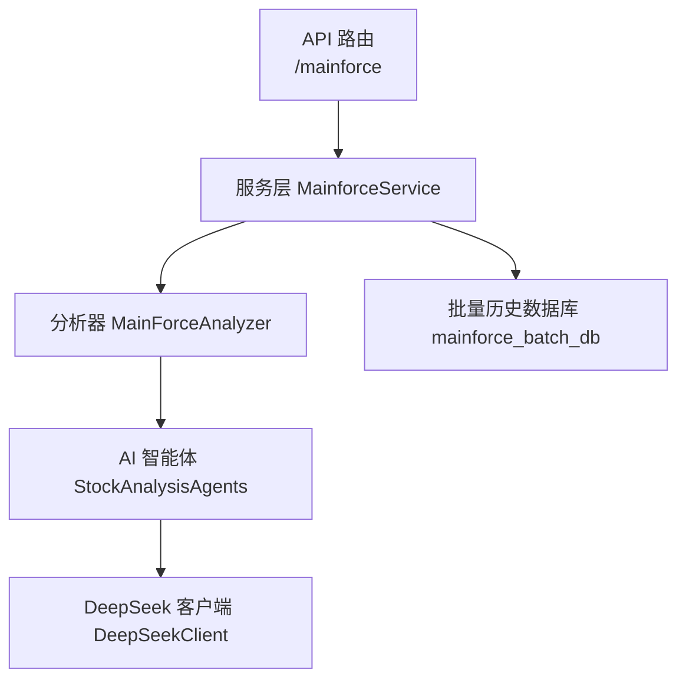
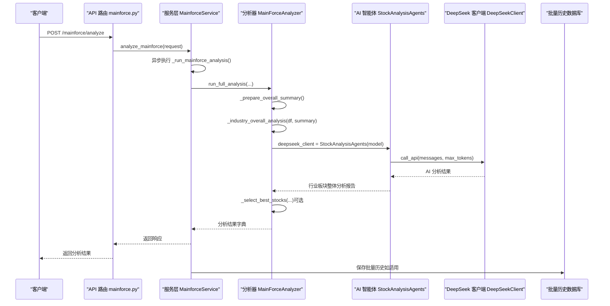
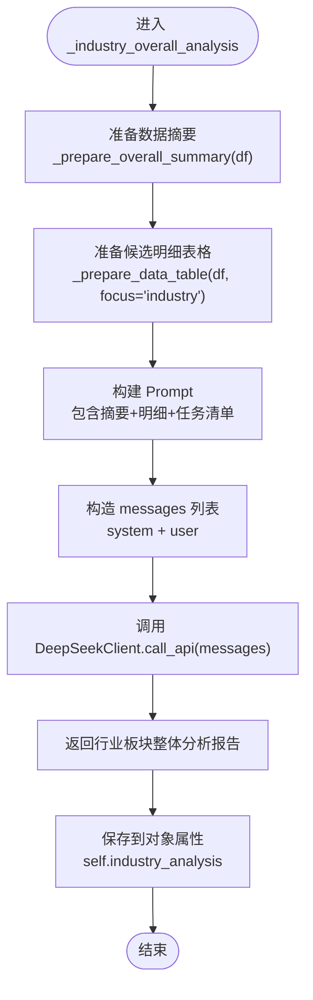
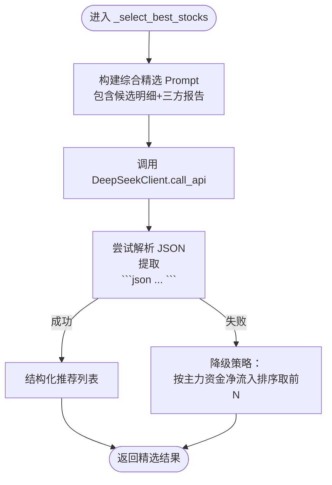
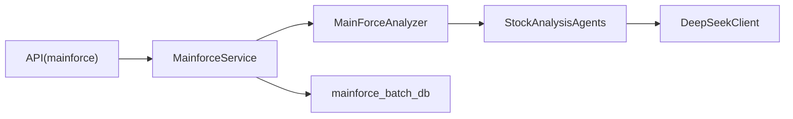

# 行业板块分析师

<cite>
**本文引用的文件**
- [backend/app/services/mainforce_analyzer.py](file://backend/app/services/mainforce_analyzer.py)
- [backend/app/agents/deepseek_client.py](file://backend/app/agents/deepseek_client.py)
- [backend/app/agents/ai_agents.py](file://backend/app/agents/ai_agents.py)
- [backend/app/api/v1/mainforce.py](file://backend/app/api/v1/mainforce.py)
- [backend/app/services/mainforce_service.py](file://backend/app/services/mainforce_service.py)
- [backend/app/schemas/stock.py](file://backend/app/schemas/stock.py)
- [backend/app/db/mainforce_batch_db.py](file://backend/app/db/mainforce_batch_db.py)
</cite>

## 目录
1. [简介](#简介)
2. [项目结构](#项目结构)
3. [核心组件](#核心组件)
4. [架构总览](#架构总览)
5. [详细组件分析](#详细组件分析)
6. [依赖关系分析](#依赖关系分析)
7. [性能考虑](#性能考虑)
8. [故障排查指南](#故障排查指南)
9. [结论](#结论)
10. [附录](#附录)

## 简介
本文围绕“行业板块分析师”在主力选股场景中的作用展开，重点解析 MainForceAnalyzer 中的 _industry_overall_analysis 方法如何构造 Prompt 并调用 DeepSeek API 进行整体分析。内容涵盖热点板块识别、板块特征分析、行业前景评估等分析任务的设计思路；阐述数据摘要生成、上下文注入、消息模板设计等关键技术；解释 AI 分析结果的结构化处理与错误降级策略；并通过实际代码路径示例，展示行业板块分析在主力选股决策中的价值与落地方式。

## 项目结构
- 后端采用 FastAPI + SQLAlchemy 架构，主力选股分析通过服务层调用分析器，再由 AI 智能体与 DeepSeek API 交互。
- 关键模块：
  - API 层：对外提供分析接口
  - 服务层：封装异步执行与历史记录
  - 分析器：执行筛选、汇总、整体分析与精选
  - AI 智能体：封装不同维度的 Prompt 与调用
  - DeepSeek 客户端：统一 OpenAI 兼容接口封装

图示来源
- [backend/app/api/v1/mainforce.py](file://backend/app/api/v1/mainforce.py#L1-L62)
- [backend/app/services/mainforce_service.py](file://backend/app/services/mainforce_service.py#L1-L235)
- [backend/app/services/mainforce_analyzer.py](file://backend/app/services/mainforce_analyzer.py#L1-L140)
- [backend/app/agents/ai_agents.py](file://backend/app/agents/ai_agents.py#L1-L120)
- [backend/app/agents/deepseek_client.py](file://backend/app/agents/deepseek_client.py#L1-L60)
- [backend/app/db/mainforce_batch_db.py](file://backend/app/db/mainforce_batch_db.py#L1-L120)

章节来源
- [backend/app/api/v1/mainforce.py](file://backend/app/api/v1/mainforce.py#L1-L62)
- [backend/app/services/mainforce_service.py](file://backend/app/services/mainforce_service.py#L1-L120)
- [backend/app/services/mainforce_analyzer.py](file://backend/app/services/mainforce_analyzer.py#L1-L120)

## 核心组件
- MainForceAnalyzer：负责从主力资金数据出发，进行整体汇总、三大维度整体分析（资金流、行业板块、基本面），并综合生成最终精选标的。
- DeepSeekClient：统一调用 DeepSeek API 的客户端，支持不同模型、推理过程与错误兜底。
- StockAnalysisAgents：封装多智能体分析流程，便于扩展不同分析师视角。
- MainforceService：FastAPI 服务层，负责异步执行与历史记录持久化。
- API 路由：对外暴露分析接口，接收请求并返回响应。

章节来源
- [backend/app/services/mainforce_analyzer.py](file://backend/app/services/mainforce_analyzer.py#L1-L140)
- [backend/app/agents/deepseek_client.py](file://backend/app/agents/deepseek_client.py#L1-L60)
- [backend/app/agents/ai_agents.py](file://backend/app/agents/ai_agents.py#L1-L60)
- [backend/app/services/mainforce_service.py](file://backend/app/services/mainforce_service.py#L1-L80)
- [backend/app/api/v1/mainforce.py](file://backend/app/api/v1/mainforce.py#L1-L40)

## 架构总览
下面的序列图展示了从 API 请求到 AI 分析与结果返回的关键流程，重点聚焦行业板块整体分析环节。

图示来源
- [backend/app/api/v1/mainforce.py](file://backend/app/api/v1/mainforce.py#L1-L62)
- [backend/app/services/mainforce_service.py](file://backend/app/services/mainforce_service.py#L1-L120)
- [backend/app/services/mainforce_analyzer.py](file://backend/app/services/mainforce_analyzer.py#L1-L140)
- [backend/app/agents/ai_agents.py](file://backend/app/agents/ai_agents.py#L1-L60)
- [backend/app/agents/deepseek_client.py](file://backend/app/agents/deepseek_client.py#L1-L60)
- [backend/app/db/mainforce_batch_db.py](file://backend/app/db/mainforce_batch_db.py#L1-L120)

## 详细组件分析

### 行业板块整体分析：_industry_overall_analysis
- 设计目标
  - 从行业热点、板块特征、行业前景、优质标的四个维度，对候选股票进行系统性行业板块整体分析。
  - 通过数据摘要与候选明细注入上下文，提升 AI 对整体行情与结构性机会的理解。
- Prompt 构造与上下文注入
  - 数据摘要：统计候选股票数量、主力资金总净流入/均值、涨跌幅均值与范围、行业分布Top N。
  - 候选明细：按 focus='industry' 选择关键列（主力资金、行业、区间涨跌幅等），限制显示前50只，避免 token 超限。
  - 任务清单：明确热点板块识别、板块特征分析、行业前景评估、优质标的推荐四类任务。
- 调用链路
  - _industry_overall_analysis -> 构造 messages -> 调用 DeepSeekClient.call_api -> 返回分析结果。
- 输出与后续
  - 将行业板块整体分析报告保存在对象属性中，供 UI 展示。
  - 若需要，可在综合精选阶段再次调用 AI，将三份报告合并输入，生成最终精选标的。

图示来源
- [backend/app/services/mainforce_analyzer.py](file://backend/app/services/mainforce_analyzer.py#L235-L287)
- [backend/app/services/mainforce_analyzer.py](file://backend/app/services/mainforce_analyzer.py#L343-L397)
- [backend/app/agents/deepseek_client.py](file://backend/app/agents/deepseek_client.py#L16-L53)

章节来源
- [backend/app/services/mainforce_analyzer.py](file://backend/app/services/mainforce_analyzer.py#L235-L287)
- [backend/app/services/mainforce_analyzer.py](file://backend/app/services/mainforce_analyzer.py#L343-L397)
- [backend/app/agents/deepseek_client.py](file://backend/app/agents/deepseek_client.py#L16-L53)

### 数据摘要生成：_prepare_overall_summary
- 统计维度
  - 候选股票总数
  - 主力资金：总净流入、平均净流入
  - 涨跌幅：平均、范围
  - 行业分布：Top N 行业数量
- 作用
  - 为行业板块整体分析提供宏观背景，帮助 AI 更准确地定位热点与风险。

章节来源
- [backend/app/services/mainforce_analyzer.py](file://backend/app/services/mainforce_analyzer.py#L143-L179)

### 数据表格准备：_prepare_data_table
- 关键列选择策略
  - 基础列：股票代码、简称
  - 资金面：主力净流入等（最多3列）
  - 行业：所属行业（最多1列）
  - 涨幅：智能匹配区间涨跌幅列
  - 基本面：市盈率、市净率、营收、净利润、评分等（最多5列）
- 截断与安全
  - 限制显示前50只，避免 token 超限
  - 去重并保持列顺序

章节来源
- [backend/app/services/mainforce_analyzer.py](file://backend/app/services/mainforce_analyzer.py#L343-L397)

### 消息模板设计与上下文注入
- 模板要素
  - system 角色：限定角色与专业背景
  - user 内容：数据摘要、候选明细、任务清单
- 注入策略
  - 将摘要与明细拼接进 Prompt，使 AI 能够在统一上下文中进行跨维度分析
  - 控制 token 数量，保证 Prompt 可靠传输

章节来源
- [backend/app/services/mainforce_analyzer.py](file://backend/app/services/mainforce_analyzer.py#L243-L275)
- [backend/app/agents/deepseek_client.py](file://backend/app/agents/deepseek_client.py#L16-L53)

### AI 分析结果的结构化处理与错误降级
- 结构化处理
  - 在综合精选阶段，要求 AI 输出 JSON，并通过正则提取 JSON 片段，再解析为结构化推荐列表。
- 错误降级
  - 若 JSON 解析失败，回退到按主力资金净流入排序的降级策略，返回前 N 名作为备选。
- 价值
  - 即便 AI 输出不稳定，也能保证流程可用，降低业务中断风险。

图示来源
- [backend/app/services/mainforce_analyzer.py](file://backend/app/services/mainforce_analyzer.py#L399-L536)
- [backend/app/agents/deepseek_client.py](file://backend/app/agents/deepseek_client.py#L16-L53)

章节来源
- [backend/app/services/mainforce_analyzer.py](file://backend/app/services/mainforce_analyzer.py#L399-L536)

### 行业板块分析在主力选股决策中的作用与价值
- 热点板块识别
  - 基于资金集中度与涨跌幅匹配度，识别当前市场最被主力关注的板块，辅助判断轮动节奏。
- 板块特征分析
  - 区分启动期（资金流入但涨幅不大）、过热期（涨幅高但资金流入减弱）等阶段，指导入场与止盈策略。
- 行业前景评估
  - 结合政策、产业面与竞争格局，评估板块长期成长性与风险点。
- 优质标的推荐
  - 在资金面、行业面、基本面三者协同下，筛选具备“性价比+成长性+确定性”的标的，提升组合胜率。

章节来源
- [backend/app/services/mainforce_analyzer.py](file://backend/app/services/mainforce_analyzer.py#L255-L273)

## 依赖关系分析
- 组件耦合
  - MainForceAnalyzer 依赖 StockAnalysisAgents 与 DeepSeekClient，形成“分析器-智能体-模型”的清晰分层。
  - API 层与服务层通过请求/响应模式解耦，便于扩展与测试。
- 外部依赖
  - DeepSeek API：统一 OpenAI 兼容接口，支持不同模型与推理过程。
  - 数据库：批量历史记录持久化，便于审计与复盘。

图示来源
- [backend/app/services/mainforce_analyzer.py](file://backend/app/services/mainforce_analyzer.py#L1-L140)
- [backend/app/agents/ai_agents.py](file://backend/app/agents/ai_agents.py#L1-L60)
- [backend/app/agents/deepseek_client.py](file://backend/app/agents/deepseek_client.py#L1-L60)
- [backend/app/api/v1/mainforce.py](file://backend/app/api/v1/mainforce.py#L1-L62)
- [backend/app/services/mainforce_service.py](file://backend/app/services/mainforce_service.py#L1-L120)
- [backend/app/db/mainforce_batch_db.py](file://backend/app/db/mainforce_batch_db.py#L1-L120)

章节来源
- [backend/app/services/mainforce_analyzer.py](file://backend/app/services/mainforce_analyzer.py#L1-L140)
- [backend/app/agents/ai_agents.py](file://backend/app/agents/ai_agents.py#L1-L120)
- [backend/app/agents/deepseek_client.py](file://backend/app/agents/deepseek_client.py#L1-L60)
- [backend/app/api/v1/mainforce.py](file://backend/app/api/v1/mainforce.py#L1-L62)
- [backend/app/services/mainforce_service.py](file://backend/app/services/mainforce_service.py#L1-L120)
- [backend/app/db/mainforce_batch_db.py](file://backend/app/db/mainforce_batch_db.py#L1-L120)

## 性能考虑
- Token 控制
  - 通过限制候选明细显示数量与关键列数量，避免 Prompt 过长导致调用失败或延迟。
- 异步执行
  - 服务层使用线程池异步执行分析，提高吞吐与用户体验。
- 模型选择
  - DeepSeekClient 支持不同模型与 max_tokens 自适应，针对推理型模型自动扩容，兼顾准确性与成本。

章节来源
- [backend/app/services/mainforce_analyzer.py](file://backend/app/services/mainforce_analyzer.py#L343-L397)
- [backend/app/services/mainforce_service.py](file://backend/app/services/mainforce_service.py#L1-L120)
- [backend/app/agents/deepseek_client.py](file://backend/app/agents/deepseek_client.py#L16-L53)

## 故障排查指南
- API 调用失败
  - 检查 DEEPSEEK_API_KEY 与 DEEPSEEK_BASE_URL 配置是否正确。
  - 查看 DeepSeekClient 的异常返回，确认网络连通与配额状态。
- JSON 解析失败
  - 检查 Prompt 中是否严格要求 JSON 输出格式。
  - 若 AI 输出不稳定，启用降级策略（按主力资金排序）。
- 数据列缺失
  - 若涨跌幅列或行业列不存在，_prepare_data_table 会自动跳过或选择替代列，确保流程稳定。
- 响应过大
  - 适当减少显示的候选数量或关键列数量，避免 token 超限。

章节来源
- [backend/app/agents/deepseek_client.py](file://backend/app/agents/deepseek_client.py#L16-L53)
- [backend/app/services/mainforce_analyzer.py](file://backend/app/services/mainforce_analyzer.py#L343-L397)
- [backend/app/services/mainforce_analyzer.py](file://backend/app/services/mainforce_analyzer.py#L399-L536)

## 结论
- 行业板块整体分析通过“数据摘要+候选明细+任务清单”的 Prompt 设计，将宏观背景与微观数据有效注入 AI，显著提升了热点识别、板块特征与前景评估的准确性。
- 通过结构化输出与错误降级策略，系统在面对 AI 输出不稳定时仍能维持稳健运行，保障主力选股流程的连续性。
- 在主力选股决策中，行业板块分析与资金流、基本面分析协同，有助于筛选出具备“确定性+性价比+成长性”的优质标的，提升组合质量与胜率。

## 附录
- API 请求/响应模型
  - 请求模型：MainforceAnalyzeRequest
  - 响应模型：MainforceAnalyzeResponse
- 历史记录
  - 服务层支持批量分析历史记录保存与查询，便于审计与复盘。

章节来源
- [backend/app/schemas/stock.py](file://backend/app/schemas/stock.py#L62-L100)
- [backend/app/services/mainforce_service.py](file://backend/app/services/mainforce_service.py#L186-L235)