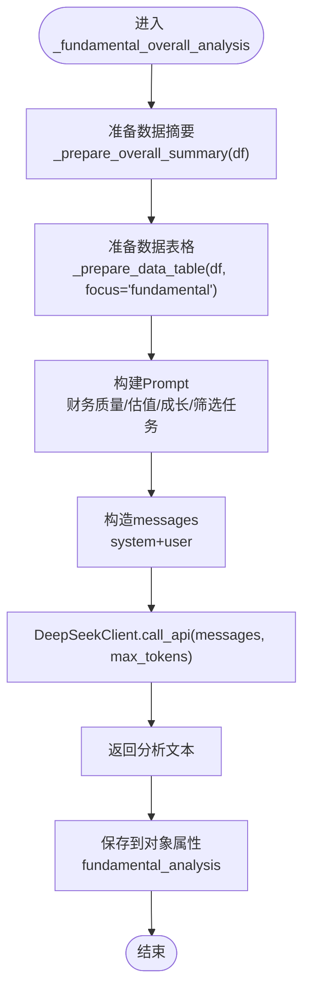

# 财务基本面分析师

<cite>
**本文引用的文件**
- [mainforce_analyzer.py](file://backend/app/services/mainforce_analyzer.py)
- [deepseek_client.py](file://backend/app/agents/deepseek_client.py)
- [ai_agents.py](file://backend/app/agents/ai_agents.py)
- [mainforce_service.py](file://backend/app/services/mainforce_service.py)
- [mainforce_selector.py](file://backend/app/services/mainforce_selector.py)
- [mainforce.py](file://backend/app/api/v1/mainforce.py)
- [stock.py](file://backend/app/schemas/stock.py)
</cite>

## 目录
1. [引言](#引言)
2. [项目结构](#项目结构)
3. [核心组件](#核心组件)
4. [架构总览](#架构总览)
5. [详细组件分析](#详细组件分析)
6. [依赖关系分析](#依赖关系分析)
7. [性能考虑](#性能考虑)
8. [故障排查指南](#故障排查指南)
9. [结论](#结论)
10. [附录](#附录)

## 引言
本文件面向“财务基本面分析师”的实现与使用，围绕 MainForceAnalyzer 中 _fundamental_overall_analysis 方法如何构造 Prompt 并调用 DeepSeek API 进行整体分析展开，系统阐述财务质量评估、估值水平分析、成长性评估等分析任务的设计思路；同时详解数据摘要生成、上下文注入、消息模板设计等关键技术，以及 AI 分析结果的结构化处理与错误降级策略。最后结合实际代码示例，展示财务基本面分析在主力选股决策中的作用与价值。

## 项目结构
本项目采用前后端分离架构，主力选股分析通过后端 FastAPI 路由触发，服务层调用分析器，分析器内部使用 AI 智能体与 DeepSeek API 完成多维度分析。财务基本面分析属于“整体分析”阶段的一部分，与其他分析（资金面、行业板块）并行产出报告，最终由综合决策模块进行优选。


图示来源
- [mainforce.py](file://backend/app/api/v1/mainforce.py#L1-L62)
- [mainforce_service.py](file://backend/app/services/mainforce_service.py#L32-L74)
- [mainforce_analyzer.py](file://backend/app/services/mainforce_analyzer.py#L29-L141)
- [mainforce_selector.py](file://backend/app/services/mainforce_selector.py#L22-L114)
- [ai_agents.py](file://backend/app/agents/ai_agents.py#L1-L30)
- [deepseek_client.py](file://backend/app/agents/deepseek_client.py#L1-L36)

章节来源
- [mainforce.py](file://backend/app/api/v1/mainforce.py#L1-L62)
- [mainforce_service.py](file://backend/app/services/mainforce_service.py#L32-L74)
- [mainforce_analyzer.py](file://backend/app/services/mainforce_analyzer.py#L29-L141)
- [mainforce_selector.py](file://backend/app/services/mainforce_selector.py#L22-L114)
- [ai_agents.py](file://backend/app/agents/ai_agents.py#L1-L30)
- [deepseek_client.py](file://backend/app/agents/deepseek_client.py#L1-L36)

## 核心组件
- MainForceAnalyzer：负责整体批量分析流程，包括数据摘要生成、三大分析师整体分析（资金面、行业板块、财务基本面）、综合决策与最终推荐。
- DeepSeekClient：封装 OpenAI 兼容客户端，统一调用 DeepSeek API，支持不同模型与推理过程输出。
- StockAnalysisAgents：多智能体集合，分别负责技术面、基本面、资金面、风险管理、市场情绪、新闻等分析。
- MainForceStockSelector：从问财数据源获取主力资金净流入前100名股票，并进行涨跌幅与市值的智能筛选。
- MainforceService：FastAPI 路由的服务层实现，负责异步调度与结果封装。
- 请求/响应模型：MainforceAnalyzeRequest/MainforceAnalyzeResponse 等，约束输入参数与输出结构。

章节来源
- [mainforce_analyzer.py](file://backend/app/services/mainforce_analyzer.py#L17-L564)
- [deepseek_client.py](file://backend/app/agents/deepseek_client.py#L1-L53)
- [ai_agents.py](file://backend/app/agents/ai_agents.py#L1-L120)
- [mainforce_selector.py](file://backend/app/services/mainforce_selector.py#L1-L391)
- [mainforce_service.py](file://backend/app/services/mainforce_service.py#L32-L105)
- [stock.py](file://backend/app/schemas/stock.py#L62-L100)

## 架构总览
财务基本面分析在整体分析流程中的位置如下：


图示来源
- [mainforce.py](file://backend/app/api/v1/mainforce.py#L20-L33)
- [mainforce_service.py](file://backend/app/services/mainforce_service.py#L32-L74)
- [mainforce_analyzer.py](file://backend/app/services/mainforce_analyzer.py#L29-L141)
- [mainforce_selector.py](file://backend/app/services/mainforce_selector.py#L22-L114)
- [ai_agents.py](file://backend/app/agents/ai_agents.py#L407-L468)
- [deepseek_client.py](file://backend/app/agents/deepseek_client.py#L16-L36)

## 详细组件分析

### 财务基本面分析师：_fundamental_overall_analysis 的 Prompt 构造与调用流程
- Prompt 设计要点
  - 整体数据摘要：包含候选股票总数、主力资金总净流入/平均净流入、区间涨跌幅均值与范围、行业分布等，帮助模型建立全局视角。
  - 候选股票明细：通过_prepare_data_table 仅保留关键字段（股票代码/简称、主力资金、区间涨跌幅、市盈率/市净率、营收/净利润、评分等），并限制显示前50只，避免超出 token 上限。
  - 分析任务清单：明确财务质量评估、估值水平分析、成长性评估、优质标的筛选四大任务，引导模型聚焦关键指标与结论。
- 调用链路
  - _fundamental_overall_analysis 构造 messages（system + user），调用 deepseek_client.call_api，返回分析文本。
  - DeepSeekClient 基于 settings.DEEPSEEK_API_KEY 与 DEEPSEEK_BASE_URL 初始化 OpenAI 兼容客户端，按需提升 max_tokens，捕获异常并返回错误信息。
- 输出与后续处理
  - 财务基本面报告文本保存在对象属性中，供 UI 展示。
  - 综合决策阶段，_select_best_stocks 再次汇总三大报告，要求模型输出 JSON 格式的最终推荐列表；若解析失败，进入降级方案（按主力资金排序返回前 N）。



图示来源
- [mainforce_analyzer.py](file://backend/app/services/mainforce_analyzer.py#L143-L179)
- [mainforce_analyzer.py](file://backend/app/services/mainforce_analyzer.py#L343-L397)
- [mainforce_analyzer.py](file://backend/app/services/mainforce_analyzer.py#L289-L341)
- [deepseek_client.py](file://backend/app/agents/deepseek_client.py#L16-L36)

章节来源
- [mainforce_analyzer.py](file://backend/app/services/mainforce_analyzer.py#L143-L179)
- [mainforce_analyzer.py](file://backend/app/services/mainforce_analyzer.py#L289-L341)
- [mainforce_analyzer.py](file://backend/app/services/mainforce_analyzer.py#L343-L397)
- [deepseek_client.py](file://backend/app/agents/deepseek_client.py#L16-L36)

### 数据摘要生成与上下文注入
- 数据摘要生成
  - _prepare_overall_summary(df) 自动识别主力资金列、涨跌幅列、行业列，计算总量/均值、范围、Top 行业分布，形成简洁明了的全局概览。
- 上下文注入
  - _prepare_data_table(df, focus='fundamental') 智能匹配主力资金、区间涨跌幅、市盈率/市净率、营收/净利润、评分等列，限定显示前50只，避免 token 超限。
- Prompt 注入
  - 将摘要与表格拼接到 Prompt 中，使模型在回答时具备充分上下文，减少外部查询需求。

章节来源
- [mainforce_analyzer.py](file://backend/app/services/mainforce_analyzer.py#L143-L179)
- [mainforce_analyzer.py](file://backend/app/services/mainforce_analyzer.py#L343-L397)

### 消息模板设计与调用规范
- 模板结构
  - system 角色：设定“财务基本面分析专家”的身份与职责，强调从财务角度评估投资价值。
  - user 角色：包含整体摘要、候选股票明细、分析任务清单，明确输出要求（如推荐数量、理由、亮点、风险、仓位、周期等）。
- 调用规范
  - DeepSeekClient.call_api 支持自定义 model、temperature、max_tokens；对 reasoner 类模型自动提高 max_tokens。
  - 返回文本可能包含推理过程与最终答案，调用方按需拼接。

章节来源
- [mainforce_analyzer.py](file://backend/app/services/mainforce_analyzer.py#L289-L341)
- [deepseek_client.py](file://backend/app/agents/deepseek_client.py#L16-L36)

### AI 分析结果的结构化处理与错误降级策略
- 结构化处理
  - 综合决策阶段，_select_best_stocks 构造包含三大分析师报告的 Prompt，要求模型输出 JSON 格式的推荐列表（包含 rank、symbol、name、reasons、highlights、risks、position、investment_period 等字段）。
  - 解析 JSON：优先正则提取 ```json ... ```，否则尝试直接解析；解析失败则进入降级方案。
- 错误降级策略
  - 降级方案：按主力资金净流入排序返回前 N 只，填充 reasons、highlights、risks、position、investment_period 等字段，保证输出可用性。
  - 异常捕获：捕获 JSON 解析异常与 API 调用异常，记录错误并返回兜底结果。


图示来源
- [mainforce_analyzer.py](file://backend/app/services/mainforce_analyzer.py#L399-L536)
- [deepseek_client.py](file://backend/app/agents/deepseek_client.py#L16-L36)

章节来源
- [mainforce_analyzer.py](file://backend/app/services/mainforce_analyzer.py#L399-L536)
- [deepseek_client.py](file://backend/app/agents/deepseek_client.py#L16-L36)

### 财务质量评估、估值水平分析、成长性评估的设计思路
- 财务质量评估
  - 关注盈利能力（ROE/ROA/毛利率/净利率）、偿债能力（资产负债率/流动比率/速动比率）、运营能力（存货/应收账款周转率/总资产周转率）、现金流质量与财务风险识别。
  - 在 Prompt 中明确“财务指标健康度如何”“是否存在财务风险较大的股票”等任务项，引导模型聚焦关键指标与趋势。
- 估值水平分析
  - 市盈率、市净率的整体分布，合理估值区间判断，高估值是否具备业绩支撑。
  - 在 Prompt 中明确“估值合理且有成长空间”“高估值是否有业绩支撑”等任务项。
- 成长性评估
  - 营收、净利润增长趋势，成长能力评分，结合季报趋势进行预判。
  - 在 Prompt 中明确“成长性最好”“成长能力评分较高”等任务项。

章节来源
- [mainforce_analyzer.py](file://backend/app/services/mainforce_analyzer.py#L289-L341)

### 在主力选股决策中的作用与价值
- 数据来源与筛选
  - 通过问财获取主力资金净流入前100名股票，再按区间涨跌幅与市值进行智能筛选，缩小候选范围。
- 多维度协同
  - 资金面（主力资金流入特征与持续性）、行业板块（热点识别与轮动）、财务基本面（质量、估值、成长）三者互补，降低单一维度的误判风险。
- 决策输出
  - 综合三份报告，输出结构化推荐列表，包含核心理由、投资亮点、风险提示、建议仓位与投资周期，便于用户快速决策与执行。

章节来源
- [mainforce_selector.py](file://backend/app/services/mainforce_selector.py#L22-L114)
- [mainforce_analyzer.py](file://backend/app/services/mainforce_analyzer.py#L29-L141)
- [mainforce_analyzer.py](file://backend/app/services/mainforce_analyzer.py#L399-L536)

## 依赖关系分析
- 组件耦合
  - MainForceAnalyzer 依赖 MainForceStockSelector（数据获取与筛选）、StockAnalysisAgents（AI 智能体集合）、DeepSeekClient（API 调用）。
  - MainforceService 依赖 MainForceAnalyzer，负责异步调度与结果封装。
- 外部依赖
  - DeepSeek API（OpenAI 兼容），通过 settings.DEEPSEEK_API_KEY 与 DEEPSEEK_BASE_URL 配置。
  - 问财数据源（pywencai）用于主力资金数据获取。
- 循环依赖
  - 未发现循环依赖；模块职责清晰，调用方向单向。


图示来源
- [mainforce_service.py](file://backend/app/services/mainforce_service.py#L32-L74)
- [mainforce_analyzer.py](file://backend/app/services/mainforce_analyzer.py#L29-L141)
- [ai_agents.py](file://backend/app/agents/ai_agents.py#L1-L30)
- [deepseek_client.py](file://backend/app/agents/deepseek_client.py#L1-L36)
- [mainforce.py](file://backend/app/api/v1/mainforce.py#L1-L62)

章节来源
- [mainforce_service.py](file://backend/app/services/mainforce_service.py#L32-L74)
- [mainforce_analyzer.py](file://backend/app/services/mainforce_analyzer.py#L29-L141)
- [ai_agents.py](file://backend/app/agents/ai_agents.py#L1-L30)
- [deepseek_client.py](file://backend/app/agents/deepseek_client.py#L1-L36)
- [mainforce.py](file://backend/app/api/v1/mainforce.py#L1-L62)

## 性能考虑
- Token 控制
  - _prepare_data_table 限制显示前50只股票与关键字段，避免超限；必要时降低 max_tokens 或分批处理。
- API 调用优化
  - DeepSeekClient 对 reasoner 模型自动提高 max_tokens；合理设置 temperature 与 max_tokens，平衡准确性与速度。
- 并发与异步
  - MainforceService 使用 asyncio.to_thread 与 ThreadPoolExecutor 并行执行批量分析，缩短整体耗时。
- 数据清洗与缓存
  - 对数值字段进行类型转换与单位统一（如市值单位），减少模型解析负担；对重复数据进行去重与缓存。

[本节为通用指导，不直接分析具体文件]

## 故障排查指南
- API 配置问题
  - 确认 DEEPSEEK_API_KEY 与 DEEPSEEK_BASE_URL 已正确设置；检查网络连通性与速率限制。
- 数据获取失败
  - 问财查询失败时会尝试多种方案；若仍失败，检查日期格式、参数范围与网络状态。
- JSON 解析失败
  - 若模型输出非严格 JSON，先尝试正则提取 ```json ... ```，否则进入降级方案（按主力资金排序返回前 N）。
- 异常日志
  - MainforceService 与 DeepSeekClient 均有异常捕获与日志记录，便于定位问题。

章节来源
- [deepseek_client.py](file://backend/app/agents/deepseek_client.py#L16-L36)
- [mainforce_service.py](file://backend/app/services/mainforce_service.py#L32-L74)
- [mainforce_analyzer.py](file://backend/app/services/mainforce_analyzer.py#L399-L536)

## 结论
财务基本面分析师通过“整体分析 + 多智能体协同 + 结构化输出 + 错误降级”的设计，在主力选股决策中提供了高质量、可解释、可落地的财务视角。其 Prompt 构造与上下文注入策略确保模型在有限 token 下获得充分信息；综合决策模块将三份报告整合为结构化推荐，显著提升了决策效率与成功率。

[本节为总结性内容，不直接分析具体文件]

## 附录
- 请求/响应模型
  - MainforceAnalyzeRequest：包含 start_date、days_ago、final_n、max_range_change、min_market_cap、max_market_cap、model 等参数。
  - MainforceAnalyzeResponse：包含 success、total_stocks、filtered_stocks、final_recommendations、params、error 等字段。
- API 路由
  - POST /api/v1/mainforce/analyze：发起主力选股分析。
  - POST /api/v1/mainforce/batch-analyze：批量分析。
  - GET /api/v1/mainforce/history：获取历史记录。

章节来源
- [stock.py](file://backend/app/schemas/stock.py#L62-L100)
- [mainforce.py](file://backend/app/api/v1/mainforce.py#L20-L61)