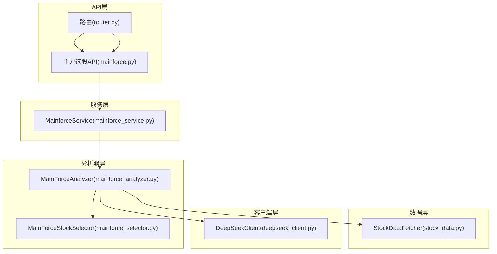
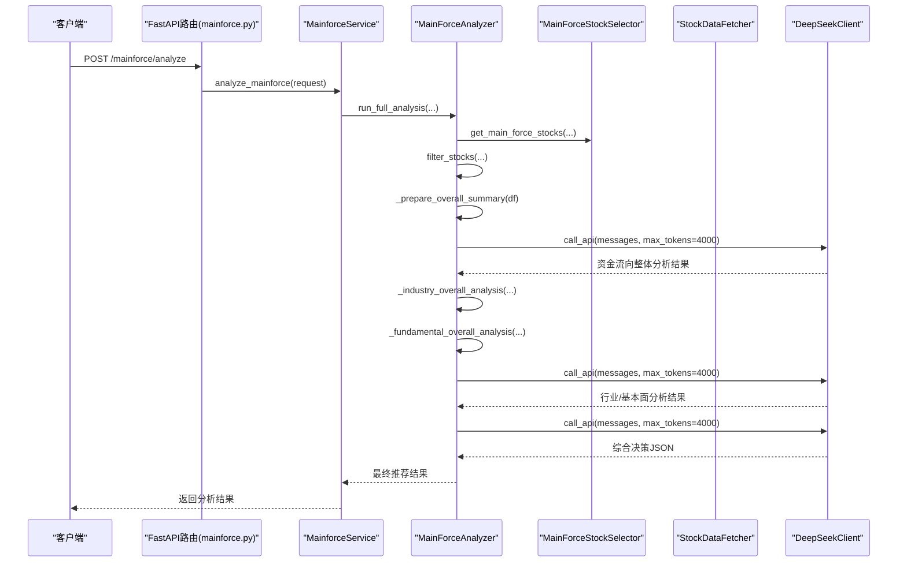
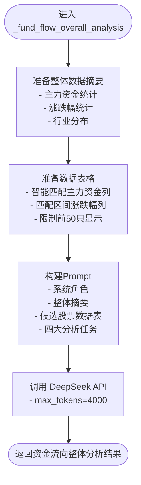
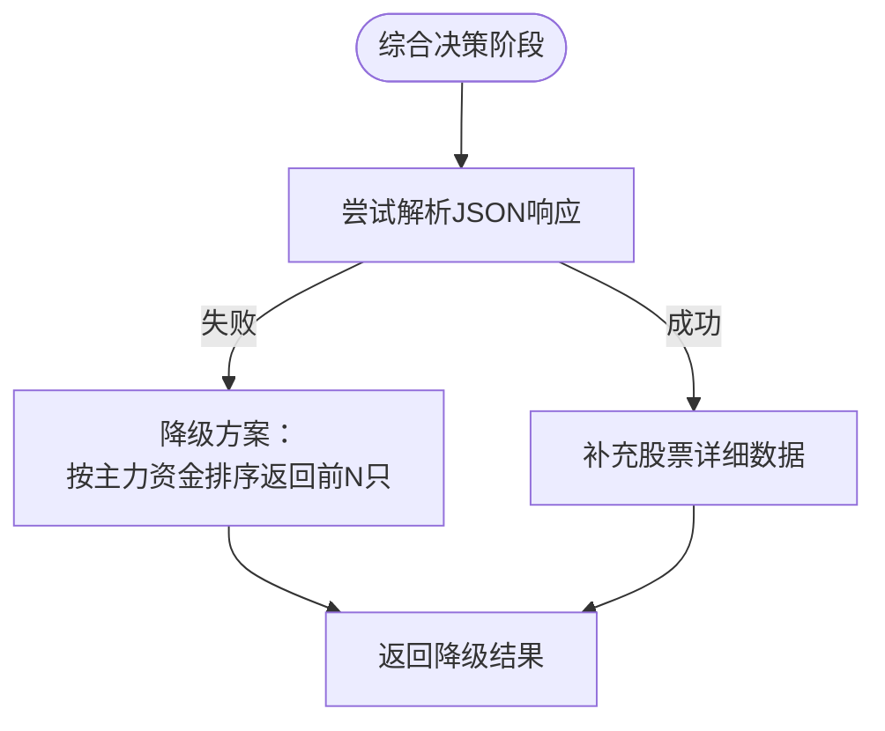
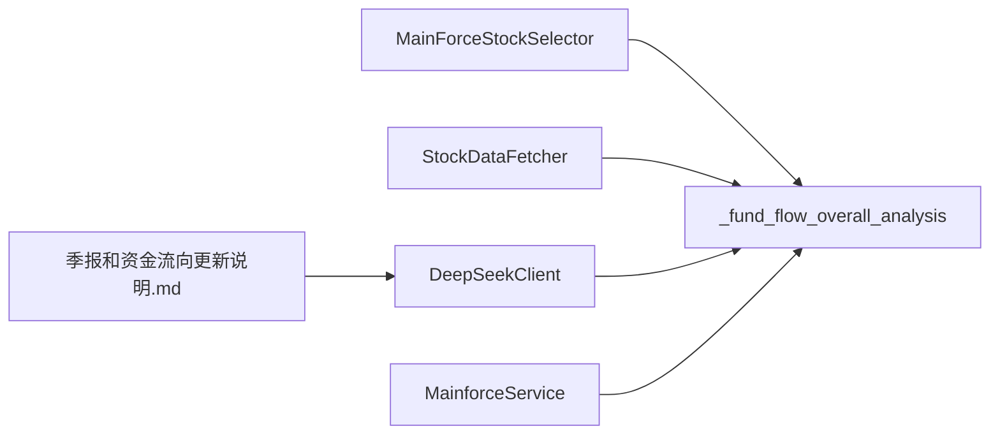

# 资金流向分析师

<cite>
**本文引用的文件**
- [mainforce_analyzer.py](file://backend/app/services/mainforce_analyzer.py)
- [deepseek_client.py](file://backend/app/agents/deepseek_client.py)
- [mainforce_selector.py](file://backend/app/services/mainforce_selector.py)
- [stock_data.py](file://backend/app/data/stock_data.py)
- [mainforce_service.py](file://backend/app/services/mainforce_service.py)
- [mainforce.py](file://backend/app/api/v1/mainforce.py)
- [router.py](file://backend/app/api/v1/router.py)
- [季报和资金流向更新说明.md](file://docs/季报和资金流向更新说明.md)
- [主力选股功能说明.md](file://docs/主力选股功能说明.md)
- [主力选股使用指南.md](file://docs/主力选股使用指南.md)
</cite>

## 目录
1. [简介](#简介)
2. [项目结构](#项目结构)
3. [核心组件](#核心组件)
4. [架构总览](#架构总览)
5. [详细组件分析](#详细组件分析)
6. [依赖关系分析](#依赖关系分析)
7. [性能考虑](#性能考虑)
8. [故障排查指南](#故障排查指南)
9. [结论](#结论)
10. [附录](#附录)

## 简介
本文件面向资金流向分析师角色，围绕“整体分析”视角，系统梳理 MainForceAnalyzer 中 _fund_flow_overall_analysis 方法如何构造 Prompt 并调用 DeepSeek API 进行整体分析。文档重点解释：
- 资金流向特征、优质标的识别、板块热点判断等分析任务的设计思路
- 数据摘要生成、上下文注入、消息模板设计等关键技术
- AI 分析结果的结构化处理与错误降级策略
- 结合实际代码路径，展示资金流向分析在主力选股决策中的作用和价值

## 项目结构
该功能位于后端服务层，采用“服务-分析器-客户端”的分层设计：
- API 层：提供 /mainforce 接口，接收请求并委派至服务层
- 服务层：MainforceService 封装异步执行与历史记录
- 分析器层：MainForceAnalyzer 负责数据获取、筛选、整体分析与综合决策
- 数据层：StockDataFetcher 提供基础数据与技术指标
- 客户端层：DeepSeekClient 封装 OpenAI 风格的调用接口，负责 Prompt 构造与 API 调用



图表来源
- [router.py](file://backend/app/api/v1/router.py#L1-L36)
- [mainforce.py](file://backend/app/api/v1/mainforce.py#L1-L62)
- [mainforce_service.py](file://backend/app/services/mainforce_service.py#L1-L235)
- [mainforce_analyzer.py](file://backend/app/services/mainforce_analyzer.py#L1-L564)
- [mainforce_selector.py](file://backend/app/services/mainforce_selector.py#L1-L391)
- [stock_data.py](file://backend/app/data/stock_data.py#L1-L318)
- [deepseek_client.py](file://backend/app/agents/deepseek_client.py#L1-L458)

章节来源
- [router.py](file://backend/app/api/v1/router.py#L1-L36)
- [mainforce.py](file://backend/app/api/v1/mainforce.py#L1-L62)
- [mainforce_service.py](file://backend/app/services/mainforce_service.py#L1-L235)
- [mainforce_analyzer.py](file://backend/app/services/mainforce_analyzer.py#L1-L564)
- [mainforce_selector.py](file://backend/app/services/mainforce_selector.py#L1-L391)
- [stock_data.py](file://backend/app/data/stock_data.py#L1-L318)
- [deepseek_client.py](file://backend/app/agents/deepseek_client.py#L1-L458)

## 核心组件
- MainForceAnalyzer：负责从筛选后的候选池出发，进行整体资金流向分析、行业板块分析、基本面分析，并综合生成最终推荐
- DeepSeekClient：封装 DeepSeek API 调用，支持不同模型与最大 token 控制，提供资金面分析专用 Prompt 模板
- MainForceStockSelector：从问财获取主力资金净流入前100名股票，执行涨跌幅与市值过滤
- StockDataFetcher：提供股票基本信息、历史数据、技术指标与实时行情等基础数据
- MainforceService：FastAPI 服务层，负责异步调度与历史记录持久化

章节来源
- [mainforce_analyzer.py](file://backend/app/services/mainforce_analyzer.py#L1-L564)
- [deepseek_client.py](file://backend/app/agents/deepseek_client.py#L1-L458)
- [mainforce_selector.py](file://backend/app/services/mainforce_selector.py#L1-L391)
- [stock_data.py](file://backend/app/data/stock_data.py#L1-L318)
- [mainforce_service.py](file://backend/app/services/mainforce_service.py#L1-L235)

## 架构总览
整体流程：API 接口 -> 服务层 -> 分析器 -> 选择器/数据/客户端
- API 层注册 /mainforce 路由，提供分析与批量分析接口
- 服务层异步执行分析，调用分析器并返回结构化结果
- 分析器执行四步流程：数据获取与筛选 -> 整体分析（资金/行业/基本面）-> 综合决策 -> 输出推荐
- 客户端负责构造 Prompt 并调用 DeepSeek API，返回文本结果



图表来源
- [mainforce.py](file://backend/app/api/v1/mainforce.py#L1-L62)
- [mainforce_service.py](file://backend/app/services/mainforce_service.py#L1-L235)
- [mainforce_analyzer.py](file://backend/app/services/mainforce_analyzer.py#L1-L564)
- [mainforce_selector.py](file://backend/app/services/mainforce_selector.py#L1-L391)
- [deepseek_client.py](file://backend/app/agents/deepseek_client.py#L1-L458)

## 详细组件分析

### _fund_flow_overall_analysis 方法：Prompt 构造与整体分析
- 数据摘要生成：从筛选后的 DataFrame 中提取主力资金总净流入、平均净流入、涨跌幅均值与范围、行业分布等摘要信息，作为上下文注入
- 数据表格准备：根据 focus='fund_flow'，智能匹配主力资金相关列（如主力净流入、区间主力资金净流入等），以及区间涨跌幅列，限制显示前50只股票，避免 token 超限
- Prompt 模板设计：
  - 系统角色：资金面分析专家，擅长从整体资金流向中发现投资机会
  - 用户内容：包含整体摘要、候选股票数据表、四大分析任务（资金流向特征、优质标的识别、板块热点判断、投资建议）
- API 调用：通过 DeepSeekClient.call_api(messages, max_tokens=4000) 调用 DeepSeek 模型，返回资金流向整体分析文本



图表来源
- [mainforce_analyzer.py](file://backend/app/services/mainforce_analyzer.py#L143-L234)

章节来源
- [mainforce_analyzer.py](file://backend/app/services/mainforce_analyzer.py#L143-L234)

### 资金流向特征、优质标的识别、板块热点判断的设计思路
- 资金流向特征：强调“整体视角”，从候选池中识别主力资金流入最集中的板块/行业，评估主力行为特征（大规模建仓/试探性进场/板块轮动），并结合涨跌幅配合度进行趋势判断
- 优质标的识别：从资金面角度，优先关注主力资金流入大但涨幅不高的潜力股，以及资金持续流入且趋势明确的股票；同时结合行业与基本面进行交叉验证
- 板块热点判断：识别当前资金最看好的板块，判断是否存在板块轮动迹象，区分新兴热点与传统强势板块，为后续投资建议提供依据

章节来源
- [mainforce_analyzer.py](file://backend/app/services/mainforce_analyzer.py#L181-L234)
- [主力选股功能说明.md](file://docs/主力选股功能说明.md#L1-L63)
- [主力选股使用指南.md](file://docs/主力选股使用指南.md#L1-L55)

### 数据摘要生成、上下文注入与消息模板设计
- 数据摘要生成：通过 _prepare_overall_summary 自动识别主力资金列与涨跌幅列，计算统计指标并生成摘要文本，确保 Prompt 中包含关键统计信息
- 上下文注入：将摘要与候选股票数据表拼接到 Prompt 中，使模型在整体层面进行分析，而非逐个股票分析
- 消息模板设计：采用“系统角色 + 用户内容”的标准 OpenAI 消息结构，保证模型角色定位清晰，输出更具专业性

章节来源
- [mainforce_analyzer.py](file://backend/app/services/mainforce_analyzer.py#L143-L179)
- [mainforce_analyzer.py](file://backend/app/services/mainforce_analyzer.py#L181-L234)

### AI 分析结果的结构化处理与错误降级策略
- 结构化输出：在综合决策阶段，要求模型输出 JSON 格式的推荐列表，包含 rank、symbol、name、reasons、highlights、risks、position、investment_period 等字段
- JSON 解析与降级：
  - 首先尝试提取 ```json ... ``` 内容并解析
  - 若失败，回退到按主力资金净流入排序的降级方案，返回前 N 个候选并填充必要字段
- API 调用异常处理：DeepSeekClient 在调用失败时返回错误信息，上层捕获并返回统一错误响应



图表来源
- [mainforce_analyzer.py](file://backend/app/services/mainforce_analyzer.py#L472-L537)
- [deepseek_client.py](file://backend/app/agents/deepseek_client.py#L16-L53)

章节来源
- [mainforce_analyzer.py](file://backend/app/services/mainforce_analyzer.py#L472-L537)
- [deepseek_client.py](file://backend/app/agents/deepseek_client.py#L16-L53)

### 资金流向分析在主力选股决策中的作用与价值
- 价值定位：在“整体批量分析”模式下，资金流向分析师从候选池整体视角出发，识别板块集中度与主力行为特征，为资深研究员综合决策提供输入
- 与行业/基本面分析协同：资金流向特征与行业前景、财务质量共同构成“三维分析”，提升推荐的稳健性与可执行性
- 实战意义：帮助决策者在主力资金净流入较多的前提下，进一步筛选具备“资金面+行业+基本面”三要素的优质标的，降低追高与踩雷风险

章节来源
- [主力选股功能说明.md](file://docs/主力选股功能说明.md#L1-L63)
- [主力选股使用指南.md](file://docs/主力选股使用指南.md#L1-L55)

## 依赖关系分析
- 分析器依赖选择器与数据获取器：先通过 selector 获取候选池，再由 fetcher 提供基础数据与技术指标
- 分析器依赖客户端：通过 deepseek_client 调用模型 API，构造资金面分析 Prompt
- 服务层依赖分析器：在 FastAPI 路由中异步调度分析器执行完整流程
- 文档与配置：资金流向数据示例与说明文档为 Prompt 构造提供参考



图表来源
- [mainforce_selector.py](file://backend/app/services/mainforce_selector.py#L1-L391)
- [mainforce_analyzer.py](file://backend/app/services/mainforce_analyzer.py#L1-L564)
- [stock_data.py](file://backend/app/data/stock_data.py#L1-L318)
- [deepseek_client.py](file://backend/app/agents/deepseek_client.py#L1-L458)
- [季报和资金流向更新说明.md](file://docs/季报和资金流向更新说明.md#L231-L261)

章节来源
- [mainforce_selector.py](file://backend/app/services/mainforce_selector.py#L1-L391)
- [mainforce_analyzer.py](file://backend/app/services/mainforce_analyzer.py#L1-L564)
- [stock_data.py](file://backend/app/data/stock_data.py#L1-L318)
- [deepseek_client.py](file://backend/app/agents/deepseek_client.py#L1-L458)
- [季报和资金流向更新说明.md](file://docs/季报和资金流向更新说明.md#L231-L261)

## 性能考虑
- Token 控制：整体分析阶段 max_tokens 设为 4000，资金面分析阶段设为 3000，避免超限导致截断
- 数据裁剪：候选股票数据表限制前 50 只，减少 Prompt 长度
- 异步执行：服务层使用线程池异步执行分析，提高吞吐
- 降级策略：当模型输出不符合预期时，回退到按主力资金排序的降级方案，保证可用性

章节来源
- [mainforce_analyzer.py](file://backend/app/services/mainforce_analyzer.py#L343-L397)
- [mainforce_analyzer.py](file://backend/app/services/mainforce_analyzer.py#L472-L537)
- [mainforce_service.py](file://backend/app/services/mainforce_service.py#L1-L235)
- [deepseek_client.py](file://backend/app/agents/deepseek_client.py#L16-L53)

## 故障排查指南
- API 调用失败：检查 DEEPSEEK_API_KEY 与 DEEPSEEK_BASE_URL 配置，确认网络连通性
- 问财数据获取失败：确认查询语句与字段匹配，必要时切换备用查询方案
- JSON 解析失败：检查模型输出是否符合 JSON 格式要求，或触发降级方案
- 候选池为空：检查筛选条件（涨跌幅上限、市值区间、ST 过滤）是否过于严格

章节来源
- [deepseek_client.py](file://backend/app/agents/deepseek_client.py#L16-L53)
- [mainforce_selector.py](file://backend/app/services/mainforce_selector.py#L1-L391)
- [mainforce_analyzer.py](file://backend/app/services/mainforce_analyzer.py#L472-L537)

## 结论
_main_force_overall_analysis 通过“整体视角”的 Prompt 构造与 DeepSeek API 调用，实现了对主力资金净流入候选池的系统化分析。其关键价值在于：
- 将资金流向、行业热点与基本面分析有机结合，提升推荐质量
- 通过数据摘要与上下文注入，使模型在整体层面进行判断
- 提供结构化输出与错误降级策略，保障结果可用性与稳定性

## 附录
- 资金流向数据示例与说明可参考文档，为 Prompt 构造提供真实数据背景
- 主力选股功能说明与使用指南提供了整体工作流程与最佳实践

章节来源
- [季报和资金流向更新说明.md](file://docs/季报和资金流向更新说明.md#L231-L261)
- [主力选股功能说明.md](file://docs/主力选股功能说明.md#L1-L63)
- [主力选股使用指南.md](file://docs/主力选股使用指南.md#L1-L55)