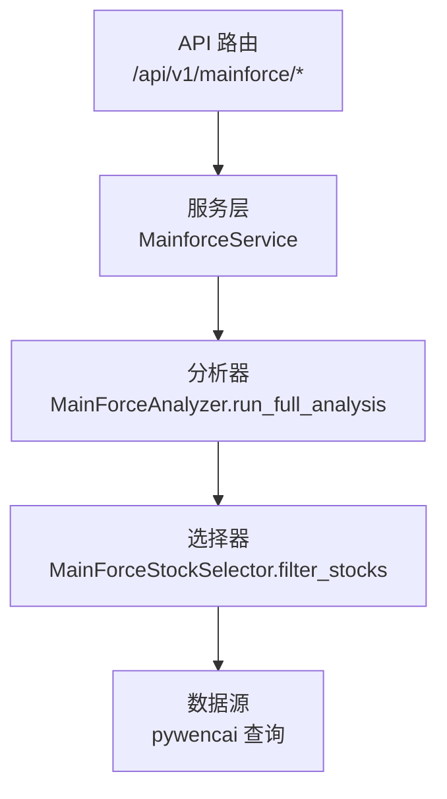
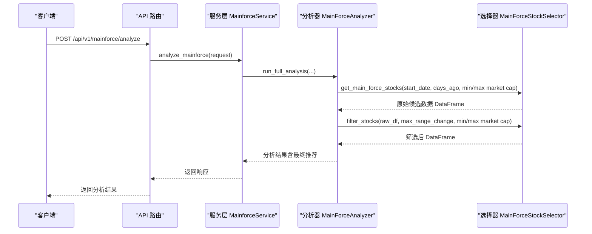
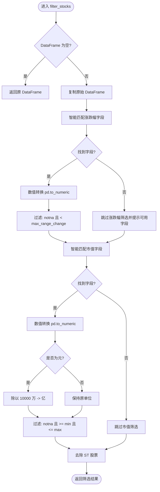
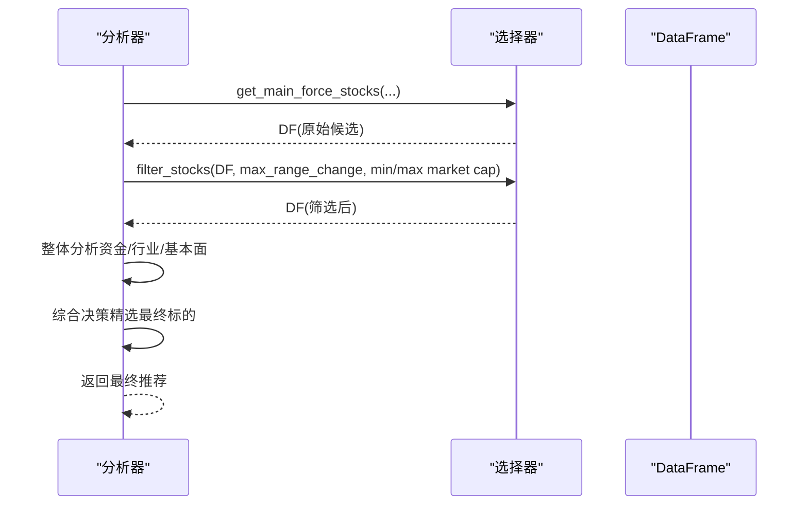
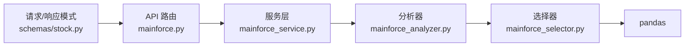

# 主力股筛选条件实现

<cite>
**本文引用的文件**
- [backend/app/services/mainforce_selector.py](file://backend/app/services/mainforce_selector.py)
- [backend/app/services/mainforce_analyzer.py](file://backend/app/services/mainforce_analyzer.py)
- [backend/app/api/v1/mainforce.py](file://backend/app/api/v1/mainforce.py)
- [backend/app/services/mainforce_service.py](file://backend/app/services/mainforce_service.py)
- [backend/app/schemas/stock.py](file://backend/app/schemas/stock.py)
- [docs/主力选股功能说明.md](file://docs/主力选股功能说明.md)
- [docs/主力选股使用指南.md](file://docs/主力选股使用指南.md)
</cite>

## 目录
1. [简介](#简介)
2. [项目结构](#项目结构)
3. [核心组件](#核心组件)
4. [架构总览](#架构总览)
5. [详细组件分析](#详细组件分析)
6. [依赖关系分析](#依赖关系分析)
7. [性能考量](#性能考量)
8. [故障排查指南](#故障排查指南)
9. [结论](#结论)
10. [附录](#附录)

## 简介
本文围绕“主力股筛选条件实现”展开，重点解释 filter_stocks 如何基于多维度条件（最大涨跌幅、最小/最大市值）对原始候选股票进行过滤的实现机制；阐述参数校验、数据类型转换、Pandas DataFrame 条件筛选等关键技术细节；说明筛选顺序的合理性及性能优化考虑（如先过滤数据量大的维度）；描述空结果处理逻辑及边界情况（如极端数值输入）；结合 run_full_analysis 流程展示筛选前后数据分布变化，并提供可调优的参数配置建议，帮助开发者根据市场环境调整筛选策略。

## 项目结构
- 后端采用 FastAPI + SQLAlchemy 架构，主力选股分析流程由 API 层、服务层、分析器层、选择器层协同完成。
- 选择器负责从数据源获取候选股票并执行智能筛选；分析器负责整体批量分析与综合决策；服务层封装 API 调用与异步执行；API 路由对外暴露分析接口。

图表来源
- [backend/app/api/v1/mainforce.py](file://backend/app/api/v1/mainforce.py#L1-L62)
- [backend/app/services/mainforce_service.py](file://backend/app/services/mainforce_service.py#L1-L235)
- [backend/app/services/mainforce_analyzer.py](file://backend/app/services/mainforce_analyzer.py#L1-L564)
- [backend/app/services/mainforce_selector.py](file://backend/app/services/mainforce_selector.py#L1-L391)

章节来源
- [backend/app/api/v1/mainforce.py](file://backend/app/api/v1/mainforce.py#L1-L62)
- [backend/app/services/mainforce_service.py](file://backend/app/services/mainforce_service.py#L1-L235)
- [backend/app/services/mainforce_analyzer.py](file://backend/app/services/mainforce_analyzer.py#L1-L564)
- [backend/app/services/mainforce_selector.py](file://backend/app/services/mainforce_selector.py#L1-L391)

## 核心组件
- 选择器（MainForceStockSelector）
  - 负责从数据源获取候选股票（pywencai），并执行智能筛选（涨跌幅、市值、ST过滤）。
  - 关键方法：filter_stocks、get_main_force_stocks、get_top_stocks、format_stock_list_for_analysis。
- 分析器（MainForceAnalyzer）
  - 负责完整分析流程：获取数据 → 智能筛选 → 整体分析 → 综合决策。
  - 关键方法：run_full_analysis、_prepare_overall_summary、_select_best_stocks。
- 服务层（MainforceService）
  - 封装 API 调用，异步执行分析，处理异常与历史记录。
  - 关键方法：analyze_mainforce、batch_analyze、get_history。
- API 路由（mainforce.py）
  - 暴露分析、批量分析、历史记录接口。
- 请求/响应模式（schemas/stock.py）
  - 定义主力选股分析请求参数与响应结构，包含 max_range_change、min_market_cap、max_market_cap 等。

章节来源
- [backend/app/services/mainforce_selector.py](file://backend/app/services/mainforce_selector.py#L1-L391)
- [backend/app/services/mainforce_analyzer.py](file://backend/app/services/mainforce_analyzer.py#L1-L564)
- [backend/app/services/mainforce_service.py](file://backend/app/services/mainforce_service.py#L1-L235)
- [backend/app/api/v1/mainforce.py](file://backend/app/api/v1/mainforce.py#L1-L62)
- [backend/app/schemas/stock.py](file://backend/app/schemas/stock.py#L62-L100)

## 架构总览
下图展示了从 API 到分析器再到选择器的调用链路，以及筛选前后数据流的变化。

图表来源
- [backend/app/api/v1/mainforce.py](file://backend/app/api/v1/mainforce.py#L1-L62)
- [backend/app/services/mainforce_service.py](file://backend/app/services/mainforce_service.py#L1-L235)
- [backend/app/services/mainforce_analyzer.py](file://backend/app/services/mainforce_analyzer.py#L1-L564)
- [backend/app/services/mainforce_selector.py](file://backend/app/services/mainforce_selector.py#L1-L391)

## 详细组件分析

### 选择器：filter_stocks 的实现机制
- 输入输出
  - 输入：原始 DataFrame、最大涨跌幅阈值、最小/最大市值阈值。
  - 输出：筛选后的 DataFrame。
- 参数校验与空结果处理
  - 若输入 DataFrame 为空，直接返回原 DataFrame，避免后续处理。
  - 若未找到涨跌幅字段，则跳过涨跌幅筛选并提示可用字段。
- 数据类型转换与清洗
  - 涨跌幅字段：使用数值转换（pd.to_numeric），缺失值统一转为 NaN，随后进行比较过滤。
  - 市值字段：先转换为数值，再判断单位（若最大值大于阈值，视为“元”，转换为“亿”）。
- 筛选顺序与合理性
  - 先涨跌幅后市值，再 ST 过滤：
    - 涨跌幅筛选通常能快速剔除大量样本，减少后续处理成本；
    - 市值筛选进一步缩小范围，便于后续排序与分析；
    - ST 过滤作为兜底，确保基础质量。
- Pandas 条件筛选
  - 使用布尔索引组合：notna + 比较条件，保证缺失值不会被错误保留。
- 边界情况
  - 极端数值：若涨跌幅列存在异常值，数值转换后会变为 NaN，从而被正确过滤；
  - 单位差异：自动检测并转换单位，避免因单位不同导致的误判；
  - 字段命名差异：通过智能匹配多种可能的列名，提高鲁棒性。

图表来源
- [backend/app/services/mainforce_selector.py](file://backend/app/services/mainforce_selector.py#L138-L238)

章节来源
- [backend/app/services/mainforce_selector.py](file://backend/app/services/mainforce_selector.py#L138-L238)

### 分析器：run_full_analysis 的筛选前后数据分布
- 流程要点
  - 步骤1：调用选择器获取前 N 名主力资金净流入股票；
  - 步骤2：调用 filter_stocks 执行涨跌幅与市值筛选；
  - 步骤3：整体分析（资金流向、行业板块、财务基本面）；
  - 步骤4：综合决策，精选最终标的。
- 空结果处理
  - 若筛选后 DataFrame 为空，直接返回错误信息，避免后续分析。
- 数据分布变化示例（概念性）
  - 原始候选：100 只；
  - 涨跌幅过滤：剔除涨幅过高样本；
  - 市值过滤：仅保留中盘股；
  - ST 过滤：剔除风险公司；
  - 最终候选：若干只，用于整体分析与排序。

图表来源
- [backend/app/services/mainforce_analyzer.py](file://backend/app/services/mainforce_analyzer.py#L29-L136)
- [backend/app/services/mainforce_selector.py](file://backend/app/services/mainforce_selector.py#L138-L238)

章节来源
- [backend/app/services/mainforce_analyzer.py](file://backend/app/services/mainforce_analyzer.py#L29-L136)

### API 与服务层：参数传递与异步执行
- API 路由
  - /api/v1/mainforce/analyze：接收主力选股分析请求，返回分析结果。
- 服务层
  - analyze_mainforce 异步执行，内部委托给分析器 run_full_analysis；
  - mainforce_analyzer 的请求参数来自前端传入的 MainforceAnalyzeRequest，包含 max_range_change、min_market_cap、max_market_cap 等。
- 参数默认值与范围
  - 默认最大涨跌幅：30.0；
  - 默认最小/最大市值：50.0/5000.0（单位：亿）；
  - 响应结构包含 total_stocks、filtered_stocks、final_recommendations、params 等。

章节来源
- [backend/app/api/v1/mainforce.py](file://backend/app/api/v1/mainforce.py#L1-L62)
- [backend/app/services/mainforce_service.py](file://backend/app/services/mainforce_service.py#L1-L235)
- [backend/app/schemas/stock.py](file://backend/app/schemas/stock.py#L62-L100)

## 依赖关系分析
- 选择器依赖 pandas 进行数据清洗与筛选；
- 分析器依赖选择器提供的 DataFrame，同时依赖外部数据源（pywencai）与 AI 模型；
- 服务层与 API 路由通过 Pydantic 模型对接请求参数，保证参数类型与默认值一致；
- 文档中对筛选逻辑与参数范围有明确说明，便于前端与用户理解。

图表来源
- [backend/app/schemas/stock.py](file://backend/app/schemas/stock.py#L62-L100)
- [backend/app/api/v1/mainforce.py](file://backend/app/api/v1/mainforce.py#L1-L62)
- [backend/app/services/mainforce_service.py](file://backend/app/services/mainforce_service.py#L1-L235)
- [backend/app/services/mainforce_analyzer.py](file://backend/app/services/mainforce_analyzer.py#L1-L564)
- [backend/app/services/mainforce_selector.py](file://backend/app/services/mainforce_selector.py#L1-L391)

章节来源
- [backend/app/schemas/stock.py](file://backend/app/schemas/stock.py#L62-L100)
- [backend/app/api/v1/mainforce.py](file://backend/app/api/v1/mainforce.py#L1-L62)
- [backend/app/services/mainforce_service.py](file://backend/app/services/mainforce_service.py#L1-L235)
- [backend/app/services/mainforce_analyzer.py](file://backend/app/services/mainforce_analyzer.py#L1-L564)
- [backend/app/services/mainforce_selector.py](file://backend/app/services/mainforce_selector.py#L1-L391)

## 性能考量
- 筛选顺序优化
  - 先涨跌幅后市值，再 ST 过滤，能有效降低数据规模，减少后续排序与分析的成本。
- 数值转换与单位处理
  - 使用 pd.to_numeric 统一转换，缺失值转为 NaN，避免后续比较产生异常；
  - 自动识别单位（元/亿），减少人工预处理开销。
- 并行与异步
  - 服务层使用线程池与异步执行，提升吞吐；
  - 分析器整体批量分析，避免逐个分析的重复开销。
- 缓存与重试
  - 选择器对 pywencai 查询采用多方案与重试机制，提升成功率与稳定性。

章节来源
- [backend/app/services/mainforce_selector.py](file://backend/app/services/mainforce_selector.py#L138-L238)
- [backend/app/services/mainforce_service.py](file://backend/app/services/mainforce_service.py#L1-L235)
- [backend/app/services/mainforce_analyzer.py](file://backend/app/services/mainforce_analyzer.py#L1-L564)

## 故障排查指南
- 常见问题
  - 未找到涨跌幅字段：选择器会跳过涨跌幅筛选并提示可用字段，检查数据源字段命名是否符合预期。
  - 市值单位异常：若最大值极大，会被识别为“元”，自动转换为“亿”，确认数据源单位一致性。
  - 筛选后为空：检查 max_range_change、min_market_cap、max_market_cap 是否过于严格；适当放宽阈值。
  - API 返回错误：查看服务层异常捕获与日志，确认参数合法性与网络状态。
- 边界情况
  - 极端数值：NaN 与无穷大值会被正确过滤；
  - 字段缺失：智能匹配失败时，选择器会提示可用字段，便于定位问题。

章节来源
- [backend/app/services/mainforce_selector.py](file://backend/app/services/mainforce_selector.py#L138-L238)
- [backend/app/services/mainforce_service.py](file://backend/app/services/mainforce_service.py#L1-L235)
- [docs/主力选股功能说明.md](file://docs/主力选股功能说明.md#L155-L183)

## 结论
- filter_stocks 通过智能字段匹配、数值转换与严格的布尔筛选，实现了对主力候选股票的高效过滤；
- 筛选顺序与单位处理体现了工程上的稳健性与性能优化；
- 结合 run_full_analysis，筛选前后数据分布清晰，便于整体分析与综合决策；
- 建议根据市场环境动态调整 max_range_change、min_market_cap、max_market_cap 等参数，以获得更贴合实际的候选集合。

## 附录

### 参数配置建议（结合文档与默认值）
- 默认参数参考
  - 最大涨跌幅：30.0（避免追高）；
  - 最小市值：50.0（中盘股起点）；
  - 最大市值：5000.0（上限可根据市场风格调整）。
- 不同市场环境建议
  - 牛市：可适度提高 max_range_change，放宽市值范围，关注高波动成长股；
  - 震荡：维持默认参数，强调中盘稳定标的；
  - 熊市：降低 max_range_change，收紧市值范围，优先防御性行业。
- 可调参数清单
  - start_date/days_ago：统计时间窗口；
  - final_n：最终精选数量；
  - max_range_change：涨跌幅阈值；
  - min_market_cap/max_market_cap：市值上下限；
  - model：AI 模型选择（如 deepseek-chat 或 deepseek-reasoner）。

章节来源
- [backend/app/schemas/stock.py](file://backend/app/schemas/stock.py#L62-L100)
- [docs/主力选股功能说明.md](file://docs/主力选股功能说明.md#L88-L112)
- [docs/主力选股使用指南.md](file://docs/主力选股使用指南.md#L164-L180)