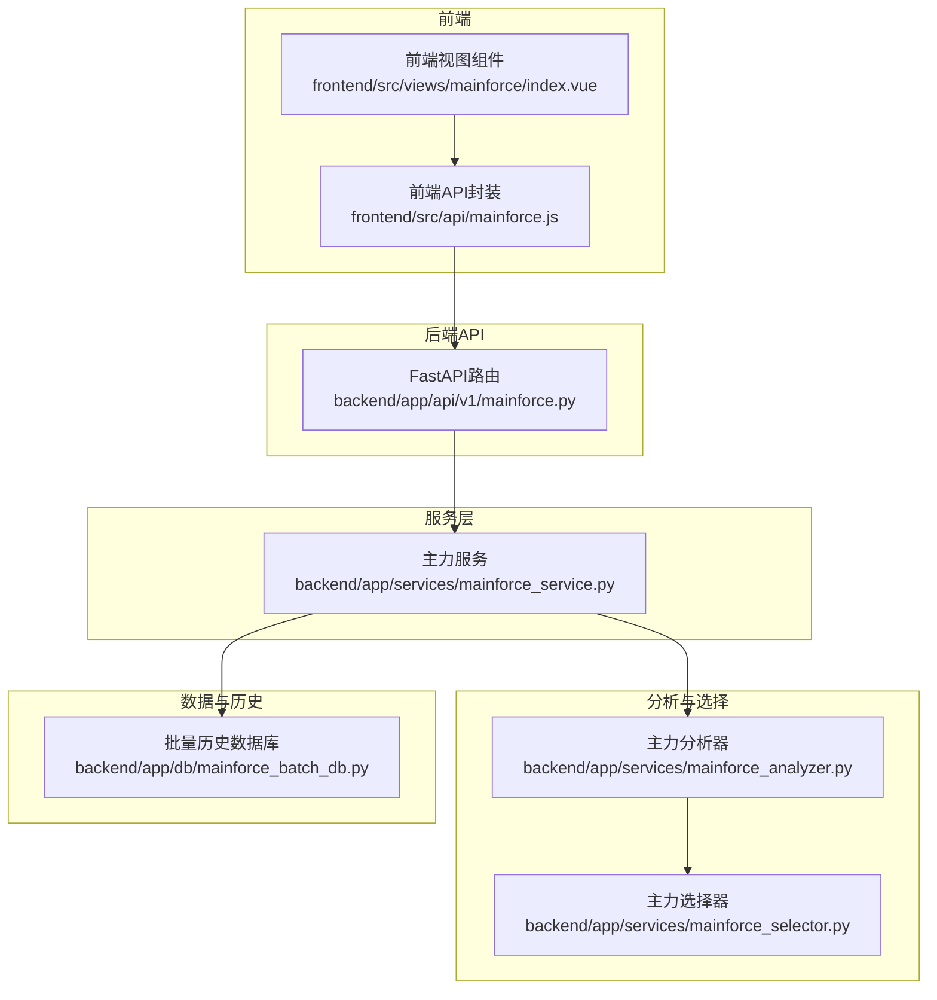
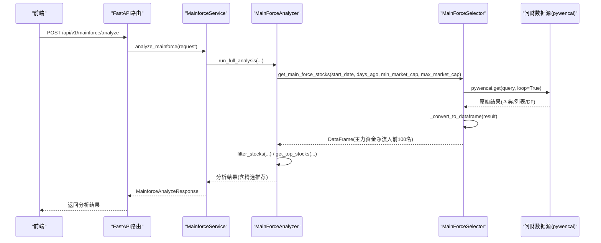
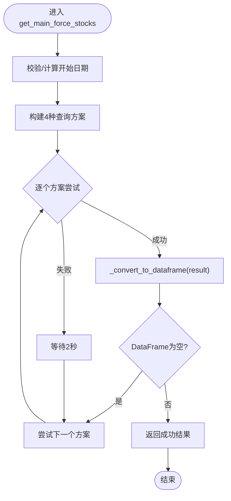
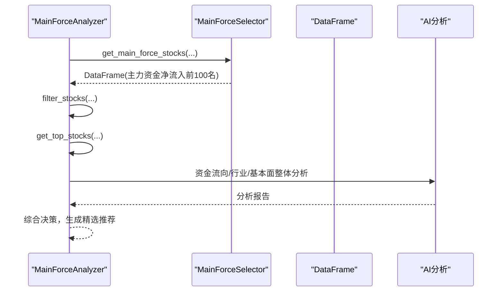
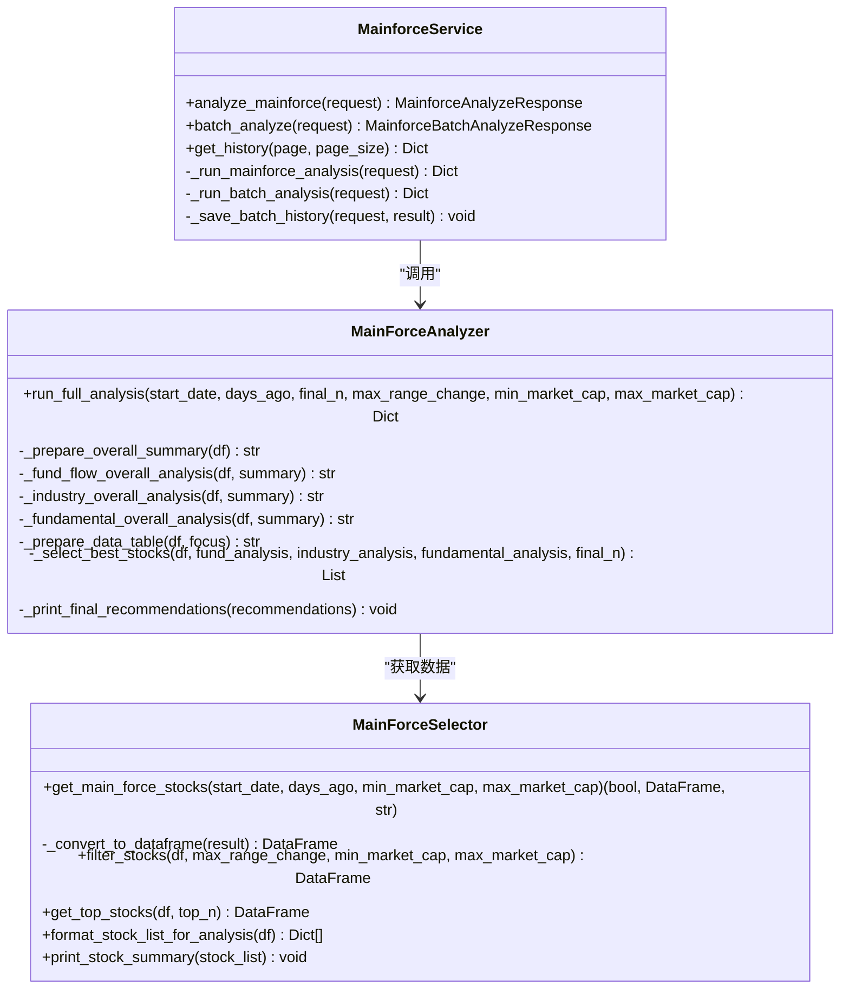
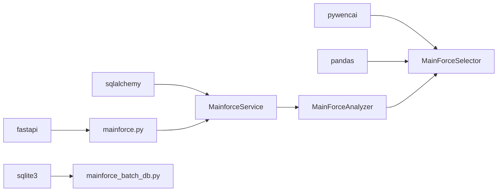

# 主力资金数据获取

<cite>
**本文引用的文件**
- [mainforce_selector.py](file://backend/app/services/mainforce_selector.py)
- [mainforce_analyzer.py](file://backend/app/services/mainforce_analyzer.py)
- [mainforce_service.py](file://backend/app/services/mainforce_service.py)
- [mainforce.py](file://backend/app/api/v1/mainforce.py)
- [stock.py](file://backend/app/schemas/stock.py)
- [mainforce_batch_db.py](file://backend/app/db/mainforce_batch_db.py)
- [mainforce.js](file://frontend/src/api/mainforce.js)
- [index.vue](file://frontend/src/views/mainforce/index.vue)
</cite>

## 目录
1. [简介](#简介)
2. [项目结构](#项目结构)
3. [核心组件](#核心组件)
4. [架构总览](#架构总览)
5. [详细组件分析](#详细组件分析)
6. [依赖关系分析](#依赖关系分析)
7. [性能考量](#性能考量)
8. [故障排查指南](#故障排查指南)
9. [结论](#结论)
10. [附录](#附录)

## 简介
本文件围绕“主力资金数据获取”主题，系统梳理从问财（pywencai）数据源抓取主力资金净流入前100名股票的完整流程，重点解读 MainForceSelector.get_main_force_stocks 方法的实现逻辑，覆盖参数处理、网络请求构造、数据解析与清洗、失败重试与异常处理策略，并结合 MainForceAnalyzer 的调用上下文说明数据获取在整个分析流程中的位置与作用。同时提供接口契约与集成示例，帮助开发者快速对接。

## 项目结构
主力资金数据获取涉及后端服务层、API 层、前端交互层以及数据库持久化层，整体采用“API → 服务 → 分析器 → 选择器”的分层设计，其中选择器负责与问财数据源交互并产出标准化数据。

图表来源
- [mainforce.py](file://backend/app/api/v1/mainforce.py#L1-L62)
- [mainforce_service.py](file://backend/app/services/mainforce_service.py#L1-L235)
- [mainforce_analyzer.py](file://backend/app/services/mainforce_analyzer.py#L1-L564)
- [mainforce_selector.py](file://backend/app/services/mainforce_selector.py#L1-L391)
- [mainforce_batch_db.py](file://backend/app/db/mainforce_batch_db.py#L1-L302)
- [mainforce.js](file://frontend/src/api/mainforce.js#L1-L29)
- [index.vue](file://frontend/src/views/mainforce/index.vue#L583-L660)

章节来源
- [mainforce.py](file://backend/app/api/v1/mainforce.py#L1-L62)
- [mainforce_service.py](file://backend/app/services/mainforce_service.py#L1-L235)
- [mainforce_analyzer.py](file://backend/app/services/mainforce_analyzer.py#L1-L564)
- [mainforce_selector.py](file://backend/app/services/mainforce_selector.py#L1-L391)
- [mainforce_batch_db.py](file://backend/app/db/mainforce_batch_db.py#L1-L302)
- [mainforce.js](file://frontend/src/api/mainforce.js#L1-L29)
- [index.vue](file://frontend/src/views/mainforce/index.vue#L583-L660)

## 核心组件
- MainForceSelector：负责与问财数据源交互，获取主力资金净流入前100名股票，支持多方案查询、数据清洗与失败重试。
- MainForceAnalyzer：负责组织完整分析流程，调用选择器获取数据，进行智能筛选与AI综合评估。
- MainforceService：FastAPI 服务层，承接HTTP请求，异步调度分析器执行，并处理批量分析与历史记录。
- API 路由：提供 /api/v1/mainforce/analyze、/api/v1/mainforce/batch-analyze、/api/v1/mainforce/history 等接口。
- 前端封装：提供 analyzeMainforce、batchAnalyzeMainforce、getMainforceHistory 等API调用方法。
- 批量历史数据库：负责批量分析结果的持久化与查询。

章节来源
- [mainforce_selector.py](file://backend/app/services/mainforce_selector.py#L1-L391)
- [mainforce_analyzer.py](file://backend/app/services/mainforce_analyzer.py#L1-L564)
- [mainforce_service.py](file://backend/app/services/mainforce_service.py#L1-L235)
- [mainforce.py](file://backend/app/api/v1/mainforce.py#L1-L62)
- [stock.py](file://backend/app/schemas/stock.py#L62-L100)
- [mainforce.js](file://frontend/src/api/mainforce.js#L1-L29)
- [index.vue](file://frontend/src/views/mainforce/index.vue#L583-L660)
- [mainforce_batch_db.py](file://backend/app/db/mainforce_batch_db.py#L1-L302)

## 架构总览
下图展示了从前端发起请求到后端选择器获取数据并返回分析结果的端到端流程。

图表来源
- [mainforce.py](file://backend/app/api/v1/mainforce.py#L1-L62)
- [mainforce_service.py](file://backend/app/services/mainforce_service.py#L32-L74)
- [mainforce_analyzer.py](file://backend/app/services/mainforce_analyzer.py#L29-L141)
- [mainforce_selector.py](file://backend/app/services/mainforce_selector.py#L22-L113)

## 详细组件分析

### MainForceSelector.get_main_force_stocks 实现详解
- 参数处理
  - start_date：若未提供，则根据 days_ago 计算相对日期并格式化为“年月日”字符串。
  - min_market_cap、max_market_cap：作为市值范围约束，用于后续筛选。
- 查询构造与多方案回退
  - 构造4种查询方案，均要求计算区间涨跌幅，并逐步降低字段复杂度（从完整字段到基础字段再到最简字段）。
  - 依次尝试各方案，遇到 None 或空DataFrame即回退到下一个方案；全部失败则返回错误信息。
- 网络请求与重试
  - 使用 pywencai.get(query, loop=True) 发起请求；当某方案失败时，短暂休眠后继续尝试下一个方案。
- 数据解析与清洗
  - _convert_to_dataframe(result) 支持多种输入类型（DataFrame、dict、list），并处理嵌套的 tableV1 结构，最终返回标准化的 DataFrame。
- 输出
  - 返回三元组：(success, DataFrame, message)，供上层分析器使用。

图表来源
- [mainforce_selector.py](file://backend/app/services/mainforce_selector.py#L22-L113)
- [mainforce_selector.py](file://backend/app/services/mainforce_selector.py#L115-L136)

章节来源
- [mainforce_selector.py](file://backend/app/services/mainforce_selector.py#L22-L113)
- [mainforce_selector.py](file://backend/app/services/mainforce_selector.py#L115-L136)

### 数据解析与清洗
- _convert_to_dataframe(result) 支持：
  - pandas.DataFrame：直接返回
  - dict：优先检查嵌套的 tableV1，否则按单条记录构造 DataFrame
  - list：按列表构造 DataFrame
  - 其他：返回 None
- 异常捕获：转换失败时打印日志并返回 None，避免中断流程。

章节来源
- [mainforce_selector.py](file://backend/app/services/mainforce_selector.py#L115-L136)

### MainForceAnalyzer 调用上下文与数据获取位置
- MainForceAnalyzer.run_full_analysis 在分析流程中首先调用 selector.get_main_force_stocks 获取主力资金净流入前100名股票。
- 随后进行智能筛选（涨跌幅、市值、ST过滤）与Top N提取，并驱动AI整体分析（资金流向、行业、基本面）。
- 最终综合三位分析师意见，输出精选推荐。

图表来源
- [mainforce_analyzer.py](file://backend/app/services/mainforce_analyzer.py#L29-L141)
- [mainforce_selector.py](file://backend/app/services/mainforce_selector.py#L138-L282)

章节来源
- [mainforce_analyzer.py](file://backend/app/services/mainforce_analyzer.py#L29-L141)
- [mainforce_selector.py](file://backend/app/services/mainforce_selector.py#L138-L282)

### API 与服务层集成
- FastAPI 路由
  - /api/v1/mainforce/analyze：POST，接收 MainforceAnalyzeRequest，返回 MainforceAnalyzeResponse。
  - /api/v1/mainforce/batch-analyze：POST，接收 MainforceBatchAnalyzeRequest，返回 MainforceBatchAnalyzeResponse。
  - /api/v1/mainforce/history：GET，分页获取历史记录。
- MainforceService
  - analyze_mainforce：异步执行分析，内部调用 MainForceAnalyzer.run_full_analysis。
  - batch_analyze：支持顺序/并行两种模式，保存历史记录至 SQLite。
  - get_history：分页查询历史记录。
- Schema 定义
  - MainforceAnalyzeRequest：包含 start_date、days_ago、final_n、max_range_change、min_market_cap、max_market_cap、model 等。
  - MainforceAnalyzeResponse：包含 success、total_stocks、filtered_stocks、final_recommendations、params、error 等。

图表来源
- [mainforce_service.py](file://backend/app/services/mainforce_service.py#L1-L235)
- [mainforce_analyzer.py](file://backend/app/services/mainforce_analyzer.py#L1-L564)
- [mainforce_selector.py](file://backend/app/services/mainforce_selector.py#L1-L391)

章节来源
- [mainforce.py](file://backend/app/api/v1/mainforce.py#L1-L62)
- [mainforce_service.py](file://backend/app/services/mainforce_service.py#L1-L235)
- [stock.py](file://backend/app/schemas/stock.py#L62-L100)

### 前端集成与示例
- 前端封装
  - analyzeMainforce(data)：POST /api/v1/mainforce/analyze
  - batchAnalyzeMainforce(data)：POST /api/v1/mainforce/batch-analyze
  - getMainforceHistory(params)：GET /api/v1/mainforce/history
- 前端视图
  - 触发分析后展示结果，支持导出候选股票CSV（包含主力净流入、涨跌幅、总市值、PE/PB等字段）。
  - 历史记录加载失败时提供降级示例数据。

章节来源
- [mainforce.js](file://frontend/src/api/mainforce.js#L1-L29)
- [index.vue](file://frontend/src/views/mainforce/index.vue#L583-L660)

## 依赖关系分析
- 外部依赖
  - pandas：数据结构与数值转换
  - pywencai：问财数据源访问
  - fastapi/sqlalchemy：API与数据库
  - sqlite3：本地历史记录存储
- 内部依赖
  - MainforceService 依赖 MainForceAnalyzer
  - MainForceAnalyzer 依赖 MainForceSelector
  - API 路由依赖 MainforceService
  - 前端通过 axios 封装调用 API

图表来源
- [mainforce_selector.py](file://backend/app/services/mainforce_selector.py#L1-L30)
- [mainforce_service.py](file://backend/app/services/mainforce_service.py#L1-L20)
- [mainforce.py](file://backend/app/api/v1/mainforce.py#L1-L20)
- [mainforce_batch_db.py](file://backend/app/db/mainforce_batch_db.py#L1-L20)

章节来源
- [mainforce_selector.py](file://backend/app/services/mainforce_selector.py#L1-L30)
- [mainforce_service.py](file://backend/app/services/mainforce_service.py#L1-L20)
- [mainforce.py](file://backend/app/api/v1/mainforce.py#L1-L20)
- [mainforce_batch_db.py](file://backend/app/db/mainforce_batch_db.py#L1-L20)

## 性能考量
- 查询回退策略：通过多方案查询在不同数据可用性条件下提升成功率，减少因字段缺失导致的失败重试成本。
- 数据清洗与数值转换：对涨跌幅、市值等字段进行统一数值化处理，避免后续排序与筛选的性能损耗。
- 并行批量分析：在服务层使用线程池并发执行批量分析，显著缩短总耗时；同时对结果进行JSON序列化清理，避免过大对象导致的内存压力。
- 历史记录存储：SQLite写入采用JSON序列化与字段清理，避免大数据对象直接入库带来的性能问题。

章节来源
- [mainforce_selector.py](file://backend/app/services/mainforce_selector.py#L48-L113)
- [mainforce_service.py](file://backend/app/services/mainforce_service.py#L106-L172)
- [mainforce_batch_db.py](file://backend/app/db/mainforce_batch_db.py#L51-L104)

## 故障排查指南
- 问财数据源不可用
  - 现象：selector 返回 None 或空DataFrame
  - 处理：系统自动回退到下一个查询方案；若全部失败，返回“所有查询方案都失败了，请检查网络或稍后重试”
- 数据清洗失败
  - 现象：_convert_to_dataframe 转换失败
  - 处理：捕获异常并返回 None，避免中断流程
- API 调用异常
  - 现象：FastAPI 路由抛出 500 错误
  - 处理：服务层捕获异常并返回错误信息，前端提供降级示例数据
- 批量历史保存失败
  - 现象：保存历史记录失败或历史记录显示异常
  - 处理：检查数据库文件权限、磁盘空间；必要时删除数据库文件重建；查看终端日志定位问题

章节来源
- [mainforce_selector.py](file://backend/app/services/mainforce_selector.py#L72-L113)
- [mainforce_service.py](file://backend/app/services/mainforce_service.py#L32-L56)
- [mainforce_batch_db.py](file://backend/app/db/mainforce_batch_db.py#L105-L148)
- [index.vue](file://frontend/src/views/mainforce/index.vue#L583-L660)

## 结论
本机制通过“多方案查询 + 失败回退 + 数据清洗 + AI综合分析”的闭环设计，实现了从问财数据源稳定获取主力资金净流入前100名股票的目标。MainForceSelector 负责数据获取与清洗，MainForceAnalyzer 负责流程编排与决策，MainforceService 负责API接入与历史记录管理。前后端通过清晰的接口契约与Schema定义实现解耦集成，具备良好的扩展性与可维护性。

## 附录

### 接口契约与集成要点
- 请求体（MainforceAnalyzeRequest）
  - start_date：可选，日期字符串
  - days_ago：可选，默认90
  - final_n：可选，默认5
  - max_range_change：可选，默认30.0
  - min_market_cap：可选，默认50.0
  - max_market_cap：可选，默认5000.0
  - model：可选，默认“deepseek-chat”
- 响应体（MainforceAnalyzeResponse）
  - success：布尔
  - total_stocks：整数
  - filtered_stocks：整数
  - final_recommendations：数组（每项包含 rank、symbol、name、reasons、highlights、risks、position、investment_period、stock_data）
  - params：请求参数快照
  - error：可选错误信息

章节来源
- [stock.py](file://backend/app/schemas/stock.py#L62-L100)

### 实际请求与响应示例（路径参考）
- 前端调用
  - analyzeMainforce({ start_date: "2025年10月1日", days_ago: 90, final_n: 5, max_range_change: 30.0, min_market_cap: 50.0, max_market_cap: 5000.0, model: "deepseek-chat" })
  - 批量分析：batchAnalyzeMainforce({ stock_codes: ["600036", "000001"], analysis_mode: "sequential", max_workers: 3, model: "deepseek-chat" })
  - 历史记录：getMainforceHistory({ page: 1, page_size: 20 })

章节来源
- [mainforce.js](file://frontend/src/api/mainforce.js#L1-L29)
- [index.vue](file://frontend/src/views/mainforce/index.vue#L583-L660)