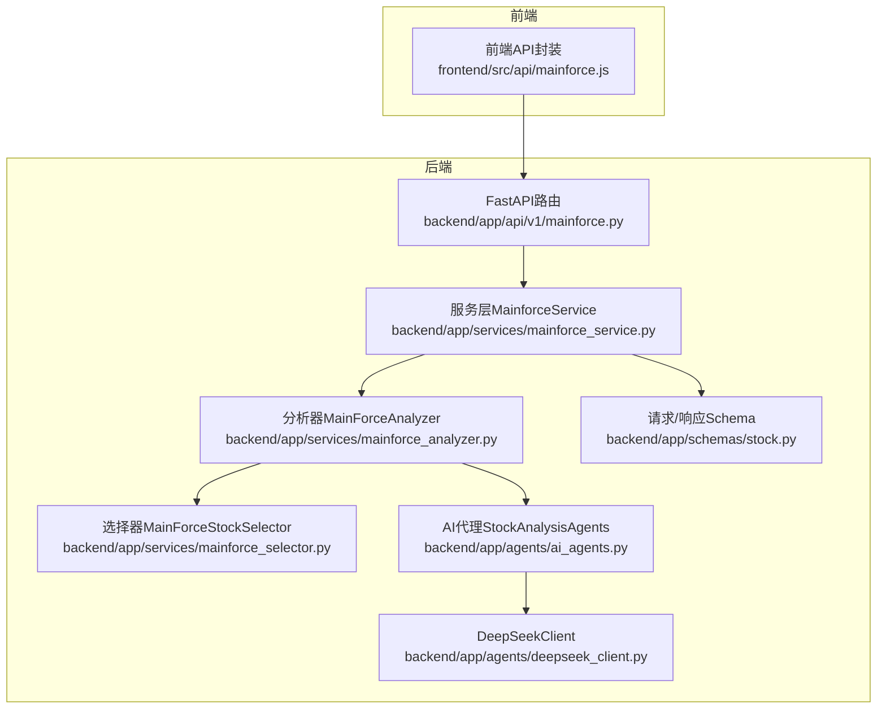
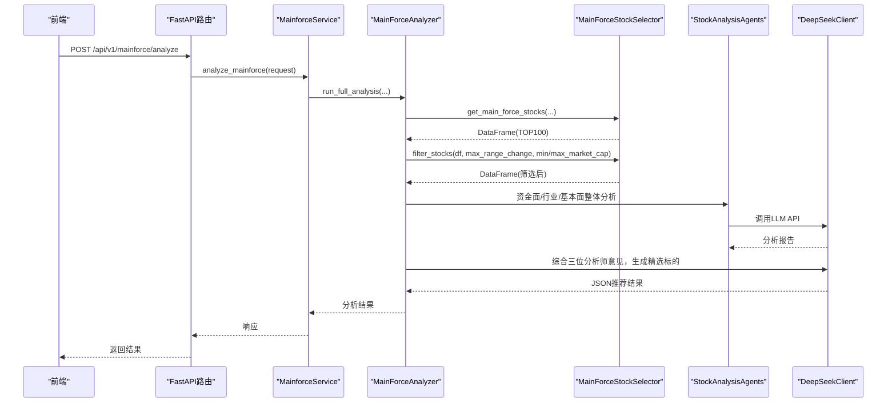
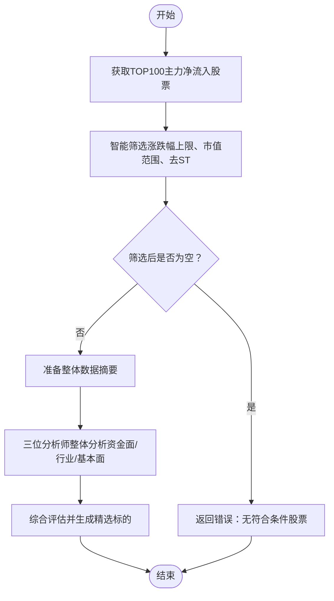
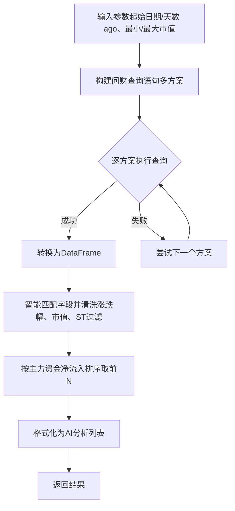
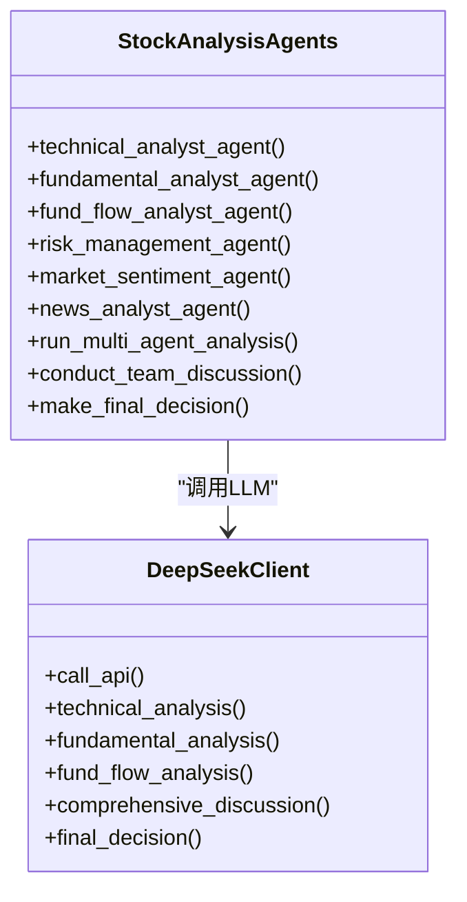
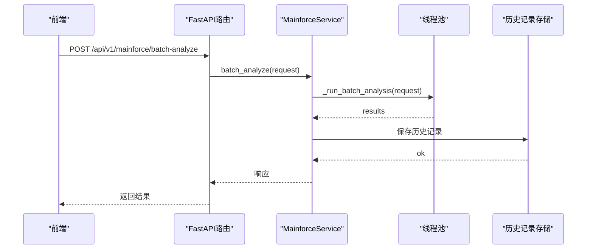
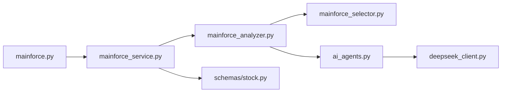

# 主力选股逻辑

<cite>
**本文引用的文件**
- [mainforce_analyzer.py](file://backend/app/services/mainforce_analyzer.py)
- [mainforce_selector.py](file://backend/app/services/mainforce_selector.py)
- [ai_agents.py](file://backend/app/agents/ai_agents.py)
- [deepseek_client.py](file://backend/app/agents/deepseek_client.py)
- [mainforce_service.py](file://backend/app/services/mainforce_service.py)
- [mainforce.py](file://backend/app/api/v1/mainforce.py)
- [stock.py](file://backend/app/schemas/stock.py)
- [mainforce.js](file://frontend/src/api/mainforce.js)
</cite>

## 目录
1. [简介](#简介)
2. [项目结构](#项目结构)
3. [核心组件](#核心组件)
4. [架构总览](#架构总览)
5. [详细组件分析](#详细组件分析)
6. [依赖关系分析](#依赖关系分析)
7. [性能与参数配置](#性能与参数配置)
8. [故障排查](#故障排查)
9. [结论](#结论)
10. [附录](#附录)

## 简介
本文件面向开发者，系统性阐述“主力选股”核心逻辑，重点覆盖以下方面：
- 如何通过多维度数据（主力资金净流入、区间涨跌幅、市值等）筛选潜力股
- MainForceAnalyzer 类的分析流程与AI代理增强机制
- 从问财（pywencai）获取TOP100主力净流入股票的逻辑及后续过滤与评分链条
- 参数配置与调用流程，帮助开发者理解并优化选股策略

## 项目结构
围绕主力选股的关键代码分布在 backend 的 services、agents、api、schemas 等模块，前端通过 API 调用后端服务。

图示来源
- [mainforce.py](file://backend/app/api/v1/mainforce.py#L1-L62)
- [mainforce_service.py](file://backend/app/services/mainforce_service.py#L1-L235)
- [mainforce_analyzer.py](file://backend/app/services/mainforce_analyzer.py#L1-L564)
- [mainforce_selector.py](file://backend/app/services/mainforce_selector.py#L1-L391)
- [ai_agents.py](file://backend/app/agents/ai_agents.py#L1-L546)
- [deepseek_client.py](file://backend/app/agents/deepseek_client.py#L1-L458)
- [stock.py](file://backend/app/schemas/stock.py#L1-L100)
- [mainforce.js](file://frontend/src/api/mainforce.js#L1-L29)

章节来源
- [mainforce.py](file://backend/app/api/v1/mainforce.py#L1-L62)
- [mainforce_service.py](file://backend/app/services/mainforce_service.py#L1-L235)
- [mainforce_analyzer.py](file://backend/app/services/mainforce_analyzer.py#L1-L564)
- [mainforce_selector.py](file://backend/app/services/mainforce_selector.py#L1-L391)
- [ai_agents.py](file://backend/app/agents/ai_agents.py#L1-L546)
- [deepseek_client.py](file://backend/app/agents/deepseek_client.py#L1-L458)
- [stock.py](file://backend/app/schemas/stock.py#L1-L100)
- [mainforce.js](file://frontend/src/api/mainforce.js#L1-L29)

## 核心组件
- MainForceAnalyzer：负责从问财获取TOP100主力净流入股票，执行智能筛选（涨跌幅、市值），进行整体AI分析（资金面、行业、基本面），并综合三位分析师意见精选标的。
- MainForceStockSelector：封装问财查询、数据清洗、智能筛选（涨跌幅、市值）、TopN排序与格式化。
- StockAnalysisAgents + DeepSeekClient：提供多维AI分析（技术、基本面、资金面、风险、情绪、新闻）与最终决策。
- MainforceService + FastAPI路由：对外提供分析与批量分析接口，封装参数校验与异步执行。
- Schema：定义请求/响应参数与默认值，保证前后端一致性。

章节来源
- [mainforce_analyzer.py](file://backend/app/services/mainforce_analyzer.py#L1-L564)
- [mainforce_selector.py](file://backend/app/services/mainforce_selector.py#L1-L391)
- [ai_agents.py](file://backend/app/agents/ai_agents.py#L1-L546)
- [deepseek_client.py](file://backend/app/agents/deepseek_client.py#L1-L458)
- [mainforce_service.py](file://backend/app/services/mainforce_service.py#L1-L235)
- [mainforce.py](file://backend/app/api/v1/mainforce.py#L1-L62)
- [stock.py](file://backend/app/schemas/stock.py#L1-L100)

## 架构总览
主力选股从“数据获取—智能筛选—整体AI分析—综合决策”四个阶段展开，贯穿后端服务层与AI代理层。

图示来源
- [mainforce.py](file://backend/app/api/v1/mainforce.py#L1-L62)
- [mainforce_service.py](file://backend/app/services/mainforce_service.py#L1-L235)
- [mainforce_analyzer.py](file://backend/app/services/mainforce_analyzer.py#L1-L564)
- [mainforce_selector.py](file://backend/app/services/mainforce_selector.py#L1-L391)
- [ai_agents.py](file://backend/app/agents/ai_agents.py#L1-L546)
- [deepseek_client.py](file://backend/app/agents/deepseek_client.py#L1-L458)

## 详细组件分析

### MainForceAnalyzer：主力资金动向识别与综合决策
- 数据来源与流程
  - 通过 selector.get_main_force_stocks 从问财获取主力资金净流入TOP100股票，支持多种查询方案回退。
  - 通过 selector.filter_stocks 基于“区间涨跌幅上限”和“市值上下限”进行智能筛选。
  - 保存筛选后的数据，准备整体AI分析。
- 整体AI分析
  - 资金面整体分析：聚焦主力资金集中度、板块轮动、资金与涨跌幅配合度。
  - 行业板块整体分析：热点板块识别、板块特征与前景评估。
  - 财务基本面整体分析：财务质量、估值、成长性评估。
- 综合决策与输出
  - 将三位分析师报告汇总，构建综合提示词，调用LLM生成精选标的JSON。
  - 若JSON解析失败，回退至按主力资金净流入排序的TopN方案。
  - 输出包含排名、代码、名称、理由、亮点、风险、建议仓位、投资周期等字段。

图示来源
- [mainforce_analyzer.py](file://backend/app/services/mainforce_analyzer.py#L1-L564)
- [mainforce_selector.py](file://backend/app/services/mainforce_selector.py#L1-L391)

章节来源
- [mainforce_analyzer.py](file://backend/app/services/mainforce_analyzer.py#L1-L564)

### MainForceStockSelector：问财数据获取与智能筛选
- 问财查询与回退策略
  - 提供4种查询方案，均要求计算区间涨跌幅，并包含行业、市值、财务评分等字段。
  - 逐方案尝试，直至成功或全部失败。
- 数据清洗与筛选
  - 智能匹配区间涨跌幅字段（支持多种命名变体），转换为数值并按上限过滤。
  - 智能匹配“总市值/市值”字段，自动识别单位（元/亿），按范围过滤。
  - 去除ST股票，进一步剔除异常样本。
- TopN排序与格式化
  - 智能匹配主力资金相关列（主力净流入/主力资金流向），按金额排序取前N。
  - 格式化输出用于AI分析的股票列表（含行业、PE/PB、营收/净利润、评分等）。

图示来源
- [mainforce_selector.py](file://backend/app/services/mainforce_selector.py#L1-L391)

章节来源
- [mainforce_selector.py](file://backend/app/services/mainforce_selector.py#L1-L391)

### AI代理增强：资金面、行业、基本面与综合决策
- 资金面分析
  - 通过DeepSeekClient调用LLM，基于近20个交易日资金流向数据，分析主力行为、散户博弈、量价配合、关键信号与阶段性特征。
- 行业板块分析
  - 从热点识别、板块特征、行业前景、优质标的推荐等维度进行系统分析。
- 财务基本面分析
  - 从财务质量、估值、成长性、综合评估等维度进行深入分析。
- 综合决策
  - 将三位分析师报告汇总，构建综合提示词，要求输出JSON格式的精选标的清单；若失败则回退为主力资金排序TopN。

图示来源
- [ai_agents.py](file://backend/app/agents/ai_agents.py#L1-L546)
- [deepseek_client.py](file://backend/app/agents/deepseek_client.py#L1-L458)

章节来源
- [ai_agents.py](file://backend/app/agents/ai_agents.py#L1-L546)
- [deepseek_client.py](file://backend/app/agents/deepseek_client.py#L1-L458)

### API与服务层：参数校验、异步执行与历史记录
- FastAPI路由
  - /api/v1/mainforce/analyze：主力选股分析
  - /api/v1/mainforce/batch-analyze：批量分析
  - /api/v1/mainforce/history：历史记录
- MainforceService
  - analyze_mainforce：异步执行分析，封装异常处理与响应模型
  - batch_analyze：支持顺序/并行两种模式，线程池并发执行，保存历史记录
- Schema
  - MainforceAnalyzeRequest：start_date/days_ago/final_n/max_range_change/min_market_cap/max_market_cap/model
  - MainforceAnalyzeResponse：success/total_stocks/filtered_stocks/final_recommendations/params/error
  - MainforceBatchAnalyzeRequest/Response：批量分析请求/响应

图示来源
- [mainforce.py](file://backend/app/api/v1/mainforce.py#L1-L62)
- [mainforce_service.py](file://backend/app/services/mainforce_service.py#L1-L235)
- [stock.py](file://backend/app/schemas/stock.py#L1-L100)
- [mainforce.js](file://frontend/src/api/mainforce.js#L1-L29)

章节来源
- [mainforce.py](file://backend/app/api/v1/mainforce.py#L1-L62)
- [mainforce_service.py](file://backend/app/services/mainforce_service.py#L1-L235)
- [stock.py](file://backend/app/schemas/stock.py#L1-L100)
- [mainforce.js](file://frontend/src/api/mainforce.js#L1-L29)

## 依赖关系分析
- 组件耦合
  - MainForceAnalyzer 依赖 MainForceStockSelector（数据获取与筛选）、StockAnalysisAgents（AI分析）、DeepSeekClient（LLM调用）
  - MainforceService 依赖 MainForceAnalyzer（分析流程），并负责异步执行与历史记录
  - API 层仅依赖服务层，职责清晰
- 外部依赖
  - 问财（pywencai）：主力资金TOP100数据获取
  - DeepSeek API：多维分析与最终决策
- 潜在循环依赖
  - 代码组织上未见循环导入；若新增模块需注意避免跨模块相互引用

图示来源
- [mainforce.py](file://backend/app/api/v1/mainforce.py#L1-L62)
- [mainforce_service.py](file://backend/app/services/mainforce_service.py#L1-L235)
- [mainforce_analyzer.py](file://backend/app/services/mainforce_analyzer.py#L1-L564)
- [mainforce_selector.py](file://backend/app/services/mainforce_selector.py#L1-L391)
- [ai_agents.py](file://backend/app/agents/ai_agents.py#L1-L546)
- [deepseek_client.py](file://backend/app/agents/deepseek_client.py#L1-L458)
- [stock.py](file://backend/app/schemas/stock.py#L1-L100)

章节来源
- [mainforce.py](file://backend/app/api/v1/mainforce.py#L1-L62)
- [mainforce_service.py](file://backend/app/services/mainforce_service.py#L1-L235)
- [mainforce_analyzer.py](file://backend/app/services/mainforce_analyzer.py#L1-L564)
- [mainforce_selector.py](file://backend/app/services/mainforce_selector.py#L1-L391)
- [ai_agents.py](file://backend/app/agents/ai_agents.py#L1-L546)
- [deepseek_client.py](file://backend/app/agents/deepseek_client.py#L1-L458)
- [stock.py](file://backend/app/schemas/stock.py#L1-L100)

## 性能与参数配置
- 参数配置（默认值与范围）
  - 分析请求参数（MainforceAnalyzeRequest）
    - start_date：可选，字符串（如“2025年10月1日”）
    - days_ago：可选，默认90天
    - final_n：默认5只
    - max_range_change：默认30.0（区间涨跌幅上限百分比）
    - min_market_cap：默认50.0（单位：亿元）
    - max_market_cap：默认5000.0（单位：亿元）
    - model：默认“deepseek-chat”
  - 批量分析参数（MainforceBatchAnalyzeRequest）
    - stock_codes：必填
    - analysis_mode：sequential 或 parallel
    - max_workers：默认3
    - model：默认“deepseek-chat”
- 性能特征
  - 数据获取：约10-30秒
  - AI分析：约60-180秒（取决于模型）
  - 批量分析：顺序模式串行，平行模式受max_workers与网络/模型限制
- 优化建议
  - 合理设置 max_range_change 与 min/max_market_cap，减少无效候选
  - 并行模式下控制 max_workers，避免API限流
  - 优先使用“资金面/行业/基本面”整体分析，减少逐个股票分析成本

章节来源
- [stock.py](file://backend/app/schemas/stock.py#L1-L100)
- [mainforce_service.py](file://backend/app/services/mainforce_service.py#L1-L235)
- [mainforce_analyzer.py](file://backend/app/services/mainforce_analyzer.py#L1-L564)

## 故障排查
- 问财查询失败
  - 现象：所有查询方案均失败
  - 排查：检查网络连通性、pywencai版本、查询语句是否被平台限制
  - 参考实现：多方案回退与错误信息输出
- 筛选后为空
  - 现象：筛选后候选数为0
  - 排查：适当放宽 max_range_change 或扩大市值范围
  - 参考实现：筛选步骤与日志输出
- LLM JSON解析失败
  - 现象：综合决策阶段JSON解析异常
  - 处理：回退为主力资金排序TopN
  - 参考实现：正则提取与降级分支
- API调用异常
  - 现象：DeepSeek API调用失败或响应为空
  - 处理：检查DEEPSEEK_API_KEY与DEEPSEEK_BASE_URL配置
  - 参考实现：call_api统一异常处理

章节来源
- [mainforce_selector.py](file://backend/app/services/mainforce_selector.py#L1-L391)
- [mainforce_analyzer.py](file://backend/app/services/mainforce_analyzer.py#L1-L564)
- [deepseek_client.py](file://backend/app/agents/deepseek_client.py#L1-L458)

## 结论
主力选股体系以“问财数据+多维AI分析”为核心，通过 MainForceAnalyzer 的整体分析与综合决策，结合 MainForceStockSelector 的智能筛选，形成从TOP100到精选标的的完整链路。AI代理在资金面、行业与基本面三个维度提供系统化洞察，并在综合阶段输出结构化推荐，便于前端展示与用户决策。建议在生产环境中合理配置参数与并发策略，确保稳定性与性能。

## 附录
- 调用流程（后端）
  - 前端通过 /api/v1/mainforce/analyze 发起分析请求
  - FastAPI路由 -> MainforceService -> MainForceAnalyzer -> MainForceStockSelector -> AI代理 -> 返回结果
- 前端调用示例
  - analyzeMainforce(data)：POST /api/v1/mainforce/analyze
  - batchAnalyzeMainforce(data)：POST /api/v1/mainforce/batch-analyze
  - getMainforceHistory(params)：GET /api/v1/mainforce/history

章节来源
- [mainforce.py](file://backend/app/api/v1/mainforce.py#L1-L62)
- [mainforce_service.py](file://backend/app/services/mainforce_service.py#L1-L235)
- [mainforce.js](file://frontend/src/api/mainforce.js#L1-L29)