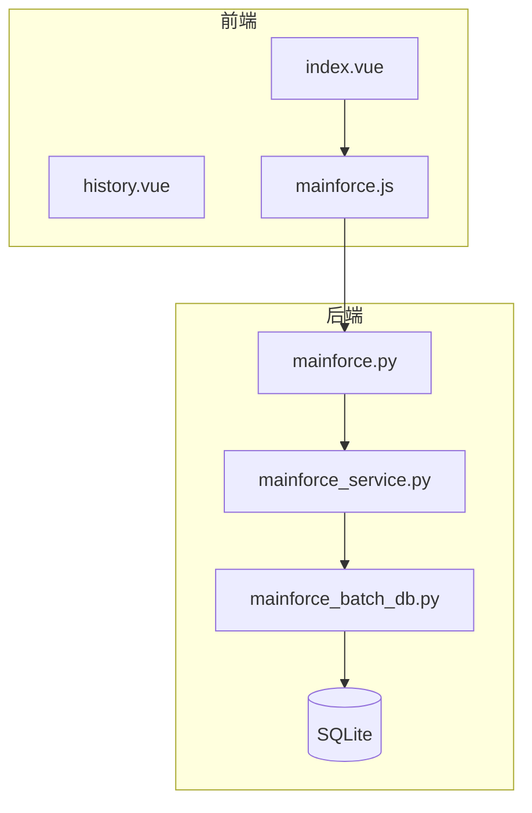
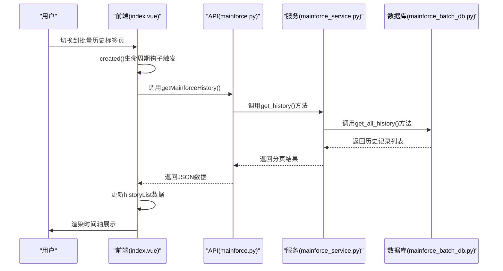
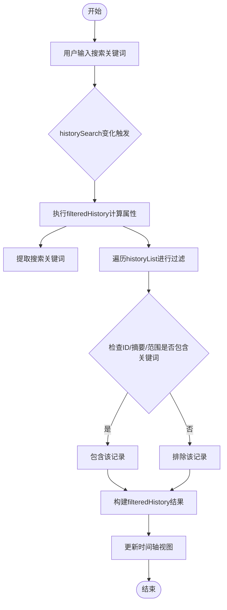
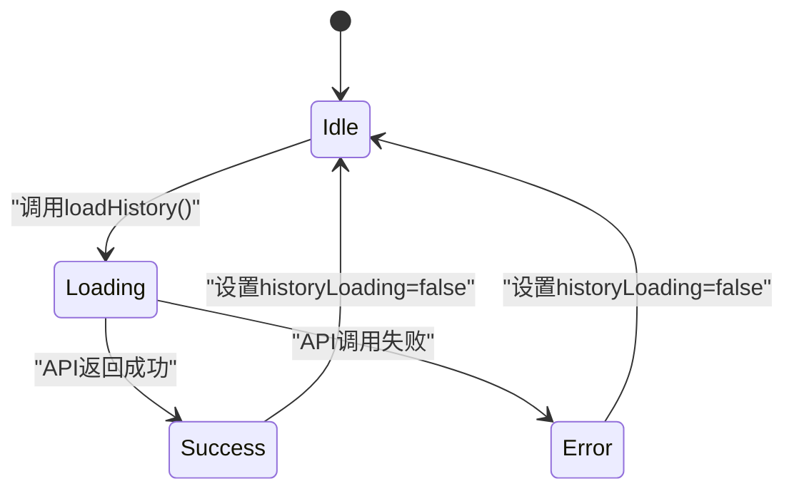
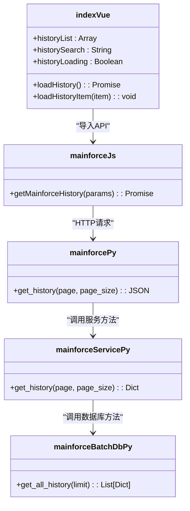

# 前端历史记录展示

<cite>
**本文档引用的文件**  
- [index.vue](file://frontend/src/views/mainforce/index.vue)
- [mainforce.js](file://frontend/src/api/mainforce.js)
- [history.vue](file://frontend/src/views/mainforce/history.vue)
- [mainforce.py](file://backend/app/api/v1/mainforce.py)
- [mainforce_service.py](file://backend/app/services/mainforce_service.py)
- [mainforce_batch_db.py](file://backend/app/db/mainforce_batch_db.py)
</cite>

## 目录
1. [简介](#简介)
2. [项目结构](#项目结构)
3. [核心组件](#核心组件)
4. [架构概览](#架构概览)
5. [详细组件分析](#详细组件分析)
6. [依赖分析](#依赖分析)
7. [性能考虑](#性能考虑)
8. [故障排除指南](#故障排除指南)
9. [结论](#结论)

## 简介
本文档全面阐述主力选股历史记录在前端的展示逻辑与交互设计。详细说明`index.vue`组件如何通过调用`mainforce.js`中的API方法获取历史数据，并使用时间轴布局呈现分析批次。解释搜索过滤功能的实现，包括日期选择器、状态筛选下拉框和关键词搜索的双向绑定机制。描述分页组件的集成方式和性能优化（如虚拟滚动）。提供UI状态管理方案，包括加载中、无数据、错误提示等场景的处理。包含界面截图建议和响应式设计适配方案，确保在不同设备上的可用性。

## 项目结构
主力选股历史记录功能主要由前端和后端两部分组成。前端位于`frontend/src/views/mainforce/`目录下，包含`index.vue`和`history.vue`两个主要组件文件。后端API位于`backend/app/api/v1/mainforce.py`，服务逻辑在`backend/app/services/mainforce_service.py`中实现，数据存储使用`backend/app/db/mainforce_batch_db.py`中的SQLite数据库。

**图示来源**  
- [index.vue](file://frontend/src/views/mainforce/index.vue)
- [mainforce.js](file://frontend/src/api/mainforce.js)
- [mainforce.py](file://backend/app/api/v1/mainforce.py)
- [mainforce_service.py](file://backend/app/services/mainforce_service.py)
- [mainforce_batch_db.py](file://backend/app/db/mainforce_batch_db.py)

**本节来源**  
- [index.vue](file://frontend/src/views/mainforce/index.vue)
- [mainforce.js](file://frontend/src/api/mainforce.js)
- [mainforce.py](file://backend/app/api/v1/mainforce.py)
- [mainforce_service.py](file://backend/app/services/mainforce_service.py)
- [mainforce_batch_db.py](file://backend/app/db/mainforce_batch_db.py)

## 核心组件
主力选股历史记录的核心组件是`index.vue`中的"📚 批量历史"标签页，它集成了时间轴展示、搜索过滤、刷新功能和详情查看等交互元素。该组件通过调用`mainforce.js`中的`getMainforceHistory` API方法获取历史数据，并使用Element UI的`el-timeline`组件进行可视化展示。

**本节来源**  
- [index.vue](file://frontend/src/views/mainforce/index.vue#L242-L281)
- [mainforce.js](file://frontend/src/api/mainforce.js#L22-L28)

## 架构概览
系统采用前后端分离架构，前端通过RESTful API与后端通信。历史记录数据存储在SQLite数据库中，后端提供分页查询接口，前端负责数据展示和用户交互。

**图示来源**  
- [index.vue](file://frontend/src/views/mainforce/index.vue#L524-L526)
- [mainforce.js](file://frontend/src/api/mainforce.js#L22-L28)
- [mainforce.py](file://backend/app/api/v1/mainforce.py#L48-L61)
- [mainforce_service.py](file://backend/app/services/mainforce_service.py#L208-L234)
- [mainforce_batch_db.py](file://backend/app/db/mainforce_batch_db.py#L149-L193)

## 详细组件分析

### 主力选股历史记录分析
`index.vue`组件中的"📚 批量历史"标签页实现了历史记录的完整展示逻辑。当用户进入该页面时，`created()`生命周期钩子会自动调用`loadHistory()`方法加载历史数据。

#### 搜索过滤功能实现
搜索过滤功能通过`v-model`双向绑定实现，`historySearch`数据属性与搜索输入框关联。过滤逻辑在`filteredHistory`计算属性中实现，支持对ID、摘要和时间范围的关键词搜索。

**图示来源**  
- [index.vue](file://frontend/src/views/mainforce/index.vue#L514-L523)

#### 时间轴布局呈现
历史记录使用Element UI的`el-timeline`组件进行展示，每个`el-timeline-item`代表一个分析批次。时间轴项包含批次ID、摘要信息、时间范围、成功数量和耗时等关键指标，并提供"查看详情"按钮。

**本节来源**  
- [index.vue](file://frontend/src/views/mainforce/index.vue#L254-L279)

### UI状态管理方案
系统实现了完整的UI状态管理，涵盖加载中、无数据和错误提示等场景。

#### 加载状态
当调用API获取历史数据时，`historyLoading`标志被设置为true，显示加载动画。加载完成后，无论成功或失败，都会将该标志重置为false。

**图示来源**  
- [index.vue](file://frontend/src/views/mainforce/index.vue#L634-L646)

#### 无数据状态
当过滤后没有匹配的历史记录时，系统会显示`el-empty`组件，提示"暂无历史记录"。这是通过`v-if`指令和`filteredHistory.length === 0`条件判断实现的。

#### 错误处理
系统实现了完善的错误处理机制。当API调用失败时，会捕获异常，显示友好的错误提示消息，并加载示例数据以保证用户体验。

**本节来源**  
- [index.vue](file://frontend/src/views/mainforce/index.vue#L634-L646)

## 依赖分析
历史记录功能涉及多个文件的协同工作，形成了清晰的依赖链。

**图示来源**  
- [index.vue](file://frontend/src/views/mainforce/index.vue)
- [mainforce.js](file://frontend/src/api/mainforce.js)
- [mainforce.py](file://backend/app/api/v1/mainforce.py)
- [mainforce_service.py](file://backend/app/services/mainforce_service.py)
- [mainforce_batch_db.py](file://backend/app/db/mainforce_batch_db.py)

**本节来源**  
- [index.vue](file://frontend/src/views/mainforce/index.vue)
- [mainforce.js](file://frontend/src/api/mainforce.js)
- [mainforce.py](file://backend/app/api/v1/mainforce.py)
- [mainforce_service.py](file://backend/app/services/mainforce_service.py)
- [mainforce_batch_db.py](file://backend/app/db/mainforce_batch_db.py)

## 性能考虑
系统在性能方面进行了多项优化：

1. **分页查询**：后端API支持分页参数（page和page_size），避免一次性加载过多数据。
2. **前端缓存**：`candidateCsvCache`用于缓存导出的CSV数据，避免重复生成。
3. **异步加载**：所有API调用均使用async/await，避免阻塞UI线程。
4. **虚拟滚动**：虽然当前未实现，但建议在数据量大时使用虚拟滚动优化时间轴性能。

**本节来源**  
- [mainforce_service.py](file://backend/app/services/mainforce_service.py#L221-L223)
- [index.vue](file://frontend/src/views/mainforce/index.vue#L467-L470)

## 故障排除指南
### 常见问题及解决方案

| 问题现象 | 可能原因 | 解决方案 |
|---------|--------|---------|
| 历史记录无法加载 | 后端API服务未启动 | 检查后端服务状态，确保`start_server.bat`已正确运行 |
| 搜索功能无效 | 过滤逻辑错误 | 检查`filteredHistory`计算属性的实现 |
| 时间轴显示异常 | 数据格式不匹配 | 检查API返回的数据结构是否符合预期 |
| 加载动画一直显示 | 异常未被捕获 | 检查`loadHistory`方法中的try-catch块 |

**本节来源**  
- [index.vue](file://frontend/src/views/mainforce/index.vue#L634-L646)
- [mainforce.py](file://backend/app/api/v1/mainforce.py#L48-L61)

## 结论
主力选股历史记录功能通过前后端协同工作，实现了历史分析批次的可视化展示。前端使用时间轴布局清晰呈现各批次信息，结合搜索过滤功能提供良好的用户体验。系统具备完善的错误处理和状态管理机制，确保在各种场景下都能提供稳定的服务。建议后续版本实现`history.vue`的完整功能，并考虑在数据量大时引入虚拟滚动优化性能。