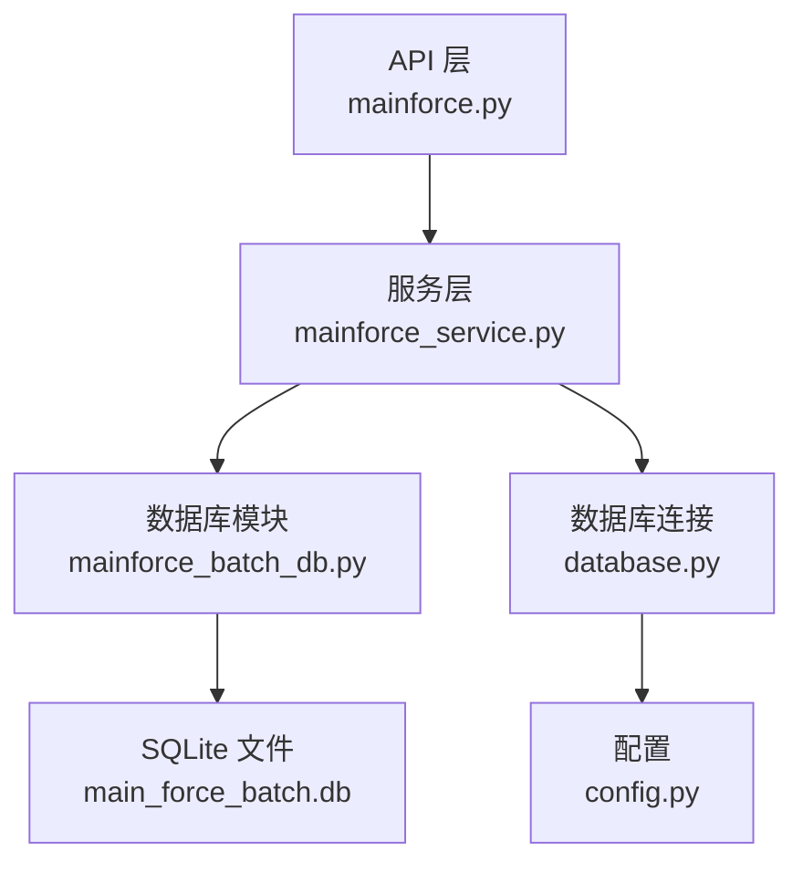
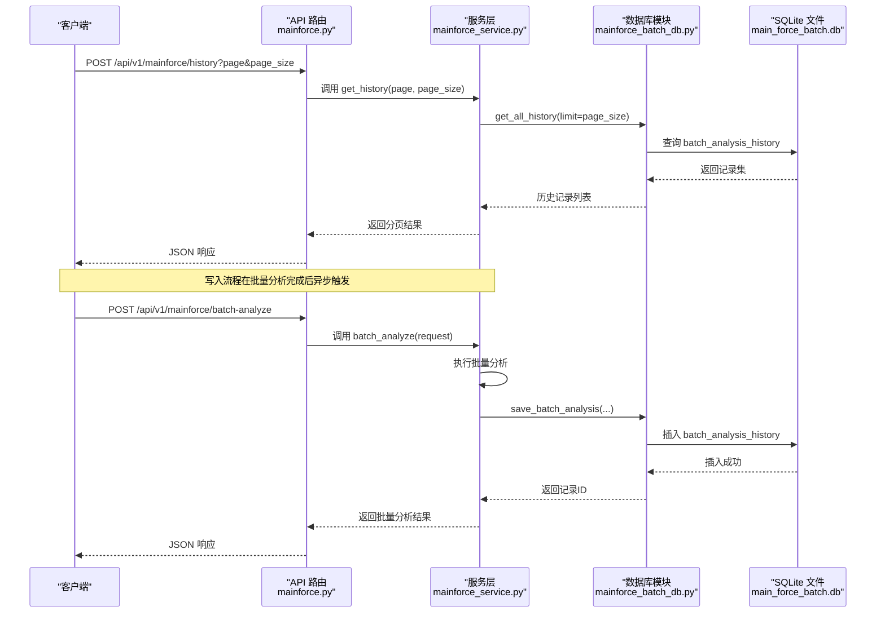
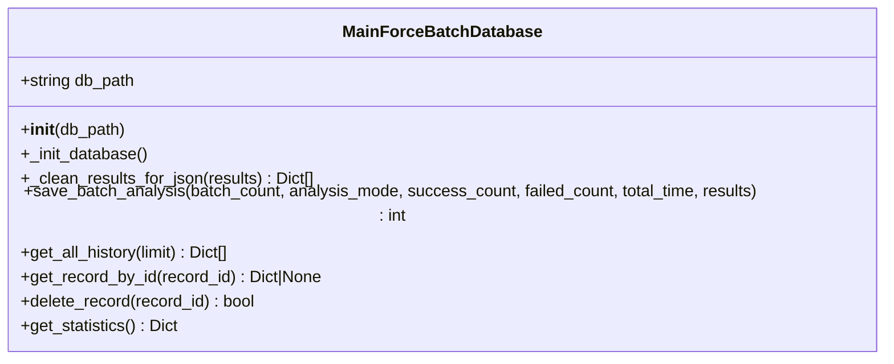
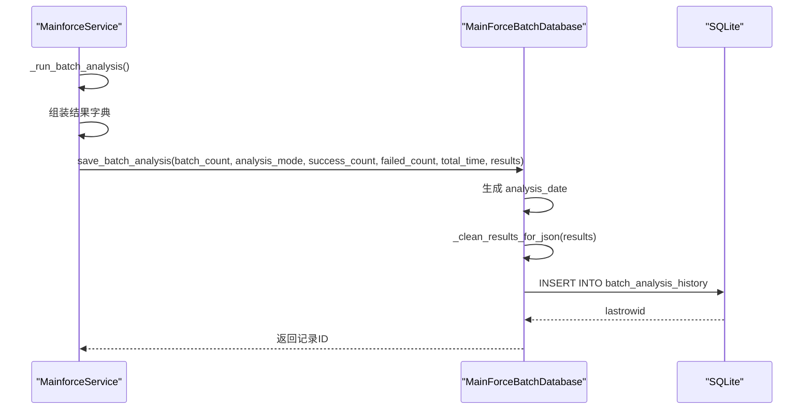
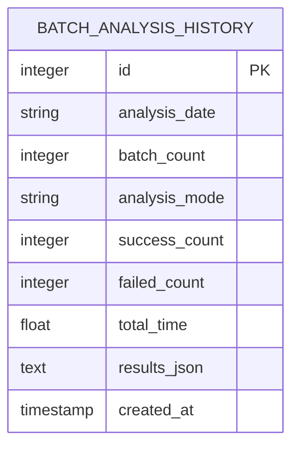
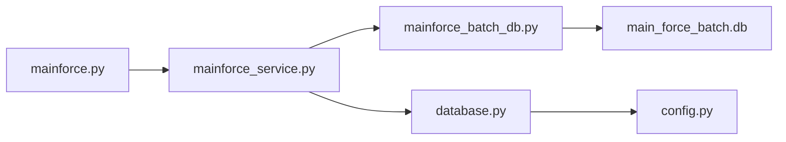

# 历史记录存储机制

<cite>
**本文引用的文件**
- [mainforce_batch_db.py](file://backend/app/db/mainforce_batch_db.py)
- [mainforce_service.py](file://backend/app/services/mainforce_service.py)
- [mainforce.py](file://backend/app/api/v1/mainforce.py)
- [database.py](file://backend/app/database.py)
- [analysis.py](file://backend/app/models/analysis.py)
- [analysis.py](file://backend/app/schemas/analysis.py)
- [config.py](file://backend/app/config.py)
</cite>

## 目录
1. [简介](#简介)
2. [项目结构](#项目结构)
3. [核心组件](#核心组件)
4. [架构总览](#架构总览)
5. [详细组件分析](#详细组件分析)
6. [依赖关系分析](#依赖关系分析)
7. [性能考量](#性能考量)
8. [故障排查指南](#故障排查指南)
9. [结论](#结论)

## 简介
本文件聚焦“主力选股历史记录”的持久化存储实现，重点解析 backend/app/db/mainforce_batch_db.py 中的 MainForceBatchDatabase 类设计与使用方式，涵盖：
- 与 SQLAlchemy 模型映射关系的说明（注意：该模块未使用 SQLAlchemy ORM，而是直接使用 SQLite）
- 批次分析结果的字段定义与业务含义
- 索引优化策略
- 数据写入流程：从 MainforceService 触发分析任务，到 _batch_db.save_batch_analysis 方法将结果序列化并存入数据库的完整过程
- 数据库表结构示意与字段说明
- 异常处理机制与事务回滚策略

## 项目结构
围绕“主力选股历史记录”的关键文件组织如下：
- 数据访问层：backend/app/db/mainforce_batch_db.py（SQLite 直接操作）
- 业务服务层：backend/app/services/mainforce_service.py（调用数据库模块并暴露历史查询接口）
- API 层：backend/app/api/v1/mainforce.py（对外提供历史记录查询接口）
- 数据库连接与基础配置：backend/app/database.py、backend/app/config.py
- 其他分析相关模型与模式：backend/app/models/analysis.py、backend/app/schemas/analysis.py

图表来源
- [mainforce.py](file://backend/app/api/v1/mainforce.py#L1-L62)
- [mainforce_service.py](file://backend/app/services/mainforce_service.py#L1-L234)
- [mainforce_batch_db.py](file://backend/app/db/mainforce_batch_db.py#L1-L301)
- [database.py](file://backend/app/database.py#L1-L45)
- [config.py](file://backend/app/config.py#L1-L92)

章节来源
- [mainforce.py](file://backend/app/api/v1/mainforce.py#L1-L62)
- [mainforce_service.py](file://backend/app/services/mainforce_service.py#L1-L234)
- [mainforce_batch_db.py](file://backend/app/db/mainforce_batch_db.py#L1-L301)
- [database.py](file://backend/app/database.py#L1-L45)
- [config.py](file://backend/app/config.py#L1-L92)

## 核心组件
- MainForceBatchDatabase：负责 SQLite 表初始化、结果序列化、写入、查询、删除与统计汇总
- MainforceService：负责批量分析调度、聚合结果、调用数据库模块保存历史，并提供历史查询接口
- API 路由：对外提供历史记录查询接口，调用服务层并返回标准响应

章节来源
- [mainforce_batch_db.py](file://backend/app/db/mainforce_batch_db.py#L1-L301)
- [mainforce_service.py](file://backend/app/services/mainforce_service.py#L1-L234)
- [mainforce.py](file://backend/app/api/v1/mainforce.py#L1-L62)

## 架构总览
下图展示从 API 到服务再到数据库的历史记录写入与查询链路。

图表来源
- [mainforce.py](file://backend/app/api/v1/mainforce.py#L1-L62)
- [mainforce_service.py](file://backend/app/services/mainforce_service.py#L75-L234)
- [mainforce_batch_db.py](file://backend/app/db/mainforce_batch_db.py#L105-L148)

## 详细组件分析

### MainForceBatchDatabase 类设计与字段定义
- 类职责
  - 初始化 SQLite 表结构（batch_analysis_history）
  - 提供保存、查询、删除、统计等能力
  - 对复杂对象进行 JSON 序列化清洗，保证入库安全

- 关键字段与业务含义
  - id：自增主键
  - analysis_date：分析日期时间（字符串）
  - batch_count：本次分析的股票数量
  - analysis_mode：分析模式（sequential/parallel）
  - success_count：成功数量
  - failed_count：失败数量
  - total_time：总耗时（秒）
  - results_json：分析结果的 JSON 文本
  - created_at：记录创建时间（自动写入）

- 字段类型与约束
  - id：INTEGER PRIMARY KEY AUTOINCREMENT
  - analysis_date：TEXT NOT NULL
  - batch_count：INTEGER NOT NULL
  - analysis_mode：TEXT NOT NULL
  - success_count：INTEGER NOT NULL
  - failed_count：INTEGER NOT NULL
  - total_time：REAL NOT NULL
  - results_json：TEXT NOT NULL
  - created_at：TIMESTAMP DEFAULT CURRENT_TIMESTAMP

- 索引优化策略
  - idx_analysis_date：对 analysis_date 建立索引，便于按日期范围检索
  - created_at：查询默认按 created_at DESC 排序，有利于分页与最新记录优先展示

- 数据写入流程要点
  - 生成 analysis_date（当前时间）
  - 清洗 results：将 DataFrame/Series 等非 JSON 可序列化对象转换为字典/列表，必要时截断以控制大小
  - 将清洗后的 results 转为 JSON 文本
  - 插入 batch_analysis_history，提交事务并返回 lastrowid

- 查询与统计
  - get_all_history：按 created_at 降序返回指定条数
  - get_record_by_id：按 id 查询单条记录
  - delete_record：按 id 删除
  - get_statistics：计算总记录数、总分析股票数、总成功/失败数、平均耗时与成功率

- 异常处理与事务回滚
  - 写入：每个操作独立建立连接、提交；未显式开启事务块，采用默认提交行为
  - 读取：捕获 JSON 解析异常，回退为空列表，保证健壮性
  - 删除：返回受影响行数是否大于 0 的布尔判断

图表来源
- [mainforce_batch_db.py](file://backend/app/db/mainforce_batch_db.py#L1-L301)

章节来源
- [mainforce_batch_db.py](file://backend/app/db/mainforce_batch_db.py#L1-L301)

### 批量分析历史写入流程（从 MainforceService 到数据库）
- 触发点
  - MainforceService.batch_analyze 完成批量分析后，异步调用 _save_batch_history
- 写入步骤
  - 从结果中提取 total、success、failed、elapsed_time、analysis_mode、results
  - 通过 app.db.mainforce_batch_db.batch_db.save_batch_analysis 写入
  - 该方法内部完成 analysis_date 生成、results 清洗与 JSON 序列化、INSERT、commit
- 异常处理
  - _save_batch_history 中捕获异常并记录日志，不影响主流程继续返回结果
  - 若外部调用 get_history，服务层在异步线程池中执行数据库查询，异常会被上抛

图表来源
- [mainforce_service.py](file://backend/app/services/mainforce_service.py#L75-L206)
- [mainforce_batch_db.py](file://backend/app/db/mainforce_batch_db.py#L105-L148)

章节来源
- [mainforce_service.py](file://backend/app/services/mainforce_service.py#L75-L206)
- [mainforce_batch_db.py](file://backend/app/db/mainforce_batch_db.py#L105-L148)

### 数据库表结构示意
以下 ER 图展示 batch_analysis_history 的字段与业务含义。

图表来源
- [mainforce_batch_db.py](file://backend/app/db/mainforce_batch_db.py#L27-L41)

章节来源
- [mainforce_batch_db.py](file://backend/app/db/mainforce_batch_db.py#L27-L41)

### 与 SQLAlchemy 模型的关系说明
- 当前实现采用 SQLite 直接操作，未使用 SQLAlchemy ORM
- 与 SQLAlchemy 模型 analysis.py 中的 AnalysisHistory（analysis_history 表）属于不同用途：
  - AnalysisHistory：通用分析历史记录（文本内容 JSON 存储）
  - batch_analysis_history：主力选股批量分析历史记录（结构化字段+JSON 结果）
- 若未来需要统一 ORM，可在 models 下新增对应表模型，并通过 database.py 的 Base 进行映射

章节来源
- [analysis.py](file://backend/app/models/analysis.py#L1-L19)
- [database.py](file://backend/app/database.py#L1-L45)

## 依赖关系分析
- API 层依赖服务层，服务层依赖数据库模块
- 数据库模块依赖 SQLite 文件（默认路径由配置决定）
- 服务层在历史查询时使用线程池执行阻塞式数据库操作，避免阻塞事件循环

图表来源
- [mainforce.py](file://backend/app/api/v1/mainforce.py#L1-L62)
- [mainforce_service.py](file://backend/app/services/mainforce_service.py#L1-L234)
- [mainforce_batch_db.py](file://backend/app/db/mainforce_batch_db.py#L1-L301)
- [database.py](file://backend/app/database.py#L1-L45)
- [config.py](file://backend/app/config.py#L1-L92)

章节来源
- [mainforce.py](file://backend/app/api/v1/mainforce.py#L1-L62)
- [mainforce_service.py](file://backend/app/services/mainforce_service.py#L1-L234)
- [mainforce_batch_db.py](file://backend/app/db/mainforce_batch_db.py#L1-L301)
- [database.py](file://backend/app/database.py#L1-L45)
- [config.py](file://backend/app/config.py#L1-L92)

## 性能考量
- JSON 序列化清洗
  - 对 DataFrame/Series 等大对象进行截断（保留前若干行），降低 JSON 文本体积
  - 对不可序列化对象尝试 str 转换，避免写入失败
- 索引
  - 为 analysis_date 建立索引，提升按日期筛选效率
- 查询优化
  - 默认按 created_at DESC 排序，利于分页与最新记录优先
  - 通过 limit 控制返回数量，避免一次性拉取过多数据
- 并发与线程池
  - 历史查询在异步线程池中执行，避免阻塞 FastAPI 事件循环

章节来源
- [mainforce_batch_db.py](file://backend/app/db/mainforce_batch_db.py#L51-L104)
- [mainforce_batch_db.py](file://backend/app/db/mainforce_batch_db.py#L42-L47)
- [mainforce_service.py](file://backend/app/services/mainforce_service.py#L216-L234)

## 故障排查指南
- 写入失败
  - 检查数据库文件路径是否存在且可写（SQLite 路径由配置决定）
  - 确认 results 中对象是否可被清洗为 JSON（DataFrame/Series 会被转换）
- 读取异常
  - 若 results_json 不是合法 JSON，将回退为空列表；检查写入阶段是否发生异常
- 删除失败
  - delete_record 返回 False 表示未影响任何行；确认 record_id 是否正确
- 统计异常
  - get_statistics 对空表返回默认值；确认表是否已初始化
- 事务与并发
  - 当前实现未显式开启事务块；若需强一致，可在 save_batch_analysis 中包裹事务逻辑（建议）

章节来源
- [mainforce_batch_db.py](file://backend/app/db/mainforce_batch_db.py#L105-L148)
- [mainforce_batch_db.py](file://backend/app/db/mainforce_batch_db.py#L149-L235)
- [mainforce_batch_db.py](file://backend/app/db/mainforce_batch_db.py#L258-L298)
- [config.py](file://backend/app/config.py#L27-L29)

## 结论
- 本实现采用 SQLite 直接操作，简化了部署与维护成本，适合中小规模历史记录存储
- MainForceBatchDatabase 提供了完整的写入、查询、删除与统计能力，并对复杂对象进行 JSON 清洗
- 写入流程从 MainforceService 触发，经数据库模块落库，API 层提供历史查询接口
- 建议在未来引入 SQLAlchemy ORM 时，统一模型与迁移工具，同时考虑事务封装与并发控制