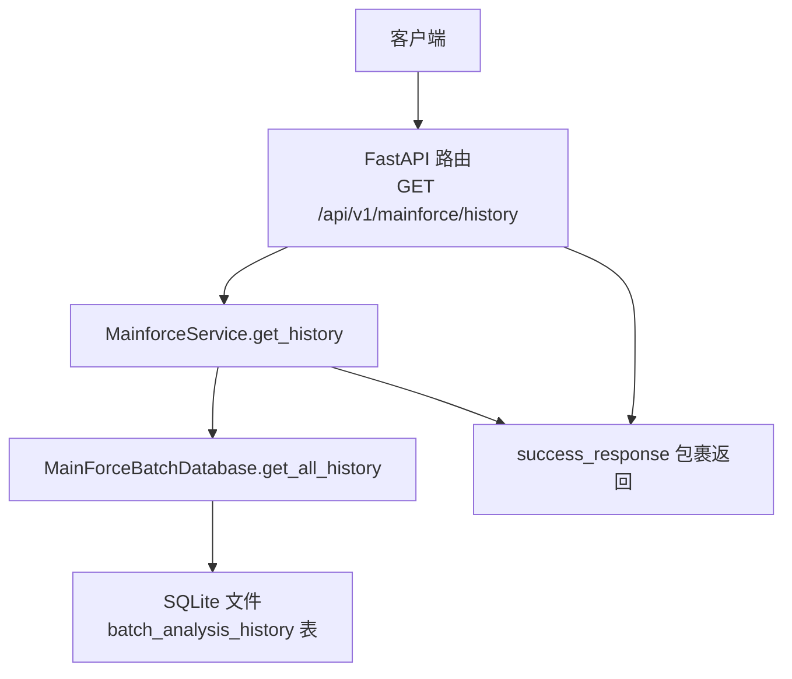
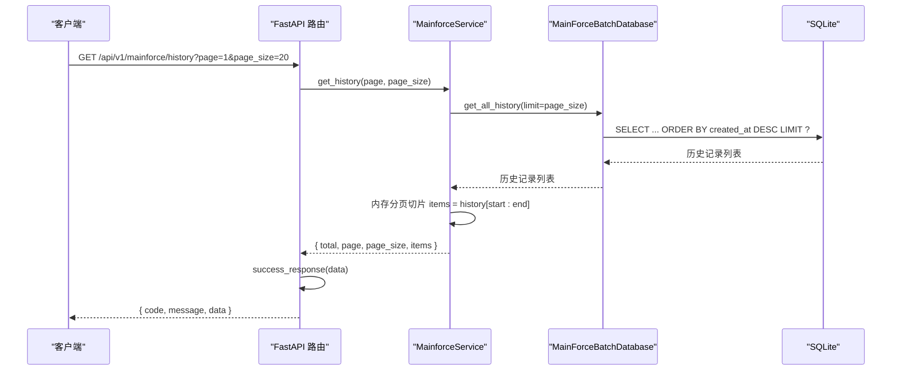
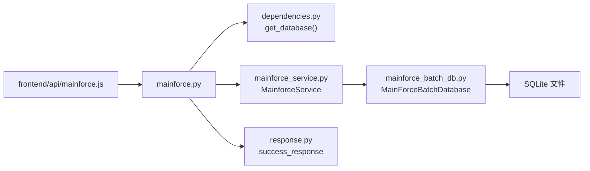

# 历史记录查询接口

<cite>
**本文引用的文件**
- [backend/app/api/v1/mainforce.py](file://backend/app/api/v1/mainforce.py)
- [backend/app/services/mainforce_service.py](file://backend/app/services/mainforce_service.py)
- [backend/app/db/mainforce_batch_db.py](file://backend/app/db/mainforce_batch_db.py)
- [backend/app/api/response.py](file://backend/app/api/response.py)
- [backend/app/dependencies.py](file://backend/app/dependencies.py)
- [backend/app/database.py](file://backend/app/database.py)
- [backend/app/schemas/stock.py](file://backend/app/schemas/stock.py)
- [frontend/src/api/mainforce.js](file://frontend/src/api/mainforce.js)
</cite>

## 目录
1. [简介](#简介)
2. [项目结构](#项目结构)
3. [核心组件](#核心组件)
4. [架构总览](#架构总览)
5. [详细组件分析](#详细组件分析)
6. [依赖分析](#依赖分析)
7. [性能考虑](#性能考虑)
8. [故障排查指南](#故障排查指南)
9. [结论](#结论)
10. [附录](#附录)

## 简介
本文件聚焦“主力选股历史记录”的查询服务实现，围绕 API 层的 get_history 接口与服务层 MainforceService.get_history 的业务逻辑展开，详细说明分页参数处理、时间范围过滤、状态筛选等查询条件的构建方式；文档化请求/响应的 JSON 结构（含分页元数据 total/page/page_size 与历史记录列表字段）；解释查询性能优化措施（数据库索引、结果缓存策略、懒加载配置）；并提供典型查询场景的 curl 示例与错误码说明。

## 项目结构
- API 层：在路由中暴露 GET /api/v1/mainforce/history，负责接收 HTTP 请求并调用服务层。
- 服务层：MainforceService 封装业务逻辑，异步执行数据库读取并进行内存分页。
- 数据层：MainForceBatchDatabase 提供 SQLite 表结构、索引与查询接口。
- 响应封装：统一 success_response 包裹业务数据。
- 依赖注入：get_database 提供数据库会话。

图表来源
- [backend/app/api/v1/mainforce.py](file://backend/app/api/v1/mainforce.py#L48-L61)
- [backend/app/services/mainforce_service.py](file://backend/app/services/mainforce_service.py#L208-L234)
- [backend/app/db/mainforce_batch_db.py](file://backend/app/db/mainforce_batch_db.py#L149-L192)
- [backend/app/api/response.py](file://backend/app/api/response.py#L10-L16)

章节来源
- [backend/app/api/v1/mainforce.py](file://backend/app/api/v1/mainforce.py#L1-L62)
- [backend/app/services/mainforce_service.py](file://backend/app/services/mainforce_service.py#L1-L235)
- [backend/app/db/mainforce_batch_db.py](file://backend/app/db/mainforce_batch_db.py#L1-L302)
- [backend/app/api/response.py](file://backend/app/api/response.py#L1-L31)
- [backend/app/dependencies.py](file://backend/app/dependencies.py#L1-L15)
- [backend/app/database.py](file://backend/app/database.py#L1-L45)

## 核心组件
- API 层接口：GET /api/v1/mainforce/history，接收 page、page_size 参数，调用服务层并返回统一响应结构。
- 服务层方法：MainforceService.get_history，异步从数据库读取历史记录，再在内存中进行简单分页切片。
- 数据层模块：MainForceBatchDatabase，提供 SQLite 表 batch_analysis_history 的建表、索引、查询与统计能力。
- 响应封装：success_response(data) 返回 { code, message, data }，其中 data 为分页结果对象。

章节来源
- [backend/app/api/v1/mainforce.py](file://backend/app/api/v1/mainforce.py#L48-L61)
- [backend/app/services/mainforce_service.py](file://backend/app/services/mainforce_service.py#L208-L234)
- [backend/app/db/mainforce_batch_db.py](file://backend/app/db/mainforce_batch_db.py#L149-L192)
- [backend/app/api/response.py](file://backend/app/api/response.py#L10-L16)

## 架构总览
下图展示从客户端到数据库的历史记录查询链路，以及各层职责与数据流转。

图表来源
- [backend/app/api/v1/mainforce.py](file://backend/app/api/v1/mainforce.py#L48-L61)
- [backend/app/services/mainforce_service.py](file://backend/app/services/mainforce_service.py#L208-L234)
- [backend/app/db/mainforce_batch_db.py](file://backend/app/db/mainforce_batch_db.py#L149-L192)

## 详细组件分析

### API 层：get_history 接口
- 路由定义：GET /api/v1/mainforce/history
- 查询参数：
  - page：当前页，默认 1
  - page_size：每页大小，默认 20
- 依赖注入：通过 get_database() 获取 SQLAlchemy Session
- 业务调用：构造 MainforceService(db)，调用 get_history(page, page_size)
- 响应封装：success_response(result) 包裹分页结果对象

章节来源
- [backend/app/api/v1/mainforce.py](file://backend/app/api/v1/mainforce.py#L48-L61)
- [backend/app/dependencies.py](file://backend/app/dependencies.py#L1-L15)

### 服务层：MainforceService.get_history
- 异步执行：使用 asyncio.to_thread 调用数据库模块的 get_all_history，避免阻塞事件循环
- 数据读取：limit=page_size，仅拉取必要的记录上限
- 内存分页：计算起止索引 start_idx、end_idx，对完整列表进行切片得到 items
- 返回结构：
  - total：完整列表长度（未做数据库层面的 count 查询）
  - page：当前页
  - page_size：每页大小
  - items：当前页的历史记录列表

注意
- 当前实现采用“先拉取上限、再内存切片”的简单分页策略，未在数据库层做 offset/limit 分页与 count 查询，因此 total 仅反映已拉取的记录总数。

章节来源
- [backend/app/services/mainforce_service.py](file://backend/app/services/mainforce_service.py#L208-L234)

### 数据层：MainForceBatchDatabase
- 表结构：batch_analysis_history
  - 字段：id、analysis_date、batch_count、analysis_mode、success_count、failed_count、total_time、results_json、created_at
- 索引：idx_analysis_date（analysis_date 列）
- 查询接口：
  - get_all_history(limit)：按 created_at 降序返回最多 limit 条记录
  - get_record_by_id(id)：按 id 查询单条记录
  - delete_record(id)：删除记录
  - get_statistics()：统计总记录数、总分析股票数、总成功/失败数、平均耗时与成功率
- JSON 序列化：results_json 字段存储清洗后的 results 列表，支持 DataFrame/Series 等对象的序列化与截断

章节来源
- [backend/app/db/mainforce_batch_db.py](file://backend/app/db/mainforce_batch_db.py#L1-L302)

### 响应与请求结构

- 请求
  - 方法：GET
  - 路径：/api/v1/mainforce/history
  - 查询参数：
    - page：整数，当前页（默认 1）
    - page_size：整数，每页大小（默认 20）

- 响应
  - 统一结构：success_response(data)
  - data 字段包含：
    - total：整数，本次查询返回的 items 数量
    - page：整数，当前页
    - page_size：整数，每页大小
    - items：数组，历史记录列表，每条记录包含：
      - id：整数
      - analysis_date：字符串（YYYY-MM-DD HH:MM:SS）
      - batch_count：整数
      - analysis_mode：字符串（sequential/parallel）
      - success_count：整数
      - failed_count：整数
      - total_time：浮点数（秒）
      - results：数组（原始 results_json 解析后的数组）
      - created_at：字符串（记录创建时间）

- 错误响应
  - 统一结构：error_response 或 HTTP 500
  - code：500
  - message：错误描述
  - data：空或具体错误上下文

章节来源
- [backend/app/api/v1/mainforce.py](file://backend/app/api/v1/mainforce.py#L48-L61)
- [backend/app/api/response.py](file://backend/app/api/response.py#L10-L16)
- [backend/app/db/mainforce_batch_db.py](file://backend/app/db/mainforce_batch_db.py#L149-L192)

### 查询条件与过滤说明
- 分页参数处理：API 层接收 page、page_size；服务层将其用于内存切片
- 时间范围过滤：当前实现未提供时间范围过滤参数；get_all_history 仅按 created_at DESC 限制返回条数
- 状态筛选：当前实现未提供 analysis_mode 等状态筛选参数
- 建议扩展：
  - 在 API 层增加 start_date、end_date、analysis_mode 等查询参数
  - 在服务层将筛选条件传递给数据库层
  - 在数据库层增加复合索引以提升查询效率（例如 idx_created_at 或 idx_analysis_mode_created_at）

章节来源
- [backend/app/api/v1/mainforce.py](file://backend/app/api/v1/mainforce.py#L48-L61)
- [backend/app/db/mainforce_batch_db.py](file://backend/app/db/mainforce_batch_db.py#L149-L192)

### 典型查询场景与 curl 示例
- 获取第一页，每页 20 条
  - curl -i "http://localhost:8000/api/v1/mainforce/history?page=1&page_size=20"
- 获取第二页，每页 50 条
  - curl -i "http://localhost:8000/api/v1/mainforce/history?page=2&page_size=50"

章节来源
- [backend/app/api/v1/mainforce.py](file://backend/app/api/v1/mainforce.py#L48-L61)

## 依赖分析
- API 层依赖：
  - 依赖注入：get_database() 提供 Session
  - 响应封装：success_response
  - 服务层：MainforceService
- 服务层依赖：
  - 数据库模块：MainForceBatchDatabase
  - 异步执行：asyncio.to_thread
- 数据库层依赖：
  - SQLite：本地文件存储，表 batch_analysis_history
  - 索引：idx_analysis_date
- 前端交互：
  - 前端通过 /api/v1/mainforce/history 发起 GET 请求

图表来源
- [backend/app/api/v1/mainforce.py](file://backend/app/api/v1/mainforce.py#L1-L62)
- [backend/app/dependencies.py](file://backend/app/dependencies.py#L1-L15)
- [backend/app/services/mainforce_service.py](file://backend/app/services/mainforce_service.py#L1-L235)
- [backend/app/db/mainforce_batch_db.py](file://backend/app/db/mainforce_batch_db.py#L1-L302)
- [backend/app/api/response.py](file://backend/app/api/response.py#L1-L31)
- [frontend/src/api/mainforce.js](file://frontend/src/api/mainforce.js#L1-L30)

章节来源
- [backend/app/api/v1/mainforce.py](file://backend/app/api/v1/mainforce.py#L1-L62)
- [backend/app/dependencies.py](file://backend/app/dependencies.py#L1-L15)
- [backend/app/services/mainforce_service.py](file://backend/app/services/mainforce_service.py#L1-L235)
- [backend/app/db/mainforce_batch_db.py](file://backend/app/db/mainforce_batch_db.py#L1-L302)
- [backend/app/api/response.py](file://backend/app/api/response.py#L1-L31)
- [frontend/src/api/mainforce.js](file://frontend/src/api/mainforce.js#L1-L30)

## 性能考虑
- 数据库索引
  - 已有索引：idx_analysis_date（analysis_date）
  - 建议新增索引：idx_created_at（created_at），以支持按时间范围过滤与排序
- 查询优化
  - 当前 get_all_history 仅限制返回条数，未做 offset/limit 分页与 count 查询
  - 若需支持大数据量分页与准确 total，建议：
    - 在数据库层实现分页与 count 查询
    - 对 analysis_mode、created_at 等常用过滤字段建立复合索引
- 结果缓存
  - 当前未实现缓存策略
  - 建议：对高频查询（如最近 N 条）增加短期缓存（如 Redis），并设置失效时间
- 懒加载配置
  - results_json 字段已做 JSON 解析与异常兜底，避免解析失败导致整体查询中断
  - 建议：对 results 进行分页或延迟解析，减少单次响应体体积

章节来源
- [backend/app/db/mainforce_batch_db.py](file://backend/app/db/mainforce_batch_db.py#L1-L302)
- [backend/app/services/mainforce_service.py](file://backend/app/services/mainforce_service.py#L208-L234)

## 故障排查指南
- 常见错误
  - HTTP 500：服务层或数据库层抛出异常
  - 响应结构异常：返回非统一结构
- 定位步骤
  - 检查 API 层 get_history 是否正确调用服务层
  - 检查服务层 get_history 是否正确传参并返回
  - 检查数据库层 get_all_history 是否正常返回
  - 检查 SQLite 文件是否存在、权限是否正确
- 建议
  - 在服务层捕获异常并记录日志
  - 前端统一处理非 200 状态码与业务错误

章节来源
- [backend/app/api/v1/mainforce.py](file://backend/app/api/v1/mainforce.py#L48-L61)
- [backend/app/services/mainforce_service.py](file://backend/app/services/mainforce_service.py#L208-L234)
- [backend/app/database.py](file://backend/app/database.py#L1-L45)

## 结论
- 当前实现提供了简洁的历史记录查询能力：API 层接收分页参数，服务层异步读取并内存分页，返回统一响应结构。
- 查询条件较为基础，未包含时间范围与状态筛选；建议在 API 层增加参数并在数据库层实现相应过滤与索引。
- 性能方面可通过数据库索引、结果缓存与懒加载进一步优化。

## 附录

### 请求/响应字段定义
- 请求参数
  - page：整数，当前页（默认 1）
  - page_size：整数，每页大小（默认 20）

- 响应 data 字段
  - total：整数，本次查询返回的 items 数量
  - page：整数，当前页
  - page_size：整数，每页大小
  - items：数组，历史记录列表，每条记录字段：
    - id：整数
    - analysis_date：字符串（YYYY-MM-DD HH:MM:SS）
    - batch_count：整数
    - analysis_mode：字符串（sequential/parallel）
    - success_count：整数
    - failed_count：整数
    - total_time：浮点数（秒）
    - results：数组（原始 results_json 解析后的数组）
    - created_at：字符串（记录创建时间）

- 错误响应
  - code：500
  - message：错误描述
  - data：空或具体错误上下文

章节来源
- [backend/app/api/v1/mainforce.py](file://backend/app/api/v1/mainforce.py#L48-L61)
- [backend/app/api/response.py](file://backend/app/api/response.py#L10-L16)
- [backend/app/db/mainforce_batch_db.py](file://backend/app/db/mainforce_batch_db.py#L149-L192)