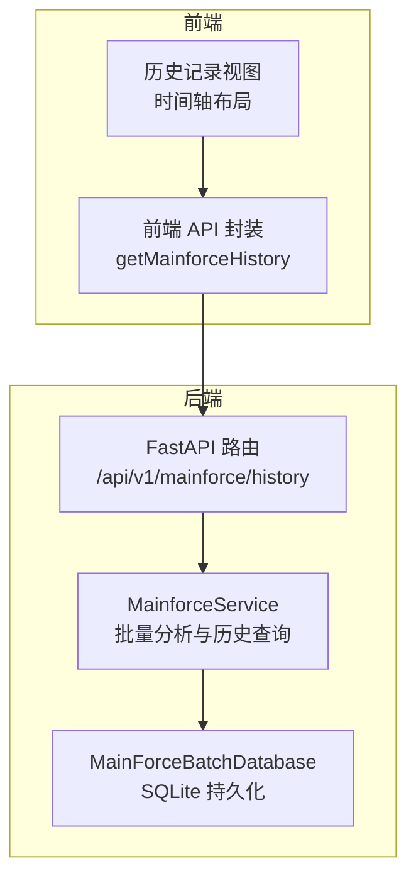
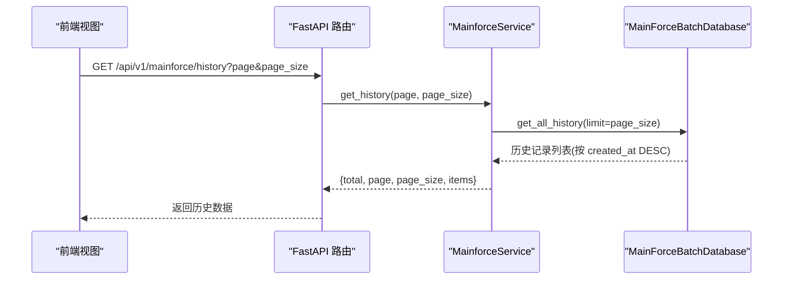
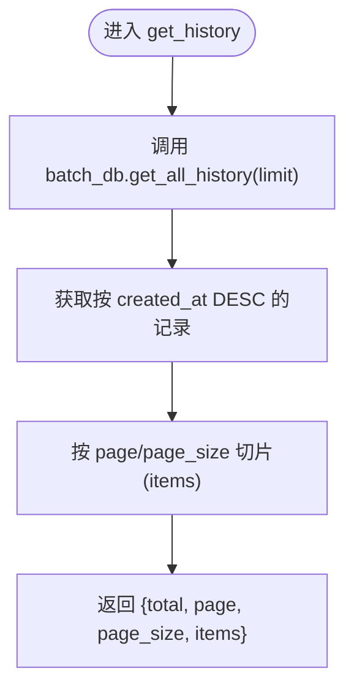
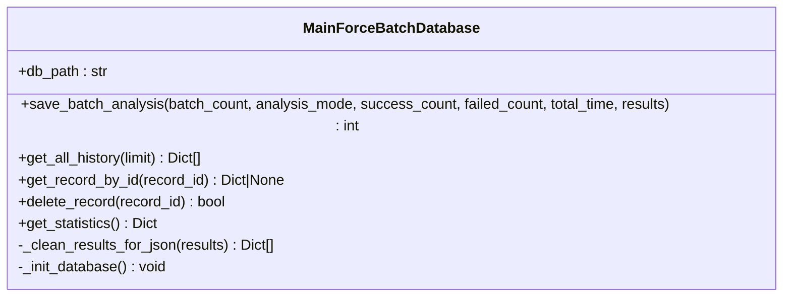
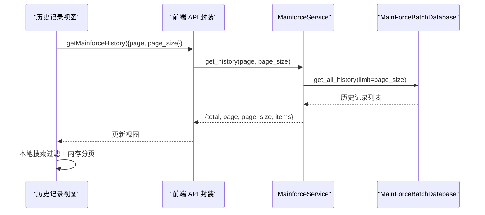

# 历史记录管理

<cite>
**本文引用的文件**
- [backend/app/services/mainforce_service.py](file://backend/app/services/mainforce_service.py)
- [backend/app/db/mainforce_batch_db.py](file://backend/app/db/mainforce_batch_db.py)
- [backend/app/api/v1/mainforce.py](file://backend/app/api/v1/mainforce.py)
- [backend/app/schemas/stock.py](file://backend/app/schemas/stock.py)
- [frontend/src/api/mainforce.js](file://frontend/src/api/mainforce.js)
- [frontend/src/views/mainforce/history/index.vue](file://frontend/src/views/mainforce/history/index.vue)
- [docs/主力选股批量分析历史记录功能说明.md](file://docs/主力选股批量分析历史记录功能说明.md)
</cite>

## 目录
1. [简介](#简介)
2. [项目结构](#项目结构)
3. [核心组件](#核心组件)
4. [架构总览](#架构总览)
5. [组件详解](#组件详解)
6. [依赖关系分析](#依赖关系分析)
7. [性能与扩展性](#性能与扩展性)
8. [故障排查](#故障排查)
9. [结论](#结论)
10. [附录](#附录)

## 简介
本文件聚焦“系统开发主力选股历史记录管理功能”，围绕以下目标展开：
- 解释 MainforceService.get_history 如何从数据库获取历史记录
- 说明 _batch_db.save_batch_analysis 如何保存批量分析结果
- 描述历史数据结构设计（批次统计、执行耗时、分析模式等关键字段）
- 说明前端历史记录的展示方式（时间轴布局）、搜索过滤与分页逻辑
- 提供数据库维护建议与数据清理策略，保障长期稳定运行

## 项目结构
历史记录管理涉及后端服务层、数据库层、API 层与前端视图层的协同：
- 后端服务层负责批量分析与历史记录的保存与查询
- 数据库层采用 SQLite，表结构用于持久化批次统计、模式、耗时与完整结果
- API 层提供历史记录查询接口
- 前端以时间轴卡片形式展示历史记录，支持搜索与分页

图表来源
- [backend/app/services/mainforce_service.py](file://backend/app/services/mainforce_service.py#L208-L234)
- [backend/app/db/mainforce_batch_db.py](file://backend/app/db/mainforce_batch_db.py#L149-L192)
- [backend/app/api/v1/mainforce.py](file://backend/app/api/v1/mainforce.py#L48-L61)
- [frontend/src/api/mainforce.js](file://frontend/src/api/mainforce.js#L21-L28)
- [frontend/src/views/mainforce/history/index.vue](file://frontend/src/views/mainforce/history/index.vue)

章节来源
- [backend/app/services/mainforce_service.py](file://backend/app/services/mainforce_service.py#L208-L234)
- [backend/app/db/mainforce_batch_db.py](file://backend/app/db/mainforce_batch_db.py#L149-L192)
- [backend/app/api/v1/mainforce.py](file://backend/app/api/v1/mainforce.py#L48-L61)
- [frontend/src/api/mainforce.js](file://frontend/src/api/mainforce.js#L21-L28)
- [frontend/src/views/mainforce/history/index.vue](file://frontend/src/views/mainforce/history/index.vue)

## 核心组件
- 主力选股服务（MainforceService）：封装批量分析、保存历史与历史查询
- 批量分析数据库（MainForceBatchDatabase）：SQLite 表结构与 CRUD 操作
- FastAPI 路由：对外暴露历史记录查询接口
- 前端 API 封装与历史视图：历史记录的展示、搜索与分页

章节来源
- [backend/app/services/mainforce_service.py](file://backend/app/services/mainforce_service.py#L26-L234)
- [backend/app/db/mainforce_batch_db.py](file://backend/app/db/mainforce_batch_db.py#L14-L301)
- [backend/app/api/v1/mainforce.py](file://backend/app/api/v1/mainforce.py#L1-L62)
- [frontend/src/api/mainforce.js](file://frontend/src/api/mainforce.js#L1-L30)
- [frontend/src/views/mainforce/history/index.vue](file://frontend/src/views/mainforce/history/index.vue)

## 架构总览
后端通过 MainforceService 调用 MainForceBatchDatabase 完成历史记录的保存与查询；前端通过 getMainforceHistory 请求历史记录，并以时间轴卡片展示。

图表来源
- [backend/app/api/v1/mainforce.py](file://backend/app/api/v1/mainforce.py#L48-L61)
- [backend/app/services/mainforce_service.py](file://backend/app/services/mainforce_service.py#L208-L234)
- [backend/app/db/mainforce_batch_db.py](file://backend/app/db/mainforce_batch_db.py#L149-L192)

## 组件详解

### 后端服务层：MainforceService
- 批量分析与保存
  - 批量分析入口：batch_analyze 接收 MainforceBatchAnalyzeRequest，异步在线程池中执行 _run_batch_analysis
  - 保存历史：_save_batch_history 调用 batch_db.save_batch_analysis，传入批次统计、模式、耗时与结果
- 历史查询
  - get_history 异步调用 batch_db.get_all_history(limit=page_size)，返回数据库中按 created_at 降序的记录
  - 服务层在内存中做简单分页（切片），返回 total/page/page_size/items

图表来源
- [backend/app/services/mainforce_service.py](file://backend/app/services/mainforce_service.py#L208-L234)
- [backend/app/db/mainforce_batch_db.py](file://backend/app/db/mainforce_batch_db.py#L149-L192)

章节来源
- [backend/app/services/mainforce_service.py](file://backend/app/services/mainforce_service.py#L75-L105)
- [backend/app/services/mainforce_service.py](file://backend/app/services/mainforce_service.py#L186-L207)
- [backend/app/services/mainforce_service.py](file://backend/app/services/mainforce_service.py#L208-L234)

### 数据库层：MainForceBatchDatabase
- 表结构
  - 表名：batch_analysis_history
  - 关键字段：analysis_date、batch_count、analysis_mode、success_count、failed_count、total_time、results_json、created_at
- 保存历史
  - save_batch_analysis 将 results 清洗为可 JSON 序列化格式，写入 results_json 字段
  - 清洗策略：DataFrame/Series 转换为字典或记录列表，限制 DataFrame 行数，其他对象转字符串
- 查询历史
  - get_all_history 按 created_at DESC 限制返回数量
  - get_record_by_id 支持按 id 查询单条记录
  - delete_record 支持删除记录
  - get_statistics 提供统计指标（总记录数、总分析股票数、成功/失败总数、平均耗时、成功率）

图表来源
- [backend/app/db/mainforce_batch_db.py](file://backend/app/db/mainforce_batch_db.py#L14-L301)

章节来源
- [backend/app/db/mainforce_batch_db.py](file://backend/app/db/mainforce_batch_db.py#L27-L41)
- [backend/app/db/mainforce_batch_db.py](file://backend/app/db/mainforce_batch_db.py#L105-L148)
- [backend/app/db/mainforce_batch_db.py](file://backend/app/db/mainforce_batch_db.py#L149-L192)
- [backend/app/db/mainforce_batch_db.py](file://backend/app/db/mainforce_batch_db.py#L194-L236)
- [backend/app/db/mainforce_batch_db.py](file://backend/app/db/mainforce_batch_db.py#L237-L257)
- [backend/app/db/mainforce_batch_db.py](file://backend/app/db/mainforce_batch_db.py#L258-L298)

### API 层：FastAPI 路由
- /api/v1/mainforce/history
  - 参数：page、page_size
  - 返回：success_response 包裹的分页结果

章节来源
- [backend/app/api/v1/mainforce.py](file://backend/app/api/v1/mainforce.py#L48-L61)

### 前端：历史记录视图与交互
- 展示方式
  - 时间轴布局：每个历史记录以卡片形式展示，时间戳显示 created_at
- 搜索与过滤
  - 支持输入关键词过滤（如股票代码或名称），前端在本地对历史列表进行过滤
- 分页逻辑
  - 服务端仅限制返回条数（limit=page_size），前端在内存中做分页切片
- 数据来源
  - 通过 getMainforceHistory(params) 调用后端接口获取历史数据

图表来源
- [frontend/src/api/mainforce.js](file://frontend/src/api/mainforce.js#L21-L28)
- [backend/app/services/mainforce_service.py](file://backend/app/services/mainforce_service.py#L208-L234)
- [backend/app/db/mainforce_batch_db.py](file://backend/app/db/mainforce_batch_db.py#L149-L192)

章节来源
- [frontend/src/views/mainforce/history/index.vue](file://frontend/src/views/mainforce/history/index.vue)
- [frontend/src/api/mainforce.js](file://frontend/src/api/mainforce.js#L21-L28)

### 历史数据结构设计
- 关键字段
  - analysis_date：分析时间
  - batch_count：分析股票数量
  - analysis_mode：分析模式（sequential/parallel）
  - success_count：成功数量
  - failed_count：失败数量
  - total_time：总耗时（秒）
  - results_json：完整结果（JSON 格式）
  - created_at：创建时间（数据库默认 CURRENT_TIMESTAMP）
- 统计指标
  - 成功率：success_count / batch_count × 100%
  - 平均单股耗时：total_time / batch_count

章节来源
- [backend/app/db/mainforce_batch_db.py](file://backend/app/db/mainforce_batch_db.py#L27-L41)
- [backend/app/db/mainforce_batch_db.py](file://backend/app/db/mainforce_batch_db.py#L258-L298)
- [docs/主力选股批量分析历史记录功能说明.md](file://docs/主力选股批量分析历史记录功能说明.md#L101-L124)

## 依赖关系分析
- 服务层依赖数据库层：MainforceService 在保存与查询时直接导入并调用 batch_db
- API 层依赖服务层：路由处理请求并委托给 MainforceService
- 前端依赖 API 层：通过封装的 getMainforceHistory 发起请求
- 数据清洗依赖 pandas：DataFrame/Series 转换与行数限制

图表来源
- [backend/app/api/v1/mainforce.py](file://backend/app/api/v1/mainforce.py#L1-L62)
- [backend/app/services/mainforce_service.py](file://backend/app/services/mainforce_service.py#L186-L234)
- [backend/app/db/mainforce_batch_db.py](file://backend/app/db/mainforce_batch_db.py#L105-L148)
- [frontend/src/api/mainforce.js](file://frontend/src/api/mainforce.js#L1-L30)
- [frontend/src/views/mainforce/history/index.vue](file://frontend/src/views/mainforce/history/index.vue)

章节来源
- [backend/app/services/mainforce_service.py](file://backend/app/services/mainforce_service.py#L186-L234)
- [backend/app/db/mainforce_batch_db.py](file://backend/app/db/mainforce_batch_db.py#L105-L148)
- [backend/app/api/v1/mainforce.py](file://backend/app/api/v1/mainforce.py#L1-L62)
- [frontend/src/api/mainforce.js](file://frontend/src/api/mainforce.js#L1-L30)

## 性能与扩展性
- 查询性能
  - 数据库按 created_at DESC 排序，limit 控制返回数量，避免全表扫描
  - 建议在 analysis_date 上建立索引（当前已存在 idx_analysis_date）
- 保存性能
  - 保存历史为单条 INSERT，耗时通常小于 1 秒
  - results_json 通过清洗避免超大数据
- 前端分页
  - 服务端仅限制返回条数，前端内存分页，适合中小规模历史记录
- 扩展建议
  - 若历史记录增长迅速，可考虑：
    - 服务端分页：在 get_all_history 中增加 offset/limit 的服务端实现
    - 增加更多索引：analysis_mode、success_count、failed_count 等
    - 结果压缩：对 results_json 进一步压缩或分段存储

章节来源
- [backend/app/db/mainforce_batch_db.py](file://backend/app/db/mainforce_batch_db.py#L42-L47)
- [docs/主力选股批量分析历史记录功能说明.md](file://docs/主力选股批量分析历史记录功能说明.md#L147-L166)

## 故障排查
- 保存失败
  - 现象：批量分析完成后历史记录中无新增
  - 排查要点：检查终端日志、确认 main_force_batch.db 文件写权限、检查磁盘空间
- 历史记录显示错误
  - 现象：点击“批量分析历史”后显示错误
  - 排查要点：确认数据库文件存在、尝试删除数据库文件让系统重建
- JSON 序列化失败
  - 原因：分析结果中包含不可序列化对象（如 DataFrame/Series）
  - 解决：使用 _clean_results_for_json 进行清洗，DataFrame/Series 转换为字典或记录列表，限制行数
- 字段名不匹配
  - 原因：前端访问字段名与实际不一致
  - 解决：修正字段名（如 name、rating、operation_advice 等）

章节来源
- [docs/主力选股批量分析历史记录功能说明.md](file://docs/主力选股批量分析历史记录功能说明.md#L167-L192)
- [backend/app/db/mainforce_batch_db.py](file://backend/app/db/mainforce_batch_db.py#L51-L104)

## 结论
- 历史记录管理通过 SQLite 简洁可靠地保存了每次批量分析的关键指标与完整结果
- 后端服务层提供稳定的保存与查询能力，前端以时间轴卡片直观展示历史记录
- 建议在历史记录规模扩大后引入服务端分页与更丰富的索引，以提升查询效率与可维护性

## 附录

### 历史记录字段与含义
- analysis_date：分析时间
- batch_count：分析股票数量
- analysis_mode：分析模式（sequential/parallel）
- success_count：成功数量
- failed_count：失败数量
- total_time：总耗时（秒）
- results_json：完整结果（JSON 格式）
- created_at：创建时间

章节来源
- [backend/app/db/mainforce_batch_db.py](file://backend/app/db/mainforce_batch_db.py#L27-L41)
- [docs/主力选股批量分析历史记录功能说明.md](file://docs/主力选股批量分析历史记录功能说明.md#L108-L119)

### 前端展示与交互要点
- 时间轴布局：每个历史记录以卡片展示，时间戳显示 created_at
- 搜索过滤：支持输入关键词过滤（股票代码或名称），前端本地过滤
- 分页逻辑：服务端限制返回条数，前端内存分页

章节来源
- [frontend/src/views/mainforce/history/index.vue](file://frontend/src/views/mainforce/history/index.vue)
- [frontend/src/api/mainforce.js](file://frontend/src/api/mainforce.js#L21-L28)