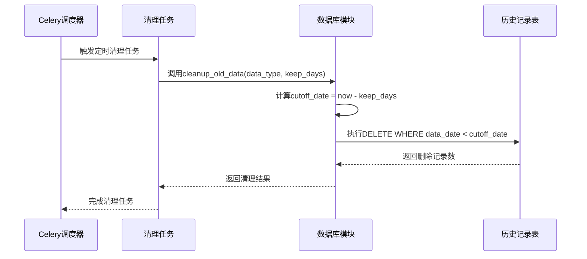
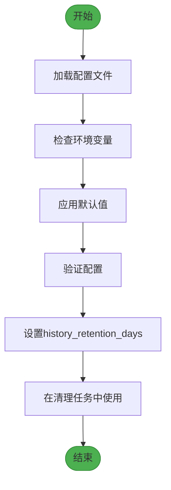
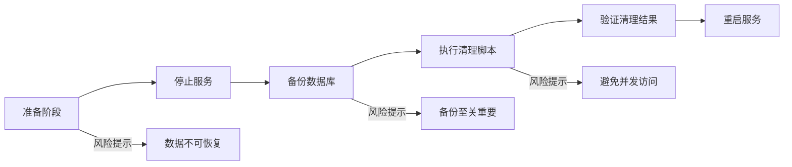
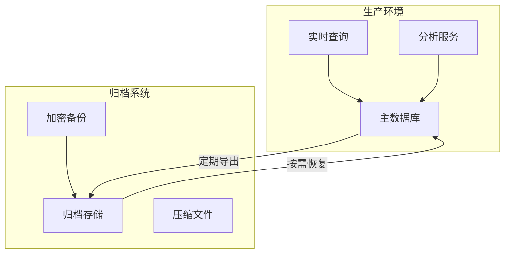
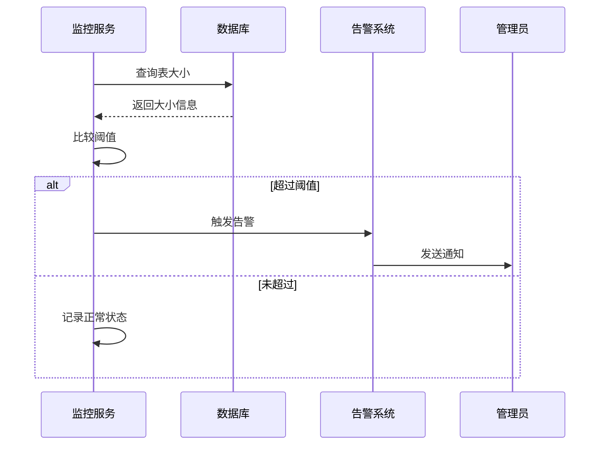

# 数据维护与清理

<cite>
**本文档引用的文件**  
- [monitor_tasks.py](file://backend/app/tasks/monitor_tasks.py)
- [celery_app.py](file://backend/app/tasks/celery_app.py)
- [config.py](file://backend/app/config.py)
- [config_defaults.py](file://backend/app/core/config_defaults.py)
- [mainforce_batch_db.py](file://backend/app/db/mainforce_batch_db.py)
- [sector_db.py](file://backend/app/db/sector_db.py)
- [mainforce_service.py](file://backend/app/services/mainforce_service.py)
- [monitor_service.py](file://backend/app/services/monitor_service.py)
</cite>

## 目录
1. [引言](#引言)
2. [自动化清理机制](#自动化清理机制)
3. [数据保留周期配置](#数据保留周期配置)
4. [手动清理脚本使用指南](#手动清理脚本使用指南)
5. [数据归档方案](#数据归档方案)
6. [监控告警配置](#监控告警配置)
7. [结论](#结论)

## 引言
主力选股历史记录系统通过Celery定时任务实现自动化数据维护，确保系统长期稳定运行。本系统采用冷热数据分离策略，结合定期清理和归档机制，有效管理存储空间。配置文件中定义了数据保留周期等关键参数，支持灵活调整。同时，系统具备完善的监控告警功能，当历史记录表大小超过阈值时可及时通知管理员。

## 自动化清理机制
系统基于Celery框架实现定时任务调度，通过`monitor_tasks.py`中的清理任务定期删除过期的历史记录。Celery应用在`celery_app.py`中初始化，配置了Redis作为消息代理和结果后端。清理任务作为Celery任务注册，按照预设的时间间隔自动执行。

清理机制通过调用数据库模块的`cleanup_old_data`方法实现，该方法接受数据类型和保留天数作为参数，计算出截止日期并执行SQL删除语句。对于主力选股历史记录，系统会清理`main_force_batch.db`数据库中超过保留周期的记录。类似地，板块分析等其他模块的历史数据也采用相同的清理逻辑。

**图表来源**  
- [monitor_tasks.py](file://backend/app/tasks/monitor_tasks.py#L1-L13)
- [mainforce_batch_db.py](file://backend/app/db/mainforce_batch_db.py)
- [sector_db.py](file://backend/app/db/sector_db.py#L650-L686)

**章节来源**  
- [monitor_tasks.py](file://backend/app/tasks/monitor_tasks.py#L1-L13)
- [celery_app.py](file://backend/app/tasks/celery_app.py#L1-L21)

## 数据保留周期配置
系统通过配置文件中的`history_retention_days`参数控制数据保留周期，该参数直接影响存储空间占用和历史数据分析范围。在`config_defaults.py`中定义了配置项的默认值和描述，而实际配置值在`.env`文件或环境变量中设置。

`config.py`文件中的`Settings`类包含了所有应用配置，通过Pydantic的BaseSettings实现类型验证和环境变量加载。`history_retention_days`参数通常设置为30天，可根据实际需求调整。较短的保留周期可节省存储空间但限制历史分析能力，较长的周期则相反。

**图表来源**  
- [config.py](file://backend/app/config.py#L10-L92)
- [config_defaults.py](file://backend/app/core/config_defaults.py#L5-L154)

**章节来源**  
- [config.py](file://backend/app/config.py#L10-L92)
- [config_defaults.py](file://backend/app/core/config_defaults.py#L5-L154)

## 手动清理脚本使用指南
除自动清理外，系统提供手动清理脚本供管理员在特殊情况下使用。使用前需停止相关服务，避免数据写入冲突。执行脚本时应指定明确的数据类型和保留天数，建议先在测试环境验证。

风险提示：手动清理操作不可逆，删除的数据无法恢复。操作前必须备份数据库文件，特别是`main_force_batch.db`等关键数据文件。同时，应确保没有其他进程正在访问数据库，否则可能导致数据损坏。

**图表来源**  
- [mainforce_batch_db.py](file://backend/app/db/mainforce_batch_db.py)
- [sector_db.py](file://backend/app/db/sector_db.py#L650-L686)

**章节来源**  
- [docs/主力选股批量分析历史记录功能说明.md](file://docs/主力选股批量分析历史记录功能说明.md#L149-L156)

## 数据归档方案
系统采用冷热数据分离策略进行数据归档。热数据存储在主数据库中，供频繁查询和分析使用；冷数据则归档到独立的存储系统，用于长期保存和审计。归档过程包括数据导出、压缩和迁移三个步骤。

备份恢复流程设计为双向可逆：既可从生产数据库备份到归档系统，也可从归档系统恢复到生产环境。备份文件采用加密存储，确保数据安全。恢复时需验证文件完整性，并在测试环境验证后方可应用到生产系统。

**图表来源**  
- [mainforce_batch_db.py](file://backend/app/db/mainforce_batch_db.py)
- [sector_db.py](file://backend/app/db/sector_db.py)

**章节来源**  
- [docs/主力选股批量分析历史记录功能说明.md](file://docs/主力选股批量分析历史记录功能说明.md#L164-L165)

## 监控告警配置
系统配置了完善的监控告警机制，当历史记录表大小超过预设阈值时触发通知。监控服务定期检查数据库文件大小，与配置的阈值进行比较。告警通知可通过多种渠道发送，包括邮件、钉钉Webhook等。

在`config.py`中配置了通知相关的参数，如`WEBHOOK_ENABLED`、`EMAIL_ENABLED`等。当检测到异常时，系统会调用相应的通知服务发送告警信息。管理员可根据实际情况调整阈值和通知频率，确保既能及时发现问题，又不会产生过多误报。

**图表来源**  
- [config.py](file://backend/app/config.py#L56-L67)
- [monitor_service.py](file://backend/app/services/monitor_service.py)

**章节来源**  
- [config.py](file://backend/app/config.py#L56-L67)
- [docs/主力选股批量分析历史记录功能说明.md](file://docs/主力选股批量分析历史记录功能说明.md#L149-L152)

## 结论
主力选股历史记录系统的数据维护策略综合考虑了自动化、灵活性和安全性。通过Celery定时任务实现的自动化清理机制，配合可配置的数据保留周期，有效平衡了存储成本和数据价值。手动清理脚本提供了应急处理能力，而冷热数据分离的归档方案确保了数据的长期可访问性。完善的监控告警配置为系统稳定运行提供了有力保障。建议定期审查和优化这些策略，以适应业务发展和技术演进的需求。