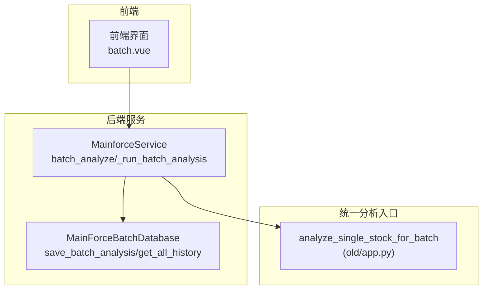
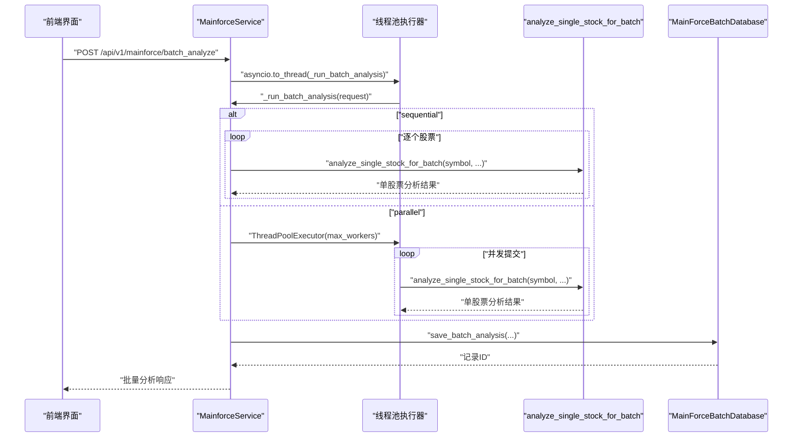
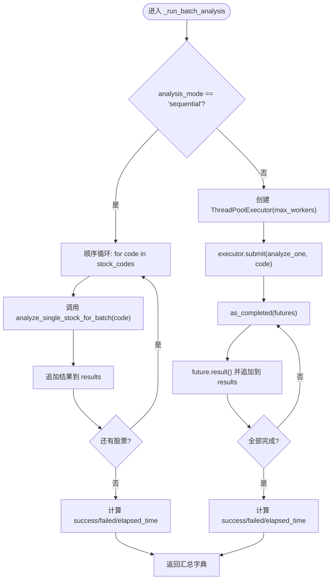
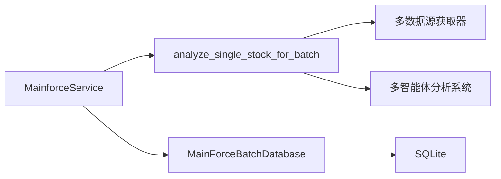

# 批量分析任务执行

<cite>
**本文引用的文件**
- [backend/app/services/mainforce_service.py](file://backend/app/services/mainforce_service.py)
- [backend/app/db/mainforce_batch_db.py](file://backend/app/db/mainforce_batch_db.py)
- [old/app.py](file://old/app.py)
- [docs/主力选股批量分析功能说明.md](file://docs/主力选股批量分析功能说明.md)
- [docs/主力选股批量分析修复说明.md](file://docs/主力选股批量分析修复说明.md)
- [frontend/src/views/mainforce/batch.vue](file://frontend/src/views/mainforce/batch.vue)
</cite>

## 目录
1. [简介](#简介)
2. [项目结构](#项目结构)
3. [核心组件](#核心组件)
4. [架构总览](#架构总览)
5. [详细组件分析](#详细组件分析)
6. [依赖关系分析](#依赖关系分析)
7. [性能考量](#性能考量)
8. [故障排查指南](#故障排查指南)
9. [结论](#结论)
10. [附录](#附录)

## 简介
本文围绕“主力选股批量分析任务执行机制”展开，重点解释 MainforceService._run_batch_analysis 方法如何通过 ThreadPoolExecutor 实现并发处理；分析顺序/并行两种模式的切换逻辑及对系统资源与执行效率的影响；说明并行模式下 max_workers 的配置策略与股票数量的关系，并给出避免过度并发导致资源争用的建议；结合 analyze_one 封装与异常处理，确保单个股票分析失败不影响整体批次执行；最后提供性能基准测试建议，帮助用户在不同硬件环境下选择最优并发参数。

## 项目结构
- 后端服务层负责对外提供批量分析 API，并在服务层内使用线程池执行分析任务。
- 数据库层负责批量分析历史记录的持久化，包含 JSON 序列化清理逻辑。
- 前端层提供分析模式与并发参数的交互入口。
- 统一分析函数 analyze_single_stock_for_batch 提供稳定的分析入口，保证不同入口的一致行为。

图表来源
- [backend/app/services/mainforce_service.py](file://backend/app/services/mainforce_service.py#L75-L207)
- [backend/app/db/mainforce_batch_db.py](file://backend/app/db/mainforce_batch_db.py#L105-L147)
- [old/app.py](file://old/app.py#L776-L919)
- [frontend/src/views/mainforce/batch.vue](file://frontend/src/views/mainforce/batch.vue)

章节来源
- [backend/app/services/mainforce_service.py](file://backend/app/services/mainforce_service.py#L75-L207)
- [backend/app/db/mainforce_batch_db.py](file://backend/app/db/mainforce_batch_db.py#L105-L147)
- [old/app.py](file://old/app.py#L776-L919)
- [frontend/src/views/mainforce/batch.vue](file://frontend/src/views/mainforce/batch.vue)

## 核心组件
- MainforceService：提供批量分析 API，内部通过 asyncio.to_thread 将同步的 _run_batch_analysis 放入线程池执行，避免阻塞事件循环。
- _run_batch_analysis：根据 analysis_mode 选择顺序或并行执行 analyze_single_stock_for_batch；并行模式使用 ThreadPoolExecutor，max_workers 来自请求参数。
- analyze_single_stock_for_batch：统一的单股票分析入口，封装数据获取、多智能体分析、最终决策与数据库落库。
- MainForceBatchDatabase：负责批量分析历史记录的保存与查询，包含 JSON 序列化清理逻辑，避免不可序列化对象导致保存失败。

章节来源
- [backend/app/services/mainforce_service.py](file://backend/app/services/mainforce_service.py#L75-L207)
- [backend/app/db/mainforce_batch_db.py](file://backend/app/db/mainforce_batch_db.py#L51-L147)
- [old/app.py](file://old/app.py#L776-L919)

## 架构总览
下面的时序图展示了从前端发起批量分析请求，到后端执行分析并将结果写入历史记录的完整流程。

图表来源
- [backend/app/services/mainforce_service.py](file://backend/app/services/mainforce_service.py#L75-L207)
- [backend/app/db/mainforce_batch_db.py](file://backend/app/db/mainforce_batch_db.py#L105-L147)
- [old/app.py](file://old/app.py#L776-L919)

## 详细组件分析

### MainforceService._run_batch_analysis 并发执行机制
- 模式切换
  - sequential：顺序遍历股票代码，逐一调用 analyze_single_stock_for_batch，并将结果追加到 results。
  - parallel：使用 ThreadPoolExecutor(max_workers=request.max_workers) 提交任务；通过 as_completed 顺序收集结果，确保输出顺序与输入一致。
- 异常处理
  - analyze_one 封装了对 analyze_single_stock_for_batch 的调用，并捕获异常，返回包含 symbol、success、error 的字典，从而保证单个股票失败不影响整体批次。
  - _run_batch_analysis 对 future.result() 的异常也做了捕获，同样以失败项形式写入 results。
- 资源与耗时
  - elapsed_time 以秒为单位统计总耗时，便于评估不同模式与并发度的效果。
- 历史记录
  - _run_batch_analysis 返回包含 total、success、failed、elapsed_time、analysis_mode、results 的字典，随后由 _save_batch_history 写入数据库。

图表来源
- [backend/app/services/mainforce_service.py](file://backend/app/services/mainforce_service.py#L106-L184)

章节来源
- [backend/app/services/mainforce_service.py](file://backend/app/services/mainforce_service.py#L106-L184)

### analyze_one 封装与异常处理
- analyze_one 是 _run_batch_analysis 内部的闭包函数，负责：
  - 调用 analyze_single_stock_for_batch；
  - 捕获异常并返回包含 symbol、success、error 的字典；
  - 通过 ThreadPoolExecutor 提交任务，as_completed 收集结果时，若 future.result() 抛出异常，也会捕获并记录失败项。
- 这种设计确保：
  - 单个股票分析异常不会中断整个批次；
  - 所有股票的分析结果都会被记录，便于后续统计与展示。

章节来源
- [backend/app/services/mainforce_service.py](file://backend/app/services/mainforce_service.py#L148-L172)
- [old/app.py](file://old/app.py#L776-L919)

### 统一分析入口 analyze_single_stock_for_batch
- 职责
  - 获取股票基础数据、财务数据、资金流向、市场情绪、新闻、风险等多源数据；
  - 初始化多智能体分析系统，运行团队讨论与最终决策；
  - 将分析结果保存到数据库（可选），并返回统一结构的字典。
- 异常兜底
  - 任何异常都会被捕获并返回包含 symbol、error、success=False 的字典，保证上游不会崩溃。

章节来源
- [old/app.py](file://old/app.py#L776-L919)

### 历史记录保存与 JSON 序列化
- MainForceBatchDatabase.save_batch_analysis 会：
  - 调用 _clean_results_for_json 清理不可序列化对象（如 DataFrame、Series），并对大对象做截断；
  - 将 results_json 写入 SQLite 表 batch_analysis_history。
- 该清理逻辑避免了“Object of type DataFrame is not JSON serializable”等错误。

章节来源
- [backend/app/db/mainforce_batch_db.py](file://backend/app/db/mainforce_batch_db.py#L51-L147)
- [docs/主力选股批量分析修复说明.md](file://docs/主力选股批量分析修复说明.md#L1-L53)

### 前端交互与并发参数
- 前端提供“顺序/并行”模式切换与“并行线程数”输入框（默认值与范围参考文档）。
- 并行模式下，max_workers 由前端传递给后端请求，后端直接用于 ThreadPoolExecutor 的构造。

章节来源
- [docs/主力选股批量分析功能说明.md](file://docs/主力选股批量分析功能说明.md#L28-L33)
- [frontend/src/views/mainforce/batch.vue](file://frontend/src/views/mainforce/batch.vue)

## 依赖关系分析
- MainforceService 依赖：
  - 统一分析入口 analyze_single_stock_for_batch（来自 old/app.py）；
  - 数据库模块 MainForceBatchDatabase（保存历史记录）。
- analyze_single_stock_for_batch 依赖：
  - 多数据源获取器（财务、资金流向、情绪、新闻、风险等）；
  - 多智能体分析系统（StockAnalysisAgents）。
- MainForceBatchDatabase 依赖：
  - sqlite3、json、pandas（用于序列化清理）。

图表来源
- [backend/app/services/mainforce_service.py](file://backend/app/services/mainforce_service.py#L106-L207)
- [backend/app/db/mainforce_batch_db.py](file://backend/app/db/mainforce_batch_db.py#L105-L147)
- [old/app.py](file://old/app.py#L776-L919)

章节来源
- [backend/app/services/mainforce_service.py](file://backend/app/services/mainforce_service.py#L106-L207)
- [backend/app/db/mainforce_batch_db.py](file://backend/app/db/mainforce_batch_db.py#L105-L147)
- [old/app.py](file://old/app.py#L776-L919)

## 性能考量
- 模式选择
  - sequential：CPU/IO 资源占用相对稳定，适合小规模（如 <20 只）或网络受限场景；优点是可控性强、资源争用少。
  - parallel：在 CPU 与网络 I/O 较充分的前提下显著缩短总耗时；但需谨慎设置 max_workers，避免 API 限流或本地资源争用。
- 并发参数 max_workers 配置策略
  - 与股票数量的关系：建议 max_workers ≈ min(N/5, C)，其中 N 为股票数量，C 为 CPU 核心数；或参考文档中的经验范围（如 2-5）。
  - 与外部 API 限流的关系：若外部数据源存在速率限制，应适当降低 max_workers，避免超时或失败率上升。
  - 与本地资源的关系：过多并发可能导致磁盘/网络/内存争用，建议先以较低并发（如 2-3）起步，逐步提升。
- 资源监控与观测
  - 建议记录 total、success、failed、elapsed_time，并基于不同模式与并发度进行对比，形成基准数据。
  - 若出现大量失败或超时，优先降低并发度，再检查网络与外部数据源稳定性。

章节来源
- [docs/主力选股批量分析功能说明.md](file://docs/主力选股批量分析功能说明.md#L300-L341)
- [backend/app/services/mainforce_service.py](file://backend/app/services/mainforce_service.py#L148-L172)

## 故障排查指南
- JSON 序列化失败
  - 现象：保存历史记录时报错“Object of type DataFrame is not JSON serializable”。
  - 解决：使用 _clean_results_for_json 对结果进行递归清理，必要时截断大数据对象。
- 历史记录显示字段名不匹配
  - 现象：历史记录中股票名称与评级显示为 N/A。
  - 解决：修正字段名访问（如 name、rating、operation_advice 等）。
- 单个股票分析失败
  - 现象：某只股票分析异常，但整体批次仍继续。
  - 机制：analyze_one 与 future.result() 的异常捕获会将失败项写入 results，不影响其他任务。
- 保存历史记录失败
  - 现象：保存阶段抛出异常。
  - 处理：记录日志并继续返回响应，避免中断用户流程。

章节来源
- [docs/主力选股批量分析修复说明.md](file://docs/主力选股批量分析修复说明.md#L1-L53)
- [backend/app/db/mainforce_batch_db.py](file://backend/app/db/mainforce_batch_db.py#L51-L147)
- [backend/app/services/mainforce_service.py](file://backend/app/services/mainforce_service.py#L148-L172)

## 结论
- MainforceService._run_batch_analysis 通过 asyncio.to_thread 将同步分析放入线程池，避免阻塞事件循环；并行模式使用 ThreadPoolExecutor，max_workers 直接来源于请求参数。
- analyze_one 封装了对统一分析入口的调用，并对异常进行捕获与回退，确保单个股票失败不影响整体批次。
- 历史记录保存采用 JSON 序列化清理策略，规避常见序列化问题。
- 建议在不同硬件与网络环境下，以小并发起步，逐步提升至最优值，并结合 elapsed_time 与失败率进行基准评估。

## 附录
- 基准测试建议
  - 测试场景：固定股票数量（如 10、20、50），分别以 sequential 与 parallel（2、3、5 线程）执行多次，记录 total、success、failed、elapsed_time。
  - 评估指标：平均耗时、成功率、失败率、平均单只耗时。
  - 影响因素：外部 API 限流、网络抖动、本地磁盘/内存/CPU 占用。
  - 结果应用：在文档推荐范围内（如 2-5）选择最优并发度，并在 UI 中提供默认值与范围提示。

章节来源
- [docs/主力选股批量分析功能说明.md](file://docs/主力选股批量分析功能说明.md#L300-L341)
- [backend/app/services/mainforce_service.py](file://backend/app/services/mainforce_service.py#L148-L172)