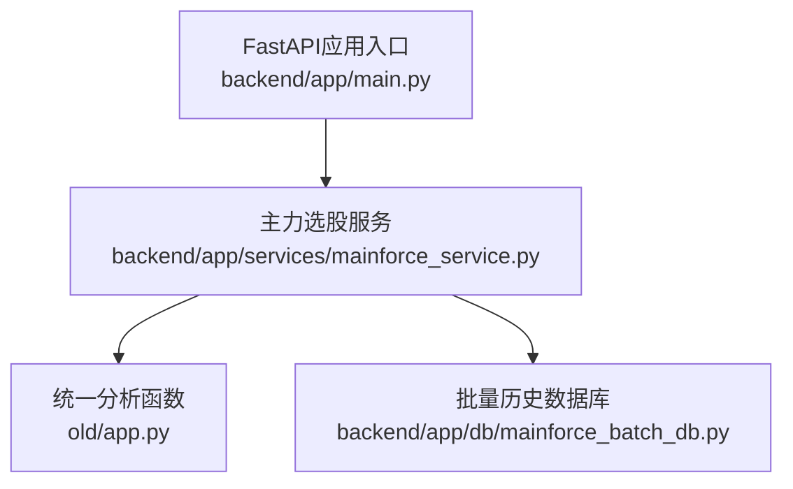
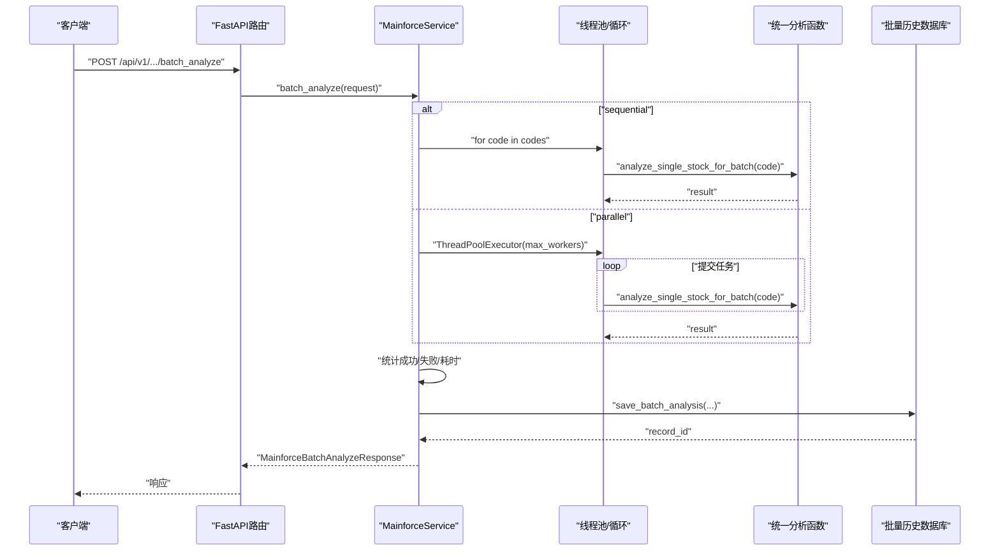
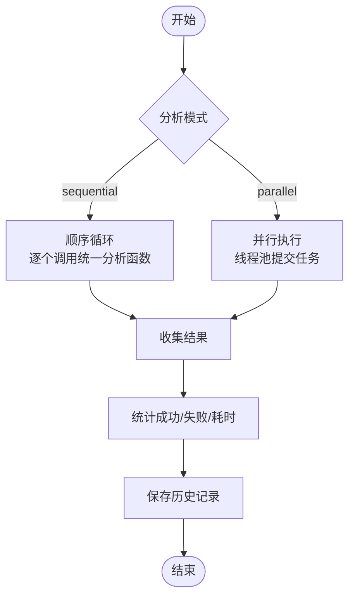
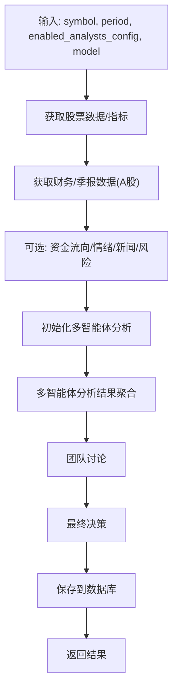
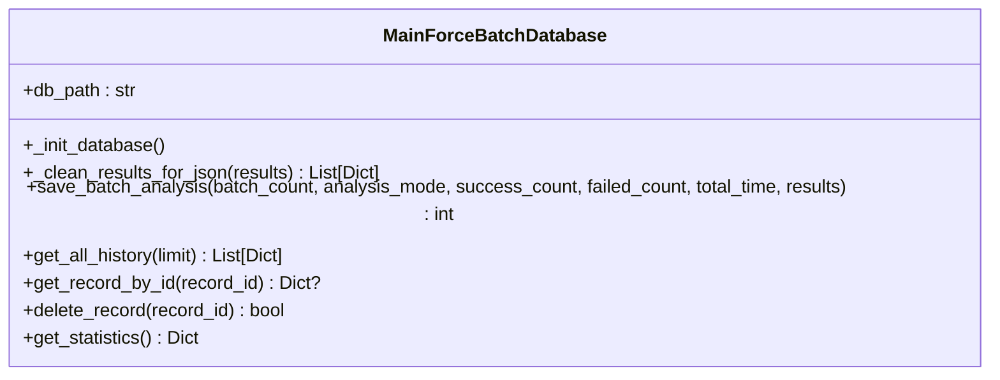
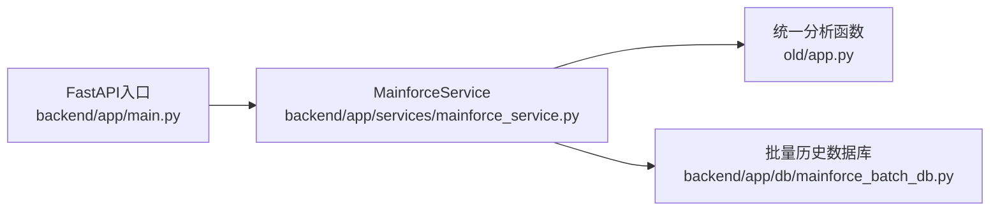

# 批量分析性能调优指南

<cite>
**本文引用的文件**
- [backend/app/services/mainforce_service.py](file://backend/app/services/mainforce_service.py)
- [backend/app/db/mainforce_batch_db.py](file://backend/app/db/mainforce_batch_db.py)
- [old/app.py](file://old/app.py)
- [docs/UNIFIED_ANALYSIS_SPEC.md](file://docs/UNIFIED_ANALYSIS_SPEC.md)
- [docs/PORTFOLIO_USAGE.md](file://docs/PORTFOLIO_USAGE.md)
- [backend/app/main.py](file://backend/app/main.py)
</cite>

## 目录
1. [简介](#简介)
2. [项目结构](#项目结构)
3. [核心组件](#核心组件)
4. [架构总览](#架构总览)
5. [详细组件分析](#详细组件分析)
6. [依赖关系分析](#依赖关系分析)
7. [性能考量](#性能考量)
8. [故障排查指南](#故障排查指南)
9. [结论](#结论)
10. [附录](#附录)

## 简介
本指南围绕“系统开发主力选股批量分析性能调优”目标，基于后端服务中实际实现的批量分析流程，提供性能基准测试方法、资源消耗监控、数学建模与预测、并发参数建议以及瓶颈识别与优化策略。文档聚焦于后端服务层的批处理实现，涵盖顺序与并行两种模式，统一分析入口、历史记录落库与统计口径，并给出面向不同硬件配置的并发参数建议，帮助用户在保证系统稳定性的前提下最大化分析效率。

## 项目结构
后端采用FastAPI框架，批量分析主流程位于服务层，统一分析入口位于旧版项目根目录app.py，历史记录存放在SQLite数据库中。核心文件如下：
- 服务层：负责接收请求、调度分析、统计结果、保存历史
- 统一分析入口：封装单只股票分析的完整流程
- 历史记录数据库：负责批量分析结果的持久化与统计

图表来源
- [backend/app/main.py](file://backend/app/main.py#L1-L92)
- [backend/app/services/mainforce_service.py](file://backend/app/services/mainforce_service.py#L75-L235)
- [old/app.py](file://old/app.py#L776-L1036)
- [backend/app/db/mainforce_batch_db.py](file://backend/app/db/mainforce_batch_db.py#L1-L302)

章节来源
- [backend/app/main.py](file://backend/app/main.py#L1-L92)
- [backend/app/services/mainforce_service.py](file://backend/app/services/mainforce_service.py#L75-L235)
- [old/app.py](file://old/app.py#L776-L1036)
- [backend/app/db/mainforce_batch_db.py](file://backend/app/db/mainforce_batch_db.py#L1-L302)

## 核心组件
- 批量分析服务：负责顺序/并行两种模式的调度、结果聚合、耗时统计与历史记录落库
- 统一分析函数：封装单只股票分析的完整流程，作为批量分析的原子任务
- 历史记录数据库：负责批量分析结果的清洗、序列化与持久化，提供统计接口

章节来源
- [backend/app/services/mainforce_service.py](file://backend/app/services/mainforce_service.py#L75-L235)
- [old/app.py](file://old/app.py#L776-L1036)
- [backend/app/db/mainforce_batch_db.py](file://backend/app/db/mainforce_batch_db.py#L1-L302)

## 架构总览
批量分析的端到端流程如下：
- 请求进入FastAPI路由，调用服务层的批量分析方法
- 服务层根据模式选择顺序或并行执行
- 并行模式使用线程池并发调用统一分析函数
- 统一分析函数执行数据获取、多智能体分析、最终决策与落库
- 服务层统计成功/失败数量与总耗时，保存历史记录

图表来源
- [backend/app/main.py](file://backend/app/main.py#L1-L92)
- [backend/app/services/mainforce_service.py](file://backend/app/services/mainforce_service.py#L75-L235)
- [old/app.py](file://old/app.py#L776-L1036)
- [backend/app/db/mainforce_batch_db.py](file://backend/app/db/mainforce_batch_db.py#L105-L147)

## 详细组件分析

### 批量分析服务（顺序/并行）
- 顺序模式：逐个调用统一分析函数，记录每个结果
- 并行模式：使用线程池并发执行，收集已完成任务的结果
- 统计指标：总耗时、成功/失败数量、分析模式、结果列表
- 历史记录：调用数据库模块保存批次统计与结果

图表来源
- [backend/app/services/mainforce_service.py](file://backend/app/services/mainforce_service.py#L106-L184)
- [backend/app/db/mainforce_batch_db.py](file://backend/app/db/mainforce_batch_db.py#L105-L147)

章节来源
- [backend/app/services/mainforce_service.py](file://backend/app/services/mainforce_service.py#L106-L184)

### 统一分析函数（单只股票）
- 数据获取：股票基础信息、K线与技术指标、财务数据、季报数据（A股）
- 可选数据：资金流向、市场情绪、新闻、风险数据
- 多智能体分析：根据配置启用技术、基本面、资金流、风险等分析模块
- 最终决策：团队讨论后生成最终建议
- 落库：将分析结果写入数据库

图表来源
- [old/app.py](file://old/app.py#L776-L919)

章节来源
- [old/app.py](file://old/app.py#L776-L919)

### 历史记录数据库
- 表结构：批次日期、分析模式、成功/失败数量、总耗时、结果JSON
- 清洗与序列化：对不可JSON序列化对象进行清理，限制DataFrame行数
- 统计接口：提供总记录数、总分析股票数、总成功/失败数、平均耗时等

图表来源
- [backend/app/db/mainforce_batch_db.py](file://backend/app/db/mainforce_batch_db.py#L1-L302)

章节来源
- [backend/app/db/mainforce_batch_db.py](file://backend/app/db/mainforce_batch_db.py#L1-L302)

## 依赖关系分析
- 服务层依赖统一分析函数作为原子任务
- 服务层依赖数据库模块进行历史记录落库
- 统一分析函数依赖数据获取与多智能体分析模块
- FastAPI应用入口注册路由并提供健康检查

图表来源
- [backend/app/main.py](file://backend/app/main.py#L1-L92)
- [backend/app/services/mainforce_service.py](file://backend/app/services/mainforce_service.py#L75-L235)
- [old/app.py](file://old/app.py#L776-L1036)
- [backend/app/db/mainforce_batch_db.py](file://backend/app/db/mainforce_batch_db.py#L1-L302)

章节来源
- [backend/app/main.py](file://backend/app/main.py#L1-L92)
- [backend/app/services/mainforce_service.py](file://backend/app/services/mainforce_service.py#L75-L235)
- [old/app.py](file://old/app.py#L776-L1036)
- [backend/app/db/mainforce_batch_db.py](file://backend/app/db/mainforce_batch_db.py#L1-L302)

## 性能考量

### 1. 基准测试方法
- 执行时间测量
  - 在服务层入口处记录开始时间，结束后计算耗时并写入历史记录
  - 参考路径：[backend/app/services/mainforce_service.py](file://backend/app/services/mainforce_service.py#L126-L174)
- 资源消耗监控
  - 可通过系统工具（如操作系统自带的进程监控）采集CPU/内存/网络等指标
  - 建议在容器或独立进程环境中进行基准测试，避免UI渲染等干扰
- 历史记录统计
  - 数据库提供平均耗时、成功率等统计，便于横向对比不同配置
  - 参考路径：[backend/app/db/mainforce_batch_db.py](file://backend/app/db/mainforce_batch_db.py#L258-L297)

章节来源
- [backend/app/services/mainforce_service.py](file://backend/app/services/mainforce_service.py#L126-L174)
- [backend/app/db/mainforce_batch_db.py](file://backend/app/db/mainforce_batch_db.py#L258-L297)

### 2. 数学模型与预测
- 假设单只分析耗时近似为常数T，忽略网络抖动与外部依赖波动
- 顺序模式总耗时：T_total = N × T
- 并行模式总耗时：T_total ≈ T + overhead，其中overhead为线程池调度与结果聚合开销
- 实际耗时受以下因素影响：
  - 外部API限流与延迟
  - 数据库写入开销
  - 统一分析函数中可选模块的启用情况
- 建议
  - 以历史记录的平均耗时作为T的估计值
  - 对不同并发数进行多轮测试，绘制“股票数量-耗时”曲线，拟合线性或带常数项的模型

章节来源
- [docs/PORTFOLIO_USAGE.md](file://docs/PORTFOLIO_USAGE.md#L293-L332)
- [backend/app/db/mainforce_batch_db.py](file://backend/app/db/mainforce_batch_db.py#L258-L297)

### 3. 并发参数建议（不同硬件配置）
- CPU密集型（多核高并发）
  - 建议max_workers≈CPU核心数或略小于核心数，避免过度切换
  - 注意：统一分析函数包含IO与外部API调用，不一定完全CPU受限
- IO密集型（网络/数据库）
  - 可适当提高max_workers，但需考虑外部API限流与数据库写入压力
- 通用建议
  - 初始尝试：3、5、8、12
  - 观察失败率与超时率，逐步提升至稳定吞吐
  - 参考历史记录统计与平均耗时进行对比

章节来源
- [docs/PORTFOLIO_USAGE.md](file://docs/PORTFOLIO_USAGE.md#L293-L332)
- [backend/app/services/mainforce_service.py](file://backend/app/services/mainforce_service.py#L148-L172)

### 4. 瓶颈识别与优化策略
- 瓶颈识别
  - 外部API限流：统一分析函数中资金流、情绪、新闻等模块可能触发限流
    - 参考路径：[old/app.py](file://old/app.py#L828-L857)
  - 数据库写入：大批量历史记录写入可能成为瓶颈
    - 参考路径：[backend/app/db/mainforce_batch_db.py](file://backend/app/db/mainforce_batch_db.py#L105-L147)
  - 线程池调度与结果聚合：过多并发导致上下文切换开销上升
- 优化策略
  - 限流与退避：对外部API增加重试与退避策略
  - 批量写入：合并写入或异步写入，减少事务次数
  - 结果清洗：控制单条记录大小，避免超大数据JSON
    - 参考路径：[backend/app/db/mainforce_batch_db.py](file://backend/app/db/mainforce_batch_db.py#L51-L104)
  - 并发上限：根据历史记录统计动态调整max_workers
  - 统一规范：确保所有分析入口遵循统一规范，便于一致性优化
    - 参考路径：[docs/UNIFIED_ANALYSIS_SPEC.md](file://docs/UNIFIED_ANALYSIS_SPEC.md#L1-L62)

章节来源
- [old/app.py](file://old/app.py#L828-L857)
- [backend/app/db/mainforce_batch_db.py](file://backend/app/db/mainforce_batch_db.py#L51-L104)
- [docs/UNIFIED_ANALYSIS_SPEC.md](file://docs/UNIFIED_ANALYSIS_SPEC.md#L1-L62)

## 故障排查指南
- JSON序列化失败
  - 现象：历史记录保存时报错，对象不可序列化
  - 处理：数据库模块内置清理逻辑，将DataFrame/Series等转换为可序列化结构
  - 参考路径：[backend/app/db/mainforce_batch_db.py](file://backend/app/db/mainforce_batch_db.py#L51-L104)
- 字段名不匹配
  - 现象：历史记录展示字段名不一致
  - 处理：统一字段命名，确保前后端一致
  - 参考路径：[docs/UNIFIED_ANALYSIS_SPEC.md](file://docs/UNIFIED_ANALYSIS_SPEC.md#L46-L62)
- 超时与失败
  - 现象：单只分析超时或失败
  - 处理：记录失败原因，调整并发或限流策略
  - 参考路径：[old/app.py](file://old/app.py#L990-L998)
- 历史记录查询
  - 现象：历史记录为空或统计异常
  - 处理：检查数据库初始化与索引，确认统计接口可用
  - 参考路径：[backend/app/db/mainforce_batch_db.py](file://backend/app/db/mainforce_batch_db.py#L258-L297)

章节来源
- [backend/app/db/mainforce_batch_db.py](file://backend/app/db/mainforce_batch_db.py#L51-L104)
- [docs/UNIFIED_ANALYSIS_SPEC.md](file://docs/UNIFIED_ANALYSIS_SPEC.md#L46-L62)
- [old/app.py](file://old/app.py#L990-L998)
- [backend/app/db/mainforce_batch_db.py](file://backend/app/db/mainforce_batch_db.py#L258-L297)

## 结论
通过统一分析入口、顺序/并行两种执行模式、完善的统计与历史记录体系，系统能够在不同硬件配置下实现可预测的性能表现。建议以历史记录的平均耗时为基准，结合外部API限流与数据库写入压力，动态调整并发参数；同时通过结果清洗与限流退避策略降低失败率，最终在稳定性的前提下最大化分析效率。

## 附录
- 统一分析调用规范
  - 参考路径：[docs/UNIFIED_ANALYSIS_SPEC.md](file://docs/UNIFIED_ANALYSIS_SPEC.md#L1-L62)
- 历史记录统计参考
  - 参考路径：[backend/app/db/mainforce_batch_db.py](file://backend/app/db/mainforce_batch_db.py#L258-L297)
- 健康检查接口
  - 参考路径：[backend/app/main.py](file://backend/app/main.py#L87-L92)