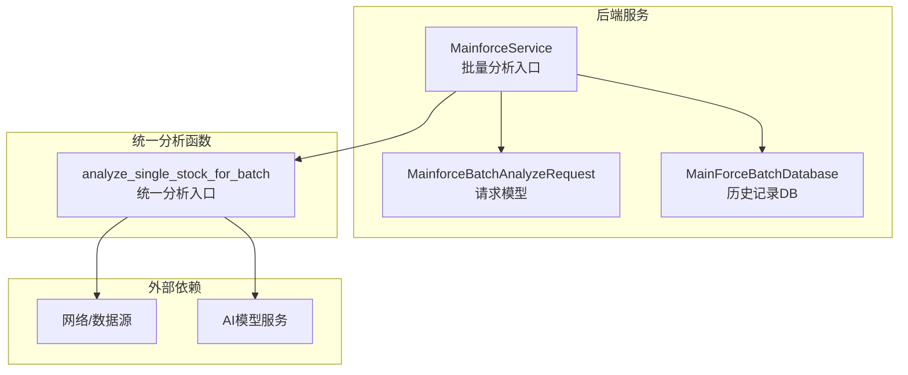
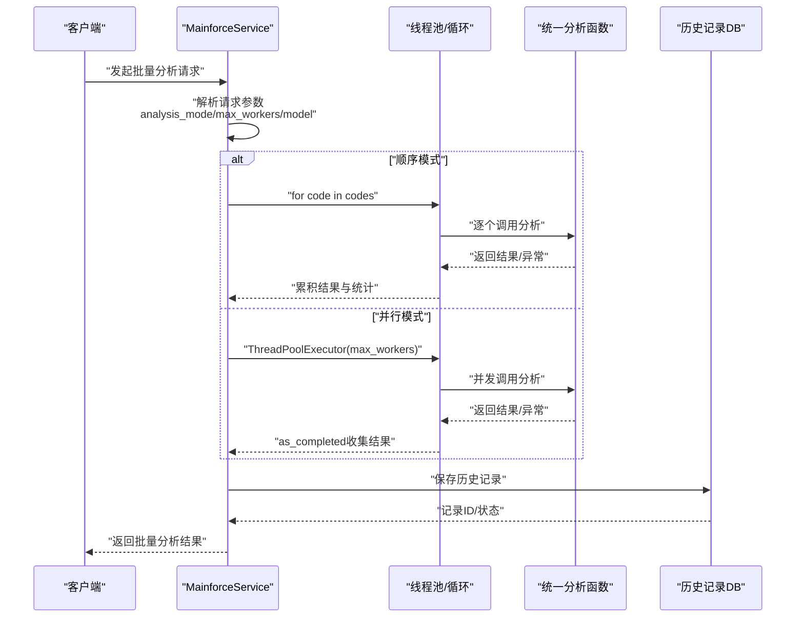
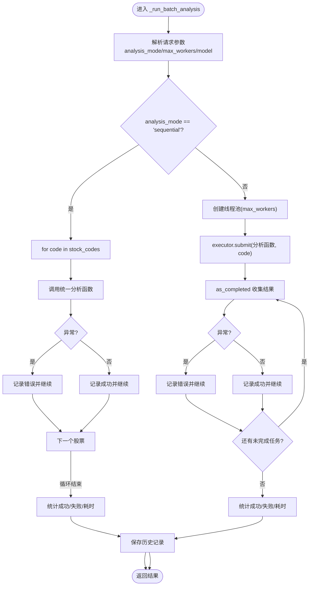
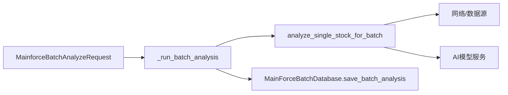

# 批量分析模式对比

<cite>
**本文引用的文件**
- [backend/app/services/mainforce_service.py](file://backend/app/services/mainforce_service.py)
- [backend/app/schemas/stock.py](file://backend/app/schemas/stock.py)
- [backend/app/db/mainforce_batch_db.py](file://backend/app/db/mainforce_batch_db.py)
- [docs/主力选股批量分析功能说明.md](file://docs/主力选股批量分析功能说明.md)
- [old/app.py](file://old/app.py)
- [old/main_force_ui.py](file://old/main_force_ui.py)
</cite>

## 目录
1. [简介](#简介)
2. [项目结构](#项目结构)
3. [核心组件](#核心组件)
4. [架构总览](#架构总览)
5. [详细组件分析](#详细组件分析)
6. [依赖关系分析](#依赖关系分析)
7. [性能考量](#性能考量)
8. [故障排查指南](#故障排查指南)
9. [结论](#结论)
10. [附录](#附录)

## 简介
本文件聚焦“主力选股批量分析”中顺序模式与并行模式的实现差异与对比，围绕 MainforceService._run_batch_analysis 方法展开，解释顺序模式的稳定性与并行模式的性能优势；分析不同股票数量下的执行效率差异；阐述模式选择对 CPU、内存、网络等系统资源的影响；并提供实际场景下的模式选择建议与配置切换方式，帮助用户根据硬件配置与网络环境做出最优选择。

## 项目结构
- 后端服务层负责接收请求、调度分析、持久化历史记录；
- 请求/响应模型定义了批量分析的输入参数（如分析模式、并发线程数等）；
- 历史记录数据库模块负责批量分析结果的持久化与查询；
- 文档提供了功能说明与使用建议；
- 旧版实现展示了统一分析函数与 UI 的并行/顺序模式。

图表来源
- [backend/app/services/mainforce_service.py](file://backend/app/services/mainforce_service.py#L106-L184)
- [backend/app/schemas/stock.py](file://backend/app/schemas/stock.py#L83-L99)
- [backend/app/db/mainforce_batch_db.py](file://backend/app/db/mainforce_batch_db.py#L105-L148)
- [old/app.py](file://old/app.py#L776-L919)

章节来源
- [backend/app/services/mainforce_service.py](file://backend/app/services/mainforce_service.py#L106-L184)
- [backend/app/schemas/stock.py](file://backend/app/schemas/stock.py#L83-L99)
- [backend/app/db/mainforce_batch_db.py](file://backend/app/db/mainforce_batch_db.py#L105-L148)
- [docs/主力选股批量分析功能说明.md](file://docs/主力选股批量分析功能说明.md#L1-L120)

## 核心组件
- MainforceService._run_batch_analysis：实现顺序/并行两种模式的核心逻辑，负责调用统一分析函数、聚合结果、统计耗时与成功率，并持久化历史记录。
- MainforceBatchAnalyzeRequest：定义批量分析请求参数，包括分析模式（sequential/parallel）、并发线程数、模型等。
- MainForceBatchDatabase：负责批量分析历史记录的保存与查询，支持统计信息汇总。

章节来源
- [backend/app/services/mainforce_service.py](file://backend/app/services/mainforce_service.py#L106-L184)
- [backend/app/schemas/stock.py](file://backend/app/schemas/stock.py#L83-L99)
- [backend/app/db/mainforce_batch_db.py](file://backend/app/db/mainforce_batch_db.py#L105-L148)

## 架构总览
顺序模式与并行模式在服务层的调用路径一致，差异在于循环策略与并发控制：
- 顺序模式：串行遍历股票列表，逐一调用统一分析函数，异常捕获并记录，累计统计成功/失败计数与总耗时。
- 并行模式：使用线程池并发执行统一分析函数，通过 as_completed 顺序收集结果，保证输出顺序与输入一致，同时统计成功/失败计数与总耗时。

图表来源
- [backend/app/services/mainforce_service.py](file://backend/app/services/mainforce_service.py#L106-L184)
- [backend/app/db/mainforce_batch_db.py](file://backend/app/db/mainforce_batch_db.py#L105-L148)
- [old/app.py](file://old/app.py#L776-L919)

## 详细组件分析

### MainforceService._run_batch_analysis 方法：顺序与并行实现差异
- 参数与配置
  - 请求参数包含 analysis_mode（sequential/parallel）、max_workers（并行模式下的线程数上限）、model（AI模型）等。
  - 统一分析函数启用的技术面、基本面、资金流、风险等分析师开关在服务层集中配置。
- 顺序模式（sequential）
  - 采用 for 循环逐个处理股票代码，每个代码调用统一分析函数；异常被捕获并记录，不影响其他股票的继续分析。
  - 优点：实现简单、资源占用低、异常隔离好、适合小规模或不稳定网络环境。
  - 缺点：总耗时随股票数量线性增长，不适合大批量分析。
- 并行模式（parallel）
  - 使用线程池并发执行统一分析函数；通过 as_completed 顺序收集结果，保证输出顺序与输入一致。
  - 优点：显著缩短总耗时，适合大规模分析；在 I/O 密集场景（网络/数据源）收益明显。
  - 缺点：对 CPU/内存/网络带宽有更高要求；线程过多可能导致外部 API 限流或系统资源紧张。

图表来源
- [backend/app/services/mainforce_service.py](file://backend/app/services/mainforce_service.py#L106-L184)
- [backend/app/schemas/stock.py](file://backend/app/schemas/stock.py#L83-L99)

章节来源
- [backend/app/services/mainforce_service.py](file://backend/app/services/mainforce_service.py#L106-L184)
- [backend/app/schemas/stock.py](file://backend/app/schemas/stock.py#L83-L99)

### 统一分析函数与历史记录
- 统一分析函数（来自旧版实现）负责获取数据、调用多智能体分析、团队讨论与最终决策，并将结果保存至数据库。
- 历史记录模块负责将批量分析的统计信息与明细结果持久化，便于后续查询与统计。

章节来源
- [old/app.py](file://old/app.py#L776-L919)
- [backend/app/db/mainforce_batch_db.py](file://backend/app/db/mainforce_batch_db.py#L105-L148)

### 前端交互与模式选择
- 前端 UI 提供分析模式选择（sequential/parallel）与并行线程数配置（2-5），并在顺序模式下禁用线程数输入框。
- 文档提供了不同分析数量与模式的预期耗时参考，便于用户预估执行时间。

章节来源
- [docs/主力选股批量分析功能说明.md](file://docs/主力选股批量分析功能说明.md#L1-L120)
- [old/main_force_ui.py](file://old/main_force_ui.py#L518-L682)

## 依赖关系分析
- MainforceService 依赖统一分析函数（位于项目根目录 app.py）与历史记录数据库模块。
- 请求模型 MainforceBatchAnalyzeRequest 定义了分析模式与并发参数。
- 历史记录模块依赖 SQLite，提供批量分析历史的保存与查询接口。

图表来源
- [backend/app/services/mainforce_service.py](file://backend/app/services/mainforce_service.py#L106-L184)
- [backend/app/schemas/stock.py](file://backend/app/schemas/stock.py#L83-L99)
- [backend/app/db/mainforce_batch_db.py](file://backend/app/db/mainforce_batch_db.py#L105-L148)
- [old/app.py](file://old/app.py#L776-L919)

章节来源
- [backend/app/services/mainforce_service.py](file://backend/app/services/mainforce_service.py#L106-L184)
- [backend/app/schemas/stock.py](file://backend/app/schemas/stock.py#L83-L99)
- [backend/app/db/mainforce_batch_db.py](file://backend/app/db/mainforce_batch_db.py#L105-L148)

## 性能考量
- 顺序模式
  - 适合股票数量较小（例如 10 只以内）或网络不稳定、外部 API 容易限流的场景。
  - 优点：实现简单、资源占用低、异常隔离好。
  - 缺点：总耗时随股票数量线性增长。
- 并行模式
  - 适合股票数量较大（例如 20 只以上）且具备足够 CPU/内存/网络资源的场景。
  - 优点：显著缩短总耗时，I/O 密集场景收益明显。
  - 缺点：对 CPU/内存/网络带宽要求更高；线程过多可能触发外部 API 限流或系统资源紧张。
- 不同股票数量下的执行效率对比
  - 文档提供了不同数量与模式的预期耗时参考，便于用户预估执行时间并选择合适的模式与线程数。

章节来源
- [docs/主力选股批量分析功能说明.md](file://docs/主力选股批量分析功能说明.md#L300-L341)

## 故障排查指南
- 常见问题与建议
  - 分析失败：检查股票代码格式、网络连通性、外部 API 限流；顺序模式通常更稳健，可先尝试顺序模式。
  - 并发线程过高：适当降低 max_workers，避免外部 API 限流或系统资源紧张。
  - 结果保存失败：历史记录模块会记录错误，可在历史记录页面查看详细信息。
- 日志与异常
  - 服务层对单只股票分析异常进行捕获并记录，不影响整体批量流程；历史记录保存异常也会被记录并抛出。

章节来源
- [docs/主力选股批量分析功能说明.md](file://docs/主力选股批量分析功能说明.md#L300-L341)
- [backend/app/services/mainforce_service.py](file://backend/app/services/mainforce_service.py#L106-L184)
- [backend/app/db/mainforce_batch_db.py](file://backend/app/db/mainforce_batch_db.py#L105-L148)

## 结论
- 顺序模式适用于小规模、不稳定网络或资源受限场景，强调稳定性与可控性。
- 并行模式适用于大规模、资源充足的场景，强调吞吐与时效。
- 模式选择应综合考虑股票数量、硬件配置（CPU/内存）、网络环境（外部 API 限流）与业务需求（时间敏感度）。
- 建议：小规模（≤10只）优先顺序模式；中大规模（10+只）优先并行模式，并根据实际耗时与资源占用逐步调整线程数。

## 附录

### 模式切换与配置方式
- 请求参数
  - analysis_mode：选择 "sequential" 或 "parallel"。
  - max_workers：并行模式下的线程数（默认 3，范围 2-5）。
  - model：AI 模型名称（默认 "deepseek-chat"）。
- 前端配置
  - 前端提供分析模式选择与并行线程数输入框；顺序模式下禁用线程数输入框。
- 代码示例路径
  - 请求模型定义：[backend/app/schemas/stock.py](file://backend/app/schemas/stock.py#L83-L99)
  - 服务层批量分析入口与模式分支：[backend/app/services/mainforce_service.py](file://backend/app/services/mainforce_service.py#L106-L184)
  - 统一分析函数（旧版实现）：[old/app.py](file://old/app.py#L776-L919)
  - 前端模式选择与线程数配置：[old/main_force_ui.py](file://old/main_force_ui.py#L518-L682)

章节来源
- [backend/app/schemas/stock.py](file://backend/app/schemas/stock.py#L83-L99)
- [backend/app/services/mainforce_service.py](file://backend/app/services/mainforce_service.py#L106-L184)
- [old/app.py](file://old/app.py#L776-L919)
- [old/main_force_ui.py](file://old/main_force_ui.py#L518-L682)