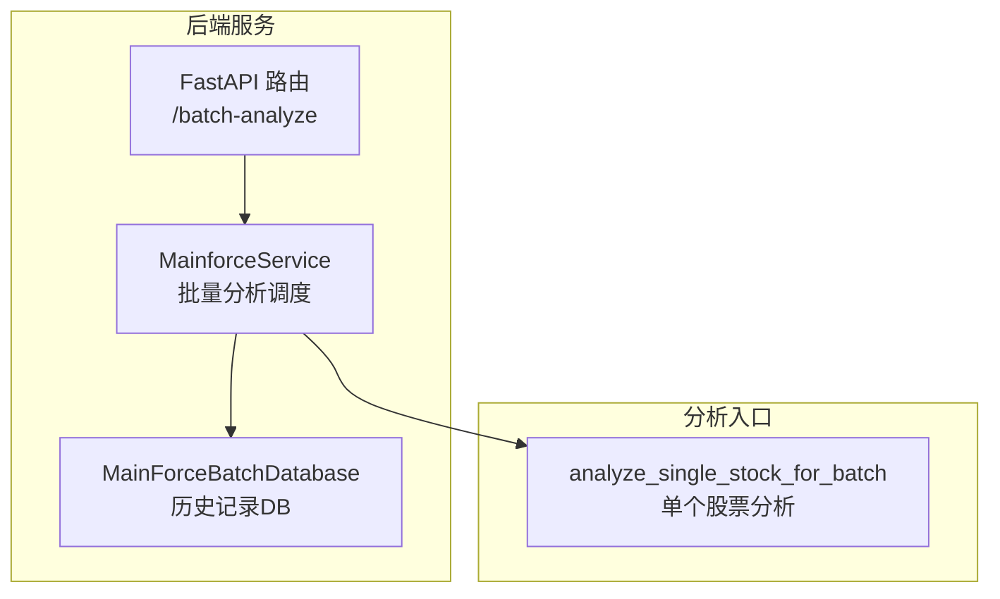
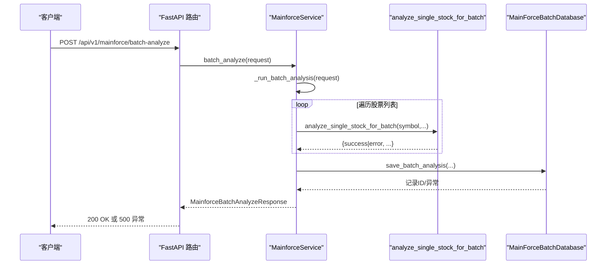
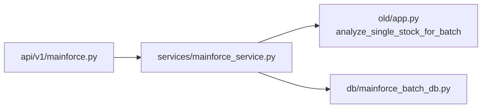

# 批量分析错误处理机制

<cite>
**本文引用的文件**
- [backend/app/services/mainforce_service.py](file://backend/app/services/mainforce_service.py)
- [backend/app/db/mainforce_batch_db.py](file://backend/app/db/mainforce_batch_db.py)
- [backend/app/api/v1/mainforce.py](file://backend/app/api/v1/mainforce.py)
- [backend/app/core/exceptions.py](file://backend/app/core/exceptions.py)
- [old/app.py](file://old/app.py)
- [docs/主力选股批量分析修复说明.md](file://docs/主力选股批量分析修复说明.md)
- [docs/主力选股批量分析历史记录功能说明.md](file://docs/主力选股批量分析历史记录功能说明.md)
</cite>

## 目录
1. [简介](#简介)
2. [项目结构](#项目结构)
3. [核心组件](#核心组件)
4. [架构总览](#架构总览)
5. [详细组件分析](#详细组件分析)
6. [依赖关系分析](#依赖关系分析)
7. [性能考量](#性能考量)
8. [故障排查指南](#故障排查指南)
9. [结论](#结论)

## 简介
本文件围绕“主力选股批量分析”的错误处理机制展开，重点聚焦于批量执行中的异常捕获与错误记录策略，确保单个股票分析失败不会影响整体批次的继续执行与稳定性。文档将结合代码路径说明 try-catch 的使用位置、错误日志记录规范、错误类型分类、上下文信息记录方式、错误传播链路，以及如何向用户返回有意义的错误信息。

## 项目结构
- 后端服务层负责批量分析调度、异常捕获与错误传播，并将结果持久化到历史记录。
- 数据库层负责批量历史记录的保存与读取，包含 JSON 序列化清理逻辑，保证结果可持久化。
- API 层负责对外暴露接口，统一捕获服务层异常并转换为 HTTP 响应。
- 历史记录 UI 与文档提供了历史记录保存失败的排查指引。

图表来源
- [backend/app/services/mainforce_service.py](file://backend/app/services/mainforce_service.py#L75-L207)
- [backend/app/db/mainforce_batch_db.py](file://backend/app/db/mainforce_batch_db.py#L105-L147)
- [backend/app/api/v1/mainforce.py](file://backend/app/api/v1/mainforce.py#L34-L61)
- [old/app.py](file://old/app.py#L776-L919)

章节来源
- [backend/app/services/mainforce_service.py](file://backend/app/services/mainforce_service.py#L75-L207)
- [backend/app/db/mainforce_batch_db.py](file://backend/app/db/mainforce_batch_db.py#L105-L147)
- [backend/app/api/v1/mainforce.py](file://backend/app/api/v1/mainforce.py#L34-L61)

## 核心组件
- 批量分析服务：负责在顺序/并行两种模式下执行单个股票分析，收集每个股票的分析结果与错误，汇总统计并保存历史记录。
- 单个股票分析函数：封装数据获取、多智能体分析、最终决策与数据库保存，统一返回包含 success/error 的标准化结果。
- 历史记录数据库：负责将批量结果序列化保存，包含 JSON 序列化清理逻辑，避免不可序列化对象导致保存失败。
- API 层：捕获服务层异常并转换为 HTTP 响应，保障外部调用的稳定性。

章节来源
- [backend/app/services/mainforce_service.py](file://backend/app/services/mainforce_service.py#L106-L184)
- [old/app.py](file://old/app.py#L776-L919)
- [backend/app/db/mainforce_batch_db.py](file://backend/app/db/mainforce_batch_db.py#L51-L103)

## 架构总览
批量分析的错误处理贯穿“请求进入—服务调度—单个分析—结果聚合—历史记录保存—响应返回”全流程。单个股票分析失败会被捕获并记录，不影响整体批次继续执行；历史记录保存失败会记录警告日志，但不会阻断响应返回。

图表来源
- [backend/app/api/v1/mainforce.py](file://backend/app/api/v1/mainforce.py#L34-L61)
- [backend/app/services/mainforce_service.py](file://backend/app/services/mainforce_service.py#L75-L207)
- [backend/app/db/mainforce_batch_db.py](file://backend/app/db/mainforce_batch_db.py#L105-L147)
- [old/app.py](file://old/app.py#L776-L919)

## 详细组件分析

### analyze_one 函数中的异常捕获实现
- 作用：在并行模式下，为每个股票创建独立的任务，捕获单个分析过程中的异常，保证整体批次继续执行。
- 关键点：
  - 使用线程池提交任务，每个任务包裹 try-catch，捕获异常后返回包含 symbol、success=False、error 的标准化结果。
  - 对 future.result() 的异常也进行捕获，确保即使异步获取结果阶段出现异常也能记录并继续。
  - 顺序模式下同样对单个分析调用进行 try-catch，失败时记录错误并继续下一个股票。
- 返回约定：无论成功与否，均返回包含 symbol、success、error（可选）的字典，便于上层聚合统计与历史记录保存。

章节来源
- [backend/app/services/mainforce_service.py](file://backend/app/services/mainforce_service.py#L148-L172)
- [backend/app/services/mainforce_service.py](file://backend/app/services/mainforce_service.py#L130-L147)

### 单个股票分析失败时的错误记录与处理策略
- 失败路径：
  - 数据获取阶段：若无法获取股票数据或财务数据，直接返回包含 error 的结果。
  - 多智能体分析阶段：异常被捕获并转换为 error 字段，success=False。
  - 数据库保存阶段：异常被捕获并记录 db_error，但不影响分析结果返回。
- 处理策略：
  - 失败即记录，不中断整体批次。
  - 上层聚合统计成功/失败数量，用于 UI 展示与历史记录。
  - 历史记录保存失败时记录警告日志，不影响响应返回。

章节来源
- [old/app.py](file://old/app.py#L800-L820)
- [old/app.py](file://old/app.py#L828-L866)
- [old/app.py](file://old/app.py#L867-L919)

### 错误日志记录规范
- 日志级别与内容：
  - 服务层：批量分析失败、保存历史失败等使用错误日志记录，必要时附带 exc_info=True 输出堆栈。
  - 数据库层：保存历史失败使用错误日志记录，包含异常信息。
  - 单个分析函数：数据库保存失败记录错误日志，便于定位具体股票的问题。
- 日志上下文：
  - 记录股票代码、错误类型、错误消息、耗时等上下文信息，便于排查。
  - 历史记录保存前可打印调试信息，包含成功/失败数量、耗时、结果数量等。

章节来源
- [backend/app/services/mainforce_service.py](file://backend/app/services/mainforce_service.py#L91-L104)
- [backend/app/services/mainforce_service.py](file://backend/app/services/mainforce_service.py#L192-L206)
- [backend/app/db/mainforce_batch_db.py](file://backend/app/db/mainforce_batch_db.py#L131-L147)
- [old/app.py](file://old/app.py#L886-L919)

### 错误类型分类与传播机制
- 错误类型分类：
  - 数据源异常：如无法获取股票数据、财务数据等。
  - AI/分析异常：如多智能体分析过程中的异常。
  - 数据库异常：如保存历史记录失败。
  - 参数/配置异常：如 stock_codes 为空。
- 传播机制：
  - 服务层捕获异常并返回标准化响应，或抛出异常交由 API 层转换为 HTTP 500。
  - 单个分析函数返回包含 error 的结果，上层聚合统计并继续执行。
  - 历史记录保存失败记录警告日志，不影响响应返回。

章节来源
- [backend/app/services/mainforce_service.py](file://backend/app/services/mainforce_service.py#L80-L105)
- [backend/app/api/v1/mainforce.py](file://backend/app/api/v1/mainforce.py#L34-L61)
- [backend/app/core/exceptions.py](file://backend/app/core/exceptions.py#L1-L33)

### try-catch 使用示例与最佳实践
- 顺序模式：
  - 对单个分析调用使用 try-catch，失败时 append 包含 error 的结果。
- 并行模式：
  - 对每个任务使用 try-catch，future.result() 也使用 try-catch，确保异常被记录。
- 单个分析函数：
  - 对数据获取、多智能体分析、数据库保存分别使用 try-catch，失败时返回 error 字段。
- 历史记录保存：
  - 对保存操作使用 try-catch，失败时记录错误并抛出，API 层捕获并转换为 HTTP 500。

章节来源
- [backend/app/services/mainforce_service.py](file://backend/app/services/mainforce_service.py#L130-L172)
- [old/app.py](file://old/app.py#L776-L919)
- [backend/app/db/mainforce_batch_db.py](file://backend/app/db/mainforce_batch_db.py#L131-L147)

### 向用户返回有意义的错误信息
- 响应结构：
  - 批量分析响应包含 total、success、failed、elapsed_time、analysis_mode、results 等字段，results 中每个元素包含 symbol、success、error（可选）。
- UI 展示：
  - 成功/失败数量与耗时直观展示。
  - 若全部失败，提供失败原因列表，便于用户定位问题。
- 历史记录保存失败：
  - UI 提示保存失败并给出错误信息，但不影响结果查看。

章节来源
- [backend/app/services/mainforce_service.py](file://backend/app/services/mainforce_service.py#L177-L184)
- [docs/主力选股批量分析历史记录功能说明.md](file://docs/主力选股批量分析历史记录功能说明.md#L167-L186)

## 依赖关系分析
- 服务层依赖分析入口函数 analyze_single_stock_for_batch，该函数负责单个股票分析的完整流程与错误捕获。
- 服务层依赖数据库模块保存历史记录，数据库模块提供 JSON 序列化清理方法，避免不可序列化对象导致保存失败。
- API 层依赖服务层，捕获异常并转换为 HTTP 响应。

图表来源
- [backend/app/api/v1/mainforce.py](file://backend/app/api/v1/mainforce.py#L34-L61)
- [backend/app/services/mainforce_service.py](file://backend/app/services/mainforce_service.py#L106-L184)
- [old/app.py](file://old/app.py#L776-L919)
- [backend/app/db/mainforce_batch_db.py](file://backend/app/db/mainforce_batch_db.py#L105-L147)

## 性能考量
- 并发控制：并行模式下限制最大并发数，避免外部数据源限流或资源争用。
- 数据清理：历史记录保存前对结果进行 JSON 序列化清理，避免大数据导致序列化失败或性能问题。
- 统计聚合：上层仅统计成功/失败数量与耗时，避免在错误路径中引入额外开销。

章节来源
- [backend/app/services/mainforce_service.py](file://backend/app/services/mainforce_service.py#L161-L172)
- [backend/app/db/mainforce_batch_db.py](file://backend/app/db/mainforce_batch_db.py#L51-L103)

## 故障排查指南
- 保存历史记录失败：
  - 检查数据库文件权限与磁盘空间。
  - 查看终端日志中的错误信息与堆栈。
- 历史记录显示错误：
  - 确认数据库文件存在，尝试删除后重建。
- 加载历史结果失败：
  - 检查数据库连接与 JSON 解析错误。
- 单个股票分析失败：
  - 查看 results 中的 error 字段，定位具体股票与错误原因。
  - 参考修复说明文档中的 JSON 序列化、字段名不匹配等问题的处理方法。

章节来源
- [docs/主力选股批量分析历史记录功能说明.md](file://docs/主力选股批量分析历史记录功能说明.md#L167-L186)
- [docs/主力选股批量分析修复说明.md](file://docs/主力选股批量分析修复说明.md#L1-L53)

## 结论
本批量分析错误处理机制通过“单点捕获、全局聚合、稳健传播”的设计，确保单个股票分析失败不会影响整体批次执行。服务层与数据库层的日志记录与清理逻辑，配合 API 层的异常转换，形成了清晰的错误分类与传播路径。用户可获得明确的成功/失败统计与错误信息，系统在稳定性与可观测性之间取得平衡。