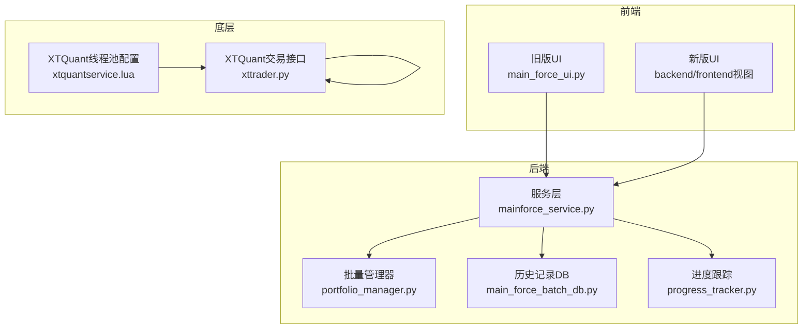
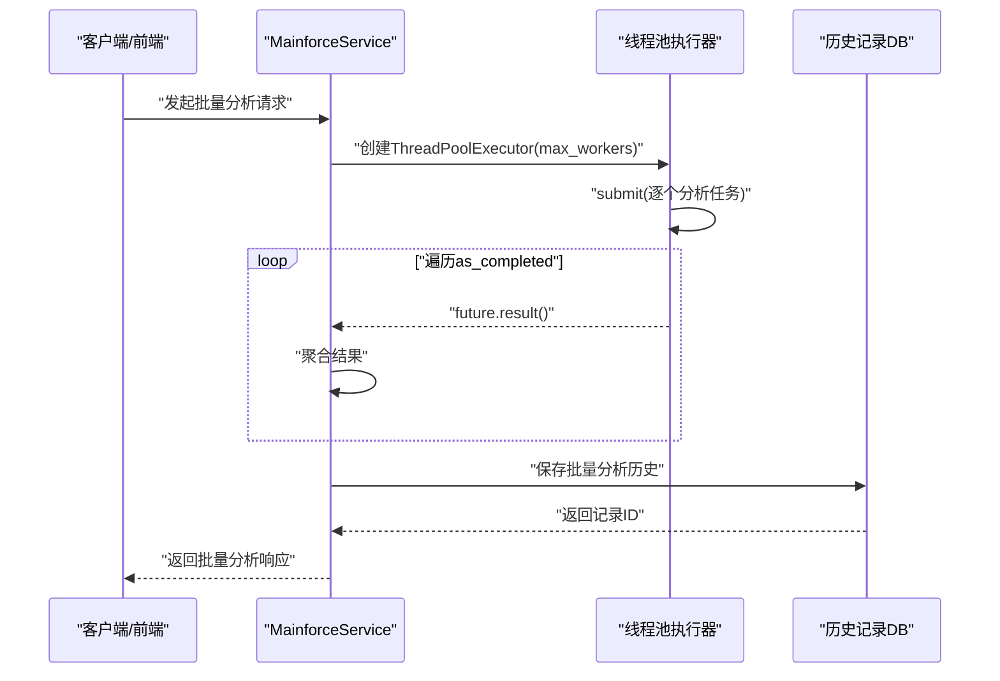
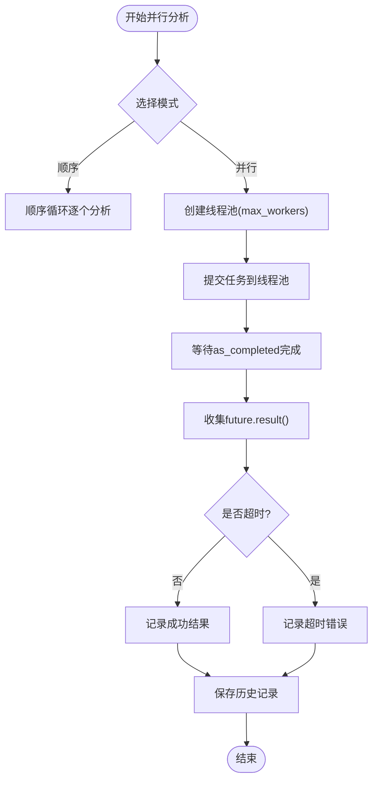
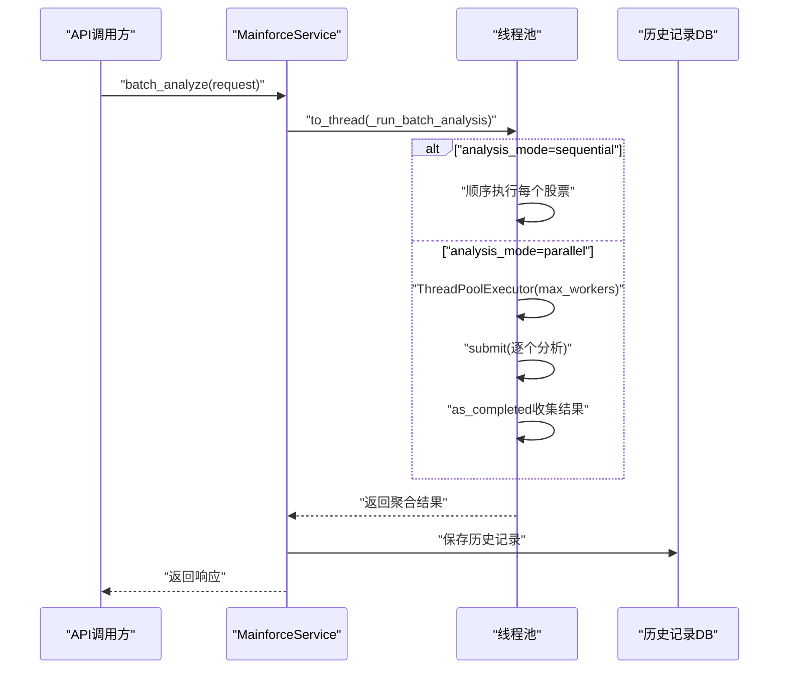
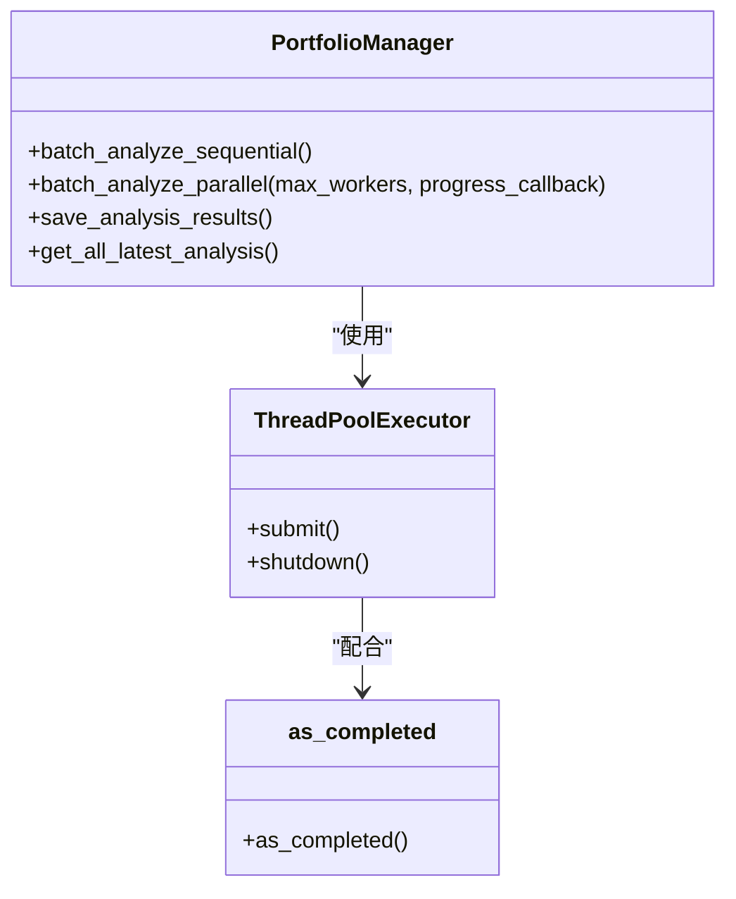
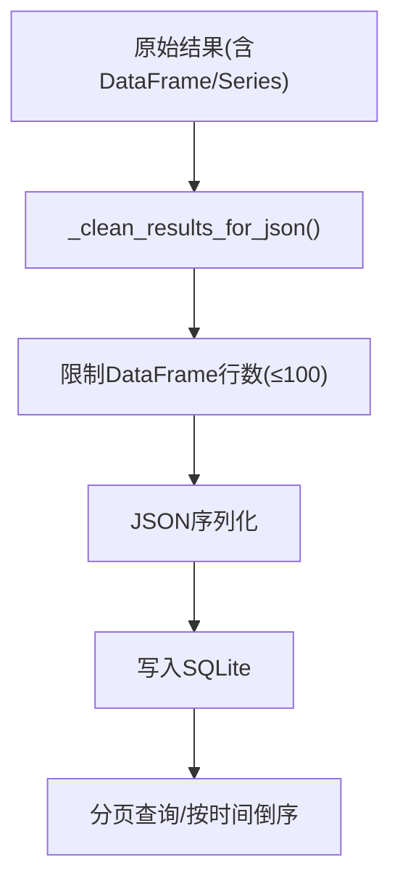
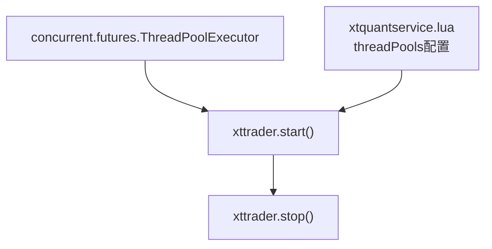
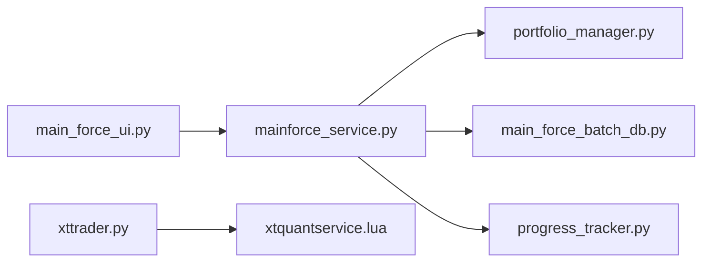

# 线程池配置与资源管理

<cite>
**本文引用的文件**
- [main_force_ui.py](file://old/main_force_ui.py)
- [app.py](file://old/app.py)
- [portfolio_manager.py](file://old/portfolio_manager.py)
- [portfolio_scheduler.py](file://old/portfolio_scheduler.py)
- [mainforce_service.py](file://backend/app/services/mainforce_service.py)
- [main_force_batch_db.py](file://old/main_force_batch_db.py)
- [xttrader.py](file://xtquant/xttrader.py)
- [xtquantservice.lua](file://xtquant/config/xtquantservice.lua)
- [progress_tracker.py](file://backend/app/core/progress_tracker.py)
- [README.md](file://docs/主力选股批量分析修复说明.md)
</cite>

## 目录
1. [引言](#引言)
2. [项目结构](#项目结构)
3. [核心组件](#核心组件)
4. [架构总览](#架构总览)
5. [详细组件分析](#详细组件分析)
6. [依赖关系分析](#依赖关系分析)
7. [性能考量](#性能考量)
8. [故障排查指南](#故障排查指南)
9. [结论](#结论)
10. [附录](#附录)

## 引言
本文件围绕“主力选股批量分析”的线程池配置与资源管理展开，重点解析在并行模式下 ThreadPoolExecutor 的应用方式、max_workers 参数的配置策略、线程数与系统 CPU 核心数/内存容量的关系、以及如何避免 API 限流与内存溢出等风险。文档结合实际代码路径，给出创建线程池、提交任务、使用 as_completed 机制进行批量分析的流程说明，并提供不同硬件环境下的推荐配置与最佳实践。

## 项目结构
该功能横跨前端 UI、后端服务与底层 XTQuant 交易接口，涉及如下关键位置：
- 前端交互层：负责用户输入、并行/顺序模式切换、max_workers 配置与进度展示
- 后端服务层：封装批量分析逻辑，支持线程池执行与历史记录持久化
- 数据库层：批量分析历史记录的保存与查询
- 底层 XTQuant：交易接口线程池配置与生命周期管理

**章节来源**
- file://old/main_force_ui.py#L548-L684
- file://backend/app/services/mainforce_service.py#L75-L172
- file://old/portfolio_manager.py#L266-L349
- file://old/main_force_batch_db.py#L104-L146
- file://backend/app/core/progress_tracker.py#L44-L152
- file://xtquant/xttrader.py#L386-L425
- file://xtquant/config/xtquantservice.lua#L1-L45

## 核心组件
- 并行分析入口与 UI 控制：旧版 UI 提供“顺序/并行”模式切换与 max_workers 输入；新版 UI 仍保留占位，核心逻辑迁移至后端服务
- 线程池执行器：在多个模块中使用 ThreadPoolExecutor，包括前端 UI、后端服务与 XTQuant
- as_completed 机制：用于收集已完成任务的结果，保证结果按完成顺序处理
- 历史记录持久化：将批量分析结果清洗后写入 SQLite，支持分页查询
- 进度跟踪：后端提供 WebSocket 进度推送能力，便于前端实时反馈

**章节来源**
- file://old/main_force_ui.py#L548-L684
- file://backend/app/services/mainforce_service.py#L12-L23
- file://old/portfolio_manager.py#L9-L12
- file://old/main_force_batch_db.py#L50-L102
- file://backend/app/core/progress_tracker.py#L44-L152

## 架构总览
下面的序列图展示了后端服务在并行模式下执行批量分析的端到端流程，包括线程池创建、任务提交、结果收集与历史记录保存。

**图表来源**
- [mainforce_service.py](file://backend/app/services/mainforce_service.py#L75-L172)
- [main_force_batch_db.py](file://old/main_force_batch_db.py#L104-L146)

**章节来源**
- file://backend/app/services/mainforce_service.py#L75-L172
- file://old/main_force_batch_db.py#L104-L146

## 详细组件分析

### 组件A：前端并行分析（旧版 UI）
- 模式选择：支持“顺序分析/并行分析”，并行模式下允许用户设置 max_workers（范围通常为 2~5）
- 线程池创建：使用 ThreadPoolExecutor(max_workers=...) 提交任务
- 结果收集：使用 as_completed 按完成顺序处理 future，更新进度与状态
- 超时控制：future.result(timeout=...) 限制单个任务最长等待时间
- 历史记录：分析完成后将结果保存到本地数据库

**图表来源**
- [main_force_ui.py](file://old/main_force_ui.py#L548-L684)
- [main_force_ui.py](file://old/main_force_ui.py#L655-L742)
- [main_force_batch_db.py](file://old/main_force_batch_db.py#L104-L146)

**章节来源**
- file://old/main_force_ui.py#L548-L684
- file://old/main_force_ui.py#L655-L742
- file://old/main_force_batch_db.py#L104-L146

### 组件B：后端服务并行分析（MainforceService）
- 线程池执行：使用 asyncio.to_thread 将阻塞式分析放入线程池，避免阻塞事件循环
- 并行策略：根据请求中的 analysis_mode 决定顺序或并行；并行时使用 ThreadPoolExecutor(max_workers)
- 结果聚合：使用 as_completed 收集结果，统计成功/失败数量与总耗时
- 历史记录：调用数据库模块保存批量分析历史

**图表来源**
- [mainforce_service.py](file://backend/app/services/mainforce_service.py#L75-L172)
- [main_force_batch_db.py](file://old/main_force_batch_db.py#L104-L146)

**章节来源**
- file://backend/app/services/mainforce_service.py#L75-L172
- file://old/main_force_batch_db.py#L104-L146

### 组件C：批量管理器（PortfolioManager）
- 并行批量分析：在 portfolio_manager.py 中同样使用 ThreadPoolExecutor 与 as_completed
- 进度回调：支持外部传入 progress_callback，用于 UI 层进度反馈
- 结果清洗：与历史记录模块配合，确保结果可序列化

**图表来源**
- [portfolio_manager.py](file://old/portfolio_manager.py#L266-L349)
- [portfolio_manager.py](file://old/portfolio_manager.py#L9-L12)

**章节来源**
- file://old/portfolio_manager.py#L266-L349
- file://old/portfolio_manager.py#L9-L12

### 组件D：历史记录与数据清洗
- 数据清洗：main_force_batch_db.py 提供 _clean_results_for_json，递归处理 DataFrame/Series 等不可序列化对象
- 保存策略：将清洗后的结果以 JSON 形式存入 SQLite，包含 batch_count、analysis_mode、success_count、failed_count、total_time 等元信息
- 查询策略：支持分页查询，按创建时间倒序

**图表来源**
- [main_force_batch_db.py](file://old/main_force_batch_db.py#L50-L102)
- [main_force_batch_db.py](file://old/main_force_batch_db.py#L104-L146)
- [main_force_batch_db.py](file://old/main_force_batch_db.py#L148-L191)

**章节来源**
- file://old/main_force_batch_db.py#L50-L102
- file://old/main_force_batch_db.py#L104-L146
- file://old/main_force_batch_db.py#L148-L191

### 组件E：XTQuant 线程池配置与生命周期
- 线程池数量：在 xtquantservice.lua 中为不同子系统配置了线程池大小（如 datasource_*、pystrategy_run 等）
- Python侧线程池：xttrader.py 在 start/stop 中分别创建/关闭 ThreadPoolExecutor，用于异步回调与响应处理
- 生命周期管理：确保连接断开与事件循环安全关闭

**图表来源**
- [xttrader.py](file://xtquant/xttrader.py#L386-L425)
- [xtquantservice.lua](file://xtquant/config/xtquantservice.lua#L1-L45)

**章节来源**
- file://xtquant/xttrader.py#L386-L425
- file://xtquant/config/xtquantservice.lua#L1-L45

## 依赖关系分析
- 前端 UI 与后端服务解耦：前端负责交互与配置，后端负责计算与持久化
- 线程池依赖：ThreadPoolExecutor 与 as_completed 是并行分析的核心依赖
- 数据库依赖：历史记录模块独立于分析逻辑，提供统一的保存/查询接口
- 底层依赖：XTQuant 的线程池配置影响数据源访问与回调处理的吞吐

**图表来源**
- [main_force_ui.py](file://old/main_force_ui.py#L548-L684)
- [mainforce_service.py](file://backend/app/services/mainforce_service.py#L75-L172)
- [portfolio_manager.py](file://old/portfolio_manager.py#L266-L349)
- [main_force_batch_db.py](file://old/main_force_batch_db.py#L104-L146)
- [progress_tracker.py](file://backend/app/core/progress_tracker.py#L44-L152)
- [xttrader.py](file://xtquant/xttrader.py#L386-L425)
- [xtquantservice.lua](file://xtquant/config/xtquantservice.lua#L1-L45)

**章节来源**
- file://old/main_force_ui.py#L548-L684
- file://backend/app/services/mainforce_service.py#L75-L172
- file://old/portfolio_manager.py#L266-L349
- file://old/main_force_batch_db.py#L104-L146
- file://backend/app/core/progress_tracker.py#L44-L152
- file://xtquant/xttrader.py#L386-L425
- file://xtquant/config/xtquantservice.lua#L1-L45

## 性能考量
- max_workers 配置策略
  - CPU 密集型：建议不超过 CPU 核心数，避免上下文切换开销
  - IO 密集型：可适度提高，但需考虑 API 限流与网络带宽
  - 内存敏感：并发过多易导致内存峰值升高，应结合任务内存占用评估
- API 限流规避
  - 通过较小的 max_workers（如 2~4）降低请求频率
  - 对第三方接口增加重试与退避策略（可在任务函数内实现）
  - 使用 as_completed 逐步处理，避免一次性堆积大量请求
- 内存溢出防护
  - 对分析结果进行数据清洗，避免将大型 DataFrame/Series 直接序列化
  - 限制单次分析的数据规模，必要时分批处理
- 超时与稳定性
  - 为 future.result(timeout=...) 设置合理超时，防止卡死
  - 对异常进行捕获并记录，保证整体流程继续推进

- 不同硬件环境的推荐配置
  - 低配机器（4核CPU/8GB内存）：max_workers=2~3
  - 中配机器（6-8核CPU/16GB内存）：max_workers=4~6
  - 高配机器（12+核CPU/32GB+内存）：max_workers=6~10
  - 注意：以上仅为经验参考，需结合具体 API 限流与网络状况调整

**章节来源**
- file://old/main_force_ui.py#L548-L684
- file://backend/app/services/mainforce_service.py#L148-L172
- file://old/main_force_batch_db.py#L50-L102
- file://old/app.py#L970-L998

## 故障排查指南
- JSON 序列化失败
  - 现象：保存历史记录时报错，提示 DataFrame/Series 不可序列化
  - 处理：使用 _clean_results_for_json 递归清洗，限制 DataFrame 行数
  - 参考：[README.md](file://docs/主力选股批量分析修复说明.md#L1-L53)
- 历史记录字段显示 N/A
  - 现象：股票名称、评级等字段显示为 N/A
  - 处理：修正字段名访问（如 stock_info['name']、final_decision['rating']）
  - 参考：[README.md](file://docs/主力选股批量分析修复说明.md#L24-L45)
- 并行分析卡顿或超时
  - 现象：部分任务长时间无响应
  - 处理：降低 max_workers，为 future.result 设置超时，检查上游数据源限流
  - 参考：[main_force_ui.py](file://old/main_force_ui.py#L655-L742)、[app.py](file://old/app.py#L970-L998)
- XTQuant 回调阻塞
  - 现象：交易接口回调延迟
  - 处理：检查 xtquantservice.lua 线程池配置与 xttrader.py 线程池数量，确保回调线程池充足
  - 参考：[xtquantservice.lua](file://xtquant/config/xtquantservice.lua#L1-L45)、[xttrader.py](file://xtquant/xttrader.py#L386-L425)

**章节来源**
- file://docs/主力选股批量分析修复说明.md#L1-L53
- file://docs/主力选股批量分析修复说明.md#L24-L45
- file://old/main_force_ui.py#L655-L742
- file://old/app.py#L970-L998
- file://xtquant/config/xtquantservice.lua#L1-L45
- file://xtquant/xttrader.py#L386-L425

## 结论
通过在前端与后端服务中统一采用 ThreadPoolExecutor 与 as_completed 机制，主力选股批量分析实现了稳定的并行执行与结果聚合。max_workers 的合理配置是平衡吞吐与稳定性、避免 API 限流与内存溢出的关键。结合数据清洗、超时控制与 XTQuant 线程池配置，可在不同硬件环境下获得可靠的批量分析体验。

## 附录
- 关键实现路径参考
  - 前端并行分析入口与 as_completed 使用：[main_force_ui.py](file://old/main_force_ui.py#L655-L742)
  - 后端服务并行分析与线程池：[mainforce_service.py](file://backend/app/services/mainforce_service.py#L12-L23)、[mainforce_service.py](file://backend/app/services/mainforce_service.py#L148-L172)
  - 批量管理器并行分析：[portfolio_manager.py](file://old/portfolio_manager.py#L266-L349)
  - 历史记录保存与清洗：[main_force_batch_db.py](file://old/main_force_batch_db.py#L50-L102)、[main_force_batch_db.py](file://old/main_force_batch_db.py#L104-L146)
  - XTQuant 线程池配置与生命周期：[xtquantservice.lua](file://xtquant/config/xtquantservice.lua#L1-L45)、[xttrader.py](file://xtquant/xttrader.py#L386-L425)
  - 进度跟踪与 WebSocket 推送：[progress_tracker.py](file://backend/app/core/progress_tracker.py#L44-L152)