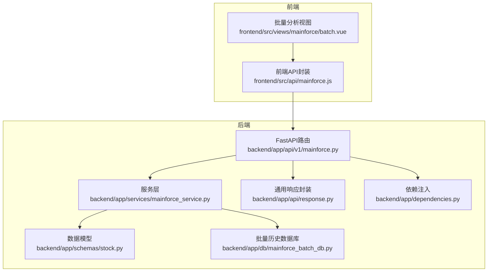
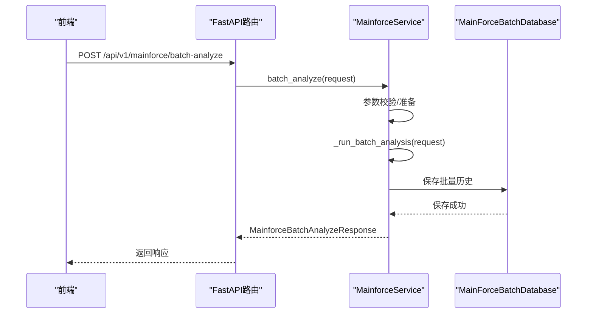
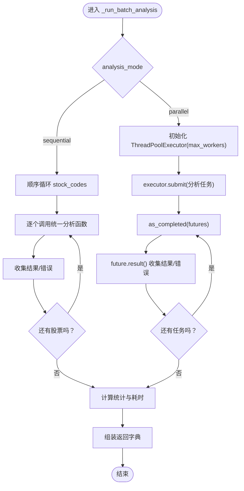
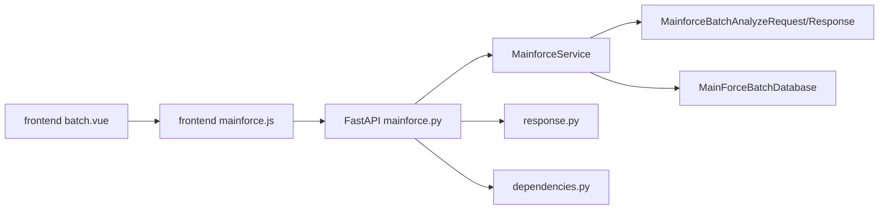

# 批量分析功能

<cite>
**本文引用的文件**
- [backend/app/services/mainforce_service.py](file://backend/app/services/mainforce_service.py)
- [backend/app/schemas/stock.py](file://backend/app/schemas/stock.py)
- [backend/app/api/v1/mainforce.py](file://backend/app/api/v1/mainforce.py)
- [backend/app/db/mainforce_batch_db.py](file://backend/app/db/mainforce_batch_db.py)
- [backend/app/api/response.py](file://backend/app/api/response.py)
- [backend/app/dependencies.py](file://backend/app/dependencies.py)
- [frontend/src/api/mainforce.js](file://frontend/src/api/mainforce.js)
- [frontend/src/views/mainforce/batch.vue](file://frontend/src/views/mainforce/batch.vue)
- [docs/主力选股批量分析功能说明.md](file://docs/主力选股批量分析功能说明.md)
</cite>

## 目录
1. [简介](#简介)
2. [项目结构](#项目结构)
3. [核心组件](#核心组件)
4. [架构总览](#架构总览)
5. [详细组件分析](#详细组件分析)
6. [依赖关系分析](#依赖关系分析)
7. [性能考量](#性能考量)
8. [故障排查指南](#故障排查指南)
9. [结论](#结论)
10. [附录](#附录)

## 简介
本文件面向“主力选股批量分析”功能，系统性说明后端如何高效处理多只股票的并行或顺序分析，重点解释 MainforceService._run_batch_analysis 方法中 ThreadPoolExecutor 的并发机制，以及分析模式（sequential/parallel）对性能的影响；明确批量分析请求参数结构（MainforceBatchAnalyzeRequest）与响应格式（MainforceBatchAnalyzeResponse），并给出最大工作线程数（max_workers）的配置策略建议；同时梳理前端触发流程、进度反馈与结果展示方式，并提供性能优化建议，帮助用户高效执行大规模选股任务。

## 项目结构
围绕“主力选股批量分析”的后端主要涉及服务层、API 层、数据模型与持久化层；前端目前批量分析页面仍处于开发中，但 API 已就绪。

图表来源
- [backend/app/api/v1/mainforce.py](file://backend/app/api/v1/mainforce.py#L1-L62)
- [backend/app/services/mainforce_service.py](file://backend/app/services/mainforce_service.py#L1-L235)
- [backend/app/schemas/stock.py](file://backend/app/schemas/stock.py#L1-L100)
- [backend/app/db/mainforce_batch_db.py](file://backend/app/db/mainforce_batch_db.py#L1-L302)
- [frontend/src/api/mainforce.js](file://frontend/src/api/mainforce.js#L1-L30)
- [frontend/src/views/mainforce/batch.vue](file://frontend/src/views/mainforce/batch.vue#L1-L14)

章节来源
- [backend/app/api/v1/mainforce.py](file://backend/app/api/v1/mainforce.py#L1-L62)
- [backend/app/services/mainforce_service.py](file://backend/app/services/mainforce_service.py#L1-L235)
- [backend/app/schemas/stock.py](file://backend/app/schemas/stock.py#L1-L100)
- [backend/app/db/mainforce_batch_db.py](file://backend/app/db/mainforce_batch_db.py#L1-L302)
- [frontend/src/api/mainforce.js](file://frontend/src/api/mainforce.js#L1-L30)
- [frontend/src/views/mainforce/batch.vue](file://frontend/src/views/mainforce/batch.vue#L1-L14)

## 核心组件
- 请求/响应模型
  - 请求：MainforceBatchAnalyzeRequest（stock_codes、analysis_mode、max_workers、model）
  - 响应：MainforceBatchAnalyzeResponse（total、success、failed、elapsed_time、analysis_mode、results）
- 服务层
  - MainforceService.batch_analyze：入口异步接口，负责参数校验、调度与历史落库
  - MainforceService._run_batch_analysis：核心同步分析逻辑，支持顺序/并行两种模式
- API 层
  - /api/v1/mainforce/batch-analyze：POST 接口，返回批量分析结果
- 数据库层
  - MainForceBatchDatabase：SQLite 持久化批量历史，包含统计与查询接口
- 前端
  - 前端 API 封装：batchAnalyzeMainforce
  - 批量分析视图：batch.vue（当前为占位）

章节来源
- [backend/app/schemas/stock.py](file://backend/app/schemas/stock.py#L83-L99)
- [backend/app/services/mainforce_service.py](file://backend/app/services/mainforce_service.py#L75-L235)
- [backend/app/api/v1/mainforce.py](file://backend/app/api/v1/mainforce.py#L34-L46)
- [backend/app/db/mainforce_batch_db.py](file://backend/app/db/mainforce_batch_db.py#L1-L302)
- [frontend/src/api/mainforce.js](file://frontend/src/api/mainforce.js#L13-L18)
- [frontend/src/views/mainforce/batch.vue](file://frontend/src/views/mainforce/batch.vue#L1-L14)

## 架构总览
后端采用 FastAPI + SQLAlchemy ORM + SQLite 的轻量架构。前端通过封装的 API 发起批量分析请求，后端在服务层完成分析与历史落库，最终返回统一响应模型。

图表来源
- [backend/app/api/v1/mainforce.py](file://backend/app/api/v1/mainforce.py#L34-L46)
- [backend/app/services/mainforce_service.py](file://backend/app/services/mainforce_service.py#L75-L105)
- [backend/app/db/mainforce_batch_db.py](file://backend/app/db/mainforce_batch_db.py#L105-L148)

## 详细组件分析

### 服务层：MainforceService
- batch_analyze
  - 校验 stock_codes 非空
  - 异步调度至线程池执行 _run_batch_analysis
  - 异步保存历史（失败记录日志但不影响主流程）
  - 返回统一响应模型
- _run_batch_analysis
  - 顺序模式：逐个调用统一分析函数，收集结果与错误
  - 并行模式：ThreadPoolExecutor(max_workers) 提交任务，as_completed 收集结果
  - 统计 total、success、failed、elapsed_time、analysis_mode、results
  - 错误处理：捕获异常并记录，保证单只失败不影响整体
- 历史落库
  - _save_batch_history：调用 batch_db.save_batch_analysis，写入 batch_count、analysis_mode、success_count、failed_count、total_time、results_json

图表来源
- [backend/app/services/mainforce_service.py](file://backend/app/services/mainforce_service.py#L106-L185)

章节来源
- [backend/app/services/mainforce_service.py](file://backend/app/services/mainforce_service.py#L75-L235)

### API 层：/api/v1/mainforce/batch-analyze
- 路由定义：POST /api/v1/mainforce/batch-analyze
- 依赖注入：get_database
- 响应模型：MainforceBatchAnalyzeResponse
- 异常处理：捕获异常并返回 500

章节来源
- [backend/app/api/v1/mainforce.py](file://backend/app/api/v1/mainforce.py#L34-L46)
- [backend/app/api/response.py](file://backend/app/api/response.py#L1-L200)
- [backend/app/dependencies.py](file://backend/app/dependencies.py#L1-L200)

### 数据模型：MainforceBatchAnalyzeRequest / MainforceBatchAnalyzeResponse
- MainforceBatchAnalyzeRequest
  - stock_codes: List[str]
  - analysis_mode: str = "sequential"（sequential/parallel）
  - max_workers: int = 3（并行模式有效）
  - model: str = "deepseek-chat"
- MainforceBatchAnalyzeResponse
  - total: int
  - success: int
  - failed: int
  - elapsed_time: float
  - analysis_mode: str
  - results: List[Dict[str, Any]]

章节来源
- [backend/app/schemas/stock.py](file://backend/app/schemas/stock.py#L83-L99)

### 数据库层：MainForceBatchDatabase
- 表结构：batch_analysis_history（含 analysis_date、batch_count、analysis_mode、success_count、failed_count、total_time、results_json、created_at）
- 保存：save_batch_analysis，将 results 清洗后 JSON 序列化存储
- 查询：get_all_history、get_record_by_id、get_statistics
- 索引：analysis_date

章节来源
- [backend/app/db/mainforce_batch_db.py](file://backend/app/db/mainforce_batch_db.py#L1-L302)

### 前端：触发流程、进度与展示
- 触发流程
  - 前端通过 batchAnalyzeMainforce 发起 POST 请求
  - 当前 batch.vue 为占位页面，未实现交互逻辑
- 进度反馈与结果展示
  - 文档中描述了“实时进度显示”、“统计信息”、“成功列表/详细报告”等能力
  - 当前前端尚未接入实时进度推送，建议后续结合 WebSocket 或轮询实现
- 历史记录
  - 前端通过 getMainforceHistory 获取历史记录，后端返回分页数据

章节来源
- [frontend/src/api/mainforce.js](file://frontend/src/api/mainforce.js#L13-L27)
- [frontend/src/views/mainforce/batch.vue](file://frontend/src/views/mainforce/batch.vue#L1-L14)
- [backend/app/api/v1/mainforce.py](file://backend/app/api/v1/mainforce.py#L48-L61)
- [docs/主力选股批量分析功能说明.md](file://docs/主力选股批量分析功能说明.md#L1-L488)

## 依赖关系分析
- 服务层依赖
  - 数据模型：MainforceBatchAnalyzeRequest/Response
  - 数据库：MainForceBatchDatabase
  - 日志：logging
  - 并发：concurrent.futures.ThreadPoolExecutor
- API 层依赖
  - 依赖注入：get_database
  - 响应封装：success_response
- 前端依赖
  - API 封装：mainforce.js
  - 视图：batch.vue

图表来源
- [backend/app/services/mainforce_service.py](file://backend/app/services/mainforce_service.py#L1-L235)
- [backend/app/schemas/stock.py](file://backend/app/schemas/stock.py#L83-L99)
- [backend/app/db/mainforce_batch_db.py](file://backend/app/db/mainforce_batch_db.py#L1-L302)
- [backend/app/api/v1/mainforce.py](file://backend/app/api/v1/mainforce.py#L1-L62)
- [frontend/src/api/mainforce.js](file://frontend/src/api/mainforce.js#L1-L30)
- [frontend/src/views/mainforce/batch.vue](file://frontend/src/views/mainforce/batch.vue#L1-L14)

## 性能考量
- 并发模式与线程池大小
  - sequential：适用于小规模（如 10 只以内）、网络不稳定或外部 API 限流敏感场景
  - parallel：适用于大规模（如 20+ 只）且网络稳定的场景
  - max_workers 建议
    - CPU 密集型：不超过 CPU 核心数，避免上下文切换开销
    - IO 密集型：适度放宽，建议 3-8（视外部数据源限流而定）
    - 若外部数据源存在限流，建议优先降低 max_workers 或增加重试退避
- 统一分析函数的健壮性
  - _run_batch_analysis 中对单只分析异常进行捕获并记录，避免整体中断
- 历史落库与 JSON 序列化
  - _clean_results_for_json 对 DataFrame/Series 等进行清洗，避免过大 JSON 导致存储与传输压力
- 响应与前端展示
  - 当前前端未实现进度推送，建议后续引入 WebSocket 或轮询，提升用户体验

章节来源
- [backend/app/services/mainforce_service.py](file://backend/app/services/mainforce_service.py#L106-L185)
- [backend/app/db/mainforce_batch_db.py](file://backend/app/db/mainforce_batch_db.py#L51-L104)

## 故障排查指南
- 常见问题
  - stock_codes 为空：抛出参数错误
  - 单只分析异常：记录错误并计入 failed，不影响整体
  - 历史保存失败：记录警告日志，不影响主流程
- 建议排查步骤
  - 检查请求参数：analysis_mode、max_workers、model 是否符合预期
  - 查看历史记录：通过 /api/v1/mainforce/history 获取最近记录，核对 batch_count、success_count、failed_count、total_time
  - 检查外部数据源：若出现大量失败，优先降低 max_workers 或切换 sequential 模式
- 日志与监控
  - 服务层使用 logger 记录错误与耗时
  - 建议在生产环境启用更详细的日志级别与指标采集

章节来源
- [backend/app/services/mainforce_service.py](file://backend/app/services/mainforce_service.py#L75-L105)
- [backend/app/api/v1/mainforce.py](file://backend/app/api/v1/mainforce.py#L34-L46)

## 结论
主力选股批量分析功能通过统一的分析入口与灵活的顺序/并行模式，实现了对多只股票的高效分析。服务层在并发控制、异常处理与历史落库方面具备良好设计；API 层提供简洁的统一响应模型；前端目前处于开发阶段，建议尽快完善交互与进度反馈。通过合理配置 max_workers 与分析批次，可在稳定性与效率之间取得平衡，满足不同规模的选股需求。

## 附录

### 请求与响应字段对照
- 请求（MainforceBatchAnalyzeRequest）
  - stock_codes：股票代码列表
  - analysis_mode：分析模式（sequential/parallel）
  - max_workers：并行模式下的最大工作线程数
  - model：AI 模型名称
- 响应（MainforceBatchAnalyzeResponse）
  - total：分析总数
  - success：成功数
  - failed：失败数
  - elapsed_time：总耗时（秒）
  - analysis_mode：分析模式
  - results：每只股票的结果字典列表

章节来源
- [backend/app/schemas/stock.py](file://backend/app/schemas/stock.py#L83-L99)

### 前端交互建议
- 批量分析页面（batch.vue）
  - 增加输入框：股票代码列表、analysis_mode、max_workers、model
  - 增加“开始分析”按钮，调用 batchAnalyzeMainforce
  - 增加进度条与统计信息展示
  - 增加历史记录查看与导出功能
- 与后端配合
  - 前端发起请求后，后端返回统一响应；前端根据 total/success/failed 更新 UI
  - 可选：引入 WebSocket 实时推送进度

章节来源
- [frontend/src/api/mainforce.js](file://frontend/src/api/mainforce.js#L13-L27)
- [frontend/src/views/mainforce/batch.vue](file://frontend/src/views/mainforce/batch.vue#L1-L14)
- [docs/主力选股批量分析功能说明.md](file://docs/主力选股批量分析功能说明.md#L1-L488)