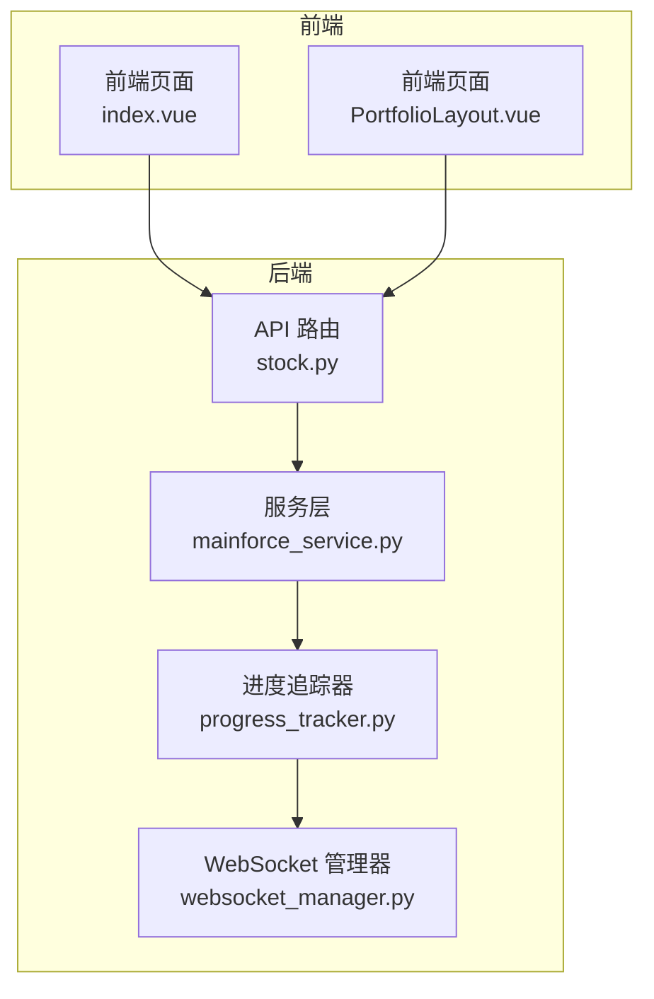
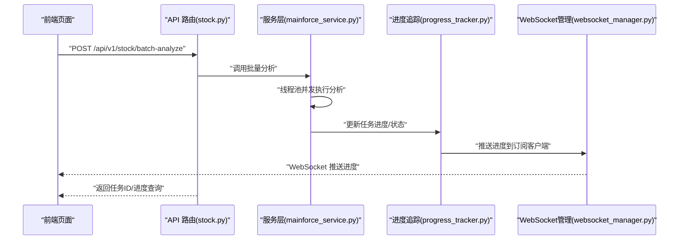
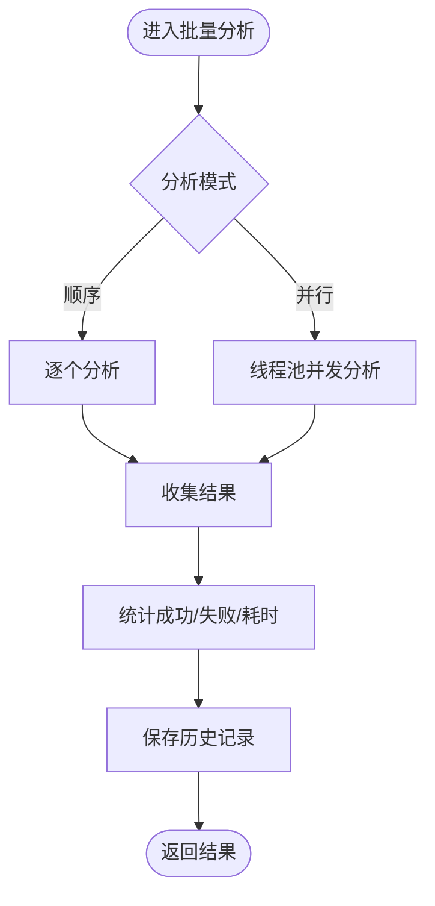
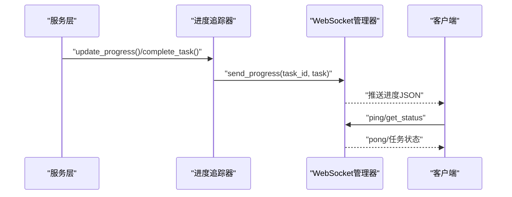
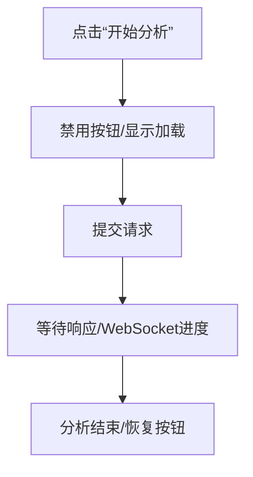
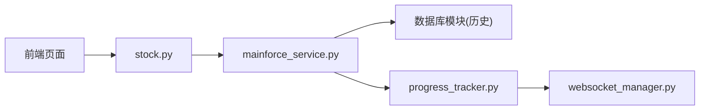

# 批量分析性能优化

<cite>
**本文引用的文件**
- [backend/app/services/mainforce_service.py](file://backend/app/services/mainforce_service.py)
- [backend/app/core/progress_tracker.py](file://backend/app/core/progress_tracker.py)
- [backend/app/core/websocket_manager.py](file://backend/app/core/websocket_manager.py)
- [backend/app/api/v1/stock.py](file://backend/app/api/v1/stock.py)
- [frontend/src/views/mainforce/index.vue](file://frontend/src/views/mainforce/index.vue)
- [frontend/src/views/portfolio/components/PortfolioLayout.vue](file://frontend/src/views/portfolio/components/PortfolioLayout.vue)
- [docs/主力选股批量分析功能说明.md](file://docs/主力选股批量分析功能说明.md)
- [docs/批量分析功能说明.md](file://docs/批量分析功能说明.md)
</cite>

## 目录
1. [简介](#简介)
2. [项目结构](#项目结构)
3. [核心组件](#核心组件)
4. [架构总览](#架构总览)
5. [详细组件分析](#详细组件分析)
6. [依赖关系分析](#依赖关系分析)
7. [性能考量](#性能考量)
8. [故障排查指南](#故障排查指南)
9. [结论](#结论)
10. [附录](#附录)

## 简介
本文件围绕“主力选股批量分析”的性能优化策略进行系统化梳理，重点覆盖以下方面：
- max_workers 参数的合理配置建议：结合 CPU 核心数与 I/O 等待时间，给出推荐范围
- 分析批次大小对内存占用与响应延迟的影响，建议在大规模分析时采用分批提交策略
- 前端通过禁用按钮与加载状态提示提升用户体验，避免重复提交
- 启用分析任务的进度追踪（WebSocket 推送），让用户实时了解处理进度
- 监控指标建议：记录每个批次的平均处理时间、失败率与资源消耗，用于持续优化系统性能

## 项目结构
后端采用 FastAPI + Python 线程池并发执行批量分析；前端通过 Vue + Element Plus 提供交互界面与进度反馈；WebSocket 实时推送分析进度。

图表来源
- [backend/app/api/v1/stock.py](file://backend/app/api/v1/stock.py#L77-L131)
- [backend/app/services/mainforce_service.py](file://backend/app/services/mainforce_service.py#L75-L184)
- [backend/app/core/progress_tracker.py](file://backend/app/core/progress_tracker.py#L1-L171)
- [backend/app/core/websocket_manager.py](file://backend/app/core/websocket_manager.py#L1-L119)
- [frontend/src/views/mainforce/index.vue](file://frontend/src/views/mainforce/index.vue#L1-L120)
- [frontend/src/views/portfolio/components/PortfolioLayout.vue](file://frontend/src/views/portfolio/components/PortfolioLayout.vue#L118-L151)

章节来源
- [backend/app/api/v1/stock.py](file://backend/app/api/v1/stock.py#L77-L131)
- [backend/app/services/mainforce_service.py](file://backend/app/services/mainforce_service.py#L75-L184)
- [backend/app/core/progress_tracker.py](file://backend/app/core/progress_tracker.py#L1-L171)
- [backend/app/core/websocket_manager.py](file://backend/app/core/websocket_manager.py#L1-L119)
- [frontend/src/views/mainforce/index.vue](file://frontend/src/views/mainforce/index.vue#L1-L120)
- [frontend/src/views/portfolio/components/PortfolioLayout.vue](file://frontend/src/views/portfolio/components/PortfolioLayout.vue#L118-L151)

## 核心组件
- 批量分析服务：负责接收请求、调度线程池并发执行、汇总结果并持久化历史
- 进度追踪器：维护任务状态、步骤与进度，触发 WebSocket 推送
- WebSocket 管理器：维护连接与订阅，向客户端推送进度
- API 路由：提供 WebSocket 连接端点与进度查询接口
- 前端页面：提供分析配置、按钮禁用与加载状态、进度展示

章节来源
- [backend/app/services/mainforce_service.py](file://backend/app/services/mainforce_service.py#L75-L184)
- [backend/app/core/progress_tracker.py](file://backend/app/core/progress_tracker.py#L1-L171)
- [backend/app/core/websocket_manager.py](file://backend/app/core/websocket_manager.py#L1-L119)
- [backend/app/api/v1/stock.py](file://backend/app/api/v1/stock.py#L77-L131)
- [frontend/src/views/mainforce/index.vue](file://frontend/src/views/mainforce/index.vue#L1-L120)
- [frontend/src/views/portfolio/components/PortfolioLayout.vue](file://frontend/src/views/portfolio/components/PortfolioLayout.vue#L118-L151)

## 架构总览
后端通过线程池并发执行批量分析，同时利用进度追踪器与 WebSocket 管理器实现实时进度推送。前端在发起分析时禁用按钮与显示加载状态，避免重复提交。

图表来源
- [backend/app/api/v1/stock.py](file://backend/app/api/v1/stock.py#L133-L145)
- [backend/app/services/mainforce_service.py](file://backend/app/services/mainforce_service.py#L75-L184)
- [backend/app/core/progress_tracker.py](file://backend/app/core/progress_tracker.py#L45-L109)
- [backend/app/core/websocket_manager.py](file://backend/app/core/websocket_manager.py#L84-L110)

## 详细组件分析

### 后端：批量分析服务（线程池并发）
- 并行模式：使用线程池执行分析，通过 max_workers 控制并发度
- 顺序模式：逐个执行，适合小规模或网络不稳定场景
- 结果汇总：统计成功/失败数量、总耗时，返回统一结构
- 历史持久化：将批次统计与结果写入数据库

图表来源
- [backend/app/services/mainforce_service.py](file://backend/app/services/mainforce_service.py#L129-L184)

章节来源
- [backend/app/services/mainforce_service.py](file://backend/app/services/mainforce_service.py#L75-L184)

### 后端：进度追踪与 WebSocket 推送
- 任务生命周期：创建、更新进度、完成/失败、清理
- WebSocket 推送：当任务状态变更时，异步通知订阅客户端
- 客户端连接：提供 WebSocket 端点，支持心跳与状态查询

图表来源
- [backend/app/core/progress_tracker.py](file://backend/app/core/progress_tracker.py#L45-L109)
- [backend/app/core/websocket_manager.py](file://backend/app/core/websocket_manager.py#L84-L110)
- [backend/app/api/v1/stock.py](file://backend/app/api/v1/stock.py#L77-L131)

章节来源
- [backend/app/core/progress_tracker.py](file://backend/app/core/progress_tracker.py#L1-L171)
- [backend/app/core/websocket_manager.py](file://backend/app/core/websocket_manager.py#L1-L119)
- [backend/app/api/v1/stock.py](file://backend/app/api/v1/stock.py#L77-L131)

### 前端：按钮禁用与加载状态
- 在发起分析时设置按钮为 loading 并禁用，防止重复提交
- 根据分析模式动态控制并发参数输入项的可用性
- 展示进度与统计信息，提升用户感知

图表来源
- [frontend/src/views/mainforce/index.vue](file://frontend/src/views/mainforce/index.vue#L78-L90)
- [frontend/src/views/portfolio/components/PortfolioLayout.vue](file://frontend/src/views/portfolio/components/PortfolioLayout.vue#L118-L151)

章节来源
- [frontend/src/views/mainforce/index.vue](file://frontend/src/views/mainforce/index.vue#L78-L90)
- [frontend/src/views/portfolio/components/PortfolioLayout.vue](file://frontend/src/views/portfolio/components/PortfolioLayout.vue#L118-L151)

## 依赖关系分析
- 服务层依赖线程池执行分析，依赖数据库模块保存历史
- 进度追踪器依赖 WebSocket 管理器进行推送
- API 路由依赖服务层与进度追踪器
- 前端依赖 API 路由与 WebSocket 端点

图表来源
- [backend/app/api/v1/stock.py](file://backend/app/api/v1/stock.py#L133-L145)
- [backend/app/services/mainforce_service.py](file://backend/app/services/mainforce_service.py#L186-L207)
- [backend/app/core/progress_tracker.py](file://backend/app/core/progress_tracker.py#L114-L138)
- [backend/app/core/websocket_manager.py](file://backend/app/core/websocket_manager.py#L84-L110)

章节来源
- [backend/app/api/v1/stock.py](file://backend/app/api/v1/stock.py#L133-L145)
- [backend/app/services/mainforce_service.py](file://backend/app/services/mainforce_service.py#L186-L207)
- [backend/app/core/progress_tracker.py](file://backend/app/core/progress_tracker.py#L114-L138)
- [backend/app/core/websocket_manager.py](file://backend/app/core/websocket_manager.py#L84-L110)

## 性能考量

### max_workers 合理配置建议
- CPU 密集型：建议不超过 CPU 核心数，避免上下文切换开销
- I/O 密集型：可适度提高并发，但需考虑外部 API 限流与网络抖动
- 建议范围
  - 小规模（<20 只）：2–3
  - 中等规模（20–50 只）：3–5
  - 大规模（>50 只）：5–8，结合分批提交策略
- 参考文档中的并发限制与经验
  - 文档中明确“最多3个并发（避免API限流）”，并给出不同并发下的耗时估算，可作为基准参考

章节来源
- [docs/批量分析功能说明.md](file://docs/批量分析功能说明.md#L261-L266)
- [docs/批量分析功能说明.md](file://docs/批量分析功能说明.md#L146-L156)
- [docs/主力选股批量分析功能说明.md](file://docs/主力选股批量分析功能说明.md#L304-L310)

### 分析批次大小与内存占用、响应延迟
- 内存占用
  - 并行度越高，同时在内存中的中间结果越多，峰值内存上升
  - 建议在大规模分析时采用分批提交策略，降低单次峰值内存
- 响应延迟
  - 单次请求包含大量股票时，前端等待时间显著增加
  - 分批提交可缩短首屏响应时间，提升用户体验
- 建议
  - 单批数量：20–50 只为宜；超过 50 只建议分批（例如 25/25、20/30）
  - 与 max_workers 协同：单批并发控制在 3–5，避免外部 API 限流

章节来源
- [docs/批量分析功能说明.md](file://docs/批量分析功能说明.md#L146-L150)
- [docs/主力选股批量分析功能说明.md](file://docs/主力选股批量分析功能说明.md#L304-L310)

### 前端用户体验优化
- 禁用按钮与加载状态
  - 发起分析时设置按钮 loading 与 disabled，防止重复提交
  - 分析模式切换时，动态启用/禁用并发参数输入框
- 进度可视化
  - 展示“已处理/总数”、“成功率/失败率”、“耗时”等关键指标
  - 结合 WebSocket 实时进度，减少用户焦虑

章节来源
- [frontend/src/views/mainforce/index.vue](file://frontend/src/views/mainforce/index.vue#L78-L90)
- [frontend/src/views/portfolio/components/PortfolioLayout.vue](file://frontend/src/views/portfolio/components/PortfolioLayout.vue#L118-L151)

### 实时进度追踪（WebSocket 推送）
- 后端
  - 进度追踪器在状态变更时触发推送
  - WebSocket 管理器维护订阅关系并向客户端广播
- 前端
  - 建议在页面初始化时建立 WebSocket 连接，订阅任务进度
  - 支持 ping/pong 保活与手动查询状态

章节来源
- [backend/app/core/progress_tracker.py](file://backend/app/core/progress_tracker.py#L45-L109)
- [backend/app/core/websocket_manager.py](file://backend/app/core/websocket_manager.py#L84-L110)
- [backend/app/api/v1/stock.py](file://backend/app/api/v1/stock.py#L77-L131)

### 监控指标建议
- 批次级指标
  - 平均处理时间：单批平均耗时、P95/P99
  - 失败率：按批次统计失败占比
  - 资源消耗：CPU 使用率、内存峰值、并发线程数
- 任务级指标
  - 任务状态分布：进行中/完成/失败
  - 推送延迟：从状态变更到客户端收到的时间差
- 建议采集点
  - 后端：在服务层统计批次耗时与结果；在进度追踪器记录状态变更时间戳
  - 前端：记录 WebSocket 连接建立时间、首次进度到达时间、最后进度到达时间

章节来源
- [backend/app/services/mainforce_service.py](file://backend/app/services/mainforce_service.py#L173-L184)
- [backend/app/core/progress_tracker.py](file://backend/app/core/progress_tracker.py#L45-L109)

## 故障排查指南
- 并发过高导致 API 限流或超时
  - 降低 max_workers，或采用分批提交
  - 参考文档中的并发限制与耗时估算
- WebSocket 无法接收进度
  - 检查 WebSocket 连接是否建立、订阅是否生效
  - 确认后端进度追踪器与 WebSocket 管理器正常工作
- 前端按钮重复提交
  - 确认发起分析时已禁用按钮与显示加载状态
  - 分析结束后再恢复按钮

章节来源
- [docs/批量分析功能说明.md](file://docs/批量分析功能说明.md#L261-L266)
- [backend/app/api/v1/stock.py](file://backend/app/api/v1/stock.py#L77-L131)
- [frontend/src/views/mainforce/index.vue](file://frontend/src/views/mainforce/index.vue#L78-L90)

## 结论
通过合理配置 max_workers、采用分批提交策略、完善前端按钮禁用与加载状态、启用 WebSocket 实时进度推送，并建立完善的监控指标体系，可在保证稳定性的同时显著提升主力选股批量分析的吞吐与用户体验。建议在生产环境中持续观测批次平均耗时、失败率与资源消耗，动态调整并发与批次大小，实现性能与成本的平衡。

## 附录
- 相关文档
  - [主力选股批量分析功能说明.md](file://docs/主力选股批量分析功能说明.md)
  - [批量分析功能说明.md](file://docs/批量分析功能说明.md)