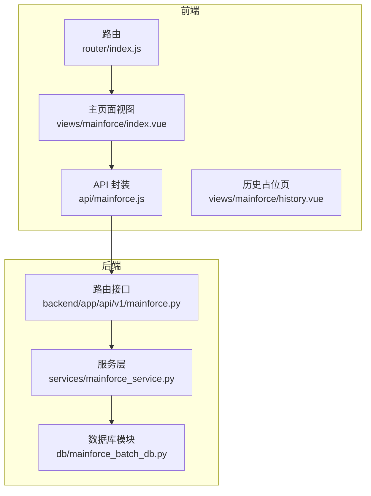
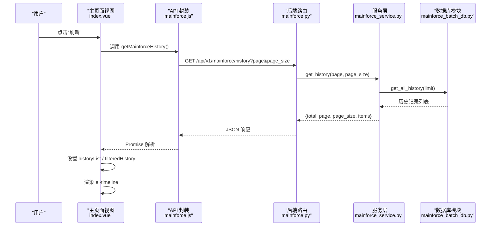
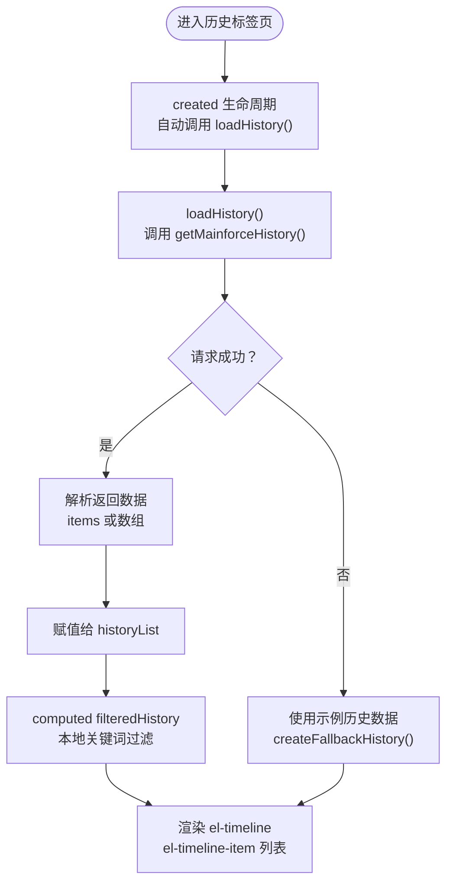
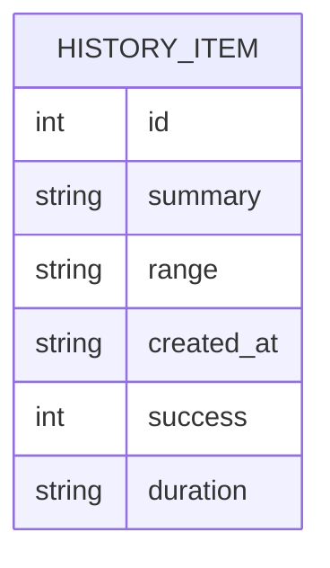
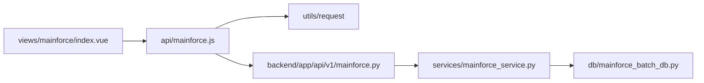

# 批量分析结果前端展示

<cite>
**本文引用的文件**
- [frontend/src/views/mainforce/index.vue](file://frontend/src/views/mainforce/index.vue)
- [frontend/src/api/mainforce.js](file://frontend/src/api/mainforce.js)
- [frontend/src/router/index.js](file://frontend/src/router/index.js)
- [backend/app/api/v1/mainforce.py](file://backend/app/api/v1/mainforce.py)
- [backend/app/services/mainforce_service.py](file://backend/app/services/mainforce_service.py)
- [backend/app/db/mainforce_batch_db.py](file://backend/app/db/mainforce_batch_db.py)
- [frontend/src/views/mainforce/history.vue](file://frontend/src/views/mainforce/history.vue)
</cite>

## 目录
1. [简介](#简介)
2. [项目结构](#项目结构)
3. [核心组件](#核心组件)
4. [架构总览](#架构总览)
5. [详细组件分析](#详细组件分析)
6. [依赖关系分析](#依赖关系分析)
7. [性能考量](#性能考量)
8. [故障排查指南](#故障排查指南)
9. [结论](#结论)
10. [附录](#附录)

## 简介
本文件面向主力选股批量分析结果的历史记录展示，聚焦于“历史”标签页如何通过 getMainforceHistory API 获取历史批次数据，并在 Element UI 的时间轴组件中进行渲染。文档详细说明：
- 前端数据结构映射：如何将后端返回的批次摘要、成功数量、执行耗时等字段映射到时间轴卡片展示。
- 时间筛选与分页加载：当前页面采用本地搜索过滤，后端提供分页参数但前端未启用分页。
- 结果展开与交互：当前“查看详情”为占位提示，后续可扩展为弹窗或新页面。
- UI/UX 优化建议：加载状态提示、错误处理反馈、响应式布局适配与可访问性。

## 项目结构
- 前端入口与路由：通过路由将“主力选股/历史记录”挂载到主页面的标签页中。
- 前端视图：历史标签页由主页面的“历史”标签页承载，使用 Element UI 的时间轴组件展示历史批次。
- 前端 API：封装 getMainforceHistory 请求，供视图层调用。
- 后端接口：提供历史记录查询接口，支持分页参数；服务层负责调用数据库模块并返回结构化数据。

图表来源
- [frontend/src/router/index.js](file://frontend/src/router/index.js#L90-L116)
- [frontend/src/views/mainforce/index.vue](file://frontend/src/views/mainforce/index.vue#L242-L281)
- [frontend/src/api/mainforce.js](file://frontend/src/api/mainforce.js#L22-L28)
- [backend/app/api/v1/mainforce.py](file://backend/app/api/v1/mainforce.py#L48-L61)
- [backend/app/services/mainforce_service.py](file://backend/app/services/mainforce_service.py#L208-L234)
- [backend/app/db/mainforce_batch_db.py](file://backend/app/db/mainforce_batch_db.py#L149-L192)

章节来源
- [frontend/src/router/index.js](file://frontend/src/router/index.js#L90-L116)
- [frontend/src/views/mainforce/index.vue](file://frontend/src/views/mainforce/index.vue#L242-L281)
- [frontend/src/api/mainforce.js](file://frontend/src/api/mainforce.js#L22-L28)
- [backend/app/api/v1/mainforce.py](file://backend/app/api/v1/mainforce.py#L48-L61)

## 核心组件
- 历史标签页容器：在主页面的“历史”标签页中，包含搜索框、刷新按钮与时间轴列表。
- 时间轴组件：使用 Element UI 的 el-timeline 与 el-timeline-item 展示每条历史批次。
- 数据映射：将后端返回的批次摘要、成功数量、执行耗时等字段映射到时间轴卡片的标题、副标题与标签区。
- 交互控制：支持本地关键词过滤、刷新加载、查看详情占位提示。

章节来源
- [frontend/src/views/mainforce/index.vue](file://frontend/src/views/mainforce/index.vue#L242-L281)
- [frontend/src/views/mainforce/index.vue](file://frontend/src/views/mainforce/index.vue#L634-L652)

## 架构总览
从前端到后端的数据流如下：
- 前端在“历史”标签页创建时或点击“刷新”时，调用 getMainforceHistory 发起请求。
- 后端路由接收请求，调用服务层方法获取历史记录。
- 服务层从数据库模块读取历史数据，构造分页结果并返回给前端。
- 前端将返回的列表绑定到时间轴组件，渲染批次摘要、成功数量与耗时等信息。

图表来源
- [frontend/src/views/mainforce/index.vue](file://frontend/src/views/mainforce/index.vue#L634-L652)
- [frontend/src/api/mainforce.js](file://frontend/src/api/mainforce.js#L22-L28)
- [backend/app/api/v1/mainforce.py](file://backend/app/api/v1/mainforce.py#L48-L61)
- [backend/app/services/mainforce_service.py](file://backend/app/services/mainforce_service.py#L208-L234)
- [backend/app/db/mainforce_batch_db.py](file://backend/app/db/mainforce_batch_db.py#L149-L192)

## 详细组件分析

### 历史标签页与时间轴渲染
- 搜索与过滤：提供关键词输入框，支持按批次摘要、时间区间、批次编号进行本地过滤。
- 刷新与加载：点击刷新按钮时，设置加载状态，调用 API 获取历史列表，异常时回退到示例数据。
- 时间轴卡片：每个批次以 el-timeline-item 渲染，时间戳显示创建时间，卡片内展示批次编号、摘要、时间区间、成功数量与耗时等指标。

图表来源
- [frontend/src/views/mainforce/index.vue](file://frontend/src/views/mainforce/index.vue#L634-L652)
- [frontend/src/views/mainforce/index.vue](file://frontend/src/views/mainforce/index.vue#L514-L522)

章节来源
- [frontend/src/views/mainforce/index.vue](file://frontend/src/views/mainforce/index.vue#L242-L281)
- [frontend/src/views/mainforce/index.vue](file://frontend/src/views/mainforce/index.vue#L514-L522)
- [frontend/src/views/mainforce/index.vue](file://frontend/src/views/mainforce/index.vue#L634-L652)

### 数据结构映射与字段说明
- 后端返回结构（简化）：包含 total、page、page_size、items 数组。
- 前端 items 字段映射到时间轴卡片：
  - id → “历史批次 #id”
  - summary → 摘要
  - range → 时间区间（当前页面未直接使用该字段，但数据存在）
  - created_at → 时间轴时间戳
  - success → 成功数量标签
  - duration → 耗时标签（当前页面未直接使用该字段，但数据存在）

图表来源
- [backend/app/services/mainforce_service.py](file://backend/app/services/mainforce_service.py#L208-L234)
- [backend/app/db/mainforce_batch_db.py](file://backend/app/db/mainforce_batch_db.py#L149-L192)
- [frontend/src/views/mainforce/index.vue](file://frontend/src/views/mainforce/index.vue#L254-L280)

章节来源
- [backend/app/services/mainforce_service.py](file://backend/app/services/mainforce_service.py#L208-L234)
- [backend/app/db/mainforce_batch_db.py](file://backend/app/db/mainforce_batch_db.py#L149-L192)
- [frontend/src/views/mainforce/index.vue](file://frontend/src/views/mainforce/index.vue#L254-L280)

### 交互功能实现细节
- 时间筛选：当前为本地关键词过滤，支持按摘要、时间区间、批次编号匹配。
- 分页加载：后端接口支持 page/page_size 参数，但前端未启用分页组件与翻页逻辑，当前仅使用 limit 限制返回数量。
- 结果展开：当前“查看详情”为占位提示，后续可接入详情弹窗或新页面路由。

章节来源
- [frontend/src/views/mainforce/index.vue](file://frontend/src/views/mainforce/index.vue#L242-L281)
- [frontend/src/views/mainforce/index.vue](file://frontend/src/views/mainforce/index.vue#L514-L522)
- [frontend/src/views/mainforce/index.vue](file://frontend/src/views/mainforce/index.vue#L648-L652)
- [backend/app/api/v1/mainforce.py](file://backend/app/api/v1/mainforce.py#L48-L61)

### 历史占位页与路由
- 当前“历史记录”独立页面仍为占位，实际历史展示在主页面的“历史”标签页中。
- 路由配置中存在“主页面/历史记录”的子路由项，便于未来迁移至独立页面。

章节来源
- [frontend/src/views/mainforce/history.vue](file://frontend/src/views/mainforce/history.vue#L1-L13)
- [frontend/src/router/index.js](file://frontend/src/router/index.js#L111-L115)

## 依赖关系分析
- 前端依赖
  - 视图依赖 API 封装与 Element UI 组件。
  - API 封装依赖通用请求工具。
- 后端依赖
  - 路由依赖服务层。
  - 服务层依赖数据库模块。
  - 数据库模块基于 SQLite 存储历史记录。

图表来源
- [frontend/src/views/mainforce/index.vue](file://frontend/src/views/mainforce/index.vue#L320-L323)
- [frontend/src/api/mainforce.js](file://frontend/src/api/mainforce.js#L1-L29)
- [backend/app/api/v1/mainforce.py](file://backend/app/api/v1/mainforce.py#L48-L61)
- [backend/app/services/mainforce_service.py](file://backend/app/services/mainforce_service.py#L208-L234)
- [backend/app/db/mainforce_batch_db.py](file://backend/app/db/mainforce_batch_db.py#L149-L192)

章节来源
- [frontend/src/views/mainforce/index.vue](file://frontend/src/views/mainforce/index.vue#L320-L323)
- [frontend/src/api/mainforce.js](file://frontend/src/api/mainforce.js#L1-L29)
- [backend/app/api/v1/mainforce.py](file://backend/app/api/v1/mainforce.py#L48-L61)
- [backend/app/services/mainforce_service.py](file://backend/app/services/mainforce_service.py#L208-L234)
- [backend/app/db/mainforce_batch_db.py](file://backend/app/db/mainforce_batch_db.py#L149-L192)

## 性能考量
- 前端渲染
  - 本地过滤在小规模数据集下开销较低；当历史记录增多时，建议引入虚拟滚动或后端过滤。
  - 时间轴渲染为一次性列表，建议避免重复渲染，可通过 key 稳定列表项。
- 后端查询
  - 服务层使用 limit 控制返回数量，避免一次性返回大量历史记录。
  - 数据库按创建时间倒序查询，保证最新批次优先展示。
- 网络与并发
  - 刷新按钮设置加载态，避免重复请求；建议增加防抖或节流。
  - 若历史记录较多，建议实现分页组件与懒加载，减少首屏压力。

[本节为通用指导，不直接分析具体文件]

## 故障排查指南
- 接口未就绪
  - 现象：请求失败或返回空列表时，前端回退到示例历史数据并提示“历史接口未就绪”。
  - 处理：检查后端服务是否启动、路由是否正确注册、数据库是否存在历史记录。
- 数据为空
  - 现象：首次进入或数据库无历史记录时，显示空状态与示例数据。
  - 处理：确认批量分析已完成并成功写入历史记录。
- 过滤无效
  - 现象：关键词过滤不生效。
  - 处理：确认过滤逻辑对摘要、时间区间、批次编号的匹配条件是否满足。
- 查看详情不可用
  - 现象：“查看详情”弹窗提示功能待开放。
  - 处理：后续可接入详情弹窗或新页面路由。

章节来源
- [frontend/src/views/mainforce/index.vue](file://frontend/src/views/mainforce/index.vue#L634-L652)

## 结论
- 历史标签页通过 getMainforceHistory API 获取历史批次数据，并在时间轴组件中直观展示关键指标。
- 当前实现以本地过滤与占位交互为主，具备良好的扩展性：可引入分页、详情弹窗、响应式布局优化与更丰富的统计卡片。
- 建议在不影响现有功能的前提下，逐步完善交互体验与性能表现。

[本节为总结，不直接分析具体文件]

## 附录

### API 定义与字段对照
- 前端调用
  - 方法：getMainforceHistory()
  - 请求方式：GET
  - 路径：/api/v1/mainforce/history
  - 参数：page、page_size（后端支持，前端未启用）
- 后端返回
  - 结构：{ total, page, page_size, items[] }
  - items 字段：id、analysis_date、batch_count、analysis_mode、success_count、failed_count、total_time、results、created_at
- 前端映射
  - 时间轴：timestamp → created_at
  - 卡片：id → “历史批次 #id”；summary → 摘要；range → 时间区间；success → 成功数量标签；duration → 耗时标签

章节来源
- [frontend/src/api/mainforce.js](file://frontend/src/api/mainforce.js#L22-L28)
- [backend/app/api/v1/mainforce.py](file://backend/app/api/v1/mainforce.py#L48-L61)
- [backend/app/services/mainforce_service.py](file://backend/app/services/mainforce_service.py#L208-L234)
- [backend/app/db/mainforce_batch_db.py](file://backend/app/db/mainforce_batch_db.py#L149-L192)
- [frontend/src/views/mainforce/index.vue](file://frontend/src/views/mainforce/index.vue#L254-L280)