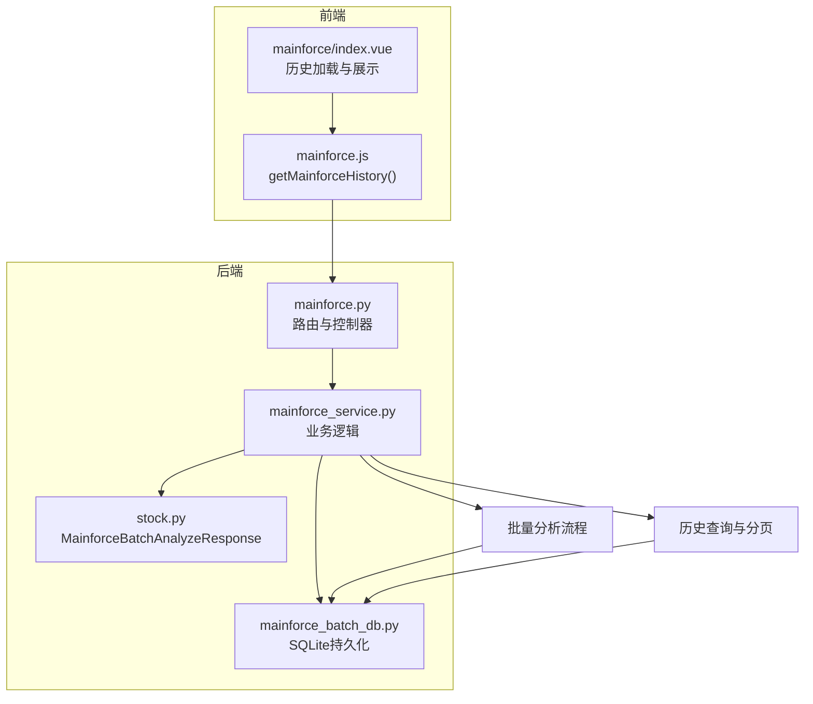
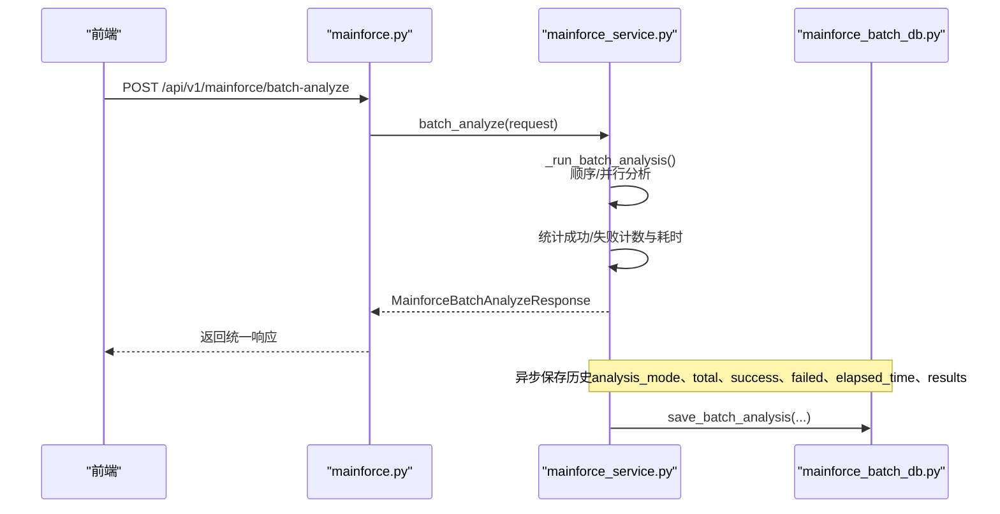
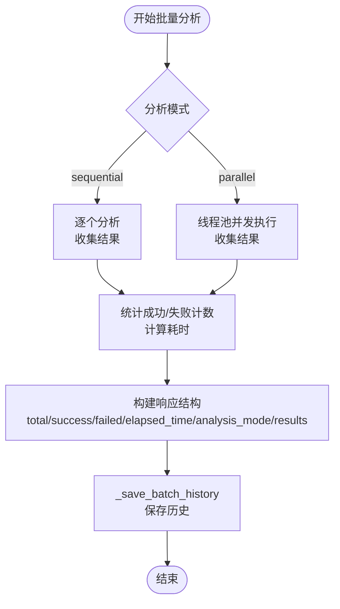
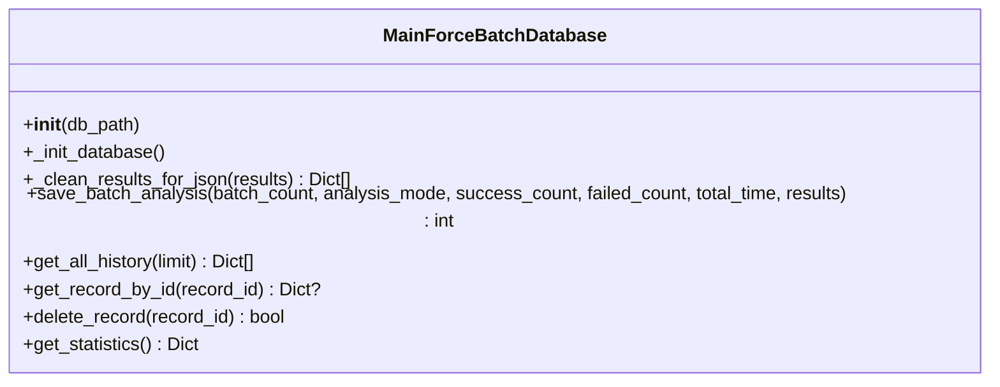
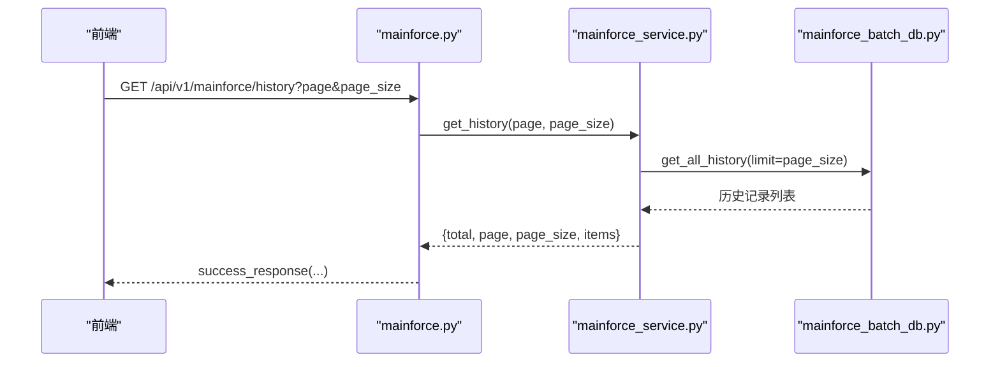
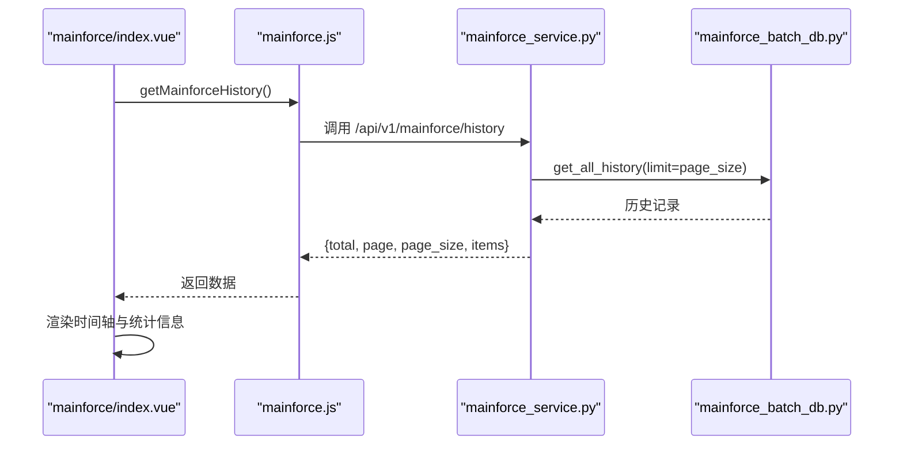
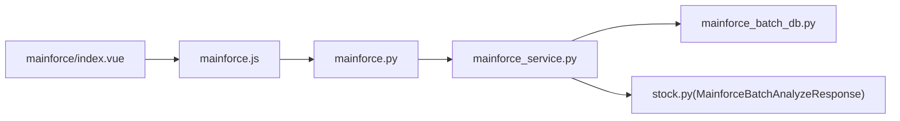

# 批量分析结果处理

<cite>
**本文引用的文件**
- [backend/app/services/mainforce_service.py](file://backend/app/services/mainforce_service.py)
- [backend/app/api/v1/mainforce.py](file://backend/app/api/v1/mainforce.py)
- [backend/app/db/mainforce_batch_db.py](file://backend/app/db/mainforce_batch_db.py)
- [backend/app/schemas/stock.py](file://backend/app/schemas/stock.py)
- [frontend/src/api/mainforce.js](file://frontend/src/api/mainforce.js)
- [frontend/src/views/mainforce/index.vue](file://frontend/src/views/mainforce/index.vue)
- [docs/主力选股批量分析历史记录功能说明.md](file://docs/主力选股批量分析历史记录功能说明.md)
</cite>

## 目录
1. [简介](#简介)
2. [项目结构](#项目结构)
3. [核心组件](#核心组件)
4. [架构总览](#架构总览)
5. [详细组件分析](#详细组件分析)
6. [依赖关系分析](#依赖关系分析)
7. [性能考量](#性能考量)
8. [故障排查指南](#故障排查指南)
9. [结论](#结论)
10. [附录](#附录)

## 简介
本文档围绕“主力选股批量分析”在后端的服务层与数据库层的实现，系统阐述后端如何聚合单个股票分析结果并生成统一的 MainforceBatchAnalyzeResponse 响应结构；解释 _results 列表的构建过程、成功/失败计数逻辑以及耗时统计方法；描述 _save_batch_history 方法如何将分析结果持久化到 SQLite 数据库，并关联分析模式、执行时间和结果摘要等元数据；从前端视角说明 history 标签页如何通过 getMainforceHistory API 获取历史记录，并在时间轴组件中展示批次摘要、成功数量和执行耗时等关键指标；最后给出结果数据结构的最佳实践，确保前后端对响应格式的理解一致。

## 项目结构
- 后端服务层：负责接收批量分析请求、调度并行/顺序分析、聚合结果、保存历史、返回统一响应。
- API 层：暴露 /api/v1/mainforce/batch-analyze 与 /api/v1/mainforce/history 两个接口。
- 数据库层：使用 SQLite 存储批量分析历史，包含批次元数据与 JSON 化的结果集。
- 前端：通过 API 获取历史记录并在时间轴组件中展示关键指标。

图表来源
- [backend/app/api/v1/mainforce.py](file://backend/app/api/v1/mainforce.py#L1-L62)
- [backend/app/services/mainforce_service.py](file://backend/app/services/mainforce_service.py#L1-L235)
- [backend/app/db/mainforce_batch_db.py](file://backend/app/db/mainforce_batch_db.py#L1-L302)
- [backend/app/schemas/stock.py](file://backend/app/schemas/stock.py#L83-L100)
- [frontend/src/api/mainforce.js](file://frontend/src/api/mainforce.js#L1-L30)
- [frontend/src/views/mainforce/index.vue](file://frontend/src/views/mainforce/index.vue#L634-L652)

章节来源
- [backend/app/api/v1/mainforce.py](file://backend/app/api/v1/mainforce.py#L1-L62)
- [backend/app/services/mainforce_service.py](file://backend/app/services/mainforce_service.py#L1-L235)
- [backend/app/db/mainforce_batch_db.py](file://backend/app/db/mainforce_batch_db.py#L1-L302)
- [backend/app/schemas/stock.py](file://backend/app/schemas/stock.py#L83-L100)
- [frontend/src/api/mainforce.js](file://frontend/src/api/mainforce.js#L1-L30)
- [frontend/src/views/mainforce/index.vue](file://frontend/src/views/mainforce/index.vue#L634-L652)

## 核心组件
- 主力选股服务 MainforceService：封装批量分析、历史查询与持久化。
- API 控制器 mainforce.py：定义 /batch-analyze 与 /history 接口。
- 数据库模块 MainForceBatchDatabase：负责建表、清洗 JSON、插入与查询历史。
- 响应模型 MainforceBatchAnalyzeResponse：统一的批量分析响应结构。
- 前端 API mainforce.js 与页面 index.vue：历史记录拉取与时间轴展示。

章节来源
- [backend/app/services/mainforce_service.py](file://backend/app/services/mainforce_service.py#L1-L235)
- [backend/app/api/v1/mainforce.py](file://backend/app/api/v1/mainforce.py#L1-L62)
- [backend/app/db/mainforce_batch_db.py](file://backend/app/db/mainforce_batch_db.py#L1-L302)
- [backend/app/schemas/stock.py](file://backend/app/schemas/stock.py#L83-L100)
- [frontend/src/api/mainforce.js](file://frontend/src/api/mainforce.js#L1-L30)
- [frontend/src/views/mainforce/index.vue](file://frontend/src/views/mainforce/index.vue#L634-L652)

## 架构总览
后端采用“API -> 服务 -> 数据库”的分层设计。批量分析请求由 API 层接收，服务层在独立线程池中执行顺序或并行分析，聚合结果后计算成功/失败计数与耗时，构造统一响应并异步保存历史记录。历史查询接口返回分页后的历史列表，前端以时间轴形式展示批次摘要、成功数量与耗时等关键指标。

图表来源
- [backend/app/api/v1/mainforce.py](file://backend/app/api/v1/mainforce.py#L34-L46)
- [backend/app/services/mainforce_service.py](file://backend/app/services/mainforce_service.py#L75-L105)
- [backend/app/services/mainforce_service.py](file://backend/app/services/mainforce_service.py#L106-L185)
- [backend/app/db/mainforce_batch_db.py](file://backend/app/db/mainforce_batch_db.py#L105-L147)

## 详细组件分析

### 后端服务层：批量分析与历史保存
- 请求入口与响应模型
  - API 层定义 /batch-analyze 接口，调用服务层的 batch_analyze，返回 MainforceBatchAnalyzeResponse。
  - 响应模型包含 total、success、failed、elapsed_time、analysis_mode、results 等字段。
- 批量分析流程
  - _run_batch_analysis 支持 sequential 与 parallel 两种模式：
    - 顺序模式：逐个调用统一分析函数，收集结果。
    - 并行模式：使用线程池并发执行，汇总结果。
  - 统计逻辑：
    - 成功计数：遍历 results，统计 success 字段为真值的数量。
    - 失败计数：total - success。
    - 耗时统计：使用时间戳差值计算 elapsed_time。
  - 结果聚合：将每个股票的分析结果放入 results 列表，统一为字典结构。
- 历史保存
  - _save_batch_history 将 total、analysis_mode、success、failed、elapsed_time、results 传递给数据库模块。
  - 数据库模块在保存前对 results 进行 JSON 序列化清洗，确保包含 DataFrame/Series 等不可序列化对象时能安全落库。

图表来源
- [backend/app/services/mainforce_service.py](file://backend/app/services/mainforce_service.py#L106-L185)
- [backend/app/services/mainforce_service.py](file://backend/app/services/mainforce_service.py#L186-L207)

章节来源
- [backend/app/api/v1/mainforce.py](file://backend/app/api/v1/mainforce.py#L34-L46)
- [backend/app/schemas/stock.py](file://backend/app/schemas/stock.py#L83-L100)
- [backend/app/services/mainforce_service.py](file://backend/app/services/mainforce_service.py#L75-L105)
- [backend/app/services/mainforce_service.py](file://backend/app/services/mainforce_service.py#L106-L185)
- [backend/app/services/mainforce_service.py](file://backend/app/services/mainforce_service.py#L186-L207)

### 数据库层：历史记录持久化
- 表结构与字段
  - 表名：batch_analysis_history
  - 字段：id、analysis_date、batch_count、analysis_mode、success_count、failed_count、total_time、results_json、created_at
- 保存流程
  - 生成 analysis_date（当前时间）。
  - 使用 _clean_results_for_json 对 results 进行递归清洗，确保 JSON 可序列化（DataFrame/Series 转换、限制行数、基本类型保留、其他对象转字符串）。
  - 将清洗后的结果序列化为 JSON 字符串，插入表中。
- 查询与统计
  - get_all_history：按 created_at 倒序返回 limit 条记录，尝试解析 results_json 为字典列表。
  - get_statistics：统计总记录数、总分析股票数、总成功/失败数、平均耗时与成功率。

图表来源
- [backend/app/db/mainforce_batch_db.py](file://backend/app/db/mainforce_batch_db.py#L1-L302)

章节来源
- [backend/app/db/mainforce_batch_db.py](file://backend/app/db/mainforce_batch_db.py#L27-L39)
- [backend/app/db/mainforce_batch_db.py](file://backend/app/db/mainforce_batch_db.py#L51-L104)
- [backend/app/db/mainforce_batch_db.py](file://backend/app/db/mainforce_batch_db.py#L105-L147)
- [backend/app/db/mainforce_batch_db.py](file://backend/app/db/mainforce_batch_db.py#L149-L191)
- [backend/app/db/mainforce_batch_db.py](file://backend/app/db/mainforce_batch_db.py#L258-L298)

### API 层：历史记录接口
- /api/v1/mainforce/history
  - 参数：page、page_size、db（依赖注入）
  - 逻辑：调用服务层 get_history，返回分页后的 items 与 total/page/page_size。
  - 响应：success_response 包裹结果。

图表来源
- [backend/app/api/v1/mainforce.py](file://backend/app/api/v1/mainforce.py#L48-L61)
- [backend/app/services/mainforce_service.py](file://backend/app/services/mainforce_service.py#L208-L234)
- [backend/app/db/mainforce_batch_db.py](file://backend/app/db/mainforce_batch_db.py#L149-L191)

章节来源
- [backend/app/api/v1/mainforce.py](file://backend/app/api/v1/mainforce.py#L48-L61)
- [backend/app/services/mainforce_service.py](file://backend/app/services/mainforce_service.py#L208-L234)

### 前端：历史记录展示与交互
- 历史加载
  - 通过 getMainforceHistory 发起请求，成功后将返回的 items 赋值给历史列表；若失败则回退到示例数据。
- 时间轴展示
  - 前端页面中存在时间轴组件（Timeline），用于展示历史记录的时间戳与摘要信息。
  - 文档中明确历史记录页面包含“统计信息”、“具体记录”、“管理记录”等区域，其中包含“分析时间”、“分析模式”、“分析数量”、“总耗时”、“成功数量”、“失败数量”、“成功率”、“平均单股耗时”等关键指标。
- 交互行为
  - 页面提供“刷新列表”等操作，便于用户获取最新历史。

图表来源
- [frontend/src/api/mainforce.js](file://frontend/src/api/mainforce.js#L21-L27)
- [frontend/src/views/mainforce/index.vue](file://frontend/src/views/mainforce/index.vue#L634-L652)
- [docs/主力选股批量分析历史记录功能说明.md](file://docs/主力选股批量分析历史记录功能说明.md#L54-L116)

章节来源
- [frontend/src/api/mainforce.js](file://frontend/src/api/mainforce.js#L21-L27)
- [frontend/src/views/mainforce/index.vue](file://frontend/src/views/mainforce/index.vue#L634-L652)
- [docs/主力选股批量分析历史记录功能说明.md](file://docs/主力选股批量分析历史记录功能说明.md#L54-L116)

## 依赖关系分析
- 服务层依赖
  - 服务层依赖数据库模块进行历史保存与查询。
  - 服务层依赖响应模型进行统一输出。
- API 层依赖
  - API 层依赖服务层完成业务处理。
- 前端依赖
  - 前端通过 API 模块调用后端接口，依赖后端返回的数据结构进行渲染。

图表来源
- [backend/app/api/v1/mainforce.py](file://backend/app/api/v1/mainforce.py#L1-L62)
- [backend/app/services/mainforce_service.py](file://backend/app/services/mainforce_service.py#L1-L235)
- [backend/app/db/mainforce_batch_db.py](file://backend/app/db/mainforce_batch_db.py#L1-L302)
- [backend/app/schemas/stock.py](file://backend/app/schemas/stock.py#L83-L100)
- [frontend/src/api/mainforce.js](file://frontend/src/api/mainforce.js#L1-L30)
- [frontend/src/views/mainforce/index.vue](file://frontend/src/views/mainforce/index.vue#L634-L652)

章节来源
- [backend/app/api/v1/mainforce.py](file://backend/app/api/v1/mainforce.py#L1-L62)
- [backend/app/services/mainforce_service.py](file://backend/app/services/mainforce_service.py#L1-L235)
- [backend/app/db/mainforce_batch_db.py](file://backend/app/db/mainforce_batch_db.py#L1-L302)
- [backend/app/schemas/stock.py](file://backend/app/schemas/stock.py#L83-L100)
- [frontend/src/api/mainforce.js](file://frontend/src/api/mainforce.js#L1-L30)
- [frontend/src/views/mainforce/index.vue](file://frontend/src/views/mainforce/index.vue#L634-L652)

## 性能考量
- 并行分析
  - 并行模式通过线程池并发执行，提升吞吐；需合理设置 max_workers，避免 API 限流与资源争用。
- JSON 序列化清洗
  - 数据库层对不可序列化对象（如 DataFrame/Series）进行清洗与限制，避免大对象导致存储膨胀与序列化失败。
- 历史查询分页
  - 服务层对历史记录进行简单分页（基于已按时间倒序的列表切片），避免一次性加载过多数据。
- 异步保存
  - 历史保存在独立线程中执行，不影响主分析流程的响应时间。

章节来源
- [backend/app/services/mainforce_service.py](file://backend/app/services/mainforce_service.py#L148-L172)
- [backend/app/db/mainforce_batch_db.py](file://backend/app/db/mainforce_batch_db.py#L51-L104)
- [backend/app/services/mainforce_service.py](file://backend/app/services/mainforce_service.py#L208-L234)

## 故障排查指南
- 保存历史失败
  - 现象：批量分析完成后历史记录中没有新记录。
  - 排查：查看后端日志，确认数据库写入权限、磁盘空间；检查 JSON 序列化清洗逻辑是否正常工作。
- 历史记录显示错误
  - 现象：点击“批量分析历史”后显示错误。
  - 排查：确认数据库文件存在且可读；尝试删除数据库文件后由系统重建；查看错误详情。
- 加载历史结果失败
  - 现象：点击“加载到当前结果”后无响应。
  - 排查：刷新页面重试；检查结果数据完整性；重新执行一次批量分析。
- 成功/失败计数异常
  - 现象：统计结果与预期不符。
  - 排查：确认每个子结果的 success 字段是否正确；检查并行执行时的异常捕获与结果拼接逻辑。

章节来源
- [docs/主力选股批量分析历史记录功能说明.md](file://docs/主力选股批量分析历史记录功能说明.md#L168-L192)

## 结论
后端通过统一的批量分析服务与数据库持久化，实现了从“单个股票分析结果聚合”到“统一响应与历史记录”的完整闭环。服务层在顺序/并行两种模式下均可稳定产出统一的 MainforceBatchAnalyzeResponse，并在异步线程中保存历史记录。前端通过 getMainforceHistory 获取历史列表，在时间轴组件中直观展示批次摘要、成功数量与执行耗时等关键指标。数据库层对结果进行 JSON 清洗，保障了数据一致性与可读性。

## 附录

### 响应结构与字段约定（最佳实践）
- 统一响应模型：MainforceBatchAnalyzeResponse
  - 字段：total、success、failed、elapsed_time、analysis_mode、results
  - 语义：total 为请求股票总数；success/failed 为成功/失败计数；elapsed_time 为总耗时（秒）；analysis_mode 为顺序/并行；results 为每只股票的分析结果字典列表。
- 前端消费建议
  - 历史接口返回 items 列表，包含批次元数据与 results；前端以时间轴展示 created_at、analysis_mode、batch_count、total_time、success_count 等关键指标。
  - 若后端返回结构与 items/items[] 不一致，前端应做兼容处理（参考页面中的回退逻辑）。

章节来源
- [backend/app/schemas/stock.py](file://backend/app/schemas/stock.py#L83-L100)
- [frontend/src/views/mainforce/index.vue](file://frontend/src/views/mainforce/index.vue#L634-L652)
- [docs/主力选股批量分析历史记录功能说明.md](file://docs/主力选股批量分析历史记录功能说明.md#L54-L116)