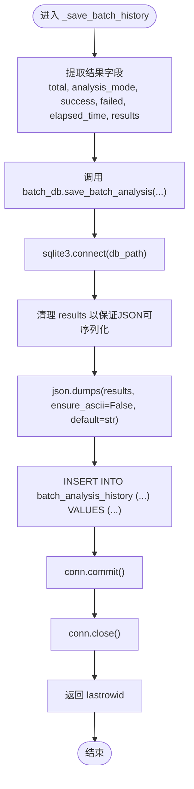

# 批量分析结果持久化

<cite>
**本文引用的文件**
- [backend/app/db/mainforce_batch_db.py](file://backend/app/db/mainforce_batch_db.py)
- [backend/app/services/mainforce_service.py](file://backend/app/services/mainforce_service.py)
- [backend/app/api/v1/mainforce.py](file://backend/app/api/v1/mainforce.py)
- [docs/主力选股批量分析历史记录功能说明.md](file://docs/主力选股批量分析历史记录功能说明.md)
</cite>

## 目录
1. [简介](#简介)
2. [项目结构](#项目结构)
3. [核心组件](#核心组件)
4. [架构总览](#架构总览)
5. [详细组件分析](#详细组件分析)
6. [依赖关系分析](#依赖关系分析)
7. [性能考量](#性能考量)
8. [故障排查指南](#故障排查指南)
9. [结论](#结论)
10. [附录](#附录)

## 简介
本文件围绕“主力选股批量分析结果持久化”主题，系统阐述后端如何将批量分析结果写入SQLite数据库，重点覆盖以下要点：
- _save_batch_history方法如何将分析结果写入SQLite数据库
- 数据库表结构设计与字段含义（批次ID、分析模式、执行时间、成功/失败计数、耗时、结果摘要等）
- 事务处理与数据一致性保障
- 结果列表的序列化与反序列化策略
- 数据库连接管理、异常处理与重试策略
- 数据库文件（main_force_batch.db）的维护建议（备份与空间清理）

## 项目结构
与批量分析结果持久化直接相关的后端模块组织如下：
- API层：负责接收请求、调用服务层
- 服务层：封装业务逻辑，协调分析与持久化
- 数据层：封装SQLite访问、表结构初始化、查询与统计

图表来源
- [backend/app/api/v1/mainforce.py](file://backend/app/api/v1/mainforce.py#L1-L62)
- [backend/app/services/mainforce_service.py](file://backend/app/services/mainforce_service.py#L1-L235)
- [backend/app/db/mainforce_batch_db.py](file://backend/app/db/mainforce_batch_db.py#L1-L302)

章节来源
- [backend/app/api/v1/mainforce.py](file://backend/app/api/v1/mainforce.py#L1-L62)
- [backend/app/services/mainforce_service.py](file://backend/app/services/mainforce_service.py#L1-L235)
- [backend/app/db/mainforce_batch_db.py](file://backend/app/db/mainforce_batch_db.py#L1-L302)

## 核心组件
- 数据库类：MainForceBatchDatabase
  - 负责表结构初始化、插入、查询、统计与删除
  - 提供全局实例 batch_db
- 服务类：MainforceService
  - 负责批量分析调度、结果汇总与历史记录持久化
  - 通过线程池执行分析与持久化，避免阻塞异步事件循环
- API路由：/api/v1/mainforce.py
  - 提供批量分析与历史查询接口

章节来源
- [backend/app/db/mainforce_batch_db.py](file://backend/app/db/mainforce_batch_db.py#L1-L302)
- [backend/app/services/mainforce_service.py](file://backend/app/services/mainforce_service.py#L1-L235)
- [backend/app/api/v1/mainforce.py](file://backend/app/api/v1/mainforce.py#L1-L62)

## 架构总览
批量分析结果持久化的关键流程如下：
- API接收批量分析请求
- 服务层在独立线程池中执行分析，计算总耗时、成功/失败计数，并收集每个股票的分析结果
- 服务层调用数据库模块，将批次信息与结果序列化后写入SQLite
- 历史查询通过数据库模块读取并反序列化返回给前端

图表来源
- [backend/app/api/v1/mainforce.py](file://backend/app/api/v1/mainforce.py#L34-L46)
- [backend/app/services/mainforce_service.py](file://backend/app/services/mainforce_service.py#L75-L105)
- [backend/app/services/mainforce_service.py](file://backend/app/services/mainforce_service.py#L186-L207)
- [backend/app/db/mainforce_batch_db.py](file://backend/app/db/mainforce_batch_db.py#L105-L147)

## 详细组件分析

### 数据库表结构设计
- 表名：batch_analysis_history
- 字段说明（与持久化直接相关）：
  - id：自增主键
  - analysis_date：分析日期时间（写入时采用当前时间）
  - batch_count：本次分析的股票数量
  - analysis_mode：分析模式（sequential/parallel）
  - success_count：成功数量
  - failed_count：失败数量
  - total_time：总耗时（秒）
  - results_json：分析结果列表的JSON字符串
  - created_at：记录创建时间戳（默认CURRENT_TIMESTAMP）
- 索引：
  - idx_analysis_date：analysis_date列索引，便于按日期检索

图表来源
- [backend/app/db/mainforce_batch_db.py](file://backend/app/db/mainforce_batch_db.py#L27-L40)
- [backend/app/db/mainforce_batch_db.py](file://backend/app/db/mainforce_batch_db.py#L42-L47)

章节来源
- [backend/app/db/mainforce_batch_db.py](file://backend/app/db/mainforce_batch_db.py#L27-L47)

### _save_batch_history 方法与写入流程
- 调用位置：服务层的 _save_batch_history
- 关键步骤：
  - 从结果字典中提取 total、analysis_mode、success、failed、elapsed_time、results
  - 通过 batch_db.save_batch_analysis 写入数据库
- 写入实现：
  - 连接数据库、创建游标
  - 生成 analysis_date（当前时间）
  - 清理 results 列表，确保可被JSON序列化
  - 序列化为 JSON 字符串
  - 执行INSERT语句，提交事务并关闭连接
  - 返回 lastrowid

图表来源
- [backend/app/services/mainforce_service.py](file://backend/app/services/mainforce_service.py#L186-L207)
- [backend/app/db/mainforce_batch_db.py](file://backend/app/db/mainforce_batch_db.py#L105-L147)

章节来源
- [backend/app/services/mainforce_service.py](file://backend/app/services/mainforce_service.py#L186-L207)
- [backend/app/db/mainforce_batch_db.py](file://backend/app/db/mainforce_batch_db.py#L105-L147)

### 结果序列化与反序列化
- 序列化策略：
  - _clean_results_for_json：递归清理结果，确保可JSON序列化
    - DataFrame/Series：转换为字典或前100行记录，避免过大
    - 其他对象：尝试转为字符串，无法处理则标记为“无法序列化”
    - 字典/列表：递归清理
  - json.dumps：使用 ensure_ascii=False 与 default=str，保证中文与非标量类型安全
- 反序列化策略：
  - 读取时使用 json.loads 将 results_json 转回列表
  - 异常兜底：若解析失败，返回空列表，保证前端可用

图表来源
- [backend/app/db/mainforce_batch_db.py](file://backend/app/db/mainforce_batch_db.py#L51-L104)
- [backend/app/db/mainforce_batch_db.py](file://backend/app/db/mainforce_batch_db.py#L133-L135)
- [backend/app/db/mainforce_batch_db.py](file://backend/app/db/mainforce_batch_db.py#L174-L179)
- [backend/app/db/mainforce_batch_db.py](file://backend/app/db/mainforce_batch_db.py#L220-L224)

章节来源
- [backend/app/db/mainforce_batch_db.py](file://backend/app/db/mainforce_batch_db.py#L51-L104)
- [backend/app/db/mainforce_batch_db.py](file://backend/app/db/mainforce_batch_db.py#L133-L135)
- [backend/app/db/mainforce_batch_db.py](file://backend/app/db/mainforce_batch_db.py#L174-L179)
- [backend/app/db/mainforce_batch_db.py](file://backend/app/db/mainforce_batch_db.py#L220-L224)

### 事务处理与数据一致性
- 写入流程：
  - 单条INSERT，commit后关闭连接
  - 无显式BEGIN/COMMIT包裹，sqlite3默认自动提交
- 一致性保障：
  - 单条写入原子性较强
  - 若需跨多表或多语句事务，可在数据库层扩展（当前模块未使用）
- 并发与冲突：
  - SQLite在单文件模式下，同一进程内并发写入需谨慎
  - 服务层通过线程池隔离执行，避免与主线程竞争
  - 建议在高并发场景下考虑外部锁或队列化写入

章节来源
- [backend/app/db/mainforce_batch_db.py](file://backend/app/db/mainforce_batch_db.py#L128-L146)
- [backend/app/services/mainforce_service.py](file://backend/app/services/mainforce_service.py#L90-L100)

### 数据库连接管理
- 连接生命周期：
  - 写入：打开连接 -> 执行INSERT -> commit -> close
  - 查询：打开连接 -> 执行查询 -> close
- 全局实例：
  - 通过 batch_db = MainForceBatchDatabase() 提供全局访问
  - 默认数据库文件名为 main_force_batch.db

章节来源
- [backend/app/db/mainforce_batch_db.py](file://backend/app/db/mainforce_batch_db.py#L17-L21)
- [backend/app/db/mainforce_batch_db.py](file://backend/app/db/mainforce_batch_db.py#L128-L146)
- [backend/app/db/mainforce_batch_db.py](file://backend/app/db/mainforce_batch_db.py#L159-L171)
- [backend/app/db/mainforce_batch_db.py](file://backend/app/db/mainforce_batch_db.py#L204-L215)
- [backend/app/db/mainforce_batch_db.py](file://backend/app/db/mainforce_batch_db.py#L247-L255)
- [backend/app/db/mainforce_batch_db.py](file://backend/app/db/mainforce_batch_db.py#L265-L289)
- [backend/app/db/mainforce_batch_db.py](file://backend/app/db/mainforce_batch_db.py#L300-L302)

### 异常处理与重试策略
- 服务层异常处理：
  - _save_batch_history 中捕获异常并记录日志，随后抛出
  - batch_analyze 中对保存历史的调用使用线程池执行，异常仅记录警告，不影响主流程
- 数据库层异常处理：
  - 未在数据库模块中显式捕获异常，交由上层处理
- 重试策略：
  - 当前未实现自动重试
  - 建议在高并发或磁盘写入异常时，增加指数退避重试与最大重试次数控制

章节来源
- [backend/app/services/mainforce_service.py](file://backend/app/services/mainforce_service.py#L90-L100)
- [backend/app/services/mainforce_service.py](file://backend/app/services/mainforce_service.py#L192-L206)
- [backend/app/db/mainforce_batch_db.py](file://backend/app/db/mainforce_batch_db.py#L128-L146)

### 历史查询与统计
- get_all_history：按 created_at 降序返回最近记录，限制数量
- get_record_by_id：按ID返回单条记录
- delete_record：按ID删除记录
- get_statistics：聚合统计（总记录数、总分析股票数、总成功/失败数、平均耗时、成功率）

章节来源
- [backend/app/db/mainforce_batch_db.py](file://backend/app/db/mainforce_batch_db.py#L149-L192)
- [backend/app/db/mainforce_batch_db.py](file://backend/app/db/mainforce_batch_db.py#L194-L236)
- [backend/app/db/mainforce_batch_db.py](file://backend/app/db/mainforce_batch_db.py#L237-L257)
- [backend/app/db/mainforce_batch_db.py](file://backend/app/db/mainforce_batch_db.py#L258-L298)

## 依赖关系分析
- API路由依赖服务层
- 服务层依赖数据库模块
- 数据库模块依赖SQLite与JSON/Pandas工具

图表来源
- [backend/app/api/v1/mainforce.py](file://backend/app/api/v1/mainforce.py#L1-L62)
- [backend/app/services/mainforce_service.py](file://backend/app/services/mainforce_service.py#L1-L235)
- [backend/app/db/mainforce_batch_db.py](file://backend/app/db/mainforce_batch_db.py#L1-L302)

章节来源
- [backend/app/api/v1/mainforce.py](file://backend/app/api/v1/mainforce.py#L1-L62)
- [backend/app/services/mainforce_service.py](file://backend/app/services/mainforce_service.py#L1-L235)
- [backend/app/db/mainforce_batch_db.py](file://backend/app/db/mainforce_batch_db.py#L1-L302)

## 性能考量
- 写入开销：单条INSERT，序列化成本取决于results大小；DataFrame/Series会被限制为前100行，降低序列化体积
- 查询性能：为 analysis_date 建立索引，有利于按日期检索
- 并发写入：建议在高并发场景下引入队列或限流，避免SQLite文件竞争
- 统计查询：get_statistics 使用聚合函数，复杂度与记录量成正比

章节来源
- [backend/app/db/mainforce_batch_db.py](file://backend/app/db/mainforce_batch_db.py#L42-L47)
- [backend/app/db/mainforce_batch_db.py](file://backend/app/db/mainforce_batch_db.py#L258-L298)

## 故障排查指南
- 保存失败
  - 现象：批量分析完成后历史记录中没有新记录
  - 排查要点：查看服务层日志；确认 main_force_batch.db 文件具备写入权限；检查磁盘空间
- 历史记录显示错误
  - 现象：点击“批量分析历史”后显示错误
  - 排查要点：确认数据库文件存在；尝试删除数据库文件后重启服务以重建
- 加载历史结果失败
  - 现象：点击“加载到当前结果”后无响应
  - 排查要点：检查网络与服务状态；确认历史记录ID有效

章节来源
- [docs/主力选股批量分析历史记录功能说明.md](file://docs/主力选股批量分析历史记录功能说明.md#L167-L186)

## 结论
- 该持久化机制通过MainForceBatchDatabase将批量分析结果以结构化字段与JSON序列化形式写入SQLite，字段覆盖批次ID、分析模式、执行时间、成功/失败计数、耗时与结果摘要
- 服务层通过线程池隔离分析与持久化，避免阻塞；数据库层提供基础的CRUD与统计能力
- 当前未实现显式事务与自动重试，建议在高并发或磁盘异常场景下补充重试与队列化写入策略
- 建议定期备份 main_force_batch.db 并清理历史记录以控制空间占用

## 附录

### 数据库文件维护建议
- 备份策略
  - 建议每日全量备份 main_force_batch.db
  - 重要节点（如重大分析周期结束）进行增量备份
- 空间清理
  - 定期删除旧的历史记录（可通过 get_statistics 评估历史规模）
  - 使用 delete_record 按ID删除不需要的记录
- 文件权限与路径
  - 确保运行用户对数据库文件具备读写权限
  - 避免在服务运行期间手动删除数据库文件

章节来源
- [docs/主力选股批量分析历史记录功能说明.md](file://docs/主力选股批量分析历史记录功能说明.md#L147-L166)
- [backend/app/db/mainforce_batch_db.py](file://backend/app/db/mainforce_batch_db.py#L237-L257)