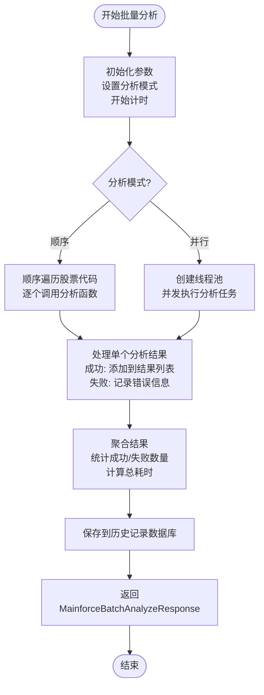

# 批量分析结果聚合

<cite>
**本文档引用的文件**
- [mainforce_service.py](file://backend/app/services/mainforce_service.py)
- [mainforce_batch_db.py](file://backend/app/db/mainforce_batch_db.py)
- [stock.py](file://backend/app/schemas/stock.py)
- [mainforce.py](file://backend/app/api/v1/mainforce.py)
- [app.py](file://old/app.py)
</cite>

## 目录
1. [批量分析结果聚合逻辑](#批量分析结果聚合逻辑)
2. [MainforceBatchAnalyzeResponse响应结构](#mainforcebatchanalyzeresponse响应结构)
3. [性能优化与稳定性保障](#性能优化与稳定性保障)

## 批量分析结果聚合逻辑

主力选股批量分析结果的聚合逻辑主要通过`MainforceService`类的`_run_batch_analysis`方法实现。该方法负责遍历股票代码列表，对每只股票执行分析，并聚合最终结果。

批量分析支持两种模式：顺序分析和并行分析。顺序分析模式下，系统会逐个处理股票代码；并行分析模式下，系统使用线程池并发处理多个股票，提高分析效率。分析过程中，系统会调用`analyze_single_stock_for_batch`函数对单个股票进行分析。

在分析过程中，系统会统计成功和失败的分析数量，并计算总耗时。对于分析失败的股票，系统会捕获异常并记录错误信息，确保即使部分股票分析失败，整个批量分析过程也不会中断。

**Section sources**
- [mainforce_service.py](file://backend/app/services/mainforce_service.py#L106-L184)

## MainforceBatchAnalyzeResponse响应结构

`MainforceBatchAnalyzeResponse`响应结构定义了批量分析结果的返回格式，包含以下字段：

- `total`: 总分析股票数量，等于请求中的`stock_codes`列表长度
- `success`: 成功分析的股票数量，通过遍历结果列表统计`success`为`True`的数量得到
- `failed`: 失败分析的股票数量，等于`total`减去`success`
- `elapsed_time`: 总耗时，通过`time.time()`在分析开始和结束时的时间差计算
- `analysis_mode`: 分析模式，从请求中获取，可为"sequential"或"parallel"
- `results`: 分析结果列表，包含每只股票的详细分析结果

`results`列表中的每个元素都遵循统一的结构要求，确保与智瞰龙虎等其他模块的结果格式保持一致。每个元素包含`rating`、`confidence_level`、`entry_range`等统一字段，这些字段从单个分析结果的`final_decision`中提取。

**Diagram sources**
- [mainforce_service.py](file://backend/app/services/mainforce_service.py#L106-L184)
- [app.py](file://old/app.py#L776-L919)

**Section sources**
- [stock.py](file://backend/app/schemas/stock.py#L91-L99)
- [mainforce_service.py](file://backend/app/services/mainforce_service.py#L177-L184)

## 性能优化与稳定性保障

为了确保批量分析过程的性能和稳定性，系统采用了多项优化措施：

1. **上下文管理器精确计时**：使用`time.time()`函数在分析开始和结束时获取时间戳，精确计算总耗时。这种方法简单高效，避免了复杂的计时器管理。

2. **异常捕获机制**：在单个股票分析过程中，使用try-catch块捕获所有异常，确保即使某个股票分析失败，也不会影响其他股票的分析。失败的分析结果会被记录，包含错误信息，便于后续排查。

3. **线程池管理**：在并行分析模式下，使用`ThreadPoolExecutor`管理线程池，通过`max_workers`参数控制最大并发数，避免过多的并发请求导致系统资源耗尽或API限流。

4. **结果清理与序列化**：在保存结果到数据库前，对结果数据进行清理，确保可以JSON序列化。对于大型数据结构如DataFrame，只保存前100行，避免数据过大影响性能。

5. **数据库操作优化**：批量分析结果保存到SQLite数据库时，使用事务确保数据一致性，并创建索引提高查询效率。

这些优化措施共同保障了批量分析过程的稳定性和性能，即使在分析大量股票时也能保持良好的响应速度和可靠性。

**Section sources**
- [mainforce_service.py](file://backend/app/services/mainforce_service.py#L127-L173)
- [mainforce_batch_db.py](file://backend/app/db/mainforce_batch_db.py#L51-L103)