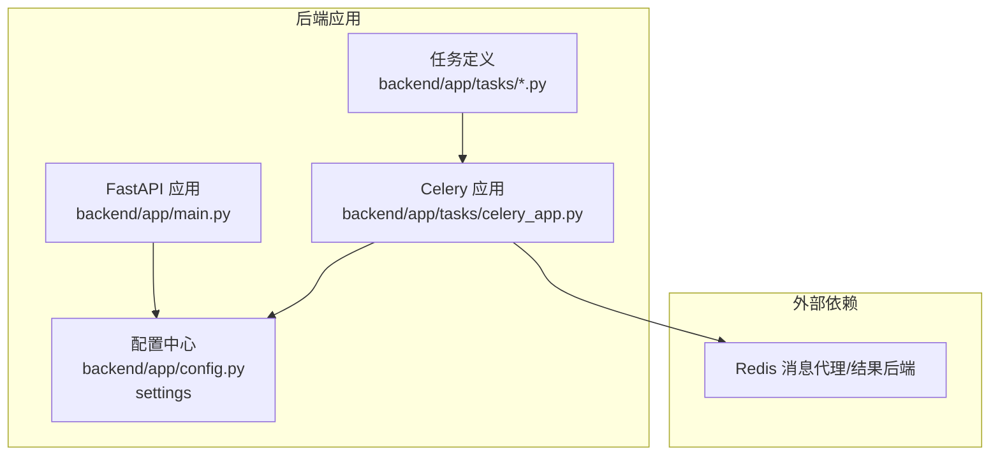
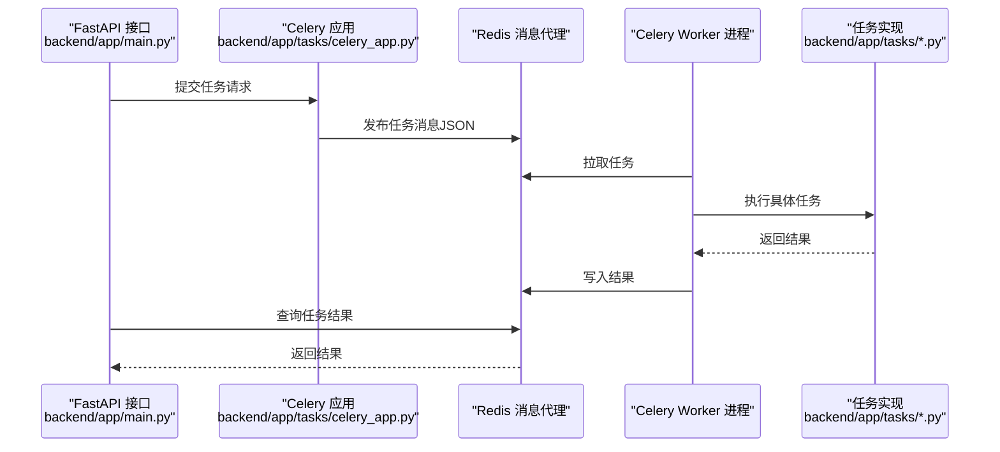
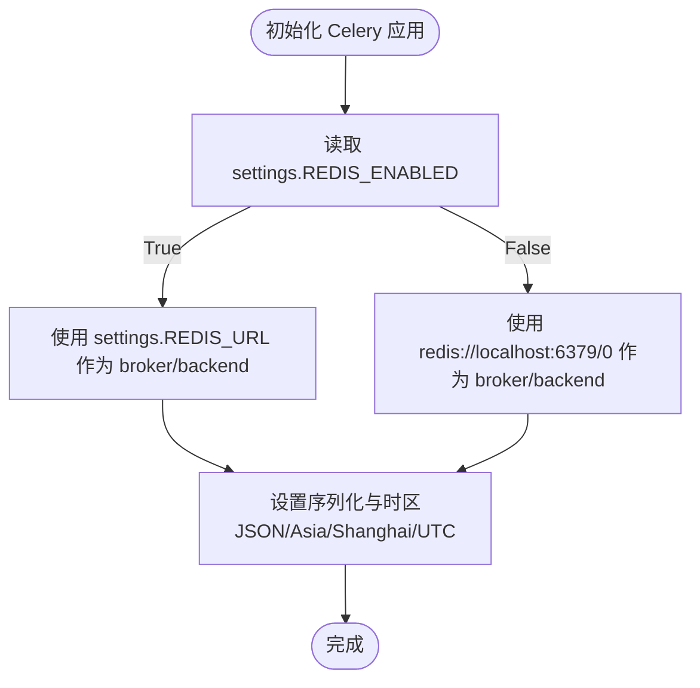
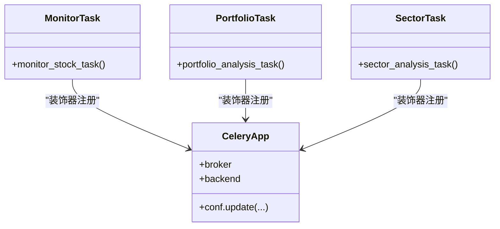
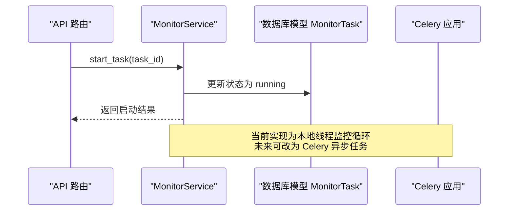
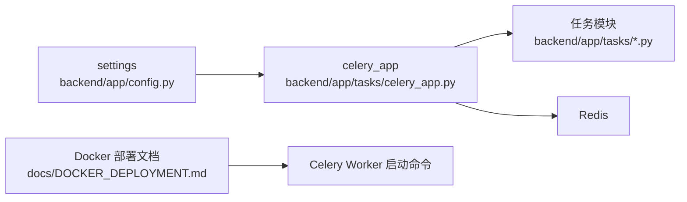

# 任务执行引擎

<cite>
**本文引用的文件**
- [celery_app.py](file://backend/app/tasks/celery_app.py)
- [config.py](file://backend/app/config.py)
- [main.py](file://backend/app/main.py)
- [monitor_tasks.py](file://backend/app/tasks/monitor_tasks.py)
- [portfolio_tasks.py](file://backend/app/tasks/portfolio_tasks.py)
- [sector_tasks.py](file://backend/app/tasks/sector_tasks.py)
- [monitor_service.py](file://backend/app/services/monitor_service.py)
- [monitor.py](file://backend/app/models/monitor.py)
- [DOCKER_DEPLOYMENT.md](file://docs/DOCKER_DEPLOYMENT.md)
- [DOCKER_README.md](file://docs/DOCKER_README.md)
- [前后端拆分规划文档.md](file://docs/前后端拆分规划文档.md)
</cite>

## 目录
1. [简介](#简介)
2. [项目结构](#项目结构)
3. [核心组件](#核心组件)
4. [架构总览](#架构总览)
5. [详细组件分析](#详细组件分析)
6. [依赖关系分析](#依赖关系分析)
7. [性能与并发](#性能与并发)
8. [故障排查指南](#故障排查指南)
9. [结论](#结论)
10. [附录](#附录)

## 简介
本文件围绕 Celery 任务执行引擎展开，聚焦 backend/app/tasks/celery_app.py 中的 Celery 应用配置，解释如何通过 Redis 作为消息代理与结果后端实现分布式任务调度；详述任务序列化配置（JSON）、时区设置（Asia/Shanghai）与 UTC 启用的意义；结合代码路径说明 Celery 实例初始化过程与其与 app.config.settings 的集成方式；并提供 Redis 高可用连接最佳实践、环境变量控制与故障转移策略建议；同时覆盖任务中间件扩展可能性（监控钩子、日志追踪）及工作节点启动与并发模型配置。

## 项目结构
- 后端采用 FastAPI 提供 API，Celery 任务定义位于 backend/app/tasks，Celery 应用在 celery_app.py 中集中初始化。
- 配置由 app.config.settings 提供，其中包含 REDIS_URL 与 REDIS_ENABLED 等关键项。
- 任务文件通过装饰器注册到 celery_app 实例，形成“任务定义-应用配置-运行节点”的闭环。
- 文档中提供了 Docker 部署与 Celery Worker 启动的参考命令。

图表来源
- [celery_app.py](file://backend/app/tasks/celery_app.py#L1-L21)
- [config.py](file://backend/app/config.py#L75-L82)
- [main.py](file://backend/app/main.py#L1-L30)

章节来源
- [celery_app.py](file://backend/app/tasks/celery_app.py#L1-L21)
- [config.py](file://backend/app/config.py#L75-L82)
- [main.py](file://backend/app/main.py#L1-L30)

## 核心组件
- Celery 应用初始化：在 celery_app.py 中创建 Celery 实例，动态根据 settings.REDIS_ENABLED 选择 Redis 或本地回退地址，并设置 broker 与 backend。
- 序列化与时区：task_serializer、accept_content、result_serializer 均为 JSON；timezone 设为 Asia/Shanghai；enable_utc 为 True。
- 任务注册：monitor_tasks.py、portfolio_tasks.py、sector_tasks.py 通过 @celery_app.task 装饰器注册任务。
- 配置集成：celery_app 从 app.config.settings 导入配置，settings 来源于 pydantic_settings.BaseSettings，支持 .env 环境变量注入。

章节来源
- [celery_app.py](file://backend/app/tasks/celery_app.py#L1-L21)
- [config.py](file://backend/app/config.py#L75-L82)
- [monitor_tasks.py](file://backend/app/tasks/monitor_tasks.py#L1-L13)
- [portfolio_tasks.py](file://backend/app/tasks/portfolio_tasks.py#L1-L13)
- [sector_tasks.py](file://backend/app/tasks/sector_tasks.py#L1-L13)

## 架构总览
Celery 在本项目中的角色是异步任务调度与执行引擎，负责将业务任务（如监测、组合分析、板块分析）投递至 Redis，Worker 消费并执行，结果写回 Redis，供 API 查询。

图表来源
- [celery_app.py](file://backend/app/tasks/celery_app.py#L1-L21)
- [monitor_tasks.py](file://backend/app/tasks/monitor_tasks.py#L1-L13)
- [portfolio_tasks.py](file://backend/app/tasks/portfolio_tasks.py#L1-L13)
- [sector_tasks.py](file://backend/app/tasks/sector_tasks.py#L1-L13)

## 详细组件分析

### Celery 应用配置与初始化
- 初始化流程
  - 创建 Celery 实例，命名空间为 stock_analysis。
  - broker 与 backend 均来自 settings.REDIS_URL，若 REDIS_ENABLED 为 False，则回退到本地 redis://localhost:6379/0。
- 序列化与时区
  - task_serializer='json'、accept_content=['json']、result_serializer='json'，确保跨语言/进程安全传输。
  - timezone='Asia/Shanghai'，enable_utc=True，统一时间语义，便于日志与调度一致性。
- 与配置集成
  - settings 来自 pydantic_settings.BaseSettings，读取 .env 文件，支持环境变量覆盖。
  - REDIS_URL 与 REDIS_ENABLED 由 .env 控制，便于在不同环境切换。

图表来源
- [celery_app.py](file://backend/app/tasks/celery_app.py#L1-L21)
- [config.py](file://backend/app/config.py#L75-L82)

章节来源
- [celery_app.py](file://backend/app/tasks/celery_app.py#L1-L21)
- [config.py](file://backend/app/config.py#L75-L82)

### 任务定义与注册
- 三个任务文件分别定义了监测、组合分析、板块分析任务，均通过 @celery_app.task 装饰器注册到同一 Celery 应用实例。
- 任务函数体目前为占位实现，实际业务逻辑可在后续完善。

图表来源
- [celery_app.py](file://backend/app/tasks/celery_app.py#L1-L21)
- [monitor_tasks.py](file://backend/app/tasks/monitor_tasks.py#L1-L13)
- [portfolio_tasks.py](file://backend/app/tasks/portfolio_tasks.py#L1-L13)
- [sector_tasks.py](file://backend/app/tasks/sector_tasks.py#L1-L13)

章节来源
- [monitor_tasks.py](file://backend/app/tasks/monitor_tasks.py#L1-L13)
- [portfolio_tasks.py](file://backend/app/tasks/portfolio_tasks.py#L1-L13)
- [sector_tasks.py](file://backend/app/tasks/sector_tasks.py#L1-L13)

### 与业务服务的衔接
- 监控服务 MonitorService 提供任务生命周期管理（创建、更新、启动、停止、查询），并与数据库模型 MonitorTask 对接。
- 该服务与 Celery 的关系在于：API 层调用 MonitorService 的启动/停止接口，而 MonitorService 可以进一步封装为 Celery 任务（例如将“启动任务”转换为异步任务），当前仓库中 MonitorService 以本地线程方式运行监控循环。

图表来源
- [monitor_service.py](file://backend/app/services/monitor_service.py#L309-L385)
- [monitor.py](file://backend/app/models/monitor.py#L1-L39)

章节来源
- [monitor_service.py](file://backend/app/services/monitor_service.py#L309-L385)
- [monitor.py](file://backend/app/models/monitor.py#L1-L39)

## 依赖关系分析
- Celery 应用依赖配置中心 settings，settings 依赖 pydantic_settings 与 .env。
- 任务模块依赖 Celery 应用实例，形成“配置-应用-任务”的单向依赖。
- Docker 部署文档提供了 Celery Worker 的启动命令，表明 Worker 通过 celery -A app.tasks.celery_app worker 方式运行。

图表来源
- [config.py](file://backend/app/config.py#L75-L82)
- [celery_app.py](file://backend/app/tasks/celery_app.py#L1-L21)
- [DOCKER_DEPLOYMENT.md](file://docs/DOCKER_DEPLOYMENT.md#L1260-L1310)

章节来源
- [config.py](file://backend/app/config.py#L75-L82)
- [celery_app.py](file://backend/app/tasks/celery_app.py#L1-L21)
- [DOCKER_DEPLOYMENT.md](file://docs/DOCKER_DEPLOYMENT.md#L1260-L1310)

## 性能与并发
- 并发模型
  - 当前 MonitorService 通过本地线程实现监控循环，适合轻量级场景；若需大规模并发，建议将监控逻辑迁移到 Celery 任务中，利用 Worker 的并发能力。
- Worker 启动与并发
  - Docker 部署文档给出 Celery Worker 启动命令，可通过命令行参数或环境变量控制并发数（如 --pool、--concurrency 等）。建议在生产环境中按 CPU 核心数与任务类型合理配置。
- 序列化与时区
  - JSON 序列化保证跨语言兼容性；Asia/Shanghai + UTC 启用有助于统一日志与调度时间，减少时区偏差带来的问题。

章节来源
- [DOCKER_DEPLOYMENT.md](file://docs/DOCKER_DEPLOYMENT.md#L1260-L1310)
- [celery_app.py](file://backend/app/tasks/celery_app.py#L1-L21)

## 故障排查指南
- Redis 连接问题
  - 若 REDIS_ENABLED 为 False，Celery 将回退到本地 Redis 地址；请确认本地 Redis 是否正常运行。
  - 若 REDIS_ENABLED 为 True，请检查 REDIS_URL 是否可达，网络连通性与认证配置。
- 任务执行异常
  - 通过 Docker 日志查看 Celery Worker 输出，定位任务执行错误。
  - 确认任务序列化配置与数据类型一致，避免 JSON 序列化失败。
- 时区与 UTC
  - 若出现时间显示异常，检查容器时区设置（TZ=Asia/Shanghai）与应用时区配置（Asia/Shanghai + UTC）是否一致。

章节来源
- [celery_app.py](file://backend/app/tasks/celery_app.py#L1-L21)
- [config.py](file://backend/app/config.py#L75-L82)
- [DOCKER_DEPLOYMENT.md](file://docs/DOCKER_DEPLOYMENT.md#L1-L200)

## 结论
本项目通过在 celery_app.py 中集中初始化 Celery 应用，结合 app.config.settings 的环境变量控制，实现了以 Redis 为消息代理与结果后端的分布式任务调度。JSON 序列化、Asia/Shanghai 时区与 UTC 启用确保了跨语言与跨时区的一致性。当前任务以本地线程方式运行，建议在生产环境中将监控与分析逻辑迁移至 Celery 任务，充分利用 Worker 并发能力，并结合 Docker 部署文档提供的启动方式与日志排查手段，保障系统的稳定性与可观测性。

## 附录

### Redis 高可用连接最佳实践
- 环境变量控制
  - 使用 REDIS_URL 与 REDIS_ENABLED 统一管理 Redis 连接，便于在不同环境切换。
- 故障转移策略
  - 在单实例 Redis 场景下，建议通过容器编排（如 Docker Compose）为 Redis 提供健康检查与自动重启；在多实例场景下，可考虑使用 Redis Sentinel 或集群模式，并在客户端层面实现重试与降级。
- 连接池与超时
  - 建议在 Celery 配置中设置连接超时与重试策略，避免瞬时网络抖动导致任务失败。

章节来源
- [config.py](file://backend/app/config.py#L75-L82)
- [DOCKER_DEPLOYMENT.md](file://docs/DOCKER_DEPLOYMENT.md#L1260-L1310)

### 任务中间件扩展建议
- 监控钩子
  - 可在 Celery 中注册任务前置/后置钩子，用于统计任务耗时、失败率、重试次数等。
- 日志追踪
  - 为每个任务生成唯一请求 ID，贯穿任务执行链路，便于日志聚合与问题定位。
- 安全与审计
  - 对任务输入进行严格校验，记录关键操作审计日志，防止误操作与越权访问。

[本节为通用建议，不直接分析具体文件，故无章节来源]

### Celery 工作节点启动与并发模型
- 启动方式
  - 使用 celery -A app.tasks.celery_app worker 命令启动 Worker；可结合 Docker Compose 在容器中运行。
- 并发模型
  - 通过命令行参数或环境变量设置并发数与池类型；建议根据任务类型（CPU 密集/IO 密集）选择合适的并发策略。

章节来源
- [DOCKER_DEPLOYMENT.md](file://docs/DOCKER_DEPLOYMENT.md#L1260-L1310)
- [前后端拆分规划文档.md](file://docs/前后端拆分规划文档.md#L1260-L1310)