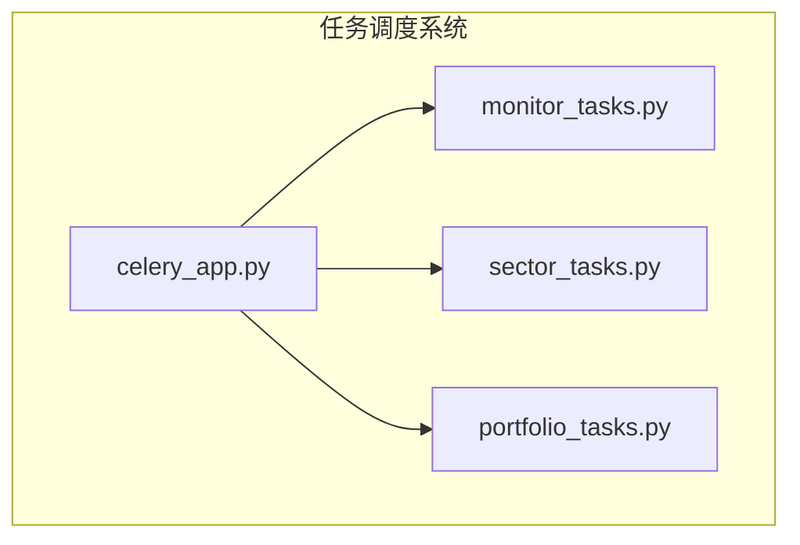
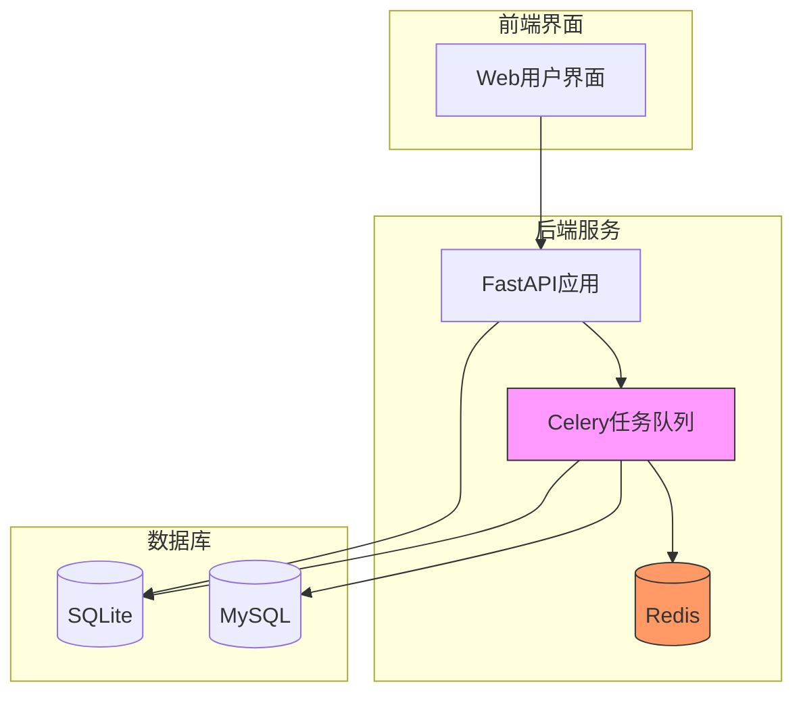
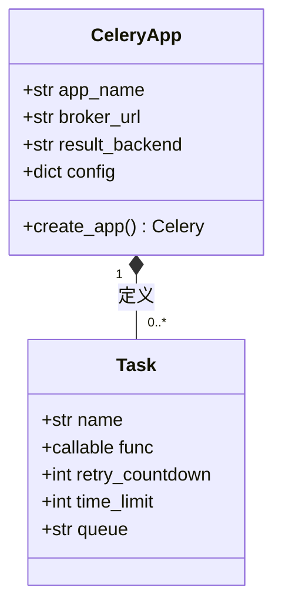
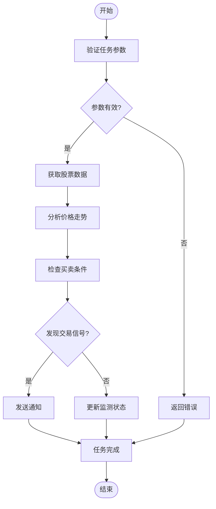
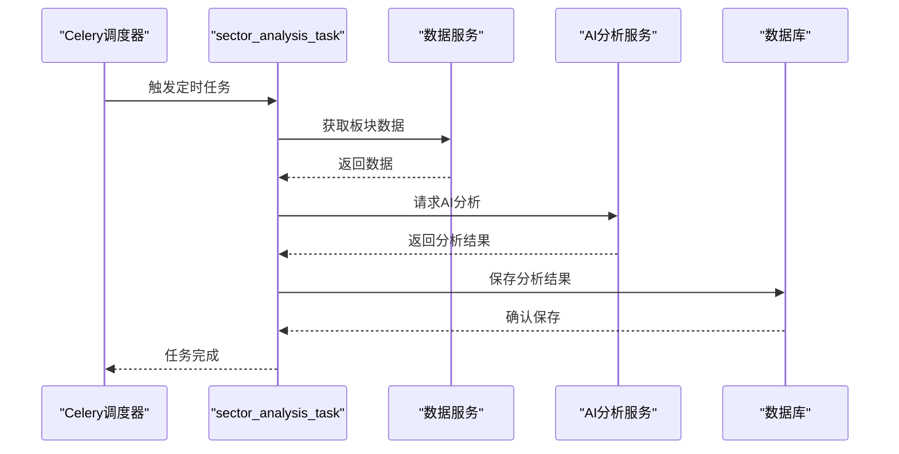
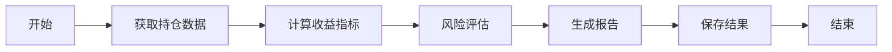
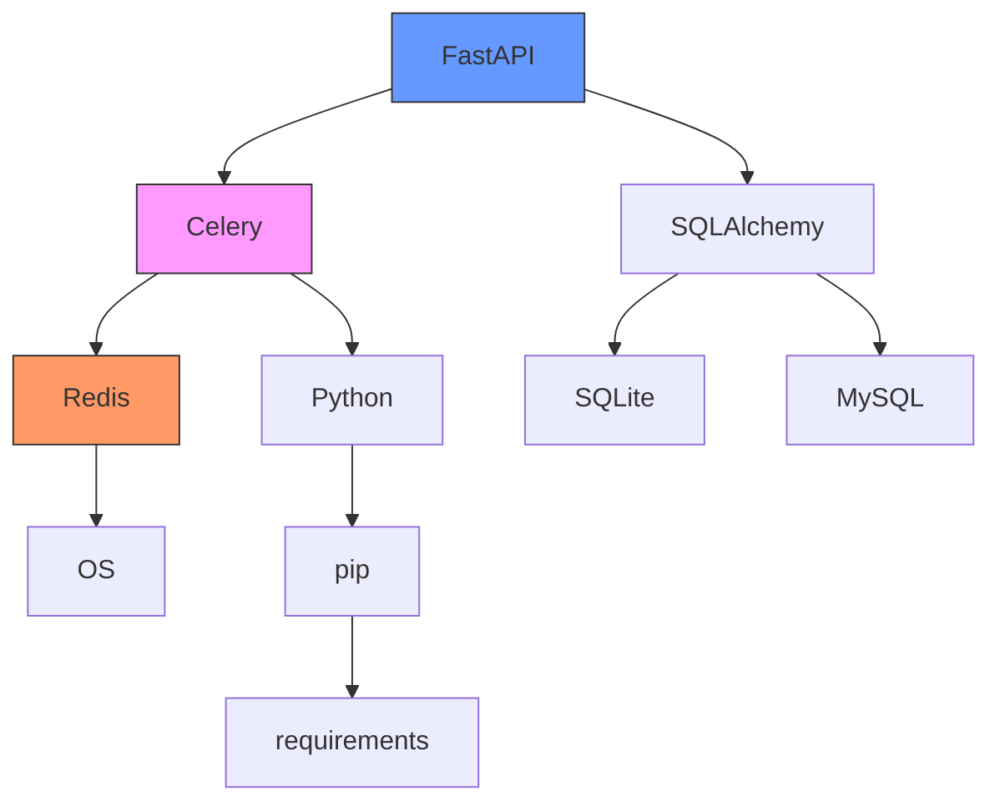

# 任务调度系统

<cite>
**本文档引用的文件**
- [celery_app.py](file://backend/app/tasks/celery_app.py)
- [monitor_tasks.py](file://backend/app/tasks/monitor_tasks.py)
- [sector_tasks.py](file://backend/app/tasks/sector_tasks.py)
- [portfolio_tasks.py](file://backend/app/tasks/portfolio_tasks.py)
- [config.py](file://backend/app/config.py)
- [main.py](file://backend/app/main.py)
- [requirements.txt](file://backend/requirements.txt)
- [实时监测定时功能更新日志.md](file://docs/实时监测定时功能更新日志.md)
</cite>

## 目录
1. [简介](#简介)
2. [项目结构](#项目结构)
3. [核心组件](#核心组件)
4. [架构概述](#架构概述)
5. [详细组件分析](#详细组件分析)
6. [依赖分析](#依赖分析)
7. [性能考虑](#性能考虑)
8. [故障排除指南](#故障排除指南)
9. [结论](#结论)

## 简介
本文档系统化地记录了基于Celery的任务调度系统，详细说明了如何配置Redis作为消息代理与结果后端，描述了各类周期性任务的定义方式、执行频率与依赖关系，解释了任务失败重试机制、超时控制与日志记录策略，并提供了监控任务队列状态的方法和添加新定时任务的指导。

## 项目结构
任务调度系统位于`backend/app/tasks/`目录下，主要由Celery应用配置文件和多个任务模块组成。系统通过Celery实现异步任务处理和定时任务调度，结合Redis作为消息队列和结果存储。

**图表来源**
- [celery_app.py](file://backend/app/tasks/celery_app.py)
- [monitor_tasks.py](file://backend/app/tasks/monitor_tasks.py)
- [sector_tasks.py](file://backend/app/tasks/sector_tasks.py)
- [portfolio_tasks.py](file://backend/app/tasks/portfolio_tasks.py)

**章节来源**
- [celery_app.py](file://backend/app/tasks/celery_app.py)
- [monitor_tasks.py](file://backend/app/tasks/monitor_tasks.py)

## 核心组件

任务调度系统的核心组件包括Celery应用配置、各类任务定义模块以及相关的配置管理。系统通过`celery_app.py`文件创建Celery实例，并在各个任务模块中定义具体的任务函数。

**章节来源**
- [celery_app.py](file://backend/app/tasks/celery_app.py#L1-L21)
- [monitor_tasks.py](file://backend/app/tasks/monitor_tasks.py#L1-L13)

## 架构概述

系统采用Celery作为任务队列框架，Redis作为消息代理和结果后端，实现了异步任务处理和定时任务调度的功能架构。

**图表来源**
- [celery_app.py](file://backend/app/tasks/celery_app.py#L7-L11)
- [config.py](file://backend/app/config.py#L75-L77)
- [main.py](file://backend/app/main.py)

## 详细组件分析

### Celery应用配置分析
系统通过`celery_app.py`文件配置Celery应用，设置Redis作为消息代理和结果后端，并配置了序列化格式和时区等参数。

**图表来源**
- [celery_app.py](file://backend/app/tasks/celery_app.py#L7-L19)

**章节来源**
- [celery_app.py](file://backend/app/tasks/celery_app.py#L1-L21)

### 监测任务分析
`monitor_tasks.py`模块定义了股票监测相关的异步任务，用于执行实时股票价格监测和分析。

**图表来源**
- [monitor_tasks.py](file://backend/app/tasks/monitor_tasks.py#L7-L11)

**章节来源**
- [monitor_tasks.py](file://backend/app/tasks/monitor_tasks.py#L1-L13)

### 板块任务分析
`sector_tasks.py`模块定义了板块分析相关的定时任务，用于定期执行板块级别的市场分析。

**图表来源**
- [sector_tasks.py](file://backend/app/tasks/sector_tasks.py#L7-L11)

**章节来源**
- [sector_tasks.py](file://backend/app/tasks/sector_tasks.py#L1-L13)

### 持仓任务分析
`portfolio_tasks.py`模块定义了持仓分析相关的任务，用于定期评估投资组合的表现。

**图表来源**
- [portfolio_tasks.py](file://backend/app/tasks/portfolio_tasks.py#L7-L11)

**章节来源**
- [portfolio_tasks.py](file://backend/app/tasks/portfolio_tasks.py#L1-L13)

## 依赖分析

任务调度系统依赖于多个外部组件和库，形成了完整的依赖关系网络。

**图表来源**
- [requirements.txt](file://backend/requirements.txt#L23-L25)
- [celery_app.py](file://backend/app/tasks/celery_app.py)
- [main.py](file://backend/app/main.py)

**章节来源**
- [requirements.txt](file://backend/requirements.txt#L1-L56)
- [config.py](file://backend/app/config.py)

## 性能考虑

任务调度系统的性能主要受以下因素影响：
- Redis服务器的性能和网络延迟
- 任务执行的复杂度和耗时
- 并发任务的数量
- 结果序列化和反序列化的开销

建议在生产环境中使用独立的Redis服务器，并根据任务负载调整Celery工作进程的数量。

## 故障排除指南

### 常见问题及解决方案

| 问题现象 | 可能原因 | 解决方案 |
|---------|---------|---------|
| 任务无法启动 | Redis服务未运行 | 检查Redis服务状态并启动 |
| 任务执行缓慢 | 任务逻辑复杂或数据量大 | 优化任务代码，增加工作进程 |
| 结果无法获取 | Redis连接问题 | 检查Redis配置和网络连接 |
| 定时任务未执行 | Celery Beat未启动 | 确保启动Celery Beat服务 |

**章节来源**
- [实时监测定时功能更新日志.md](file://docs/实时监测定时功能更新日志.md)
- [config.py](file://backend/app/config.py#L75-L77)

## 结论

基于Celery的任务调度系统为AI股票分析平台提供了可靠的异步任务处理和定时任务调度能力。通过合理配置Redis作为消息代理和结果后端，系统能够高效地处理各类分析任务。建议在生产环境中监控Redis和Celery的运行状态，确保任务调度系统的稳定性和可靠性。