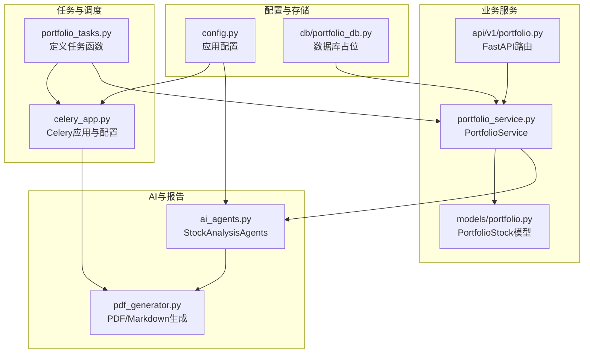
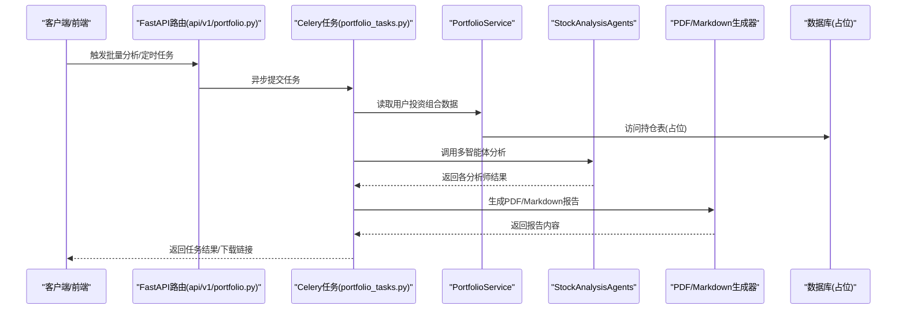
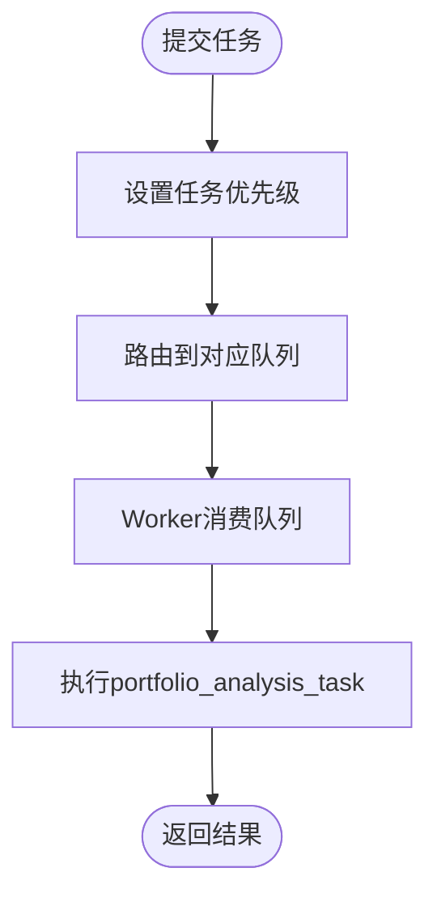
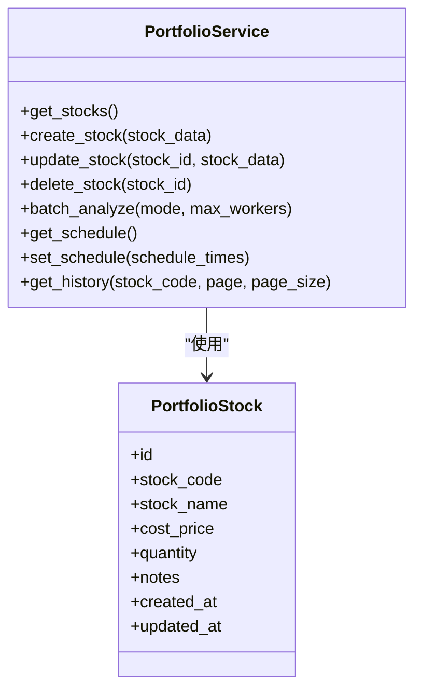
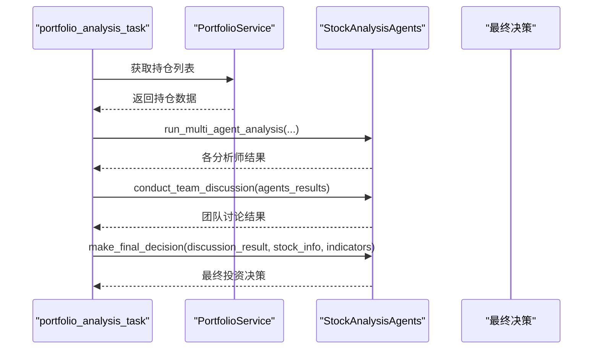
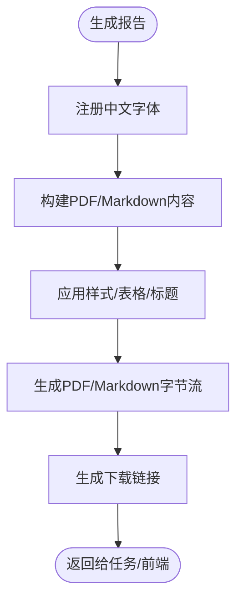
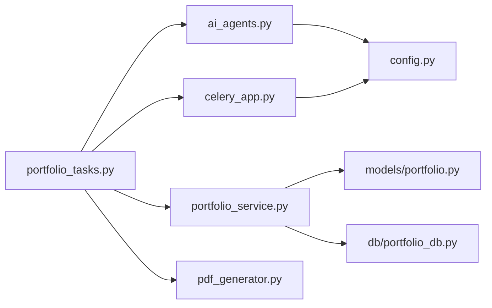

# 持仓分析任务

<cite>
**本文引用的文件**
- [backend/app/tasks/portfolio_tasks.py](file://backend/app/tasks/portfolio_tasks.py)
- [backend/app/tasks/celery_app.py](file://backend/app/tasks/celery_app.py)
- [backend/app/services/portfolio_service.py](file://backend/app/services/portfolio_service.py)
- [backend/app/agents/ai_agents.py](file://backend/app/agents/ai_agents.py)
- [backend/app/utils/pdf_generator.py](file://backend/app/utils/pdf_generator.py)
- [backend/app/models/portfolio.py](file://backend/app/models/portfolio.py)
- [backend/app/api/v1/portfolio.py](file://backend/app/api/v1/portfolio.py)
- [backend/app/config.py](file://backend/app/config.py)
- [backend/app/db/portfolio_db.py](file://backend/app/db/portfolio_db.py)
</cite>

## 目录
1. [简介](#简介)
2. [项目结构](#项目结构)
3. [核心组件](#核心组件)
4. [架构总览](#架构总览)
5. [详细组件分析](#详细组件分析)
6. [依赖关系分析](#依赖关系分析)
7. [性能考虑](#性能考虑)
8. [故障排查指南](#故障排查指南)
9. [结论](#结论)
10. [附录](#附录)

## 简介
本文件面向“持仓分析任务”的设计与实现，聚焦 portfolio_analysis_task 的设计目的与业务价值，阐述其如何整合用户投资组合数据，调用AI代理进行风险评估与收益预测，并生成可视化报告。文档还梳理了任务执行过程中的服务调用链路（portfolio_service、ai_agents、pdf_generator），并提供执行上下文管理的最佳实践（用户身份传递、资源清理与错误回滚）、任务优先级配置建议、日志与监控指标上报的实现思路，帮助读者快速理解并落地该任务。

## 项目结构
围绕“持仓分析任务”，本次文档涉及的关键文件与职责如下：
- 任务定义与调度入口：backend/app/tasks/portfolio_tasks.py、backend/app/tasks/celery_app.py
- 业务服务层：backend/app/services/portfolio_service.py
- AI智能体与多智能体协作：backend/app/agents/ai_agents.py
- 报告生成工具：backend/app/utils/pdf_generator.py
- 数据模型与API：backend/app/models/portfolio.py、backend/app/api/v1/portfolio.py
- 配置与数据库占位：backend/app/config.py、backend/app/db/portfolio_db.py

**图示来源**
- [backend/app/tasks/portfolio_tasks.py](file://backend/app/tasks/portfolio_tasks.py#L1-L12)
- [backend/app/tasks/celery_app.py](file://backend/app/tasks/celery_app.py#L1-L21)
- [backend/app/services/portfolio_service.py](file://backend/app/services/portfolio_service.py#L1-L54)
- [backend/app/agents/ai_agents.py](file://backend/app/agents/ai_agents.py#L1-L546)
- [backend/app/utils/pdf_generator.py](file://backend/app/utils/pdf_generator.py#L1-L461)
- [backend/app/models/portfolio.py](file://backend/app/models/portfolio.py#L1-L22)
- [backend/app/api/v1/portfolio.py](file://backend/app/api/v1/portfolio.py#L1-L123)
- [backend/app/config.py](file://backend/app/config.py#L1-L92)
- [backend/app/db/portfolio_db.py](file://backend/app/db/portfolio_db.py#L1-L6)

**章节来源**
- [backend/app/tasks/portfolio_tasks.py](file://backend/app/tasks/portfolio_tasks.py#L1-L12)
- [backend/app/tasks/celery_app.py](file://backend/app/tasks/celery_app.py#L1-L21)
- [backend/app/services/portfolio_service.py](file://backend/app/services/portfolio_service.py#L1-L54)
- [backend/app/agents/ai_agents.py](file://backend/app/agents/ai_agents.py#L1-L546)
- [backend/app/utils/pdf_generator.py](file://backend/app/utils/pdf_generator.py#L1-L461)
- [backend/app/models/portfolio.py](file://backend/app/models/portfolio.py#L1-L22)
- [backend/app/api/v1/portfolio.py](file://backend/app/api/v1/portfolio.py#L1-L123)
- [backend/app/config.py](file://backend/app/config.py#L1-L92)
- [backend/app/db/portfolio_db.py](file://backend/app/db/portfolio_db.py#L1-L6)

## 核心组件
- portfolio_analysis_task：Celery任务入口，负责触发“持仓分析”全流程。
- Celery应用：统一的任务队列与结果后端配置，支持Redis或本地队列。
- PortfolioService：封装与持仓相关的业务操作（获取、创建、更新、删除、批量分析、定时配置、历史查询等）。
- StockAnalysisAgents：多智能体分析框架，涵盖技术面、基本面、资金面、风险管理、市场情绪、新闻分析等。
- PDF/Markdown生成器：根据AI分析结果生成可下载的PDF或Markdown报告。
- PortfolioStock模型：定义持仓股票的数据结构。
- FastAPI路由：对外提供获取/新增/更新/删除/批量分析/定时配置/历史查询等接口。
- 配置与数据库占位：提供DeepSeek API、MySQL、Redis等配置项；数据库层目前为占位，待迁移。

**章节来源**
- [backend/app/tasks/portfolio_tasks.py](file://backend/app/tasks/portfolio_tasks.py#L1-L12)
- [backend/app/tasks/celery_app.py](file://backend/app/tasks/celery_app.py#L1-L21)
- [backend/app/services/portfolio_service.py](file://backend/app/services/portfolio_service.py#L1-L54)
- [backend/app/agents/ai_agents.py](file://backend/app/agents/ai_agents.py#L1-L546)
- [backend/app/utils/pdf_generator.py](file://backend/app/utils/pdf_generator.py#L1-L461)
- [backend/app/models/portfolio.py](file://backend/app/models/portfolio.py#L1-L22)
- [backend/app/api/v1/portfolio.py](file://backend/app/api/v1/portfolio.py#L1-L123)
- [backend/app/config.py](file://backend/app/config.py#L1-L92)
- [backend/app/db/portfolio_db.py](file://backend/app/db/portfolio_db.py#L1-L6)

## 架构总览
下图展示“持仓分析任务”的端到端调用链路与数据流：

**图示来源**
- [backend/app/api/v1/portfolio.py](file://backend/app/api/v1/portfolio.py#L1-L123)
- [backend/app/tasks/portfolio_tasks.py](file://backend/app/tasks/portfolio_tasks.py#L1-L12)
- [backend/app/services/portfolio_service.py](file://backend/app/services/portfolio_service.py#L1-L54)
- [backend/app/agents/ai_agents.py](file://backend/app/agents/ai_agents.py#L1-L546)
- [backend/app/utils/pdf_generator.py](file://backend/app/utils/pdf_generator.py#L1-L461)
- [backend/app/db/portfolio_db.py](file://backend/app/db/portfolio_db.py#L1-L6)

## 详细组件分析

### 组件A：portfolio_analysis_task 设计与业务价值
- 设计目的
  - 将“用户投资组合数据整合—AI多智能体分析—生成可视化报告”的完整流程封装为异步任务，提升系统吞吐与用户体验。
  - 通过Celery实现任务解耦与并发扩展，避免阻塞主线程。
- 业务价值
  - 降低用户等待时间，提高分析效率。
  - 统一输出PDF/Markdown报告，便于归档与分享。
  - 为后续“定时分析”“关键用户优先级”等能力奠定基础。

当前实现状态：任务函数已定义，但业务逻辑仍为占位。建议在任务中按“获取持仓—调用AI—生成报告—落库/通知”的顺序填充。

**章节来源**
- [backend/app/tasks/portfolio_tasks.py](file://backend/app/tasks/portfolio_tasks.py#L1-L12)

### 组件B：Celery应用与任务优先级配置
- Celery应用
  - 使用JSON序列化，时区为Asia/Shanghai，启用UTC。
  - Broker与Backend默认使用Redis URL（可通过配置开关启用）。
- 任务优先级建议
  - 在提交任务时设置优先级（如1-10），高优先级用于VIP用户或紧急分析请求。
  - 在Worker侧通过队列/路由区分不同优先级，确保关键任务优先执行。
  - 若使用Redis，可结合任务路由与队列命名实现优先级隔离。

**图示来源**
- [backend/app/tasks/celery_app.py](file://backend/app/tasks/celery_app.py#L1-L21)

**章节来源**
- [backend/app/tasks/celery_app.py](file://backend/app/tasks/celery_app.py#L1-L21)

### 组件C：PortfolioService 与数据模型
- PortfolioService
  - 提供获取/新增/更新/删除持仓、批量分析、定时配置、历史查询等方法（当前为占位，待实现）。
- PortfolioStock 模型
  - 字段覆盖股票代码、名称、成本价、数量、备注、创建/更新时间等，适配投资组合管理场景。

**图示来源**
- [backend/app/services/portfolio_service.py](file://backend/app/services/portfolio_service.py#L1-L54)
- [backend/app/models/portfolio.py](file://backend/app/models/portfolio.py#L1-L22)

**章节来源**
- [backend/app/services/portfolio_service.py](file://backend/app/services/portfolio_service.py#L1-L54)
- [backend/app/models/portfolio.py](file://backend/app/models/portfolio.py#L1-L22)

### 组件D：AI智能体与多智能体协作
- StockAnalysisAgents
  - 提供技术面、基本面、资金面、风险管理、市场情绪、新闻分析等智能体。
  - 支持并行运行多个智能体，收集结果后进行团队讨论，再由最终决策模块生成投资建议。
- 调用链
  - portfolio_analysis_task -> PortfolioService.get_stocks -> StockAnalysisAgents.run_multi_agent_analysis -> conduct_team_discussion -> make_final_decision。

**图示来源**
- [backend/app/agents/ai_agents.py](file://backend/app/agents/ai_agents.py#L1-L546)
- [backend/app/services/portfolio_service.py](file://backend/app/services/portfolio_service.py#L1-L54)
- [backend/app/tasks/portfolio_tasks.py](file://backend/app/tasks/portfolio_tasks.py#L1-L12)

**章节来源**
- [backend/app/agents/ai_agents.py](file://backend/app/agents/ai_agents.py#L1-L546)

### 组件E：报告生成与可视化
- PDF/Markdown生成器
  - 支持中文字体注册、表格样式、免责声明等，输出PDF或Markdown两种格式。
  - 提供下载链接生成与前端展示辅助方法。
- 输出内容
  - 股票基本信息、各分析师分析、团队讨论、最终投资决策、免责声明等。

**图示来源**
- [backend/app/utils/pdf_generator.py](file://backend/app/utils/pdf_generator.py#L1-L461)

**章节来源**
- [backend/app/utils/pdf_generator.py](file://backend/app/utils/pdf_generator.py#L1-L461)

### 组件F：API与上下文管理最佳实践
- API路由
  - 提供获取/新增/更新/删除/批量分析/定时配置/历史查询等接口，便于前端触发任务或查看结果。
- 上下文管理最佳实践
  - 用户身份传递：在任务参数中携带用户标识（如用户ID），并在服务层按用户维度隔离数据与权限。
  - 资源清理：任务结束时释放临时文件、关闭数据库连接、清理缓存。
  - 错误回滚：捕获异常并记录详细错误信息，必要时回滚数据库事务或重置中间态。
  - 任务幂等：为重复提交的任务提供去重与状态检查，避免重复分析。

**章节来源**
- [backend/app/api/v1/portfolio.py](file://backend/app/api/v1/portfolio.py#L1-L123)

## 依赖关系分析
- 组件耦合
  - portfolio_tasks 依赖 celery_app、portfolio_service、ai_agents、pdf_generator。
  - portfolio_service 依赖数据库（当前占位），并与FastAPI路由交互。
  - ai_agents 依赖DeepSeek客户端与外部数据源（如季报、资金流、情绪、新闻等）。
  - pdf_generator 依赖ReportLab与系统字体环境。
- 外部依赖
  - Redis/Celery：任务队列与结果存储。
  - DeepSeek API：多智能体分析的推理能力。
  - MySQL/SQLite：历史分析与持仓数据存储（当前占位）。

**图示来源**
- [backend/app/tasks/portfolio_tasks.py](file://backend/app/tasks/portfolio_tasks.py#L1-L12)
- [backend/app/tasks/celery_app.py](file://backend/app/tasks/celery_app.py#L1-L21)
- [backend/app/services/portfolio_service.py](file://backend/app/services/portfolio_service.py#L1-L54)
- [backend/app/models/portfolio.py](file://backend/app/models/portfolio.py#L1-L22)
- [backend/app/db/portfolio_db.py](file://backend/app/db/portfolio_db.py#L1-L6)
- [backend/app/agents/ai_agents.py](file://backend/app/agents/ai_agents.py#L1-L546)
- [backend/app/utils/pdf_generator.py](file://backend/app/utils/pdf_generator.py#L1-L461)
- [backend/app/config.py](file://backend/app/config.py#L1-L92)

**章节来源**
- [backend/app/tasks/portfolio_tasks.py](file://backend/app/tasks/portfolio_tasks.py#L1-L12)
- [backend/app/tasks/celery_app.py](file://backend/app/tasks/celery_app.py#L1-L21)
- [backend/app/services/portfolio_service.py](file://backend/app/services/portfolio_service.py#L1-L54)
- [backend/app/models/portfolio.py](file://backend/app/models/portfolio.py#L1-L22)
- [backend/app/db/portfolio_db.py](file://backend/app/db/portfolio_db.py#L1-L6)
- [backend/app/agents/ai_agents.py](file://backend/app/agents/ai_agents.py#L1-L546)
- [backend/app/utils/pdf_generator.py](file://backend/app/utils/pdf_generator.py#L1-L461)
- [backend/app/config.py](file://backend/app/config.py#L1-L92)

## 性能考虑
- 并发与批处理
  - 使用PortfolioService.batch_analyze支持“sequential/parallel”模式，合理设置max_workers。
- 缓存与降噪
  - 对重复的分析请求进行缓存，避免重复调用AI与数据源。
- I/O与网络
  - 控制DeepSeek API调用频率，必要时增加重试与退避策略。
- 存储与索引
  - 为持仓表建立合适索引（如stock_code），加速查询。
- 资源限制
  - 为PDF生成设置内存上限，避免大报告导致OOM。

[本节为通用建议，无需特定文件来源]

## 故障排查指南
- 任务未执行
  - 检查Celery Worker是否启动、Broker/Backend连通性、任务路由与队列配置。
- AI分析异常
  - 核对DeepSeek API密钥与Base URL配置，确认网络可达。
- 报告生成失败
  - 检查系统字体注册日志，确保中文字体可用；确认ReportLab版本兼容。
- 数据库访问
  - 当前数据库层为占位，需迁移旧逻辑或接入新数据库；检查连接字符串与权限。
- 日志与监控
  - 在任务入口与关键节点记录日志；对任务耗时、成功率、错误码等指标进行埋点上报。

**章节来源**
- [backend/app/config.py](file://backend/app/config.py#L1-L92)
- [backend/app/utils/pdf_generator.py](file://backend/app/utils/pdf_generator.py#L1-L461)
- [backend/app/db/portfolio_db.py](file://backend/app/db/portfolio_db.py#L1-L6)

## 结论
portfolio_analysis_task 将“投资组合数据—AI多智能体分析—可视化报告”串联为可扩展的异步流水线。通过Celery实现任务解耦与优先级调度，借助PortfolioService与StockAnalysisAgents完成高质量分析，再由PDF/Markdown生成器输出标准化报告。建议尽快完善任务逻辑、数据库层与监控指标，以支撑生产环境的稳定运行与持续迭代。

[本节为总结性内容，无需特定文件来源]

## 附录
- 快速落地清单
  - 完成 portfolio_analysis_task 的业务逻辑实现（获取持仓、调用AI、生成报告、落库/通知）。
  - 迁移/实现 portfolio_db 的数据库操作逻辑。
  - 配置Celery优先级与队列路由，保障关键用户优先处理。
  - 增加日志与监控埋点，覆盖任务耗时、成功率、错误分类等指标。
  - 在前端通过FastAPI路由触发任务并展示报告下载链接。

[本节为补充性内容，无需特定文件来源]