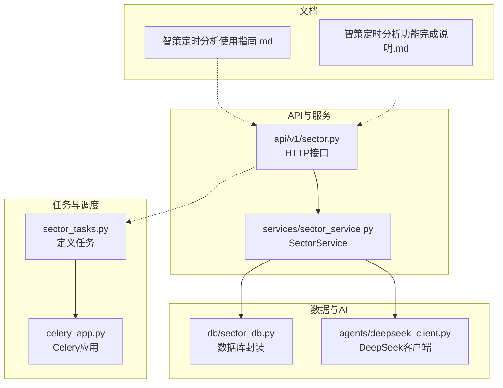
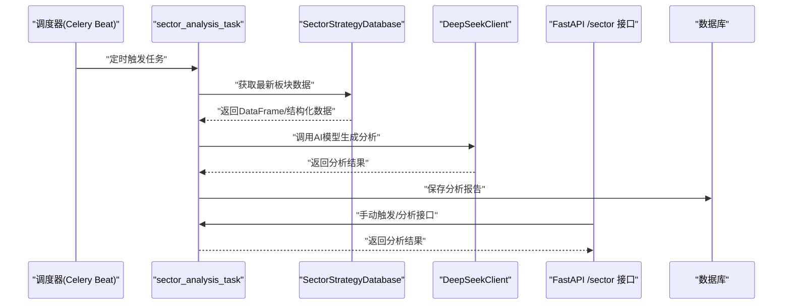
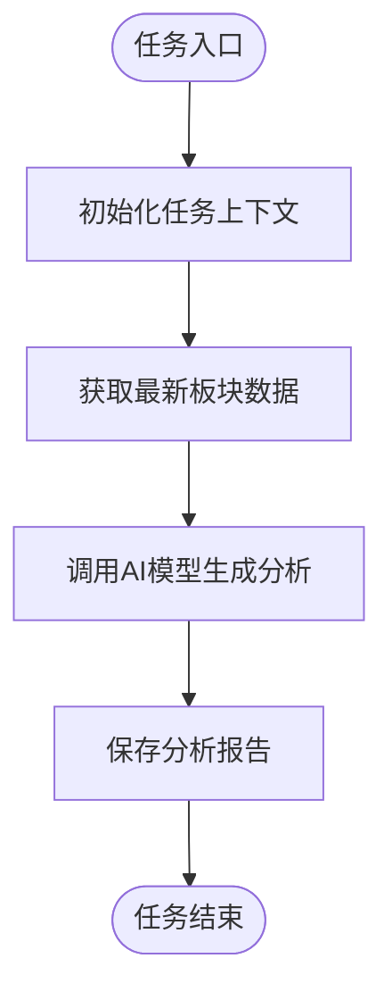
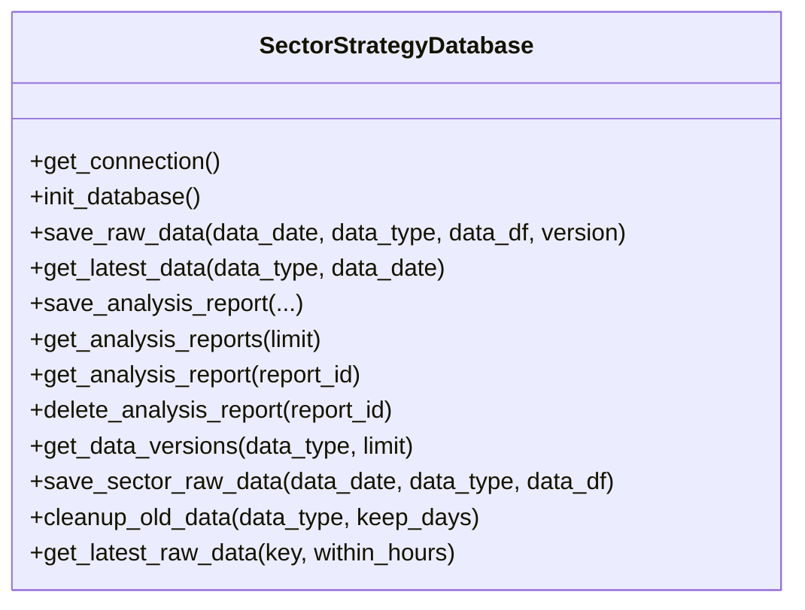
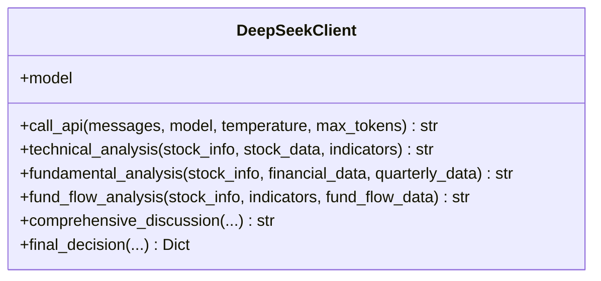
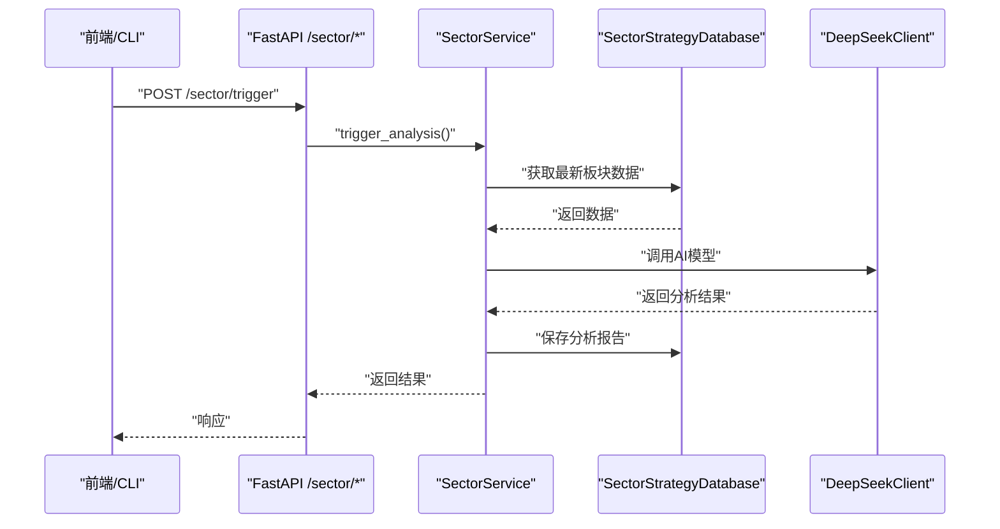
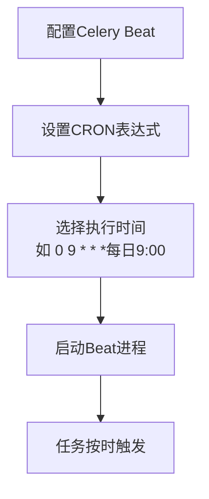
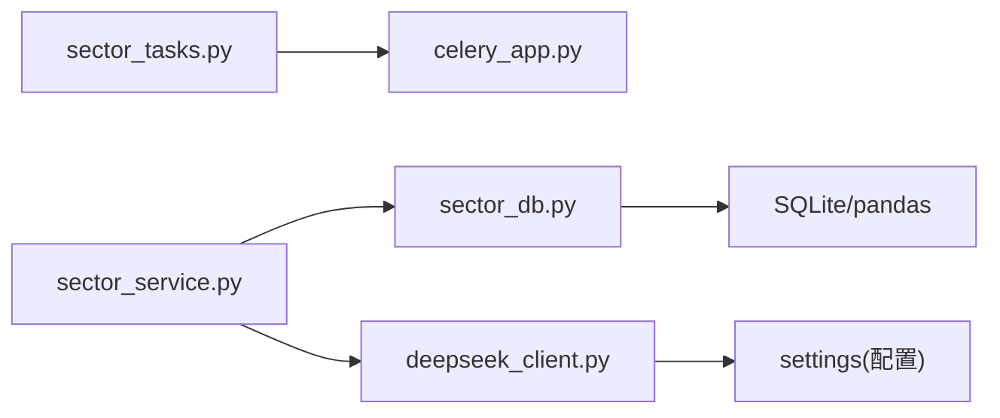

# 板块分析任务

<cite>
**本文引用的文件**
- [backend/app/tasks/sector_tasks.py](file://backend/app/tasks/sector_tasks.py)
- [backend/app/tasks/celery_app.py](file://backend/app/tasks/celery_app.py)
- [backend/app/api/v1/sector.py](file://backend/app/api/v1/sector.py)
- [backend/app/services/sector_service.py](file://backend/app/services/sector_service.py)
- [backend/app/db/sector_db.py](file://backend/app/db/sector_db.py)
- [backend/app/agents/deepseek_client.py](file://backend/app/agents/deepseek_client.py)
- [docs/智策定时分析使用指南.md](file://docs/智策定时分析使用指南.md)
- [docs/智策定时分析功能完成说明.md](file://docs/智策定时分析功能完成说明.md)
</cite>

## 目录
1. [简介](#简介)
2. [项目结构](#项目结构)
3. [核心组件](#核心组件)
4. [架构总览](#架构总览)
5. [详细组件分析](#详细组件分析)
6. [依赖关系分析](#依赖关系分析)
7. [性能考虑](#性能考虑)
8. [故障排查指南](#故障排查指南)
9. [结论](#结论)
10. [附录](#附录)

## 简介
本技术文档围绕“板块分析任务”展开，聚焦 backend/app/tasks/sector_tasks.py 中的 sector_analysis_task 任务，系统阐述其在“智策板块”功能中的定时分析流程设计与落地方式。文档将从任务执行链路（数据抓取、AI模型调用、结果存储）、调度配置（Celery Beat/Celery Beat + Redis）、任务间依赖管理、手动触发调试、以及性能优化策略等方面进行深入解析，并结合现有文档说明任务的应用场景与最佳实践。

## 项目结构
与“板块分析任务”直接相关的后端模块分布如下：
- 任务定义与调度：backend/app/tasks/sector_tasks.py、backend/app/tasks/celery_app.py
- API入口：backend/app/api/v1/sector.py
- 业务服务：backend/app/services/sector_service.py
- 数据持久化：backend/app/db/sector_db.py
- AI模型调用：backend/app/agents/deepseek_client.py
- 文档说明：docs/智策定时分析使用指南.md、docs/智策定时分析功能完成说明.md

**图表来源**
- [backend/app/tasks/sector_tasks.py](file://backend/app/tasks/sector_tasks.py#L1-L13)
- [backend/app/tasks/celery_app.py](file://backend/app/tasks/celery_app.py#L1-L21)
- [backend/app/api/v1/sector.py](file://backend/app/api/v1/sector.py#L1-L107)
- [backend/app/services/sector_service.py](file://backend/app/services/sector_service.py#L1-L48)
- [backend/app/db/sector_db.py](file://backend/app/db/sector_db.py#L1-L120)
- [backend/app/agents/deepseek_client.py](file://backend/app/agents/deepseek_client.py#L1-L60)
- [docs/智策定时分析使用指南.md](file://docs/智策定时分析使用指南.md#L1-L120)
- [docs/智策定时分析功能完成说明.md](file://docs/智策定时分析功能完成说明.md#L1-L120)

**章节来源**
- [backend/app/tasks/sector_tasks.py](file://backend/app/tasks/sector_tasks.py#L1-L13)
- [backend/app/tasks/celery_app.py](file://backend/app/tasks/celery_app.py#L1-L21)
- [backend/app/api/v1/sector.py](file://backend/app/api/v1/sector.py#L1-L107)
- [backend/app/services/sector_service.py](file://backend/app/services/sector_service.py#L1-L48)
- [backend/app/db/sector_db.py](file://backend/app/db/sector_db.py#L1-L120)
- [backend/app/agents/deepseek_client.py](file://backend/app/agents/deepseek_client.py#L1-L60)
- [docs/智策定时分析使用指南.md](file://docs/智策定时分析使用指南.md#L1-L120)
- [docs/智策定时分析功能完成说明.md](file://docs/智策定时分析功能完成说明.md#L1-L120)

## 核心组件
- 任务定义：sector_analysis_task 是一个装饰为 Celery 任务的函数，当前为占位实现，后续将填充完整的分析流程。
- Celery 应用：celery_app.py 提供 Celery 实例，配置序列化、时区、Broker/Backend 等。
- API 接口：/sector/analyze、/sector/trigger 等接口分别用于触发分析与手动触发。
- 服务层：SectorService 提供分析、定时任务管理、手动触发、历史查询、PDF 生成等接口（当前多为占位）。
- 数据层：SectorStrategyDatabase 封装板块原始数据、新闻、分析报告、追踪表、数据版本等表的读写与清理。
- AI 客户端：DeepSeekClient 提供调用 DeepSeek API 的能力，支持技术面、基本面、资金流等分析。

**章节来源**
- [backend/app/tasks/sector_tasks.py](file://backend/app/tasks/sector_tasks.py#L1-L13)
- [backend/app/tasks/celery_app.py](file://backend/app/tasks/celery_app.py#L1-L21)
- [backend/app/api/v1/sector.py](file://backend/app/api/v1/sector.py#L1-L107)
- [backend/app/services/sector_service.py](file://backend/app/services/sector_service.py#L1-L48)
- [backend/app/db/sector_db.py](file://backend/app/db/sector_db.py#L1-L120)
- [backend/app/agents/deepseek_client.py](file://backend/app/agents/deepseek_client.py#L1-L60)

## 架构总览
“板块分析任务”的执行链路如下：
- 定时触发：通过 Celery Beat 或 Celery Beat + Redis 调度 sector_analysis_task。
- 任务执行：任务内拉取最新板块数据（来自 SectorStrategyDatabase），调用 AI 模型（DeepSeekClient），生成分析报告并保存至数据库。
- 结果存储：将分析报告写入 sector_analysis_reports 表，便于前端历史查询与 PDF 导出。
- 人工干预：通过 /sector/trigger 接口手动触发分析；通过 /sector/analyze 接口进行即时分析。

**图表来源**
- [backend/app/tasks/sector_tasks.py](file://backend/app/tasks/sector_tasks.py#L1-L13)
- [backend/app/db/sector_db.py](file://backend/app/db/sector_db.py#L248-L364)
- [backend/app/agents/deepseek_client.py](file://backend/app/agents/deepseek_client.py#L1-L60)
- [backend/app/api/v1/sector.py](file://backend/app/api/v1/sector.py#L1-L107)

## 详细组件分析

### 任务定义与调度
- sector_analysis_task：当前为占位实现，后续将在此函数中编排“数据抓取 → AI分析 → 结果存储”的完整流程。
- celery_app：提供 Celery 实例，配置 Broker/Backend、序列化、时区等，确保任务在分布式环境下稳定运行。

**图表来源**
- [backend/app/tasks/sector_tasks.py](file://backend/app/tasks/sector_tasks.py#L1-L13)
- [backend/app/tasks/celery_app.py](file://backend/app/tasks/celery_app.py#L1-L21)

**章节来源**
- [backend/app/tasks/sector_tasks.py](file://backend/app/tasks/sector_tasks.py#L1-L13)
- [backend/app/tasks/celery_app.py](file://backend/app/tasks/celery_app.py#L1-L21)

### 数据抓取与存储
- SectorStrategyDatabase 提供：
  - 保存原始数据：支持行业、概念、资金流、市场概览、北向资金、新闻等多类型数据，自动维护数据版本与索引。
  - 获取最新数据：按日期与版本号获取最新成功版本的数据，支持 DataFrame 直接读取。
  - 保存分析报告：将分析结果写入 sector_analysis_reports 表，包含日期范围、摘要、推荐板块、置信度、风险等级、投资周期、市场展望等字段。
  - 清理旧数据：按天数清理过期数据，避免数据库膨胀。
- 数据版本管理：data_versions 表记录每次抓取的状态、版本号、记录数、错误信息等，便于审计与重试。

**图表来源**
- [backend/app/db/sector_db.py](file://backend/app/db/sector_db.py#L1-L120)
- [backend/app/db/sector_db.py](file://backend/app/db/sector_db.py#L147-L364)
- [backend/app/db/sector_db.py](file://backend/app/db/sector_db.py#L365-L461)
- [backend/app/db/sector_db.py](file://backend/app/db/sector_db.py#L462-L543)
- [backend/app/db/sector_db.py](file://backend/app/db/sector_db.py#L544-L696)
- [backend/app/db/sector_db.py](file://backend/app/db/sector_db.py#L697-L841)

**章节来源**
- [backend/app/db/sector_db.py](file://backend/app/db/sector_db.py#L1-L120)
- [backend/app/db/sector_db.py](file://backend/app/db/sector_db.py#L147-L364)
- [backend/app/db/sector_db.py](file://backend/app/db/sector_db.py#L365-L461)
- [backend/app/db/sector_db.py](file://backend/app/db/sector_db.py#L462-L543)
- [backend/app/db/sector_db.py](file://backend/app/db/sector_db.py#L544-L696)
- [backend/app/db/sector_db.py](file://backend/app/db/sector_db.py#L697-L841)

### AI模型调用
- DeepSeekClient：封装 OpenAI 风格的 DeepSeek API 调用，支持通用聊天、技术面、基本面、资金流等分析，并自动处理 reasoner 模型的推理内容与 token 数量。
- 在“板块分析任务”中，可在任务内构造消息体，调用 call_api 或专用分析方法，得到结构化或自然语言的分析结果。

**图表来源**
- [backend/app/agents/deepseek_client.py](file://backend/app/agents/deepseek_client.py#L1-L60)
- [backend/app/agents/deepseek_client.py](file://backend/app/agents/deepseek_client.py#L240-L353)
- [backend/app/agents/deepseek_client.py](file://backend/app/agents/deepseek_client.py#L354-L458)

**章节来源**
- [backend/app/agents/deepseek_client.py](file://backend/app/agents/deepseek_client.py#L1-L60)
- [backend/app/agents/deepseek_client.py](file://backend/app/agents/deepseek_client.py#L240-L353)
- [backend/app/agents/deepseek_client.py](file://backend/app/agents/deepseek_client.py#L354-L458)

### 服务层与API
- SectorService：提供 analyze_sector、trigger_analysis、get_schedule、set_schedule、delete_schedule、get_history、generate_pdf 等接口（当前多为占位），后续可与 sector_analysis_task 协作，实现定时与手动触发的统一入口。
- FastAPI 接口：
  - POST /sector/analyze：触发分析（可选模型参数）。
  - POST /sector/trigger：手动触发分析。
  - GET /sector/schedule、POST /sector/schedule、DELETE /sector/schedule/{id}：定时任务管理。
  - GET /sector/history、POST /sector/generate-pdf：历史报告与PDF生成。

**图表来源**
- [backend/app/api/v1/sector.py](file://backend/app/api/v1/sector.py#L1-L107)
- [backend/app/services/sector_service.py](file://backend/app/services/sector_service.py#L1-L48)
- [backend/app/db/sector_db.py](file://backend/app/db/sector_db.py#L248-L364)
- [backend/app/agents/deepseek_client.py](file://backend/app/agents/deepseek_client.py#L1-L60)

**章节来源**
- [backend/app/api/v1/sector.py](file://backend/app/api/v1/sector.py#L1-L107)
- [backend/app/services/sector_service.py](file://backend/app/services/sector_service.py#L1-L48)
- [backend/app/db/sector_db.py](file://backend/app/db/sector_db.py#L248-L364)
- [backend/app/agents/deepseek_client.py](file://backend/app/agents/deepseek_client.py#L1-L60)

### 任务间依赖管理
- 数据依赖：sector_analysis_task 需要确保板块数据已成功抓取并入库（data_versions 状态为成功）。可通过 SectorStrategyDatabase 的 get_latest_data 或 get_data_versions 查询最新版本。
- 并发控制：若存在多个数据抓取任务或分析任务，建议在任务内部加锁或采用幂等设计，避免重复抓取与重复分析。
- 任务顺序：若存在“数据抓取任务 → 板块分析任务”的流水线，可在数据抓取任务完成后显式调用 sector_analysis_task，或通过 Celery 的链式任务/组任务实现。

**章节来源**
- [backend/app/db/sector_db.py](file://backend/app/db/sector_db.py#L248-L364)
- [backend/app/db/sector_db.py](file://backend/app/db/sector_db.py#L462-L543)

### 调度配置与CRON表达式
- Celery Beat：通过 Celery Beat 配置定时任务，可使用标准 CRON 表达式设置每日开盘前执行（如 0 9 * * * 表示每日 9:00）。
- Celery Beat + Redis：当使用 Redis 作为 Broker/Backend 时，需在 celery_app.py 中启用 REDIS_URL，确保任务队列与结果后端一致。
- 文档建议：根据盘前/盘后/晚间场景选择合适时间，避免交易高峰期数据不稳定。

**图表来源**
- [backend/app/tasks/celery_app.py](file://backend/app/tasks/celery_app.py#L1-L21)
- [docs/智策定时分析使用指南.md](file://docs/智策定时分析使用指南.md#L96-L115)

**章节来源**
- [backend/app/tasks/celery_app.py](file://backend/app/tasks/celery_app.py#L1-L21)
- [docs/智策定时分析使用指南.md](file://docs/智策定时分析使用指南.md#L96-L115)

### 手动触发与调试
- 命令行：可通过 FastAPI 的 /sector/trigger 接口手动触发分析，便于调试与验证。
- 管理界面：前端“智策板块”页面提供定时设置与手动触发按钮，适合非技术用户使用。
- 调试要点：检查数据版本是否成功、AI模型是否可用、数据库写入是否成功、邮件/通知是否可达。

**章节来源**
- [backend/app/api/v1/sector.py](file://backend/app/api/v1/sector.py#L68-L77)
- [docs/智策定时分析使用指南.md](file://docs/智策定时分析使用指南.md#L125-L145)

### 性能优化策略
- 批量处理：将多个板块的分析合并为批处理任务，减少模型调用次数与网络往返。
- 异步子任务：使用 Celery 的 group/chain/chord 等机制，将数据抓取、AI分析、报告生成拆分为子任务并行执行。
- 缓存与版本：利用 SectorStrategyDatabase 的 get_latest_raw_data 与 data_versions，避免重复抓取与重复分析。
- 资源隔离：为不同任务分配独立队列与 worker，避免相互干扰。
- 超时与重试：为 AI 调用与数据库写入设置合理超时与重试策略，提升鲁棒性。

**章节来源**
- [backend/app/db/sector_db.py](file://backend/app/db/sector_db.py#L697-L841)
- [backend/app/db/sector_db.py](file://backend/app/db/sector_db.py#L147-L364)

## 依赖关系分析
- 模块耦合：
  - sector_tasks.py 依赖 celery_app.py 提供的 Celery 实例。
  - sector_service.py 依赖 SQLAlchemy Session 与 SectorStrategyDatabase。
  - SectorStrategyDatabase 依赖 SQLite 与 pandas，提供数据读写与版本管理。
  - DeepSeekClient 依赖配置中的 DEEPSEEK_API_KEY 与 DEEPSEEK_BASE_URL。
- 外部依赖：
  - Celery + Redis/Broker：任务调度与队列。
  - OpenAI 风格 API：DeepSeek 模型调用。
  - 数据源：板块数据、新闻、资金流等（通过 SectorStrategyDatabase 的保存/读取接口抽象）。

**图表来源**
- [backend/app/tasks/sector_tasks.py](file://backend/app/tasks/sector_tasks.py#L1-L13)
- [backend/app/tasks/celery_app.py](file://backend/app/tasks/celery_app.py#L1-L21)
- [backend/app/services/sector_service.py](file://backend/app/services/sector_service.py#L1-L48)
- [backend/app/db/sector_db.py](file://backend/app/db/sector_db.py#L1-L120)
- [backend/app/agents/deepseek_client.py](file://backend/app/agents/deepseek_client.py#L1-L60)

**章节来源**
- [backend/app/tasks/sector_tasks.py](file://backend/app/tasks/sector_tasks.py#L1-L13)
- [backend/app/tasks/celery_app.py](file://backend/app/tasks/celery_app.py#L1-L21)
- [backend/app/services/sector_service.py](file://backend/app/services/sector_service.py#L1-L48)
- [backend/app/db/sector_db.py](file://backend/app/db/sector_db.py#L1-L120)
- [backend/app/agents/deepseek_client.py](file://backend/app/agents/deepseek_client.py#L1-L60)

## 性能考虑
- 数据抓取：尽量使用 get_latest_data/get_latest_raw_data 获取最新版本，避免重复抓取。
- AI 调用：合理设置 max_tokens 与 temperature，必要时对 reasoner 模型增加 token 以获得完整推理过程。
- 存储写入：批量写入分析报告，减少事务开销；定期清理旧数据，控制表规模。
- 调度策略：避开交易高峰时段，提高数据完整性与稳定性。

[本节为通用指导，无需列出具体文件来源]

## 故障排查指南
- 邮件配置：参考“智策定时分析使用指南”，确认 .env 中 EMAIL_ENABLED、SMTP_SERVER、SMTP_PORT、EMAIL_FROM、EMAIL_PASSWORD、EMAIL_TO 等配置正确。
- 定时任务状态：确认 Celery Beat 已启动且 CRON 表达式正确；检查任务队列与 worker 是否在线。
- 数据版本：通过 get_data_versions 检查 data_versions 表中最新版本状态是否为成功。
- AI 调用：检查 DEEPSEEK_API_KEY 与 DEEPSEEK_BASE_URL 配置，确认网络连通性与配额。
- 历史查询：通过 /sector/history 与 /sector/generate-pdf 验证报告保存与导出功能。

**章节来源**
- [docs/智策定时分析使用指南.md](file://docs/智策定时分析使用指南.md#L1-L120)
- [docs/智策定时分析功能完成说明.md](file://docs/智策定时分析功能完成说明.md#L1-L120)
- [backend/app/db/sector_db.py](file://backend/app/db/sector_db.py#L462-L543)

## 结论
sector_analysis_task 作为“智策板块”定时分析的核心入口，具备清晰的执行链路与扩展点。当前任务仍处于占位实现阶段，后续应完善数据抓取、AI模型调用与报告存储的完整流程，并结合 Celery Beat 的 CRON 配置实现每日开盘前的自动化分析。通过合理的任务间依赖管理、手动触发调试与性能优化策略，可显著提升系统的稳定性与用户体验。

[本节为总结性内容，无需列出具体文件来源]

## 附录
- CRON 表达式示例（以每日 9:00 执行为例）：0 9 * * *
- 常用场景时间建议：
  - 盘前策略：08:00-08:30
  - 盘后复盘：16:00-17:00
  - 晚间研究：21:00-22:00

**章节来源**
- [docs/智策定时分析使用指南.md](file://docs/智策定时分析使用指南.md#L96-L115)