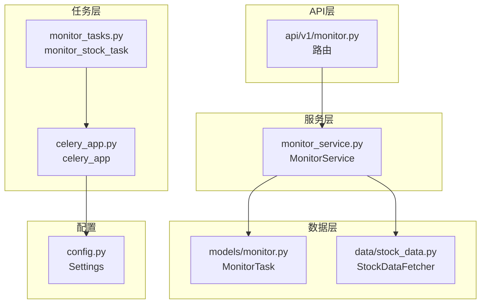
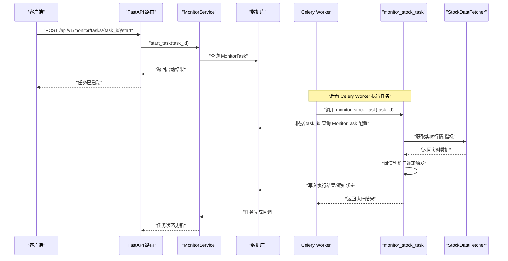
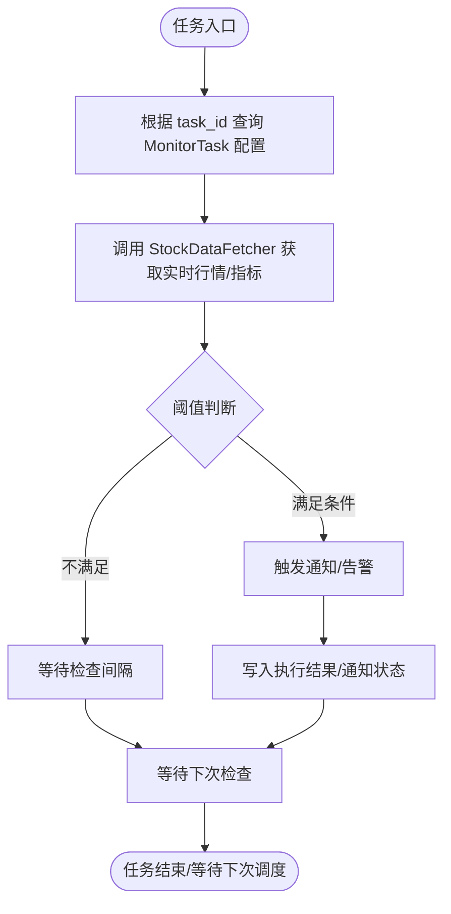
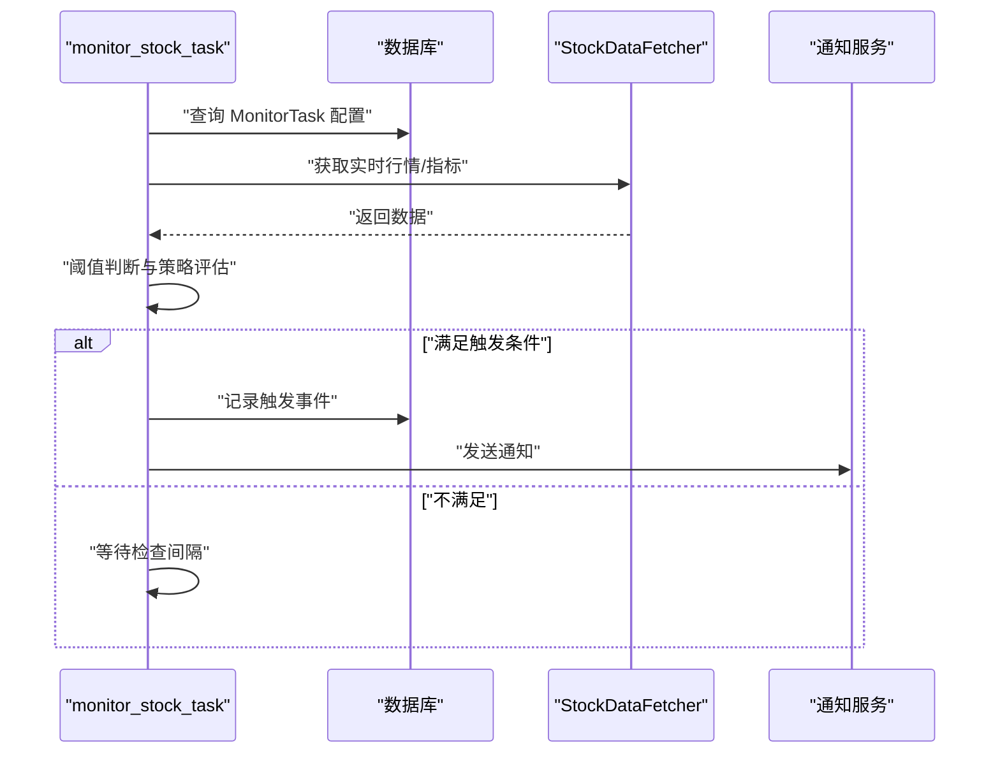
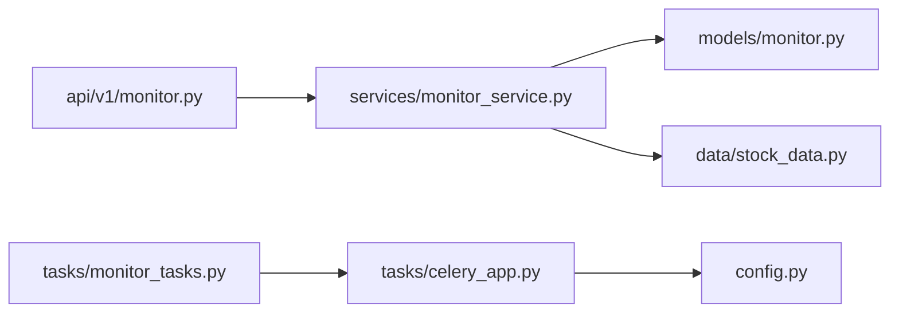

# 监测任务

<cite>
**本文引用的文件**
- [backend/app/tasks/monitor_tasks.py](file://backend/app/tasks/monitor_tasks.py)
- [backend/app/tasks/celery_app.py](file://backend/app/tasks/celery_app.py)
- [backend/app/models/monitor.py](file://backend/app/models/monitor.py)
- [backend/app/services/monitor_service.py](file://backend/app/services/monitor_service.py)
- [backend/app/api/v1/monitor.py](file://backend/app/api/v1/monitor.py)
- [backend/app/data/stock_data.py](file://backend/app/data/stock_data.py)
- [backend/app/config.py](file://backend/app/config.py)
- [backend/app/schemas/monitor.py](file://backend/app/schemas/monitor.py)
</cite>

## 目录
1. [简介](#简介)
2. [项目结构](#项目结构)
3. [核心组件](#核心组件)
4. [架构总览](#架构总览)
5. [详细组件分析](#详细组件分析)
6. [依赖关系分析](#依赖关系分析)
7. [性能考量](#性能考量)
8. [故障排查指南](#故障排查指南)
9. [结论](#结论)
10. [附录](#附录)

## 简介
本文件围绕 monitor_tasks.py 中的监测任务展开，重点解释 monitor_stock_task 函数的实现机制与调度方式，阐述其在智能盯盘功能中的角色，包括实时价格监控、阈值判断与通知触发的完整流程，并给出任务重试策略、超时限制与异常捕获的实践建议。同时提供通过 API 触发任务与获取执行结果的方法，并结合业务场景说明如何扩展该任务以支持多种条件监测（如涨跌幅、成交量突增等）。

## 项目结构
- 后端采用 FastAPI + Celery 的异步任务架构，监测任务通过 Celery 异步执行，数据库模型由 SQLAlchemy 定义，服务层负责业务编排与数据访问。
- 监测任务文件位于 backend/app/tasks/monitor_tasks.py，Celery 应用位于 backend/app/tasks/celery_app.py，数据库模型位于 backend/app/models/monitor.py，服务层位于 backend/app/services/monitor_service.py，API 路由位于 backend/app/api/v1/monitor.py，数据获取位于 backend/app/data/stock_data.py，配置位于 backend/app/config.py，请求/响应模型位于 backend/app/schemas/monitor.py。

图表来源
- [backend/app/tasks/monitor_tasks.py](file://backend/app/tasks/monitor_tasks.py#L1-L12)
- [backend/app/tasks/celery_app.py](file://backend/app/tasks/celery_app.py#L1-L21)
- [backend/app/models/monitor.py](file://backend/app/models/monitor.py#L1-L39)
- [backend/app/services/monitor_service.py](file://backend/app/services/monitor_service.py#L1-L120)
- [backend/app/api/v1/monitor.py](file://backend/app/api/v1/monitor.py#L1-L135)
- [backend/app/data/stock_data.py](file://backend/app/data/stock_data.py#L1-L60)
- [backend/app/config.py](file://backend/app/config.py#L1-L92)

章节来源
- [backend/app/tasks/monitor_tasks.py](file://backend/app/tasks/monitor_tasks.py#L1-L12)
- [backend/app/tasks/celery_app.py](file://backend/app/tasks/celery_app.py#L1-L21)
- [backend/app/models/monitor.py](file://backend/app/models/monitor.py#L1-L39)
- [backend/app/services/monitor_service.py](file://backend/app/services/monitor_service.py#L1-L120)
- [backend/app/api/v1/monitor.py](file://backend/app/api/v1/monitor.py#L1-L135)
- [backend/app/data/stock_data.py](file://backend/app/data/stock_data.py#L1-L60)
- [backend/app/config.py](file://backend/app/config.py#L1-L92)

## 核心组件
- 监测任务定义：monitor_stock_task 是一个 Celery 任务，接收 task_id 参数，用于定位数据库中的 MonitorTask 记录并执行相应的监测逻辑。
- Celery 应用：celery_app.py 配置了 Broker 和 Backend，默认使用 Redis；序列化方式为 JSON，时区为 Asia/Shanghai。
- 数据模型：MonitorTask 定义了监测任务的字段，包括股票代码、检查间隔、止盈止损、通知开关、量化配置等。
- 服务层：MonitorService 提供任务生命周期管理（创建、更新、启动、停止、查询），以及线程化的监控循环与数据分析。
- API 层：提供任务 CRUD 与状态查询接口，便于前端或外部系统触发与查询。
- 数据获取：StockDataFetcher 提供股票基本信息、实时报价、历史数据与技术指标计算能力。

章节来源
- [backend/app/tasks/monitor_tasks.py](file://backend/app/tasks/monitor_tasks.py#L1-L12)
- [backend/app/tasks/celery_app.py](file://backend/app/tasks/celery_app.py#L1-L21)
- [backend/app/models/monitor.py](file://backend/app/models/monitor.py#L1-L39)
- [backend/app/services/monitor_service.py](file://backend/app/services/monitor_service.py#L309-L408)
- [backend/app/api/v1/monitor.py](file://backend/app/api/v1/monitor.py#L1-L135)
- [backend/app/data/stock_data.py](file://backend/app/data/stock_data.py#L143-L177)

## 架构总览
下面的序列图展示了从 API 触发到任务执行与结果返回的整体流程，以及任务内部如何读取数据库配置并进行实时监控与通知触发。

图表来源
- [backend/app/api/v1/monitor.py](file://backend/app/api/v1/monitor.py#L68-L94)
- [backend/app/services/monitor_service.py](file://backend/app/services/monitor_service.py#L309-L389)
- [backend/app/tasks/monitor_tasks.py](file://backend/app/tasks/monitor_tasks.py#L1-L12)
- [backend/app/models/monitor.py](file://backend/app/models/monitor.py#L1-L39)
- [backend/app/data/stock_data.py](file://backend/app/data/stock_data.py#L143-L177)

## 详细组件分析

### monitor_stock_task 任务实现机制
- 任务入口：monitor_stock_task 是一个装饰为 Celery 任务的函数，接收 task_id 作为参数。
- 参数作用：task_id 用于在数据库中定位具体的 MonitorTask 记录，从而读取该任务的配置（如股票代码、检查间隔、阈值、通知开关、量化配置等）。
- 数据库关联逻辑：任务内部需要通过 task_id 查询 MonitorTask 表，读取任务配置后执行监测。当前文件中该逻辑仅为占位，实际实现需补充。
- 调度方式：该任务由 Celery Worker 异步执行，Broker/Backend 默认使用 Redis（可通过配置切换）。任务序列化采用 JSON，时区为 Asia/Shanghai。

图表来源
- [backend/app/tasks/monitor_tasks.py](file://backend/app/tasks/monitor_tasks.py#L1-L12)
- [backend/app/models/monitor.py](file://backend/app/models/monitor.py#L1-L39)
- [backend/app/data/stock_data.py](file://backend/app/data/stock_data.py#L143-L177)

章节来源
- [backend/app/tasks/monitor_tasks.py](file://backend/app/tasks/monitor_tasks.py#L1-L12)
- [backend/app/tasks/celery_app.py](file://backend/app/tasks/celery_app.py#L1-L21)
- [backend/app/models/monitor.py](file://backend/app/models/monitor.py#L1-L39)
- [backend/app/data/stock_data.py](file://backend/app/data/stock_data.py#L143-L177)

### 智能盯盘中的角色与流程
- 任务角色：monitor_stock_task 在智能盯盘中承担“实时价格监控 + 条件判断 + 通知触发”的职责，依据 MonitorTask 的配置对指定股票进行周期性监测。
- 流程要点：
  - 读取任务配置（股票代码、检查间隔、阈值、通知开关、量化配置等）。
  - 获取实时行情与技术指标。
  - 对比阈值（如价格区间、止盈止损、涨跌幅、成交量突增等）。
  - 满足条件时触发通知（邮件、Webhook 等），并将结果写回数据库。
  - 按检查间隔等待下一次执行。

图表来源
- [backend/app/models/monitor.py](file://backend/app/models/monitor.py#L1-L39)
- [backend/app/data/stock_data.py](file://backend/app/data/stock_data.py#L143-L177)

章节来源
- [backend/app/models/monitor.py](file://backend/app/models/monitor.py#L1-L39)
- [backend/app/data/stock_data.py](file://backend/app/data/stock_data.py#L143-L177)

### API 触发与结果获取
- 启动任务：通过 POST /api/v1/monitor/tasks/{task_id}/start 启动指定任务，服务层会校验任务是否存在并启动线程化监控循环（注意：当前 monitor_stock_task 仍为占位，启动接口对应的是线程化监控而非 Celery 任务）。
- 停止任务：通过 POST /api/v1/monitor/tasks/{task_id}/stop 停止任务。
- 查询状态：通过 GET /api/v1/monitor/tasks/{task_id}/status 获取任务状态与运行情况。
- 获取任务列表：GET /api/v1/monitor/tasks 获取所有任务列表。
- 创建/更新/删除任务：提供对应的 CRUD 接口。

章节来源
- [backend/app/api/v1/monitor.py](file://backend/app/api/v1/monitor.py#L1-L135)
- [backend/app/services/monitor_service.py](file://backend/app/services/monitor_service.py#L309-L408)

### 任务重试策略、超时限制与异常捕获
- 重试策略：可在 Celery 任务装饰器中启用 retry_backoff 等选项，以指数退避的方式重试失败的任务。
- 超时限制：可通过 soft_time_limit 控制任务软超时，避免长时间阻塞 Worker。
- 异常捕获：在任务内部捕获网络/数据源异常，记录日志并返回可恢复的状态，必要时触发降级逻辑（例如切换备用数据源）。

章节来源
- [backend/app/tasks/celery_app.py](file://backend/app/tasks/celery_app.py#L1-L21)

### 扩展监测条件（涨跌幅、成交量突增等）
- 涨跌幅：在阈值判断阶段增加涨跌幅阈值，结合 StockDataFetcher 的实时报价与历史数据计算涨跌幅。
- 成交量突增：基于 StockDataFetcher 的实时成交量与历史均值对比，设定阈值触发通知。
- 多因子组合：将价格、成交量、技术指标（如 RSI、MACD、布林带）组合为复合条件，提升触发准确性。

章节来源
- [backend/app/data/stock_data.py](file://backend/app/data/stock_data.py#L200-L277)

## 依赖关系分析
- 组件耦合：
  - monitor_tasks.py 依赖 celery_app.py 提供的 Celery 应用实例。
  - monitor_service.py 依赖 models/monitor.py 的 MonitorTask 模型与 data/stock_data.py 的数据获取能力。
  - api/v1/monitor.py 依赖 services/monitor_service.py 提供的服务能力。
- 外部依赖：
  - Celery 使用 Redis 作为 Broker/Backend（可通过配置切换）。
  - 数据获取依赖 DataSourceManager 与第三方数据源（如 yfinance、TDX 等）。

图表来源
- [backend/app/api/v1/monitor.py](file://backend/app/api/v1/monitor.py#L1-L135)
- [backend/app/services/monitor_service.py](file://backend/app/services/monitor_service.py#L1-L120)
- [backend/app/models/monitor.py](file://backend/app/models/monitor.py#L1-L39)
- [backend/app/data/stock_data.py](file://backend/app/data/stock_data.py#L1-L60)
- [backend/app/tasks/monitor_tasks.py](file://backend/app/tasks/monitor_tasks.py#L1-L12)
- [backend/app/tasks/celery_app.py](file://backend/app/tasks/celery_app.py#L1-L21)
- [backend/app/config.py](file://backend/app/config.py#L1-L92)

章节来源
- [backend/app/api/v1/monitor.py](file://backend/app/api/v1/monitor.py#L1-L135)
- [backend/app/services/monitor_service.py](file://backend/app/services/monitor_service.py#L1-L120)
- [backend/app/models/monitor.py](file://backend/app/models/monitor.py#L1-L39)
- [backend/app/data/stock_data.py](file://backend/app/data/stock_data.py#L1-L60)
- [backend/app/tasks/monitor_tasks.py](file://backend/app/tasks/monitor_tasks.py#L1-L12)
- [backend/app/tasks/celery_app.py](file://backend/app/tasks/celery_app.py#L1-L21)
- [backend/app/config.py](file://backend/app/config.py#L1-L92)

## 性能考量
- 检查间隔：合理设置 check_interval，避免过于频繁导致数据源压力与网络抖动。
- 并发控制：若同一股票多任务并行，需在任务内部加锁或去重，避免重复触发。
- 缓存与降级：对高频查询的数据进行缓存，失败时切换备用数据源或降级为本地计算。
- 资源隔离：将不同股票的监测任务分配到不同队列或 Worker，避免相互影响。

## 故障排查指南
- 任务未执行：
  - 确认 Celery Worker 是否正常运行，Broker/Backend 地址与配置一致。
  - 检查 monitor_stock_task 是否已注册到 celery_app。
- 数据获取失败：
  - 检查 DataSourceManager 配置与数据源可用性。
  - 查看 StockDataFetcher 的异常日志，确认网络与权限。
- 通知未触发：
  - 检查 MonitorTask 的 notification_enabled 开关与通知配置。
  - 核对阈值判断逻辑与实时数据是否满足触发条件。
- API 返回错误：
  - 查看 API 层的异常处理与 HTTP 状态码，定位服务层异常。

章节来源
- [backend/app/tasks/celery_app.py](file://backend/app/tasks/celery_app.py#L1-L21)
- [backend/app/data/stock_data.py](file://backend/app/data/stock_data.py#L1-L60)
- [backend/app/api/v1/monitor.py](file://backend/app/api/v1/monitor.py#L1-L135)

## 结论
monitor_stock_task 作为智能盯盘的核心监测组件，当前仍处于占位实现阶段。建议尽快完善任务内部的数据库读取、实时数据获取、阈值判断与通知触发逻辑，并结合 Celery 的重试与超时机制提升稳定性。通过 API 层提供的启动/停止/查询能力，可实现对任务的全生命周期管理。未来可进一步扩展监测条件，以满足更复杂的业务需求。

## 附录
- 请求/响应模型参考：MonitorTaskCreate 与 MonitorTaskResponse 定义了任务的基本字段与返回结构，便于前后端对接与数据一致性校验。

章节来源
- [backend/app/schemas/monitor.py](file://backend/app/schemas/monitor.py#L1-L32)