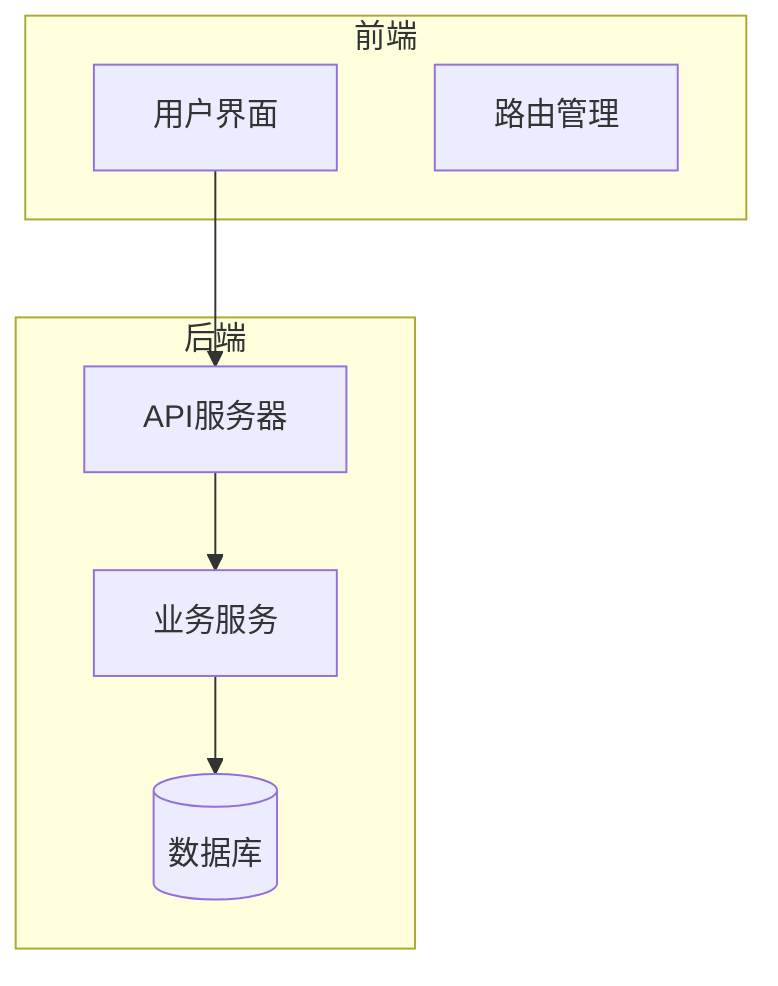
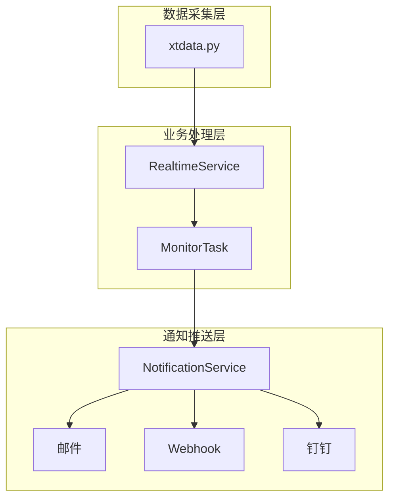
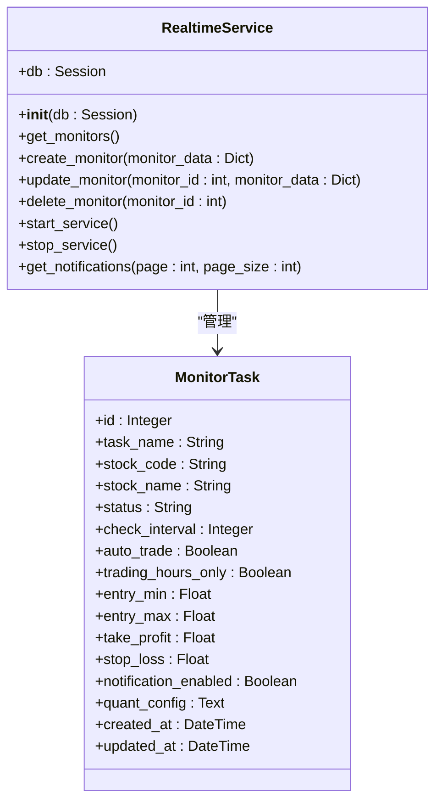
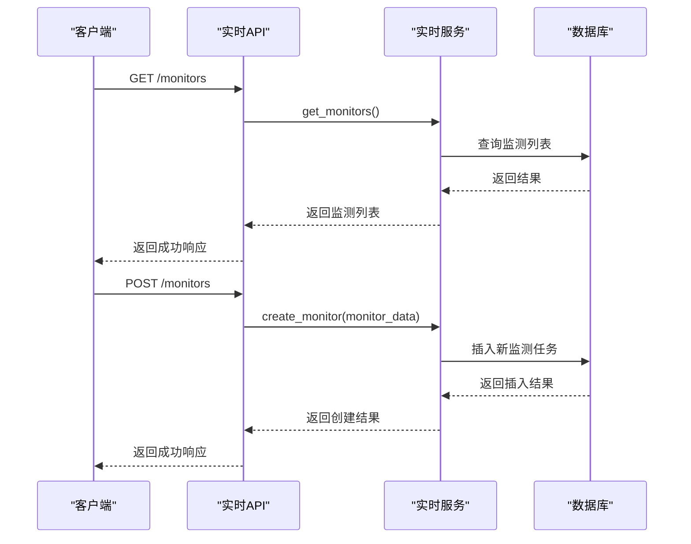
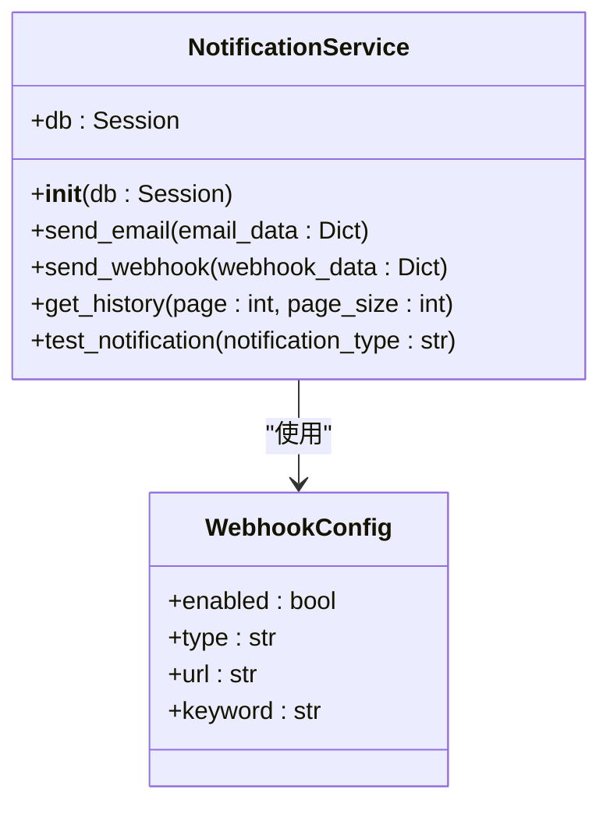
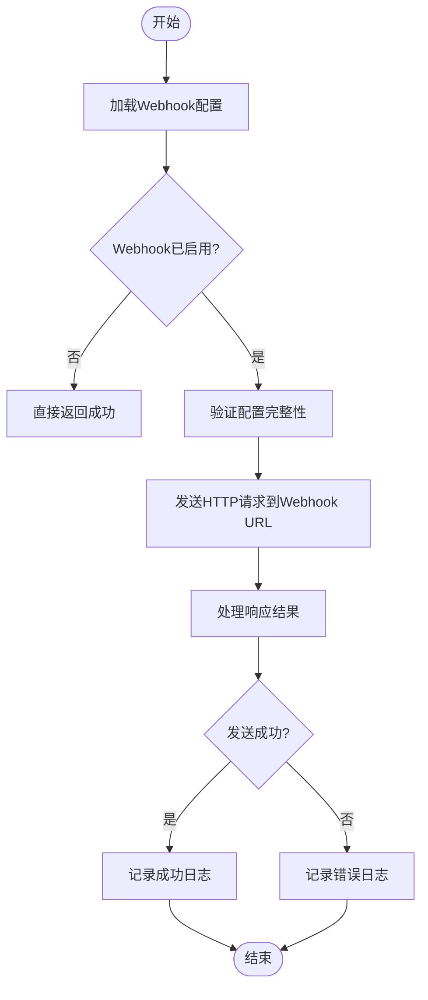
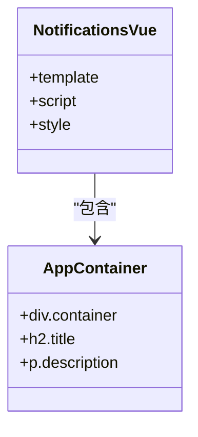

# 实时监测与通知系统

<cite>
**本文档引用的文件**   
- [realtime_service.py](file://backend/app/services/realtime_service.py)
- [notification_service.py](file://backend/app/services/notification_service.py)
- [realtime.py](file://backend/app/api/v1/realtime.py)
- [notification.py](file://backend/app/api/v1/notification.py)
- [monitor.py](file://backend/app/models/monitor.py)
- [xtdata.py](file://xtquant/xtdata.py)
- [notifications.vue](file://frontend/src/views/realtime/notifications.vue)
- [Webhook功能实现总结.md](file://docs/Webhook功能实现总结.md)
- [Webhook自定义关键词功能说明.md](file://docs/Webhook自定义关键词功能说明.md)
- [Webhook通知配置指南.md](file://docs/Webhook通知配置指南.md)
</cite>

## 目录
1. [简介](#简介)
2. [项目结构](#项目结构)
3. [核心组件](#核心组件)
4. [系统架构概述](#系统架构概述)
5. [详细组件分析](#详细组件分析)
6. [依赖关系分析](#依赖关系分析)
7. [性能考量](#性能考量)
8. [故障排查指南](#故障排查指南)
9. [结论](#结论)

## 简介
本系统旨在构建一个实时监测与通知平台，能够实现毫秒级行情监听和即时通知推送。系统通过对接xtdata.py数据源处理高频数据流，并支持邮件、Webhook、钉钉等多种通知渠道。特别地，Webhook功能支持自定义关键词配置和安全验证机制，确保消息的安全性和准确性。前端通知中心界面（notifications.vue）提供了用户友好的交互设计，使用户可以方便地管理通知历史。

## 项目结构
系统采用前后端分离架构，后端基于FastAPI框架实现，前端使用Vue.js构建。后端服务位于`backend/`目录下，包含API路由、业务逻辑和服务层；前端界面位于`frontend/`目录下，提供可视化操作界面。

**图表来源**
- [realtime.py](file://backend/app/api/v1/realtime.py)
- [notification.py](file://backend/app/api/v1/notification.py)

**章节来源**
- [realtime_service.py](file://backend/app/services/realtime_service.py)
- [notification_service.py](file://backend/app/services/notification_service.py)

## 核心组件
系统的核心组件包括实时监测服务（realtime_service.py）、通知服务（notification_service.py）以及行情数据源接口（xtdata.py）。这些组件协同工作，实现了从行情数据获取到通知推送的完整流程。

**章节来源**
- [realtime_service.py](file://backend/app/services/realtime_service.py#L8-L48)
- [notification_service.py](file://backend/app/services/notification_service.py#L8-L33)

## 系统架构概述
系统架构分为三层：数据采集层、业务处理层和通知推送层。数据采集层通过xtdata.py连接QMT量化交易平台获取实时行情数据；业务处理层负责解析数据并触发相应的监测规则；通知推送层则通过多种渠道将结果推送给用户。

**图表来源**
- [xtdata.py](file://xtquant/xtdata.py)
- [realtime_service.py](file://backend/app/services/realtime_service.py)
- [notification_service.py](file://backend/app/services/notification_service.py)

## 详细组件分析

### 实时监测服务分析
实时监测服务是系统的核心，负责管理所有监测任务的生命周期。它提供了创建、更新、删除和查询监测任务的功能，并能启动或停止整个监测服务。

#### 类图

**图表来源**
- [realtime_service.py](file://backend/app/services/realtime_service.py#L8-L48)
- [monitor.py](file://backend/app/models/monitor.py#L9-L38)

#### API调用流程

**图表来源**
- [realtime.py](file://backend/app/api/v1/realtime.py#L14-L104)
- [realtime_service.py](file://backend/app/services/realtime_service.py#L14-L32)

**章节来源**
- [realtime_service.py](file://backend/app/services/realtime_service.py#L8-L48)
- [realtime.py](file://backend/app/api/v1/realtime.py#L14-L104)

### 通知服务分析
通知服务负责处理所有类型的推送通知，包括邮件和Webhook。它支持钉钉和飞书两种Webhook类型，并实现了灵活的配置机制。

#### 类图

**图表来源**
- [notification_service.py](file://backend/app/services/notification_service.py#L8-L33)
- [Webhook自定义关键词功能说明.md](file://docs/Webhook自定义关键词功能说明.md)

#### Webhook发送流程

**图表来源**
- [notification_service.py](file://backend/app/services/notification_service.py#L19-L22)
- [Webhook功能实现总结.md](file://docs/Webhook功能实现总结.md)

**章节来源**
- [notification_service.py](file://backend/app/services/notification_service.py#L8-L33)
- [Webhook功能实现总结.md](file://docs/Webhook功能实现总结.md)

### 前端通知中心分析
前端通知中心界面（notifications.vue）为用户提供了一个简洁的界面来查看历史通知记录。

#### 组件结构

**图表来源**
- [notifications.vue](file://frontend/src/views/realtime/notifications.vue#L1-L14)

**章节来源**
- [notifications.vue](file://frontend/src/views/realtime/notifications.vue#L1-L14)

## 依赖关系分析
系统各组件之间的依赖关系清晰明确，形成了一个稳定可靠的整体架构。

```mermaid
graph TD
backend.app.services.realtime_service.RealtimeService.stop_service[stop_service]:::method
backend.app.services.realtime_service.RealtimeService.start_service[start_service]:::method
backend.app.services.realtime_service.RealtimeService.db[db]:::field
backend.app.services.realtime_service.RealtimeService[RealtimeService]:::CLASS
backend.app.services.realtime_service.RealtimeService.create_monitor[create_monitor]:::method
backend.app.services.realtime_service[realtime_service]:::module
backend.app.services.realtime_service.RealtimeService.__init__[__init__]:::method
backend.app.services.realtime_service.RealtimeService.get_monitors[get_monitors]:::method
backend.app.services.realtime_service.RealtimeService.get_notifications[get_notifications]:::method
backend.app.services.realtime_service.RealtimeService.update_monitor[update_monitor]:::method
backend.app.services.realtime_service.RealtimeService.delete_monitor[delete_monitor]:::method
backend.app.services.realtime_service.RealtimeService --> backend.app.services.realtime_service.RealtimeService.stop_service
backend.app.services.realtime_service.RealtimeService --> backend.app.services.realtime_service.RealtimeService.get_notifications
backend.app.services.realtime_service.RealtimeService --> backend.app.services.realtime_service.RealtimeService.db
backend.app.services.realtime_service.RealtimeService --> backend.app.services.realtime_service.RealtimeService.__init__
```

**图表来源**
- [realtime_service.py](file://backend/app/services/realtime_service.py)
- [notification_service.py](file://backend/app/services/notification_service.py)

**章节来源**
- [realtime_service.py](file://backend/app/services/realtime_service.py)
- [notification_service.py](file://backend/app/services/notification_service.py)

## 性能考量
系统在设计时充分考虑了性能因素，特别是在处理高频数据流方面。通过异步处理机制和合理的缓存策略，确保了系统的响应速度和稳定性。此外，Webhook发送采用了批量处理和重试机制，避免了因网络波动导致的消息丢失。

## 故障排查指南
当系统出现异常时，可按照以下步骤进行排查：
1. 检查实时监测服务是否正常运行
2. 验证数据库连接状态
3. 确认xtdata.py与QMT平台的连接是否稳定
4. 查看通知服务的日志输出，定位具体错误
5. 测试Webhook配置的有效性

**章节来源**
- [Webhook功能实现总结.md](file://docs/Webhook功能实现总结.md)
- [Webhook通知配置指南.md](file://docs/Webhook通知配置指南.md)

## 结论
本系统成功实现了毫秒级行情监听和即时通知推送功能，具备高可用性和扩展性。通过对xtdata.py数据源的有效对接，能够实时处理高频数据流，并通过多种渠道将重要信息及时推送给用户。未来可通过增加更多通知渠道和支持更复杂的监测规则来进一步提升系统能力。