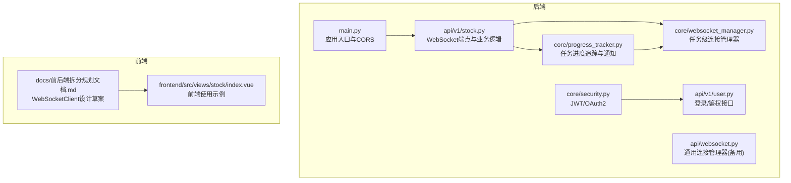
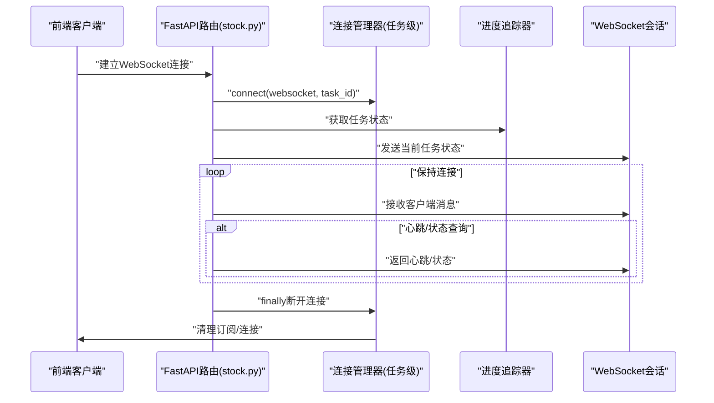
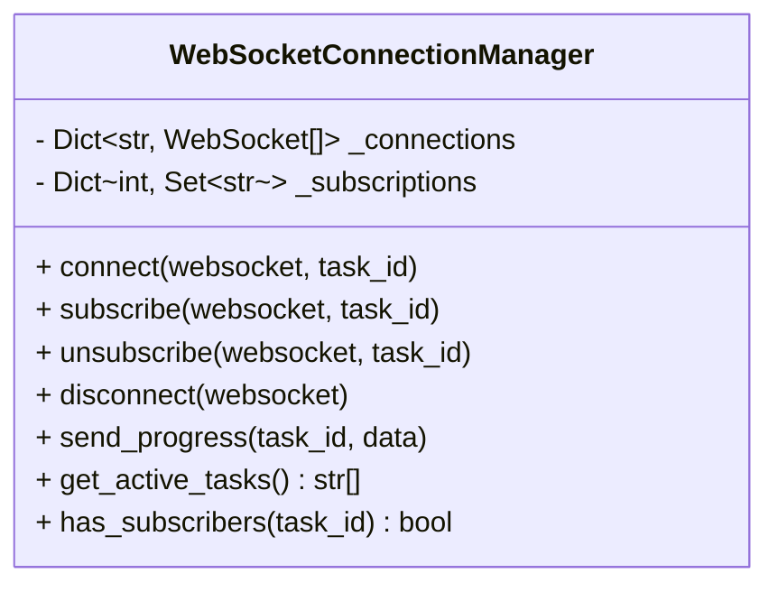
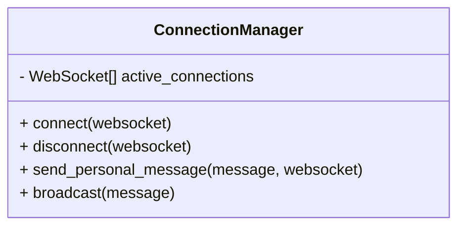
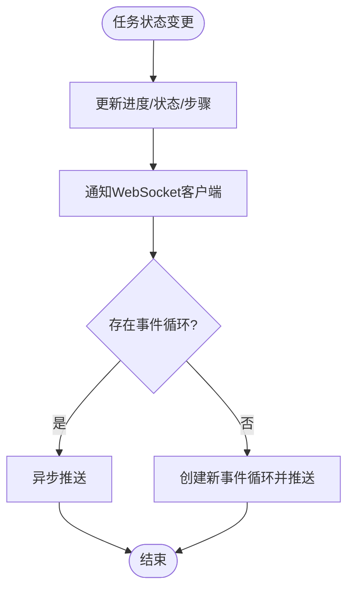
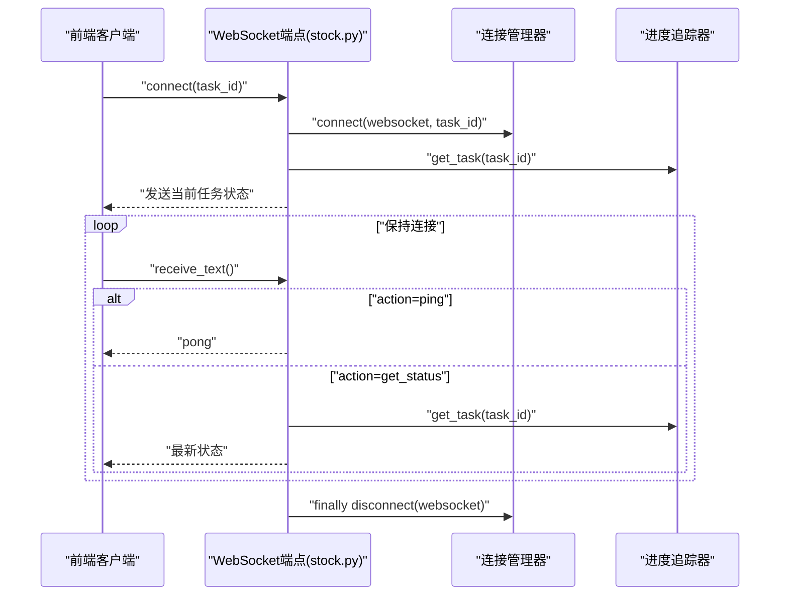
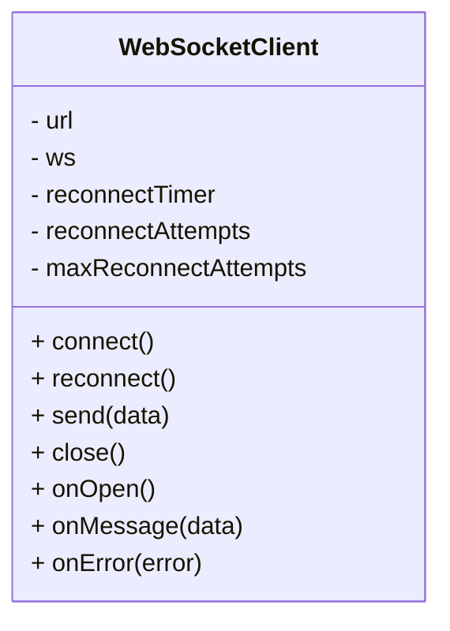
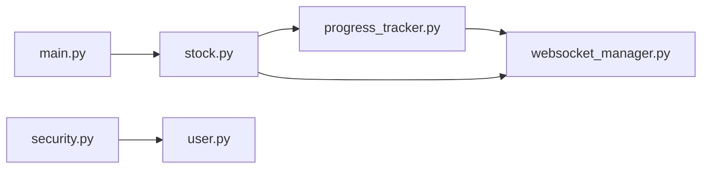

# WebSocket连接管理

<cite>
**本文引用的文件**
- [websocket_manager.py](file://backend/app/core/websocket_manager.py)
- [websocket.py](file://backend/app/api/websocket.py)
- [stock.py](file://backend/app/api/v1/stock.py)
- [progress_tracker.py](file://backend/app/core/progress_tracker.py)
- [security.py](file://backend/app/core/security.py)
- [user.py](file://backend/app/api/v1/user.py)
- [main.py](file://backend/app/main.py)
- [前后端拆分规划文档.md](file://docs/前后端拆分规划文档.md)
- [index.vue](file://frontend/src/views/stock/index.vue)
</cite>

## 目录
1. [简介](#简介)
2. [项目结构](#项目结构)
3. [核心组件](#核心组件)
4. [架构总览](#架构总览)
5. [详细组件分析](#详细组件分析)
6. [依赖关系分析](#依赖关系分析)
7. [性能考量](#性能考量)
8. [故障排查指南](#故障排查指南)
9. [结论](#结论)
10. [附录](#附录)

## 简介
本文件围绕实时任务进度推送场景，系统性梳理后端WebSocket连接管理机制与前端连接封装实践，重点覆盖：
- 后端ConnectionManager类如何维护活动连接列表、处理连接建立与断开，并实现消息广播与个人消息发送。
- 后端WebSocketConnectionManager如何按任务维度组织订阅关系，支持任务级进度广播与异常恢复。
- 前端WebSocketClient类如何封装重连机制、连接状态管理与错误处理，确保在网络不稳定时仍能保持可靠通信。
- 结合代码示例，展示连接鉴权、心跳检测与异常恢复的最佳实践，保障实时系统的稳定性与可靠性。

## 项目结构
后端采用FastAPI框架，WebSocket相关能力分布在以下模块：
- 连接管理：后端提供两类连接管理器，分别面向通用广播与任务级订阅。
- 业务路由：通过WebSocket端点向客户端推送任务进度。
- 进度追踪：负责任务生命周期与进度变更，触发WebSocket推送。
- 安全认证：提供JWT认证与OAuth2方案，便于在WebSocket握手阶段进行鉴权。

图表来源
- [main.py](file://backend/app/main.py#L1-L92)
- [stock.py](file://backend/app/api/v1/stock.py#L77-L131)
- [websocket_manager.py](file://backend/app/core/websocket_manager.py#L1-L118)
- [progress_tracker.py](file://backend/app/core/progress_tracker.py#L1-L171)
- [security.py](file://backend/app/core/security.py#L1-L38)
- [user.py](file://backend/app/api/v1/user.py#L1-L39)
- [前后端拆分规划文档.md](file://docs/前后端拆分规划文档.md#L1073-L1144)
- [index.vue](file://frontend/src/views/stock/index.vue#L921-L963)

章节来源
- [main.py](file://backend/app/main.py#L1-L92)
- [stock.py](file://backend/app/api/v1/stock.py#L77-L131)
- [websocket_manager.py](file://backend/app/core/websocket_manager.py#L1-L118)
- [progress_tracker.py](file://backend/app/core/progress_tracker.py#L1-L171)
- [security.py](file://backend/app/core/security.py#L1-L38)
- [user.py](file://backend/app/api/v1/user.py#L1-L39)
- [前后端拆分规划文档.md](file://docs/前后端拆分规划文档.md#L1073-L1144)
- [index.vue](file://frontend/src/views/stock/index.vue#L921-L963)

## 核心组件
- 任务级连接管理器：按任务ID聚合订阅者，支持订阅/取消订阅、断开清理、进度广播与活跃任务查询。
- 通用连接管理器：维护全局活动连接列表，提供广播与个人消息发送能力。
- 进度追踪器：记录任务状态与进度，变更时触发WebSocket推送。
- WebSocket端点：在业务层建立连接、下发初始状态、维持长连接并处理心跳与状态查询。
- 安全认证：提供JWT/OAuth2方案，便于在WebSocket握手阶段进行鉴权。

章节来源
- [websocket_manager.py](file://backend/app/core/websocket_manager.py#L1-L118)
- [websocket.py](file://backend/app/api/websocket.py#L1-L41)
- [progress_tracker.py](file://backend/app/core/progress_tracker.py#L1-L171)
- [stock.py](file://backend/app/api/v1/stock.py#L77-L131)
- [security.py](file://backend/app/core/security.py#L1-L38)

## 架构总览
后端通过WebSocket端点建立连接，连接管理器负责订阅关系与消息分发；进度追踪器在任务状态变化时触发推送；前端通过WebSocketClient封装连接、重连与错误处理。

图表来源
- [stock.py](file://backend/app/api/v1/stock.py#L77-L131)
- [websocket_manager.py](file://backend/app/core/websocket_manager.py#L23-L102)
- [progress_tracker.py](file://backend/app/core/progress_tracker.py#L110-L138)

## 详细组件分析

### 后端任务级连接管理器（WebSocketConnectionManager）
- 维护结构
  - 按任务ID聚合连接列表，便于任务级广播。
  - 维护每个连接的订阅集合，支持订阅/取消订阅与断开清理。
- 关键方法
  - connect：接受连接并可选择订阅任务。
  - subscribe/unsubscribe：维护订阅关系。
  - disconnect：断开连接并清理订阅。
  - send_progress：对指定任务的所有订阅者广播进度，自动清理断开连接。
  - get_active_tasks/has_subscribers：查询活跃任务与订阅状态。
- 错误处理
  - 发送失败时记录错误并清理断开连接，避免僵尸连接占用资源。

图表来源
- [websocket_manager.py](file://backend/app/core/websocket_manager.py#L1-L118)

章节来源
- [websocket_manager.py](file://backend/app/core/websocket_manager.py#L1-L118)

### 后端通用连接管理器（ConnectionManager）
- 维护全局活动连接列表。
- 提供个人消息发送与广播能力，广播时自动移除断开连接。
- 适用于无需任务维度隔离的通用场景。

图表来源
- [websocket.py](file://backend/app/api/websocket.py#L1-L41)

章节来源
- [websocket.py](file://backend/app/api/websocket.py#L1-L41)

### 进度追踪器（ProgressTracker）
- 任务生命周期管理：创建、更新进度、完成、失败。
- 事件通知：任务状态变更时调用WebSocket推送（异步），在无事件循环时自动创建临时循环。
- 查询接口：获取单个任务、活跃任务列表与清理旧任务。

图表来源
- [progress_tracker.py](file://backend/app/core/progress_tracker.py#L45-L138)

章节来源
- [progress_tracker.py](file://backend/app/core/progress_tracker.py#L1-L171)

### WebSocket端点（stock.py）
- 路由：/api/v1/stock/ws/analyze/{task_id}
- 行为：
  - 建立连接并可订阅任务。
  - 立即发送当前任务状态。
  - 保持连接，监听客户端消息，支持心跳与状态查询。
  - finally阶段断开连接并清理订阅。
- 心跳与状态查询：客户端发送包含action的消息，服务端返回心跳或最新状态。

图表来源
- [stock.py](file://backend/app/api/v1/stock.py#L77-L131)
- [websocket_manager.py](file://backend/app/core/websocket_manager.py#L23-L102)
- [progress_tracker.py](file://backend/app/core/progress_tracker.py#L110-L138)

章节来源
- [stock.py](file://backend/app/api/v1/stock.py#L77-L131)

### 前端WebSocketClient（设计草案）
- 设计要点
  - 封装连接、消息处理、错误与关闭回调。
  - 提供指数退避或固定间隔重连，限制最大重连次数。
  - 提供发送与关闭方法，确保在关闭时清理定时器。
- 使用建议
  - 在组件挂载时初始化并连接，组件销毁时关闭连接。
  - 对onOpen/onMessage/onError/onClose进行具体业务绑定。

图表来源
- [前后端拆分规划文档.md](file://docs/前后端拆分规划文档.md#L1073-L1144)

章节来源
- [前后端拆分规划文档.md](file://docs/前后端拆分规划文档.md#L1073-L1144)

### 前端使用示例（index.vue）
- 页面加载时检查活跃任务，若存在则提示用户是否继续查看并恢复任务。
- 通过resumeTask设置当前任务ID并显示进度面板。
- 处理WebSocket错误并提示用户刷新重试。

章节来源
- [index.vue](file://frontend/src/views/stock/index.vue#L921-L963)

## 依赖关系分析
- 进度追踪器依赖连接管理器进行任务级广播。
- WebSocket端点依赖连接管理器与进度追踪器。
- 应用入口配置CORS，保证跨域WebSocket握手。
- 安全模块提供JWT/OAuth2，可用于在WebSocket握手阶段进行鉴权。

图表来源
- [progress_tracker.py](file://backend/app/core/progress_tracker.py#L110-L138)
- [websocket_manager.py](file://backend/app/core/websocket_manager.py#L1-L118)
- [stock.py](file://backend/app/api/v1/stock.py#L77-L131)
- [security.py](file://backend/app/core/security.py#L1-L38)
- [user.py](file://backend/app/api/v1/user.py#L1-L39)
- [main.py](file://backend/app/main.py#L1-L92)

章节来源
- [progress_tracker.py](file://backend/app/core/progress_tracker.py#L1-L171)
- [websocket_manager.py](file://backend/app/core/websocket_manager.py#L1-L118)
- [stock.py](file://backend/app/api/v1/stock.py#L77-L131)
- [security.py](file://backend/app/core/security.py#L1-L38)
- [user.py](file://backend/app/api/v1/user.py#L1-L39)
- [main.py](file://backend/app/main.py#L1-L92)

## 性能考量
- 广播效率
  - 任务级广播仅针对订阅者集合，避免对无关客户端发送消息。
  - 发送失败时及时清理断开连接，降低无效连接数量。
- 事件循环
  - 进度追踪器在无事件循环时自动创建临时循环推送，避免阻塞主线程。
- 资源管理
  - finally阶段断开连接，确保订阅关系与连接对象被正确释放。
- 前端重连
  - 固定间隔重连配合最大重连次数，避免无限重试导致资源浪费。

[本节为通用指导，不直接分析具体文件]

## 故障排查指南
- 常见问题
  - 连接无法建立：检查CORS配置与端点路径，确认客户端URL与后端路由一致。
  - 无消息推送：确认任务是否存在且状态已更新；检查连接管理器的订阅关系与活跃任务列表。
  - 心跳失效：客户端需发送包含action的消息，服务端仅在解析成功时返回心跳或状态。
  - 前端连接异常：查看控制台错误输出，确认重连逻辑是否生效；必要时手动关闭并重新连接。
- 定位步骤
  - 后端：查看连接管理器日志与异常处理分支，确认断开清理是否执行。
  - 前端：在组件销毁时显式关闭连接，避免内存泄漏；在onError中记录错误详情。
  - 鉴权：如需在WebSocket握手阶段鉴权，可在路由中增加OAuth2校验逻辑。

章节来源
- [websocket_manager.py](file://backend/app/core/websocket_manager.py#L67-L102)
- [stock.py](file://backend/app/api/v1/stock.py#L103-L131)
- [index.vue](file://frontend/src/views/stock/index.vue#L921-L963)

## 结论
本项目在后端提供了两种WebSocket连接管理器以满足不同场景需求：通用广播与任务级订阅。通过进度追踪器与WebSocket端点的协同，实现了高效、可靠的实时进度推送。前端通过WebSocketClient封装重连与错误处理，增强了在不稳定网络下的健壮性。结合鉴权与心跳机制，整体方案具备良好的扩展性与稳定性。

[本节为总结性内容，不直接分析具体文件]

## 附录

### 最佳实践清单
- 连接鉴权
  - 在WebSocket端点处增加OAuth2/JWT校验，拒绝未授权连接。
- 心跳检测
  - 客户端定期发送心跳消息，服务端返回心跳确认；超时未收到心跳时主动断开。
- 异常恢复
  - 服务端对发送失败的连接进行清理；前端按固定间隔重连并限制最大次数。
- 资源管理
  - 组件销毁时关闭WebSocket连接，清理定时器与订阅关系。
- 日志与监控
  - 记录连接建立/断开、订阅/取消订阅、发送失败等关键事件，便于问题定位。

[本节为通用指导，不直接分析具体文件]