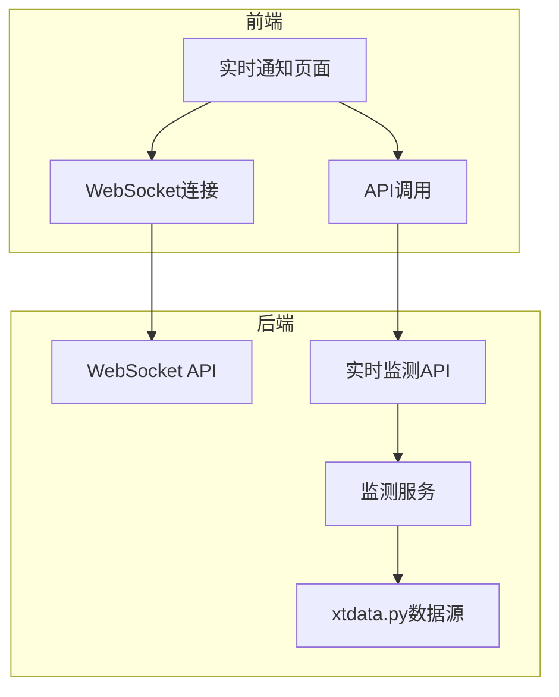
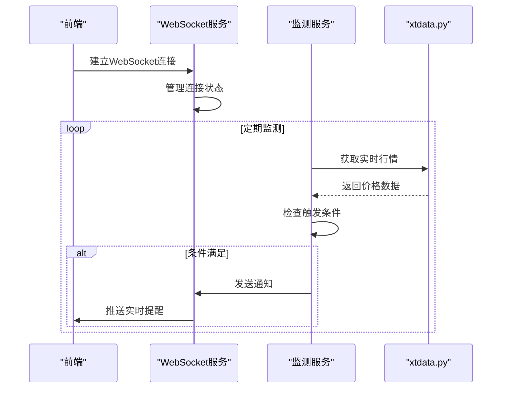
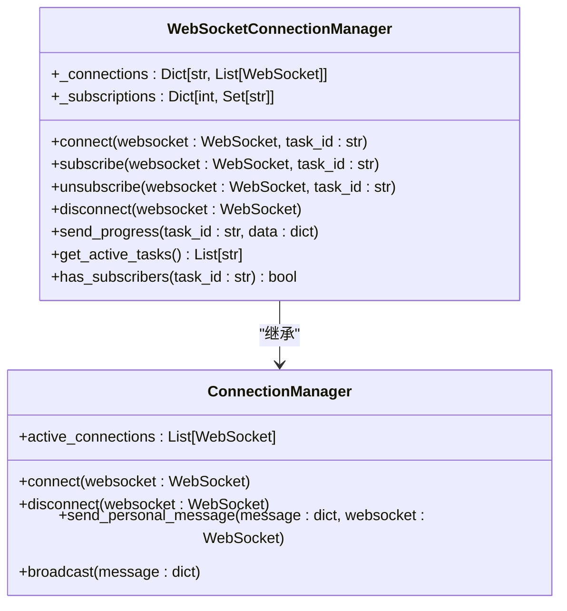
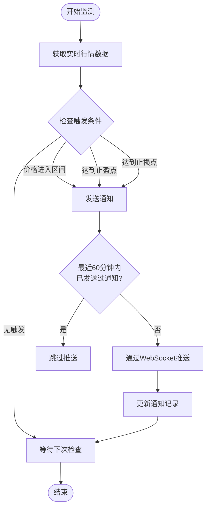
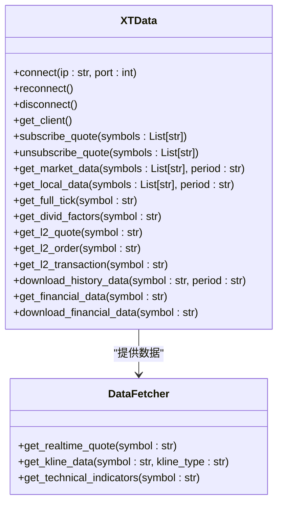
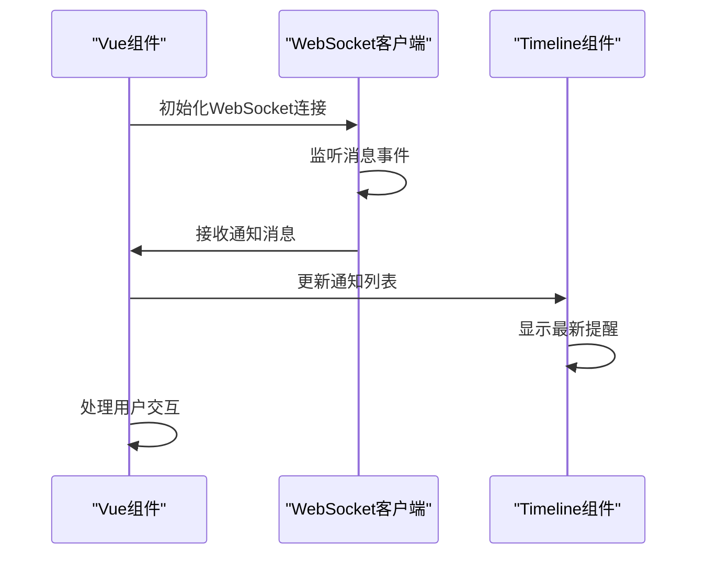
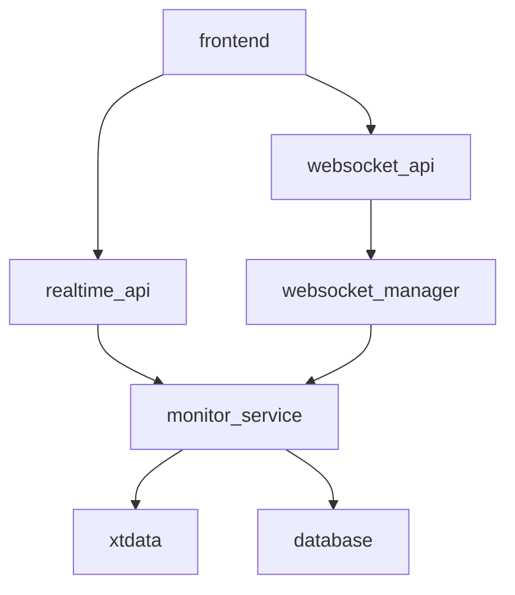

# 实时数据推送

<cite>
**本文档引用的文件**  
- [websocket.py](file://backend/app/api/websocket.py)
- [websocket_manager.py](file://backend/app/core/websocket_manager.py)
- [realtime.py](file://backend/app/api/v1/realtime.py)
- [realtime_service.py](file://backend/app/services/realtime_service.py)
- [monitor_service.py](file://backend/app/services/monitor_service.py)
- [xtdata.py](file://xtquant/xtdata.py)
- [realtime.js](file://frontend/src/api/realtime.js)
- [notifications.vue](file://frontend/src/views/realtime/notifications.vue)
- [monitor.py](file://backend/app/api/v1/monitor.py)
- [monitor.py](file://old/monitor_service.py)
</cite>

## 目录
1. [引言](#引言)
2. [项目结构](#项目结构)
3. [核心组件](#核心组件)
4. [架构概述](#架构概述)
5. [详细组件分析](#详细组件分析)
6. [依赖分析](#依赖分析)
7. [性能考虑](#性能考虑)
8. [故障排除指南](#故障排除指南)
9. [结论](#结论)

## 引言
本文档深入阐述了基于WebSocket的实时数据推送机制，重点介绍实时通知系统的实现。系统通过WebSocket连接将价格变动、区间突破等实时事件推送到前端，并在UI上即时更新。后端集成xtdata.py实时行情数据源，处理高频数据流并进行条件匹配。文档详细说明了通知消息的格式设计、推送频率控制和去重策略，确保用户获得及时且不冗余的提醒。结合前端timeline组件，展示了最新提醒的展示逻辑和用户交互体验。

## 项目结构
本项目采用前后端分离架构，后端基于FastAPI框架，前端使用Vue.js构建。实时数据推送功能主要涉及后端的WebSocket服务、实时监测服务和前端的实时通知页面。

**图表来源**  
- [realtime.py](file://backend/app/api/v1/realtime.py)
- [websocket.py](file://backend/app/api/websocket.py)
- [monitor_service.py](file://backend/app/services/monitor_service.py)

**本节来源**  
- [realtime.py](file://backend/app/api/v1/realtime.py)
- [websocket.py](file://backend/app/api/websocket.py)
- [monitor_service.py](file://backend/app/services/monitor_service.py)

## 核心组件
系统的核心组件包括WebSocket连接管理器、实时监测服务和xtdata.py行情数据源。WebSocket连接管理器负责维护客户端连接，实时监测服务负责检查股票价格是否满足预设条件，xtdata.py提供实时行情数据。

**本节来源**  
- [websocket_manager.py](file://backend/app/core/websocket_manager.py)
- [monitor_service.py](file://backend/app/services/monitor_service.py)
- [xtdata.py](file://xtquant/xtdata.py)

## 架构概述
系统采用分层架构，前端通过WebSocket与后端建立持久连接，后端实时监测服务定期从xtdata.py获取最新行情数据，当价格满足预设条件时，通过WebSocket向订阅的客户端推送通知。

**图表来源**  
- [websocket_manager.py](file://backend/app/core/websocket_manager.py)
- [monitor_service.py](file://backend/app/services/monitor_service.py)
- [xtdata.py](file://xtquant/xtdata.py)

## 详细组件分析

### WebSocket连接管理分析
WebSocket连接管理器负责管理所有活跃的WebSocket连接，支持按任务ID订阅和取消订阅，确保消息只推送给相关的客户端。

**图表来源**  
- [websocket_manager.py](file://backend/app/core/websocket_manager.py)
- [websocket.py](file://backend/app/api/websocket.py)

**本节来源**  
- [websocket_manager.py](file://backend/app/core/websocket_manager.py)
- [websocket.py](file://backend/app/api/websocket.py)

### 实时监测服务分析
实时监测服务负责检查股票价格是否满足预设的进场区间、止盈止损等条件，当条件满足时生成通知并通过WebSocket推送。

**图表来源**  
- [monitor_service.py](file://backend/app/services/monitor_service.py)
- [old/monitor_service.py](file://old/monitor_service.py)

**本节来源**  
- [monitor_service.py](file://backend/app/services/monitor_service.py)
- [old/monitor_service.py](file://old/monitor_service.py)

### xtdata.py数据源分析
xtdata.py是系统集成的实时行情数据源，提供股票的实时报价、K线数据、财务数据等，支持订阅和取消订阅行情。

**图表来源**  
- [xtdata.py](file://xtquant/xtdata.py)
- [TDX数据源快速配置.md](file://docs/TDX数据源快速配置.md)

**本节来源**  
- [xtdata.py](file://xtquant/xtdata.py)
- [TDX数据源快速配置.md](file://docs/TDX数据源快速配置.md)

### 前端实时通知分析
前端通过WebSocket连接接收实时通知，并使用timeline组件展示最新提醒，提供良好的用户交互体验。

**图表来源**  
- [notifications.vue](file://frontend/src/views/realtime/notifications.vue)
- [realtime.js](file://frontend/src/api/realtime.js)
- [前后端拆分规划文档.md](file://docs/前后端拆分规划文档.md)

**本节来源**  
- [notifications.vue](file://frontend/src/views/realtime/notifications.vue)
- [realtime.js](file://frontend/src/api/realtime.js)

## 依赖分析
系统各组件之间的依赖关系清晰，后端服务依赖于数据库和实时行情数据源，前端依赖于后端API和WebSocket服务。

**图表来源**  
- [websocket.py](file://backend/app/api/websocket.py)
- [realtime.py](file://backend/app/api/v1/realtime.py)
- [monitor_service.py](file://backend/app/services/monitor_service.py)
- [xtdata.py](file://xtquant/xtdata.py)

**本节来源**  
- [websocket.py](file://backend/app/api/websocket.py)
- [realtime.py](file://backend/app/api/v1/realtime.py)
- [monitor_service.py](file://backend/app/services/monitor_service.py)

## 性能考虑
系统在设计时考虑了性能优化，包括WebSocket连接的复用、通知的去重策略、行情数据的批量获取等，确保在高并发场景下的稳定运行。

## 故障排除指南
当实时通知功能出现问题时，可按照以下步骤进行排查：
1. 检查WebSocket连接是否正常建立
2. 确认监测服务是否已启动
3. 验证xtdata.py数据源连接是否正常
4. 检查数据库连接和表结构是否正确
5. 查看日志文件中的错误信息

**本节来源**  
- [websocket_manager.py](file://backend/app/core/websocket_manager.py)
- [monitor_service.py](file://backend/app/services/monitor_service.py)
- [xtdata.py](file://xtquant/xtdata.py)

## 结论
本文档详细阐述了实时数据推送机制的实现，包括WebSocket连接管理、实时监测服务、xtdata.py数据源集成和前端通知展示。系统通过高效的架构设计和优化策略，实现了低延迟、高可靠性的实时通知功能，为用户提供及时的市场动态提醒。